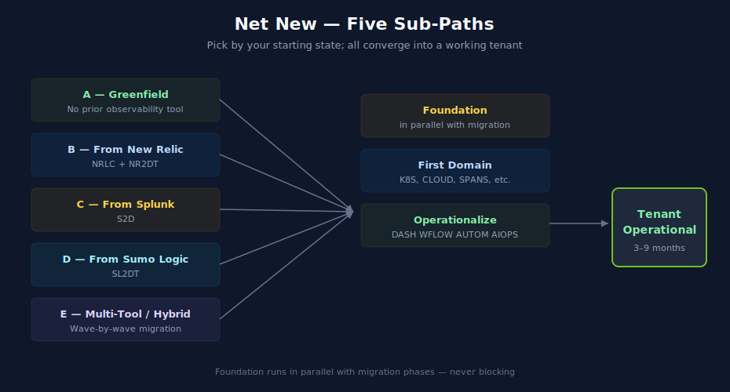

# Doorway 1 — Net New

> **Purpose:** Reading order for customers starting with a net-new Dynatrace tenant — whether greenfield (no prior observability platform) or migrating from another tool. Routes through Foundation, then migration-specific phases (if applicable), then Domain Enablement and Operationalize.
> **Last Updated:** 07/15/2026

---

## Table of Contents

1. [You Are Here If…](#you-are-here-if)
2. [Shared Prologue: Tenant and Account](#shared-prologue-tenant-and-account)
3. [Pick Your Sub-Path](#pick-your-sub-path)
4. [Sub-Path A — Greenfield](#sub-path-a--greenfield)
5. [Sub-Path B — From New Relic](#sub-path-b--from-new-relic)
6. [Sub-Path C — From Splunk](#sub-path-c--from-splunk)
7. [Sub-Path D — From Sumo Logic](#sub-path-d--from-sumo-logic)
8. [Sub-Path E — Multi-Tool / Hybrid](#sub-path-e--multi-tool--hybrid)
9. [Shared Epilogue: Where to Next](#shared-epilogue-where-to-next)

---

## You Are Here If…

- You are net-new to Dynatrace (first tenant being provisioned)
- You may or may not have a prior observability tool to migrate from
- The end state is a working Dynatrace tenant covering your priority domains, with operational dashboards, alerting, and access controls in place

If instead you already have a Dynatrace tenant and are adding scope or pulling data from another tool, see [Doorway 2 — Expanding or Consolidating](02-expand-consolidate.md). If you are migrating an existing Dynatrace deployment between deployment models, see [Doorway 3 — Deployment Migration](03-deployment-migration.md).

---

## Shared Prologue: Tenant and Account

Before any sub-path: get the tenant operational at the account level.

| Step | Reading | Notes |
|---|---|---|
| 1. License & tenant provisioning | [NR2DT](../NR2DT%20-%20New%20Relic%20to%20Dynatrace%20Migration%20Steps/) — notebook 00 (Step 0 prerequisites) | Generalizable beyond New Relic — covers tenant decisions, region, SaaS vs Managed, account hierarchy |
| 2. Initial admin access | [ONBRD](../ONBRD%20-%20Dynatrace%20Onboarding/) — notebook 01 (First Steps) | First-user access, navigation orientation |
| 3. Authentication strategy | [IAM](../IAM%20-%20IAM%20Administration/) — notebook 02 (SSO Authentication) | Decide SSO method before adding more users |

Time: 1–3 days, depending on procurement and SSO complexity.

---

## Pick Your Sub-Path

| If your starting state is… | Go to… | Approximate timeline |
|---|---|---|
| No prior observability platform | [Sub-Path A — Greenfield](#sub-path-a--greenfield) | 2–6 months |
| New Relic, planning to fully replace | [Sub-Path B — From New Relic](#sub-path-b--from-new-relic) | 4–9 months |
| Splunk (logs and dashboards primarily) | [Sub-Path C — From Splunk](#sub-path-c--from-splunk) | 4–9 months |
| Sumo Logic (logs and dashboards primarily) | [Sub-Path D — From Sumo Logic](#sub-path-d--from-sumo-logic) | 4–9 months |
| Multiple tools (e.g., NR for APM + Splunk for logs) OR security observability mandate | [Sub-Path E – Multi-Tool / Hybrid](#sub-path-e--multi-tool--hybrid) | 6–12 months |

---

## Sub-Path A — Greenfield

You have no prior observability tool. You are building the practice from zero alongside Dynatrace.

| Phase | Reading | Time |
|---|---|---|
| 1. Foundation | [Foundation Module](04-foundation.md) → [ONBRD](../ONBRD%20-%20Dynatrace%20Onboarding/) + [ORGNZ](../ORGNZ%20-%20Organize%20Data:%20Buckets,%20Segments,%20Security/) + [IAM](../IAM%20-%20IAM%20Administration/) in parallel | 2–3 weeks |
| 2. Security posture | [APPSEC](../APPSEC%20—%20Application%20Security/) — notebooks 01–02 (fundamentals, platform overview) | 1 week |
| 3. First domain | Pick one from [Domain Enablement](05-domain-enablement.md). For most customers this is [K8S](../K8S%20-%20Kubernetes%20Monitoring/) (if Kubernetes is in scope) or [CLOUD](../CLOUD%20-%20Cloud%20Provider%20Integrations/) (if AWS, Azure, or GCP). | 1–2 weeks |
| 3. First app coverage | [SPANS](../SPANS%20-%20Distributed%20Tracing%20and%20Spans/) for distributed tracing on a critical app; add [WEBRUM](../WEBRUM%20-%20Web%20Real%20User%20Monitoring/) if web-facing | 1–2 weeks |
| 4. Light operationalize | [DASH](../DASH%20-%20Dashboard%20Design%20&%20Building/) notebooks 01..03 (fundamentals, hierarchy, executive); [WFLOW](../WFLOW%20-%20Workflows%20and%20Alert%20Notifications/) notebooks 01..03 (fundamentals, triggers, notification basics) | 1–2 weeks |
| 5. Iterate | Add domains as adoption grows. Reference [Domain Enablement Module](05-domain-enablement.md). | Ongoing |

Exit criteria: At least one domain producing useful data; one critical app fully traced; basic dashboards and alerts running.

Sidebar — if you have any existing tool: even if it's a small footprint of synthetic monitors or a few dashboards, follow the relevant migration sub-path (B, C, D, or E) instead of greenfield. Even a small inventory benefits from translation patterns rather than parallel rebuild.

---

## Sub-Path B — From New Relic

You are replacing New Relic with Dynatrace. The migration uses [NR2DT](../NR2DT%20-%20New%20Relic%20to%20Dynatrace%20Migration%20Steps/) as the procedural backbone and [NRLC](../NRLC%20-%20New%20Relic%20to%20Dynatrace%20Migration%20Deep%20Dives/) for component-level depth.

| Phase | Reading | Time |
|---|---|---|
| 1. Pre-flight | [NR2DT](../NR2DT%20-%20New%20Relic%20to%20Dynatrace%20Migration%20Steps/) — notebook 00 (Step 0 prerequisites) | 1 week |
| 2. Discover & strategize | [NR2DT](../NR2DT%20-%20New%20Relic%20to%20Dynatrace%20Migration%20Steps/) — notebooks 01 (discover), 02 (strategize); [NRLC](../NRLC%20-%20New%20Relic%20to%20Dynatrace%20Migration%20Deep%20Dives/) — notebook 01 (platform comparison) | 2–3 weeks |
| 3. Foundation in parallel | [Foundation Module](04-foundation.md) — runs alongside Phases 4–5; do not block migration on Foundation | 2–3 weeks |
| 4. Design & translate | [NR2DT](../NR2DT%20-%20New%20Relic%20to%20Dynatrace%20Migration%20Steps/) — notebooks 03 (design), 04 (translate); [NRLC](../NRLC%20-%20New%20Relic%20to%20Dynatrace%20Migration%20Deep%20Dives/) — notebook 02 (NRQL → DQL) | 3–4 weeks |
| 5. Component migration | [NR2DT](../NR2DT%20-%20New%20Relic%20to%20Dynatrace%20Migration%20Steps/) — notebooks 05 (dashboards/alerts), 06 (synthetics/SLOs/workloads), 07 (logs/tags/drops); [NRLC](../NRLC%20-%20New%20Relic%20to%20Dynatrace%20Migration%20Deep%20Dives/) — notebooks 03..07 for each component | 8–16 weeks |
| 6. Validation | [NR2DT](../NR2DT%20-%20New%20Relic%20to%20Dynatrace%20Migration%20Steps/) — notebook 08 (validate); [NRLC](../NRLC%20-%20New%20Relic%20to%20Dynatrace%20Migration%20Deep%20Dives/) — notebook 08 (validation, diff, rollback) | 2–3 weeks |
| 7. Cutover | [NR2DT](../NR2DT%20-%20New%20Relic%20to%20Dynatrace%20Migration%20Steps/) — notebook 09 (cutover, rollback, decommission) | 1–2 weeks |
| 8. Operationalize | [Operationalize Module](06-operationalize.md) | 4–8 weeks |
| 9. Summary & lessons | [NR2DT](../NR2DT%20-%20New%20Relic%20to%20Dynatrace%20Migration%20Steps/) — notebook 99; [NRLC](../NRLC%20-%20New%20Relic%20to%20Dynatrace%20Migration%20Deep%20Dives/) — notebook 09 (toolchain reference) | Ongoing |

Pairing convention: NRLC notebooks pair with each NR2DT step — NR2DT-04 with NRLC-02, NR2DT-05 with NRLC-03 and NRLC-04, NR2DT-06 with NRLC-05 and NRLC-06, NR2DT-07 with NRLC-07. NR2DT is the procedural runbook ("what to do when"); NRLC is the depth reference ("how to translate this component specifically").

---

## Sub-Path C — From Splunk

You are replacing or significantly reducing Splunk usage. Primarily a log + dashboard + alert migration. Uses [S2D](../S2D%20-%20Splunk%20to%20Dynatrace%20Migration/) as the procedural backbone.

| Phase | Reading | Time |
|---|---|---|
| 1. Pre-flight & inventory | [NR2DT](../NR2DT%20-%20New%20Relic%20to%20Dynatrace%20Migration%20Steps/) — notebook 00 (tenant prereqs, generalizes to any source); [S2D](../S2D%20-%20Splunk%20to%20Dynatrace%20Migration/) — notebooks 01 (getting started), 02 (locating logs) | 1–2 weeks |
| 2. Foundation in parallel | [Foundation Module](04-foundation.md) — emphasis on [ORGNZ](../ORGNZ%20-%20Organize%20Data:%20Buckets,%20Segments,%20Security/) bucket strategy (notebooks 02–03), critical for log routing decisions | 2–3 weeks |
| 3. Routing & ingestion design | [OPLOGS](../OPLOGS%20-%20OpenPipeline%20Logs/) — notebooks 01–03 (fundamentals, migration, pipeline processing); [OPIPE](../OPIPE%20-%20OpenPipeline%20Beyond%20Logs/) — notebook 01 (multi-scope platform) | 2–3 weeks |
| 4. SPL → DQL translation | [S2D](../S2D%20-%20Splunk%20to%20Dynatrace%20Migration/) — notebook 03 (SPL to DQL) | 3–4 weeks |
| 5. Detector & alert migration | [S2D](../S2D%20-%20Splunk%20to%20Dynatrace%20Migration/) — notebooks 04 (anomaly detectors), 05 (workflow alerts) | 3–4 weeks |
| 6. Metric extraction & dashboard migration | [S2D](../S2D%20-%20Splunk%20to%20Dynatrace%20Migration/) — notebooks 06 (arrayMovingSum), 07 (metric creation), 08 (dashboard migration) | 3–6 weeks |
| 7. Naming standards & validation | [S2D](../S2D%20-%20Splunk%20to%20Dynatrace%20Migration/) — notebook 09 (naming standards); side-by-side validation against Splunk | 1–2 weeks |
| 8. Cutover | Cut Splunk forwarders by source; validate parity; decommission | 1–2 weeks |
| 9. Operationalize | [Operationalize Module](06-operationalize.md) | 4–8 weeks |

Cross-reference: [SL2DT](../SL2DT%20-%20Sumo%20Logic%20to%20Dynatrace/) covers similar terrain (logs from another tool). The [SL2DT](../SL2DT%20-%20Sumo%20Logic%20to%20Dynatrace/) notebook 03 (log ingest architecture) is also useful as background reading for Splunk migration.

---

## Sub-Path D — From Sumo Logic

You are replacing or significantly reducing Sumo Logic usage. Primarily a log + dashboard + monitor migration. Uses [SL2DT](../SL2DT%20-%20Sumo%20Logic%20to%20Dynatrace/) as the procedural backbone. Gen3 SaaS only.

| Phase | Reading | Time |
|---|---|---|
| 1. Pre-flight & inventory | [NR2DT](../NR2DT%20-%20New%20Relic%20to%20Dynatrace%20Migration%20Steps/) — notebook 00 (tenant prereqs); [SL2DT](../SL2DT%20-%20Sumo%20Logic%20to%20Dynatrace/) — notebooks 01 (overview/strategy), 02 (assessment/inventory) | 1–2 weeks |
| 2. Log ingest architecture | [SL2DT](../SL2DT%20-%20Sumo%20Logic%20to%20Dynatrace/) — notebook 03 (log ingest architecture); [OPLOGS](../OPLOGS%20-%20OpenPipeline%20Logs/) — notebooks 01–03 | 2–3 weeks |
| 3. Foundation in parallel | [Foundation Module](04-foundation.md) — emphasis on [ORGNZ](../ORGNZ%20-%20Organize%20Data:%20Buckets,%20Segments,%20Security/) bucket strategy and `_sourceCategory` mapping | 2–3 weeks |
| 4. SumoQL → DQL translation | [SL2DT](../SL2DT%20-%20Sumo%20Logic%20to%20Dynatrace/) — notebook 04 (SumoQL → DQL) | 3–4 weeks |
| 5. Monitor & dashboard migration | [SL2DT](../SL2DT%20-%20Sumo%20Logic%20to%20Dynatrace/) — notebooks 05 (monitor and alert conversion), 06 (dashboard conversion) | 3–6 weeks |
| 6. Governance & access | [SL2DT](../SL2DT%20-%20Sumo%20Logic%20to%20Dynatrace/) — notebook 07 (user governance and access) | 1–2 weeks |
| 7. Automation | [SL2DT](../SL2DT%20-%20Sumo%20Logic%20to%20Dynatrace/) — notebook 08 (automation and GitOps); cross-reference [AUTOM](../AUTOM%20-%20Dynatrace%20Automation/) | 1–2 weeks |
| 8. Cutover | [SL2DT](../SL2DT%20-%20Sumo%20Logic%20to%20Dynatrace/) — notebook 09 (cutover, validation, decommission) | 1–2 weeks |
| 9. Operationalize | [Operationalize Module](06-operationalize.md) | 4–8 weeks |
| Reference | [SL2DT](../SL2DT%20-%20Sumo%20Logic%20to%20Dynatrace/) — notebook 99 (summary, runbook index) | Ongoing |

---

## Sub-Path E — Multi-Tool / Hybrid

You have multiple source tools (e.g., New Relic for APM, Splunk or Sumo Logic for logs, native cloud for infrastructure metrics), or you have a security observability mandate alongside APM/infrastructure. The migration runs in waves rather than sequentially.

Recommended sequencing:

| Wave | Focus | Reading |
|---|---|---|
| 1 | Foundation | [Foundation Module](04-foundation.md) — first; everything else depends on it |
| 2 | Security observability | [APPSEC](../APPSEC%20—%20Application%20Security/) — full series; run in parallel with Wave 3 if security is a mandate |
| 3 | APM (highest pain to migrate, shortest dual-run window) | [Sub-Path B](#sub-path-b--from-new-relic) phases 4–7 if from New Relic; otherwise [SPANS](../SPANS%20-%20Distributed%20Tracing%20and%20Spans/) + [OTEL](../OTEL%20-%20OpenTelemetry%20Integration/) for native instrumentation |
| 4 | Infrastructure | [K8S](../K8S%20-%20Kubernetes%20Monitoring/) and/or [CLOUD](../CLOUD%20-%20Cloud%20Provider%20Integrations/), depending on environment |
| 5 | Logs | [Sub-Path C](#sub-path-c--from-splunk) or [Sub-Path D](#sub-path-d--from-sumo-logic) |
| 6 | Frontend | [WEBRUM](../WEBRUM%20-%20Web%20Real%20User%20Monitoring/), [MOBL](../MOBL%20-%20Mobile%20Monitoring/) |
| 7 | Synthetic, business events, databases | [SYNTH](../SYNTH%20-%20Synthetic%20Monitoring/), [BIZEV](../BIZEV%20-%20Business%20Events%20&%20Funnel%20Analysis/), [DBMON](../DBMON%20-%20Database%20Monitoring/) |
| 8 | Operationalize | [Operationalize Module](06-operationalize.md) → [ALERT](../ALERT%20-%20Alerting%20Strategy%20and%20Design/), [DASH](../DASH%20-%20Dashboard%20Design%20&%20Building/), [WFLOW](../WFLOW%20-%20Workflows%20and%20Alert%20Notifications/), [AUTOM](../AUTOM%20-%20Dynatrace%20Automation/), [AIOPS](../AIOPS%20-%20Dynatrace%20Intelligence/) |
| 9 | Cost & maturity | [FINOPS](../FINOPS%20-%20Cost%20Management%20&%20FinOps/), [SLO](../SLO%20-%20Service%20Level%20Objectives/), [Maturity Module](07-maturity.md) |

Anti-pattern: trying to migrate all source tools simultaneously. Each wave should reach a working state before the next begins. Two simultaneous tool migrations halve your team's focus and double the risk of either failing.

---

## Shared Epilogue: Where to Next

Once your sub-path is complete, you move into ongoing operations. Recommended next reading:

- [Operationalize Module](06-operationalize.md) — DASH → WFLOW → AUTOM → AIOPS sequence
- [Maturity Module](07-maturity.md) — continuous improvement framework via [ADOPT](../ADOPT%20-%20Observability%20Adoption%20&%20Maturity/)
- [Domain Enablement Module](05-domain-enablement.md) — to add additional domains as adoption grows
- [Overlap Map](08-overlap-map.md) — when you encounter the same topic covered in multiple series

If your situation has shifted from "Net New" to "Expanding / Consolidating" — for example, you completed initial onboarding and are now extending scope — continue to [Doorway 2 — Expanding or Consolidating](02-expand-consolidate.md).

---

> *This playbook was AI-generated from community-submitted and publicly available sources. It is not officially supported by Dynatrace. Always verify information against official Dynatrace documentation.*
