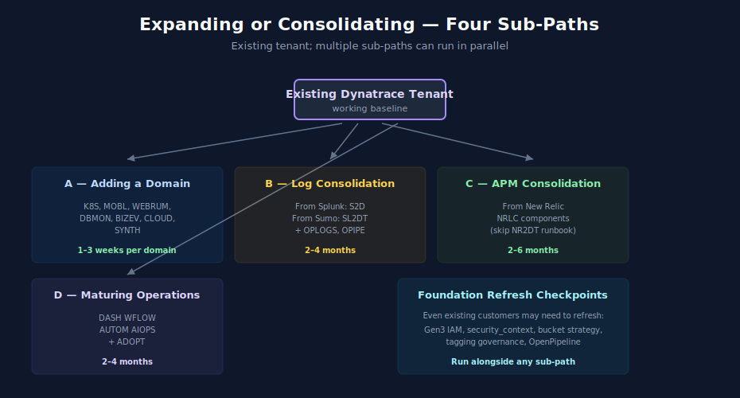

# Doorway 2 — Expanding or Consolidating

> **Purpose:** Reading order for existing Dynatrace customers adding scope or pulling data from another tool. Skips most Foundation reading; focuses on the specific expansion or consolidation pattern.
> **Last Updated:** 05/07/2026

---

## Table of Contents

1. [You Are Here If…](#you-are-here-if)
2. [Pick Your Sub-Path](#pick-your-sub-path)
3. [Sub-Path A — Adding a New Domain](#sub-path-a--adding-a-new-domain)
4. [Sub-Path B — Log Consolidation from Splunk or Sumo Logic](#sub-path-b--log-consolidation-from-splunk-or-sumo-logic)
5. [Sub-Path C — APM Consolidation from New Relic](#sub-path-c--apm-consolidation-from-new-relic)
6. [Sub-Path D — Maturing Operations](#sub-path-d--maturing-operations)
7. [Foundation Refresh Checkpoints](#foundation-refresh-checkpoints)
8. [Where to Next](#where-to-next)

---

## You Are Here If…

- You already have a working Dynatrace tenant
- You are extending its scope or consolidating data from another tool into it
- Examples: adding Kubernetes coverage, replacing Splunk for a subset of log sources, replacing New Relic APM for one application portfolio, building dashboards and automation for a maturing practice

If you are net-new to Dynatrace (no tenant yet), see [Doorway 1 — Net New](01-net-new.md). If you are migrating an existing Dynatrace deployment between deployment models, see [Doorway 3 — Deployment Migration](03-deployment-migration.md).

---

## Pick Your Sub-Path

| If you are doing… | Go to… |
|---|---|
| Adding a new observability domain (K8s, Mobile, RUM, DBMon, etc.) | [Sub-Path A — Adding a New Domain](#sub-path-a--adding-a-new-domain) |
| Pulling logs in from Splunk or Sumo Logic without replacing them everywhere | [Sub-Path B — Log Consolidation](#sub-path-b--log-consolidation-from-splunk-or-sumo-logic) |
| Adding APM data from New Relic for some applications without full replacement | [Sub-Path C — APM Consolidation](#sub-path-c--apm-consolidation-from-new-relic) |
| Maturing operations (dashboards, alerting, automation, AI) | [Sub-Path D — Maturing Operations](#sub-path-d--maturing-operations) |

Multiple sub-paths can run in parallel.

---

## Sub-Path A — Adding a New Domain

| Step | Reading |
|---|---|
| 1. Pick the domain | See [Domain Enablement Module](05-domain-enablement.md) for the recommended first-read in each domain |
| 2. Confirm prerequisites | Domain Enablement lists what Foundation pieces each domain needs (most assume basic [ONBRD](../onbrd/) + [ORGNZ](../orgnz/) already in place) |
| 3. Read the domain series | Direct entry into the relevant series — [K8S](../k8s/), [CLOUD](../cloud/), [SPANS](../spans/), [WEBRUM](../webrum/), [MOBL](../mobl/), [DBMON](../dbmon/), [BIZEV](../bizev/), [SYNTH](../synth/) |
| 4. Foundation refresh if needed | See [Foundation Refresh Checkpoints](#foundation-refresh-checkpoints) below — Gen3 changes to ORGNZ and IAM may apply if your tenant predates them |
| 5. Operationalize the new domain | Add dashboards ([DASH](../dash/)) and alerts ([WFLOW](../wflow/)) for the new domain |

Time per domain: 1–3 weeks for a small team. Mobile (SDK rollout to apps) and full Kubernetes coverage typically take longer.

---

## Sub-Path B — Log Consolidation from Splunk or Sumo Logic

You are pulling some or all log sources from Splunk or Sumo Logic into Dynatrace, often in parallel with the legacy tool for a transition period.

| Step | Reading | Notes |
|---|---|---|
| 1. Inventory | [S2D](../s2d/) notebook 02 (locating logs) for Splunk; [SL2DT](../sl2dt/) notebook 02 (assessment and inventory) for Sumo Logic | Catalog source-types/categories, retention requirements, query patterns |
| 2. Routing & ingestion design | [OPLOGS](../oplogs/) — notebooks 01–04 (fundamentals, migration, pipeline, buckets); [OPIPE](../opipe/) — notebook 01 | This is where Splunk source-types or Sumo `_sourceCategory` map to Dynatrace bucket and security_context strategy |
| 3. ORGNZ refresh | [ORGNZ](../orgnz/) — notebooks 02 (buckets), 03 (bucket strategy), 06 (security_context) | Critical if your tenant is Gen2-era or has not implemented bucket-based scoping |
| 4. Translation | [S2D](../s2d/) notebook 03 (SPL → DQL) or [SL2DT](../sl2dt/) notebook 04 (SumoQL → DQL) | Translate dashboards, monitors, scheduled searches |
| 5. Dashboard & monitor migration | [S2D](../s2d/) notebooks 04–08 or [SL2DT](../sl2dt/) notebooks 05–06 | Build Dynatrace equivalents; flag static-threshold monitors that should become Davis Anomaly Detectors |
| 6. Validation | Run side-by-side for 2–4 weeks; compare key queries | |
| 7. Cutover | Decommission source forwarders for migrated sources; legacy tool stays for non-migrated sources | |

Skip: [ONBRD](../onbrd/) basics, [IAM](../iam/) notebooks 01–03 (assume tenant already operational and access already configured).

---

## Sub-Path C — APM Consolidation from New Relic

You are migrating APM coverage for one or more application portfolios from New Relic to Dynatrace, while leaving other tools in place.

| Step | Reading | Notes |
|---|---|---|
| 1. Component inventory | [NRLC](../nrlc/) notebook 01 (platform comparison) | Identify which NR features are in use for the portfolio (APM, browser, mobile, synthetics, alerts, dashboards, logs) |
| 2. Translation primer | [NRLC](../nrlc/) notebook 02 (NRQL → DQL) | Sets expectations for what translates cleanly vs. needs redesign |
| 3. Component migration (per app) | [NRLC](../nrlc/) notebooks 03–07 — dashboards, alerts and workflows, synthetics, SLOs and workloads, logs and tags | Pick the components in scope; skip what does not apply |
| 4. Validation | [NRLC](../nrlc/) notebook 08 (validation, diff, rollback) | Side-by-side comparison; rollback plan in case of issues |
| 5. Cutover & decommission | NR agent removal; license adjustment | |
| 6. Toolchain reference | [NRLC](../nrlc/) notebook 09 (toolchain reference) | For ongoing tooling: NRQL → DQL translator, asset inventory tools |

Skip: [NR2DT](../nr2dt/) procedural runbook (that's for full-tenant migrations); [ONBRD](../onbrd/) notebooks 01–05 (assume tenant operational).

---

## Sub-Path D — Maturing Operations

Your tenant is operational; you are improving the depth and quality of dashboards, alerting, automation, and AI-driven analysis.

| Step | Reading |
|---|---|
| 1. Dashboard maturity | [DASH](../dash/) — full series; especially notebook 02 (hierarchy) for organization across teams |
| 2. Alert routing maturity | [WFLOW](../wflow/) — full series; especially notebooks 04 (notification routing), 05 (incident management), 09 (governance) |
| 3. Configuration automation | [AUTOM](../autom/) — notebooks 01–04 are the foundation (Settings API, Monaco, Terraform); 05–08 build on that (workflows-as-code, SDKs, CI/CD, migration automation) |
| 4. Davis intelligence | [AIOPS](../aiops/) — full series; especially notebook 02 (anomaly detection), 03 (Davis problems and root cause), 06 (integrations and agentic workflows) |
| 5. Continuous improvement | [Maturity Module](07-maturity.md) → [ADOPT](../adopt/) — ongoing |

See [Operationalize Module](06-operationalize.md) for the recommended order of these series and the reasoning behind it.

---

## Foundation Refresh Checkpoints

Even existing customers may need to refresh on Foundation topics, particularly if your tenant predates Gen3 or you are touching a previously-unaddressed area.

| Topic | Why refresh | Reading |
|---|---|---|
| Gen3 IAM (security_context, parameterized policies) | Gen2 IAM does not exist in Gen3 the same way; if you have Gen2 management zones, see MZ2POL | [IAM](../iam/) — notebooks 04 (policy authoring), 05 (boundary design), 10 (parameterized assignments); [MZ2POL](../mz2pol/) full series if migrating from Gen2 |
| Bucket strategy | Gen2-era tenants often have not implemented bucket-based scoping; bucket choices have downstream effects on cost, retention, and access | [ORGNZ](../orgnz/) — notebooks 02 (buckets), 03 (bucket strategy), 05 (bucket-level access control) |
| Tagging strategy | Tagging conventions established years ago may need rationalization | [FAQ](../faq/) — entry 02 (tagging sources, standards, strategy); [ORGNZ](../orgnz/) — notebook 01 |
| security_context as universal scope field | If you have not adopted security_context, IAM boundaries are limited | [ORGNZ](../orgnz/) — notebook 06 |
| Classic Logs → OpenPipeline | If you are still on Classic Logs, OpenPipeline migration is a separate workstream | [OPMIG](../opmig/) — full series |

These are not blockers — refresh as needed, in parallel with your sub-path.

---

## Where to Next

- [Operationalize Module](06-operationalize.md) — for ongoing operations work
- [Maturity Module](07-maturity.md) — for continuous improvement framing
- [Overlap Map](08-overlap-map.md) — when you find the same topic covered in multiple series
- [Foundation Module](04-foundation.md) — full Foundation reading order if you decide to do a comprehensive refresh

---

> *This playbook was AI-generated from community-submitted and publicly available sources. It is not officially supported by Dynatrace. Always verify information against official Dynatrace documentation.*
