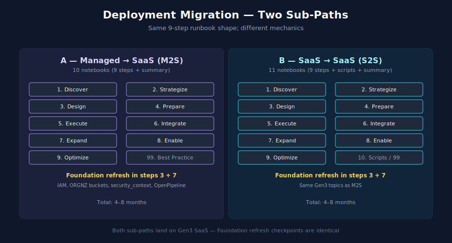

# Doorway 3 — Deployment Migration

> **Purpose:** Reading order for existing Dynatrace customers changing deployment model — Managed → SaaS or SaaS → SaaS. Focused on migration mechanics; selective Foundation refresh where Gen3 differs from prior generations.
> **Last Updated:** 05/07/2026

---

## Table of Contents

1. [You Are Here If…](#you-are-here-if)
2. [Pick Your Sub-Path](#pick-your-sub-path)
3. [Sub-Path A — Managed → SaaS (M2S)](#sub-path-a--managed--saas-m2s)
4. [Sub-Path B — SaaS → SaaS (S2S)](#sub-path-b--saas--saas-s2s)
5. [Foundation Refresh Checkpoints](#foundation-refresh-checkpoints)
6. [Where to Next](#where-to-next)

---

## You Are Here If…

- You are an existing Dynatrace customer with a working tenant
- You are moving to a different deployment model — Dynatrace Managed → Dynatrace SaaS, or one SaaS tenant → another SaaS tenant
- The migration is the deployment model itself, not a tool replacement; your underlying observability practice continues

If you are net-new to Dynatrace, see [Doorway 1 — Net New](01-net-new.md). If you are expanding scope or consolidating data into your existing tenant, see [Doorway 2 — Expanding or Consolidating](02-expand-consolidate.md).

---

## Pick Your Sub-Path

| If you are doing… | Go to… |
|---|---|
| Migrating from Dynatrace Managed to Dynatrace SaaS | [Sub-Path A — Managed → SaaS](#sub-path-a--managed--saas-m2s) |
| Migrating from one Dynatrace SaaS tenant to another (consolidation, region change, end-of-life of tenant generation) | [Sub-Path B — SaaS → SaaS](#sub-path-b--saas--saas-s2s) |

---

## Sub-Path A — Managed → SaaS (M2S)

The [M2S](../m2s/) series provides a 9-step procedural runbook. Read each step in order:

| Step | Reading | Time | Notes |
|---|---|---|---|
| 1 | [M2S](../m2s/) — notebook 01 (Discover) | 1–2 weeks | Inventory current Managed tenant: agents, configurations, integrations, users, dashboards |
| 2 | [M2S](../m2s/) — notebook 02 (Strategize) | 1–2 weeks | Decide what migrates as-is, what gets redesigned for Gen3 capabilities |
| 3 | [M2S](../m2s/) — notebook 03 (Design) | 2–4 weeks | Tenant region, IAM model, bucket strategy, tagging |
| 4 | [M2S](../m2s/) — notebook 04 (Prepare) | 2–3 weeks | Provision SaaS tenant, set up SSO, deploy ActiveGates |
| 5 | [M2S](../m2s/) — notebook 05 (Execute) | 4–8 weeks | Move agents, migrate configurations, validate data flow |
| 6 | [M2S](../m2s/) — notebook 06 (Integrate) | 2–4 weeks | Re-establish integrations (cloud connectors, ITSM, alerting destinations) |
| 7 | [M2S](../m2s/) — notebook 07 (Expand) | 2–3 weeks | Take advantage of Gen3-only features (Grail, OpenPipeline, Davis CoPilot, Workflows) |
| 8 | [M2S](../m2s/) — notebook 08 (Enable) | 2–3 weeks | Train users on new capabilities; document new patterns |
| 9 | [M2S](../m2s/) — notebook 09 (Optimize) | Ongoing | Cost optimization, governance, FinOps |
| Reference | [M2S](../m2s/) — notebook 99 (Best Practice Summary) | Reference | One-page synthesis |

Foundation refresh is woven into steps 3 and 7 — see [Foundation Refresh Checkpoints](#foundation-refresh-checkpoints) below.

---

## Sub-Path B — SaaS → SaaS (S2S)

The [S2S](../s2s/) series provides a 9-step procedural runbook with the same shape as M2S but mechanics specific to SaaS-to-SaaS migration.

| Step | Reading | Time | Notes |
|---|---|---|---|
| 1 | [S2S](../s2s/) — notebook 01 (Discover) | 1–2 weeks | Inventory source SaaS tenant |
| 2 | [S2S](../s2s/) — notebook 02 (Strategize) | 1–2 weeks | Decide migration approach (clean rebuild vs lift-and-shift) |
| 3 | [S2S](../s2s/) — notebook 03 (Design) | 2–4 weeks | Target tenant design |
| 4 | [S2S](../s2s/) — notebook 04 (Prepare) | 2–3 weeks | Provision target, configure SSO, deploy ActiveGates |
| 5 | [S2S](../s2s/) — notebook 05 (Execute) | 4–8 weeks | Re-deploy agents to target; migrate configurations |
| 6 | [S2S](../s2s/) — notebook 06 (Integrate) | 2–4 weeks | Re-establish integrations |
| 7 | [S2S](../s2s/) — notebook 07 (Expand) | 2–3 weeks | New tenant capabilities |
| 8 | [S2S](../s2s/) — notebook 08 (Enable) | 2–3 weeks | User enablement |
| 9 | [S2S](../s2s/) — notebook 09 (Optimize) | Ongoing | Cost and governance |
| Scripts | [S2S](../s2s/) — notebook 10 (Migration Scripts) | Reference | Tooling for repeatable migration steps |
| Reference | [S2S](../s2s/) — notebook 99 (Best Practice Summary) | Reference | One-page synthesis |

---

## Foundation Refresh Checkpoints

Both M2S and S2S land you on a Gen3 SaaS tenant. Several Foundation topics differ from earlier generations and warrant a refresh:

| Topic | Why refresh | Reading |
|---|---|---|
| Gen3 IAM model | Gen3 IAM is policy-based with security_context boundaries; Gen2 management zones do not translate one-to-one | [IAM](../iam/) — notebooks 01 (governance foundations), 04 (policy authoring), 05 (boundary design); [MZ2POL](../mz2pol/) — full series for Gen2 MZ → Gen3 policy migration |
| Grail buckets | Storage model is fundamentally different from Managed; bucket choices affect cost, retention, and access | [ORGNZ](../orgnz/) — notebooks 02 (understanding buckets), 03 (bucket strategy and design) |
| security_context | Universal scope field for Gen3 access control; not present in earlier generations | [ORGNZ](../orgnz/) — notebook 06 |
| OpenPipeline (Logs) | Replaces Classic Logs in Gen3; if your Managed tenant used Classic Logs, OpenPipeline migration is a separate workstream | [OPMIG](../opmig/) — full series |
| Workflows | First-class capability in Gen3; replaces some legacy alerting integrations | [WFLOW](../wflow/) — full series |
| AppEngine apps | Some Gen2 features are now delivered as Dynatrace apps | Covered in series-specific reading where relevant |

These should run alongside the M2S or S2S step that introduces them — typically in step 3 (Design) and step 7 (Expand).

---

## Where to Next

After deployment migration completes:

- [Domain Enablement Module](05-domain-enablement.md) — to add domains that may have been deferred during the migration
- [Operationalize Module](06-operationalize.md) — to take advantage of Gen3-only operations capabilities (Workflows, Davis intelligence, AppEngine apps)
- [Maturity Module](07-maturity.md) — for ongoing optimization and governance

If you find yourself also consolidating from another tool during or after the deployment migration (for example, taking the opportunity to retire Splunk while you are already in transition), see [Doorway 2 — Expanding or Consolidating](02-expand-consolidate.md), Sub-Path B or C.

---

> *This playbook was AI-generated from community-submitted and publicly available sources. It is not officially supported by Dynatrace. Always verify information against official Dynatrace documentation.*
