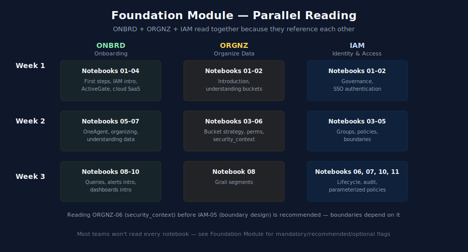

# Foundation Module — ONBRD + ORGNZ + IAM

> **Purpose:** Reading order for the universal foundation every Dynatrace tenant needs, regardless of entry point. Mandatory, recommended, and optional flags help you trim the reading list when time is constrained.
> **Last Updated:** 05/07/2026

---

## Table of Contents

1. [Why This Module Exists](#why-this-module-exists)
2. [Recommended Sequencing](#recommended-sequencing)
3. [ONBRD — Onboarding Reading Order](#onbrd--onboarding-reading-order)
4. [ORGNZ — Organize Data Reading Order](#orgnz--organize-data-reading-order)
5. [IAM — IAM Administration Reading Order](#iam--iam-administration-reading-order)
6. [Cross-References Between Foundation Series](#cross-references-between-foundation-series)
7. [Where to Next](#where-to-next)

---

## Why This Module Exists

Three series cover the universal foundation: [ONBRD](../ONBRD%20-%20Dynatrace%20Onboarding/), [ORGNZ](../ORGNZ%20-%20Organize%20Data:%20Buckets,%20Segments,%20Security/), and [IAM](../IAM%20-%20IAM%20Administration/). They overlap in places — ONBRD has its own basic IAM and basic data-org coverage; the dedicated IAM and ORGNZ series go deeper. This module provides a sequenced reading order so you don't read overlapping content twice and so you know which dedicated series to dive into when ONBRD's coverage isn't sufficient.

Total time for the full Foundation reading: 2–3 weeks for a small to mid-sized team, often run in parallel with first-domain work.

---

## Recommended Sequencing

The three series can — and should — be read in parallel rather than strictly sequentially, because they reference each other.

| Week | Reading |
|---|---|
| Week 1 | [ONBRD](../ONBRD%20-%20Dynatrace%20Onboarding/) notebooks 01–04 + [ORGNZ](../ORGNZ%20-%20Organize%20Data:%20Buckets,%20Segments,%20Security/) notebooks 01–02 + [IAM](../IAM%20-%20IAM%20Administration/) notebooks 01–02 |
| Week 2 | [ONBRD](../ONBRD%20-%20Dynatrace%20Onboarding/) notebooks 05–07 + [ORGNZ](../ORGNZ%20-%20Organize%20Data:%20Buckets,%20Segments,%20Security/) notebooks 03–06 + [IAM](../IAM%20-%20IAM%20Administration/) notebooks 03–05 |
| Week 3 | [ONBRD](../ONBRD%20-%20Dynatrace%20Onboarding/) notebooks 08–10 + [ORGNZ](../ORGNZ%20-%20Organize%20Data:%20Buckets,%20Segments,%20Security/) notebook 08 + [IAM](../IAM%20-%20IAM%20Administration/) notebooks 06–07, 10–11 |

Most teams won't read every notebook. The mandatory/recommended/optional flags below let you build a custom reading list.

---

## ONBRD — Onboarding Reading Order

11 notebooks in [ONBRD](../ONBRD%20-%20Dynatrace%20Onboarding/). Coverage: tenant orientation, OneAgent and ActiveGate deployment, basic IAM, basic data org, intro DQL, intro alerts, intro dashboards.

| # | Notebook | Priority | Notes |
|---|---|---|---|
| 01 | First Steps | Mandatory | Tenant orientation, navigation |
| 02 | IAM and Authentication | Mandatory | Initial users and basic policies; [IAM](../IAM%20-%20IAM%20Administration/) goes deeper |
| 03 | Deploying ActiveGate | Mandatory | If hybrid or cloud (most customers); skip if pure SaaS-only with no on-prem footprint |
| 04 | Cloud SaaS Integrations | Recommended | If using AWS, Azure, GCP, or other cloud SaaS sources |
| 05 | Deploying OneAgent | Mandatory | Core agent deployment |
| 06 | Organizing Your Environment | Recommended | Tags, host groups, naming; [ORGNZ](../ORGNZ%20-%20Organize%20Data:%20Buckets,%20Segments,%20Security/) and [FAQ](../FAQ%20-%20Frequently%20Asked%20Questions/) go deeper |
| 07 | Understanding Your Data | Recommended | Data model orientation: spans, logs, metrics, events |
| 08 | Your First Queries | Recommended | DQL primer; [SPANS](../SPANS%20-%20Distributed%20Tracing%20and%20Spans/), [ORGNZ](../ORGNZ%20-%20Organize%20Data:%20Buckets,%20Segments,%20Security/), and series-specific docs go deeper |
| 09 | Setting Up Alerts | Optional | Intro to alerting; [WFLOW](../WFLOW%20-%20Workflows%20and%20Alert%20Notifications/) is the canonical series |
| 10 | Building Dashboards | Optional | Intro to dashboards; [DASH](../DASH%20-%20Dashboard%20Design%20&%20Building/) is the canonical series |
| 99 | Best Practice Summary | Reference | One-page synthesis |

**Skip-if-already-have:** ONBRD-09 and 10 if you plan to read [WFLOW](../WFLOW%20-%20Workflows%20and%20Alert%20Notifications/) and [DASH](../DASH%20-%20Dashboard%20Design%20&%20Building/) anyway — they cover the same ground in greater depth.

---

## ORGNZ — Organize Data Reading Order

11 notebooks in [ORGNZ](../ORGNZ%20-%20Organize%20Data:%20Buckets,%20Segments,%20Security/). Coverage: Grail buckets, security_context, permissions, segments, enterprise patterns.

| # | Notebook | Priority | Notes |
|---|---|---|---|
| 01 | Introduction to Organizing Data | Mandatory | Concepts and terminology |
| 02 | Understanding Grail Buckets | Mandatory | The bucket data model — every customer needs to understand this |
| 03 | Bucket Strategy and Design | Mandatory | Bucket choices have downstream effects on cost, retention, and access |
| 04 | Permissions in Grail | Mandatory | How Gen3 permissions work in Grail |
| 05 | Bucket-Level Access Control | Optional | Scenario-specific: compliance, retention, hard cost separation, hostile multi-tenancy. Default to security_context for general access. |
| 06 | security_context | Mandatory | Universal scope field for general data access. Underpins IAM boundary design. |
| 07 | Advanced Permission Patterns | Optional | Complex multi-environment scenarios |
| 08 | Grail Segments | Recommended | Logical data partitions; useful for dashboards and queries |
| 09 | Enterprise Patterns | Optional | Large multi-business-unit organizations |
| 10 | Advanced Segment Definitions | Optional | Sophisticated segment usage |
| 99 | Best Practice Summary | Reference | One-page synthesis |

**Critical sidebar — buckets vs security_context:** Use buckets for storage / retention / cost / compliance separation; use security_context (a universal field) for general access control. Reading 02–06 in order makes this distinction clear. Avoid the anti-pattern of using buckets as the primary access-control mechanism — they are immutable, capped at 80 per tenant, and not universal across all configuration types.

---

## IAM — IAM Administration Reading Order

13 notebooks in [IAM](../IAM%20-%20IAM%20Administration/). Coverage: governance, SSO, groups, policies, boundaries, lifecycle, audit, multi-environment, parameterized assignments.

| # | Notebook | Priority | Notes |
|---|---|---|---|
| 01 | Governance Foundations | Mandatory | Concepts, terminology, governance model |
| 02 | SSO Authentication | Mandatory | Decide SSO method before adding users |
| 03 | Group Architecture | Mandatory | Group design patterns |
| 04 | Policy Authoring | Mandatory | Gen3 policy model |
| 05 | Boundary Design | Mandatory | Scope boundaries; depends on ORGNZ-06 (security_context) |
| 06 | User Lifecycle | Recommended | Provisioning, deprovisioning, role transitions |
| 07 | Audit and Compliance | Recommended | Audit log queries, compliance reporting |
| 08 | Multi-Environment | Optional | Only if multi-tenant |
| 09 | Troubleshooting | Reference | Lookup when something doesn't work |
| 10 | Templated Policy Assignments | Recommended | Parameterized policies — one policy with binding parameters, not N copies. Strong best practice. |
| 11 | [WORKSHOP] Policy Persona | Recommended | Hands-on planning exercise |
| 12 | API Provisioning and Validation | Optional | For automation; tied to [AUTOM](../AUTOM%20-%20Dynatrace%20Automation/) |
| 99 | Best Practice Summary | Reference | One-page synthesis |

**Critical sidebar — parameterized policies:** Notebook 10 introduces a strong best practice: prefer one parameterized policy with binding parameters over N copies of a similar policy with hardcoded scope. Most engagements should adopt this pattern from the start; retrofitting later is painful.

---

## Cross-References Between Foundation Series

| Topic | Light coverage in… | Canonical in… |
|---|---|---|
| Initial users and authentication | [ONBRD](../ONBRD%20-%20Dynatrace%20Onboarding/) notebook 02 | [IAM](../IAM%20-%20IAM%20Administration/) notebooks 02–03 |
| Tags and host groups | [ONBRD](../ONBRD%20-%20Dynatrace%20Onboarding/) notebook 06; [FAQ](../FAQ%20-%20Frequently%20Asked%20Questions/) entry 01 | [ORGNZ](../ORGNZ%20-%20Organize%20Data:%20Buckets,%20Segments,%20Security/) notebook 01; [FAQ](../FAQ%20-%20Frequently%20Asked%20Questions/) entry 02 |
| Bucket basics | [ONBRD](../ONBRD%20-%20Dynatrace%20Onboarding/) notebook 06 | [ORGNZ](../ORGNZ%20-%20Organize%20Data:%20Buckets,%20Segments,%20Security/) notebooks 02–03 |
| security_context | (mentioned in IAM-04, 05) | [ORGNZ](../ORGNZ%20-%20Organize%20Data:%20Buckets,%20Segments,%20Security/) notebook 06 |
| Policy authoring | [ONBRD](../ONBRD%20-%20Dynatrace%20Onboarding/) notebook 02 | [IAM](../IAM%20-%20IAM%20Administration/) notebooks 04–05 |
| Gen2 → Gen3 access control | (overview in [ONBRD](../ONBRD%20-%20Dynatrace%20Onboarding/)) | [MZ2POL](../MZ2POL%20-%20Management%20Zone%20to%20Policy%20Migration/) full series |

If a topic appears in ONBRD with light coverage and you need depth, dive into the canonical series.

---

## Where to Next

Once Foundation reading is in progress (it doesn't have to be finished — Foundation can run in parallel with first-domain work):

- [Domain Enablement Module](05-domain-enablement.md) — pick your first observability domain
- [Operationalize Module](06-operationalize.md) — once a domain is producing data, layer dashboards, alerts, automation, and AI
- [Maturity Module](07-maturity.md) — for ongoing improvement framing

Return here as needed: when you adopt a new permission pattern, when an audit raises questions about IAM hygiene, when a new bucket-routing decision arises.

---

> *This playbook was AI-generated from community-submitted and publicly available sources. It is not officially supported by Dynatrace. Always verify information against official Dynatrace documentation.*
