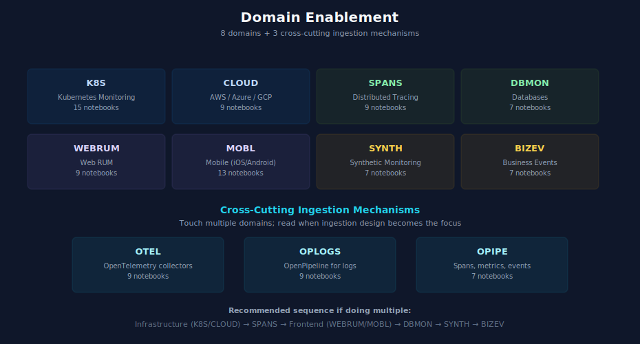

# Domain Enablement Module

> **Purpose:** Pick-list of observability domain series with prerequisites, recommended sequencing if doing multiple, and cross-cutting ingestion mechanisms (OTel, OpenPipeline) that touch multiple domains.
> **Last Updated:** 07/15/2026

---

## Table of Contents

1. [How to Use This Module](#how-to-use-this-module)
2. [Recommended Order If Doing Multiple Domains](#recommended-order-if-doing-multiple-domains)
3. [Domain Pick-List](#domain-pick-list)
4. [Cross-Cutting Ingestion Mechanisms](#cross-cutting-ingestion-mechanisms)
5. [Where to Next](#where-to-next)

---

## How to Use This Module

There are nine observability domains and three cross-cutting ingestion series. You don't need all of them — pick based on what you monitor. Each entry below lists prerequisites (what Foundation pieces must be in place first) and recommended starting points.

This module is referenced from each of the three doorways. Read it after [Foundation Module](04-foundation.md) is in progress.

---

## Recommended Order If Doing Multiple Domains

If you plan to enable several domains over a few months, this is a sensible order:

1. **Infrastructure baseline** — [K8S](../K8S%20-%20Kubernetes%20Monitoring/) (if Kubernetes is in scope) or [CLOUD](../CLOUD%20-%20Cloud%20Provider%20Integrations/) (AWS / Azure / GCP). One of these is almost always first.
2. **Security observability** — [APPSEC](../APPSEC%20—%20Application%20Security/). If security compliance / risk is a mandate, this runs in parallel with wave 1. Otherwise, wave 2 or later.
3. **Distributed tracing** — [SPANS](../SPANS%20-%20Distributed%20Tracing%20and%20Spans/). Most modern apps need this next.
4. **Frontend experience** — [WEBRUM](../WEBRUM%20-%20Web%20Real%20User%20Monitoring/) (web) and/or [MOBL](../MOBL%20-%20Mobile%20Monitoring/) (mobile).
5. **Database** — [DBMON](../DBMON%20-%20Database%20Monitoring/). Often depends on [SPANS](../SPANS%20-%20Distributed%20Tracing%20and%20Spans/) for context.
6. **Synthetic** — [SYNTH](../SYNTH%20-%20Synthetic%20Monitoring/). Proactive monitoring.
7. **Business events** — [BIZEV](../BIZEV%20-%20Business%20Events%20&%20Funnel%20Analysis/). Revenue and conversion analytics.

The order is a guideline, not a rule. Skip what doesn't apply; reorder based on business priority.

---

## Domain Pick-List

### [K8S — Kubernetes Monitoring](../K8S%20-%20Kubernetes%20Monitoring/)

15 notebooks. Largest of the domain series.

| Aspect | Detail |
|---|---|
| Prerequisites | Foundation in progress; ActiveGate deployed |
| Time | 2–4 weeks for a small fleet; longer for multi-cluster environments |
| Mandatory entry | Notebooks 01 (fundamentals), 02 (DynaKube deployment) |
| Recommended next | 04 (cluster monitoring), 05 (workload monitoring), 06 (namespace organization) |
| Optional / advanced | 03 (GitOps), 07 (events and logs), 09 (troubleshooting), 11 (multi-tool coexistence), 13 (Kafka monitoring) |
| Hands-on | Notebook 14 ([LAB] deployment guide) |
| Cross-references | [OTEL](../OTEL%20-%20OpenTelemetry%20Integration/) for collector deployment; [CLOUD](../CLOUD%20-%20Cloud%20Provider%20Integrations/) for managed K8s; [AUTOM](../AUTOM%20-%20Dynatrace%20Automation/) for GitOps |

### [CLOUD — Cloud Provider Integrations](../CLOUD%20-%20Cloud%20Provider%20Integrations/)

9 notebooks covering AWS, Azure, and GCP.

| Aspect | Detail |
|---|---|
| Prerequisites | Foundation in progress; ActiveGate deployed if using AG-based connectors |
| Time | 1–3 weeks per cloud provider |
| Mandatory entry | Notebook 01 (cloud integration fundamentals) |
| Recommended next | The provider-specific notebooks for what you have: 02 (AWS), 05 (Azure), 06 (GCP) |
| Specific use cases | 03 (AWS EKS), 04 (AWS Lambda serverless), 07 (CloudWatch log ingestion), 08 (multi-cloud patterns) |
| Cross-references | [OTEL](../OTEL%20-%20OpenTelemetry%20Integration/) for collectors; [K8S](../K8S%20-%20Kubernetes%20Monitoring/) for managed K8s; [OPLOGS](../OPLOGS%20-%20OpenPipeline%20Logs/) for cloud log ingestion |

### [APPSEC — Application Security](../APPSEC%20—%20Application%20Security/)

10 notebooks covering RVA, RAP, SPM, and security observability.

| Aspect | Detail |
|---|---|
| Prerequisites | Foundation in progress; OneAgent or OTel on applications |
| Time | 1–3 weeks (varies by maturity of security program) |
| Mandatory entry | Notebooks 01 (fundamentals), 02 (platform overview) |
| Recommended next | 03 (RVA — runtime vulnerability analytics), 04 (RAP — runtime application protection), 05 (SPM — security posture management) |
| Optional | 06 (Investigator), 07 (Davis CoPilot for security), 08 (workflow remediation), 09 (governance dashboards) |
| Cross-references | [AIOPS](../AIOPS%20-%20Dynatrace%20Intelligence/) for Davis intelligence; [DASH](../DASH%20-%20Dashboard%20Design%20&%20Building/) for security dashboards; [WFLOW](../WFLOW%20-%20Workflows%20and%20Alert%20Notifications/) for remediation |

### [SPANS — Distributed Tracing and Spans](../SPANS%20-%20Distributed%20Tracing%20and%20Spans/)

9 notebooks.

| Aspect | Detail |
|---|---|
| Prerequisites | OneAgent or OTel instrumentation on at least one service |
| Time | 1–2 weeks |
| Mandatory entry | Notebooks 01 (fundamentals), 02 (querying) |
| Recommended next | 03 (troubleshooting), 04 (topology), 05 (analytics) |
| Cost-aware | 07 (buckets and pipeline), 08 (cost optimization) — read once you have meaningful span volume |
| Cross-references | [OTEL](../OTEL%20-%20OpenTelemetry%20Integration/), [OPIPE](../OPIPE%20-%20OpenPipeline%20Beyond%20Logs/) for span pipelines, [DBMON](../DBMON%20-%20Database%20Monitoring/) for database call tracing |

### [WEBRUM — Web Real User Monitoring](../WEBRUM%20-%20Web%20Real%20User%20Monitoring/)

9 notebooks.

| Aspect | Detail |
|---|---|
| Prerequisites | Foundation in progress; access to web app HTML/JS for instrumentation |
| Time | 1–2 weeks |
| Mandatory entry | Notebooks 01 (RUM fundamentals), 02 (SPA instrumentation if applicable) |
| Recommended next | 03 (Core Web Vitals), 04 (session analysis), 06 (performance analysis) |
| Optional | 05 (error analysis), 07 (session replay), 08 (dashboards and alerting) |
| Cross-references | [SPANS](../SPANS%20-%20Distributed%20Tracing%20and%20Spans/) for frontend-to-backend tracing; [BIZEV](../BIZEV%20-%20Business%20Events%20&%20Funnel%20Analysis/); [DASH](../DASH%20-%20Dashboard%20Design%20&%20Building/) |

### [MOBL — Mobile Monitoring](../MOBL%20-%20Mobile%20Monitoring/)

13 notebooks.

| Aspect | Detail |
|---|---|
| Prerequisites | App development team available; SDK rollout coordination |
| Time | 2–6 weeks (SDK rollout is the long pole, not the technical work) |
| Mandatory entry | Notebook 01 (fundamentals); platform-specific 02 (iOS) or 03 (Android) or 04 (cross-platform) |
| Recommended next | 05 (user action tracking), 06 (crash reporting), 07 (network requests) |
| Optional | 08 (session replay), 09 (privacy), 10 (DQL for mobile), 12 (advanced instrumentation) |
| Cross-references | [SPANS](../SPANS%20-%20Distributed%20Tracing%20and%20Spans/) for mobile-to-backend tracing |

### [DBMON — Database Monitoring](../DBMON%20-%20Database%20Monitoring/)

7 notebooks.

| Aspect | Detail |
|---|---|
| Prerequisites | OneAgent on database hosts; [SPANS](../SPANS%20-%20Distributed%20Tracing%20and%20Spans/) helpful for context |
| Time | 1–2 weeks |
| Mandatory entry | Notebook 01 (database monitoring fundamentals) |
| Recommended next | 02 (SQL databases) or 03 (NoSQL) based on your stack; 05 (query analysis) |
| Optional | 04 (cache and messaging), 06 (dashboards and alerting) |
| Cross-references | [SPANS](../SPANS%20-%20Distributed%20Tracing%20and%20Spans/) for database call tracing |

### [BIZEV — Business Events and Funnel Analysis](../BIZEV%20-%20Business%20Events%20&%20Funnel%20Analysis/)

7 notebooks.

| Aspect | Detail |
|---|---|
| Prerequisites | At least one ingestion method active (OTel, RUM, or backend instrumentation) |
| Time | 1–3 weeks (often gated by business stakeholder availability, not technical work) |
| Mandatory entry | Notebooks 01 (business events fundamentals), 02 (instrumentation) |
| Recommended next | 03 (funnel analysis), 04 (revenue impact), 05 (KPIs and metrics) |
| Optional | 06 (executive reporting) |
| Cross-references | [OPIPE](../OPIPE%20-%20OpenPipeline%20Beyond%20Logs/) for event pipelines; [DASH](../DASH%20-%20Dashboard%20Design%20&%20Building/) for executive reporting; [WEBRUM](../WEBRUM%20-%20Web%20Real%20User%20Monitoring/) for frontend events |

### [SYNTH — Synthetic Monitoring](../SYNTH%20-%20Synthetic%20Monitoring/)

7 notebooks.

| Aspect | Detail |
|---|---|
| Prerequisites | Foundation in progress |
| Time | 1–2 weeks |
| Mandatory entry | Notebook 01 (synthetic fundamentals) |
| Recommended next | 02 (browser monitors) and/or 03 (HTTP monitors) based on what you check |
| Optional | 04 (private locations), 05 (network monitoring), 06 (analytics) |
| Cross-references | [DASH](../DASH%20-%20Dashboard%20Design%20&%20Building/) for synthetic dashboards; [WFLOW](../WFLOW%20-%20Workflows%20and%20Alert%20Notifications/) for alerting on synthetic failures |

---

## Cross-Cutting Ingestion Mechanisms

These three series aren't domains themselves — they're ingestion mechanisms that touch multiple domains. Read them when ingestion design becomes the focus.

### [OTEL — OpenTelemetry Integration](../OTEL%20-%20OpenTelemetry%20Integration/)

9 notebooks. Read first if any domain will use OTel collectors (which is most: K8S, CLOUD, custom apps, NR migration).

| Aspect | Detail |
|---|---|
| Mandatory entry | Notebooks 01 (fundamentals), 02 (collector architecture), 03 (collector deployment) |
| Recommended next | 04 (trace instrumentation) and/or 05 (metrics) and/or 06 (logs) based on signal type |
| Reference | 07 (Dynatrace integration), 08 (troubleshooting) |

### [OPLOGS — OpenPipeline Logs](../OPLOGS%20-%20OpenPipeline%20Logs/)

9 notebooks. Read when designing log ingestion at scale.

| Aspect | Detail |
|---|---|
| Mandatory entry | Notebooks 01 (fundamentals), 03 (pipeline processing), 04 (buckets governance) |
| Recommended next | 05 (querying and parsing), 06 (topology) |
| Migration | Notebook 02 — if migrating from Classic Logs, also see [OPMIG](../OPMIG%20-%20OpenPipeline%20Migration/) full series |
| Optional | 07 (analytics), 08 (security) |

### [OPIPE — OpenPipeline Beyond Logs](../OPIPE%20-%20OpenPipeline%20Beyond%20Logs/)

7 notebooks. Read after OPLOGS when you need to process spans, metrics, or business/security events through OpenPipeline.

| Aspect | Detail |
|---|---|
| Mandatory entry | Notebook 01 (multi-scope platform) |
| Recommended next | 02 (span processing) if doing tracing; 05 (business and security event pipelines) if doing BizEv |
| Specialized | 03 (sampling-aware metrics), 04 (cardinality management), 06 (cross-scope design patterns) |

---

## Where to Next

Once a domain is producing useful data:

- [Operationalize Module](06-operationalize.md) — dashboards, alerts, automation, and AI for the new domain
- [Maturity Module](07-maturity.md) — ongoing improvement
- [Overlap Map](08-overlap-map.md) — when you find the same topic covered in multiple series (OTel chapter in K8S vs OTEL series, etc.)

---

## Maintenance Note

**When new domain series are added to `topics/`, this module MUST be updated:**
- Add the domain to the pick-list with notebook count, prerequisites, and entry points
- Determine the recommended wave position (1–7 above) based on typical dependencies
- Update "Recommended Order If Doing Multiple Domains" if the new series changes typical sequencing
- Add cross-references to `08-overlap-map.md` if the new series overlaps with existing domains
- Update series count references if the overall domain count changes (currently 9 as of July 15, 2026)
- Update Last Updated date to current date

---

> *This playbook was AI-generated from community-submitted and publicly available sources. It is not officially supported by Dynatrace. Always verify information against official Dynatrace documentation.*
