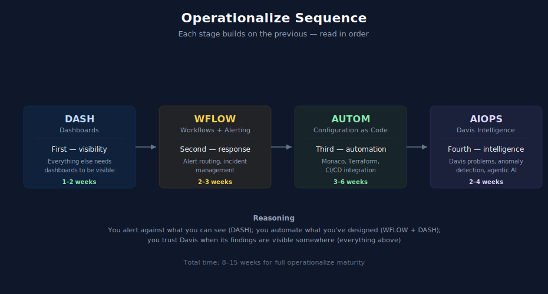

# Operationalize Module — ALERT → DASH → WFLOW → SLO → AUTOM → AIOPS → FINOPS

> **Purpose:** Sequenced reading order for layering alerting strategy, dashboards, alert routing, reliability targets, configuration automation, and Davis intelligence on a working tenant. The order matters: each builds on the previous.
> **Last Updated:** 07/15/2026

---

## Table of Contents

1. [Why This Order](#why-this-order)
2. [ALERT — Alerting Strategy (First)](#alert--alerting-strategy-first)
3. [DASH — Dashboards (Second)](#dash--dashboards-second)
4. [WFLOW — Workflows and Alerting (Third)](#wflow--workflows-and-alerting-third)
5. [SLO — Service Level Objectives (Parallel with WFLOW)](#slo--service-level-objectives-parallel-with-wflow)
6. [AUTOM — Configuration Automation (Fourth)](#autom--configuration-automation-fourth)
7. [AIOPS — Davis Intelligence (Fifth)](#aiops--davis-intelligence-fifth)
8. [FINOPS — Cost Management (Continuous)](#finops--cost-management-continuous)
9. [Cross-Cutting Overlaps](#cross-cutting-overlaps)
10. [Where to Next](#where-to-next)

---

## Why This Order

| Step | Reading | Time | Why this position in the sequence |
|---|---|---|---|
| 1 | [ALERT](../ALERT%20-%20Alerting%20Strategy%20and%20Design/) | 1 week | Alerting strategy underpins all downstream operations. Establish detection and routing patterns first. |
| 2 | [DASH](../DASH%20-%20Dashboard%20Design%20&%20Building/) | 1–2 weeks | Everything else needs dashboards to be visible. You alert against what you see; you automate around what you can dashboard; you trust Davis when its findings are visible somewhere. |
| 3 | [WFLOW](../WFLOW%20-%20Workflows%20and%20Alert%20Notifications/) | 2–3 weeks | Alert response. Needs dashboards to point at and incidents to route. |
| 4 | [SLO](../SLO%20-%20Service%20Level%20Objectives/) | 1 week | Reliability targets. Inform burn-rate alerting in WFLOW. |
| 5 | [AUTOM](../AUTOM%20-%20Dynatrace%20Automation/) | 3–6 weeks | Configuration automation, GitOps. Needs dashboards and workflows as deliverables — automating their lifecycle. |
| 6 | [AIOPS](../AIOPS%20-%20Dynatrace%20Intelligence/) | 2–4 weeks | Davis intelligence layered on top. Needs all of the above to be enriched and acted on. |
| 7 | [FINOPS](../FINOPS%20-%20Cost%20Management%20&%20FinOps/) | 1–2 weeks | Cost optimization ongoing; informs roadmap priorities. |

You can read partially out of order, but the reasoning above is why each builds on the previous.

---

## ALERT — Alerting Strategy (First)

5 notebooks in [ALERT](../ALERT%20-%20Alerting%20Strategy%20and%20Design/). Coverage: end-to-end alerting architecture, detection mechanism selection, alert routing and cost, ITSM integration.

| # | Notebook | Priority |
|---|---|---|
| 01 | End-to-End Architecture | Mandatory | Foundation for all downstream routing |
| 02 | Choosing & Building Detection | Mandatory | 4-mechanism decision framework |
| 03 | Routing & Destinations | Mandatory | Simple vs multi-step workflow billing |
| 04 | ServiceNow Integration | Recommended | If using ServiceNow ITSM |
| 99 | Best Practice Summary | Reference | Setup checklist + cross-series map |

Dependencies: Foundational understanding of [AIOPS](../AIOPS%20-%20Dynatrace%20Intelligence/) notebook 02 (anomaly detection) is helpful but not blocking.

---

## DASH — Dashboards (Second)

8 notebooks in [DASH](../DASH%20-%20Dashboard%20Design%20&%20Building/). Coverage: hierarchy, audience-specific dashboards, variables and filters, sharing.

| # | Notebook | Priority |
|---|---|---|
| 01 | Dashboard Fundamentals | Mandatory |
| 02 | Dashboard Hierarchy | Mandatory — organization across teams matters |
| 03 | Executive Dashboards | Recommended |
| 04 | Operations Dashboards | Recommended |
| 05 | Engineering Dashboards | Recommended |
| 06 | Variables and Filters | Mandatory — dashboards without variables don't scale |
| 07 | Sharing and Reporting | Recommended |
| 99 | Best Practice Summary | Reference |

Dependencies: [ORGNZ](../ORGNZ%20-%20Organize%20Data:%20Buckets,%20Segments,%20Security/) notebook 08 (segments) is helpful background before DASH-06 (variables and filters).

---

## WFLOW — Workflows and Alerting (Third)

10 notebooks in [WFLOW](../WFLOW%20-%20Workflows%20and%20Alert%20Notifications/). Coverage: triggers, notification routing, incident management, custom templates, remediation, governance.

| # | Notebook | Priority |
|---|---|---|
| 01 | Fundamentals | Mandatory |
| 02 | Triggers | Mandatory |
| 03 | Notification Basics | Mandatory |
| 04 | Notification Routing | Mandatory — multi-team alert routing |
| 05 | Incident Management | Recommended |
| 06 | Custom Templates | Recommended |
| 07 | Remediation | Recommended (advanced) |
| 08 | JavaScript and HTTP | Optional — for custom integrations |
| 09 | Governance | Recommended for mature organizations |
| 99 | Best Practice Summary | Reference |

Dependencies: [ALERT](../ALERT%20-%20Alerting%20Strategy%20and%20Design/) series provides the end-to-end routing context. [AIOPS](../AIOPS%20-%20Dynatrace%20Intelligence/) notebook 02 (anomaly detection) is helpful background before WFLOW-04 (notification routing) if you'll be routing on Davis problems.

---

## SLO — Service Level Objectives (Parallel with WFLOW)

5 notebooks in [SLO](../SLO%20-%20Service%20Level%20Objectives/). Coverage: SLI definitions, error budgets, burn-rate alerting.

| # | Notebook | Priority |
|---|---|---|
| 01 | Fundamentals | Mandatory |
| 02 | Defining SLIs | Mandatory |
| 03 | Composition & Error Budgets | Recommended |
| 04 | Burn-Rate Alerting | Recommended | Link to WFLOW alert routing |
| 05 | SLOs as Code | Recommended |

Timing: read in parallel with WFLOW (notebooks 01–03); their concepts are complementary. WFLOW handles alert routing; SLO handles reliability definitions that feed the alerts.

---

## AUTOM — Configuration Automation (Fourth)

11 notebooks in [AUTOM](../AUTOM%20-%20Dynatrace%20Automation/), including 2 hands-on labs. Coverage: Settings API, Monaco, Terraform, workflows-as-code, SDKs, CI/CD, migration automation.

| # | Notebook | Priority |
|---|---|---|
| 01 | Automation Landscape | Mandatory |
| 02 | Settings API | Mandatory — the API underneath all automation |
| 03 | Monaco | Mandatory (or alternative to Terraform — pick based on team preference) |
| 03 | [LAB] Monaco | Optional hands-on |
| 04 | Terraform | Mandatory (or alternative to Monaco — pick based on team preference) |
| 04 | [LAB] Terraform | Optional hands-on |
| 05 | Workflows | Recommended — workflow-as-code |
| 06 | SDKs | Optional — for custom integrations |
| 07 | CI/CD Integration | Recommended — automating Dynatrace config in your delivery pipeline |
| 08 | Migration Automation | Optional — specific to migration scenarios |
| 99 | Best Practice Summary | Reference |

Decision: Monaco vs Terraform — most teams pick one. Read both 03 and 04 to make an informed choice; then go deep on the one you select.

---

## AIOPS — Davis Intelligence (Fifth)

8 notebooks in [AIOPS](../AIOPS%20-%20Dynatrace%20Intelligence/). Coverage: Davis problems, anomaly detection, generative AI (Davis CoPilot, Dynatrace Assist), AI models, agentic workflows.

| # | Notebook | Priority |
|---|---|---|
| 01 | Dynatrace Intelligence Overview | Mandatory |
| 02 | Anomaly Detection | Mandatory — read before WFLOW-04 if possible |
| 03 | Davis AI: Problems and Root Cause | Mandatory |
| 04 | Davis CoPilot and Dynatrace Assist | Recommended |
| 05 | AI Models | Optional (deep dive) |
| 06 | AI Integrations and Agentic Workflows | Recommended |
| 07 | Putting It Together | Recommended |
| 99 | Series Summary | Reference |

---

## FINOPS — Cost Management (Continuous)

3+ notebooks in [FINOPS](../FINOPS%20-%20Cost%20Management%20&%20FinOps/), growing series. Coverage: DPS consumption, forecasting, cost optimization.

| # | Notebook | Priority |
|---|---|---|
| 01 | DPS Consumption & Querying | Recommended | Ongoing cost visibility |
| 02 | Forecasting & Anomaly Detection | Recommended | Build cost accountability into your practice |
| 03 | Optimization Framework | Optional | Cut / Tune / Filter levers |

Timing: read once [DASH](../DASH%20-%20Dashboard%20Design%20&%20Building/) and [WFLOW](../WFLOW%20-%20Workflows%20and%20Alert%20Notifications/) are in place (Month 2). Cost optimization is an ongoing discipline, not a one-time activity.

---

## Cross-Cutting Overlaps

Some topics appear in multiple Operationalize series:

| Topic | Canonical | Also covered in | Read order |
|---|---|---|---|
| Davis problems | [AIOPS](../AIOPS%20-%20Dynatrace%20Intelligence/) — notebooks 02–03 | [WFLOW](../WFLOW%20-%20Workflows%20and%20Alert%20Notifications/) — notebook 04 (alerting on problems) | AIOPS-02, 03 first; then WFLOW-04 |
| Workflow as code | [WFLOW](../WFLOW%20-%20Workflows%20and%20Alert%20Notifications/) — full series for concepts | [AUTOM](../AUTOM%20-%20Dynatrace%20Automation/) — notebook 05 (workflows-as-code) | WFLOW for concepts; AUTOM-05 for IaC delivery |
| Dashboard automation | [DASH](../DASH%20-%20Dashboard%20Design%20&%20Building/) — notebook 07 (sharing and reporting) | [AUTOM](../AUTOM%20-%20Dynatrace%20Automation/) — notebooks 02–04 (dashboards-as-code) | DASH first; AUTOM-02..04 once dashboards stabilize |
| Alerting on synthetics | [SYNTH](../SYNTH%20-%20Synthetic%20Monitoring/) — notebook 02 (browser monitors) | [WFLOW](../WFLOW%20-%20Workflows%20and%20Alert%20Notifications/) — notebook 04 | SYNTH for what to alert on; WFLOW for routing |

See [Overlap Map](08-overlap-map.md) for the full overlap table across all 32 topic series.

---

## Where to Next

- [Maturity Module](07-maturity.md) — for continuous improvement framing
- [Domain Enablement Module](05-domain-enablement.md) — to add additional domains as adoption grows
- Return to your doorway ([Doorway 1](01-net-new.md), [Doorway 2](02-expand-consolidate.md), or [Doorway 3](03-deployment-migration.md)) for next-phase guidance specific to your situation

---

## Maintenance Note

**When new Operationalize-relevant series are added to `topics/`, this module MUST be updated:**
- Add the series to the appropriate position in the sequence (ALERT → DASH → WFLOW → SLO → AUTOM → AIOPS → FINOPS)
- Update the ordered sequence if the new series changes the dependencies
- Add cross-references in the Overlaps section if the new series overlaps with existing ones
- Update series count references if the overall topic count changes (currently 32 as of July 15, 2026)
- Update Last Updated date to current date

---

> *This playbook was AI-generated from community-submitted and publicly available sources. It is not officially supported by Dynatrace. Always verify information against official Dynatrace documentation.*
