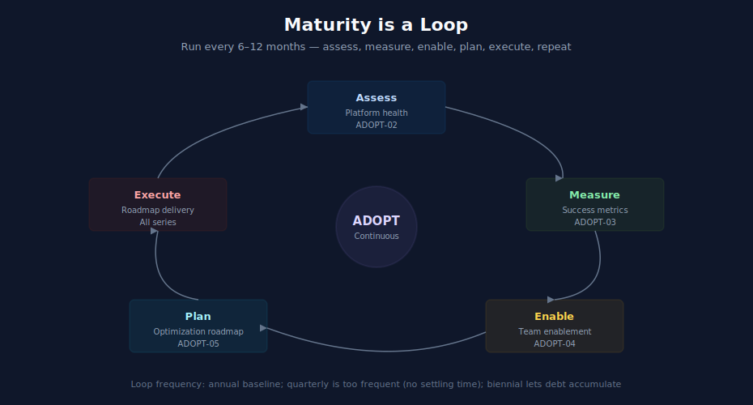

# Maturity Module — Continuous Improvement

> **Purpose:** Framing for ongoing improvement of a Dynatrace practice using the [ADOPT](../ADOPT%20-%20Observability%20Adoption%20&%20Maturity/) series. Maturity is not a one-time milestone — it's a loop you run every 6–12 months.
> **Last Updated:** 07/15/2026

---

## Table of Contents

1. [Why Maturity Is a Loop](#why-maturity-is-a-loop)
2. [ADOPT Reading Order](#adopt-reading-order)
3. [Lifecycle Phase Mapping](#lifecycle-phase-mapping)
4. [When to Run This Loop](#when-to-run-this-loop)
5. [Where to Next](#where-to-next)

---

## Why Maturity Is a Loop

The first time through an Onboarding or Migration playbook, you reach a working state — tenant operational, domains covered, dashboards and alerts running. That is not the end; that is the starting line for ongoing improvement.

The [ADOPT](../ADOPT%20-%20Observability%20Adoption%20&%20Maturity/) series provides a framework for continuously assessing and improving the practice: maturity model, platform health assessment, success metrics, team enablement, and optimization roadmap. Together they form a loop: assess → measure → enable → roadmap → execute → repeat.

This module is referenced from each doorway as the final step. It is also the right reading when you take stock of an existing practice that has been running for a while.

---

## ADOPT Reading Order

6 notebooks in [ADOPT](../ADOPT%20-%20Observability%20Adoption%20&%20Maturity/). Read in order on the first pass; revisit individual notebooks as needs arise.

| # | Notebook | Priority | When to read |
|---|---|---|---|
| 01 | Maturity Model | Mandatory | First pass: understand the framework |
| 02 | Platform Health Assessment | Mandatory | First pass: assess where you are |
| 03 | Success Metrics | Recommended | First pass: define what "improvement" means for your team |
| 04 | Team Enablement | Recommended | When the team is hitting its skill ceiling |
| 05 | Optimization Roadmap | Mandatory | First pass: build a 6–12 month plan |
| 99 | Best Practice Summary | Reference | One-page synthesis |

---

## Lifecycle Phase Mapping

ADOPT notebooks map to lifecycle phases in different ways depending on where you are in the journey:

| Lifecycle Phase | Primary ADOPT Notebook | Supporting Series |
|---|---|---|
| Initial assessment (first time) | 02 (platform health assessment) | [DASH](../DASH%20-%20Dashboard%20Design%20&%20Building/) for current-state visibility |
| Defining success | 03 (success metrics) | [DASH](../DASH%20-%20Dashboard%20Design%20&%20Building/), [BIZEV](../BIZEV%20-%20Business%20Events%20&%20Funnel%20Analysis/) for KPI dashboards |
| Building a plan | 05 (optimization roadmap) + 01 (maturity model) | All series catalog (for scoping investments) |
| Team capability | 04 (team enablement) | Depends on team gaps — often [IAM](../IAM%20-%20IAM%20Administration/), [DASH](../DASH%20-%20Dashboard%20Design%20&%20Building/), [WFLOW](../WFLOW%20-%20Workflows%20and%20Alert%20Notifications/) |
| Cost optimization (FinOps) | [FINOPS](../FINOPS%20-%20Cost%20Management%20&%20FinOps/) — full series (3+ notebooks) | [ADOPT](../ADOPT%20-%20Observability%20Adoption%20&%20Maturity/) notebooks 02–05 for roadmap context; [ORGNZ](../ORGNZ%20-%20Organize%20Data:%20Buckets,%20Segments,%20Security/) for bucket strategy; [SPANS](../SPANS%20-%20Distributed%20Tracing%20and%20Spans/)/[OPLOGS](../OPLOGS%20-%20OpenPipeline%20Logs/) for cost optimization per-domain |
| Governance scale-out | Covered in 05 | [IAM](../IAM%20-%20IAM%20Administration/), [WFLOW](../WFLOW%20-%20Workflows%20and%20Alert%20Notifications/) governance (notebook 09) |
| Continuous improvement | All ADOPT notebooks | All series — read as needed |

---

## When to Run This Loop

The ADOPT loop is most valuable at these moments:

- **6 months after initial onboarding or migration completion** — first formal assessment; identify what's working, what isn't, what to invest in next
- **Annually thereafter** — ongoing health check
- **After a major scope change** — added a major domain, absorbed a new business unit, regulatory or compliance shift
- **Before a budget cycle** — to make a data-driven case for platform investment
- **When pain is being felt** — alert fatigue, dashboard sprawl, tagging chaos, unclear ownership — these are signals that maturity work is overdue

Running this loop too frequently (every quarter) creates churn without time for changes to settle. Running it too rarely (every 2–3 years) lets debt accumulate.

---

## Where to Next

The Maturity Module is the playbook's final stop in the linear sense — but it loops back to everything else.

When the optimization roadmap (ADOPT-05) identifies investment areas, route back to the relevant module:

- Domain gaps → [Domain Enablement Module](05-domain-enablement.md)
- Operations maturity → [Operationalize Module](06-operationalize.md)
- Foundation hygiene → [Foundation Module](04-foundation.md)
- New tool consolidation → [Doorway 2 — Expanding or Consolidating](02-expand-consolidate.md)
- Tenant generation change → [Doorway 3 — Deployment Migration](03-deployment-migration.md)

The playbook structure supports this: come back to whichever doorway or module fits the next investment.

---

> *This playbook was AI-generated from community-submitted and publicly available sources. It is not officially supported by Dynatrace. Always verify information against official Dynatrace documentation.*
