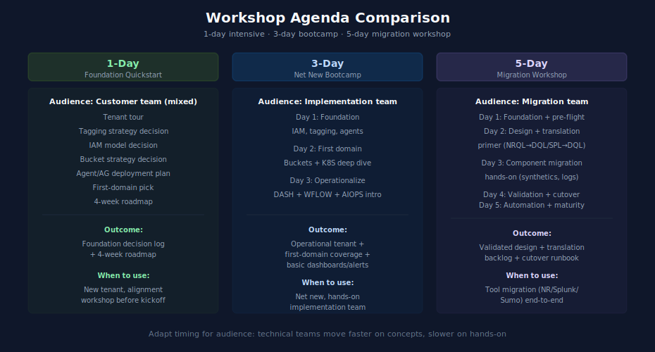

# Workshop Agendas — Sample Plans

> **Purpose:** Reference plans for 1-day, 3-day, and 5-day partner or SI workshops built from the topic series. Each agenda is a starting point — adapt timing, depth, and exercises based on the customer's situation and your team's expertise.
> **Last Updated:** 05/07/2026

---

## Table of Contents

1. [How to Use These Agendas](#how-to-use-these-agendas)
2. [1-Day: Foundation Quickstart](#1-day-foundation-quickstart)
3. [3-Day: Net New Bootcamp](#3-day-net-new-bootcamp)
4. [5-Day: Migration Workshop](#5-day-migration-workshop)
5. [Choosing the Right Agenda](#choosing-the-right-agenda)
6. [Hands-On Lab Inventory](#hands-on-lab-inventory)

---

## How to Use These Agendas

These agendas assume:

- A facilitator who knows Dynatrace and has read the relevant topic series in advance
- A customer team available for the duration
- Pre-work distributed 1–2 weeks ahead so the customer brings prerequisites (cloud account, sample app, etc.)
- A working tenant available — sandbox for greenfield workshops, customer's tenant for migration workshops

Each session block lists the topic series and notebooks to discuss, plus suggested hands-on activities. Adjust timing for your audience: technical teams move faster on concepts and slower on hands-on; executives need more context-setting and less depth.

---

## 1-Day: Foundation Quickstart

**Audience:** A new customer's team about to begin Dynatrace adoption. Half technical (architects, ops leads) and half decision-makers (manager, product owner).

**Goal:** Align on foundation choices (IAM model, tagging strategy, bucket strategy) so implementation can begin with confidence. Decisions made in the workshop unblock the next 2–3 weeks of implementation work.

**Pre-work:** Customer team reads [README](README.md) front door + [ONBRD](../ONBRD%20-%20Dynatrace%20Onboarding/) notebook 01 (First Steps) before the workshop.

| Time | Session | Reading | Activity |
|---|---|---|---|
| 09:00–09:30 | Welcome and tenant tour | [ONBRD](../ONBRD%20-%20Dynatrace%20Onboarding/) — notebook 01 | Live tour of customer's tenant; navigate the Apps menu, dashboards, query data |
| 09:30–10:30 | Tagging strategy decision | [FAQ](../FAQ%20-%20Frequently%20Asked%20Questions/) — entries 01 (host groups), 02 (tagging strategy); [ORGNZ](../ORGNZ%20-%20Organize%20Data:%20Buckets,%20Segments,%20Security/) — notebook 01 | Whiteboard exercise: customer maps their applications/teams to a tagging schema |
| 10:45–12:00 | IAM model decision | [IAM](../IAM%20-%20IAM%20Administration/) — notebooks 01 (governance), 03 (group architecture), 04 (policy authoring) | Whiteboard exercise: customer designs their group hierarchy and identifies first 3–5 policies |
| 13:00–14:30 | Bucket strategy decision | [ORGNZ](../ORGNZ%20-%20Organize%20Data:%20Buckets,%20Segments,%20Security/) — notebooks 02 (understanding buckets), 03 (bucket strategy), 06 (security_context) | Whiteboard exercise: identify which data needs bucket-level separation (compliance, retention) vs. which uses security_context |
| 14:45–15:45 | Agent and ActiveGate deployment plan | [ONBRD](../ONBRD%20-%20Dynatrace%20Onboarding/) — notebooks 03 (ActiveGate), 05 (OneAgent) | Map customer's environments to deployment topology; identify first wave |
| 15:45–16:30 | First-domain pick and roadmap | [Domain Enablement Module](05-domain-enablement.md) | Customer commits to first domain (typically [K8S](../K8S%20-%20Kubernetes%20Monitoring/) or [CLOUD](../CLOUD%20-%20Cloud%20Provider%20Integrations/)) and sets a 4-week milestone |
| 16:30–17:00 | Wrap-up and action plan | [README](README.md), [Foundation Module](04-foundation.md) | Document decisions; assign owners; schedule first follow-up in 2 weeks |

**Outcome:** Customer leaves with a documented Foundation decision log and a 4-week roadmap.

---

## 3-Day: Net New Bootcamp

**Audience:** Customer's primary observability team (4–8 people), including at least one architect, one ops engineer, and one developer.

**Goal:** Take a customer from a fresh tenant through Foundation, first domain, and light operationalize — with hands-on configuration. The team leaves capable of operating the tenant.

**Pre-work:** [README](README.md) front door; [ONBRD](../ONBRD%20-%20Dynatrace%20Onboarding/) notebooks 01–02; tenant provisioned with admin access for the team.

### Day 1 — Foundation

| Time | Session | Reading | Activity |
|---|---|---|---|
| 09:00–10:00 | Tenant tour and orientation | [ONBRD](../ONBRD%20-%20Dynatrace%20Onboarding/) — notebooks 01, 07 | Live tenant tour |
| 10:00–11:30 | IAM and SSO setup | [IAM](../IAM%20-%20IAM%20Administration/) — notebooks 02 (SSO), 03 (groups), 04 (policy authoring) | Hands-on: configure SSO and create first 3 groups with policies |
| 13:00–14:30 | Tagging and host groups | [FAQ](../FAQ%20-%20Frequently%20Asked%20Questions/) — entries 01, 02; [ORGNZ](../ORGNZ%20-%20Organize%20Data:%20Buckets,%20Segments,%20Security/) — notebook 01 | Hands-on: design and apply tag schema |
| 14:45–16:30 | Agent rollout | [ONBRD](../ONBRD%20-%20Dynatrace%20Onboarding/) — notebooks 03 (ActiveGate), 05 (OneAgent) | Hands-on: deploy ActiveGate; install OneAgent on 5–10 hosts |
| 16:30–17:00 | Day 1 review | — | Q&A; document open issues |

### Day 2 — Bucket Strategy + First Domain

| Time | Session | Reading | Activity |
|---|---|---|---|
| 09:00–10:30 | Bucket strategy and security_context | [ORGNZ](../ORGNZ%20-%20Organize%20Data:%20Buckets,%20Segments,%20Security/) — notebooks 02, 03, 06; [Foundation Module](04-foundation.md) | Decide bucket strategy and security_context schema |
| 10:30–12:00 | First-domain selection | [Domain Enablement Module](05-domain-enablement.md) | Customer picks first domain — typically [K8S](../K8S%20-%20Kubernetes%20Monitoring/) (if Kubernetes in scope) |
| 13:00–14:30 | First-domain deep dive (e.g., K8S) | [K8S](../K8S%20-%20Kubernetes%20Monitoring/) — notebooks 01, 02 (DynaKube), 04 (cluster monitoring) | Hands-on: deploy DynaKube on a dev cluster |
| 14:45–16:30 | First-domain expansion | [K8S](../K8S%20-%20Kubernetes%20Monitoring/) — notebooks 05 (workload), 06 (namespace), 14 ([LAB] deployment guide) | Hands-on: configure workload monitoring; explore data |
| 16:30–17:00 | Day 2 review | — | Q&A |

### Day 3 — Light Operationalize

| Time | Session | Reading | Activity |
|---|---|---|---|
| 09:00–10:30 | Dashboards | [DASH](../DASH%20-%20Dashboard%20Design%20&%20Building/) — notebooks 01 (fundamentals), 02 (hierarchy), 04 (operations) | Hands-on: build operations dashboard for the deployed K8s workload |
| 10:30–12:00 | Alerting basics | [WFLOW](../WFLOW%20-%20Workflows%20and%20Alert%20Notifications/) — notebooks 01 (fundamentals), 02 (triggers), 03 (notification basics) | Hands-on: configure first alert and notification |
| 13:00–14:30 | Davis intelligence intro | [AIOPS](../AIOPS%20-%20Dynatrace%20Intelligence/) — notebooks 01 (overview), 02 (anomaly detection), 03 (problems) | Show Davis at work on the live tenant |
| 14:45–16:00 | Operationalize roadmap | [Operationalize Module](06-operationalize.md) | Build a 6-week roadmap covering full DASH, WFLOW, and intro AUTOM |
| 16:00–17:00 | Wrap-up and 30/60/90-day plan | [README](README.md), [Maturity Module](07-maturity.md) | Document plan; schedule follow-ups |

**Outcome:** Customer's tenant is operational with first-domain coverage, basic dashboards and alerts, and a documented roadmap.

---

## 5-Day: Migration Workshop

**Audience:** Customer's migration team (6–12 people) plus 1–2 partner engineers. Covers a tool migration end-to-end at workshop pace; the actual migration unfolds over months afterward, but the workshop produces design and a translation backlog.

**Goal:** For a customer migrating from another tool (typically New Relic, Splunk, or Sumo Logic), produce: tenant design, IAM/ORGNZ decisions, translation backlog, and validated migration approach for at least one application portfolio.

**Pre-work:** [README](README.md), [Doorway 1 — Net New](01-net-new.md) sub-path matching the source tool, customer's source-tool inventory.

This agenda uses **From New Relic** as the example. Adapt for Splunk by substituting [S2D](../S2D%20-%20Splunk%20to%20Dynatrace%20Migration/) and for Sumo Logic by substituting [SL2DT](../SL2DT%20-%20Sumo%20Logic%20to%20Dynatrace/).

### Day 1 — Foundation + Pre-Flight

| Time | Session | Reading | Activity |
|---|---|---|---|
| 09:00–10:30 | Tenant prerequisites | [NR2DT](../NR2DT%20-%20New%20Relic%20to%20Dynatrace%20Migration%20Steps/) — notebook 00 (Step 0 prerequisites) | Confirm tenant, region, account hierarchy |
| 10:30–12:00 | Discover phase | [NR2DT](../NR2DT%20-%20New%20Relic%20to%20Dynatrace%20Migration%20Steps/) — notebook 01 (discover); [NRLC](../NRLC%20-%20New%20Relic%20to%20Dynatrace%20Migration%20Deep%20Dives/) — notebook 01 (platform comparison) | Customer presents NR inventory; team identifies gaps |
| 13:00–14:30 | IAM, tagging, bucket decisions | [Foundation Module](04-foundation.md) | Whiteboard exercise: align on Foundation choices |
| 14:45–16:30 | Strategize | [NR2DT](../NR2DT%20-%20New%20Relic%20to%20Dynatrace%20Migration%20Steps/) — notebook 02 (strategize) | Cutover approach: Big-bang vs phased; pilot app selection |
| 16:30–17:00 | Day 1 review | — | Document decisions |

### Day 2 — Design + Translation Primer

| Time | Session | Reading | Activity |
|---|---|---|---|
| 09:00–10:30 | Design | [NR2DT](../NR2DT%20-%20New%20Relic%20to%20Dynatrace%20Migration%20Steps/) — notebook 03 (design) | Tenant architecture design session |
| 10:30–12:00 | NRQL → DQL | [NRLC](../NRLC%20-%20New%20Relic%20to%20Dynatrace%20Migration%20Deep%20Dives/) — notebook 02 (NRQL → DQL); [NR2DT](../NR2DT%20-%20New%20Relic%20to%20Dynatrace%20Migration%20Steps/) — notebook 04 (translate) | Hands-on: translate 5 representative NRQL queries to DQL |
| 13:00–14:30 | Dashboards approach | [NRLC](../NRLC%20-%20New%20Relic%20to%20Dynatrace%20Migration%20Deep%20Dives/) — notebook 03 (dashboard migration); [DASH](../DASH%20-%20Dashboard%20Design%20&%20Building/) — notebooks 01, 02 | Hands-on: rebuild one NR dashboard in Dynatrace |
| 14:45–16:30 | Alerts and workflows approach | [NRLC](../NRLC%20-%20New%20Relic%20to%20Dynatrace%20Migration%20Deep%20Dives/) — notebook 04 (alert/workflow); [WFLOW](../WFLOW%20-%20Workflows%20and%20Alert%20Notifications/) — notebooks 01, 02 | Hands-on: rebuild one NR alert as a Dynatrace workflow |
| 16:30–17:00 | Day 2 review | — | Document decisions |

### Day 3 — Component Migration Hands-On

| Time | Session | Reading | Activity |
|---|---|---|---|
| 09:00–10:30 | Synthetics migration | [NRLC](../NRLC%20-%20New%20Relic%20to%20Dynatrace%20Migration%20Deep%20Dives/) — notebook 05 (synthetic monitor migration); [SYNTH](../SYNTH%20-%20Synthetic%20Monitoring/) — notebooks 01, 02, 03 | Hands-on: rebuild one NR synthetic in Dynatrace |
| 10:30–12:00 | SLOs and workloads | [NRLC](../NRLC%20-%20New%20Relic%20to%20Dynatrace%20Migration%20Deep%20Dives/) — notebook 06 (SLO/workload migration) | Hands-on: rebuild one SLO |
| 13:00–14:30 | Logs migration | [NRLC](../NRLC%20-%20New%20Relic%20to%20Dynatrace%20Migration%20Deep%20Dives/) — notebook 07 (logs/tags/drops); [OPLOGS](../OPLOGS%20-%20OpenPipeline%20Logs/) — notebooks 01–04 | Hands-on: configure log forwarding for one source |
| 14:45–16:30 | Component-level translation backlog | [NRLC](../NRLC%20-%20New%20Relic%20to%20Dynatrace%20Migration%20Deep%20Dives/) — full series | Build the translation backlog: dashboards, alerts, monitors, logs by app |
| 16:30–17:00 | Day 3 review | — | Document backlog |

### Day 4 — Validation + Operationalize

| Time | Session | Reading | Activity |
|---|---|---|---|
| 09:00–10:30 | Validation approach | [NR2DT](../NR2DT%20-%20New%20Relic%20to%20Dynatrace%20Migration%20Steps/) — notebook 08 (validate); [NRLC](../NRLC%20-%20New%20Relic%20to%20Dynatrace%20Migration%20Deep%20Dives/) — notebook 08 (validation, diff, rollback) | Build validation plan for the pilot app |
| 10:30–12:00 | Cutover and decommission planning | [NR2DT](../NR2DT%20-%20New%20Relic%20to%20Dynatrace%20Migration%20Steps/) — notebook 09 (cutover, rollback, decommission) | Build cutover runbook for the pilot |
| 13:00–14:30 | DASH operations dashboards | [DASH](../DASH%20-%20Dashboard%20Design%20&%20Building/) — notebooks 03 (executive), 04 (operations), 05 (engineering) | Hands-on: build executive dashboard for the migration program |
| 14:45–16:30 | WFLOW notification routing | [WFLOW](../WFLOW%20-%20Workflows%20and%20Alert%20Notifications/) — notebooks 04 (routing), 05 (incident management) | Hands-on: configure notification routing matching customer's on-call structure |
| 16:30–17:00 | Day 4 review | — | Document validation plan and cutover runbook |

### Day 5 — Automation + Maturity Roadmap

| Time | Session | Reading | Activity |
|---|---|---|---|
| 09:00–10:30 | AUTOM — config as code | [AUTOM](../AUTOM%20-%20Dynatrace%20Automation/) — notebooks 01 (landscape), 02 (Settings API), 03 or 04 (Monaco or Terraform — pick one) | Hands-on: define one dashboard in code |
| 10:30–12:00 | AUTOM — CI/CD integration | [AUTOM](../AUTOM%20-%20Dynatrace%20Automation/) — notebooks 05 (workflows-as-code), 07 (CI/CD) | Hands-on: pipeline that deploys Dynatrace config |
| 13:00–14:30 | AIOPS — Davis intelligence | [AIOPS](../AIOPS%20-%20Dynatrace%20Intelligence/) — notebooks 02 (anomaly), 03 (problems), 06 (agentic) | Demo Davis on the migrating tenant |
| 14:45–15:30 | Toolchain reference | [NRLC](../NRLC%20-%20New%20Relic%20to%20Dynatrace%20Migration%20Deep%20Dives/) — notebook 09 (toolchain reference) | Document tooling: NRQL → DQL translator, asset inventory tool, validation diff tool |
| 15:30–16:30 | Maturity roadmap | [Maturity Module](07-maturity.md); [ADOPT](../ADOPT%20-%20Observability%20Adoption%20&%20Maturity/) — notebooks 02, 05 | Build 6-month optimization roadmap post-cutover |
| 16:30–17:00 | Wrap-up and next steps | [README](README.md) | Document; schedule weekly follow-ups for the migration program |

**Outcome:** Customer leaves with: validated tenant design, translation backlog for the in-scope component types, hands-on confidence with translation tooling, validation plan for one pilot app, cutover runbook, automation foundations, and a 6-month roadmap.

---

## Choosing the Right Agenda

| Customer situation | Recommended agenda |
|---|---|
| Net new tenant, no migration, small team | [1-Day Foundation Quickstart](#1-day-foundation-quickstart) followed by self-paced reading |
| Net new tenant, no migration, full implementation team | [3-Day Net New Bootcamp](#3-day-net-new-bootcamp) |
| Migration from another tool (NR/Splunk/Sumo) | [5-Day Migration Workshop](#5-day-migration-workshop) |
| Existing customer adding a domain | Half-day domain workshop using the relevant entry from [Domain Enablement Module](05-domain-enablement.md) |
| Existing customer maturing operations | 2-day operationalize bootcamp using [Operationalize Module](06-operationalize.md) |
| Deployment migration (M2S, S2S) | [5-Day Migration Workshop](#5-day-migration-workshop) substituting M2S or S2S series |

---

## Hands-On Lab Inventory

When a workshop calls for hands-on, the following LAB notebooks are available:

| Series | Lab Notebook | Use For |
|---|---|---|
| [AUTOM](../AUTOM%20-%20Dynatrace%20Automation/) | Notebook 03 [LAB] Monaco | AUTOM workshop — Monaco hands-on |
| [AUTOM](../AUTOM%20-%20Dynatrace%20Automation/) | Notebook 04 [LAB] Terraform | AUTOM workshop — Terraform hands-on |
| [K8S](../K8S%20-%20Kubernetes%20Monitoring/) | Notebook 14 [LAB] Deployment Guide | K8S workshop — DynaKube deployment hands-on |
| [IAM](../IAM%20-%20IAM%20Administration/) | Notebook 11 [WORKSHOP] Policy Persona | IAM workshop — policy design hands-on |

For other domains, build hands-on activities from the customer's own tenant — for example, for SPANS, instrument the customer's pilot service and run live queries.

---

> *This playbook was AI-generated from community-submitted and publicly available sources. It is not officially supported by Dynatrace. Always verify information against official Dynatrace documentation.*
