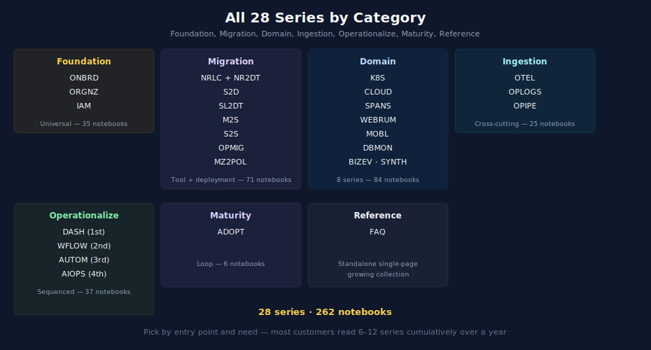

# Series Catalog & Cross-Reference

> **Purpose:** Full inventory of all 32 Dynatrace Best Practice Topic series with cross-references between them. Use this as a quick lookup when you need to find which series covers a specific topic, or to see related material across series.
> **Last Updated:** 07/15/2026

---

## Table of Contents

1. [Alphabetical Catalog](#alphabetical-catalog) — All 28 series with one-line descriptions
2. [By Category](#by-category) — Series grouped by their role in the journey
3. [By Entry Point](#by-entry-point) — Which doorway uses each series
4. [Cross-Reference Matrix](#cross-reference-matrix) — For each series, related series to read
5. [Reading-Order Presets](#reading-order-presets) — "I have 1 hour / 1 week / 1 month / 1 quarter"

---

## Alphabetical Catalog

| Code | Series | Notebooks | Focus |
|---|---|---|---|
| **ADOPT** | [Observability Adoption & Maturity](../ADOPT%20-%20Observability%20Adoption%20&%20Maturity/) | 7 | Maturity model, success metrics, optimization roadmap, FinOps |
| **AIOPS** | [Dynatrace Intelligence](../AIOPS%20-%20Dynatrace%20Intelligence/) | 8 | Davis problems, anomaly detection, generative AI, agentic workflows |
| **ALERT** | [Alerting Strategy and Design](../ALERT%20-%20Alerting%20Strategy%20and%20Design/) | 5 | End-to-end alerting architecture, detection choices, routing, ServiceNow |
| **APPSEC** | [Application Security](../APPSEC%20—%20Application%20Security/) | 10 | RVA, RAP, SPM; security.events; dual-surface IAM; Security Investigator |
| **AUTOM** | [Dynatrace Automation](../AUTOM%20-%20Dynatrace%20Automation/) | 14 | Settings API, Monaco, Terraform, workflows-as-code, GitOps, CI/CD |
| **BIZEV** | [Business Events & Funnel Analysis](../BIZEV%20-%20Business%20Events%20&%20Funnel%20Analysis/) | 8 | Business event ingestion, conversion funnels, revenue impact, executive reporting; Gen2 vs Gen3 adoption paths (what works without Grail) |
| **CLOUD** | [Cloud Provider Integrations](../CLOUD%20-%20Cloud%20Provider%20Integrations/) | 9 | AWS, Azure, GCP integrations; Lambda, EKS, multi-cloud patterns |
| **DASH** | [Dashboard Design & Building](../DASH%20-%20Dashboard%20Design%20&%20Building/) | 8 | Dashboard hierarchy, executive/operations/engineering audiences, sharing and reporting |
| **DBMON** | [Database Monitoring](../DBMON%20-%20Database%20Monitoring/) | 7 | SQL, NoSQL, cache, messaging, query analysis |
| **FAQ** | [Frequently Asked Questions](../FAQ%20-%20Frequently%20Asked%20Questions/) | 14+ | Standalone single-page reference docs (host groups, tagging, OneAgent vs OTel, updates, sizing, troubleshooting) — growing |
| **FINOPS** | [Cost Management & FinOps](../FINOPS%20-%20Cost%20Management%20&%20FinOps/) | 3+ | DPS consumption, forecasting, anomaly detection, optimization framework — growing |
| **IAM** | [IAM Administration](../IAM%20-%20IAM%20Administration/) | 13 | Policies, boundaries, groups, SSO, audit, parameterized assignments |
| **K8S** | [Kubernetes Monitoring](../K8S%20-%20Kubernetes%20Monitoring/) | 15 | DynaKube, GitOps deployment, cluster + workload monitoring, troubleshooting |
| **M2S** | [Managed to SaaS Migration](../M2S%20-%20Managed%20to%20SaaS%20Migration/) | 10 | 9-step procedural runbook for Managed → SaaS deployment migration |
| **MOBL** | [Mobile Monitoring](../MOBL%20-%20Mobile%20Monitoring/) | 13 | iOS, Android, cross-platform SDKs; crash reporting, session replay, privacy |
| **MZ2POL** | [Management Zone to Policy Migration](../MZ2POL%20-%20Management%20Zone%20to%20Policy%20Migration/) | 10 | MZ analysis, Gen2 → Gen3 access control migration |
| **NR2DT** | [New Relic to Dynatrace Migration Steps](../NR2DT%20-%20New%20Relic%20to%20Dynatrace%20Migration%20Steps/) | 11 | Procedural runbook (00 prereqs + 9 steps + summary); refers to NRLC for component depth |
| **NRLC** | [New Relic to Dynatrace Migration Deep Dives](../NRLC%20-%20New%20Relic%20to%20Dynatrace%20Migration%20Deep%20Dives/) | 9 | Standalone component deep dives (NRQL→DQL, dashboards, alerts, synthetics, SLOs, logs) |
| **ONBRD** | [Dynatrace Onboarding](../ONBRD%20-%20Dynatrace%20Onboarding/) | 11 | First steps, IAM, ActiveGate, OneAgent, basic data org and dashboards |
| **OPIPE** | [OpenPipeline Beyond Logs](../OPIPE%20-%20OpenPipeline%20Beyond%20Logs/) | 7 | Spans, metrics, business and security event pipelines; cross-scope design patterns |
| **OPLOGS** | [OpenPipeline Logs](../OPLOGS%20-%20OpenPipeline%20Logs/) | 9 | Log fundamentals, processing, buckets, parsing, security |
| **OPMIG** | [OpenPipeline Migration](../OPMIG%20-%20OpenPipeline%20Migration/) | 10 | Classic Logs → OpenPipeline migration runbook |
| **ORGNZ** | [Organize Data: Buckets, Segments, Security](../ORGNZ%20-%20Organize%20Data:%20Buckets,%20Segments,%20Security/) | 11 | Buckets, security_context, permissions, segments, enterprise patterns |
| **OTEL** | [OpenTelemetry Integration](../OTEL%20-%20OpenTelemetry%20Integration/) | 9 | OTel collector deployment, trace/metric/log instrumentation, Dynatrace integration |
| **S2D** | [Splunk to Dynatrace Migration](../S2D%20-%20Splunk%20to%20Dynatrace%20Migration/) | 10 | SPL → DQL, anomaly detectors, dashboards, naming standards |
| **S2S** | [SaaS to SaaS Migration](../S2S%20-%20SaaS%20to%20SaaS%20Migration/) | 11 | 9-step runbook for SaaS → SaaS tenant consolidation; includes migration scripts |
| **SL2DT** | [Sumo Logic to Dynatrace](../SL2DT%20-%20Sumo%20Logic%20to%20Dynatrace/) | 10 | Sumo procedural runbook; logs/dashboards/monitors; Gen3-first |
| **SLO** | [Service Level Objectives](../SLO%20-%20Service%20Level%20Objectives/) | 5 | SLI fundamentals, defining SLIs, error budgets, burn-rate alerting, SLOs as code |
| **SPANS** | [Distributed Tracing and Spans](../SPANS%20-%20Distributed%20Tracing%20and%20Spans/) | 9 | Span fundamentals, querying, topology, analytics, cost optimization |
| **SYNTH** | [Synthetic Monitoring](../SYNTH%20-%20Synthetic%20Monitoring/) | 7 | Browser monitors, HTTP monitors, private locations, network monitoring |
| **WEBRUM** | [Web Real User Monitoring](../WEBRUM%20-%20Web%20Real%20User%20Monitoring/) | 9 | RUM fundamentals, SPA, Core Web Vitals, session replay |
| **WFLOW** | [Workflows and Alert Notifications](../WFLOW%20-%20Workflows%20and%20Alert%20Notifications/) | 10 | Workflow triggers, notification routing, incident management, JS/HTTP actions, governance |

---

## By Category

### Foundation (Universal)

Every customer needs these regardless of entry point.

- [ONBRD](../ONBRD%20-%20Dynatrace%20Onboarding/) — Tenant orientation, OneAgent, ActiveGate
- [ORGNZ](../ORGNZ%20-%20Organize%20Data:%20Buckets,%20Segments,%20Security/) — Buckets, security_context, segments
- [IAM](../IAM%20-%20IAM%20Administration/) — Policies, groups, boundaries
- [APPSEC](../APPSEC%20—%20Application%20Security/) — Security observability (RVA / RAP / SPM)

### Migration (Pick Based on Source)

These are entry points for customers leaving another tool or migrating their Dynatrace deployment.

**Tool migration (typically with a net-new Dynatrace tenant):**

- [NRLC](../NRLC%20-%20New%20Relic%20to%20Dynatrace%20Migration%20Deep%20Dives/) + [NR2DT](../NR2DT%20-%20New%20Relic%20to%20Dynatrace%20Migration%20Steps/) — From New Relic
- [S2D](../S2D%20-%20Splunk%20to%20Dynatrace%20Migration/) — From Splunk
- [SL2DT](../SL2DT%20-%20Sumo%20Logic%20to%20Dynatrace/) — From Sumo Logic
- [OPMIG](../OPMIG%20-%20OpenPipeline%20Migration/) — Classic Logs → OpenPipeline (internal Dynatrace migration)
- [MZ2POL](../MZ2POL%20-%20Management%20Zone%20to%20Policy%20Migration/) — Management Zones → Policies (internal Dynatrace migration)

**Deployment migration (existing Dynatrace customer):**

- [M2S](../M2S%20-%20Managed%20to%20SaaS%20Migration/) — Managed → SaaS
- [S2S](../S2S%20-%20SaaS%20to%20SaaS%20Migration/) — SaaS → SaaS

### Domain (Pick Based on What You Monitor)

- [K8S](../K8S%20-%20Kubernetes%20Monitoring/) — Kubernetes
- [CLOUD](../CLOUD%20-%20Cloud%20Provider%20Integrations/) — AWS, Azure, GCP
- [SPANS](../SPANS%20-%20Distributed%20Tracing%20and%20Spans/) — Distributed tracing
- [WEBRUM](../WEBRUM%20-%20Web%20Real%20User%20Monitoring/) — Web Real User Monitoring
- [MOBL](../MOBL%20-%20Mobile%20Monitoring/) — Mobile (iOS, Android)
- [DBMON](../DBMON%20-%20Database%20Monitoring/) — Databases
- [BIZEV](../BIZEV%20-%20Business%20Events%20&%20Funnel%20Analysis/) — Business events
- [SYNTH](../SYNTH%20-%20Synthetic%20Monitoring/) — Synthetic monitoring

### Ingestion (Cross-Cutting Mechanism)

- [OTEL](../OTEL%20-%20OpenTelemetry%20Integration/) — OpenTelemetry collector and instrumentation
- [OPLOGS](../OPLOGS%20-%20OpenPipeline%20Logs/) — Log processing in OpenPipeline
- [OPIPE](../OPIPE%20-%20OpenPipeline%20Beyond%20Logs/) — OpenPipeline for spans, metrics, business and security events

### Operationalize (Day-2 Operations)

- [ALERT](../ALERT%20-%20Alerting%20Strategy%20and%20Design/) — End-to-end alerting (detection, routing, ITSM)
- [DASH](../DASH%20-%20Dashboard%20Design%20&%20Building/) — Dashboards
- [WFLOW](../WFLOW%20-%20Workflows%20and%20Alert%20Notifications/) — Workflows and notification routing
- [AUTOM](../AUTOM%20-%20Dynatrace%20Automation/) — Configuration automation and GitOps
- [AIOPS](../AIOPS%20-%20Dynatrace%20Intelligence/) — Davis intelligence
- [SLO](../SLO%20-%20Service%20Level%20Objectives/) — Service level objectives
- [FINOPS](../FINOPS%20-%20Cost%20Management%20&%20FinOps/) — Cost optimization and FinOps

### Maturity (Continuous Improvement)

Read in order; each builds on the previous.

- [DASH](../DASH%20-%20Dashboard%20Design%20&%20Building/) — Dashboards
- [WFLOW](../WFLOW%20-%20Workflows%20and%20Alert%20Notifications/) — Workflows and alerting
- [AUTOM](../AUTOM%20-%20Dynatrace%20Automation/) — Configuration automation
- [AIOPS](../AIOPS%20-%20Dynatrace%20Intelligence/) — Davis intelligence and AI workflows

### Maturity & Reference

- [ADOPT](../ADOPT%20-%20Observability%20Adoption%20&%20Maturity/) — Continuous improvement framework
- [FAQ](../FAQ%20-%20Frequently%20Asked%20Questions/) — Standalone reference docs

---

## By Entry Point

This table shows which doorway in the playbook uses each series and how it appears (Primary = first-class entry; Refresh = revisit only where Gen3 or scope changed; — = not used).

| Series | Net New | Expanding / Consolidating | Deployment Migration |
|---|---|---|---|
| ONBRD | Primary | Refresh as needed | Refresh as needed |
| ORGNZ | Primary | Primary (Gen3 changes) | Primary (Gen3 changes) |
| IAM | Primary | Primary (Gen3 changes) | Primary (Gen2 → Gen3) |
| NRLC | If from New Relic | If consolidating APM from NR | — |
| NR2DT | If from New Relic | — | — |
| S2D | If from Splunk | If consolidating logs from Splunk | — |
| SL2DT | If from Sumo Logic | If consolidating logs from Sumo | — |
| M2S | — | — | Primary (Managed → SaaS) |
| S2S | — | — | Primary (SaaS → SaaS) |
| OPMIG | — | If on Classic Logs | — |
| MZ2POL | — | If migrating Gen2 access control | If migrating Gen2 MZs |
| K8S, CLOUD, SPANS, WEBRUM, MOBL, DBMON, BIZEV, SYNTH | After Foundation | Primary for "adding a domain" | After deployment migration |
| OTEL, OPLOGS, OPIPE | As ingestion needs arise | As ingestion needs arise | As ingestion needs arise |
| DASH, WFLOW, AUTOM, AIOPS | After first domain | Primary for "maturing operations" | After deployment migration |
| ADOPT | Ongoing | Ongoing | Ongoing |
| FAQ | Reference | Reference | Reference |

---

## Cross-Reference Matrix

For each series, the related series most often read alongside it:

| If you are reading… | Also see… |
|---|---|
| [ADOPT](../ADOPT%20-%20Observability%20Adoption%20&%20Maturity/) | [DASH](../DASH%20-%20Dashboard%20Design%20&%20Building/), [ORGNZ](../ORGNZ%20-%20Organize%20Data:%20Buckets,%20Segments,%20Security/) (cost optimization), [BIZEV](../BIZEV%20-%20Business%20Events%20&%20Funnel%20Analysis/) (success metrics) |
| [AIOPS](../AIOPS%20-%20Dynatrace%20Intelligence/) | [WFLOW](../WFLOW%20-%20Workflows%20and%20Alert%20Notifications/) (alert routing), [DASH](../DASH%20-%20Dashboard%20Design%20&%20Building/) (visualizing problems), [AUTOM](../AUTOM%20-%20Dynatrace%20Automation/) (workflow-as-code) |
| [AUTOM](../AUTOM%20-%20Dynatrace%20Automation/) | [WFLOW](../WFLOW%20-%20Workflows%20and%20Alert%20Notifications/) (workflow-as-code overlap), [IAM](../IAM%20-%20IAM%20Administration/) (provisioning), [K8S](../K8S%20-%20Kubernetes%20Monitoring/) (GitOps), [ONBRD](../ONBRD%20-%20Dynatrace%20Onboarding/) (Settings API basics) |
| [BIZEV](../BIZEV%20-%20Business%20Events%20&%20Funnel%20Analysis/) | [OPIPE](../OPIPE%20-%20OpenPipeline%20Beyond%20Logs/) (event pipelines), [DASH](../DASH%20-%20Dashboard%20Design%20&%20Building/) (executive reporting), [WEBRUM](../WEBRUM%20-%20Web%20Real%20User%20Monitoring/) (frontend events) |
| [CLOUD](../CLOUD%20-%20Cloud%20Provider%20Integrations/) | [OTEL](../OTEL%20-%20OpenTelemetry%20Integration/) (collectors), [K8S](../K8S%20-%20Kubernetes%20Monitoring/) (managed K8s), [OPLOGS](../OPLOGS%20-%20OpenPipeline%20Logs/) (CloudWatch ingestion) |
| [DASH](../DASH%20-%20Dashboard%20Design%20&%20Building/) | [WFLOW](../WFLOW%20-%20Workflows%20and%20Alert%20Notifications/), [BIZEV](../BIZEV%20-%20Business%20Events%20&%20Funnel%20Analysis/) (executive dashboards), [ORGNZ](../ORGNZ%20-%20Organize%20Data:%20Buckets,%20Segments,%20Security/) (segments and filters) |
| [DBMON](../DBMON%20-%20Database%20Monitoring/) | [SPANS](../SPANS%20-%20Distributed%20Tracing%20and%20Spans/) (database call tracing), [DASH](../DASH%20-%20Dashboard%20Design%20&%20Building/) (database dashboards) |
| [FAQ](../FAQ%20-%20Frequently%20Asked%20Questions/) | [ORGNZ](../ORGNZ%20-%20Organize%20Data:%20Buckets,%20Segments,%20Security/) (tagging), [ONBRD](../ONBRD%20-%20Dynatrace%20Onboarding/) (host groups) |
| [IAM](../IAM%20-%20IAM%20Administration/) | [ORGNZ](../ORGNZ%20-%20Organize%20Data:%20Buckets,%20Segments,%20Security/) (security_context for boundaries), [MZ2POL](../MZ2POL%20-%20Management%20Zone%20to%20Policy%20Migration/) (Gen2 → Gen3), [ONBRD](../ONBRD%20-%20Dynatrace%20Onboarding/) (initial setup) |
| [K8S](../K8S%20-%20Kubernetes%20Monitoring/) | [OTEL](../OTEL%20-%20OpenTelemetry%20Integration/) (collector deployment), [CLOUD](../CLOUD%20-%20Cloud%20Provider%20Integrations/) (managed K8s), [AUTOM](../AUTOM%20-%20Dynatrace%20Automation/) (GitOps), [OPLOGS](../OPLOGS%20-%20OpenPipeline%20Logs/) (K8s logs) |
| [M2S](../M2S%20-%20Managed%20to%20SaaS%20Migration/) | [ORGNZ](../ORGNZ%20-%20Organize%20Data:%20Buckets,%20Segments,%20Security/), [IAM](../IAM%20-%20IAM%20Administration/), [MZ2POL](../MZ2POL%20-%20Management%20Zone%20to%20Policy%20Migration/) (Gen2 → Gen3) |
| [MOBL](../MOBL%20-%20Mobile%20Monitoring/) | [SPANS](../SPANS%20-%20Distributed%20Tracing%20and%20Spans/) (mobile-to-backend tracing), [DASH](../DASH%20-%20Dashboard%20Design%20&%20Building/) (mobile dashboards) |
| [MZ2POL](../MZ2POL%20-%20Management%20Zone%20to%20Policy%20Migration/) | [IAM](../IAM%20-%20IAM%20Administration/), [ORGNZ](../ORGNZ%20-%20Organize%20Data:%20Buckets,%20Segments,%20Security/) |
| [NR2DT](../NR2DT%20-%20New%20Relic%20to%20Dynatrace%20Migration%20Steps/) | [NRLC](../NRLC%20-%20New%20Relic%20to%20Dynatrace%20Migration%20Deep%20Dives/) (component depth), [ONBRD](../ONBRD%20-%20Dynatrace%20Onboarding/), [OPLOGS](../OPLOGS%20-%20OpenPipeline%20Logs/) (logs migration) |
| [NRLC](../NRLC%20-%20New%20Relic%20to%20Dynatrace%20Migration%20Deep%20Dives/) | [NR2DT](../NR2DT%20-%20New%20Relic%20to%20Dynatrace%20Migration%20Steps/) (procedural runbook), [SPANS](../SPANS%20-%20Distributed%20Tracing%20and%20Spans/), [DASH](../DASH%20-%20Dashboard%20Design%20&%20Building/), [WFLOW](../WFLOW%20-%20Workflows%20and%20Alert%20Notifications/), [SYNTH](../SYNTH%20-%20Synthetic%20Monitoring/) |
| [ONBRD](../ONBRD%20-%20Dynatrace%20Onboarding/) | [ORGNZ](../ORGNZ%20-%20Organize%20Data:%20Buckets,%20Segments,%20Security/), [IAM](../IAM%20-%20IAM%20Administration/), [DASH](../DASH%20-%20Dashboard%20Design%20&%20Building/), [WFLOW](../WFLOW%20-%20Workflows%20and%20Alert%20Notifications/) |
| [OPIPE](../OPIPE%20-%20OpenPipeline%20Beyond%20Logs/) | [SPANS](../SPANS%20-%20Distributed%20Tracing%20and%20Spans/), [BIZEV](../BIZEV%20-%20Business%20Events%20&%20Funnel%20Analysis/), [OPLOGS](../OPLOGS%20-%20OpenPipeline%20Logs/), [ORGNZ](../ORGNZ%20-%20Organize%20Data:%20Buckets,%20Segments,%20Security/) (buckets) |
| [OPLOGS](../OPLOGS%20-%20OpenPipeline%20Logs/) | [OPMIG](../OPMIG%20-%20OpenPipeline%20Migration/) (migration), [OPIPE](../OPIPE%20-%20OpenPipeline%20Beyond%20Logs/), [ORGNZ](../ORGNZ%20-%20Organize%20Data:%20Buckets,%20Segments,%20Security/) (buckets) |
| [OPMIG](../OPMIG%20-%20OpenPipeline%20Migration/) | [OPLOGS](../OPLOGS%20-%20OpenPipeline%20Logs/), [OPIPE](../OPIPE%20-%20OpenPipeline%20Beyond%20Logs/), [ORGNZ](../ORGNZ%20-%20Organize%20Data:%20Buckets,%20Segments,%20Security/) |
| [ORGNZ](../ORGNZ%20-%20Organize%20Data:%20Buckets,%20Segments,%20Security/) | [IAM](../IAM%20-%20IAM%20Administration/), [FAQ](../FAQ%20-%20Frequently%20Asked%20Questions/) (tagging), [MZ2POL](../MZ2POL%20-%20Management%20Zone%20to%20Policy%20Migration/) |
| [OTEL](../OTEL%20-%20OpenTelemetry%20Integration/) | [K8S](../K8S%20-%20Kubernetes%20Monitoring/), [CLOUD](../CLOUD%20-%20Cloud%20Provider%20Integrations/), [SPANS](../SPANS%20-%20Distributed%20Tracing%20and%20Spans/), [NRLC](../NRLC%20-%20New%20Relic%20to%20Dynatrace%20Migration%20Deep%20Dives/) |
| [S2D](../S2D%20-%20Splunk%20to%20Dynatrace%20Migration/) | [OPLOGS](../OPLOGS%20-%20OpenPipeline%20Logs/), [OPIPE](../OPIPE%20-%20OpenPipeline%20Beyond%20Logs/), [DASH](../DASH%20-%20Dashboard%20Design%20&%20Building/), [WFLOW](../WFLOW%20-%20Workflows%20and%20Alert%20Notifications/), [ORGNZ](../ORGNZ%20-%20Organize%20Data:%20Buckets,%20Segments,%20Security/) |
| [S2S](../S2S%20-%20SaaS%20to%20SaaS%20Migration/) | [ORGNZ](../ORGNZ%20-%20Organize%20Data:%20Buckets,%20Segments,%20Security/), [IAM](../IAM%20-%20IAM%20Administration/), [MZ2POL](../MZ2POL%20-%20Management%20Zone%20to%20Policy%20Migration/) |
| [SL2DT](../SL2DT%20-%20Sumo%20Logic%20to%20Dynatrace/) | [OPLOGS](../OPLOGS%20-%20OpenPipeline%20Logs/), [OPIPE](../OPIPE%20-%20OpenPipeline%20Beyond%20Logs/), [DASH](../DASH%20-%20Dashboard%20Design%20&%20Building/), [WFLOW](../WFLOW%20-%20Workflows%20and%20Alert%20Notifications/), [ORGNZ](../ORGNZ%20-%20Organize%20Data:%20Buckets,%20Segments,%20Security/) |
| [SPANS](../SPANS%20-%20Distributed%20Tracing%20and%20Spans/) | [OTEL](../OTEL%20-%20OpenTelemetry%20Integration/), [OPIPE](../OPIPE%20-%20OpenPipeline%20Beyond%20Logs/) (span pipelines), [DBMON](../DBMON%20-%20Database%20Monitoring/) (DB tracing) |
| [SYNTH](../SYNTH%20-%20Synthetic%20Monitoring/) | [DASH](../DASH%20-%20Dashboard%20Design%20&%20Building/), [WFLOW](../WFLOW%20-%20Workflows%20and%20Alert%20Notifications/) (alerting on synthetic) |
| [WEBRUM](../WEBRUM%20-%20Web%20Real%20User%20Monitoring/) | [SPANS](../SPANS%20-%20Distributed%20Tracing%20and%20Spans/) (frontend-to-backend tracing), [BIZEV](../BIZEV%20-%20Business%20Events%20&%20Funnel%20Analysis/), [DASH](../DASH%20-%20Dashboard%20Design%20&%20Building/) |
| [WFLOW](../WFLOW%20-%20Workflows%20and%20Alert%20Notifications/) | [AIOPS](../AIOPS%20-%20Dynatrace%20Intelligence/) (problem routing), [AUTOM](../AUTOM%20-%20Dynatrace%20Automation/) (workflow-as-code), [DASH](../DASH%20-%20Dashboard%20Design%20&%20Building/) |

---

## Reading-Order Presets

Quick lists for time-boxed reading:

### "I have 1 hour" — fastest orientation

1. This document — sections [Alphabetical Catalog](#alphabetical-catalog) and [By Category](#by-category)
2. [README front door](README.md) — pick a doorway based on your situation
3. [ONBRD](../ONBRD%20-%20Dynatrace%20Onboarding/) — first 1–2 notebooks for orientation

### "I have 1 week" — Foundation only

1. [ONBRD](../ONBRD%20-%20Dynatrace%20Onboarding/) — full series (11 notebooks)
2. [ORGNZ](../ORGNZ%20-%20Organize%20Data:%20Buckets,%20Segments,%20Security/) — first 5 notebooks (introduction, buckets, bucket strategy, Grail permissions, bucket-level access)
3. [IAM](../IAM%20-%20IAM%20Administration/) — first 5 notebooks (governance, SSO, group architecture, policies, boundaries)

Aligned with [Foundation Module](04-foundation.md).

### "I have 1 month" — Foundation + first domain + light operationalize

1. [Foundation Module](04-foundation.md) reading order
2. One domain — typically [K8S](../K8S%20-%20Kubernetes%20Monitoring/) or [CLOUD](../CLOUD%20-%20Cloud%20Provider%20Integrations/) depending on environment
3. [DASH](../DASH%20-%20Dashboard%20Design%20&%20Building/) — first 4 notebooks (fundamentals, hierarchy, executive, operations)
4. [WFLOW](../WFLOW%20-%20Workflows%20and%20Alert%20Notifications/) — first 4 notebooks (fundamentals, triggers, notifications basics, notification routing)

### "I have 1 quarter" — full Net New track

1. [Net New Doorway](01-net-new.md) — full reading order across all phases
2. [Domain Enablement Module](05-domain-enablement.md) — at least 2 domains
3. [Operationalize Module](06-operationalize.md) — DASH → WFLOW → AUTOM
4. [Maturity Module](07-maturity.md) — kick off

---

## Maintenance Mandate

**This index and all -START-HERE- navigation files MUST be updated when new series are added to `topics/`.**

Update checklist for each new series:
- [ ] Add series name, notebook count, and focus area to the appropriate table above (Operationalize, Domain Enablement, etc.)
- [ ] Add to `99-index.md` cross-reference map if overlaps exist with other series
- [ ] Update series-count references in all -START-HERE- files (currently 32 topic series as of July 15, 2026)
- [ ] Add the new series to relevant module files (e.g., if the series supports Domain Enablement, add to `05-domain-enablement.md`)
- [ ] Update `Last Updated` dates to current date across all affected files
- [ ] Verify no broken internal cross-references to the new series

The series counts and cross-references are discovery mechanisms; stale information undermines the playbook's value. Add this update to the Definition of Done for any PR that introduces a new series.

---

> *This playbook was AI-generated from community-submitted and publicly available sources. It is not officially supported by Dynatrace. Always verify information against official Dynatrace documentation.*
