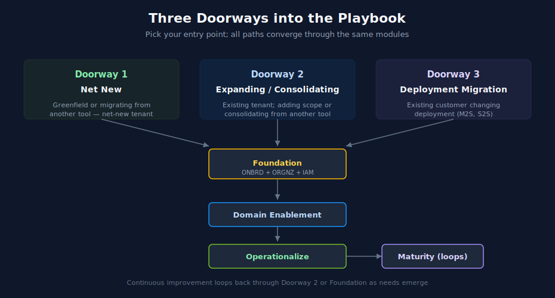

# Best Practice Topics — Where to Start

> **Purpose:** A focused table of contents for the Dynatrace Best Practice Topics. Use the entry-point selector below to find your starting path, then follow the sequenced reading order across topic series.
> **Last Updated:** 05/07/2026

---

## How to Use This Playbook

This is a navigational guide — not a content series. Each section here points to one or more topic series in this repository. Read the playbook to understand the recommended order; read the topic series themselves for the content.

If you are a:

- **Customer** evaluating or expanding Dynatrace — start with the doorway that matches your situation below.
- **Partner or SI consultant** scoping an engagement — see [Workshop Agendas](10-workshop-agendas.md) for sample 1-day, 3-day, and 5-day plans built from the topic series.
- **Self-paced learner** — pick a doorway based on your situation (greenfield, migration, expanding, deployment change) and follow the sequenced reading order. Time estimates are calendar weeks for a small/mid-sized team; enterprise scale takes longer.

---

## Pick Your Doorway

Three entry points, each routing to the right combination of topic series. Pick the one that matches your situation:

### Doorway 1 — [Net New](01-net-new.md)

You are starting fresh with Dynatrace, with or without an existing observability tool to migrate from. Net-new tenant.

Sub-paths covered:

- Greenfield (no prior observability platform)
- Migrating from New Relic
- Migrating from Splunk
- Migrating from Sumo Logic
- Migrating from multiple tools

### Doorway 2 — [Expanding or Consolidating](02-expand-consolidate.md)

You already have a Dynatrace tenant and are adding scope, pulling data in from another tool, or maturing operations.

Sub-paths covered:

- Adding a new domain (Kubernetes, Mobile, RUM, Database, Synthetic, Business Events, Cloud)
- Consolidating logs from Splunk or Sumo Logic into an existing tenant
- Consolidating APM from New Relic into an existing tenant
- Maturing operations (dashboards, alerting, automation, AI)

### Doorway 3 — [Deployment Migration](03-deployment-migration.md)

You are an existing Dynatrace customer changing your deployment model.

Sub-paths covered:

- Managed → SaaS migration
- SaaS → SaaS tenant consolidation or region change

---

## Reusable Modules

After picking a doorway, the recommended path will route you through one or more of these modules. They can also be read directly:

- [Foundation Module](04-foundation.md) — ONBRD + ORGNZ + IAM reading order, mandatory vs optional flags
- [Domain Enablement Module](05-domain-enablement.md) — Pick-list of domains with prerequisites and recommended sequencing
- [Operationalize Module](06-operationalize.md) — DASH → WFLOW → AUTOM → AIOPS sequence, with reasoning for that order
- [Maturity Module](07-maturity.md) — ADOPT framing for continuous improvement

---

## Reference

- [Overlap Map](08-overlap-map.md) — Where multiple series cover the same ground; which is canonical and recommended reading order
- [Workshop Agendas](10-workshop-agendas.md) — Sample 1-day, 3-day, and 5-day partner/SI workshop plans
- [Series Catalog & Cross-Reference](99-index.md) — Full inventory of all 28 topic series with cross-reference matrix and reading-order presets

---

## Time Investment Overview

Rough estimates for a small to mid-sized team. Enterprise scale takes longer due to coordination overhead, change-management process, and the number of in-scope applications.

| Phase | Time | What you accomplish |
|---|---|---|
| Foundation | 2–3 weeks | Tenant operational; OneAgent and ActiveGate deployed; basic IAM, tagging, and bucket strategy in place |
| First domain | 1–2 weeks per domain | One observability domain (Kubernetes, web RUM, mobile, database, etc.) producing useful data |
| Migration (Net New from another tool) | 3–9 months | Dual-running the source tool and Dynatrace; staged cutover by component |
| Operationalize | 4–8 weeks | Dashboards, alerts, workflows, and automation in steady state |
| Maturity | Continuous | Ongoing optimization, governance, FinOps, platform expansion |

Time estimates within each doorway file refine these numbers by sub-track.

---

## Conventions Used

- **Topic series codes** (e.g., ONBRD, ORGNZ, IAM) appear as inline text. Click the topic name to open the series directory.
- **Notebook references** (e.g., ONBRD-01..05) appear as inline text — the numbers help you locate specific notebooks within a topic; they are not hyperlinks.
- **Mandatory / Recommended / Optional** flags indicate priority within a reading list:
  - **Mandatory** — required for a working tenant in this scenario
  - **Recommended** — significantly improves the outcome; skip only with a reason
  - **Optional** — context-specific; read if the topic applies to your environment
  - **Skip if already have** — covered by another series you have read or by a prior tenant; skim only

---

## Where to Get Help

- For frequently-asked questions, see the [FAQ](../faq/) topic series — standalone single-page reference docs (host group naming, tagging strategy, and growing).
- For DQL syntax and query patterns, the [ORGNZ](../orgnz/) and [SPANS](../spans/) series each have query references. Official Dynatrace documentation is authoritative.
- For unresolved questions during a migration, see the appropriate migration series: [NR2DT](../nr2dt/), [NRLC](../nrlc/), [S2D](../s2d/), [SL2DT](../sl2dt/), [M2S](../m2s/), [S2S](../s2s/).
- For platform maturity and adoption questions, see [ADOPT](../adopt/).

---

> *This playbook was AI-generated from community-submitted and publicly available sources. It is not officially supported by Dynatrace. Always verify information against official Dynatrace documentation.*
