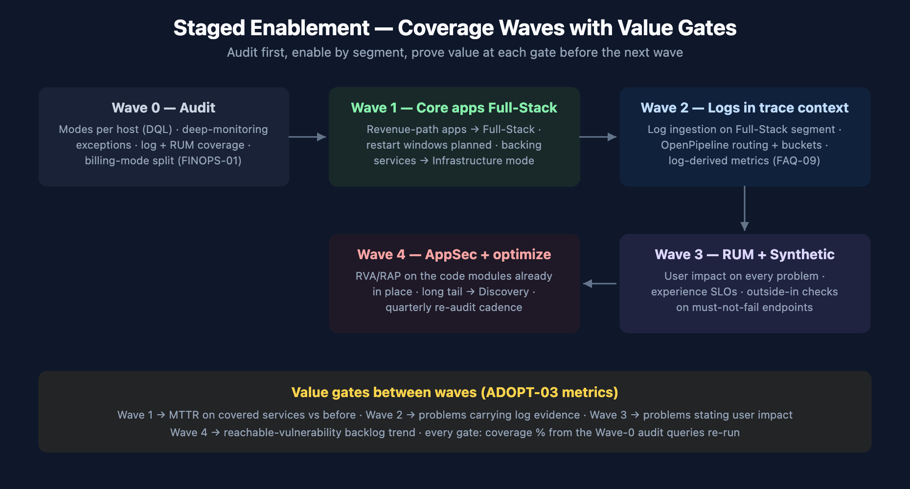

# ADOPT-06: Maximizing Platform Value — Coverage Audit and Staged Enablement

> **Series:** ADOPT — Observability Adoption & Maturity | **Notebook:** 6 of 6 | **Created:** July 2026 | **Last Updated:** 07/08/2026

## Overview

Most Dynatrace estates run below the coverage they pay for, and well below the coverage that would change outcomes: hosts in Infrastructure mode on the revenue path, Full-Stack hosts whose main process group has deep monitoring switched off, logs shipped to a tool nobody correlates, RUM "planned for next quarter" three quarters running. The impact of each gap — what specifically stops working — is cataloged in **FAQ-12** (*Coming from Another Tool — How Partial Enablement Handicaps Your Dynatrace Coverage*); this notebook is the **program** that closes the gaps: audit current coverage, segment the estate, enable in waves, and prove value at a gate before each next wave.

This is a maturity play, not a switch-flip: it deliberately builds on ADOPT-01 (where you are on the maturity model), ADOPT-02 (platform health), and ADOPT-03 (the success metrics that become your value gates).

---

## Table of Contents

1. [Why Coverage Gaps Erode Value](#why-gaps)
2. [Wave 0 — Audit Current Coverage](#wave-0)
3. [Segment the Estate](#segment)
4. [Waves 1–4 — Staged Enablement](#waves)
5. [Value Gates — Proving the Uplift](#gates)
6. [Recommended Approach](#recommendation)

---

## Prerequisites

| Requirement | Details |
|-------------|---------|
| **Dynatrace Environment** | SaaS on DPS (Discovery mode and the mode-split billing series are DPS constructs). |
| **Permissions** | Settings access for monitoring modes and process-group monitoring rules; `storage:*:read` scopes for the audit DQL. |
| **Companion reading** | **FAQ-12** — the per-capability impact matrix this program operationalizes; ADOPT-01/02/03 for maturity level, health baseline, and metrics. |
| **Audience** | Platform / Observability Lead running an enablement program; account teams building the customer business case. |

<a id="why-gaps"></a>
## 1. Why Coverage Gaps Erode Value

The short version of FAQ-12 §3: Dynatrace's capabilities stack — code modules produce traces, traces produce services, services complete Smartscape, topology powers Davis root-cause analysis, RUM attaches user impact, logs supply the evidence. Because the layers feed each other, **the marginal value of each layer is higher when the others are on** — and the marginal damage of each gap is bigger than the layer itself. An estate at 60% coverage does not get 60% of the value; it gets the intersection, and the intersection is where the expensive questions ("what broke, why, who is affected") go unanswered.

The program consequence: enabling in **connected segments** (one application's full path at Full-Stack + logs + RUM) beats enabling one layer estate-wide. A fully-covered revenue path demonstrates Davis RCA, user-impact statements, and trace-context logs on day one — the demo that funds the next wave.

For the per-capability breakdown (what exactly stops working without Full-Stack, deep monitoring, tracing, logs, RUM, synthetic, or AppSec), use the FAQ-12 impact matrix — this notebook does not repeat it.

<a id="wave-0"></a>
## 2. Wave 0 — Audit Current Coverage



<!-- MARKDOWN_TABLE_ALTERNATIVE
| Wave | Content | Gate |
|------|---------|------|
| 0 Audit | Modes per host, deep-monitoring exceptions, log/RUM coverage, billing-mode split | Baseline recorded |
| 1 Core apps Full-Stack | Revenue-path apps to Full-Stack; backing services to Infrastructure; restarts planned | MTTR delta on covered services |
| 2 Logs | Log ingestion on the Full-Stack segment; OpenPipeline routing; log-derived metrics | Problems carrying log evidence |
| 3 RUM + Synthetic | User impact, experience SLOs, outside-in checks | Problems stating user impact |
| 4 AppSec + optimize | RVA/RAP on existing code modules; long tail to Discovery; re-audit cadence | Reachable-vuln backlog trend |
For environments where SVG doesn't render
-->

Run the audit before any enablement conversation — most estates find at least one surprise. Four measurements:

**Hosts by monitoring mode** (note: reads the classic entity surface — `monitoringMode` is not exposed on `smartscapeNodes "HOST"` on current tenants, verified 07/08/2026):

```dql
// Wave 0 — hosts by OneAgent monitoring mode
fetch dt.entity.host
| fieldsAdd mode = monitoringMode
| summarize hosts = count(), by:{mode}
| sort hosts desc
```

**Log coverage** — hosts actually shipping logs vs. the inventory above:

```dql
// Wave 0 — log coverage in the last 24 h
fetch logs, from:-24h
| summarize hosts_reporting_logs = countDistinctExact(host.name), log_records = count()
```

**Consumption by mode** — the cost-side mirror of the mode audit, using the pre-aggregated billing series (worked patterns in FINOPS-01 §5):

```dql
// Wave 0 — consumption split across the three host-monitoring tiers, last 7 days
timeseries {
  full_stack = sum(dt.billing.full_stack_monitoring.usage, rate:1h),
  infrastructure = sum(dt.billing.infrastructure_monitoring.usage, rate:1h),
  discovery = sum(dt.billing.foundation_and_discovery.usage, rate:1h)
}, from:-7d, interval:1d
```

**Deep-monitoring exceptions** are configuration, not telemetry: review **Settings → Processes and containers → Process group monitoring** for rules that switch off service/code-level monitoring — a Full-Stack host whose main workload is excluded delivers Infrastructure value at Full-Stack cost (FAQ-12 gotcha #1). Record all four measurements as the Wave-0 baseline; every value gate re-runs them.

> **Query provenance:** the mode and log queries were executed live on a SaaS tenant 07/08/2026 (10 FULL_STACK hosts; 17 hosts shipping 17.5M records/24h); the billing series were validated in FINOPS-01 (05/19/2026). RUM coverage (`fetch user.sessions, from:-24h | summarize sessions = count()`) passed the DQL verifier but the validation token lacked `storage:user.sessions:read` — verify in your tenant.

<a id="segment"></a>
## 3. Segment the Estate

Match mode to segment before matching budget to mode (the documented guidance, expanded in FAQ-12 §6):

| Segment | Target mode | Rationale |
|---------|-------------|-----------|
| Revenue-path / business-critical applications | **Full-Stack** (+ logs, RUM, AppSec) | Where tracing, Davis RCA, user impact, and runtime security earn their keep — the docs' explicit Full-Stack recommendation |
| Backing services (databases, queues, messaging) | **Infrastructure** | Saturation/disk/network/process health; transaction context comes from the app tier calling them |
| Long-tail / undifferentiated fleet | **Discovery** | Cheap inventory + upgrade signals — designed exactly for "the remainder of your infrastructure" |
| Short-lived, frequently-restarting process groups | Per-PG deep-monitoring exclusion | The documented injection-overhead case — a rule, not a host-mode decision |
| Decommission-scheduled hosts | Discovery or none | No value accrues to a host with a shutdown date |

Use ADOPT-01's maturity assessment to decide *which applications* count as revenue-path — the maturity interviews usually surface two or three that the infrastructure team would not have picked.

<a id="waves"></a>
## 4. Waves 1–4 — Staged Enablement

| Wave | Enable | Mechanics to plan | Why this order |
|------|--------|-------------------|----------------|
| **1 — Core apps Full-Stack** | Revenue-path apps → Full-Stack; their backing services → Infrastructure | Code modules attach at **process start** — schedule restarts into the change window, or coverage stays dark | Everything else multiplies off this layer |
| **2 — Logs** | Log ingestion on the Full-Stack segment; OpenPipeline routing + bucket strategy (ORGNZ); log-derived metrics for recurring queries (FAQ-09) | Auto-discovery covers OneAgent hosts (FAQ-08); plan API/forwarder paths for the rest | Logs land in trace context only where traces exist — enabling after Wave 1 maximizes their value |
| **3 — RUM + Synthetic** | RUM on the covered applications; synthetic on must-not-fail endpoints | Privacy review (masking levels, opt-in — WEBRUM/MOBL); baselines start accruing at enablement, not before | User-impact statements need the backend traces from Wave 1 to correlate against |
| **4 — AppSec + optimize** | RVA/RAP on the code modules already in place; long tail → Discovery; deep-monitoring exception cleanup | AppSec rides Wave 1's modules — no new injection decision required | Security lands last only mechanically; decide it *with* Wave 1 (FAQ-12's prerequisite trap) |

Each wave is one connected segment end-to-end, not one layer estate-wide (§1). Deployment mechanics per layer live in ONBRD; this notebook owns the sequencing.

<a id="gates"></a>
## 5. Value Gates — Proving the Uplift

A wave earns the next wave by moving a metric that existed at Wave 0. Use ADOPT-03's success-metric definitions; the canonical gate per wave:

| Gate after | Metric | Evidence source |
|-----------|--------|-----------------|
| Wave 1 | MTTR on covered services vs. the Wave-0 baseline; % of problems with a named root cause | `fetch dt.davis.problems` duration analysis (AIOPS-03 patterns) |
| Wave 2 | % of investigations where log evidence appears in problem context; log-derived metrics replacing recurring log scans (FAQ-09 economics) | Problem review + FINOPS-01 query-cost trend |
| Wave 3 | % of problems carrying a user-impact statement; experience SLO coverage of revenue paths | Problems app + SLO series |
| Wave 4 | Reachable-vulnerability backlog trend; % of estate in a deliberate (not default) mode | APPSEC-10 governance views + re-run Wave-0 audit |

Re-run the Wave-0 audit queries at every gate — coverage decays between waves (new hosts land in default modes; exclusion rules outlive their incidents). The quarterly re-audit is what makes this a program instead of a project.

<a id="recommendation"></a>
## 6. Recommended Approach

1. **Run Wave 0 this week.** Four measurements, three of them DQL — the audit itself is a one-day exercise and it usually pays for the meeting that reviews it.
2. **Pick one revenue path** for Wave 1, not a host list — a connected segment demonstrates the compounding value (§1) that a scattered enablement never shows.
3. **Decide AppSec inside the Wave-1 decision** even though it activates in Wave 4 — it changes no mechanics (same code modules) but avoids re-opening the injection conversation later.
4. **Publish the gates before Wave 1 starts.** Value gates chosen after the fact convince nobody; the Wave-0 baseline is what makes the uplift measurable.
5. **Institutionalize the re-audit** — quarterly, owned, on a calendar. Coverage entropy is the steady state; the program is what fights it.

## Summary

Coverage gaps are a value decision usually made by default rather than on purpose. This program makes it deliberate: measure what you have (Wave 0), match mode to segment, enable connected paths in waves, and prove each wave at a gate using metrics that existed before you started. The impact catalog lives in FAQ-12; the maturity frame in ADOPT-01; the metrics in ADOPT-03; the cost mirror in FINOPS.

## Next Steps

- **FAQ-12** — the per-capability impact matrix behind every segmentation argument in this notebook.
- **ADOPT-03** — success-metric definitions for the value gates.
- **ONBRD** — deployment mechanics for each wave.
- **FINOPS-01 / FINOPS-03** — the consumption mirror of the coverage audit, and the Cut / Tune / Filter framework for what Wave 4 finds.

## References

- [OneAgent monitoring modes (DT docs)](https://docs.dynatrace.com/docs/platform/oneagent/monitoring-modes/monitoring-modes) — mode capability matrix and segment recommendations
- [Enable OneAgent monitoring modes (DT docs)](https://docs.dynatrace.com/docs/platform/oneagent/monitoring-modes/enable-monitoring-modes)
- [Host Monitoring modes overview — DPS (DT docs)](https://docs.dynatrace.com/docs/license/capabilities/host-monitoring)
- [Process deep monitoring (DT docs)](https://docs.dynatrace.com/docs/observe/infrastructure-observability/process-groups/configuration/pg-monitoring) — injection-at-start mechanics, per-PG rules, short-lived-process guidance

---

<sub>*This notebook was AI-generated from community-submitted and publicly available sources. This notebook series is not officially supported by Dynatrace. Always verify information against official [Dynatrace documentation](https://docs.dynatrace.com/docs).*</sub>
