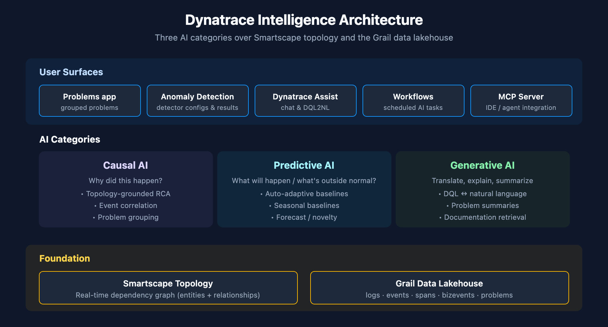

# AIOPS-01: Dynatrace Intelligence Overview

> **Series:** AIOPS — Dynatrace Intelligence | **Notebook:** 1 of 8 | **Created:** May 2026 | **Last Updated:** 05/05/2026

## Overview

**Dynatrace Intelligence** is the umbrella over the platform's AI capabilities. Three categories work together — Causal AI grounds every analysis in topology, Predictive AI projects metrics forward, Generative AI translates between natural language and DQL.

This notebook orients you to the surface area: what the categories are, where they appear in the product, what data each one operates on, and where to dive in next.

**Audience:** Platform admin, SRE, observability lead.

**Outcome:** A mental map of Dynatrace Intelligence — and a starting place for any AIOps initiative.



<!-- MARKDOWN_TABLE_ALTERNATIVE
| Layer | Components |
|-------|-----------|
| User Surface | Problems app, Anomaly Detection app, Dynatrace Assist (chat), Workflows |
| AI Categories | Causal AI (RCA), Predictive AI (forecasts), Generative AI (DQL2NL) |
| Foundation | Smartscape topology, Grail data lakehouse |
For environments where SVG doesn't render
-->

---

## Table of Contents

1. [The Three AI Categories](#three-categories)
2. [Where AI Surfaces in the Product](#surfaces)
3. [The Data Foundation: Smartscape + Grail](#foundation)
4. [Quick Reality Check: What Davis Is Doing Right Now](#reality-check)
5. [The Series Map](#series-map)
6. [Next Steps](#next-steps)

---

## Prerequisites

| Requirement | Details |
|-------------|---------|
| **Dynatrace Environment** | SaaS with Grail (Dynatrace Platform / Gen3) |
| **Permissions** | `events:read` and `storage:events:read` for problem queries; `davis:analyzers:execute` for analyzer notebooks (introduced later in series) |
| **Apps** | Problems app, Anomaly Detection app, Notebooks app |
| **Optional** | Dynatrace Assist enabled (most modern tenants); MCP server for AIOPS-06 |

<a id="three-categories"></a>
## 1. The Three AI Categories

Dynatrace Intelligence does not pile every AI buzzword into one model. It separates by **what kind of question you're asking**.

| Category | Question it answers | Examples in product |
|----------|--------------------|---------------------|
| **Causal AI** | *Why did this happen?* | Davis Problems, automatic root cause analysis, dependency-aware event correlation |
| **Predictive AI** | *What will happen, or what's outside normal?* | Auto-adaptive baselines, seasonal baselines, forecasts, novelty detection |
| **Generative AI** | *Translate between English and DQL — explain, summarize, generate* | Dynatrace Assist (chat), DQL2NL skill, Problems app summaries |

**Causal ≠ Correlation.** Causal AI reasons over the Smartscape topology graph: it knows that service A depends on service B which runs on host C, so when an anomaly fires on C it can attribute the symptom on A. Generic ML correlation engines see the symptoms but can't reliably point to the cause.

**Predictive ≠ Generative.** A seasonal baseline is a statistical model — it has nothing in common with an LLM. Both are AI; they sit in different boxes for different jobs.

<a id="surfaces"></a>
## 2. Where AI Surfaces in the Product

| Surface | Powered by | What you see |
|---------|-----------|--------------|
| **Problems app** | Causal AI + Generative summaries | Grouped problems, ranked root cause, narrative summary |
| **Anomaly Detection app** | Predictive AI (analyzers) | Detector configurations, custom alerts, baseline reviews |
| **Smartscape Davis** | Causal AI | Dependency-aware problem grouping happens implicitly |
| **Dynatrace Assist (chat)** | Generative AI | Natural-language DQL, query explanation, conversation starters |
| **Kubernetes app** | Generative AI | Warning-signal explanations |
| **Databases app** | Generative AI | Execution plan clarification |
| **Workflow tasks** | All three categories | Schedule analyzer runs; summarize problems; notify |
| **Notebooks (DQL cells)** | All three categories | Davis CoPilot side panel; DQL2NL on selected query |

Most surfaces compose categories. The Problems app is the clearest example — Causal AI groups the events into a problem, and a Generative AI summary explains it in English.

<a id="foundation"></a>
## 3. The Data Foundation: Smartscape + Grail

Dynatrace Intelligence sits on two distinct foundations:

**Smartscape** is the real-time dependency graph — every entity (host, process, service, K8s object, AWS resource) and every observed relationship between them. Causal AI walks this graph to localize root cause.

**Grail** is the data lakehouse — logs, events, spans, business events, problems, all in one queryable store. Predictive analyzers run over Grail timeseries; the Problems app reads from `dt.davis.problems`; Dynatrace Assist generates DQL that targets Grail.

Without Smartscape, Dynatrace would have correlation. With Smartscape, it has causation. Without Grail, the AI has no consistent corpus to reason over. Both are prerequisites — neither is replaceable.

<a id="reality-check"></a>
## 4. Quick Reality Check: What Davis Is Doing Right Now

Before we go deeper, let's see Davis at work in your tenant. The next two queries answer:

1. *What problems is Causal AI surfacing right now?*
2. *How busy is the underlying signal stream that gets grouped into those problems?*

If problem counts are low, that's a healthy environment — not a quiet one. If raw signal counts are very high but problem counts are low, Causal AI is doing the right thing: collapsing noise into a small number of actionable problems.

```dql
// Active problems right now, by category
fetch dt.davis.problems, from:-2h
| filter event.status == "ACTIVE"
| summarize active_problems = count(), by:{event.category}
| sort active_problems desc
```

```dql
// Raw Davis signal volume in the last hour
// (these are the events that Causal AI groups into problems)
fetch dt.davis.events, from:-1h
| summarize signal_count = count(), by:{event.category}
| sort signal_count desc
```

**Reading the result:** Compare the two queries. The signal-to-problem ratio is the Causal AI compression factor — the higher the ratio, the more noise the platform is keeping off your alerting plate.

> **Note on data objects:** `dt.davis.problems` carries grouped problems (`event.kind == "DAVIS_PROBLEM"`). `dt.davis.events` carries raw signals (`event.kind == "DAVIS_EVENT"`). They are sibling streams — older docs sometimes show `fetch dt.davis.events | filter event.kind == "DAVIS_PROBLEM"`, but on modern tenants that returns zero rows. Always use `fetch dt.davis.problems` for problem-shaped queries.

<a id="series-map"></a>
## 5. The Series Map

| Notebook | Topic | When to read |
|----------|-------|--------------|
| AIOPS-01 | Overview *(you are here)* | Orientation |
| AIOPS-02 | Anomaly Detection | When tuning detectors or reasoning about baseline strategy |
| AIOPS-03 | Davis AI — Problems & RCA | When investigating a specific incident or designing problem-driven workflows |
| AIOPS-04 | Davis CoPilot — Dynatrace Assist | When integrating natural-language interaction into your team's workflow |
| AIOPS-05 | AI Models | When you need to understand which model is doing what under the hood |
| AIOPS-06 | AI Integrations & Agentic Workflows | When extending AI into automation, MCP servers, or external IDEs |
| AIOPS-07 | Putting It Together | End-to-end Detect → Investigate → Remediate patterns |
| AIOPS-99 | Series Summary | Cross-reference index, next steps, where AIOPS sits in the broader maturity model |

**Cross-references to other series** (because AIOPS does not stand alone):

- **WFLOW** (Workflows & Alert Notifications) — once you have problems detected here, route them through WFLOW
- **AUTOM** (Configuration Automation) — anomaly detection settings as code via Monaco / Terraform
- **ADOPT** (Adoption & Maturity) — AIOps maturity model and metrics
- **DASH** (Dashboards) — problem-driven SLO and executive reporting

<a id="next-steps"></a>
## 6. Next Steps

1. **Open the Problems app** and scan the last 24 hours. Are problems grouped by Causal AI in a way that matches your operational mental model?
2. **Open Anomaly Detection app** to see what detectors are active. (We go deep in AIOPS-02.)
3. **Open a notebook and try Dynatrace Assist** — ask in plain English: *"show me the slowest services in the last hour."* (We go deep in AIOPS-04.)
4. **Read AIOPS-02** if you want to start tuning detectors. **Read AIOPS-03** if a problem in production has your attention right now.

---

<sub>*This notebook was AI-generated from community-submitted and publicly available sources. This notebook series is not officially supported by Dynatrace. Always verify information against official Dynatrace documentation.*</sub>
