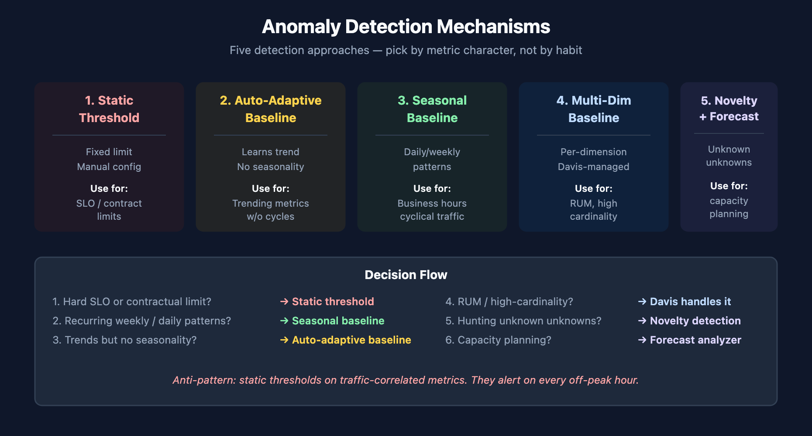
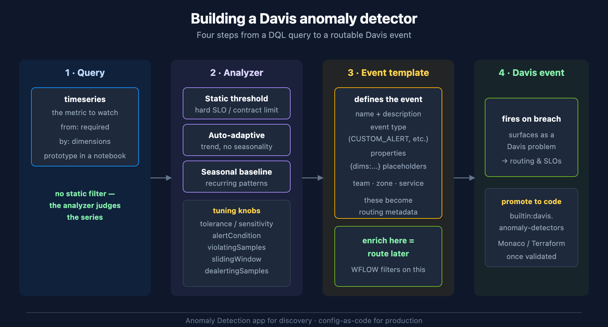

# AIOPS-02: Anomaly Detection

> **Series:** AIOPS — Dynatrace Intelligence | **Notebook:** 2 of 8 | **Created:** May 2026 | **Last Updated:** 06/16/2026

## Overview

Anomaly detection in Dynatrace is **Predictive AI in action** — the platform learns what normal looks like and surfaces deviations. Five mechanisms cover the practical detection landscape: static thresholds, auto-adaptive thresholds, seasonal baselines, multi-dimensional baselines, and novelty / forecasting.

Most teams over-rely on static thresholds and miss what adaptive and seasonal detection would catch. This notebook walks the five mechanisms, when to use each, and how to test them against your data using the Davis analyzer MCP tools.

**Audience:** Platform admin tuning detection; SRE writing custom alerts.

**Outcome:** A working understanding of which detector to pick for each metric type, and live examples against your tenant.



<!-- MARKDOWN_TABLE_ALTERNATIVE
| Mechanism | Best for |
|-----------|----------|
| Static threshold | Hard SLO / contractual limits |
| Auto-adaptive | Trending baselines |
| Seasonal baseline | Recurring patterns (business hours, weekly) |
| Multi-dimensional baseline | High-cardinality metrics (per-region, per-browser) |
| Novelty / forecast | Never-seen-before patterns; capacity planning |
For environments where SVG doesn't render
-->

---

## Table of Contents

1. [The Five Detection Mechanisms](#mechanisms)
2. [Picking the Right Detector](#picking)
3. [Configuration Surface: App vs. Settings vs. Code](#surface)
4. [Building a Davis Anomaly Detector](#building)
5. [Custom Alerts via DQL](#dql-alerts)
6. [Metric Events and Settings 2.0 Schemas](#schemas)
7. [Testing Detectors with Davis Analyzers (MCP)](#analyzers)
8. [Anomaly Volume in Your Tenant](#volume)
9. [Cross-Series Pointers](#cross)

---

## Prerequisites

| Requirement | Details |
|-------------|---------|
| **Dynatrace Environment** | SaaS Gen3 with Anomaly Detection app installed |
| **Permissions** | `davis:analyzers:execute`, `settings:objects:read/write`, `events:read` |
| **MCP** | Dynatrace MCP server (for AIOPS-04 / AIOPS-06 integration); analyzers also exposed in the app |
| **Optional** | Monaco / Terraform for config-as-code (see AUTOM-05/06) |

<a id="mechanisms"></a>
## 1. The Five Detection Mechanisms

### 1.1 Static threshold
Hard limit: *response time must be < 1 s*. Trips when the metric crosses the line. Configured manually. Fast to set up, but brittle — a threshold that fits Tuesday at 3 AM rarely fits Friday at noon.

**Use when:** an SLO, contract, or capacity ceiling defines the limit. Don't use for anything that varies with traffic.

### 1.2 Auto-adaptive threshold
Davis learns the metric's baseline and shifts the detection threshold as the baseline moves. No seasonal awareness — purely adaptive to recent trend.

**Use when:** the metric trends over time but doesn't have weekly / daily seasonality. Service throughput on a steadily-growing app is a classic fit.

### 1.3 Seasonal baseline
Davis learns the metric's daily, weekly, and (where it has data) yearly seasonality. Detection considers the *expected* pattern — Tuesday at 3 AM and Friday at noon get different thresholds.

**Use when:** the metric has obvious recurrence — business hours, weekday/weekend differences, monthly billing cycles.

### 1.4 Multi-dimensional (automated) baseline
Davis builds baselines per-dimension automatically — per region, per browser, per OS, per user-action. You don't configure this; the platform does it under the hood for RUM-like metrics.

**Use when:** you don't — Davis chooses. Your job is to let the high-cardinality dimensions through to it (don't pre-aggregate them away).

### 1.5 Novelty detection and forecasting
**Novelty** flags patterns the model has never seen — sudden new error types, never-before metric shapes. **Forecasting** projects a series forward, useful for capacity planning and trend extrapolation.

**Use when:** you're hunting for *unknown unknowns* (novelty) or projecting growth (forecast). Both available as Davis analyzers — see Section 5.

<a id="picking"></a>
## 2. Picking the Right Detector

A simple decision flow:

1. *Is there a hard contractual or SLO limit?* → **Static threshold.**
2. *Does the metric have recurring weekly/daily patterns?* → **Seasonal baseline.**
3. *Does it trend over time without strong seasonality?* → **Auto-adaptive threshold.**
4. *Is it RUM / high-cardinality user-facing?* → **Davis handles it; don't pre-aggregate.**
5. *Are you hunting unknown unknowns?* → **Novelty detection.**
6. *Capacity planning?* → **Forecasting.**

**Anti-pattern alert:** static thresholds on traffic-correlated metrics. They alert on every off-peak hour and on every traffic spike. Move to seasonal or auto-adaptive.

<a id="surface"></a>
## 3. Configuration Surface: App vs. Settings vs. Code

Three places to configure detection — pick one per environment, not one per detector.

| Surface | When to use |
|---------|-------------|
| **Anomaly Detection app** | Exploration, one-off detectors, quick wins. Best for SREs in the moment. |
| **Settings 2.0 (UI)** | Steady-state detection that's been validated; lives under specific settings schemas. |
| **Config-as-code (Monaco / Terraform)** | Anything you want versioned, reviewable, and reproducible across environments. |

Production teams should converge on config-as-code. The app is the right place to *discover* what to alert on — but the moment a detector matters in production, it should live in source control. See **AUTOM-05** and **AUTOM-06** for the patterns.

<a id="building"></a>
## 4. Building a Davis Anomaly Detector

Sections 1–3 told you *which* mechanism to pick and *where* to configure it. This section walks the actual build in the **Anomaly Detection app** — the four steps that turn a DQL query into a routable Davis event.



<!-- MARKDOWN_TABLE_ALTERNATIVE
| Step | What you do | Key choices |
|------|-------------|-------------|
| 1 · Query | Provide a `timeseries` query for the metric to watch | `from:` required; `by:` dimensions; prototype in a notebook first |
| 2 · Analyzer | Choose how the series is judged | Static threshold / Auto-adaptive / Seasonal baseline + tuning |
| 3 · Event template | Define the event that fires | Name, description, event type, properties with `{dims:...}` |
| 4 · Davis event | Detector fires on breach | Surfaces as a Davis problem → routing & SLOs; promote to config-as-code |
For environments where SVG doesn't render
-->

### Step 1 — The query contract

The detector samples a `timeseries` query on a schedule. Critically, **you do not write a `filter ... > threshold` in the detector query** — the analyzer (Step 2) is what decides whether the series is anomalous. Your query's job is to *return the metric*, grouped by the dimensions you want to alert per (`by:{...}`). A `from:` range is mandatory.

> **Develop the query in a notebook first.** This is the notebook-as-scratchpad pattern: write and run the `timeseries` here, confirm it returns the shape you expect, then paste it into the detector. A query that returns nothing in a notebook will silently never fire as a detector.

### Step 2 — The analyzer and its tuning knobs

Apply one analyzer to the series:

| Analyzer | Judges against | Use when |
|----------|----------------|----------|
| **Static threshold** | A fixed line | A hard SLO / contract / capacity ceiling |
| **Auto-adaptive threshold** | A learned, drifting baseline | The metric trends but has no seasonality |
| **Seasonal baseline** | A confidence band around the seasonal pattern | The metric recurs (business hours, weekly cycles) |

The tuning parameters that control noise:

| Parameter | What it does |
|-----------|--------------|
| `tolerance` (seasonal) / sensitivity | Width of the confidence band — higher = fewer alerts |
| `alertCondition` | Direction that trips: `ABOVE`, `BELOW`, or `OUTSIDE` |
| `violatingSamples` | How many points in the window must violate to fire (max 60) |
| `slidingWindow` | How many points are evaluated together (max 60; ≥ `violatingSamples`) |
| `dealertingSamples` | Consecutive clean points required to close the alert (max 60) |
| `alertOnMissingData` | Treat absent data as a violation |
| query offset | Shift the evaluation window to absorb data latency |

**The `violatingSamples` / `slidingWindow` pair is your primary noise control** — requiring, say, 3 violations out of a 5-point window suppresses single-spike flapping while still catching sustained breaches.

### Step 3 — The event template (this is what makes routing possible)

When the detector fires it emits a Davis event whose shape *you* define: an event **name** and **description** (both support `{dims:...}` placeholders that interpolate the breaching dimensions), an event **type** (`CUSTOM_ALERT`, `ERROR_EVENT`, `PERFORMANCE_EVENT`, …), and **properties** — key/value pairs such as team, zone, or service.

Those properties are the metadata a downstream workflow filters on. **Enrich here or you cannot route later** — a detector that fires a bare event with no team/zone property forces every workflow to re-derive ownership from the affected entity. Spend the effort in the template.

### Step 4 — Fire, then promote

On breach the event surfaces as a Davis problem and flows into routing (WFLOW series) and SLO error budgets. Once a detector matters in production, move it out of the app and into config-as-code (`builtin:davis.anomaly-detectors` — see Section 6) so it is versioned and reviewable.

> <sub>**Sources:** [Anomaly detection configuration (DT docs)](https://docs.dynatrace.com/docs/dynatrace-intelligence/anomaly-detection/anomaly-detection-configuration), [Set up anomaly detectors via API (DT docs)](https://docs.dynatrace.com/docs/dynatrace-intelligence/anomaly-detection/set-up-anomaly-detectors-via-api).</sub>

<a id="dql-alerts"></a>
## 5. Custom Alerts via DQL

Beyond pre-canned detectors, Anomaly Detection app supports **DQL-based custom alerts**. You write the query, the app evaluates it on a schedule, and a breach generates a Davis event.

Example — alert when a service's error rate breaches 5% for 5 minutes:

```dql
// Custom alert: service error rate > 5% in the last hour
// (When wired into the Anomaly Detection app, this evaluates on a schedule.)
timeseries {
    failures = sum(dt.service.request.failure_count),
    total    = sum(dt.service.request.count)
  },
  by:{dt.smartscape.service},
  from:-1h, interval:1m
| fieldsAdd error_rate = (failures[] / total[]) * 100
| fieldsAdd avg_error_rate = arrayAvg(error_rate)
| filter avg_error_rate > 5
| sort avg_error_rate desc
| limit 20
```

**Watchpoints when writing custom-alert DQL:**

- Always include a `from:` time range. Detectors that omit it are rejected.
- Use named-parameter `decimals:`, `then:`, `else:` where required (`round`, `if`, `substring`).
- Aggregations used downstream need explicit aliases (`error_rate = ...`, `mttr = ...`).
- Element-wise array operations on timeseries: `failures[] / total[]` returns an array; wrap in `arrayAvg()` (or similar) to collapse to a scalar before `filter`.

<a id="schemas"></a>
## 6. Metric Events and Settings 2.0 Schemas

Not every alert needs the DQL-based detector. **Metric events** are the Settings 2.0 mechanism for threshold / baseline alerting directly on a metric key — lighter weight than a DQL detector, and the right tool when you're alerting on a single pre-existing metric.

| Mechanism | Settings 2.0 schema | Reach for it when |
|-----------|---------------------|-------------------|
| DQL-based Davis anomaly detector | `builtin:davis.anomaly-detectors` | The signal needs a query — joins, derived fields, multi-metric logic |
| Metric event | `builtin:anomaly-detection.metric-events` | You're alerting on one existing metric key with a threshold or baseline |

Both are first-class config-as-code targets. Provision them with Monaco or Terraform exactly as in **AUTOM-05 / AUTOM-06**; the schema name is the `--settings-schema` / resource selector. This is how a validated detector from the app becomes a reviewed, version-controlled artifact.

> <sub>**Sources:** [Metric events (DT docs)](https://docs.dynatrace.com/docs/dynatrace-intelligence/anomaly-detection/metric-events), [Anomaly detection configuration (DT docs)](https://docs.dynatrace.com/docs/dynatrace-intelligence/anomaly-detection/anomaly-detection-configuration).</sub>

<a id="analyzers"></a>
## 7. Testing Detectors with Davis Analyzers (MCP)

The Dynatrace MCP server exposes Davis analyzers as callable tools. Useful when you want to test a detector against historical data before wiring it to a setting or a workflow.

| MCP tool | What it does | Permission |
|----------|--------------|-----------|
| `mcp__dynatrace__static-threshold-analyzer` | Test a static threshold against a series | `davis:analyzers:execute` |
| `mcp__dynatrace__seasonal-baseline-anomaly-detector` | Detect anomalies vs. seasonal pattern | `davis:analyzers:execute` |
| `mcp__dynatrace__adaptive-anomaly-detector` | Detect anomalies vs. learned baseline | `davis:analyzers:execute` |
| `mcp__dynatrace__timeseries-novelty-detection` | Flag never-seen patterns | `davis:analyzers:execute` |
| `mcp__dynatrace__timeseries-forecast` | Forecast future series; capacity planning | `davis:analyzers:execute` |

**Workflow pattern:** write a `timeseries` query that returns the metric you care about, then pass the query to the analyzer. The analyzer's output is structured (anomalies, forecast bands, novelty flags) and can be embedded in workflows or notebooks.

All five analyzers also have GUI surfaces in the Anomaly Detection app — the MCP tools are the same engine accessed programmatically.

<a id="volume"></a>
## 8. Anomaly Volume in Your Tenant

Davis events are the raw signals before Causal AI groups them into problems. Look at the category breakdown to understand what kinds of anomalies your detectors are firing.

```dql
// Davis event volume by category — last 24h
fetch dt.davis.events, from:-24h
| summarize count = count(), by:{event.category}
| sort count desc
```

```dql
// Active custom-alert problems (DQL-based custom alerts surface here)
fetch dt.davis.problems, from:-7d
| filter event.category == "CUSTOM_ALERT"
| summarize count = count(), by:{event.status}
| sort count desc
```

**Reading the result:** A high `CUSTOM_ALERT` count means your custom-DQL detectors are firing — review whether they're noisy. A high `RESOURCE_CONTENTION` or `ERROR` count means out-of-the-box auto-adaptive / seasonal detection is doing real work.

<a id="cross"></a>
## 9. Cross-Series Pointers

- **AUTOM-05, AUTOM-06** — anomaly detection settings as code (Monaco, Terraform)
- **WFLOW** — once a detector fires, route the resulting Davis event into a notification or remediation workflow
- **DBMON, CLOUD, K8S** — domain-specific anomaly patterns sit in those series; this notebook is the canonical reference for the *mechanisms*
- **AIOPS-05** — the AI models behind these detectors (causal correlation, predictive baseline, seasonal)
- **AIOPS-06** — agentic patterns: scheduled analyzer runs in workflows

---

<sub>*This notebook was AI-generated from community-submitted and publicly available sources. This notebook series is not officially supported by Dynatrace. Always verify information against official Dynatrace documentation.*</sub>
