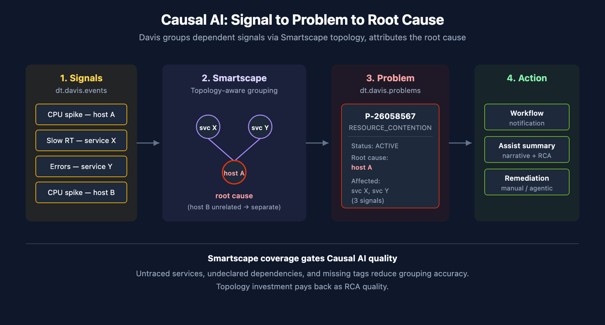

# AIOPS-03: Davis AI — Problems and Root Cause Analysis

> **Series:** AIOPS — Dynatrace Intelligence | **Notebook:** 3 of 8 | **Created:** May 2026 | **Last Updated:** 05/05/2026

## Overview

Davis is the Causal AI engine. It watches the constant stream of anomaly signals (the raw `dt.davis.events`), groups related signals using Smartscape topology, and produces **problems** with a ranked root cause.

This notebook covers the Causal AI mechanism, the Problems app surface, the canonical DQL for querying problems, and the patterns for measuring detection quality.

**Audience:** SRE responding to incidents; platform admin tuning detection; observability lead reporting on MTTR.

**Outcome:** Working DQL for problem investigation, MTTR reporting, and root-cause analytics on your own data.



<!-- MARKDOWN_TABLE_ALTERNATIVE
| Stage | What happens |
|-------|--------------|
| 1. Signal | Detector fires; raw event lands in dt.davis.events |
| 2. Group | Davis correlates dependent signals via Smartscape |
| 3. Problem | Grouped signals become a problem in dt.davis.problems |
| 4. Root cause | Davis ranks contributors; top contributor is the root |
| 5. Notify | Workflow or notification fires |
For environments where SVG doesn't render
-->

---

## Table of Contents

1. [How Causal AI Groups Signals into Problems](#grouping)
2. [Problem Lifecycle and Fields](#lifecycle)
3. [The Two Data Objects: `dt.davis.problems` vs. `dt.davis.events`](#data-objects)
4. [Active Problem Feed](#active-feed)
5. [Problem Severity and Category Rollups](#rollups)
6. [MTTR by Category and Service](#mttr)
7. [Root Cause Entity Distribution](#root-cause)
8. [Cross-Series Pointers](#cross)

---

## Prerequisites

| Requirement | Details |
|-------------|---------|
| **Dynatrace Environment** | SaaS Gen3 with Grail |
| **Permissions** | `events:read`, `storage:events:read` |
| **Apps** | Problems app |
| **Topology** | Smartscape entities for the systems you care about (Causal AI's accuracy correlates with topology completeness) |

<a id="grouping"></a>
## 1. How Causal AI Groups Signals into Problems

Detectors fire constantly. Without grouping, every CPU spike, every slow request, every log error would page someone. The point of Causal AI is to ask: *which of these are the same incident?*

Davis answers using Smartscape — the dependency graph. Three signals on three different services that all depend on the same backing database go into one problem with the database as root cause. Same three signals on unrelated services stay separate.

**This is why Smartscape coverage matters.** Causal AI's accuracy is bounded by topology completeness. Untraced services, undeclared dependencies, missing tags — all reduce the graph quality and produce worse grouping.

**Causal AI is deterministic, not statistical.** It walks the topology graph; it does not run an LLM or a black-box correlation. Two operators looking at the same data get the same root cause attribution.

<a id="lifecycle"></a>
## 2. Problem Lifecycle and Fields

**Status values:** `ACTIVE` and `CLOSED`. (Not `OPEN` / `RESOLVED` — common mistake.)

**Categories:** `ERROR`, `RESOURCE_CONTENTION`, `AVAILABILITY`, `SLOWDOWN`, `CUSTOM_ALERT`. Categories are stable; counts vary widely by environment.

**Key fields on a problem record:**

| Field | Description |
|-------|-------------|
| `event.id` | Internal problem ID |
| `display_id` | Human-readable ID like `P-26058567` |
| `event.name` | Short problem title |
| `event.description` | Longer narrative |
| `event.category` | One of the categories above |
| `event.status` | `ACTIVE` or `CLOSED` |
| `event.start` / `event.end` | Timestamps; `event.end` is null on active problems |
| `root_cause_entity_id` / `root_cause_entity_name` | Davis-attributed root cause |
| `affected_entity_ids` | Array of impacted entity IDs |
| `dt.davis.event_ids` | Array of constituent signal IDs from `dt.davis.events` |

Custom string-typed fields can be propagated onto problems via Settings — useful for team / alerting-profile / service-tier attribution. Numeric custom fields are not supported.

<a id="data-objects"></a>
## 3. The Two Data Objects: `dt.davis.problems` vs. `dt.davis.events`

Sibling streams in Grail. **Use the right one.**

| Data object | Contains | event.kind | Use when you want |
|-------------|----------|-----------|-------------------|
| `dt.davis.problems` | Causal-AI-grouped problems | `DAVIS_PROBLEM` | The problem feed, MTTR, severity rollups |
| `dt.davis.events` | Raw, ungrouped signals | `DAVIS_EVENT` | Signal-level investigation, custom alert volume |

> ⚠️ Some older docs and tutorials show `fetch dt.davis.events | filter event.kind == "DAVIS_PROBLEM"`. On modern tenants this returns zero rows — `dt.davis.events` carries only `DAVIS_EVENT`. Always use `fetch dt.davis.problems` for problems.

<a id="active-feed"></a>
## 4. Active Problem Feed

The most-used query in the series — what's broken right now, ranked by start time.

```dql
// Active problems right now — investigation feed
fetch dt.davis.problems, from:-2h
| filter event.status == "ACTIVE"
| sort event.start desc
| fields display_id, event.name, event.category, event.start,
         root_cause_entity_name, affected_entity_ids
| limit 50
```

Filter by entity context to scope to a team or environment. Two common variants:

```dql
// Active problems in a specific Kubernetes namespace
fetch dt.davis.problems, from:-2h
| filter event.status == "ACTIVE"
| filter k8s.namespace.name == "production"
| sort event.start desc
| fields display_id, event.name, event.category, root_cause_entity_name
| limit 50
```

```dql
// Active problems for a specific host group
fetch dt.davis.problems, from:-2h
| filter event.status == "ACTIVE"
| filter dt.host_group.id == "HOST_GROUP-XXXXXXXX"
| sort event.start desc
| fields display_id, event.name, event.category, root_cause_entity_name
| limit 50
```

<a id="rollups"></a>
## 5. Problem Severity and Category Rollups

Severity reporting answers *what kind of problems are we generating?* — useful in weekly operational reviews and for trending detection-volume month over month.

```dql
// Last 7 days — problem count by category
fetch dt.davis.problems, from:-7d
| summarize problem_count = count(), by:{event.category}
| sort problem_count desc
```

```dql
// Last 30 days — daily problem volume
fetch dt.davis.problems, from:-30d
| makeTimeseries problems_per_day = count(), interval:1d, by:{event.category}
```

<a id="mttr"></a>
## 6. MTTR by Category and Service

Mean Time To Resolution — how long does Davis say a problem stayed `ACTIVE` before it transitioned to `CLOSED`. Compute it as `event.end - event.start` over closed problems.

Reporting principle: prefer **median** and **p95** over arithmetic mean. A single long-running availability problem (a host that was forgotten on the network) skews the average wildly.

```dql
// MTTR by category over last 30 days
fetch dt.davis.problems, from:-30d
| filter event.status == "CLOSED"
| fieldsAdd duration = event.end - event.start
| summarize {
    median_mttr = percentile(duration, 50),
    p95_mttr    = percentile(duration, 95),
    problem_count = count()
  },
  by:{event.category}
| sort problem_count desc
```

<a id="root-cause"></a>
## 7. Root Cause Entity Distribution

Which entities are most often attributed as root cause? A heavy concentration on a small set of services usually means either (a) you have real recurring instability there, or (b) topology is incomplete and Davis keeps falling back to the same nodes.

```dql
// Top 20 root cause entities — last 7 days
fetch dt.davis.problems, from:-7d
| filter isNotNull(root_cause_entity_name)
| summarize problem_count = count(), by:{root_cause_entity_name, root_cause_entity_id}
| sort problem_count desc
| limit 20
```

<a id="cross"></a>
## 8. Cross-Series Pointers

- **WFLOW-04** — wire active problems into notification workflows
- **DASH-05** — problem-driven SLO and executive dashboards
- **AIOPS-04** — Dynatrace Assist generates problem-summary narratives via Generative AI
- **AIOPS-06** — Workflow tutorial: Summarize open problems with AI

---

<sub>*This notebook was AI-generated from community-submitted and publicly available sources. This notebook series is not officially supported by Dynatrace. Always verify information against official Dynatrace documentation.*</sub>
