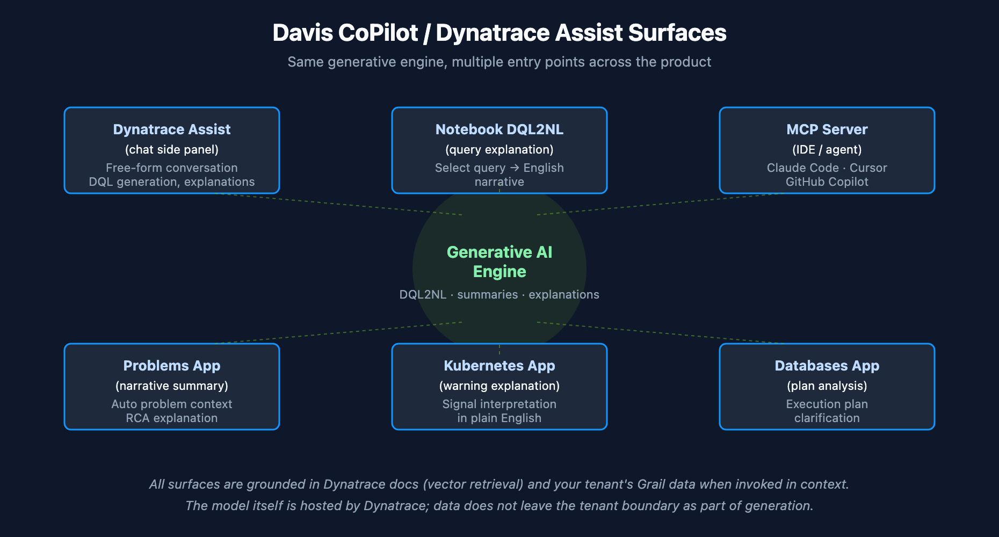

# AIOPS-04: Davis CoPilot — Dynatrace Assist for Investigation

> **Series:** AIOPS — Dynatrace Intelligence | **Notebook:** 4 of 8 | **Created:** May 2026 | **Last Updated:** 05/05/2026

## Overview

**Davis CoPilot** (the older brand) and **Dynatrace Assist** (the current UI surface) are the same Generative AI capability — the chat interface that translates natural language to DQL, explains existing queries, summarizes problems, and suggests next steps.

This notebook covers the surfaces, the supported tasks, the data privacy posture, and the practical patterns for using Generative AI inside Dynatrace without burning hours wrestling with prompts.

**Audience:** Anyone who writes DQL — SRE, platform admin, observability engineer.

**Outcome:** Productive use of Dynatrace Assist for investigation; clear sense of what the chat does well and where to fall back to manual DQL.



<!-- MARKDOWN_TABLE_ALTERNATIVE
| Surface | Where it lives | Best for |
|---------|---------------|----------|
| Dynatrace Assist (chat) | Side panel | Conversational investigation, DQL generation |
| Notebook side panel | Notebooks app | DQL2NL, explain selected query |
| Problems app summary | Problems app | Narrative problem context |
| Kubernetes app | K8s app | Warning signal explanations |
| Databases app | Databases app | Execution plan clarification |
For environments where SVG doesn't render
-->

---

## Table of Contents

1. [What Davis CoPilot Does](#capabilities)
2. [Where It Surfaces in the Product](#surfaces)
3. [DQL Generation Patterns That Work](#dql-gen)
4. [Explain-Selected-Query (DQL2NL)](#dql2nl)
5. [Problem Summarization](#problem-summary)
6. [Limitations and Fallbacks](#limitations)
7. [Data Privacy and Grounding](#privacy)
8. [Cross-Series Pointers](#cross)

---

## Prerequisites

| Requirement | Details |
|-------------|---------|
| **Dynatrace Environment** | SaaS Gen3 with Dynatrace Assist enabled |
| **Apps** | Notebooks app (chat panel); Problems / K8s / Databases apps for in-context surfaces |
| **Permissions** | Standard read permissions for the data being queried |
| **Optional** | MCP server installed in your IDE for `ask-dynatrace-docs` and `find-troubleshooting-guides` (covered in AIOPS-06) |

<a id="capabilities"></a>
## 1. What Davis CoPilot Does

Six capability buckets, in roughly the order you'll use them:

1. **Generate DQL from natural language** — "show me the slowest services in the last hour"
2. **Explain DQL in natural language** — "what does this query do?" against a selected query
3. **Summarize problems** — narrative explanation of an incident's context and root cause
4. **Explain warnings and signals** — Kubernetes warnings, database execution plans
5. **Discover documentation** — vector-grounded retrieval over the Dynatrace docs
6. **Discover troubleshooting guides** — vector-grounded retrieval over remediation content

The first two are the daily-driver uses. Problem summarization is high-value during incidents. Documentation and troubleshooting retrieval are most useful via MCP from your IDE (covered in AIOPS-06).

<a id="surfaces"></a>
## 2. Where It Surfaces in the Product

Multiple surfaces, same engine:

| Surface | What it does | When to use |
|---------|--------------|-------------|
| **Dynatrace Assist (chat side panel)** | Free-form chat: DQL, explanations, conversation starters | Investigations, learning, exploration |
| **Notebook DQL2NL** | Right-click on a query: explain in English | Reviewing inherited notebooks; teaching |
| **Problems app summary** | Auto-generated problem narrative + root cause explanation | First minutes of an incident |
| **Kubernetes app explanations** | Warning-signal explanations | K8s troubleshooting |
| **Databases app analysis** | Execution plan clarification | Slow-query investigation |
| **MCP `ask-dynatrace-docs`** | Doc retrieval from your IDE / agent | When you need an authoritative answer; works offline of the UI |

**One mental model — many entry points.** All surfaces feed a single underlying assistant that's grounded in the platform's data and docs.

<a id="dql-gen"></a>
## 3. DQL Generation Patterns That Work

Generative DQL is good at **shape-of-query** intent. It is weaker on tenant-specific field names and on queries that require a specific time-alignment or grouping that the natural-language phrasing didn't make explicit.

**Patterns that produce good DQL:**

- *"Show me the top 20 slowest services in the last hour with their request counts"* — specifies entity (services), metric (slowest = response time), bound (top 20), time (1h), and additional context (request counts).
- *"Failed requests by URL path in the last 24 hours, grouped by HTTP status code"* — specifies the dimension (URL path), the filter (failed), the time window, and the secondary grouping.
- *"Memory usage for hosts in the production environment, last 7 days, hourly"* — specifies the metric, the entity filter, and the resolution.

**Patterns that produce poor DQL:**

- *"What's broken?"* — too unbounded; the assistant can't pick a sensible time range or data object.
- *"Slow stuff"* — no entity type, no metric, no bound.
- *"Show me the data"* — same problem; under-specified.

**Fix the prompts that fail.** Add an entity (host / service / log / span), a metric or filter, a time bound, and a desired output shape (top N, by category, hourly). Treat the prompt as a SQL `SELECT` template — `from` (entity), `where` (filter), `group by` (dim), `order` (top N).

<a id="dql2nl"></a>
## 4. Explain-Selected-Query (DQL2NL)

The reverse of generation. In a notebook, select a DQL query and use the explain action — the assistant produces an English narrative of what the query does.

**Best uses:**
- Reviewing inherited notebooks where the DQL author isn't around
- Teaching DQL to teammates new to the platform
- Quickly auditing a long pipeline without reading every command

Try it below — open this notebook in the Dynatrace UI, select the query, and use Assist's explain action.

```dql
// A non-trivial query worth explaining
fetch logs, from:-24h
| filter loglevel == "ERROR"
| parse content,
    "LD 'user_id=' DATA:user_id LD 'request_id=' DATA:request_id"
| filter isNotNull(user_id) and isNotNull(request_id)
| summarize error_count = count(), by:{user_id, k8s.namespace.name}
| sort error_count desc
| limit 50
```

<a id="problem-summary"></a>
## 5. Problem Summarization

On any active or recent problem in the Problems app, a Generative AI summary panel explains:

- What is happening (symptom)
- The Causal AI root cause (in narrative form)
- Affected entities and downstream impact
- Suggested first remediation steps

**Operational use:** read the summary first, then drill in. The summary won't tell you anything Causal AI doesn't already know — but it composes the information faster than a human can read four panels of evidence.

**For dashboards / reports:** workflow tutorials in AIOPS-06 show how to schedule a Generative AI summary across all open problems on a recurring basis (the *Summarize open problems with Workflows* pattern).

<a id="limitations"></a>
## 6. Limitations and Fallbacks

**Where the assistant is reliable:**
- Common DQL shapes (fetch / timeseries / summarize / sort)
- Standard semantic-dictionary fields (`dt.entity.host`, `service.name`, `loglevel`)
- Time-window arithmetic and grouping

**Where the assistant struggles:**
- Tenant-specific custom fields (`dt.openpipeline.your_attribute`)
- Highly nested DQL (joinNested, multi-stage lookups, parse expressions)
- Queries that require subtle smartscape topology navigation (`smartscapeNodes`, `traverse`)
- Queries whose intent depends on tenant-specific bucket names or schemas

**Fallbacks:**
1. Refine the prompt — add field names, time bounds, output shape.
2. Generate a starter query with the assistant, then edit by hand.
3. Use the **`mcp__dynatrace__create-dql`** MCP tool from your IDE — same engine but with more controlled context (covered in AIOPS-06).
4. Validate generated queries with **`mcp__dynatrace__execute-dql`** before trusting them.

<a id="privacy"></a>
## 7. Data Privacy and Grounding

Two grounding principles to be aware of:

1. **Vector-based document retrieval is grounded in Dynatrace documentation, not your tenant data.** Asking Assist *"how do I configure host groups?"* triggers retrieval over public docs — not over your customer data.
2. **Generated DQL targets your tenant's Grail data when executed.** The query itself is generated from natural language; the *results* come from your data. The data does not leave the tenant boundary as part of generation.

Refer to the official **Davis CoPilot data privacy and security policy** for the full details. Sensitive deployments should validate the policy before enabling Assist.

<a id="cross"></a>
## 8. Cross-Series Pointers

- **AIOPS-03** — the Problems app surface and the underlying Causal AI it summarizes
- **AIOPS-06** — MCP server: Dynatrace Assist as a tool callable from Claude Code, Cursor, GitHub Copilot
- **AIOPS-07** — end-to-end pattern with Assist in the loop

---

<sub>*This notebook was AI-generated from community-submitted and publicly available sources. This notebook series is not officially supported by Dynatrace. Always verify information against official Dynatrace documentation.*</sub>
