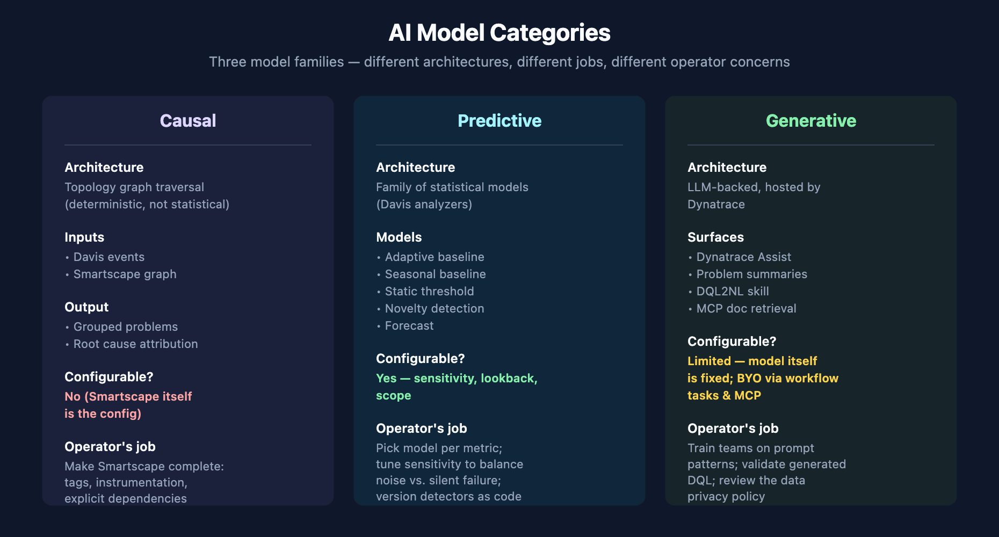

# AIOPS-05: AI Models — Causal, Predictive, and Generative

> **Series:** AIOPS — Dynatrace Intelligence | **Notebook:** 5 of 8 | **Created:** May 2026 | **Last Updated:** 05/05/2026

## Overview

Behind every Dynatrace Intelligence surface there's a specific model doing specific work. This notebook names the models, explains what each one is responsible for, and answers the questions admins ask about them: where do they live, what do they cost, and what is (or is not) bring-your-own.

**Audience:** Platform architect, AI / governance lead, anyone evaluating Dynatrace AI for regulatory or procurement reasons.

**Outcome:** A clear separation between what the platform's AI is, where each piece runs, and what is configurable vs. fixed.



<!-- MARKDOWN_TABLE_ALTERNATIVE
| Category | Examples |
|----------|----------|
| Causal | Dependency-aware root cause analysis |
| Predictive | Seasonal baseline, auto-adaptive baseline, forecast, novelty |
| Generative | Dynatrace Assist, DQL2NL, problem summaries |
For environments where SVG doesn't render
-->

---

## Table of Contents

1. [The Three Model Categories Recap](#categories)
2. [Causal Correlation Analysis](#causal)
3. [Predictive AI — Baselines and Forecasts](#predictive)
4. [Seasonal Baseline](#seasonal)
5. [Generative Models — Where They Live](#generative)
6. [Bring Your Own Model — What's Possible](#byo)
7. [Cross-Series Pointers](#cross)

---

## Prerequisites

| Requirement | Details |
|-------------|---------|
| **Dynatrace Environment** | SaaS Gen3 |
| **Apps** | Notebooks app for the analyzer demos in this notebook |
| **Permissions** | `davis:analyzers:execute` for analyzer queries; standard read permissions otherwise |
| **Background** | AIOPS-01 for the umbrella; AIOPS-02 for anomaly detection mechanisms (this notebook is the *model* perspective on the same material) |

<a id="categories"></a>
## 1. The Three Model Categories Recap

| Category | What it does | Where it runs | Configurable? |
|----------|--------------|---------------|---------------|
| **Causal** | Topology-aware root cause | Davis backend | No (Smartscape itself is the configuration) |
| **Predictive** | Baselines, forecasts, novelty | Davis analyzer engine | Yes — sensitivity, lookback, scope |
| **Generative** | LLM-backed Assist & summaries | Hosted / managed by Dynatrace | Limited — you can't swap the LLM |

Three different model families. Three different architectural approaches. Treat them differently.

<a id="causal"></a>
## 2. Causal Correlation Analysis

**The single biggest differentiator** of Dynatrace AI vs. correlation-based AIOps tools.

Causal AI does not run a statistical model over symptom signals to guess at co-occurrence. It walks the Smartscape topology graph and uses the dependency edges to attribute symptoms to upstream causes. Two events on dependent entities go into one problem; two events on independent entities stay separate.

**Inputs:** the Davis event stream (`dt.davis.events`) plus the live Smartscape graph.

**Output:** records in `dt.davis.problems`, each with a `root_cause_entity_id` and an array of `affected_entity_ids`.

**Operator's job:** make Smartscape complete. Tag entities, instrument every service, declare custom dependencies where auto-discovery doesn't reach.

<a id="predictive"></a>
## 3. Predictive AI — Baselines and Forecasts

Predictive AI is a **family of statistical models** wrapped as Davis analyzers. Each model is purpose-built; each is callable directly from MCP and from the Anomaly Detection app.

| Model | Purpose | MCP tool |
|-------|---------|----------|
| **Adaptive baseline** | Detect anomalies vs. learned recent baseline | `mcp__dynatrace__adaptive-anomaly-detector` |
| **Seasonal baseline** | Detect anomalies vs. recurring weekly/daily pattern | `mcp__dynatrace__seasonal-baseline-anomaly-detector` |
| **Static threshold** | Test against a fixed limit | `mcp__dynatrace__static-threshold-analyzer` |
| **Novelty detection** | Flag never-seen patterns | `mcp__dynatrace__timeseries-novelty-detection` |
| **Forecast** | Project a series forward | `mcp__dynatrace__timeseries-forecast` |

All five accept a `timeseries` query as input. Their output is a structured analyzer result — anomaly intervals, forecast bands with confidence intervals, novelty flags. Embeddable in workflows for scheduled analysis.

**Configuration knobs:**
- *Lookback window* (how far back is "learned")
- *Sensitivity* (how aggressive to be about flagging anomalies)
- *Scope* (per-entity, per-dimension, global)

Tuning these is the difference between alert fatigue and silent failure.

<a id="seasonal"></a>
## 4. Seasonal Baseline

Worth a closer look because it's where most teams underuse the platform.

Seasonal baseline learns the metric's recurring patterns — daily, weekly, and where enough data exists, yearly. Detection considers the *expected value at this time of week*, not just "is the metric high."

**The use case:** any metric that varies with business activity. Login traffic peaks at 8 AM and noon. Database write volume peaks at end-of-month. ETL job durations peak on Sunday night. A static threshold or even an auto-adaptive baseline misses these — they see the seasonal peak as either noise or as the new normal.

**Common mistake:** applying seasonal baseline to a metric that doesn't have seasonality. The model still produces output, but the bands are essentially the global baseline plus statistical noise.

Below is an example that exercises the analyzer engine — pick a metric you know has weekly seasonality (host CPU on a business-hours app, for instance) and feed it in.

```dql
// Hourly host CPU for the last 14 days, per host
// (Feed this query to mcp__dynatrace__seasonal-baseline-anomaly-detector for evaluation.)
timeseries cpu = avg(dt.host.cpu.usage),
  by:{dt.entity.host},
  from:-14d,
  interval:1h
| limit 100
```

<a id="generative"></a>
## 5. Generative Models — Where They Live

Generative AI in Dynatrace is hosted and managed — you do not see or swap the underlying LLM. Three things live in this category:

1. **DQL2NL skill** — translates DQL ↔ natural language
2. **Problem summaries** — narrative explanations in the Problems app
3. **Dynatrace Assist** — chat surface across the product

**What you don't get:** model selection, fine-tuning on customer data, prompt-template customization. Dynatrace owns the model surface so the data privacy guarantees are stable across customers.

**What you do get:** vector-based grounding over Dynatrace docs and (via problem context) your own observability data when the assistant is invoked from a problem. Refer to the Davis CoPilot data privacy and security policy for current details.

<a id="byo"></a>
## 6. Bring Your Own Model — What's Possible

Practical answer in 2026: **the platform LLM is fixed; your AI integrations are not.**

What that means in practice:

| Surface | BYO model? | Notes |
|---------|-----------|-------|
| Dynatrace Assist | No | Hosted; not configurable |
| Problem summaries | No | Hosted; not configurable |
| Workflow AI tasks | Yes | Workflow tasks can call external LLMs (OpenAI, Anthropic, Bedrock, Vertex) — see AIOPS-06 |
| MCP-based agentic flows | Yes | Your agent (Claude Code, Cursor, GitHub Copilot) chooses its own LLM |
| Dynatrace AI app (community) | Varies | Community apps can wrap external models — see AIOPS-06 |

**Architectural takeaway:** keep tenant-grounded, in-product AI on the platform's models. Use BYO models for orchestration, automation, and any operation that benefits from a model your team can fine-tune or audit independently.

<a id="cross"></a>
## 7. Cross-Series Pointers

- **AIOPS-02** — the operator's perspective on the predictive models
- **AIOPS-06** — agentic / BYO model integrations via workflows and MCP
- **AUTOM-05/06** — anomaly detection settings as code

---

<sub>*This notebook was AI-generated from community-submitted and publicly available sources. This notebook series is not officially supported by Dynatrace. Always verify information against official Dynatrace documentation.*</sub>
