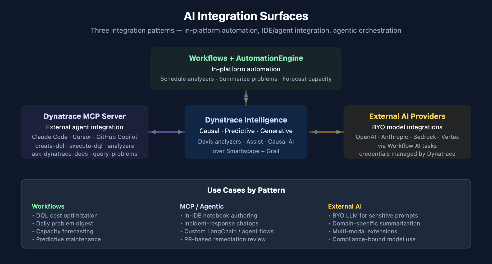

# AIOPS-06: AI Integrations and Agentic Workflows

> **Series:** AIOPS — Dynatrace Intelligence | **Notebook:** 6 of 8 | **Created:** May 2026 | **Last Updated:** 05/05/2026

## Overview

Dynatrace Intelligence is not a closed system. The same AI capabilities are available via Workflow tasks (for in-platform automation) and via the Dynatrace MCP server (for external IDEs, CLI agents, and bring-your-own AI orchestration).

This notebook covers three integration surfaces: AI tasks inside Workflows, the Dynatrace MCP server for IDE / agent integration, and the canonical workflow tutorials from the documentation.

**Audience:** Platform engineer building automation; SRE integrating Dynatrace into IDE and CLI workflows; AI / governance lead reviewing the integration surface.

**Outcome:** Working knowledge of where Dynatrace Intelligence connects out — and which patterns are settled vs. still emerging.



<!-- MARKDOWN_TABLE_ALTERNATIVE
| Integration | Direction | Use |
|-------------|-----------|-----|
| Workflow AI tasks | In-platform automation | Schedule analyzers; summarize; notify |
| Dynatrace MCP server | Out to agent / IDE | DQL gen, doc retrieval, analyzer calls from Claude Code, Cursor, GitHub Copilot |
| AutomationEngine | In-platform orchestration | Predictive maintenance; remediation flows |
For environments where SVG doesn't render
-->

---

## Table of Contents

1. [Three Integration Surfaces](#surfaces)
2. [Workflow Tutorial: Optimize DQL Cost](#wf-dql-cost)
3. [Workflow Tutorial: Summarize Open Problems](#wf-summary)
4. [Workflow Tutorial: Forecast Resource Utilization](#wf-forecast)
5. [The Dynatrace MCP Server](#mcp)
6. [Agentic Patterns: AutomationEngine and Approval-Based Remediation](#agentic)
7. [Cross-Series Pointers](#cross)

---

## Prerequisites

| Requirement | Details |
|-------------|---------|
| **Dynatrace Environment** | SaaS Gen3 |
| **Apps** | Workflows app; Notebooks app |
| **Permissions** | `davis:analyzers:execute`, `events:read`, `workflows:run` |
| **For MCP integrations** | Dynatrace MCP server installed in your IDE / CLI agent (Claude Code, Cursor, GitHub Copilot) |
| **For external LLMs** | Provider credentials (OpenAI / Anthropic / Bedrock / Vertex) configured as Dynatrace credentials |

<a id="surfaces"></a>
## 1. Three Integration Surfaces

**Workflow AI tasks (in-platform).** Dynatrace Workflows can call AI tasks: run an analyzer, generate a summary, route through an external LLM. Best for *scheduled* and *event-driven* automation that lives entirely inside the platform.

**Dynatrace MCP server (platform → external agent).** Exposes the platform's AI surface as MCP tools — `create-dql`, `execute-dql`, the analyzer family, `ask-dynatrace-docs`, `find-troubleshooting-guides`. Best when your team wants Dynatrace context inside Claude Code, Cursor, or GitHub Copilot.

**AutomationEngine.** The orchestration layer that wraps workflows for higher-level automation patterns — predictive maintenance, approval-based remediation, ChatOps integration.

These three are complementary, not exclusive. A mature observability practice uses all three for different jobs.

<a id="wf-dql-cost"></a>
## 2. Workflow Tutorial: Optimize DQL Cost

**Pattern:** schedule a workflow that periodically analyzes DQL execution against ingestion / scan budgets, surfaces high-cost queries, and generates a summary recommending optimization.

**When to use:** any tenant with material DQL spend — typically OpenPipeline-heavy deployments, ad-hoc analytics workloads, dashboard-heavy environments.

**The shape:**
1. **Trigger** — scheduled (e.g., weekly) or threshold-based (e.g., daily DQL spend > X)
2. **Analyze** — DQL query against `dt.system.events` and the DPS metering streams to identify highest-cost queries
3. **Summarize** — Generative AI task composes a recommendation
4. **Notify / file** — workflow notification or ticket

Below is a starter query for the analyze step. Tune `from:` and the cost threshold for your tenant.

```dql
// Top DQL users by scanned bytes — last 7 days
// (Use as the analyze step in a cost-optimization workflow.)
fetch dt.system.query_executions, from:-7d
| filter status == "SUCCEEDED"
| summarize {
    total_scanned_bytes = sum(scanned_bytes),
    execution_count     = count(),
    avg_duration_ms     = avg(execution_duration_ms)
  },
  by:{user.email}
| sort total_scanned_bytes desc
| limit 25
```

Drop `user.email` from the `by:` clause and add `query_string` (truncated) to surface the biggest individual queries. Pair with the **`mcp__dynatrace__explain-dql`** tool in a workflow to attach a plain-English description to each high-cost query before notifying.

<a id="wf-summary"></a>
## 3. Workflow Tutorial: Summarize Open Problems

**Pattern:** scheduled workflow runs every shift / every morning, gathers active problems, sends to a Generative AI task for narrative summary, and posts to Slack / Teams / email.

**When to use:** ops teams running shift handoffs; leadership wanting a daily problem digest without staring at the Problems app.

**The shape:**
1. **Trigger** — cron (e.g., 8 AM weekdays)
2. **Fetch** — query active problems
3. **Summarize** — Generative AI task composes the digest
4. **Post** — Slack / Teams / email notification

```dql
// Active and recently-closed problems for a daily digest
fetch dt.davis.problems, from:-24h
| fields display_id, event.name, event.category, event.status,
         event.start, event.end, root_cause_entity_name
| sort event.start desc
| limit 100
```

<a id="wf-forecast"></a>
## 4. Workflow Tutorial: Forecast Resource Utilization

**Pattern:** scheduled workflow forecasts capacity-relevant series (host disk, namespace CPU, ingestion volume) using `mcp__dynatrace__timeseries-forecast` (and its analyzer GUI equivalent), and notifies when projected exhaustion hits the threshold.

**When to use:** capacity planning. Catching disk-full / quota-exhaust scenarios before they fire is the canonical forecast use case.

**The shape:**
1. **Trigger** — scheduled (e.g., daily)
2. **Query** — capacity series for the relevant resource
3. **Forecast** — analyzer task with confidence interval
4. **Branch** — if projected exhaustion within N days → escalate
5. **Notify** — workflow notification

```dql
// Disk usage timeseries — input to the forecast analyzer
// Per host, hourly, last 30 days
timeseries disk_used = avg(dt.host.disk.used.percent),
  by:{dt.entity.host, dt.entity.disk},
  from:-30d,
  interval:1h
| limit 100
```

<a id="mcp"></a>
## 5. The Dynatrace MCP Server

The MCP server is how your agent (Claude Code, Cursor, GitHub Copilot, etc.) calls Dynatrace as a tool. From a single chat prompt, your agent can generate DQL, execute it, and call analyzers.

**Tool families exposed:**

| Family | Tools |
|--------|-------|
| **DQL** | `create-dql`, `execute-dql`, `verify-dql`, `explain-dql` |
| **Davis analyzers** | `static-threshold-analyzer`, `seasonal-baseline-anomaly-detector`, `adaptive-anomaly-detector`, `timeseries-novelty-detection`, `timeseries-forecast` |
| **Discovery** | `find-documents`, `find-troubleshooting-guides`, `ask-dynatrace-docs` |
| **Topology** | `get-entity-id`, `get-entity-name` |
| **Davis problems** | `get-problem-by-id`, `query-problems`, `get-vulnerabilities`, `get-events-for-kubernetes-cluster` |

**Setup outline:**
1. Create a Platform Token with the scopes you need (`davis:analyzers:execute`, `events:read`, etc.)
2. Add the Dynatrace MCP server config to your agent (Claude Code: `.claude/settings.json` or `.mcp.json`; Cursor: settings.json; GitHub Copilot: similar)
3. Test with a tool call from the agent

**Use cases:**
- *In-IDE notebook authoring* — generate DQL while writing the markdown around it
- *Incident response* — Claude Code investigates a deployed service, calls `query-problems` and `execute-dql`, summarizes findings
- *Custom agents* — your own LangChain / LangGraph agent uses Dynatrace MCP as one of many tools

Auth and IAM bind the MCP integration to your IAM policy — same `davis:analyzers:execute` scope as the Anomaly Detection app, same `events:read` for problem queries.

<a id="agentic"></a>
## 6. Agentic Patterns: AutomationEngine and Approval-Based Remediation

Agentic workflows are an emerging area in 2026. The intent: detect a problem (Causal AI), propose a remediation (Generative AI), execute under policy guardrails (workflow + AutomationEngine), surface the human approval / post-action audit.

**Three guardrails to enforce:**

1. **Scope** — which environments / namespaces / clusters can the agent act on?
2. **Policy** — what action types are allowed without human approval (read-only / limited write / restart) vs. require approval (config change, scaling)?
3. **Audit** — where is the agent's reasoning logged? Audit must capture the prompt, the data the agent saw, and the action taken.

**Practical 2026 posture:** keep agentic remediation in **suggest mode** for the first 60–90 days. The agent posts the proposed remediation as a Slack / Teams / ticket comment — a human approves, a workflow executes. Move to fully automated only once the suggested-action quality is consistently high in your environment.

<a id="cross"></a>
## 7. Cross-Series Pointers

- **WFLOW** — workflows fundamentals (this notebook adds the AI-task lens)
- **AUTOM** — config-as-code, deployment automation
- **AIOPS-04** — Dynatrace Assist as the chat surface that calls many of these same APIs
- **AIOPS-07** — end-to-end Detect → Investigate → Remediate use cases that compose all of the above

---

<sub>*This notebook was AI-generated from community-submitted and publicly available sources. This notebook series is not officially supported by Dynatrace. Always verify information against official Dynatrace documentation.*</sub>
