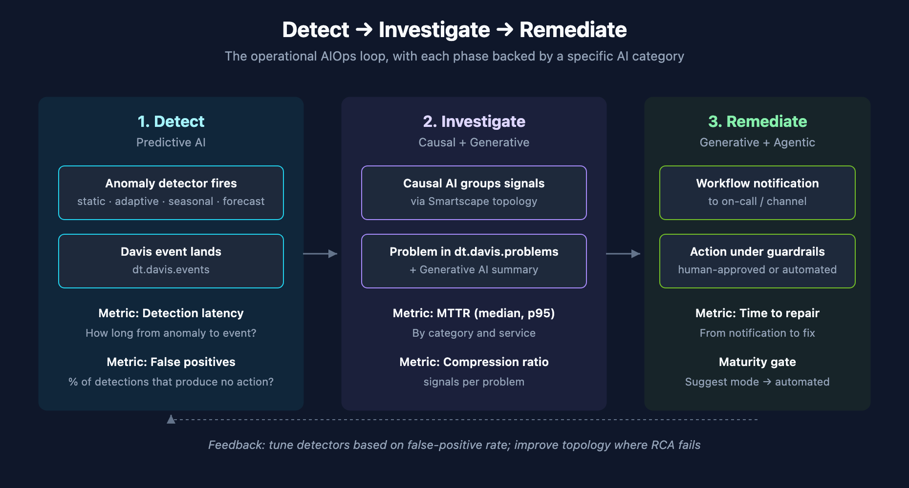

# AIOPS-07: Putting It Together — Detect, Investigate, Remediate

> **Series:** AIOPS — Dynatrace Intelligence | **Notebook:** 7 of 8 | **Created:** May 2026 | **Last Updated:** 05/05/2026

## Overview

The previous six notebooks each focused on one slice of Dynatrace Intelligence. This one composes them into the operational pattern most teams want from AIOps: **Detect → Investigate → Remediate**, with each phase backed by the right AI category.

**Audience:** SRE / observability lead designing the actual operational flow.

**Outcome:** A reference operational pattern, plus three concrete scenarios — capacity, incident response, and quality regression — showing the pattern in practice.



<!-- MARKDOWN_TABLE_ALTERNATIVE
| Phase | AI category | Surfaces |
|-------|-------------|----------|
| Detect | Predictive | Anomaly Detection app, custom DQL alerts |
| Investigate | Causal + Generative | Problems app, Dynatrace Assist |
| Remediate | Generative + Agentic | Workflows, AutomationEngine, MCP |
For environments where SVG doesn't render
-->

---

## Table of Contents

1. [The Three-Phase Loop](#loop)
2. [Scenario A: Capacity Planning (Disk Exhaustion)](#scenario-a)
3. [Scenario B: Incident Response (Latency Spike)](#scenario-b)
4. [Scenario C: Quality Regression (Error Rate Drift)](#scenario-c)
5. [Putting It on a Page: AIOps Health Dashboard](#dashboard)
6. [Maturity Pointers](#maturity)

---

## Prerequisites

| Requirement | Details |
|-------------|---------|
| **Dynatrace Environment** | SaaS Gen3 |
| **Apps** | Problems, Anomaly Detection, Notebooks, Workflows |
| **Series Background** | AIOPS-01 through AIOPS-06; this notebook composes those building blocks |
| **Permissions** | All read permissions and `davis:analyzers:execute`, `workflows:run` |

<a id="loop"></a>
## 1. The Three-Phase Loop

**Detect** — Predictive AI watches metrics for anomalies. Output: a Davis event in `dt.davis.events`.

**Investigate** — Causal AI groups related events into a problem. Generative AI summarizes. Output: a problem in `dt.davis.problems` with narrative context.

**Remediate** — Workflow / AutomationEngine takes action under policy. Optionally Generative AI proposes the action; human approves; agent executes.

**Three feedback loops to close:**
1. *Detection-to-action latency* — how long from anomaly to remediation start?
2. *False-positive rate* — what fraction of detections result in no action?
3. *Mean time to repair* — how long to actually fix?

Each loop has a metric. Each metric should be on a dashboard.

<a id="scenario-a"></a>
## 2. Scenario A: Capacity Planning (Disk Exhaustion)

**Detect:** scheduled workflow runs `mcp__dynatrace__timeseries-forecast` against host disk usage. Forecasts 7 days ahead. Branches when any host's projected usage exceeds 85%.

**Investigate:** workflow generates a summary table — which hosts, which volumes, current trajectory, predicted exhaustion date. Posts to capacity-planning channel.

**Remediate:** capacity team reviews. Decision is human (do we add disk? archive logs? scale the cluster?). The workflow's job is to *give the team enough lead time* — not to auto-remediate.

```dql
// Hosts trending toward disk exhaustion — last 7 days
// (Feed to the forecast analyzer for the 7-day projection.)
timeseries disk_used = avg(dt.host.disk.used.percent),
  by:{dt.entity.host, dt.entity.disk},
  from:-7d,
  interval:1h
| fieldsAdd current_avg = arrayAvg(disk_used)
| filter current_avg > 70
| sort current_avg desc
| limit 50
```

<a id="scenario-b"></a>
## 3. Scenario B: Incident Response (Latency Spike)

**Detect:** auto-adaptive baseline on response time fires. Davis event lands in `dt.davis.events`.

**Investigate:** Causal AI groups the latency anomaly with related signals from downstream services. Problem appears in `dt.davis.problems` with root cause attributed to (say) a database. Dynatrace Assist composes the summary.

**Remediate:** WFLOW notifies on-call. On-call uses Assist to ask follow-up questions while reading the problem. If remediation is well-known (restart a pod, scale a deployment), the team triggers an AutomationEngine workflow with the right scope.

```dql
// Latency-related active problems and their root cause entities
fetch dt.davis.problems, from:-2h
| filter event.status == "ACTIVE"
| filter event.category == "SLOWDOWN" or event.category == "ERROR"
| fields display_id, event.name, event.category, event.start,
         root_cause_entity_name, affected_entity_ids
| sort event.start desc
| limit 25
```

<a id="scenario-c"></a>
## 4. Scenario C: Quality Regression (Error Rate Drift)

Subtler than incident response — slow drift, not sudden spike.

**Detect:** seasonal baseline on error rate, evaluated weekly. Drift not visible at the 5-minute resolution but obvious at the 7-day rollup.

**Investigate:** workflow assembles problem-rate trend, deployment-correlation, user-affected-volume. Generative AI summarizes the regression in context.

**Remediate:** quality / release team reviews. Decision is human — pin a release? rollback? add a feature flag? The workflow surfaces the data, not the action.

```dql
// Weekly error rate trend by service — last 8 weeks
timeseries {
    failures = sum(dt.service.request.failure_count),
    total    = sum(dt.service.request.count)
  },
  by:{dt.entity.service},
  from:-8w,
  interval:1w
| fieldsAdd error_rate = (failures[] / total[]) * 100
| fieldsAdd avg_error_rate = arrayAvg(error_rate)
| sort avg_error_rate desc
| limit 25
```

<a id="dashboard"></a>
## 5. Putting It on a Page: AIOps Health Dashboard

If AIOps is doing its job, three numbers on one dashboard tell the story:

1. **Active problem count by category** (current state)
2. **Median MTTR by category over the last 30 days** (effectiveness)
3. **Davis signal-to-problem compression ratio over time** (Causal AI value)

The first two are obvious. The third is interesting — a high compression ratio means Causal AI is keeping noise off the team. A dropping ratio means topology is degrading or detectors are getting noisier.

```dql
// Davis signal-to-problem compression — last 7 days
// (Run side-by-side with the problem rollup from AIOPS-03.)
fetch dt.davis.events, from:-7d
| makeTimeseries signals = count(), interval:1d
```

```dql
// Problem volume — last 7 days (compare against signals above)
fetch dt.davis.problems, from:-7d
| makeTimeseries problems = count(), interval:1d
```

Higher signals-per-problem ratio = better Causal AI compression. Track this number monthly; if it drops, audit topology completeness.

<a id="maturity"></a>
## 6. Maturity Pointers

AIOps maturity sits in **ADOPT-04**. Briefly:

| Stage | What's in place |
|-------|----------------|
| **0 — Off** | Static thresholds only; no Causal AI use; manual investigation |
| **1 — Detect** | Anomaly detection in use; problems consumed in app |
| **2 — Notify** | Workflows route active problems to teams |
| **3 — Summarize** | Generative AI summaries part of the daily ops loop |
| **4 — Suggest** | AI-suggested remediation in human-approval mode |
| **5 — Remediate** | Automated remediation under policy guardrails for known patterns |

Most teams in 2026 sit between stage 2 and stage 3. The investment between 2 and 3 is well-bounded. The investment between 3 and 4 is significant. Between 4 and 5 is a multi-year governance project.

---

<sub>*This notebook was AI-generated from community-submitted and publicly available sources. This notebook series is not officially supported by Dynatrace. Always verify information against official Dynatrace documentation.*</sub>
