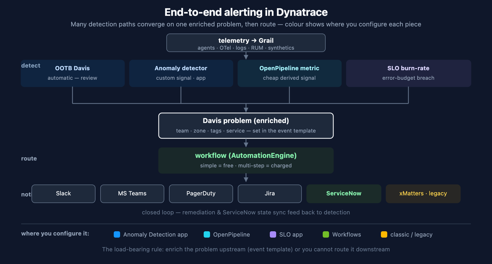

# ALERT-01: End-to-End Alerting Architecture

> **Series:** ALERT — Alerting Strategy and Design | **Notebook:** 01 of 05 | **Created:** June 2026 | **Last Updated:** 06/16/2026

## Overview

Alerting in Dynatrace is a cross-cutting concern: detection lives in one app, routing in another, reliability targets in a third. Teams that try to assemble it ad hoc end up with noise, gaps, and the wrong people paged. This notebook draws the **whole board on one canvas** — what you set up, where, and how it connects end to end — so you can see the complete solution before building any one piece.

This is the doorway for the ALERT series. It does not re-document mechanics; it orchestrates them and points at the series that own each piece (AIOPS for detection, SLO for reliability, WFLOW for routing).

---

## Table of Contents

1. [The Whole Board](#board)
2. [The Anti-Noise Funnel](#funnel)
3. [What to Set Up, Where](#where)
4. [The One Rule That Makes Routing Work](#rule)
5. [Where to Go Next](#next)

---

## Prerequisites

| Requirement | Details |
|-------------|---------|
| **Dynatrace Environment** | SaaS Gen3 with Grail, the Anomaly Detection app, the SLO app, and AutomationEngine (Workflows) |
| **Audience** | Platform owners and SREs standing up alerting for the first time, or rationalising an ad-hoc setup |
| **Companion series** | AIOPS (detection), SLO (reliability targets), WFLOW (routing) |

## 1. The Whole Board

Every Dynatrace alert, regardless of source, follows the same spine: **telemetry → detection → one enriched problem → routing → destination**, with an optional closed loop back. The diagram shows the complete picture, colour-coded by *where you configure each piece*.

<!-- MARKDOWN_TABLE_ALTERNATIVE
| Layer | Pieces | Where configured |
|-------|--------|------------------|
| Detect | OOTB Davis · anomaly detector · OpenPipeline metric · SLO burn-rate | Davis automatic / Anomaly Detection app / OpenPipeline / SLO app |
| Converge | one enriched Davis problem (team, zone, tags) | event template + tags/ownership |
| Route | workflow — simple (free) vs multi-step (charged) | AutomationEngine |
| Notify/act | Slack · Teams · PagerDuty · Jira · ServiceNow · xMatters(legacy) | workflow connectors / classic profiles |
| Closed loop | remediation · ServiceNow state sync | workflow / ServiceNow-side app |
For environments where SVG doesn't render
-->

The key insight the diagram makes visible: **many detection paths, one convergence point.** You do not build a separate alerting stack per signal type — every mechanism produces a Davis problem, and everything downstream operates on that.

## 2. The Anti-Noise Funnel

The order in which you reach for detection mechanisms determines how much noise you live with. Work top-down; only descend when the layer above cannot express the condition:

1. **Out-of-the-box Davis first.** It already detects latency spikes, error anomalies, resource saturation, and service degradation — with seasonal baselines you do not have to tune. Most "we need an alert for X" requests are already covered. Review and adjust sensitivity before building anything custom (AIOPS-02 §1–§3).
2. **Custom Davis anomaly detector** only when a business-specific condition is not covered. Use auto-adaptive or seasonal analyzers, not static thresholds on traffic-correlated metrics (AIOPS-02 §4).
3. **OpenPipeline-derived metric** when the signal lives in logs or spans. Extract a metric once at ingest, then alert on the metric — querying logs/traces directly in a detector incurs query cost on every evaluation; a derived metric does not (OPIPE, FINOPS-09).
4. **SLO burn-rate** for the reliability of a user journey — the highest-signal alert of all, because it fires on "we are about to break our promise to users" (SLO-04).

Each step down costs more to build and maintain. Staying as high as possible is the single biggest lever on alert noise.

## 3. What to Set Up, Where

| Layer | What you configure | Where | Cost note |
|-------|--------------------|-------|-----------|
| Detection — automatic | Review & tune sensitivity | OOTB Davis (Settings 2.0) | included |
| Detection — custom signal | Anomaly detector (analyzer + event template) | Anomaly Detection app → config-as-code | included |
| Detection — cheap custom metric | Metric extraction from logs/spans | OpenPipeline | ingest cost, no query cost |
| Detection — reliability | SLO + burn-rate alert | SLO app | included |
| Convergence | Enrichment (team, zone, tags) so routing has something to filter | event template / tags / ownership | — |
| Routing | Problem-trigger workflow | AutomationEngine — simple (free) vs multi-step (charged) | choose deliberately |
| Destinations | Connector per channel | workflow connectors; legacy via alerting profiles | — |
| Closed loop | Remediation / bi-directional sync | workflow / ServiceNow-side app | — |

ALERT-02 covers choosing detection; ALERT-03 covers routing and cost; ALERT-04 covers ServiceNow.

## 4. The One Rule That Makes Routing Work

> **Enrich the problem upstream, or you cannot route it downstream.**

A workflow routes by *filtering* — "send problems where `team == checkout` to #checkout-alerts." That only works if the problem carries a `team` property. Two ways it gets there:

- **The detector's event template** — when you build a custom anomaly detector, its event template defines the properties on the event it raises (AIOPS-02 §4). Put team / service / zone there.
- **Entity tags and ownership** — for OOTB problems, the affected entity's tags and Smartscape ownership carry the metadata; sprint-1.337 made ownership a first-class routing attribute (WFLOW-04).

A problem that fires with no team or ownership metadata forces every workflow to re-derive routing from scratch — the most common reason an alerting setup degenerates into "everything goes to one channel." Spend the effort upstream.

## 5. Where to Go Next

| You want to… | Go to |
|--------------|-------|
| Choose and build a detection mechanism | ALERT-02 → AIOPS-02 |
| Set reliability targets and alert on burn rate | SLO-04 |
| Route alerts to teams without noise (simple vs multi-step cost) | ALERT-03 → WFLOW-04 |
| Create ServiceNow incidents (and sync state) | ALERT-04 |
| See the complete setup checklist | ALERT-99 |

> **Sources:** [Alerting and notifications (DT docs)](https://docs.dynatrace.com/docs/analyze-explore-automate/notifications-and-alerting), [Anomaly Detection app (DT docs)](https://docs.dynatrace.com/docs/dynatrace-intelligence/anomaly-detection/anomaly-detection-app). **Derived:** the anti-noise funnel ordering is a synthesis of OOTB-first guidance and the query-cost economics in OPIPE/FINOPS.

---

*This notebook was AI-generated from community-submitted and publicly available sources. This notebook series is not officially supported by Dynatrace. Always verify information against official Dynatrace documentation.*
