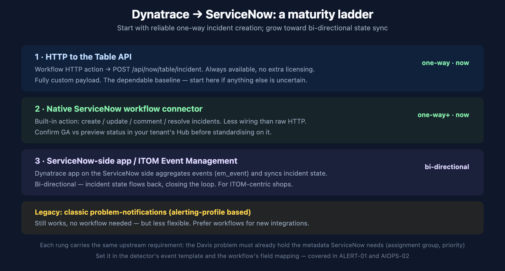

# ALERT-04: ITSM Integration: ServiceNow

> **Series:** ALERT — Alerting Strategy and Design | **Notebook:** 04 of 05 | **Created:** June 2026 | **Last Updated:** 06/16/2026

## Overview

For many enterprises, an alert is not "done" until it is an incident in ServiceNow. This notebook covers the integration as a **maturity ladder** — from dependable one-way incident creation you can stand up today, to bi-directional state sync — and shows the worked Table API path so you are never blocked waiting on a connector's availability.

---

## Table of Contents

1. [The Integration Ladder](#ladder)
2. [Rung 1 — HTTP to the Table API](#http)
3. [Rung 2 — Native ServiceNow Connector](#connector)
4. [Rung 3 — Bi-Directional Sync](#bidirectional)
5. [What ServiceNow Needs From the Problem](#fields)

---

## Prerequisites

| Requirement | Details |
|-------------|---------|
| **Dynatrace Environment** | SaaS Gen3 with AutomationEngine (Workflows) |
| **ServiceNow** | An instance + a service account with rights to create incidents (Table API) or the Dynatrace-side connector configured |
| **Prior reading** | ALERT-01 (enrichment), ALERT-03 (routing) |

<a id="ladder"></a>
## 1. The Integration Ladder

There are several current ways to integrate, and they form a maturity ladder. Start at the rung you can stand up reliably today and climb as your needs grow.



<!-- MARKDOWN_TABLE_ALTERNATIVE
| Rung | Mechanism | Direction | When |
|------|-----------|-----------|------|
| 1 | Workflow HTTP → Table API (POST /api/now/table/incident) | one-way | now — the dependable baseline |
| 2 | Native ServiceNow workflow connector (create/update/comment/resolve) | one-way+ | now — confirm GA vs preview in your Hub |
| 3 | ServiceNow-side Dynatrace app / ITOM Event Management (em_event) | bi-directional | ITOM-centric shops |
| Legacy | Classic problem-notifications (alerting-profile based) | one-way | works, less flexible — prefer workflows |
For environments where SVG doesn't render
-->

<a id="http"></a>
## 2. Rung 1 — HTTP to the Table API

The most portable approach, available regardless of connector status: a problem-trigger workflow whose HTTP action POSTs to the ServiceNow Table API.

The trigger query selects the problems worth an incident (validated on a live tenant):

```dql
// Problem-trigger query: active problems to turn into ServiceNow incidents
// Validated on live tenant. Filter further on enriched metadata (team/zone) in production.
fetch events, from:-1h
| filter event.kind == "DAVIS_PROBLEM"
| filter event.status == "ACTIVE"
| fields display_id, event.name, event.category, event.status
| limit 5
```

The workflow's HTTP action then creates the incident. Map Dynatrace fields to ServiceNow incident fields in the payload:

```json
// Workflow HTTP action → ServiceNow Table API
// POST https://<instance>.service-now.com/api/now/table/incident
// Auth: service account (basic) or OAuth; store the secret in the workflow connection, never inline.
{
  "short_description": "{{ event().name }} ({{ event().display_id }})",
  "description": "Dynatrace problem {{ event().display_id }} — category {{ event().category }}.\nDetails: {{ event().url }}",
  "urgency": "2",
  "impact": "2",
  "assignment_group": "{{ event().properties.team }}",
  "u_dynatrace_problem_id": "{{ event().display_id }}"
}
```

Carry the Dynatrace problem id into a ServiceNow field (`u_dynatrace_problem_id` above) — it is what lets a later update or resolve find the same incident instead of creating a duplicate. The `assignment_group` comes from the metadata you enriched upstream (ALERT-01 §4).

<a id="connector"></a>
## 3. Rung 2 — Native ServiceNow Connector

Dynatrace provides a native ServiceNow action for workflows that handles create / update / comment / resolve without hand-building HTTP calls — less wiring, and update/resolve give you de-duplication and auto-close when the Dynatrace problem closes.

> **Confirm availability in your tenant.** The native connector has been published via the Dynatrace Hub and listed as a preview; check its current GA/preview status before standardising on it for production. If it is not yet GA in your environment, Rung 1 (HTTP Table API) delivers the same one-way outcome today — which is why the ladder starts there.

<a id="bidirectional"></a>
## 4. Rung 3 — Bi-Directional Sync

For ITOM-centric organisations, the **ServiceNow-side Dynatrace app** (and ITOM Event Management) is the richest option. It ingests Dynatrace events into ServiceNow's event table (`em_event`), transforms them into incidents, and **synchronises state both ways** — when the incident is worked or closed in ServiceNow, that flows back, closing the loop shown as the feedback arrow in ALERT-01.

This is configured largely on the ServiceNow side and suits shops already running ITOM Event Management. It is the destination of the maturity ladder, not the starting point — reach for it when one-way creation is no longer enough and you want incident lifecycle unified across both platforms.

<a id="fields"></a>
## 5. What ServiceNow Needs From the Problem

Every rung shares one requirement: the Davis problem must already carry the metadata ServiceNow incidents need. Decide these upstream (detector event template per AIOPS-02 §4, or entity tags/ownership):

| ServiceNow field | Source in Dynatrace |
|------------------|---------------------|
| `assignment_group` | enriched `team` property / Smartscape ownership |
| `urgency` / `impact` / priority | `event.severity` (the 1–5 unified severity) |
| `short_description` | `event.name` + `display_id` |
| correlation key (de-dup) | `display_id` carried into a custom field |

If the problem fires without these, the incident lands in a default queue with no priority — the ITSM equivalent of "everything goes to one channel." Enrich upstream.

> <sub>**Sources:** [Send Dynatrace notifications to ServiceNow (DT docs)](https://docs.dynatrace.com/docs/analyze-explore-automate/notifications-and-alerting/problem-notifications/servicenow-integration), [ServiceNow for Workflows (Dynatrace Hub)](https://www.dynatrace.com/hub/detail/servicenow-for-workflows-preview), [Dynatrace + ServiceNow integrations (Dynatrace News)](https://www.dynatrace.com/news/blog/accelerate-your-autonomous-it-operations-journey-with-dynatrace-and-servicenow-integrations/). Problem-trigger query validated on a live tenant 06/16/2026. **Softened:** native-connector GA vs preview status varies — confirm in your tenant's Hub.</sub>

---

<sub>*This notebook was AI-generated from community-submitted and publicly available sources. This notebook series is not officially supported by Dynatrace. Always verify information against official Dynatrace documentation.*</sub>
