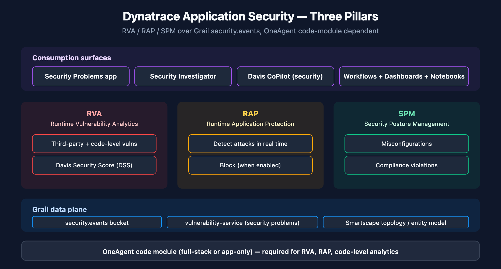

# APPSEC-01: Fundamentals and the Three Pillars of Application Security

> **Series:** APPSEC — Application Security | **Notebook:** 1 of 10 | **Created:** June 2026 | **Last Updated:** 06/04/2026

## Overview

**Dynatrace Application Security** is the platform's security data plane in Gen3 SaaS. It rests on three product pillars — Runtime Vulnerability Analytics (RVA), Runtime Application Protection (RAP), and Security Posture Management (SPM) — and on the same Grail foundation that backs observability data. Findings are first-class entities that flow through workflows, dashboards, and Davis CoPilot like any other Dynatrace signal.

This notebook orients you to the surface area: what each pillar does, what data plane backs it, what OneAgent deployment mode you need, and how the Dynatrace Security Score (DSS) summarizes posture.

**Audience:** Security engineer, platform owner, AppDev lead onboarding to Dynatrace AppSec.

**Outcome:** A mental map of Dynatrace AppSec — and a starting place for any AppSec initiative.



<!-- MARKDOWN_TABLE_ALTERNATIVE
| Pillar | Code | Focus |
|--------|------|-------|
| Runtime Vulnerability Analytics | RVA | Third-party + first-party vulnerabilities with production-execution context |
| Runtime Application Protection | RAP | Real-time attack detection and blocking |
| Security Posture Management | SPM | Misconfiguration / compliance findings |
-->

---

## Table of Contents

1. [The Three Pillars](#three-pillars)
2. [The Data Plane: Grail and the Vulnerability Service](#data-plane)
3. [Deployment-Mode Dependency](#deployment-mode)
4. [Dynatrace Security Score (DSS)](#dss)
5. [The Series Map](#series-map)
6. [Next Steps](#next-steps)
7. [References](#references)

---

## Prerequisites

| Requirement | Details |
|-------------|---------|
| **Dynatrace Environment** | Gen3 SaaS with Grail (Managed not supported for this series) |
| **OneAgent** | Full-Stack monitoring strongly recommended; Infrastructure-only mode gives limited AppSec; Discovery mode requires code-module injection |
| **AppSec entitlement** | Application Security must be enabled on the tenant (consumption-billed in DPS) |
| **DQL familiarity** | This series assumes working DQL knowledge. New to DQL? See the SPANS and ORGNZ series first |
| **IAM** | Reader needs at minimum `environment:roles:view-security-problems` and `storage:security.events:read` to follow the queries — see APPSEC-09 for the full permission catalog |

<a id="three-pillars"></a>
## 1. The Three Pillars

Application Security in Gen3 is a single product with three operational surfaces. The pillars are not three separate products you license individually — they share the OneAgent, share the Grail data plane, and share the entity model. What differs is the analysis Dynatrace applies and the kind of finding produced.

### Runtime Vulnerability Analytics (RVA)

Continuously inspects the running process inventory and answers two questions: *which CVEs are reachable from production code paths*, and *which production data assets are exposed to those code paths*. RVA covers both third-party (library) vulnerabilities and code-level (first-party) vulnerabilities where supported.

Distinguishing feature vs scanner-based tools: RVA observes the **executed** code paths, so a CVE in an imported-but-never-called library is de-prioritized automatically. This is the *"reachable"* signal that feeds DSS.

### Runtime Application Protection (RAP)

Sits in the OneAgent code module and watches request traffic for attack patterns — SQL injection, command injection, SSRF, JNDI lookup, and similar runtime attack classes. RAP runs in **detection** mode by default (event recorded, traffic served) and can be promoted to **blocking** mode per protection rule once detection has been tuned.

RAP is meaningful only when the OneAgent code module is attached — pure host-level monitoring will not produce attack events.

### Security Posture Management (SPM)

Evaluates the configuration state of monitored entities — Kubernetes clusters, cloud accounts, container images — against compliance baselines (CIS, PCI, NIST) and surfaces misconfigurations as findings in the same Grail bucket as RVA/RAP events.

Where RVA/RAP are *runtime* signals (what's executing right now), SPM is a *config* signal (what's been declared in the platform).

> <sub>**Sources:** [Application Security (DT docs)](https://docs.dynatrace.com/docs/secure/application-security) for the three-pillar framing and RVA/RAP/SPM definitions (verified 06/04/2026). **Derived:** the *runtime vs config* distinction is a synthesis aid; the hub page does not phrase it this way directly.</sub>

<a id="data-plane"></a>
## 2. The Data Plane: Grail and the Vulnerability Service

AppSec produces two kinds of records that you'll query, alert on, and dashboard:

| Surface | Where it lives | How to read it | How to manage it |
|---------|----------------|----------------|------------------|
| **Security events** (RVA findings, RAP attack events, SPM findings, state transitions) | Grail `security.events` bucket | DQL: `fetch security.events` | Acknowledged through workflows / API; IAM scope: `storage:security.events:read` |
| **Security problems** (deduped, Davis-grouped vulnerabilities) | `vulnerability-service` (not a Grail bucket) | Security Problems UI; API; Davis CoPilot | UI / API; IAM scope: `vulnerability-service:vulnerabilities:read` (programmatic) + `environment:roles:view-security-problems` (UI) |

This split matters for two reasons:

1. **DQL works on events, not problems.** Custom dashboards built on DQL pull from `security.events`. You can't `fetch security.problems` — that surface is exposed via the vulnerability-service API and the Security Problems app.
2. **IAM is dual-surface.** Granting a reviewer access to security problems requires *both* `environment:roles:view-security-problems` (the UI role) and `vulnerability-service:vulnerabilities:read` (the API) if they'll consume via automation. There is no single `storage:security_problems:read` token — see APPSEC-09 for the complete model.

A first DQL to run against your tenant to see what's actually flowing:

```dql
// All security events in the last 24h grouped by event.type
// Use this to discover which event types your tenant is producing
fetch security.events, from:-24h
| summarize count = count(), by:{event.type}
| sort count desc

```

If that query returns rows, AppSec is producing data. If it returns zero rows, either AppSec is not enabled on the tenant, no vulnerabilities have been detected yet, or the OneAgent code module is not attached to your monitored processes.

> <sub>**Sources:** [Application Security (DT docs)](https://docs.dynatrace.com/docs/secure/application-security), [IAM policy statements reference (DT docs)](https://docs.dynatrace.com/docs/manage/identity-access-management/permission-management/manage-user-permissions-policies/advanced/iam-policystatements) for permission-token names verified verbatim. **Softened:** the absence of a `storage:security_problems:read` token reflects the IAM reference as of 06/04/2026; verify in your tenant's policy editor before relying on this gap to inform a policy design.</sub>

<a id="deployment-mode"></a>
## 3. Deployment-Mode Dependency

AppSec coverage is not a license toggle alone — it depends on **how OneAgent is deployed on each host**.

| OneAgent mode | RVA — third-party | RVA — code-level | RAP | SPM |
|---------------|--------------------|-------------------|-----|-----|
| Full-Stack | ✓ | ✓ | ✓ | ✓ |
| Infrastructure-only | partial (library inventory only — no execution context) | ✗ | ✗ | ✓ |
| Discovery / Application-only | requires code-module injection | requires code-module injection | requires code-module injection | ✓ |

**Practical implication:** a tenant where 80% of hosts run in Infrastructure-only mode will produce a deceptively quiet AppSec surface. Detected-vulnerability counts will be low not because the environment is secure, but because the analysis pipeline has nothing to analyze. This is a common false-comfort signal during initial rollouts.

Recommended rollout order: enable the OneAgent code module first (or migrate Infrastructure-only hosts to Full-Stack), let RVA accumulate a baseline (typically 24–72 hours), *then* read the Dynatrace Security Score. Reading DSS before code-module coverage is meaningful is misleading.

> <sub>**Sources:** [Application Security (DT docs)](https://docs.dynatrace.com/docs/secure/application-security) for the three-mode framing. **Derived:** the per-pillar coverage matrix is a synthesis; the hub page describes Full-Stack as "recommended" but does not enumerate the matrix explicitly. **Softened:** the 24–72 hour baseline is community-practice guidance — verify against your environment's vulnerability cadence.</sub>

<a id="dss"></a>
## 4. Dynatrace Security Score (DSS)

DSS is the single-number summary of AppSec posture, adapted to environment topology. Documented signals that feed the score:

- **Public-internet exposure** — detected via eBPF on Linux hosts. A vulnerable process reachable from the public internet contributes more to DSS than the same vulnerability on an internal-only process.
- **Reachable data assets** — does the vulnerable code path actually touch the database / file storage / message bus where sensitive data lives?
- **Related-entity analysis** — Smartscape topology context: upstream/downstream services, data flows.

What's not published: the exact weighting formula. The score is **directionally meaningful within one tenant over time** (DSS trending up = posture deteriorating). It is **not designed to be compared across tenants** — two tenants with the same DSS may have very different absolute risk profiles depending on which signals are populated.

**How to consume DSS in practice:**

- Trend the score over time; treat large deltas as investigation triggers
- Pair the DSS with the count of *unacknowledged* security problems (a low DSS with high unacknowledged count = noise; high DSS with low count = real posture)
- Don't set absolute DSS thresholds in SLOs across business units without normalizing for topology

> <sub>**Sources:** [Application Security (DT docs)](https://docs.dynatrace.com/docs/secure/application-security) for the DSS signals (public-internet exposure, reachable data assets, related-entity analysis) verified verbatim 06/04/2026. **Softened:** the cross-tenant non-comparability and the "don't put DSS in cross-BU SLOs" guidance are community practice — the docs say the score adapts to topology but do not state the comparability caveat directly.</sub>

<a id="series-map"></a>
## 5. The Series Map

Where to go next depending on what you're trying to do.

| # | Notebook | When to read |
|---|----------|--------------|
| **02** | Runtime Vulnerability Analytics | You need to triage third-party vulnerabilities by reachability + exposure |
| **03** | Code-Level Vulnerability Analytics | You're responsible for first-party application code and need to action vulnerable-function findings |
| **04** | Runtime Application Protection | You're setting up RAP detection rules and deciding when to promote to blocking |
| **05** | Security Posture Management | You're auditing configuration drift against CIS/PCI/NIST baselines |
| **06** | Kubernetes & Container Security | You're running workloads under DynaKube and need image + cluster posture together |
| **07** | Security Investigator & Davis CoPilot for Security | You're conducting an investigation and want AI-assisted pivots |
| **08** | Workflows, Notifications & Remediation | You need security problems to reach Jira / ServiceNow / PagerDuty / Slack |
| **09** | IAM and Gen3 Permissions for AppSec | You're designing the permission model — who can see what, who can manage what |
| **10** | Dashboards, Reporting & Governance | You're building the executive view and governance cadence |

If you're net-new to AppSec on this tenant: read 01 → 09 (IAM) → 02 (RVA) → 04 (RAP) → 10 (dashboards). IAM comes early because rolling out AppSec to users without a permission plan creates either over-exposure of sensitive payloads or under-exposure that blocks the SOC.

<a id="next-steps"></a>
## 6. Next Steps

1. **Verify AppSec is producing data** — run the `fetch security.events` query above. If it returns zero rows, work the deployment-mode question before continuing.
2. **Map your OneAgent coverage** — for each business-critical workload, confirm Full-Stack mode (or that the code module is attached).
3. **Read APPSEC-09 next** — get the permission model right before granting the SOC access to security problems. Mistakes here are reversible but visible.
4. **Then read APPSEC-02** — third-party vulnerabilities are usually the loudest finding type at first, so triaging RVA is where most AppSec rollouts start producing measurable signal.

<a id="references"></a>
## 7. References

| Source | Coverage |
|--------|----------|
| [Application Security (DT docs)](https://docs.dynatrace.com/docs/secure/application-security) | Three-pillar hub page; DSS signals; deployment-mode framing |
| [Secure (DT docs)](https://docs.dynatrace.com/docs/secure) | Top-level Secure navigation |
| [Secure / FAQ (DT docs)](https://docs.dynatrace.com/docs/secure/faq) | Official AppSec FAQ |
| [IAM policy statements reference (DT docs)](https://docs.dynatrace.com/docs/manage/identity-access-management/permission-management/manage-user-permissions-policies/advanced/iam-policystatements) | Verified AppSec permission tokens |

---

> <sub>**⚠️ DISCLAIMER**: This information was AI generated and is provided "as-is" without warranty. It was produced as an independent, community-driven project and **not supported by Dynatrace**. Always refer to official [Dynatrace documentation](https://docs.dynatrace.com/docs) for the most current information.</sub>
