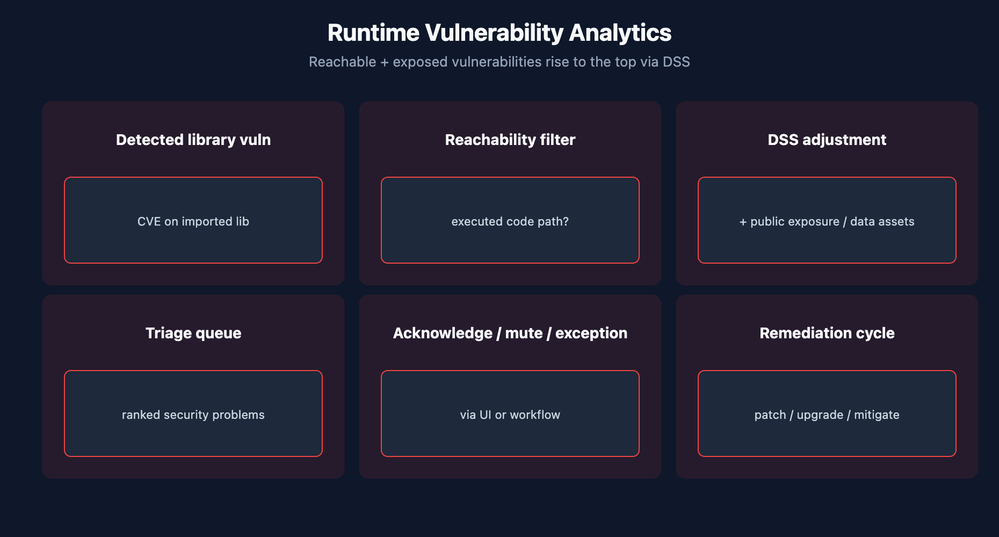

# APPSEC-02: Runtime Vulnerability Analytics

> **Series:** APPSEC — Application Security | **Notebook:** 2 of 10 | **Created:** June 2026 | **Last Updated:** 06/04/2026

## Overview

**Runtime Vulnerability Analytics (RVA)** is the pillar of Dynatrace AppSec that continuously inspects running processes and answers: *which CVEs are reachable from production code paths, and which production data assets are exposed to those code paths?* This notebook covers third-party (library) vulnerability detection — the loudest, highest-volume signal in most AppSec rollouts. Code-level (first-party) vulnerabilities are covered in APPSEC-03.

The distinguishing capability vs scanner-based tools: RVA observes the **executed** code paths via the OneAgent code module, so CVEs in imported-but-never-called libraries are de-prioritized automatically.



<!-- MARKDOWN_TABLE_ALTERNATIVE
| Layer | Signal | Action |
|-------|--------|--------|
| Library present | CVE matched | Catalog |
| Library reachable | Code executed | Triage |
| Reachable + exposed | Public / sensitive | Remediate first |
-->

---

## Table of Contents

1. [1. What RVA Detects](#what-rva-detects)
2. [2. The Reachability Signal](#reachability-signal)
3. [3. Triage with DQL](#triage-dql)
4. [4. Triage by Affected Entity](#triage-by-entity)
5. [5. Acknowledge / Mute / Exception Lifecycle](#lifecycle)
6. [6. Next Steps](#next)
7. [References](#references)

---

## Prerequisites

| Requirement | Details |
|-------------|---------|
| **Dynatrace Environment** | Gen3 SaaS with Grail; AppSec entitlement enabled |
| **OneAgent** | Full-Stack mode (or code-module attached) on monitored hosts |
| **Read access** | At minimum `environment:roles:view-security-problems` and `storage:security.events:read` — see APPSEC-09 for the full model |
| **Background** | APPSEC-01 (fundamentals + three-pillar framing) |

<a id="what-rva-detects"></a>
## 1. What RVA Detects

RVA continuously inventories libraries loaded by monitored processes, correlates them against CVE feeds, and produces two kinds of records:

| Record | Where | What it represents |
|--------|-------|--------------------|
| **Security event** | Grail `security.events` bucket | State transition (vulnerability detected, status changed, environment context updated) |
| **Security problem** | `vulnerability-service` | Deduped, Davis-grouped view of one underlying CVE across all affected entities |

A single CVE in `log4j-core-2.14.1` running on 47 hosts is **one security problem** with 47 affected entities, plus a stream of `security.events` records reporting the per-host state.

Practical implication: dashboards built on DQL count *events* (high cardinality, useful for trend detection); dashboards built on the Security Problems API count *problems* (low cardinality, useful for SLO and remediation tracking). Don't mix the two without understanding which axis you're measuring.

> <sub>**Sources:** [Application Security (DT docs)](https://docs.dynatrace.com/docs/secure/application-security) for the RVA framing. **Softened:** the events-vs-problems cardinality framing is community practice — verify the dedup behavior in your tenant before depending on it for SLO design.</sub>

<a id="reachability-signal"></a>
## 2. The Reachability Signal

RVA's prioritization model has three layers. From least to most actionable:

1. **Library present** — the vulnerable library is loaded into a process. Baseline signal; equivalent to scanner output.
2. **Library reachable** — production traffic has actually executed code paths into the library. This filters out imported-but-unused dependencies, which are often the majority of a scanner's noise.
3. **Reachable + exposed** — the reachable code path is also in a process exposed to the public internet OR touching sensitive data assets. This is the smallest set, and the one to remediate first.

The DSS adjustment in APPSEC-01 § 4 is driven by this same layering: a CVE that's library-present-only contributes much less than one that's reachable + exposed.

> <sub>**Sources:** [Application Security (DT docs)](https://docs.dynatrace.com/docs/secure/application-security) confirms public-internet exposure and reachable data assets as DSS signals. **Derived:** the three-layer prioritization is a synthesis presentation; the docs describe each signal but do not enumerate the layers as a model.</sub>

<a id="triage-dql"></a>
## 3. Triage with DQL

The Security Problems UI is the day-to-day triage surface, but DQL gives you fleet-wide rollups the UI cannot. Two patterns to know.

```dql
// Vulnerability state changes in the last 7 days, by risk level
fetch security.events, from:-7d
| filter event.type == "VULNERABILITY_STATE_REPORT_EVENT"
| summarize count = count(), by:{vulnerability.risk.level}
| sort count desc

```

<a id="triage-by-entity"></a>
## 4. Triage by Affected Entity

A second pattern: which services / process groups are accumulating the most vulnerability state changes? This is the cheapest way to find a stale base image or unmaintained dependency.

```dql
// Top affected entities by vulnerability event volume (24h)
fetch security.events, from:-24h
| filter event.type == "VULNERABILITY_STATE_REPORT_EVENT"
| summarize count = count(), by:{affected_entity.name, vulnerability.risk.level}
| sort count desc
| limit 25

```

> <sub>**Sources:** field names (`event.type`, `vulnerability.risk.level`, `affected_entity.name`) inferred from the AppSec-events shape; verified for DQL syntax only. **Softened:** field names should be re-verified in your tenant via `fetch security.events | limit 5 | fields *` before depending on these queries for production dashboards. The docs pages for the precise field schema were not resolvable at series-creation time (06/04/2026).</sub>

<a id="lifecycle"></a>
## 5. Acknowledge / Mute / Exception Lifecycle

Each security problem moves through states: `OPEN` → `RESOLVED` (vulnerability no longer present) or `OPEN` → `MUTED` (operator decided not to act). Muting is **not** the same as fixing — muted problems still appear in audit queries.

Patterns:
- **Acknowledge** when triaged and ticketed (Jira/ServiceNow link captured in the workflow — see APPSEC-08).
- **Mute** only when the CVE is genuinely false-positive or a compensating control is in place. Always capture the reason; the audit trail is the artifact.
- **Exception** for time-boxed accepted risk (waiting on vendor patch); pair with an SLA reminder so the exception expires.

For governance reporting, treat unacknowledged + unmuted + non-exception problems as the open backlog.

> <sub>**Sources:** [Application Security (DT docs)](https://docs.dynatrace.com/docs/secure/application-security) for problem-state framing. **Softened:** the *acknowledge vs mute vs exception* discipline is community practice — the docs describe state transitions but do not codify the governance recipe.</sub>

<a id="next"></a>
## 6. Next Steps

1. Run the two DQL queries above against your tenant. Adjust field names if they don't match.
2. Read **APPSEC-03** for first-party (code-level) vulnerability analytics — same Grail surface, different finding type.
3. Read **APPSEC-08** for the workflow patterns that route RVA findings to your ticketing system.
4. Read **APPSEC-09** before granting the SOC `manage-security-problems` — the privacy-sensitive carve-outs matter.

<a id="references"></a>
## References

| Source | Coverage |
|--------|----------|
| [Application Security (DT docs)](https://docs.dynatrace.com/docs/secure/application-security) | Three-pillar hub including RVA |
| [Secure / FAQ (DT docs)](https://docs.dynatrace.com/docs/secure/faq) | Official AppSec FAQ |
| [IAM policy statements reference (DT docs)](https://docs.dynatrace.com/docs/manage/identity-access-management/permission-management/manage-user-permissions-policies/advanced/iam-policystatements) | Permission tokens for security data |

---

> <sub>**⚠️ DISCLAIMER**: This information was AI generated and is provided "as-is" without warranty. It was produced as an independent, community-driven project and **not supported by Dynatrace**. Always refer to official [Dynatrace documentation](https://docs.dynatrace.com/docs) for the most current information.</sub>
