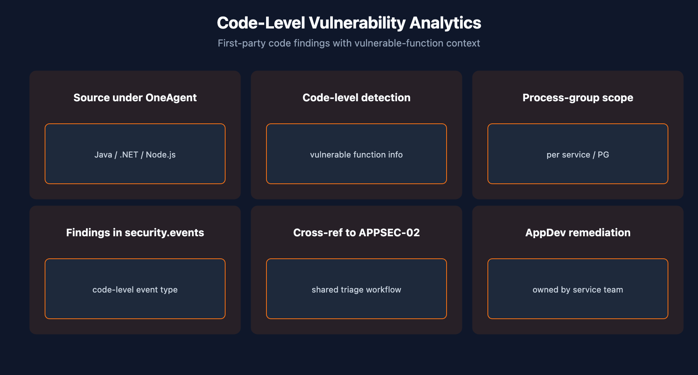

# APPSEC-03: Code-Level Vulnerability Analytics

> **Series:** APPSEC — Application Security | **Notebook:** 3 of 10 | **Created:** June 2026 | **Last Updated:** 06/04/2026

## Overview

**Code-Level Vulnerability Analytics** is the first-party counterpart to APPSEC-02's third-party (library) scope. Where RVA's library tier asks "which dependencies have known CVEs?", the code-level tier asks "which patterns in your own application code are vulnerable to known attack classes?"

This is the pillar where AppDev teams own remediation directly — there's no upstream library to upgrade, just code to change. Coverage depends on the runtime and on the OneAgent code module being attached.



<!-- MARKDOWN_TABLE_ALTERNATIVE
| Runtime | Coverage status |
|---------|------------------|
| JVM | Strongest |
| .NET | Strong |
| Node.js | Available |
| Go / Python / PHP / Ruby | Limited — verify |
-->

---

## Table of Contents

1. [1. First-Party vs Third-Party](#first-vs-third)
2. [2. Supported Runtimes](#runtimes)
3. [3. Vulnerable Function Information](#vulnerable-function)
4. [4. DQL: Code-Level Findings](#dql-code-level)
5. [5. Process-Group Scoping](#process-group)
6. [6. Next Steps](#next)
7. [References](#references)

---

## Prerequisites

| Requirement | Details |
|-------------|---------|
| **Dynatrace Environment** | Gen3 SaaS with Grail; AppSec entitlement enabled |
| **OneAgent** | Full-Stack mode (or code-module attached) on monitored hosts |
| **Read access** | At minimum `environment:roles:view-security-problems` and `storage:security.events:read` — see APPSEC-09 for the full model |
| **Background** | APPSEC-01 (fundamentals + three-pillar framing) |

<a id="first-vs-third"></a>
## 1. First-Party vs Third-Party

Both kinds of findings land in the same Grail bucket (`security.events`) and the same Security Problems surface, but they're not the same thing:

| Dimension | Third-party (APPSEC-02) | Code-level (this notebook) |
|-----------|-------------------------|-----------------------------|
| What's vulnerable | An imported library (a CVE record) | A pattern in your own source code |
| Remediation | Upgrade / patch / replace dep | Code change + redeploy |
| Owner | Platform / dependency lead | Service / AppDev team |
| Volume | High (every CVE feed update) | Lower (per-class, per-pattern detections) |
| Reachability signal | Same RVA reachability model | Inherent — code-level findings only fire on executed code |

In practice these belong on the same dashboard but in separate queues — confusing the two slows remediation because the wrong team gets paged.

> <sub>**Sources:** [Application Security (DT docs)](https://docs.dynatrace.com/docs/secure/application-security) for the third-party + code-level scope confirmation. **Derived:** the side-by-side comparison and team-ownership framing is a synthesis.</sub>

<a id="runtimes"></a>
## 2. Supported Runtimes

Code-level analytics requires deep introspection into the running application — bytecode for JVM, IL for .NET, AST for interpreted languages. Coverage tracks the OneAgent code module's instrumentation surface, which is broader for some runtimes than others.

| Runtime | Code-level coverage status |
|---------|----------------------------|
| Java / Kotlin / Scala (JVM) | Strongest coverage — long-standing instrumentation |
| .NET Framework / .NET Core | Strong coverage |
| Node.js | Coverage available; check current support matrix |
| Go | Limited — verify per release |
| Python | Coverage evolving; verify per release |
| PHP / Ruby | Limited |

The authoritative current support matrix lives in the Dynatrace docs and updates per OneAgent release. Don't take a static answer from any single document — re-verify at rollout time for each runtime you care about.

> <sub>**Sources:** [Application Security (DT docs)](https://docs.dynatrace.com/docs/secure/application-security) for the framing that code-level coverage depends on code-module instrumentation. **Softened:** the per-runtime coverage column reflects community practice as of 06/04/2026 and the general OneAgent instrumentation surface — re-verify per OneAgent release. The specific code-level support docs were not resolvable as a deep page at series-creation time.</sub>

<a id="vulnerable-function"></a>
## 3. Vulnerable Function Information

When a code-level finding fires, RVA can attach the specific function or method involved — not just "an SQL-injection-shaped pattern in this service" but "this method in this file in this commit." This is what turns a finding into a one-line task for the developer.

Two things to verify when you onboard code-level coverage:

1. **Vulnerable-function info is populated** for your runtime. If the field is null, the finding is harder to action.
2. **Service ownership is mapped** in Dynatrace (via tags or naming convention) so the workflow in APPSEC-08 can route the ticket to the right AppDev team automatically.

> <sub>**Sources:** [Application Security (DT docs)](https://docs.dynatrace.com/docs/secure/application-security) for the framing of vulnerable function info. **Softened:** field-name specifics need re-verification once the deep-page docs are resolvable.</sub>

<a id="dql-code-level"></a>
## 4. DQL: Code-Level Findings

Filter security events to first-party findings only. The exact `event.type` value depends on the tenant's event-type vocabulary — run `summarize count() by:{event.type}` first to discover what your tenant emits.

```dql
// Code-level findings (last 7 days) by service
// Replace event.type filter with the value your tenant uses for code-level findings
fetch security.events, from:-7d
| filter event.type == "VULNERABILITY_STATE_REPORT_EVENT"
| filter vulnerability.type == "CODE_LEVEL"
| summarize count = count(), by:{affected_entity.name, vulnerability.risk.level}
| sort count desc

```

> <sub>**Sources:** field names (`event.type`, `vulnerability.type`, `vulnerability.risk.level`, `affected_entity.name`) inferred from the AppSec events shape and verified for DQL syntax only. **Softened:** verify field names in your tenant before depending on this query.</sub>

<a id="process-group"></a>
## 5. Process-Group Scoping

Code-level coverage is enabled per process group (PG) in many tenants. This matters operationally:

- A PG with code-level disabled produces *zero* code-level findings — easily mistaken for "this service is secure."
- Rolling out code-level coverage incrementally (per service, per team) is safer than flipping it tenant-wide.
- Confirm code-level coverage status as a regular item in the AppSec governance review (APPSEC-10) — coverage drift is a known posture risk.

> <sub>**Sources:** [Application Security (DT docs)](https://docs.dynatrace.com/docs/secure/application-security) for the process-group / code-module dependency framing. **Softened:** the *coverage as governance check* recipe is community practice.</sub>

<a id="next"></a>
## 6. Next Steps

1. Confirm code-level coverage on the runtimes you care about — don't infer from APPSEC-02's volume.
2. Verify vulnerable-function info is populated in a sample finding.
3. Read **APPSEC-08** to wire findings to AppDev team ticket queues.
4. Read **APPSEC-09** so AppDev gets the narrow-scoped read access they need without seeing other teams' findings.

<a id="references"></a>
## References

| Source | Coverage |
|--------|----------|
| [Application Security (DT docs)](https://docs.dynatrace.com/docs/secure/application-security) | Code-level scope reference |
| [IAM policy statements reference (DT docs)](https://docs.dynatrace.com/docs/manage/identity-access-management/permission-management/manage-user-permissions-policies/advanced/iam-policystatements) | Permission tokens |

---

> <sub>**⚠️ DISCLAIMER**: This information was AI generated and is provided "as-is" without warranty. It was produced as an independent, community-driven project and **not supported by Dynatrace**. Always refer to official [Dynatrace documentation](https://docs.dynatrace.com/docs) for the most current information.</sub>
