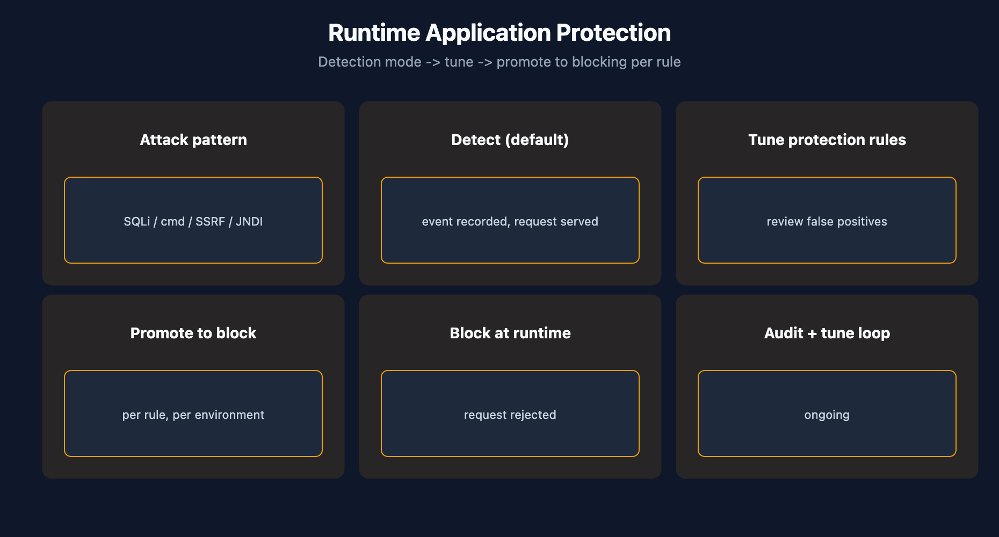

# APPSEC-04: Runtime Application Protection

> **Series:** APPSEC — Application Security | **Notebook:** 4 of 10 | **Created:** June 2026 | **Last Updated:** 06/04/2026

## Overview

**Runtime Application Protection (RAP)** sits in the OneAgent code module and watches request traffic for attack patterns — SQL injection, command injection, SSRF, JNDI lookup, and similar runtime attack classes. RAP runs in **detection** mode by default and can be promoted to **blocking** per protection rule once detection has been tuned.

RAP is unique among the AppSec pillars in that it has a *real-time enforcement* dimension. RVA and SPM tell you what's wrong; RAP can stop the request mid-flight. This power is also the reason the rollout discipline matters — blocking the wrong traffic is a customer-visible incident.



<!-- MARKDOWN_TABLE_ALTERNATIVE
| Stage | Mode | Cost of FP |
|-------|------|-------------|
| Day 1-30 | Detect | Dashboard noise |
| Day 30-60 | Detect + tune | Operator time |
| Day 60+ | Promote to block per rule | Customer-visible 5xx |
-->

---

## Table of Contents

1. [1. How RAP Works in the OneAgent](#how-it-works)
2. [2. Attack Types Covered](#attack-types)
3. [3. Detection vs Blocking Modes](#detect-vs-block)
4. [4. DQL: Attack Events](#dql-attacks)
5. [5. Attacks Per Service](#dql-attacks-per-svc)
6. [6. Next Steps](#next)
7. [References](#references)

---

## Prerequisites

| Requirement | Details |
|-------------|---------|
| **Dynatrace Environment** | Gen3 SaaS with Grail; AppSec entitlement enabled |
| **OneAgent** | Full-Stack mode (or code-module attached) on monitored hosts |
| **Read access** | At minimum `environment:roles:view-security-problems` and `storage:security.events:read` — see APPSEC-09 for the full model |
| **Background** | APPSEC-01 (fundamentals + three-pillar framing) |

<a id="how-it-works"></a>
## 1. How RAP Works in the OneAgent

RAP is part of the same code-module instrumentation that powers code-level RVA. When a request enters a monitored process:

1. The code module sees the request and the application's intent (SQL it's about to execute, OS command it's about to spawn, etc.).
2. RAP compares the request payload + intent against attack-pattern signatures.
3. If a match fires:
   - In **detection** mode: an `ATTACK_EVENT` is recorded in `security.events`; the request continues.
   - In **blocking** mode: the request is rejected before the dangerous operation executes; an event is still recorded.

Crucially, RAP makes the call **after** the request has been parsed but **before** the dangerous operation runs. This is why pattern fidelity is higher than network-layer WAF detection — RAP sees the actual SQL string, not just the HTTP body.

> <sub>**Sources:** [Application Security (DT docs)](https://docs.dynatrace.com/docs/secure/application-security) for the RAP framing. **Softened:** the "after parse, before execute" detail is community-practice framing of the runtime injection model — the deep-page RAP docs were not resolvable at 06/04/2026 to confirm the exact lifecycle.</sub>

<a id="attack-types"></a>
## 2. Attack Types Covered

The attack catalog evolves per OneAgent release. Classes consistently covered:

- **SQL Injection** — parameterized vs concatenated query detection
- **Command Injection** — OS command spawned with untrusted input
- **SSRF (Server-Side Request Forgery)** — outbound HTTP requests with untrusted target URLs
- **JNDI Injection / Lookup** — Log4Shell-class detection
- **Path Traversal** — file-system access with untrusted paths

Read the current OneAgent release notes for the full per-version catalog. Newer attack classes are added regularly; don't infer the catalog from a static document.

> <sub>**Sources:** [Application Security (DT docs)](https://docs.dynatrace.com/docs/secure/application-security) for the RAP attack-detection framing. **Softened:** the per-class list is community-practice knowledge for runtime-injection attack catalogs (these are the standard RASP classes); verify your tenant's current catalog against OneAgent release notes.</sub>

<a id="detect-vs-block"></a>
## 3. Detection vs Blocking Modes

The transition from detection to blocking is the most important operational decision in RAP. The cost asymmetry is large: false-positive in detection = noise in a dashboard; false-positive in blocking = HTTP 5xx and customer-visible incident.

Recommended rollout pattern:

1. **Day 1–30: detection-only.** Let RAP observe production traffic. Build a baseline of attack-event volume and false-positive patterns.
2. **Day 30–60: per-rule analysis.** Identify which rules fire only on real attacks (high precision) vs which fire on legitimate traffic too. Tune or exclude the noisy ones.
3. **Day 60+: promote selectively to blocking.** Start with high-precision rules in lower-traffic environments. Promote in production only after staging-environment data confirms zero false positives.

There is no global "RAP is in blocking mode" switch — promotion is per-rule, per-environment. Treat it as a release process, not a configuration change.

> <sub>**Sources:** [Application Security (DT docs)](https://docs.dynatrace.com/docs/secure/application-security) for the detect-vs-block mode framing. **Softened:** the day-30/60/60+ phasing and the "release process not config change" guidance are community practice — verify the cadence against your traffic volume.</sub>

<a id="dql-attacks"></a>
## 4. DQL: Attack Events

Two patterns for monitoring RAP volume in dashboards.

```dql
// Attack events by type, last 24h
fetch security.events, from:-24h
| filter event.type == "ATTACK_EVENT"
| summarize count = count(), by:{attack.type, attack.state}
| sort count desc

```

<a id="dql-attacks-per-svc"></a>
## 5. Attacks Per Service

Which services are being attacked most? Often the answer guides which protection rules to promote first.

```dql
// Attack events per service, last 24h
fetch security.events, from:-24h
| filter event.type == "ATTACK_EVENT"
| summarize count = count(), by:{affected_entity.name, attack.type}
| sort count desc
| limit 25

```

> <sub>**Sources:** field names (`event.type`, `attack.type`, `attack.state`, `affected_entity.name`) inferred from the AppSec events shape; verified for DQL syntax only. **Softened:** verify field names in your tenant — the deep-page RAP docs were not resolvable at 06/04/2026.</sub>

<a id="next"></a>
## 6. Next Steps

1. Confirm RAP is producing `ATTACK_EVENT` records by running the queries above. Zero rows on a public-facing service is unusual — confirm RAP is enabled and the code module is attached.
2. Build a per-rule precision baseline before considering blocking-mode promotion.
3. Read **APPSEC-08** for the workflow patterns that route attack alerts to the SOC.
4. Read **APPSEC-09** — `view-sensitive-request-data` controls whether attack payloads are visible; the SOC may need it, AppDev probably should not.

<a id="references"></a>
## References

| Source | Coverage |
|--------|----------|
| [Application Security (DT docs)](https://docs.dynatrace.com/docs/secure/application-security) | RAP positioning |
| [IAM policy statements reference (DT docs)](https://docs.dynatrace.com/docs/manage/identity-access-management/permission-management/manage-user-permissions-policies/advanced/iam-policystatements) | view-sensitive-request-data scope |

---

> <sub>**⚠️ DISCLAIMER**: This information was AI generated and is provided "as-is" without warranty. It was produced as an independent, community-driven project and **not supported by Dynatrace**. Always refer to official [Dynatrace documentation](https://docs.dynatrace.com/docs) for the most current information.</sub>
