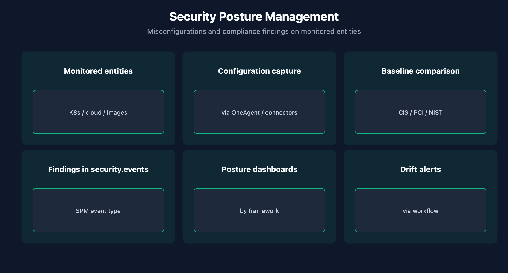

# APPSEC-05: Security Posture Management

> **Series:** APPSEC — Application Security | **Notebook:** 5 of 10 | **Created:** June 2026 | **Last Updated:** 06/04/2026

## Overview

**Security Posture Management (SPM)** evaluates the configuration state of monitored entities — Kubernetes clusters, cloud accounts, container images — against compliance baselines (CIS, PCI, NIST) and surfaces misconfigurations as findings in the same `security.events` Grail bucket as RVA and RAP.

Where RVA and RAP are *runtime* signals (what's executing right now), SPM is a *config* signal (what's been declared in the platform). The two complement each other — a fully-patched runtime on a misconfigured platform is still vulnerable.



<!-- MARKDOWN_TABLE_ALTERNATIVE
| Entity | Examples |
|--------|----------|
| K8s cluster | RBAC, pod security |
| Cloud account | IAM, encryption, public exposure |
| Container image | Base age, embedded secrets |
-->

---

## Table of Contents

1. [1. SPM Scope](#scope)
2. [2. Compliance Frameworks](#frameworks)
3. [3. DQL: SPM Findings](#dql-spm)
4. [4. Finding Lifecycle](#lifecycle)
5. [5. Next Steps](#next)
6. [References](#references)

---

## Prerequisites

| Requirement | Details |
|-------------|---------|
| **Dynatrace Environment** | Gen3 SaaS with Grail; AppSec entitlement enabled |
| **OneAgent** | Full-Stack mode (or code-module attached) on monitored hosts |
| **Read access** | At minimum `environment:roles:view-security-problems` and `storage:security.events:read` — see APPSEC-09 for the full model |
| **Background** | APPSEC-01 (fundamentals + three-pillar framing) |

<a id="scope"></a>
## 1. SPM Scope

SPM's scope is broader than the application — it covers the platform context in which applications run. Typical evaluation targets:

| Entity class | What SPM checks |
|--------------|------------------|
| Kubernetes clusters | RBAC, pod security, network policies, secret management |
| Cloud accounts (AWS / Azure / GCP) | IAM permissions, logging, storage encryption, public-exposure config |
| Container images | Base-image age, known vulnerabilities, secret scanning |
| Dynatrace platform itself | IAM hygiene, ingestion auth scheme (see AUTOM-04 § 3) |

The exact catalog of checks lives in the SPM product surface and evolves per release.

> <sub>**Sources:** [Application Security (DT docs)](https://docs.dynatrace.com/docs/secure/application-security) for SPM as the third pillar. **Softened:** the per-entity-class check catalog is community-practice synthesis; the deep-page SPM docs were not resolvable at 06/04/2026 to enumerate verbatim.</sub>

<a id="frameworks"></a>
## 2. Compliance Frameworks

SPM findings can be grouped by framework so a single misconfiguration shows up under each relevant standard:

- **CIS Benchmarks** — Center for Internet Security baselines per platform
- **PCI DSS** — payment card industry data security
- **NIST 800-53** — US federal control catalog
- **HIPAA / SOC 2 / ISO 27001** — coverage varies; verify per release

A single finding (e.g., "S3 bucket without encryption") often maps to controls in multiple frameworks. Don't double-count by framework when measuring posture; pick a primary framework for governance reporting and let the others be a secondary view.

> <sub>**Sources:** [Application Security (DT docs)](https://docs.dynatrace.com/docs/secure/application-security) confirms SPM covers compliance violations. **Softened:** per-framework coverage status should be re-verified per release; the docs page for the full framework catalog was not resolvable at 06/04/2026.</sub>

<a id="dql-spm"></a>
## 3. DQL: SPM Findings

Filter security events to SPM findings only. As with code-level findings, the exact event-type literal depends on your tenant's vocabulary — run `summarize count() by:{event.type}` first to discover.

```dql
// SPM findings (open) by framework, last 7 days
fetch security.events, from:-7d
| filter event.type == "POSTURE_FINDING"
| summarize count = count(), by:{compliance.framework, finding.severity}
| sort count desc

```

> <sub>**Sources:** field names (`event.type`, `compliance.framework`, `finding.severity`) inferred from the AppSec events shape; verified for DQL syntax only. **Softened:** the literal `"POSTURE_FINDING"` is a placeholder — run a discovery query first to find your tenant's actual event-type vocabulary.</sub>

<a id="lifecycle"></a>
## 4. Finding Lifecycle

SPM findings move through the same lifecycle as RVA findings: OPEN → RESOLVED (config fixed) or OPEN → MUTED / EXCEPTION. Two SPM-specific notes:

1. **Resolution is often automatic** — fix the config and the next SPM scan closes the finding. Manual acknowledgement is more common in RVA than SPM.
2. **Exceptions are common in SPM** — many compliance findings reflect legitimate architectural choices (a public-facing bucket holding intentionally-public assets). Exception with a documented reason is a normal posture.

> <sub>**Sources:** [Application Security (DT docs)](https://docs.dynatrace.com/docs/secure/application-security) for the SPM framing. **Derived:** the auto-resolution + exception-is-normal observations are synthesis of common SPM operating patterns.</sub>

<a id="next"></a>
## 5. Next Steps

1. Run the discovery query (`summarize count() by:{event.type}`) to find your tenant's SPM event-type literals.
2. Pick a primary framework for governance reporting; use others as secondary views.
3. Read **APPSEC-06** for Kubernetes + container security overlap with SPM.
4. Read **APPSEC-10** for SPM dashboard patterns and the executive view.

<a id="references"></a>
## References

| Source | Coverage |
|--------|----------|
| [Application Security (DT docs)](https://docs.dynatrace.com/docs/secure/application-security) | SPM scope reference |

---

> <sub>**⚠️ DISCLAIMER**: This information was AI generated and is provided "as-is" without warranty. It was produced as an independent, community-driven project and **not supported by Dynatrace**. Always refer to official [Dynatrace documentation](https://docs.dynatrace.com/docs) for the most current information.</sub>
