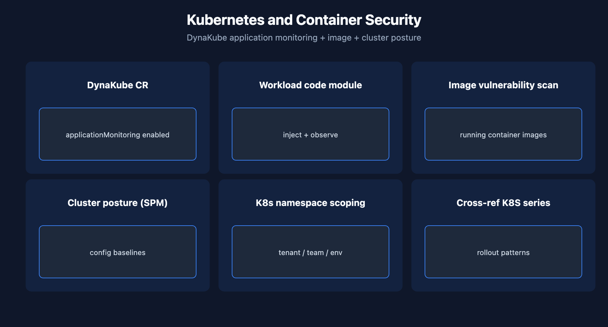

# APPSEC-06: Kubernetes and Container Security

> **Series:** APPSEC — Application Security | **Notebook:** 6 of 10 | **Created:** June 2026 | **Last Updated:** 06/04/2026

## Overview

Kubernetes and container workloads produce findings across all three AppSec pillars at once — RVA on the running containerized application, RAP on its request traffic, and SPM on the cluster + image configuration. This notebook covers how the pieces fit together and the K8s-specific levers.

For K8s rollout patterns themselves (DynaKube CR, operator install, namespace selectors), see the K8S series. This notebook focuses on the *security* dimension specifically.



<!-- MARKDOWN_TABLE_ALTERNATIVE
| Layer | Dynatrace surface |
|-------|---------------------|
| Application | RVA + RAP (via code module) |
| Container image | Image-tier RVA |
| Cluster config | SPM |
-->

---

## Table of Contents

1. [1. DynaKube and applicationMonitoring](#dynakube)
2. [2. Container Image Vulnerabilities](#image-vulns)
3. [3. Cluster SPM Findings](#cluster-spm)
4. [4. DQL: K8s-Scoped Findings](#dql-k8s)
5. [5. Namespace Scoping for IAM](#namespace-scoping)
6. [6. Next Steps](#next)
7. [References](#references)

---

## Prerequisites

| Requirement | Details |
|-------------|---------|
| **Dynatrace Environment** | Gen3 SaaS with Grail; AppSec entitlement enabled |
| **OneAgent** | Full-Stack mode (or code-module attached) on monitored hosts |
| **Read access** | At minimum `environment:roles:view-security-problems` and `storage:security.events:read` — see APPSEC-09 for the full model |
| **Background** | APPSEC-01 (fundamentals + three-pillar framing) |

<a id="dynakube"></a>
## 1. DynaKube and applicationMonitoring

The DynaKube custom resource is the entry point for AppSec on Kubernetes. The relevant fields:

```yaml
apiVersion: dynatrace.com/v1beta5
kind: DynaKube
metadata:
  name: dynakube
  namespace: dynatrace
spec:
  apiUrl: https://<tenant>.live.dynatrace.com/api
  oneAgent:
    applicationMonitoring:
      useCSIDriver: true
```

`applicationMonitoring` enables the code-module injection that powers RVA code-level coverage and RAP. Without it, K8s workloads will produce only the library-tier RVA signal and SPM findings on the cluster itself — no RAP, no code-level vulnerability info.

For cluster rollout the K8S series covers per-namespace targeting, monitoring modes, and operator versioning. APPSEC concerns are downstream of that.

> <sub>**Sources:** [Application Security (DT docs)](https://docs.dynatrace.com/docs/secure/application-security) for the code-module dependency framing. **Softened:** the exact DynaKube schema may shift per operator release — verify against the current K8S series and the operator CRD.</sub>

<a id="image-vulns"></a>
## 2. Container Image Vulnerabilities

Image-tier findings are a subset of RVA: Dynatrace inventories the libraries in running container images and reports CVEs against them. The result lands in `security.events` with the same vulnerability event-type as host-level RVA but with K8s-specific context fields (cluster, namespace, workload, image name + digest).

Practical pattern: report image-tier vulnerabilities **by namespace** rather than by individual workload — namespaces are usually a stable team/service boundary, while workload names churn with deployments.

> <sub>**Sources:** [Application Security (DT docs)](https://docs.dynatrace.com/docs/secure/application-security) for the K8s + image scope. **Softened:** the namespace-as-stable-boundary recommendation is community practice — verify the namespace-naming discipline in your tenant before relying on it for reports.</sub>

<a id="cluster-spm"></a>
## 3. Cluster SPM Findings

SPM (APPSEC-05) covers Kubernetes cluster configuration: RBAC bindings, pod security, network policies, secret management. Common high-impact findings:

- Cluster-admin-bound users that shouldn't be cluster-admin
- Pods running as root without explicit need
- Network policies absent on namespaces that should be isolated
- Secrets stored as ConfigMaps instead of Secrets (or unencrypted at rest)
- Public LoadBalancer services exposing internal-only workloads

These findings are durable — they reflect the cluster's declared state and don't churn the way runtime events do.

> <sub>**Sources:** [Application Security (DT docs)](https://docs.dynatrace.com/docs/secure/application-security) for SPM scope. **Softened:** the high-impact finding list reflects the standard CIS-K8s control set; the exact Dynatrace SPM catalog should be confirmed against current docs.</sub>

<a id="dql-k8s"></a>
## 4. DQL: K8s-Scoped Findings

Filter AppSec events to a specific cluster + namespace to slice findings by team boundary.

```dql
// AppSec findings in a specific cluster + namespace, last 24h
fetch security.events, from:-24h
| filter k8s.cluster.name == "prod-cluster-01"
| filter k8s.namespace.name == "team-payments"
| summarize count = count(), by:{event.type, vulnerability.risk.level}
| sort count desc

```

> <sub>**Sources:** field names (`k8s.cluster.name`, `k8s.namespace.name`) follow OpenTelemetry semantic-convention naming and are commonly present on AppSec events with K8s entity context — verified for DQL syntax only. **Softened:** verify field names in your tenant; the deep-page K8s AppSec schema docs were not resolvable at 06/04/2026.</sub>

<a id="namespace-scoping"></a>
## 5. Namespace Scoping for IAM

K8s namespace is the natural IAM boundary for AppSec findings: AppDev team X should see findings in its own namespaces, not in team Y's. The IAM permission model supports this via boundary conditions:

```
ALLOW storage:security.events:read, vulnerability-service:vulnerabilities:read
WHERE storage:k8s.namespace.name in {"team-payments-prod", "team-payments-staging"};
```

See APPSEC-09 for the full pattern including the policy-vs-managed-policy decision and the privacy carve-out for `view-sensitive-request-data`.

> <sub>**Sources:** [IAM policy statements reference (DT docs)](https://docs.dynatrace.com/docs/manage/identity-access-management/permission-management/manage-user-permissions-policies/advanced/iam-policystatements) confirms K8s namespace as an available boundary condition on `storage:security.events:read`. The full IAM model is in APPSEC-09.</sub>

<a id="next"></a>
## 6. Next Steps

1. Confirm DynaKube `applicationMonitoring` is enabled on clusters where AppDev-tier vulnerability data matters.
2. Run the namespace-scoped DQL above against a known-active namespace to verify field names match.
3. Read the **K8S series** for the rollout mechanics — this notebook intentionally defers to it.
4. Read **APPSEC-09** for the full K8s namespace IAM scoping pattern.

<a id="references"></a>
## References

| Source | Coverage |
|--------|----------|
| [Application Security (DT docs)](https://docs.dynatrace.com/docs/secure/application-security) | K8s + container security framing |
| [IAM policy statements reference (DT docs)](https://docs.dynatrace.com/docs/manage/identity-access-management/permission-management/manage-user-permissions-policies/advanced/iam-policystatements) | k8s.namespace.name boundary condition |

---

> <sub>**⚠️ DISCLAIMER**: This information was AI generated and is provided "as-is" without warranty. It was produced as an independent, community-driven project and **not supported by Dynatrace**. Always refer to official [Dynatrace documentation](https://docs.dynatrace.com/docs) for the most current information.</sub>
