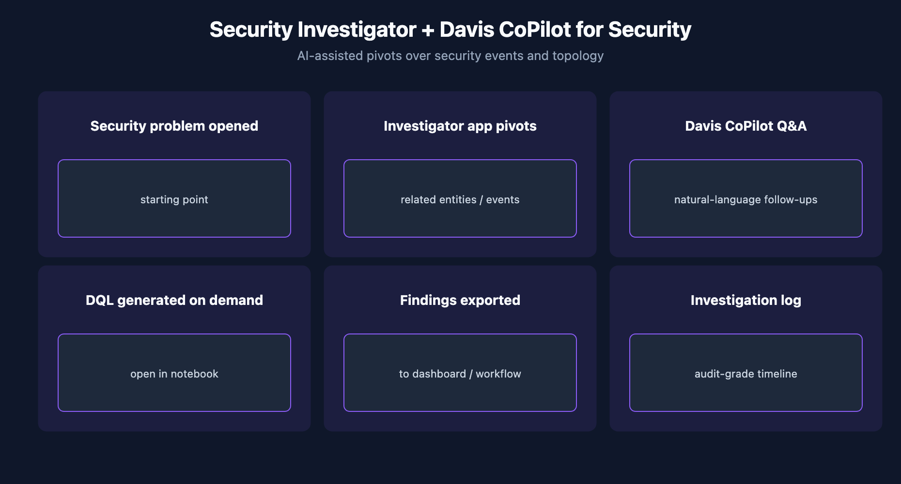

# APPSEC-07: Security Investigator and Davis CoPilot for Security

> **Series:** APPSEC — Application Security | **Notebook:** 7 of 10 | **Created:** June 2026 | **Last Updated:** 06/04/2026

## Overview

When a security problem opens, an analyst's job is to follow the chain: which entities are affected, what else changed in the topology around that time, what's the most likely remediation? Dynatrace gives you two complementary surfaces for this work — the **Security Investigator** app (visual pivoting over entities and events) and **Davis CoPilot** (natural-language question-asking that generates DQL on demand).

This notebook covers when to reach for each, and the integration points back to the rest of the AppSec series.



<!-- MARKDOWN_TABLE_ALTERNATIVE
| Surface | Best for |
|---------|----------|
| Investigator app | Visual pivots over topology + events |
| Davis CoPilot | Natural-language Q to DQL |
| Notebook | Durable investigation record |
-->

---

## Table of Contents

1. [1. Security Investigator Workflow](#investigator)
2. [2. Davis CoPilot for Security Questions](#copilot)
3. [3. DQL Generated On Demand](#dql-export)
4. [4. Investigation Log as Audit Artifact](#audit)
5. [5. Next Steps](#next)
6. [References](#references)

---

## Prerequisites

| Requirement | Details |
|-------------|---------|
| **Dynatrace Environment** | Gen3 SaaS with Grail; AppSec entitlement enabled |
| **OneAgent** | Full-Stack mode (or code-module attached) on monitored hosts |
| **Read access** | At minimum `environment:roles:view-security-problems` and `storage:security.events:read` — see APPSEC-09 for the full model |
| **Background** | APPSEC-01 (fundamentals + three-pillar framing) |

<a id="investigator"></a>
## 1. Security Investigator Workflow

Investigator opens on a security problem and lets you pivot:

- **Affected entities** → the services, processes, hosts, containers touched by the vulnerability
- **Related security events** → other events on those entities in the same time window
- **Topology context** → Smartscape upstream / downstream so you can see blast radius
- **Davis problem correlation** → did a Davis problem (performance / availability) fire on the same entities at the same time?

The pivots are the value. A flat list of events is a triage queue; a pivoted view is an investigation.

> <sub>**Sources:** [Application Security (DT docs)](https://docs.dynatrace.com/docs/secure/application-security) confirms Security Investigator. **Softened:** the specific pivot set is community-practice synthesis of the investigation surface — the deep-page Investigator docs were not resolvable at 06/04/2026.</sub>

<a id="copilot"></a>
## 2. Davis CoPilot for Security Questions

Davis CoPilot accepts natural-language questions and translates them into DQL or topology queries. Examples:

- "Which services were attacked the most in the last 24 hours?" → DQL over `security.events` with `ATTACK_EVENT` filter
- "Show me the security problems opened on payments services this week" → DQL + topology filter
- "Are any of these vulnerabilities reachable from the public internet?" → Investigator-style pivot

CoPilot is most useful when you can verbalize the question but the DQL is non-obvious — exactly the situation a security analyst hits often. Treat the generated DQL as a starting point; review and refine before pinning to a dashboard.

> <sub>**Sources:** [Application Security (DT docs)](https://docs.dynatrace.com/docs/secure/application-security) confirms CoPilot integration. **Softened:** the specific example prompts are illustrative — verify CoPilot's current generation behavior in your tenant.</sub>

<a id="dql-export"></a>
## 3. DQL Generated On Demand

When CoPilot generates a query you want to keep, the path is: open it in a notebook (this surface), refine, then pin to a dashboard. The pattern below is a CoPilot-style query you might use as a starting prompt: *"Show me vulnerability state changes in the last 24 hours grouped by severity and exposure."*

```dql
// Vulnerability state changes by severity + exposure (24h)
// Common CoPilot-generated shape for executive triage
fetch security.events, from:-24h
| filter event.type == "VULNERABILITY_STATE_REPORT_EVENT"
| summarize count = count(), by:{vulnerability.risk.level, vulnerability.public_exposure}
| sort count desc

```

> <sub>**Sources:** field names (`event.type`, `vulnerability.risk.level`, `vulnerability.public_exposure`) inferred from the AppSec events shape and the DSS signal catalog; verified for DQL syntax only. **Softened:** verify field names — the deep-page schema docs were not resolvable at 06/04/2026.</sub>

<a id="audit"></a>
## 4. Investigation Log as Audit Artifact

For regulated environments, the investigation itself is an audit artifact. Two practices:

1. **Open each investigation in a notebook**, not just the Investigator UI. The notebook captures the queries, the reasoning, and the conclusion as a durable record.
2. **Attach the notebook to the ticketing system** (Jira/ServiceNow link) so the security-problem record links to the investigation record. APPSEC-08 covers the workflow patterns.

This is more discipline than tooling. Both surfaces support it; the question is whether the team commits to using them this way.

> <sub>**Sources:** [Application Security (DT docs)](https://docs.dynatrace.com/docs/secure/application-security) for the investigation surface. **Derived:** the *investigation-as-audit-artifact* discipline is community practice in regulated environments.</sub>

<a id="next"></a>
## 5. Next Steps

1. Open a recent security problem in Investigator. Walk the pivots end-to-end.
2. Ask CoPilot for one of the example prompts above. Review the generated DQL.
3. Read **APPSEC-08** to wire the investigation outcome to a remediation ticket.
4. Read **APPSEC-09** — CoPilot can only generate queries against data the user has IAM access to; the policy model bounds the assistant's reach.

<a id="references"></a>
## References

| Source | Coverage |
|--------|----------|
| [Application Security (DT docs)](https://docs.dynatrace.com/docs/secure/application-security) | Investigator + CoPilot surface |

---

> <sub>**⚠️ DISCLAIMER**: This information was AI generated and is provided "as-is" without warranty. It was produced as an independent, community-driven project and **not supported by Dynatrace**. Always refer to official [Dynatrace documentation](https://docs.dynatrace.com/docs) for the most current information.</sub>
