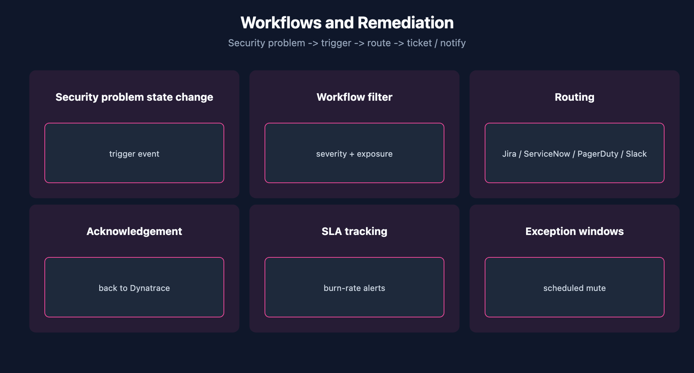

# APPSEC-08: Workflows, Notifications and Remediation

> **Series:** APPSEC — Application Security | **Notebook:** 8 of 10 | **Created:** June 2026 | **Last Updated:** 06/04/2026

## Overview

A security problem that sits in the Dynatrace UI helps nobody. The value of AppSec is realized when findings reach the people who can act on them — the SOC for triage, AppDev for code fixes, the platform team for infrastructure changes. **Workflows** are the bridge.

This notebook covers the trigger patterns, the routing decisions, the SLA + burn-rate alerting, and the ack-loopback that keeps Dynatrace and the ticketing system in sync.



<!-- MARKDOWN_TABLE_ALTERNATIVE
| Destination | Content | Trigger |
|-------------|---------|---------|
| Jira | AppDev backlog | Severity >= High, reachable |
| ServiceNow | Platform changes | SPM findings (CIS/PCI) |
| PagerDuty | SOC paging | ATTACK_EVENT in prod |
| Slack | Awareness | Critical or digest |
-->

---

## Table of Contents

1. [1. Triggers on Security Problems](#triggers)
2. [2. Routing: Jira / ServiceNow / PagerDuty / Slack](#routing)
3. [3. Acknowledgement Loopback](#ack-loopback)
4. [4. SLA and Burn-Rate Alerts](#sla-alerts)
5. [5. DQL: Backlog Burn-Rate](#dql-sla)
6. [6. Next Steps](#next)
7. [References](#references)

---

## Prerequisites

| Requirement | Details |
|-------------|---------|
| **Dynatrace Environment** | Gen3 SaaS with Grail; AppSec entitlement enabled |
| **OneAgent** | Full-Stack mode (or code-module attached) on monitored hosts |
| **Read access** | At minimum `environment:roles:view-security-problems` and `storage:security.events:read` — see APPSEC-09 for the full model |
| **Background** | APPSEC-01 (fundamentals + three-pillar framing) |

<a id="triggers"></a>
## 1. Triggers on Security Problems

The workflow engine can subscribe to security events as triggers. The two trigger modes:

| Trigger | Fires on | Use for |
|---------|----------|---------|
| **Event-stream** | New `security.events` records in Grail | High-volume routing (attack events, state changes) |
| **Davis problem** | New / changed security problems in `vulnerability-service` | Lower-volume, deduped triage — the typical SOC routing |

For SOC routing, Davis-problem triggers are usually the right choice — they're deduped and represent unique vulnerabilities, not the per-host state stream. For attack-event alerting (RAP), event-stream triggers are required because each attack is its own observation.

> <sub>**Sources:** [Application Security (DT docs)](https://docs.dynatrace.com/docs/secure/application-security) for the security-problem / security-events surfaces. **Derived:** the event-stream vs Davis-problem trigger comparison is a synthesis of the two surfaces' shapes — verify trigger types in your tenant's workflow editor.</sub>

<a id="routing"></a>
## 2. Routing: Jira / ServiceNow / PagerDuty / Slack

Common routing patterns:

| Destination | What goes there | Trigger filter |
|-------------|------------------|----------------|
| **Jira** | AppDev backlog: code-level vulns + third-party vulns scoped to service team | Severity ≥ High, reachable, owner-tag mapped |
| **ServiceNow** | Platform/infra changes: SPM findings on cluster, cloud-account config | Severity ≥ High, framework in {CIS, PCI} |
| **PagerDuty** | Real-time SOC paging: RAP attack events in production | event.type=ATTACK_EVENT, environment=prod, attack.state=detected |
| **Slack** | Awareness channel: new critical security problems, weekly digest | Severity = Critical OR scheduled summary |

A finding can fire into multiple destinations — there's no requirement to pick one. What matters is that each destination has a clear ownership boundary so no finding falls between teams.

> <sub>**Sources:** [Application Security (DT docs)](https://docs.dynatrace.com/docs/secure/application-security) for the workflow + notification framing. **Derived:** the four-destination routing matrix is community practice — verify against your SOC's ownership model.</sub>

<a id="ack-loopback"></a>
## 3. Acknowledgement Loopback

When a Jira ticket is closed, the security problem in Dynatrace should reflect that. Without loopback, the Dynatrace open-problems count drifts from the ticketing system, and governance dashboards lose meaning.

Two implementation paths:

1. **Workflow-driven** — a workflow polls the ticketing system or subscribes to a webhook, then calls the Dynatrace API to acknowledge the security problem.
2. **API-driven from ticketing** — the ticketing system itself calls the Dynatrace API on close. Less common because it requires the security team to control ticketing-side automation.

For programmatic ack, the IAM scope is `vulnerability-service:vulnerabilities:write` (on the Service User executing the workflow). See APPSEC-09 § 7 for the auth-scheme routing.

> <sub>**Sources:** [IAM policy statements reference (DT docs)](https://docs.dynatrace.com/docs/manage/identity-access-management/permission-management/manage-user-permissions-policies/advanced/iam-policystatements) for `vulnerability-service:vulnerabilities:write` (verified 06/04/2026). **Softened:** the two implementation paths are community practice; pick based on which team controls each side.</sub>

<a id="sla-alerts"></a>
## 4. SLA and Burn-Rate Alerts

For regulated environments, security findings have remediation SLAs (e.g., Critical: 7 days, High: 30 days, Medium: 90 days). Two complementary alerts:

1. **Per-problem SLA breach** — fires when an individual problem crosses its deadline.
2. **Backlog burn-rate** — fires when the *rate of new high-severity findings* exceeds the *rate of remediation* for several days running, signaling the team can't keep up.

Burn-rate alerts catch the systemic-overload pattern that per-problem alerts miss — a team can close every individual ticket on time and still be accumulating debt if new findings outpace remediation.

> <sub>**Sources:** [Application Security (DT docs)](https://docs.dynatrace.com/docs/secure/application-security) for the workflow + notification framing. **Derived:** burn-rate alerting on AppSec backlog is community practice borrowed from SLO operations — verify against your governance model.</sub>

<a id="dql-sla"></a>
## 5. DQL: Backlog Burn-Rate

A starter query for backlog burn-rate dashboards: count new critical findings opened in the trailing 7 days vs new critical findings resolved.

```dql
// Critical security events: opened vs resolved, last 7 days
fetch security.events, from:-7d
| filter event.type == "VULNERABILITY_STATE_REPORT_EVENT"
| filter vulnerability.risk.level == "CRITICAL"
| summarize opened = countIf(event.status == "OPEN"), resolved = countIf(event.status == "RESOLVED"), by:{day = bin(timestamp, 1d)}
| sort day asc

```

> <sub>**Sources:** field names (`event.type`, `vulnerability.risk.level`, `event.status`) inferred from the AppSec events shape; verified for DQL syntax only. **Softened:** verify field names and the `OPEN` / `RESOLVED` literal values in your tenant.</sub>

<a id="next"></a>
## 6. Next Steps

1. Decide which findings go to which destination. Write down the routing matrix before building the first workflow.
2. Build the ack-loopback before the first finding flows — drift starts on day one without it.
3. Read **APPSEC-09** to get the Service User permissions right for workflow execution.
4. Read **APPSEC-10** for the governance dashboards that read off the burn-rate query above.

<a id="references"></a>
## References

| Source | Coverage |
|--------|----------|
| [Application Security (DT docs)](https://docs.dynatrace.com/docs/secure/application-security) | Workflow + notification framing |
| [IAM policy statements reference (DT docs)](https://docs.dynatrace.com/docs/manage/identity-access-management/permission-management/manage-user-permissions-policies/advanced/iam-policystatements) | vulnerability-service:vulnerabilities:write scope |

---

> <sub>**⚠️ DISCLAIMER**: This information was AI generated and is provided "as-is" without warranty. It was produced as an independent, community-driven project and **not supported by Dynatrace**. Always refer to official [Dynatrace documentation](https://docs.dynatrace.com/docs) for the most current information.</sub>
