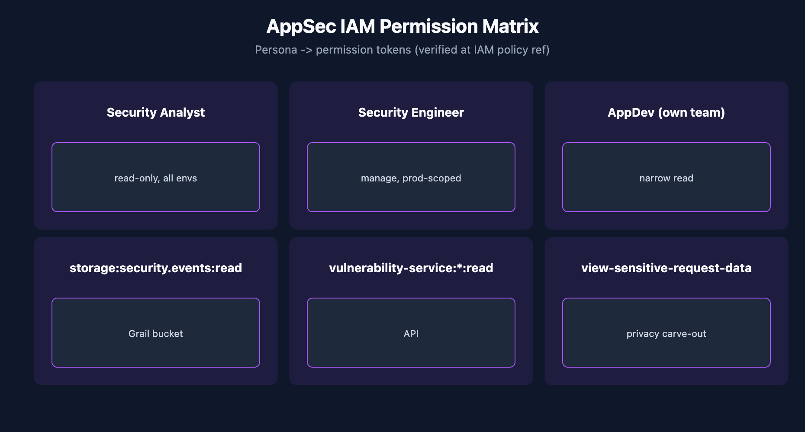

# APPSEC-09: IAM and Gen3 Permissions for AppSec

> **Series:** APPSEC — Application Security | **Notebook:** 9 of 10 | **Created:** June 2026 | **Last Updated:** 06/04/2026

## Overview

AppSec data is among the most sensitive material in Dynatrace — vulnerability inventory, captured attack payloads, compliance findings. Granting too much access exposes private payloads; granting too little blocks the SOC from doing its job. This notebook is the IAM-design notebook for AppSec: the permission catalog (verified verbatim against the IAM policy statements reference), three persona policies, boundary patterns, and the privacy carve-out for `view-sensitive-request-data`.

This is the most-grounded notebook in the series — the [IAM policy statements reference (DT docs)](https://docs.dynatrace.com/docs/manage/identity-access-management/permission-management/manage-user-permissions-policies/advanced/iam-policystatements) was resolvable at series-creation time and the tokens below were verified verbatim on 06/04/2026.



<!-- MARKDOWN_TABLE_ALTERNATIVE
| Persona | Read | Manage | Sensitive payload |
|---------|------|--------|-------------------|
| Analyst | yes | no | no |
| Security Engineer | yes | yes (prod-scoped) | optional |
| AppDev | own namespace only | no | no |
-->

---

## Table of Contents

1. [1. AppSec IAM in Gen3 — Same DSL, Specific Tokens](#appsec-iam-different)
2. [2. The AppSec Permission Catalog (Verified)](#permission-catalog)
3. [3. Persona Policies (Worked Examples)](#personas)
4. [4. Boundary Patterns for AppSec Data](#boundary-patterns)
5. [5. Privacy: view-sensitive-request-data](#sensitive-payload)
6. [6. Reach for Managed Policies First](#managed-policies)
7. [7. OAuth Client vs Platform Token Scope Routing](#auth-routing)
8. [8. Audit and Periodic Review](#audit)
9. [9. What's Still Evolving](#evolving)
10. [10. Next Steps](#next)
11. [References](#references)

---

## Prerequisites

| Requirement | Details |
|-------------|---------|
| **Dynatrace Environment** | Gen3 SaaS with Grail; AppSec entitlement enabled |
| **OneAgent** | Full-Stack mode (or code-module attached) on monitored hosts |
| **Read access** | At minimum `environment:roles:view-security-problems` and `storage:security.events:read` — see APPSEC-09 for the full model |
| **Background** | APPSEC-01 (fundamentals + three-pillar framing) |

<a id="appsec-iam-different"></a>
## 1. AppSec IAM in Gen3 — Same DSL, Specific Tokens

AppSec data in Gen3 lives in Grail (`security.events`) and the `vulnerability-service` API. Both are governed by the same `ALLOW <service>:<resource>:<action> WHERE <conditions>` policy DSL as the rest of Gen3 — not by classic environment roles.

The exception: some AppSec UI surfaces (the Security Problems app, sensitive-payload visibility) are still gated by `environment:roles:*` permissions. This means AppSec is a **dual-surface IAM domain**:

- Grail data + `vulnerability-service` API → `storage:*` and `vulnerability-service:*` policy tokens
- UI / sensitive-payload visibility → `environment:roles:*` permission tokens

A complete AppSec persona policy usually needs grants from both surfaces. See IAM-04 § Policy Authoring for the underlying DSL grammar.

> <sub>**Sources:** [IAM policy statements reference (DT docs)](https://docs.dynatrace.com/docs/manage/identity-access-management/permission-management/manage-user-permissions-policies/advanced/iam-policystatements) verified 06/04/2026. **Derived:** the *dual-surface IAM domain* framing is a synthesis aid — the docs list each token but do not characterize AppSec as dual-surface.</sub>

<a id="permission-catalog"></a>
## 2. The AppSec Permission Catalog (Verified)

Tokens below were verified verbatim on 06/04/2026 against the IAM policy statements reference. Re-verify before pinning these into a production policy.

### AppSec-specific tokens

| Token | Purpose | Optional conditions |
|-------|---------|---------------------|
| `environment:roles:view-security-problems` | View Security Problems UI | Management zone scope |
| `environment:roles:manage-security-problems` | Acknowledge / mute / set exception | Management zone scope |
| `environment:roles:view-sensitive-request-data` | View captured request data (RAP attack payloads — privacy-sensitive) | Management zone scope |
| `environment:roles:configure-request-capture-data` | Configure capture of sensitive data | — |
| `storage:security.events:read` | Read security events from Grail | Bucket, event-type, K8s namespace, cluster, host, cloud account |
| `storage:security.events:ingest` | Ingest security events via OpenPipeline | — |
| `vulnerability-service:vulnerabilities:read` | View vulnerabilities (programmatic) | — |
| `vulnerability-service:vulnerabilities:write` | Modify vulnerability info — acknowledge, exception (programmatic) | — |
| `security-intelligence:enrichments:run` | Run enrichments (IP-address attribution, integration-app discovery) — relevant for Threats & Exploits / RAP investigation | — |

### Platform-collateral tokens AppSec apps load on top of the above

The AppSec product surfaces (Vulnerabilities app, Threats & Exploits app, Security Posture Management app) also need general Gen3 platform reads to load and operate — these are **not AppSec-specific**, they're what every Gen3 app needs:

`storage:entities:read`, `storage:buckets:read`, `storage:logs:read`, `storage:filter-segments:read`, `document:documents:read`, `settings:objects:read`, `hub:catalog:read`, `state:user-app-states:read`, `state:user-app-states:write`

These are usually already granted by the managed user policies covered in § 6 — call them out explicitly in audit conversations so reviewers know they're collateral, not AppSec-elevated access.

### Critical corrections (verified)

1. **There is no `storage:security_problems:read` token.** Security-problem read access is dual-surface — `environment:roles:view-security-problems` for the UI, `vulnerability-service:vulnerabilities:read` for the API. Common mistake when copying patterns from other Grail tables.
2. **The storage token is `security.events` with a dot**, not `security_events` with an underscore.
3. **`environment-api:security-problems:read` is NOT in the IAM policy reference** as of 06/04/2026. If you see this token cited (some docs assistants surface it), it's not a current IAM permission token — use `vulnerability-service:vulnerabilities:read` for programmatic vuln access instead.

> <sub>**Sources:** [IAM policy statements reference (DT docs)](https://docs.dynatrace.com/docs/manage/identity-access-management/permission-management/manage-user-permissions-policies/advanced/iam-policystatements) — every token verified verbatim 06/04/2026.</sub>

<a id="personas"></a>
## 3. Persona Policies (Worked Examples)

Three personas, three policies. Copy and adapt to your tenant's group structure.

### Persona A — Security Analyst (read-only, all environments)

```
ALLOW environment:roles:view-security-problems;
ALLOW storage:security.events:read;
ALLOW vulnerability-service:vulnerabilities:read;
```

This is the SOC's daily-driver policy. Read everything, change nothing. Does **not** include `view-sensitive-request-data` — see § 5.

### Persona B — Security Engineer (manage, prod-scoped via boundary)

```
ALLOW environment:roles:view-security-problems;
ALLOW environment:roles:manage-security-problems
  WHERE environment:management-zone = "production";
ALLOW storage:security.events:read;
ALLOW vulnerability-service:vulnerabilities:read;
ALLOW vulnerability-service:vulnerabilities:write;
```

Manages production-zone problems only. Read-only outside production. The boundary keeps a junior engineer from accidentally acknowledging a critical staging finding.

### Persona C — AppDev (own-team read-only, K8s namespace boundary)

```
ALLOW environment:roles:view-security-problems
  WHERE environment:management-zone = "team-payments";
ALLOW storage:security.events:read
  WHERE storage:k8s.namespace.name in {"team-payments-prod", "team-payments-staging"};
ALLOW vulnerability-service:vulnerabilities:read;
```

AppDev sees only findings in their namespaces. Note `vulnerability-service:vulnerabilities:read` is granted unconditionally — the service API does not currently support per-namespace boundary conditions. If finer programmatic scoping is required, gate the API behind an OpenPipeline / workflow filter instead.

> <sub>**Sources:** [IAM policy statements reference (DT docs)](https://docs.dynatrace.com/docs/manage/identity-access-management/permission-management/manage-user-permissions-policies/advanced/iam-policystatements) for the conditions on each token. **Softened:** the AppDev pattern's claim that `vulnerability-service:vulnerabilities:read` has no per-namespace boundary should be re-verified at policy-author time — IAM evolves sprint-to-sprint.</sub>

<a id="boundary-patterns"></a>
## 4. Boundary Patterns for AppSec Data

Beyond the three personas above, three boundary patterns recur in AppSec IAM:

1. **Production-only manage** — Persona B above. Acknowledge/exception in prod, read-only in non-prod.
2. **Namespace-scoped read** — Persona C above. AppDev team sees only its own namespaces.
3. **Sensitive-payload carve-out** — `view-sensitive-request-data` granted separately to a small named group (SOC tier 2 / incident responders), not to the general read-only group.

For workflow Service Users that programmatically acknowledge problems, grant `vulnerability-service:vulnerabilities:write` on the Service User specifically (per AUTOM-04 § 3 service-user-credentials guidance), not on a shared OAuth client.

> <sub>**Sources:** [IAM policy statements reference (DT docs)](https://docs.dynatrace.com/docs/manage/identity-access-management/permission-management/manage-user-permissions-policies/advanced/iam-policystatements) for boundary syntax. **Derived:** the three-pattern recurrence is community practice.</sub>

<a id="sensitive-payload"></a>
## 5. Privacy: view-sensitive-request-data

RAP attack events can include the actual request payload that triggered the detection — the SQL injection string, the JNDI lookup URL, the command-injection input. These payloads frequently contain PII or other sensitive material that came through the application boundary.

`environment:roles:view-sensitive-request-data` is the gate for visibility into these payloads. Three operating rules:

1. **Don't grant it broadly.** Grant to incident responders + SOC tier 2, not to general read-only roles. The default-deny posture matters.
2. **Pair with `configure-request-capture-data`** for the small group responsible for tuning what gets captured.
3. **Audit access regularly.** Who has the permission, when did they last use it, against which events? Captured-payload access is exactly the surface auditors scrutinize.

This is the carve-out where AppSec IAM most often gets too generous — make it explicit who has it and why.

> <sub>**Sources:** [IAM policy statements reference (DT docs)](https://docs.dynatrace.com/docs/manage/identity-access-management/permission-management/manage-user-permissions-policies/advanced/iam-policystatements) confirms `view-sensitive-request-data` and `configure-request-capture-data` as separate tokens. **Derived:** the *don't grant broadly + audit regularly* recipe is community practice in regulated environments.</sub>

<a id="managed-policies"></a>
## 6. Reach for Managed Policies First

Following IAM-04 § 6 guidance, prefer pre-built managed policies over hand-rolled custom policies wherever they cover the use case. Managed policies that may exist for AppSec (verify in your tenant — exact names drift):

- *Security Default Read* (or similar) — typical SOC analyst grant
- *Storage `security.events` Read*
- *Security Problems Manage*

If a managed policy covers 80% of a persona's need, use it and add a small custom policy for the deltas, rather than rebuilding the whole grant set from scratch. This shrinks the audit surface and reduces drift across persona definitions.

> <sub>**Sources:** [IAM policy statements reference (DT docs)](https://docs.dynatrace.com/docs/manage/identity-access-management/permission-management/manage-user-permissions-policies/advanced/iam-policystatements). **Softened:** the named-managed-policy list is illustrative — Dynatrace's managed-policy catalog updates per release. Verify exact names in your tenant's policy editor.</sub>

<a id="auth-routing"></a>
## 7. OAuth Client vs Platform Token Scope Routing

Workflows and other automation that consume AppSec data need the right token type and scope on the Service User executing the work. Two routing rules:

- **For Grail reads** (`storage:security.events:read`) and **vulnerability-service** access: Platform Token on a Service User. AUTOM-04 § 3 covers the three-things-align model.
- **For classic config APIs** that AppSec workflows occasionally touch (rare in v1 AppSec, more common as workflows chain into broader automation): classic API Token may still be required for some endpoints.

Avoid granting `vulnerability-service:vulnerabilities:write` on a long-lived shared OAuth client — too much blast radius. Bind it to a specific Service User whose IAM scope is narrowed to exactly the management zones that workflow operates over.

> <sub>**Sources:** [IAM policy statements reference (DT docs)](https://docs.dynatrace.com/docs/manage/identity-access-management/permission-management/manage-user-permissions-policies/advanced/iam-policystatements), [AUTOM-04 § 3 service-user-credentials]. **Derived:** the blast-radius framing of *don't put write on a shared OAuth client* is community practice.</sub>

<a id="audit"></a>
## 8. Audit and Periodic Review

Audit IAM bindings for AppSec the same way you would audit any sensitive-data access. Quarterly minimum cadence:

1. **Who has `view-sensitive-request-data`?** Pull the group memberships; remove anyone who hasn't used it in 90 days.
2. **Who has `manage-security-problems`?** Same — manage is a privileged grant.
3. **Who has `vulnerability-service:vulnerabilities:write`?** Particularly programmatic Service Users — confirm each one is still in active workflow service.
4. **Are namespace-scoped policies still aligned with team ownership?** Team boundaries shift; policies don't auto-update.

The query for "who can read security.events in production?" can be answered via the IAM API (see IAM-05 § Reviews).

> <sub>**Sources:** [IAM policy statements reference (DT docs)](https://docs.dynatrace.com/docs/manage/identity-access-management/permission-management/manage-user-permissions-policies/advanced/iam-policystatements). **Derived:** the quarterly review checklist is community practice — adapt cadence to your audit regime.</sub>

<a id="evolving"></a>
## 9. What's Still Evolving

Three areas where the AppSec IAM model is less settled and verification-at-policy-time is warranted:

1. **Boundary conditions on `vulnerability-service:vulnerabilities:read`** — at 06/04/2026 the policy reference shows no condition options for this token. If this changes, narrower programmatic AppDev access becomes possible.
2. **Managed-policy catalog** — names and coverage drift per release. Verify before relying on a managed policy in a persona design.
3. **Cross-tenant AppSec access patterns** — multi-tenant SOC operations are still operator-discipline rather than first-class IAM features.

> <sub>**Softened:** none of the three are official Dynatrace roadmap items — they're observations of where the model is thinner than the rest of Gen3 IAM as of 06/04/2026. Re-verify at policy-author time.</sub>

<a id="next"></a>
## 10. Next Steps

1. Adopt the three persona policies as starting points. Adapt the management-zone and namespace names to your tenant.
2. List who has `view-sensitive-request-data` today. If the list is longer than your incident-responder roster, narrow it.
3. Read **APPSEC-08** for the Service User scoping in workflows.
4. Read **IAM-04** and **IAM-05** for the underlying DSL grammar and review patterns — this notebook only covers the AppSec-specific overlay.

<a id="references"></a>
## References

| Source | Coverage |
|--------|----------|
| [IAM policy statements reference (DT docs)](https://docs.dynatrace.com/docs/manage/identity-access-management/permission-management/manage-user-permissions-policies/advanced/iam-policystatements) | Every permission token verified verbatim |
| [Application Security (DT docs)](https://docs.dynatrace.com/docs/secure/application-security) | Three-pillar framing |

---

> <sub>**⚠️ DISCLAIMER**: This information was AI generated and is provided "as-is" without warranty. It was produced as an independent, community-driven project and **not supported by Dynatrace**. Always refer to official [Dynatrace documentation](https://docs.dynatrace.com/docs) for the most current information.</sub>
