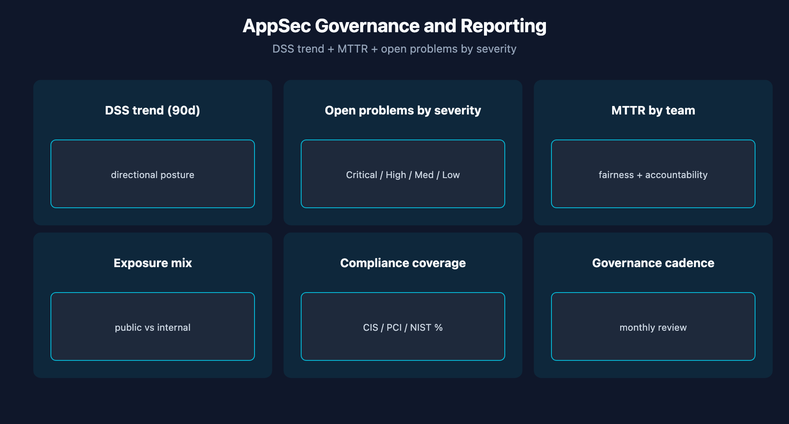

# APPSEC-10: Dashboards, Reporting and Governance

> **Series:** APPSEC — Application Security | **Notebook:** 10 of 10 | **Created:** June 2026 | **Last Updated:** 06/04/2026

## Overview

AppSec produces signal continuously — dashboards and governance turn that signal into decisions. This closing notebook covers the executive-facing dashboard composition, the cadence of the governance review, and the FinOps angle (AppSec ingest is DPS-billed, so dashboards should be cost-aware).

This is the final notebook in the series. The other nine cover the data sources; this one covers what to do with them at the leadership and program level.



<!-- MARKDOWN_TABLE_ALTERNATIVE
| View | Audience | Cadence |
|------|----------|---------|
| DSS trend | Exec / CISO | Quarterly |
| Severity mix | Security eng | Weekly |
| MTTR by team | Program lead | Monthly |
| Compliance % | Auditor / CISO | Quarterly |
-->

---

## Table of Contents

1. [1. The Dynatrace Security Score Trend](#dss-trend)
2. [2. Open Problems by Severity](#severity-mix)
3. [3. MTTR by Team](#mttr)
4. [4. Compliance Framework Coverage](#compliance-coverage)
5. [5. Governance Cadence](#cadence)
6. [6. DPS Cost Awareness](#dps-cost)
7. [7. Series Wrap](#series-wrap)
8. [References](#references)

---

## Prerequisites

| Requirement | Details |
|-------------|---------|
| **Dynatrace Environment** | Gen3 SaaS with Grail; AppSec entitlement enabled |
| **OneAgent** | Full-Stack mode (or code-module attached) on monitored hosts |
| **Read access** | At minimum `environment:roles:view-security-problems` and `storage:security.events:read` — see APPSEC-09 for the full model |
| **Background** | APPSEC-01 (fundamentals + three-pillar framing) |

<a id="dss-trend"></a>
## 1. The Dynatrace Security Score Trend

The single most important board-facing metric is the DSS trend over a 90-day window. Treat it as directional:

- **Trending down (worse)** = posture deteriorating. Investigate which signals moved.
- **Flat** = posture stable. Could mean no new risk, or could mean stalled remediation — pair with backlog burn-rate from APPSEC-08 to disambiguate.
- **Trending up (better)** = remediation is outpacing new findings.

Do **not** compare DSS across tenants or across business units (per APPSEC-01 § 4). Use within-tenant deltas only.

> <sub>**Sources:** [Application Security (DT docs)](https://docs.dynatrace.com/docs/secure/application-security) for the DSS framing. **Derived:** the trending-direction interpretation guide is community practice.</sub>

<a id="severity-mix"></a>
## 2. Open Problems by Severity

Companion view to DSS: how many problems are open right now, by severity bucket?

| Severity | Treatment |
|----------|-----------|
| Critical | Daily review; SLA 7 days |
| High | Weekly review; SLA 30 days |
| Medium | Sprint review; SLA 90 days |
| Low | Quarterly cleanup |

A healthy mix has Critical near zero, High in single digits, Medium and Low forming the long tail. A growing Critical count is the strongest early-warning signal.

```dql
// Open security problems by severity (event-stream proxy via security.events)
fetch security.events, from:-7d
| filter event.type == "VULNERABILITY_STATE_REPORT_EVENT"
| filter event.status == "OPEN"
| summarize count = count(), by:{vulnerability.risk.level}
| sort vulnerability.risk.level asc

```

> <sub>**Sources:** field names (`event.type`, `event.status`, `vulnerability.risk.level`) inferred from the AppSec events shape; verified for DQL syntax only. **Softened:** the SLA day counts (7/30/90) are common but should be set per your governance regime, not adopted blindly.</sub>

<a id="mttr"></a>
## 3. MTTR by Team

Mean Time To Remediate by team is the fairness metric. It tells you which teams are keeping up and which need help (engineering capacity, blocked dependencies, prioritization conflict).

For accountability dashboards, group by team or by namespace owner — not by individual developer. The latter creates the wrong incentives and surfaces noise.

> <sub>**Derived:** MTTR-by-team is borrowed from SRE / incident-management practice; the AppSec docs do not prescribe it directly. The *don't group by individual* guidance is community practice and a non-trivial governance design choice.</sub>

<a id="compliance-coverage"></a>
## 4. Compliance Framework Coverage

For organizations subject to specific compliance regimes (PCI, HIPAA, SOC 2, ISO 27001), the dashboard view that matters is *percent of controls in compliance* by framework, not total finding counts.

Pick the primary framework (one) for governance reporting. Use the others as secondary views. Cross-framework rollups are usually misleading because the same finding lands in multiple frameworks.

> <sub>**Sources:** [Application Security (DT docs)](https://docs.dynatrace.com/docs/secure/application-security) for SPM compliance framing. **Derived:** the *one primary framework* recommendation is community practice — verify against your audit regime.</sub>

<a id="cadence"></a>
## 5. Governance Cadence

A workable cadence for most organizations:

| Cadence | Audience | Content |
|---------|----------|---------|
| Daily | Security on-call | New Critical problems, attack-event spikes |
| Weekly | Security engineering | Open backlog by team, MTTR trend, burn-rate |
| Monthly | AppSec program lead + AppDev leadership | DSS trend, compliance coverage, IAM access review |
| Quarterly | CISO + exec staff | DSS 90-day trend, compliance posture by framework, capacity asks |

The artifacts above (DSS trend, severity mix, MTTR, compliance) feed all four cadences — what differs is the aggregation level and the audience-appropriate framing.

> <sub>**Derived:** the four-cadence model is common but not prescribed by Dynatrace docs. Adapt to your organization's existing security-governance rhythm.</sub>

<a id="dps-cost"></a>
## 6. DPS Cost Awareness

Application Security is DPS-billed — security.events ingest contributes to consumption. Three FinOps practices:

1. **Monitor security.events ingest volume monthly** alongside vulnerability volume. A spike in events with no spike in vulnerabilities suggests RAP detection rules generating false positives at scale.
2. **Sample RAP attack events selectively** if blocking-mode rollout is complete and steady-state attacks are noise. APPSEC-04's tuning loop applies here.
3. **Cross-reference FINOPS-01 / FINOPS-02** for the DPS capability-units and forecasting model — AppSec is one tenant-wide consumer.

Don't sacrifice security signal for cost savings without an explicit risk acceptance. But don't ignore cost either — it's a budget reality.

> <sub>**Sources:** cross-reference to FINOPS-01 and FINOPS-02 in the series. **Derived:** the three FinOps practices are community guidance — verify against your organization's DPS-management discipline.</sub>

<a id="series-wrap"></a>
## 7. Series Wrap

The series in one paragraph: AppSec in Gen3 SaaS is **three pillars** (RVA + RAP + SPM) over **one Grail data plane** (security.events + vulnerability-service), with **dual-surface IAM** (Grail + environment roles), consumed via **dashboards / workflows / Davis CoPilot**, and governed at the **monthly + quarterly** cadence with **DSS as the headline metric**. The OneAgent code module is the load-bearing dependency under all of it.

Where to go from here:
- Open APPSEC-01 again with the rest of the series fresh and confirm the mental map.
- Stand up the persona policies from APPSEC-09 before granting broad access.
- Wire one end-to-end workflow per APPSEC-08 to prove the loop closes.
- Set the governance cadence and the first DSS-trend review date.

<a id="references"></a>
## References

| Source | Coverage |
|--------|----------|
| [Application Security (DT docs)](https://docs.dynatrace.com/docs/secure/application-security) | DSS + posture framing |

---

> <sub>**⚠️ DISCLAIMER**: This information was AI generated and is provided "as-is" without warranty. It was produced as an independent, community-driven project and **not supported by Dynatrace**. Always refer to official [Dynatrace documentation](https://docs.dynatrace.com/docs) for the most current information.</sub>
