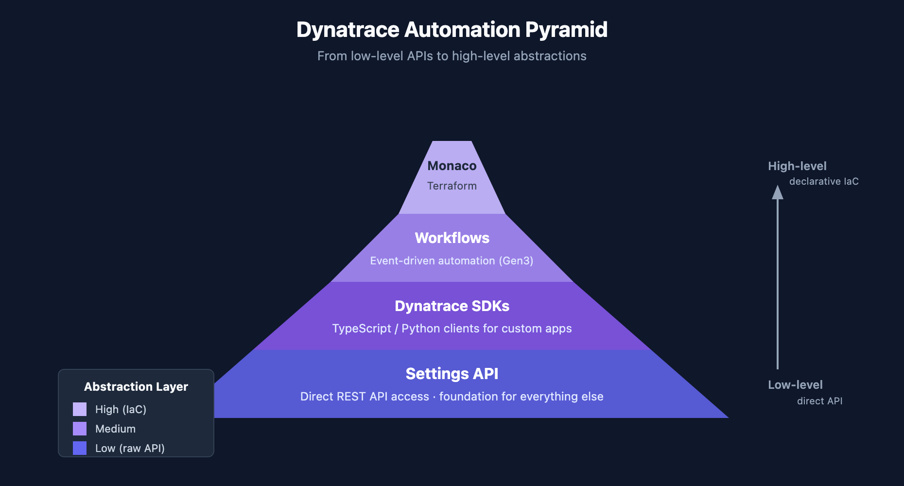
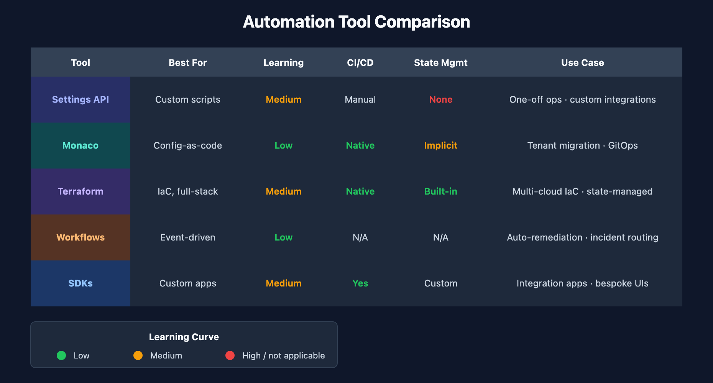
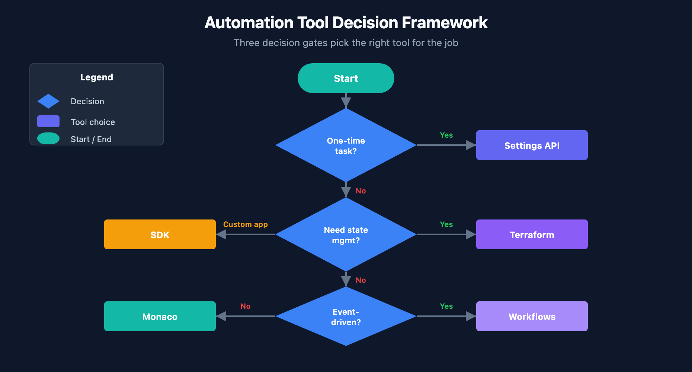

# AUTOM-01: Automation Landscape

> **Series:** AUTOM — Dynatrace Automation | **Notebook:** 1 of 9 | **Created:** January 2026 | **Last Updated:** 05/18/2026

Dynatrace provides multiple ways to automate configuration management and operational tasks. This series covers all major automation options, helping you choose the right approach for your needs.

---

## Table of Contents

1. [Introduction](#introduction)
2. [Automation Options Overview](#overview)
3. [Choosing the Right Tool](#choosing-the-right-tool)
4. [Decision Framework](#decision-framework)
5. [When a Terraform Shop Should Add Monaco](#terraform-shop)
6. [First-Time Setup Path — From Zero to GitOps Pipeline](#first-time-setup-path)
7. [Authentication & Token Reference](#api-token-scopes-reference)
8. [Emerging Capabilities](#emerging-capabilities)
9. [Next Steps](#next-steps)

---

## Prerequisites

Before starting this series, ensure you have:

| Requirement | Description |
|-------------|-------------|
| Dynatrace SaaS tenant | Active tenant with admin access |
| Authentication | Access token, platform token, or OAuth client (see [Authentication & Token Reference](#api-token-scopes-reference)) |
| Basic familiarity | Understanding of Dynatrace configuration concepts |

---

## Learning Objectives

By the end of this notebook, you will:

- Understand all available automation options for Dynatrace
- Know when to use each tool or approach
- Be able to choose the right automation strategy for your use case
- Have a framework for evaluating automation approaches

---

## 1. Introduction
### What This Series Covers

| Notebook | Focus |
|----------|-------|
| **AUTOM-01** (this notebook) | Automation landscape overview |
| **AUTOM-02** | Settings API - REST API for configuration |
| **AUTOM-03** | Monaco - Configuration-as-code CLI |
| **AUTOM-04** | Terraform Provider - Infrastructure-as-code |
| **AUTOM-05** | Dynatrace Workflows - Event-driven automation |
| **AUTOM-06** | Dynatrace SDKs - TypeScript and Python clients |
| **AUTOM-07** | CI/CD Integration - GitOps patterns |
| **AUTOM-08** | Migration Automation - Bulk configuration transfer |
| **AUTOM-09** | Terraform GitOps Setup Recipe - Repo layout, state backends, lifecycle protections, team onboarding |
| **AUTOM-95 LAB** | Terraform IAM Management - Hands-on: OAuth client setup, groups + policies + boundaries + bindings, DSL discovery, bulk export, import |
| **AUTOM-96 LAB** | GitHub Actions CI/CD for Dynatrace Terraform - Hands-on: OIDC → Vault → Platform Token, environment-gated apply |
| **AUTOM-97 LAB** | Monaco Configuration-as-Code - Hands-on: install, download, validate, deploy, multi-env, GitHub Actions |
| **AUTOM-98 LAB** | Terraform for Dynatrace - Hands-on: provider config, mixed-auth, Settings 2.0, IAM, import, state, drift |

### Why Automate?

| Benefit | Description |
|---------|-------------|
| **Consistency** | Same configuration across all environments |
| **Repeatability** | Deploy identical setups reliably |
| **Version Control** | Track changes in Git, enable rollbacks |
| **Scale** | Manage hundreds or thousands of configurations |
| **Speed** | Faster deployments, reduced manual effort |
| **Compliance** | Auditable changes, approval workflows |

---

## 2. Automation Options Overview

### The Automation Pyramid

Dynatrace automation tools form a hierarchy from low-level APIs to high-level abstractions:

<!-- MARKDOWN_TABLE_ALTERNATIVE
| Level | Tool | Abstraction |
|-------|------|-------------|
| High | Terraform | Infrastructure-as-Code |
| High | Monaco | Config-as-Code |
| Medium | Workflows | Event-driven automation |
| Medium | SDKs | Programmatic access |
| Low | Settings API | Direct REST calls |
-->

---

### Tool Comparison Matrix

| Tool | Best For | Learning Curve | CI/CD Ready | Multi-Tenant |
|------|----------|----------------|-------------|---------------|
| **Settings API** | Custom integrations, scripts | Medium | Manual | Yes |
| **Monaco** | Config-as-code, migrations | Low | Yes | Yes |
| **Terraform** | IaC environments, full stack | Medium | Yes | Yes |
| **Workflows** | Event-driven, auto-remediation | Low | N/A | No |
| **SDKs** | Custom apps, complex logic | Medium | Yes | Yes |

<!-- MARKDOWN_TABLE_ALTERNATIVE
| Tool | Best For | Learning Curve | CI/CD Ready | Multi-Tenant |
|------|----------|----------------|-------------|---------------|
| Settings API | Custom integrations, scripts | Medium | Manual | Yes |
| Monaco | Config-as-code, migrations | Low | Yes | Yes |
| Terraform | IaC environments, full stack | Medium | Yes | Yes |
| Workflows | Event-driven, auto-remediation | Low | N/A | No |
| SDKs | Custom apps, complex logic | Medium | Yes | Yes |
For environments where SVG doesn't render
-->

### Settings API

The foundation for all configuration automation. Direct REST API access to Dynatrace settings.

| Aspect | Details |
|--------|----------|
| **Type** | REST API |
| **Access** | HTTP calls with API token |
| **Schema** | JSON with schema validation |
| **Use Case** | Custom scripts, one-off operations |
| **Documentation** | [Settings API Reference](https://docs.dynatrace.com/docs/dynatrace-api/environment-api/settings) |

### Monaco

Dynatrace's official configuration-as-code CLI tool. YAML-based configuration management.

| Aspect | Details |
|--------|----------|
| **Type** | CLI tool |
| **Configuration** | YAML files |
| **Features** | Download, deploy, delete, validate |
| **Use Case** | Config management, migrations |
| **Documentation** | [Monaco on GitHub](https://github.com/dynatrace/dynatrace-configuration-as-code) |

### Terraform Provider

Official HashiCorp Terraform provider for Dynatrace. Infrastructure-as-code approach.

| Aspect | Details |
|--------|----------|
| **Type** | Terraform provider |
| **Configuration** | HCL (HashiCorp Configuration Language) |
| **Features** | Plan, apply, destroy, state management |
| **Use Case** | IaC pipelines, environment provisioning |
| **Documentation** | [Terraform Registry](https://registry.terraform.io/providers/dynatrace-oss/dynatrace/latest) |

### Dynatrace Workflows

Built-in automation engine for event-driven actions within Dynatrace.

| Aspect | Details |
|--------|----------|
| **Type** | Platform feature |
| **Configuration** | UI or YAML |
| **Features** | Triggers, actions, conditions, JavaScript |
| **Use Case** | Auto-remediation, notifications, integrations |
| **Documentation** | [Workflows Documentation](https://docs.dynatrace.com/docs/analyze-explore-automate/workflows) |

### Dynatrace SDKs

Official client libraries for programmatic access to Dynatrace APIs.

| Aspect | Details |
|--------|----------|
| **Type** | Client libraries |
| **Languages** | TypeScript/JavaScript, Python |
| **Features** | Type-safe, auto-generated from OpenAPI |
| **Use Case** | Custom applications, complex automation |
| **Documentation** | [Dynatrace SDK](https://developer.dynatrace.com/develop/sdks/) |

---

## 3. Choosing the Right Tool
### Use Case Mapping

| Use Case | Recommended Tool | Why |
|----------|------------------|-----|
| One-off configuration change | Settings API | No setup overhead — just a curl. Other tools require authoring + state |
| Repeatable deployments | Either Monaco **or** Terraform | Both are fully capable. Monaco: one manifest → N tenants with no per-env state — pick this when the lower setup cost matters. Terraform: directory-per-env or workspaces achieves the same outcome — pick this when you're already a Terraform shop, since adding Monaco is optional (see §5) |
| Full environment provisioning | Terraform | Cross-system orchestration — cloud (AWS/Azure/GCP) + Dynatrace + Git in one apply. Monaco is Dynatrace-only |
| Auto-remediation | Workflows | Built-in event triggers (problem detected → action). Settings API / SDK require building event subscription yourself |
| Custom application | SDK | Programmatic access — Monaco/Terraform are declarative-config tools, not application frameworks |
| Tenant migration | Monaco (target = another Dynatrace tenant) **or** `terraform-provider-dynatrace -export` (target = a local Terraform repo) | `monaco download` and the Terraform provider's `-export` both pull every config in one command. `terraform import` (the Terraform CLI feature, distinct from the provider's `-export`) is per-resource and requires authoring matching HCL first |
| GitOps pipeline | Monaco or Terraform | CI/CD integration |

### Team Skill Considerations

| Team Background | Best Fit |
|-----------------|----------|
| DevOps with Terraform experience | Terraform Provider (Monaco optional — see §5) |
| Developers comfortable with APIs | Settings API or SDK |
| SRE teams wanting GitOps | Monaco |
| Operations needing quick automation | Workflows |
| Mixed skill levels | Monaco (lowest barrier) |

---

### Feature Coverage Comparison

Not all tools support all Dynatrace features equally:

| Configuration Type | Settings API | Monaco | Terraform |
|--------------------|--------------|--------|-----------|
| Settings 2.0 objects | Full | Full | Full |
| Classic config (legacy) | N/A | Full | Full |
| Dashboards | Full | Full | Full |
| Synthetic monitors | Full | Full | Full |
| Alerting profiles | Full | Full | Full |
| Management zones | Full | Full | Full |
| Auto-tagging rules | Full | Full | Full |
| SLOs | Full | Full | Full |
| Workflows | Full | Partial | Partial |
| OpenPipeline | Full | Full | Full |

> **Note:** Monaco and Terraform use the Settings API under the hood. Feature parity depends on schema availability.

---

## 4. Decision Framework
Use this flowchart to choose the right automation approach:

<!-- MARKDOWN_TABLE_ALTERNATIVE
| Question | If Yes | If No |
|----------|--------|-------|
| Is this a one-time task? | Settings API | Continue... |
| Do you need state management? | Terraform | Monaco |
| Is it event-driven? | Workflows | Continue... |
| Building a custom app? | SDK | Monaco |
-->

---

### Combining Tools

These tools aren't mutually exclusive. Common combinations:

| Combination | Use Case |
|-------------|----------|
| Monaco + Workflows | Deploy configs with auto-remediation |
| Terraform + Monaco | Infra provisioning + config management |
| SDK + Settings API | Custom app with direct API fallback |
| Monaco + CI/CD | GitOps config deployments |

### Anti-Patterns to Avoid

| Anti-Pattern | Problem | Solution |
|--------------|---------|----------|
| Mixing Monaco and Terraform for same config | State conflicts | Choose one for each config type |
| Manual changes alongside automation | Configuration drift | Use automation exclusively |
| No version control | No rollback capability | Always use Git |
| Hardcoded secrets | Security risk | Use environment variables or vaults |

---

## 5. When a Terraform Shop Should Add Monaco

**Monaco is optional for Terraform shops.** A confident Terraform shop can cover the full Dynatrace surface — provisioning, configuration, drift detection, multi-env promotion — without ever adopting Monaco. The Terraform provider's built-in `-export` utility (see §3 "Tenant migration" row and the bulk-download workflow below) removes the historical reason teams reached for Monaco as a Terraform on-ramp.

This section names **five specific patterns** where *adding* Monaco alongside an established Terraform footprint can pay off. **None are blockers.** If none of these patterns describe your situation, skip this section and stay Terraform-only — that's a complete, supported path.

The general guidance in §4 (Combining Tools) still applies: pick one tool per config and avoid overlap. The patterns below name the seams where Monaco genuinely earns its place — not a recommendation to adopt Monaco by default.

### Five Patterns Where Monaco Wins for a Terraform Shop

| Pattern | Why Monaco wins |
|---|---|
| **Bulk download from an existing tenant** | When the *target* is Terraform, the Dynatrace Terraform provider's built-in [export utility](https://docs.dynatrace.com/docs/deliver/configuration-as-code/terraform/terraform-cli-commands) (`terraform-provider-dynatrace -export`) pulls every supported resource directly into ready-to-use HCL — no Monaco intermediate, no `terraform import` resource-by-resource authoring. When the *target* is Monaco, `monaco download` is the equivalent. For Terraform shops onboarding an inherited tenant, the provider's `-export` is the on-ramp — Monaco-as-intermediate adds a manual HCL-authoring step that the provider already does for you. |
| **N tenants, identical configs** | Monaco's `manifest.yaml` lists multiple environments and deploys to all with variable substitution — no per-environment state, no workspaces. For *"we have prod + EU-prod + APAC-prod and they should all look the same"*, Monaco is less ceremony. Terraform workspaces can do it, but each has its own state and the divergence-over-time tax is real. |
| **App-team self-service** | Letting product teams commit Dynatrace configs alongside their app code with a CI job running `monaco deploy` on merge — no state backend per team, no state-locking infrastructure. The platform team keeps Terraform-managed shared infra; app teams get a low-floor path for their own SLOs / dashboards / management zones. |
| **Bleeding-edge Settings 2.0 schemas** | When a new schema ships, Monaco supports it immediately (generic schema-id pattern). The Terraform provider catches up later. For configs that haven't reached the provider yet, Monaco is the fallback while you wait for typed resources. |
| **Drift inspection without ownership** | `monaco deploy --dry-run` shows drift on configs you didn't automate — without the implication that running `apply` would now manage them. Terraform's import-then-plan flow does more than needed for read-only drift checks on classic UI-managed configs. |

### What's NOT a Good Reason for a Terraform Shop

| Reason | Why it's weak |
|---|---|
| *"Monaco's YAML is nicer than HCL"* | Preference, not technical. For an existing shop, stick with what works. |
| *"Monaco doesn't need state"* | True, but you'll want some equivalent (Git history at minimum) for audit. The state-less property is a benefit only when state management is genuinely a barrier (the self-service pattern above). |
| *"Adding Monaco gives us redundancy / a backup"* | Two tools managing overlapping resources is the documented anti-pattern in §4 Combining Tools. The coordination cost dwarfs the perceived resilience. |
| *"We need Monaco to bootstrap a Terraform repo from an existing tenant"* | No — the Terraform provider's own `-export` does this directly. See the bulk-download workflow below. |

### The Practical Boundary

For an experienced Terraform shop adopting Monaco selectively, the rule is **boundary, not choice** — each config belongs to exactly one tool, and the line runs along these natural seams:

| Use Monaco for | Use Terraform for |
|---|---|
| Tenant cloning / bulk migration | Cross-cloud orchestration (AWS / Bitbucket / Dynatrace in one apply — see AUTOM-07 §5.4) |
| Per-app self-service configs | Platform-team shared infra |
| Bleeding-edge schemas | Anything with cross-system dependencies |
| Multi-tenant N×deploy of identical sets | State-backed, dependency-graphed infra |
| Drift inspection on UI-managed legacy configs | Configs you actively manage |

Document the boundary explicitly (in `DECISIONS.md` or your tenant runbook) so teams know which tool owns which config category — that's what prevents the anti-pattern of overlap.

### When You're Doing the Bulk Download

Two paths, picked by target:

**Target = Terraform repo (most common for a Terraform shop):**

1. `terraform-provider-dynatrace -export` — pulls every supported resource directly into HCL. Output lands in `DYNATRACE_TARGET_FOLDER` (defaults to `.configuration/`). Use `-flat` for a single directory; default is a module structure. Use `-list-exclusions` to see what's excluded by default (notably dashboards — opt in explicitly when you want them).
2. Review and clean up — the export produces `.flawed/` for deprecated configs and `.required_attention/` for items missing essentials (e.g., credential payloads the API can't return). Triage both.
3. Commit to Git as your *source-of-truth* baseline.
4. From here you're on the standard Terraform workflow — `terraform plan` shows drift vs the tenant; `terraform apply` reconciles. See AUTOM-04 + AUTOM-09 for the operational layer.

**Target = decision-not-yet-made (the "see what's there first" pattern):**

1. `monaco download --manifest manifest.yaml --environment <tenant>` — pulls every config to YAML. Human-readable; faster to skim than HCL.
2. Review the YAML to understand the tenant's footprint.
3. Decide:
   - **Stay on Monaco** if the configs are stable and the deploy cadence is low → Monaco's lower-ceremony loop wins.
   - **Switch to the Terraform provider's `-export`** if you're committing to Terraform → use the YAML as a checklist for what to expect in the HCL output.

**Don't use Monaco-download-as-Terraform-bootstrap.** Monaco's YAML and the Terraform provider's HCL don't share a converter (no Dynatrace-supplied tool, no community OSS bridge as of May 2026). Hand-authoring HCL from Monaco YAML loses to running `-export` directly.

> **Sources:**
> - [Dynatrace Terraform provider export utility (DT docs)](https://docs.dynatrace.com/docs/deliver/configuration-as-code/terraform/terraform-cli-commands) — *"./terraform-provider-dynatrace -export [options] [resourcename[=id]]"*; module-structure vs `-flat`; `.flawed` / `.required_attention` triage dirs; default exclusions.
> - [Monaco repo README (Dynatrace GitHub)](https://github.com/Dynatrace/dynatrace-configuration-as-code) — confirms Monaco and Terraform provider are separate tools; no built-in conversion. **Derived:** the "no community OSS bridge" claim is from GitHub searches (`monaco to terraform`, `dynatrace monaco convert/migration`) returning zero converter repos as of 2026-05-12.

---

## 6. First-Time Setup Path — From Zero to GitOps Pipeline

Once you've picked Monaco or Terraform (per §3-§5), here's the sequenced path from "no automation today" to "PR-driven plan-then-apply pipeline." Both paths assume the tenant already has manually-created configuration that you want to bring into source control.

### Path A — Terraform target (most common for shops with existing IaC)

> **Monaco does not appear in this path.** A Terraform-only setup is complete and supported end-to-end. If you later hit one of the patterns in §5, you can selectively add Monaco alongside — but the loop below stands on its own.

1. **Install the Terraform CLI** — see **AUTOM-04 §2 Getting Started** for OS-specific install commands.
2. **Configure the Dynatrace provider** — see **AUTOM-04 §3 Provider Configuration**. Set `DYNATRACE_ENV_URL` + a Platform Token (`dt0s16`) as the primary credential; optionally set a classic API Token (`dt0c01`) for resources outside Platform-Token coverage (synthetic monitors, network monitors, SLOs — the v1.88.0 exclusion list).
3. **Bulk-export the tenant's existing config to HCL** — run `terraform-provider-dynatrace -export` (the provider's built-in export utility — **NOT** `terraform import`, which is per-resource). Output lands in `.configuration/`; triage `.flawed/` (deprecated configs) and `.required_attention/` (sensitive fields the API can't return) before committing. See **AUTOM-04 §8 Next Steps** for invocation details and **AUTOM-01 §5 bulk-download workflow** for the full triage flow.
4. **Stand up the repo layout** — choose single-repo (`modules/` + `envs/`) or two-repo (modules separate from consumer). See **AUTOM-09 §2 Opinionated Repo Layout**.
5. **Configure the state backend** — S3+DynamoDB, GCS, Azure Storage, or HCP Terraform. See **AUTOM-09 §3 State Backend Setup** for `backend.tf` examples per backend.
6. **Lock down version constraints** — `required_providers` + `~>` constraint discipline. See **AUTOM-09 §4 Provider Configuration and Version Discipline**.
7. **Modularize repeated patterns** — start with one module per resource family (management-zone, alerting-profile, slo). See **AUTOM-09 §5 Module Strategy**.
8. **Establish multi-environment promotion** — directory-per-env with shared modules + per-env tfvars. See **AUTOM-09 §6 Multi-Environment Promotion**.
9. **Wire up CI/CD** — pick your platform and follow its recipe: **AUTOM-07 §3 GitHub Actions** · **§4 GitLab CI/CD** · **§5 Bitbucket Pipelines** · **§6 Atlassian Bamboo** · **§7 Azure DevOps Pipelines**. Each section covers plan-on-PR + manual-gated apply + plan-artifact reuse.
10. **Add lifecycle protections + secrets discipline + onboarding** before the first real prod apply. See **AUTOM-09 §8 Secrets Handling** · **§9 Lifecycle Protections** · **§10 Onboarding New App Teams** · **§12 Operational Realities** (stuck state lock, break-glass, DR).

### Path B — Monaco target (config-only, single-tool simplicity)

1. **Install Monaco** — see **AUTOM-03 §2 Getting Started**. Homebrew on macOS; `curl` the binary on Linux/Windows.
2. **Set environment variables** — tenant URL + API Token. See **AUTOM-03 §2 Environment Setup**.
3. **Bulk-download the tenant's existing config to YAML** — `monaco download --manifest manifest.yaml --environment <tenant>`. See **AUTOM-08 Migration Automation** for the full migration flow.
4. **Review and clean up** — Monaco's YAML is human-readable; delete noise, parameterize sensitive values, split into logical projects. See **AUTOM-03 §3 Project Structure**.
5. **Author your `manifest.yaml`** — list every environment Monaco should deploy to. Per-env values via `parameters` block. See **AUTOM-03 §4 Configuration Files**.
6. **Commit to Git as your source-of-truth baseline.**
7. **Wire up CI/CD** — pick your platform and use the **Monaco-deploy pattern** from: **AUTOM-07 §3 GitHub Actions** · **§4 GitLab CI/CD** · **§5.1 Bitbucket Pipelines — Monaco Deploy** · **§6 Atlassian Bamboo** (adapt the Plan Specs YAML to call `monaco deploy` instead of `terraform plan/apply`).
8. **Add review + approval discipline** — Monaco doesn't have state-file locking, but pipeline-level approval gates work the same way. PR triggers `monaco validate` + `monaco deploy --dry-run`; merge to main triggers `monaco deploy` (gated by manual approval for production).
9. **Plan for tool evolution** — if your needs grow beyond Dynatrace-config-only, **AUTOM-01 §5** documents the patterns where adding Terraform alongside Monaco makes sense.

### Common pitfalls (both paths)

| Pitfall | Why it bites | Fix |
|---|---|---|
| Pushing a token in `terraform.tfvars` to Git | Source-control leak of long-lived credentials | Use `*.tfvars` in `.gitignore`; pass tokens via env vars or CI/CD secret store |
| First `apply` without `prevent_destroy` on critical resources | One bad PR can delete production management zones / IAM policies | Add `lifecycle { prevent_destroy = true }` on prod resources before the first prod apply. See **AUTOM-09 §9** |
| Skipping the `.required_attention/` triage after `-export` | Apply fails on missing credential payloads | Open the `.required_attention/` directory; fill in stub values; re-run validate; only then commit |
| One state file across all environments | dev apply can corrupt prod state | Per-env state file from day 1. See **AUTOM-09 §3** + **§6** |
| Apply runs without artifact reuse from the reviewed plan | The plan reviewers saw isn't what gets applied | Use the plan-artifact pattern: plan publishes `tfplan` → apply subscribes to it. See **AUTOM-07 §3-§7** for platform-specific syntax |

---

## 7. Authentication & Token Reference

Dynatrace supports three types of credentials for automation tools. Which you need depends on the tool and the resources you manage.

### Token Types

| Token Type | Description | Use Case |
|------------|-------------|----------|
| **Access Token (Classic)** | Scope-based token with explicit permissions (e.g., `settings.read`) | Settings API, Monaco, Terraform (settings/classic) |
| **Platform Token** | Long-lived token bound to a user's permissions; simpler to create | Same as access token, but scopes are limited to user's existing permissions |
| **OAuth Client** | Client ID + secret exchanged for short-lived tokens | **Required** for Terraform automation, document, and IAM resources |

### Tool Authentication Matrix

| Tool | Access/Platform Token | OAuth Client | Notes |
|------|----------------------|--------------|-------|
| **Settings API** | `settings.read`, `settings.write` | N/A | Direct REST calls |
| **Monaco** | `settings.read`, `settings.write`, `ReadConfig`, `WriteConfig` | N/A | CLI tool |
| **Terraform** (settings/classic) | `settings.read`, `settings.write`, `ReadConfig`, `WriteConfig` | N/A | IaC for config objects |
| **Terraform** (automation/documents) | N/A | `automation:workflows:read/write`, `document:documents:read/write` | OAuth **required** |
| **Terraform** (account management) | N/A | IAM scopes + `DT_ACCOUNT_ID` | OAuth **required** |
| **Workflows** | Built-in (no external token needed) | N/A | Platform feature |
| **SDKs** | Depends on operations performed | N/A | Client libraries |

### Token Best Practices

| Practice | Description |
|----------|-------------|
| Least privilege | Only grant required scopes |
| Environment-specific | Separate tokens per environment |
| Rotation | Rotate tokens regularly |
| Secret storage | Use HashiCorp Vault, AWS Secrets Manager, etc. |
| Platform tokens | Prefer over classic access tokens for simpler management |
| OAuth for automation | Use OAuth clients when managing Workflows or Documents via Terraform |

> **Key Distinction:** Platform tokens work within the user's existing permissions (a scope only grants access if the user already has that permission). OAuth clients operate with their own independent scopes, making them more suitable for service accounts and CI/CD pipelines.

---

## 8. Emerging Capabilities

### Dynatrace Intelligence Agents

Announced at Perform 2026, **Dynatrace Intelligence** is an agentic operations system that fuses deterministic and agentic AI. Intelligence Agents transform insights into autonomous outcomes across IT and business operations.

| Aspect | Details |
|--------|----------|
| **Type** | Agentic AI layer built into the platform |
| **Capabilities** | Autonomous SRE, security, and development agents |
| **Integration** | Works through Dynatrace Workflows for agentic workflows |
| **Governance** | Built-in guardrails for supervised or autonomous operation |
| **Use Case** | Auto-prevention, auto-remediation, auto-optimization |

> **Note:** Dynatrace Intelligence Agents represent a shift from rule-based automation (Workflows, Monaco, Terraform) to AI-driven autonomous operations. They complement existing tools rather than replacing them.

### Dynatrace MCP Server

The [Dynatrace MCP Server](https://docs.dynatrace.com/docs/dynatrace-intelligence/dynatrace-intelligence-integrations/dynatrace-mcp) implements the Model Context Protocol (MCP), enabling AI assistants (Claude, GitHub Copilot, Amazon Q) to interact with Dynatrace using natural language.

| Aspect | Details |
|--------|----------|
| **Type** | Open-source MCP server |
| **Access** | AI assistants can query problems, metrics, traces, logs, topology |
| **Use Case** | AI-assisted development, triage, incident management |
| **Documentation** | [MCP Server Documentation](https://docs.dynatrace.com/docs/dynatrace-intelligence/dynatrace-intelligence-integrations/dynatrace-mcp) |

### How Emerging Capabilities Fit

| Automation Maturity | Approach |
|---------------------|----------|
| **Manual** | Settings API, one-off scripts |
| **Automated** | Monaco, Terraform, CI/CD pipelines |
| **Supervised** | Workflows with human approval gates |
| **Autonomous** | Intelligence Agents with guardrails |
| **AI-Assisted** | MCP Server for developer and SRE tooling |

---

## 9. Next Steps

### Learning Path by Goal

| Your Goal | Recommended Path |
|-----------|------------------|
| Quick script automation | AUTOM-02 (Settings API) |
| GitOps config management | AUTOM-03 (Monaco) → AUTOM-07 (CI/CD) |
| Full IaC environment | AUTOM-04 (Terraform) → AUTOM-07 (CI/CD) |
| Auto-remediation | AUTOM-05 (Workflows) |
| Custom application | AUTOM-06 (SDKs) |
| Tenant migration | AUTOM-08 (Migration) |

### Continue the Series

| Next Notebook | Focus |
|---------------|-------|
| **AUTOM-02: Settings API** | Deep dive into REST API configuration |

### Additional Resources

- [Dynatrace API Documentation](https://docs.dynatrace.com/docs/dynatrace-api)
- [Monaco GitHub Repository](https://github.com/dynatrace/dynatrace-configuration-as-code)
- [Terraform Provider Documentation](https://registry.terraform.io/providers/dynatrace-oss/dynatrace/latest/docs)
- [Dynatrace Developer Portal](https://developer.dynatrace.com/)

---

## Summary

In this notebook, you learned:

- The automation options available for Dynatrace configuration
- When to use Settings API, Monaco, Terraform, Workflows, or SDKs
- How to choose the right tool based on your use case and team skills
- Best practices for combining automation tools

> **Key Takeaway:** Choose the automation tool that matches your team's skills and your operational model. Monaco is the best starting point for most teams due to its low barrier to entry and GitOps compatibility.

---

*Continue to **AUTOM-02: Settings API** to learn direct REST API configuration.*

---

*This notebook was AI-generated from community-submitted and publicly available sources. This notebook series is not officially supported by Dynatrace. Always verify information against official Dynatrace documentation.*
