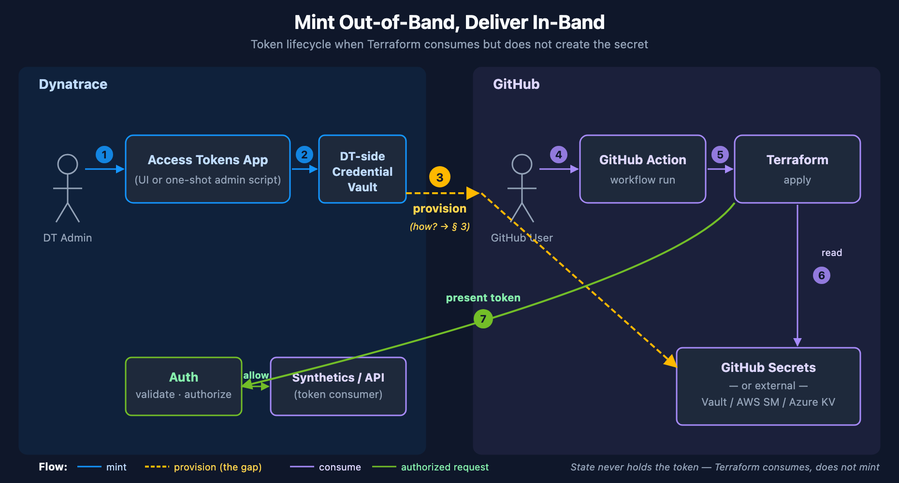
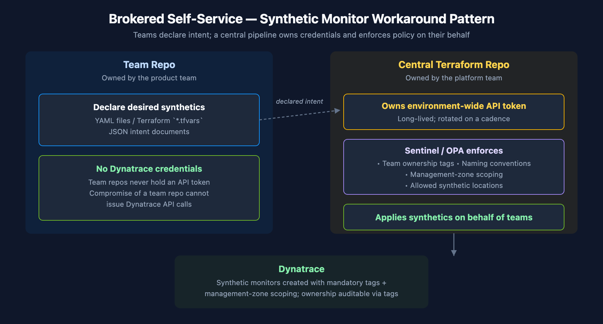

# AUTOM-04: Terraform Provider

> **Series:** AUTOM — Dynatrace Automation | **Notebook:** 4 of 9 | **Created:** January 2026 | **Last Updated:** 05/18/2026

The Dynatrace Terraform provider enables infrastructure-as-code management of Dynatrace configurations. It integrates with Terraform's ecosystem for state management, planning, and CI/CD integration.

---

## Table of Contents

1. [Introduction](#introduction)
2. [Getting Started](#getting-started)
3. [Provider Configuration](#provider-configuration)
4. [Resource Types](#resource-types)
5. [State Management](#state-management)
6. [Advanced Patterns](#advanced-patterns)
7. [Governance Architecture](#governance-architecture)

---

## Prerequisites

Before starting this notebook, ensure you have:

| Requirement | Description |
|-------------|-------------|
| Terraform CLI | Version 1.0+ installed |
| Authentication | One or more of: **API Token** (classic), **Platform Token**, or **OAuth Client** (see [Provider Configuration](#provider-configuration)) |
| Tenant URL | Your Dynatrace SaaS tenant URL |
| HCL Knowledge | Basic familiarity with Terraform syntax |

### Authentication Methods — Three Token Types

The Dynatrace Terraform provider supports three authentication methods. Each covers a different set of resources:

| Token Type | Format | Covers | Cannot Cover |
|------------|--------|--------|-------------|
| **API Token** (classic) | `dt0c01.xxxx` | Settings 2.0, Synthetics, SLOs | Gen3 Platform (workflows, documents, segments) |
| **Platform Token** | `dt0s16.xxxx` | Settings 2.0 + Gen3 Platform | Synthetics, SLOs (removed in v1.88.0) |
| **OAuth Client** | Client ID + Secret | Gen3 Platform, IAM, Settings 2.0 (`HTTP_OAUTH_PREFERENCE`) | Synthetics (v1.88.0+) |

> **Important (v1.88.0):** As of Dynatrace Terraform provider **v1.88.0**, OAuth-based authentication (including Platform Tokens acting as OAuth) **can no longer manage synthetic monitors or SLO definitions**. These resources require a classic **API Token** with the appropriate scopes. When both tokens are configured, the provider automatically uses the correct one for each resource.

> **Recommended setup:** Use **Platform Token + API Token** together for full resource coverage. The Platform Token handles Settings 2.0 and Gen3 resources; the API Token handles Synthetics and SLOs.

---

**Preference order (current Dynatrace guidance):**

1. **Platform Token** — recommended default for most integrations. Pair with `DYNATRACE_HTTP_OAUTH_PREFERENCE=true` to authenticate to Gen3 Platform resources. Any user can create one (no admin required); long-lived; inherits the creating user's privileges.
2. **Classic API Token** — legacy; being phased out. Use only for surfaces Platform Token does not yet cover (synthetic monitors primarily).
3. **OAuth Client** — specialized. Use for external-system integrations and account-level IAM automation (policies, groups, service users). Requires account admin to create.

## Learning Objectives

By the end of this notebook, you will:

- Understand the Dynatrace Terraform provider
- Know how to configure resources in HCL
- Be able to manage state and handle drift
- Implement multi-environment deployments

---

<a id="introduction"></a>
## 1. Introduction
### Why Terraform?

| Benefit | Description |
|---------|-------------|
| **State Management** | Track what exists vs. what's defined |
| **Drift Detection** | Identify manual changes |
| **Planning** | Preview changes before applying |
| **Ecosystem** | Integrate with other Terraform providers |
| **Modules** | Reusable configuration packages |

### Terraform vs Monaco

| Aspect | Terraform | Monaco |
|--------|-----------|--------|
| State file | Required | None |
| Drift detection | Built-in | Manual |
| Learning curve | Higher | Lower |
| Multi-cloud | Yes | Dynatrace only |
| Dependencies | Explicit | Implicit |

---

<a id="getting-started"></a>
## 2. Getting Started
### Installation

**Install Terraform:**

macOS:
```bash
brew tap hashicorp/tap
brew install hashicorp/tap/terraform
```

Linux:
```bash
wget -O- https://apt.releases.hashicorp.com/gpg | sudo gpg --dearmor -o /usr/share/keyrings/hashicorp-archive-keyring.gpg
echo "deb [signed-by=/usr/share/keyrings/hashicorp-archive-keyring.gpg] https://apt.releases.hashicorp.com $(lsb_release -cs) main" | sudo tee /etc/apt/sources.list.d/hashicorp.list
sudo apt update && sudo apt install terraform
```

**Verify installation:**
```bash
terraform version
```

---

<a id="provider-configuration"></a>
## 3. Provider Configuration

The Dynatrace Terraform provider supports three authentication methods. Which you need depends on the resources you manage.

### Method 1: API Token (Classic)

Use for **Settings 2.0** resources and resources that require classic API token auth (synthetic monitors, SLOs, legacy config APIs).

```hcl
terraform {
  required_providers {
    dynatrace = {
      source  = "dynatrace-oss/dynatrace"
      version = "~> 1.93"        # Current: v1.93.0 (March 2026)
    }
  }
}

provider "dynatrace" {
  dt_env_url   = var.dynatrace_url
  dt_api_token = var.dynatrace_token  # Classic API token (dt0c01.xxxx)
}
```

> **Important:** Synthetic monitors and SLO definitions require a classic API Token (`dt0c01.*`). OAuth/Platform Token authentication does not support these resource types as of provider v1.88.0.

#### API Token Scopes — Full Access Reference

To manage **all** resources that require API Token authentication, create a token with the following scopes:

| Scope | Purpose |
|-------|---------|
| `settings.read` | Read Settings 2.0 objects |
| `settings.write` | Create/update Settings 2.0 objects |
| `ReadConfig` | Read legacy configuration API |
| `WriteConfig` | Write legacy configuration API |
| `CaptureRequestData` | Request attributes and data privacy |
| `ExternalSyntheticIntegration` | Synthetic monitors (v1 API) |
| `activeGateTokenManagement.create` | Create ActiveGate tokens |
| `activeGateTokenManagement.read` | Read ActiveGate tokens |
| `activeGateTokenManagement.write` | Update/revoke ActiveGate tokens |
| `apiTokens.read` | Read API tokens |
| `apiTokens.write` | Create/update API tokens |
| `attacks.read` | Read Application Security attacks |
| `attacks.write` | Write Application Security attacks |
| `credentialVault.read` | Read credential vault entries |
| `credentialVault.write` | Create/update credential vault entries |
| `entities.read` | Read monitored entities |
| `extensions.write` | Upload Extensions 2.0 |
| `extensionEnvironment.read` | Read extension environment config |
| `extensionEnvironment.write` | Write extension environment config |
| `networkZones.read` | Read network zones |
| `networkZones.write` | Create/update network zones |
| `securityProblems.read` | Read security problems |
| `securityProblems.write` | Update security problems |
| `slo.read` | Read SLO definitions |
| `slo.write` | Create/update SLO definitions |

> **Principle of least privilege:** For production, grant only the scopes your pipeline actually needs. The table above represents the **full-access superset** as documented in the [Terraform Registry](https://registry.terraform.io/providers/dynatrace-oss/dynatrace/latest/docs). A pipeline managing only Settings 2.0 resources needs only `settings.read` + `settings.write`.

### Method 2: Platform Token

**Platform Tokens** (`dt0s16.xxxx`) are a newer token type that bridges Settings 2.0 and Gen3 Platform in a single credential. They work within the assigned user's permissions.

```hcl
provider "dynatrace" {
  # Platform Token handles Settings 2.0 + Gen3 Platform resources
  # Set via DYNATRACE_ENV_URL and DYNATRACE_PLATFORM_TOKEN env vars
}
```

**Key env var:** `DYNATRACE_HTTP_OAUTH_PREFERENCE=true` tells the provider to use the Platform Token for OAuth-based resources (workflows, documents, segments) in addition to Settings 2.0.

> **How `DYNATRACE_HTTP_OAUTH_PREFERENCE` works:** When set to `true` and OAuth/Platform Token credentials are provided, the provider **prefers REST endpoints that support OAuth** over API Token endpoints. When not set (or `false`), the provider defaults to API Token authentication. Not all resources support OAuth — for example, `dynatrace_json_dashboard` can only be configured using API Tokens regardless of this setting.

> **Owner-empty failure mode (combined auth):** When both API Token and OAuth/Platform Token are configured but `DYNATRACE_HTTP_OAUTH_PREFERENCE=true` is **not** set, the provider routes through API Token endpoints and Dynatrace records the resulting Settings 2.0 objects with an **empty owner field**. The provider docs flag this verbatim across 18+ resource pages ([`generic_setting` (Dynatrace GitHub)](https://github.com/dynatrace-oss/terraform-provider-dynatrace/blob/main/docs/resources/generic_setting.md), [`aws_connection`](https://github.com/dynatrace-oss/terraform-provider-dynatrace/blob/main/docs/resources/aws_connection.md), [`github_connection`](https://github.com/dynatrace-oss/terraform-provider-dynatrace/blob/main/docs/resources/github_connection.md), and others): *"If a resource is created using an API token or without setting `DYNATRACE_HTTP_OAUTH_PREFERENCE=true` (when both are used), the settings object's owner will remain empty."* Owner-empty settings are harder to audit, can't be filtered by owner in IAM policies, and lose creator attribution in the UI. For any combined-auth pipeline, set `DYNATRACE_HTTP_OAUTH_PREFERENCE=true` even if your immediate use case doesn't seem to need it.

> **Settings object ownership:** When a settings object is created using Platform Token or OAuth credentials, the owner is set to the credential owner. By default, the object is **private** — only the owner can read/modify it. Use the `dynatrace_settings_permissions` resource to manage access modifiers.

### Method 3: OAuth Client Credentials

**Required** for Automation (Workflows), Document, and Account Management (IAM) resources. The provider exchanges your client ID and secret for short-lived OAuth access tokens automatically.

> **IAM is OAuth-only by construction.** Unlike Workflows and Documents (which support Platform Token via `DYNATRACE_HTTP_OAUTH_PREFERENCE=true`), the IAM Account Management API rejects Platform Tokens and classic API tokens — the [`dynatrace_iam_group` resource (Dynatrace provider docs)](https://registry.terraform.io/providers/dynatrace-oss/dynatrace/latest/docs/resources/iam_group) explicitly requires *"the environment variables `DT_CLIENT_ID`, `DT_CLIENT_SECRET`, `DT_ACCOUNT_ID` with an OAuth client."* The minimum-viable OAuth client for IAM needs four scopes: `account-idm-read`, `account-idm-write`, `iam-policies-management`, `account-env-read`. For the full IAM lifecycle (groups + policies + boundaries + bindings + bulk export + DSL discovery), see **AUTOM-95 LAB: Terraform IAM Management**.

```hcl
provider "dynatrace" {
  dt_env_url   = var.dynatrace_url
  dt_api_token = var.dynatrace_token  # For settings/classic resources

  # OAuth credentials — required for automation, document, and IAM resources
  client_id     = var.oauth_client_id        # Falls back for both automation + IAM
  client_secret = var.oauth_client_secret
  account_id    = var.account_id             # Required for IAM resources
}
```

> **Tip:** If you only manage automation/document resources, you can omit `dt_api_token` and use OAuth alone.

### Method 4: Combined Auth — Full Coverage (Recommended)

For **full resource coverage**, use **Platform Token + API Token** together. The provider automatically uses the correct token for each resource type:

```hcl
# provider.tf — Combined auth for full coverage
provider "dynatrace" {
  # Auth is read from environment variables automatically.
  # The provider uses the correct token for each resource type.
}
```

```bash
# --- Platform Token (covers Settings 2.0 + Gen3 Platform) ---
export DYNATRACE_ENV_URL="https://abc12345.live.dynatrace.com"
export DYNATRACE_PLATFORM_TOKEN="dt0s16.xxxx.yyyy"
export DYNATRACE_HTTP_OAUTH_PREFERENCE=true

# --- API Token (covers Synthetics — v1.88.0 requirement) ---
export DYNATRACE_API_TOKEN="dt0c01.xxxx.yyyy"
```

| Resource | Token Used |
|----------|------------|
| Settings 2.0 (auto-tags, management zones, alerting) | Platform Token |
| Gen3 Platform (workflows, documents, segments) | Platform Token (via OAuth) |
| SLO definitions (`dynatrace_slo_v2`) | Platform Token (Settings 2.0 — `builtin:monitoring.slo`) |
| Synthetic monitors (`dynatrace_http_monitor`) | **API Token** (v1.88.0) |

### Environment Variables — Complete Reference

| Variable | Purpose |
|----------|---------|
| `DYNATRACE_ENV_URL` / `DT_ENV_URL` / `DT_ENVIRONMENT_URL` | Tenant URL |
| `DYNATRACE_API_TOKEN` / `DT_API_TOKEN` | Classic API token (`dt0c01`) |
| `DYNATRACE_PLATFORM_TOKEN` / `DT_PLATFORM_TOKEN` | Platform token (`dt0s16`) |
| `DYNATRACE_HTTP_OAUTH_PREFERENCE` | Set to `true` to prefer OAuth endpoints for Platform Token / OAuth resources |
| `DT_CLIENT_ID` / `DYNATRACE_CLIENT_ID` | OAuth client ID (for automation/document/IAM resources) |
| `DT_CLIENT_SECRET` / `DYNATRACE_CLIENT_SECRET` | OAuth client secret |
| `DT_ACCOUNT_ID` / `DYNATRACE_ACCOUNT_ID` | Account UUID (required for account-level IAM resources) |

### Which Authentication for Which Resources?

| Resource Category | API Token | Platform Token | OAuth Client |
|-------------------|-----------|----------------|-------------|
| Settings 2.0 (management zones, auto-tags, alerting, SLOs) | Yes | Yes | Yes (`HTTP_OAUTH_PREFERENCE`) |
| Synthetic monitors | **Yes (required)** | No (v1.88.0) | No (v1.88.0) |
| Gen3: Workflows, scheduling | No | Yes (with `HTTP_OAUTH_PREFERENCE`) | **Yes** |
| Gen3: Documents (dashboards, notebooks) | No | Yes (with `HTTP_OAUTH_PREFERENCE`) | **Yes** |
| Gen3: Segments | No | Yes (with `HTTP_OAUTH_PREFERENCE`) | **Yes** |
| Account Management (IAM, policies, groups) | No | No | **Yes** (`DT_ACCOUNT_ID` also needed) |
| Legacy dashboards (`dynatrace_json_dashboard`) | **Yes (only)** | No | No |

### Creating an OAuth Client

1. Go to **Account Management** > **Identity & Access Management** > **OAuth clients**
2. Create a new client with the required scopes (see table below)
3. Copy the generated **client ID** and **client secret** immediately — the secret is only shown once
4. Store credentials securely (vault, CI/CD secrets, etc.)
5. Ensure the **service user's groups** grant the same scopes as the OAuth client for all target environments

#### OAuth Client Scopes — Full Access Reference

To manage **all** resources that require OAuth authentication, create an OAuth client with the following scopes:

| Scope | Purpose |
|-------|---------|
| **Settings** | |
| `settings:objects:read` | Read settings objects |
| `settings:objects:write` | Create/update settings objects |
| `settings:objects:admin` | Admin — manage all settings objects |
| **Automation** | |
| `automation:workflows:read` | Read workflow definitions |
| `automation:workflows:write` | Create/update workflows |
| `automation:workflows:admin` | Admin — manage all workflows |
| `automation:calendars:read` | Read scheduling calendars |
| `automation:calendars:write` | Create/update scheduling calendars |
| `automation:rules:read` | Read scheduling rules |
| `automation:rules:write` | Create/update scheduling rules |
| **Documents** | |
| `document:documents:read` | Read documents (dashboards, notebooks) |
| `document:documents:write` | Create/update documents |
| `document:documents:delete` | Delete documents |
| `document:trash.documents:delete` | Permanently delete trashed documents |
| `document:direct-shares:read` | Read document shares |
| `document:direct-shares:write` | Create/update document shares |
| `document:direct-shares:delete` | Delete document shares |
| **OpenPipeline** | |
| `openpipeline:configurations:read` | Read OpenPipeline configurations |
| `openpipeline:configurations:write` | Create/update OpenPipeline configs |
| **SLO** | |
| `slo:slos:read` | Read SLO definitions |
| `slo:slos:write` | Create/update SLO definitions |
| `slo:objective-templates:read` | Read SLO objective templates |
| **Storage** | |
| `storage:bizevents:read` | Read business events |
| `storage:bucket-definitions:read` | Read Grail bucket definitions |
| `storage:bucket-definitions:write` | Create/update Grail bucket definitions |
| `storage:filter-segments:read` | Read segments |
| `storage:filter-segments:write` | Create/update segments |
| `storage:filter-segments:share` | Share segments |
| `storage:filter-segments:delete` | Delete segments |
| `storage:filter-segments:admin` | Admin — manage all segments |
| **Account Management (IAM)** | |
| `account-idm-read` | Read IAM users, groups, service users |
| `account-idm-write` | Create/update IAM users, groups, service users |
| `iam-policies-management` | Create/update/delete IAM policies |
| `account-env-read` | Read account environment metadata |

> **Principle of least privilege:** The table above is the **full-access superset** from the [Terraform Registry](https://registry.terraform.io/providers/dynatrace-oss/dynatrace/latest/docs). For production, grant only the scopes your pipeline requires. A pipeline managing only workflows needs `automation:workflows:read` + `automation:workflows:write`.

> **Security:** Never commit OAuth client secrets or API tokens to version control. Use environment variables, HashiCorp Vault, AWS Secrets Manager, or your CI/CD platform's secret store.

> **Note on scope formats:** API token scopes use dot notation (`settings.read`, `settings.write`). OAuth scopes and IAM policy actions use colon notation (`settings:objects:read`, `settings:objects:write`). These are different identifiers for the same capability in different auth contexts.

<a id="service-user-credentials"></a>
### Service User Credentials for Terraform — Platform Token vs Classic API Token

A common enterprise pattern: run Terraform as a **Service User** so the automation is not tied to any individual human. Two questions follow:

1. Which token type does the Service User hold — Platform Token, classic API Token, or both?
2. What permissions need to align for it to work?

#### The three-things-align model (Platform Token on a Service User)

When a Platform Token is created **on behalf of** a Service User, three independent things must line up — granting just one is the common mistake:

| # | What | Who grants it | Why it's needed |
|---|------|---------------|-----------------|
| 1 | **Service User's IAM permissions** | Account admin (group/policy) | The bearer can only do what the assigned user is permitted to do. |
| 2 | **Creator's `iam:service-users:use`** (optionally `iam:service-user-email`) | Account admin | The human creating the token must be allowed to mint one *on behalf of* that service user. |
| 3 | **Token scope selection at creation time** | Token creator | Effective permission = token scopes ∩ assigned user's IAM permissions. Missing the right scope at creation produces silent permission denials. |

Verbatim from the [Platform Tokens docs (DT docs)](https://docs.dynatrace.com/docs/manage/identity-access-management/access-tokens-and-oauth-clients/platform-tokens): *"A platform token will only work within the limits of the assigned user's permissions. This means that a selected scope is only granting access if that user has the respective permissions."*

#### Decision: Which token does the Service User need for your Terraform resources?

Map your resource mix to the token type the Service User should hold:

| Resource the Service User manages | Service User token to issue | Why |
|-----------------------------------|------------------------------|-----|
| Settings 2.0 (management zones, auto-tags, alerting, SLO v2) | Platform Token (`dt0s16`) | Platform Token service catalog includes `settings`. |
| Gen3 Platform (workflows, documents, segments, OpenPipeline) | Platform Token (`dt0s16`) with `DYNATRACE_HTTP_OAUTH_PREFERENCE=true` | Platform Token service catalog includes `automation`, `document`, `storage`. |
| Synthetic monitors, SLO v1, legacy config APIs | Classic API Token (`dt0c01`) | Provider v1.88.0+ requires classic API Token for these resources. |
| **Access Tokens (the `dynatrace_api_token` resource itself)** | **Classic API Token (`dt0c01`) — see disclaimer below** | Documented requirement: `apiTokens.read` + `apiTokens.write` scopes, which are classic-API-Token scopes. |
| Account Management / IAM (policies, groups, service users) | OAuth Client + `DT_ACCOUNT_ID` | IAM resources are account-level; Platform Token cannot manage them. |

#### Special case — Terraform minting Access Tokens (`dynatrace_api_token`)

If your Terraform automation needs to **mint or rotate Access Tokens** (for example, generating per-team OneAgent install tokens or per-pipeline ingest tokens), you are managing the [`dynatrace_api_token` provider resource](https://github.com/dynatrace-oss/terraform-provider-dynatrace/blob/main/docs/resources/api_token.md), which requires the API Token scopes `apiTokens.read` and `apiTokens.write` (also confirmed at the underlying API: [POST /api/v2/apiTokens (DT docs)](https://docs.dynatrace.com/docs/dynatrace-api/environment-api/tokens-v2/api-tokens/post-token) requires `apiTokens.write`).

> **Disclaimer (verified 2026-05-13):** As of this notebook's Last Updated date, Dynatrace docs **do not state** that a Platform Token can drive the Access Tokens API or the `dynatrace_api_token` Terraform resource. The Platform Token service catalog as documented on the [Platform Tokens page (DT docs)](https://docs.dynatrace.com/docs/manage/identity-access-management/access-tokens-and-oauth-clients/platform-tokens) is `app-engine, automation, notification, davis, davis-copilot, document, email, iam, platform-management, storage, settings, app-settings, state, state-management` — `apiTokens` is **not** in this list. The provider resource and the underlying API explicitly name **classic API Token scopes**. Practical guidance until Dynatrace docs say otherwise: **the Service User holds a classic API Token (`dt0c01`) with `apiTokens.read` + `apiTokens.write` for this specific use case.** Verify in your own tenant before relying on a Platform Token here.

#### What IAM permission the Service User needs (for managing Access Tokens)

On the IAM side, community guidance is that the **"Change monitoring settings"** permission (IAM statement: `ALLOW environment:roles:manage-settings;`) is what gates the ability to manage Access Tokens — there is no dedicated "manage access tokens" IAM action documented in the [IAM policy statements reference (DT docs)](https://docs.dynatrace.com/docs/manage/identity-access-management/permission-management/manage-user-permissions-policies/advanced/iam-policystatements). Membership in the **Monitoring Admin** group is the group-level equivalent.

> **Derived:** The link between `environment:roles:manage-settings` and Access Token management is community-asserted, not stated verbatim in the primary IAM docs. The IAM reference confirms the statement exists and is described as "Change monitoring settings." Validate by attempting an Access Token mint in a non-production tenant before relying on this pattern.

> <sub>**Sources:** [Platform tokens (DT docs)](https://docs.dynatrace.com/docs/manage/identity-access-management/access-tokens-and-oauth-clients/platform-tokens), [IAM policy statements reference (DT docs)](https://docs.dynatrace.com/docs/manage/identity-access-management/permission-management/manage-user-permissions-policies/advanced/iam-policystatements), [POST /api/v2/apiTokens (DT docs)](https://docs.dynatrace.com/docs/dynatrace-api/environment-api/tokens-v2/api-tokens/post-token), [dynatrace_api_token resource (Dynatrace GitHub)](https://github.com/dynatrace-oss/terraform-provider-dynatrace/blob/main/docs/resources/api_token.md). **Derived:** the `manage-settings → Access Token management` linkage is community-asserted; primary IAM docs confirm the statement exists but do not name it as the gating permission for Access Tokens. The Platform-Token-cannot-mint-Access-Tokens conclusion is strongly implied by the Platform Token service catalog not listing `apiTokens` and by the provider/API both naming classic-API-Token scopes — but not explicitly stated in current docs.</sub>

<a id="service-user-state-leakage"></a>
### Operational Safety — State File Leakage When Minting Tokens

Even when the IAM and scope plumbing is correct, minting tokens via Terraform introduces a separate problem: the generated token value lands **in plaintext inside the Terraform state file**, regardless of `sensitive = true`.

#### What the provider docs say

Verbatim from the [`dynatrace_api_token` resource docs (Dynatrace GitHub)](https://github.com/dynatrace-oss/terraform-provider-dynatrace/blob/main/docs/resources/api_token.md): *"The usage of `dynatrace_api_token` will introduce sensitive data within your Terraform state. The `token` property is flagged as `sensitive`, but the field will be stored as plain-text."*

HashiCorp's own guidance on [sensitive data in state (Terraform docs)](https://developer.hashicorp.com/terraform/language/state/sensitive-data) is explicit about why: *"Terraform stores values with the `sensitive` argument in both state and plan files, and anyone who can access those files can access your sensitive values."* The `sensitive` flag redacts values from CLI plan/apply output and from HCP Terraform's UI — it does **not** encrypt them at rest in state.

#### Implications — state security is mandatory, not optional

When a pipeline manages `dynatrace_api_token`, state hygiene becomes part of the token's security perimeter. State exfiltration equals token compromise.

| Practice | Status when minting tokens |
|----------|----------------------------|
| Commit `terraform.tfstate` to source control | **Forbidden** |
| Local state file on a shared workstation | **Forbidden** |
| Remote backend with at-rest encryption (S3+SSE-KMS, GCS+CMEK, Azure SSE, HCP Terraform native) | **Required** |
| IAM-restricted backend access (least-privilege state read/write) | **Required** |
| Audit logging on state access | **Recommended** |
| State backups with the same encryption and access controls | **Required** |

Backend hardening details for each option (S3+DynamoDB IAM scopes, GCS service-account bindings, Azure storage account network rules, HCP Terraform workspace ACLs) are covered in **AUTOM-09 §3 State Backend Setup**. End-to-end secrets handling — including `sensitive = true` semantics, plan-output discipline, and at-rest encryption per backend — is in **AUTOM-09 §8 Secrets Handling End-to-End**.

#### Recommended architectural pattern — mint out-of-band, deliver in-band

Because state security is always a concern when Terraform mints secrets, the recommended pattern is to **not mint the long-lived token from Terraform at all**:

1. **Generate the Access Token out-of-band** — Dynatrace Access Tokens UI, an admin-run one-shot script against `POST /api/v2/apiTokens`, or a Dynatrace-side workflow that mints the token on demand.
2. **Deposit the token into your downstream secret store** via that platform's own API — GitHub Actions repo/org secrets, GitLab CI/CD variables, Bitbucket workspace variables, Bamboo encrypted plan variables, Azure DevOps variable groups (optionally Key Vault-linked), AWS Secrets Manager, HashiCorp Vault, etc.
3. **Terraform consumes the token** via a data source (e.g. `vault_kv_secret_v2`, `aws_secretsmanager_secret_version`) or a pipeline-injected environment variable — Terraform never *creates* the token, so state never contains it.

This pattern decouples three concerns: who *creates* the long-lived secret (an admin, infrequently), where it *lives* (a hardened secret store), and how the pipeline *consumes* it (at apply time, ephemerally). State files contain only references — not values.

#### When you must mint tokens from Terraform

Legitimate use cases for `dynatrace_api_token` exist — for example, per-team or per-application tokens whose lifecycle should track the Terraform-managed resource that owns them, or short-lived tokens rotated on every apply. In those cases:

- Use a remote encrypted backend, not local state — non-negotiable.
- Mark every output that references the token with `sensitive = true` so it doesn't leak into CLI logs (the value is still in state, but at least it isn't in stdout).
- Treat state-backend permissions as token permissions — anyone with `s3:GetObject` on the state bucket effectively has the token.
- Rotate the bootstrap credential (the one Terraform itself uses) on a schedule and on any state-backend permission change.

**Worked example — three-workflow ephemeral mint.** A defensible architecture when minting is unavoidable: a separate `environments/<env>/security/` Terraform stack per environment, calling a reusable `modules/dynatrace_api_token` module with a **short `expiration_date` baked into the resource itself** (e.g. a 1-hour `var.dt_esa_api_token_duration` default applied via `timeadd(timestamp(), var.dt_esa_api_token_duration)`). Three composable reusable CI/CD workflows form the lifecycle: `generate_api_token` (runs `terraform apply` on the security stack and persists the token in state), `extract_api_token` (reusable workflow exposing the token as a job output), and `delete_api_token` (invoked with `if: always()` after the consuming job). The deploy and export workflows compose them via `uses:`. This shrinks the leakage window in three ways: (a) the token only lives in state for the pipeline run, (b) it's revoked even on pipeline failure, (c) the bootstrap credential that mints it (a long-lived classic API Token with `apiTokens.write`) is the *only* standing secret — and is itself rotatable without breaking any consumer pipelines. The pattern doesn't make state-leakage safe; it makes it survivable.

> <sub>**Sources:** [`dynatrace_api_token` resource (Dynatrace GitHub)](https://github.com/dynatrace-oss/terraform-provider-dynatrace/blob/main/docs/resources/api_token.md) — verbatim *plain-text in state* warning, [Sensitive data in state (Terraform docs)](https://developer.hashicorp.com/terraform/language/state/sensitive-data) — verbatim *anyone who can access those files can access your sensitive values* + the recommendation to exclude state from Git. **Derived:** the *mint-out-of-band, deliver-in-band* pattern and the *three-workflow ephemeral-mint* worked example are syntheses from the two cited warnings — neither source recommends them by name, but both make them the only practices consistent with their stated risks when state hygiene is uncertain.</sub>

<a id="service-user-bridging-trust-boundary"></a>
### Bridging the Trust Boundary — How the Token Actually Crosses

The previous subsection recommended *minting out-of-band, delivering in-band* — generate the Access Token in the Dynatrace UI (or via an admin one-shot script), then deposit it into the pipeline's secret store. This subsection answers the operational question that pattern leaves open: **how does the token get from the Dynatrace side to the GitHub side?**



<!-- MARKDOWN_TABLE_ALTERNATIVE
| Step | Zone | Action |
|------|------|--------|
| 1 | Dynatrace | DT Admin opens the Access Tokens app (or runs an admin one-shot script) |
| 2 | Dynatrace | Token lands in the DT-side Credential Vault |
| 3 | Boundary | **Provision** — the token crosses from DT to GitHub. THIS is the question. |
| 4 | GitHub | GitHub User triggers a workflow |
| 5 | GitHub | GitHub Action invokes Terraform |
| 6 | GitHub | Terraform reads the token (from GitHub Secrets, or an external secret manager at runtime) |
| 7 | Boundary | Terraform presents the token to Dynatrace Auth |
| 8 | Dynatrace | Auth validates and authorizes the request against Synthetics / API |
Step 3 is the gap this subsection bridges.
-->

#### Five mechanisms — choose by trust model and rotation cadence

| Mechanism | Where the token lives at rest | Rotation effort | When to use |
|-----------|-------------------------------|-----------------|-------------|
| **Admin pastes into GitHub Secrets UI** | GitHub Secrets | Manual every rotation | Small team, infrequent rotation, no existing secret manager |
| **`gh secret set` from admin workstation or CI** | GitHub Secrets | Scriptable, still manually triggered | Same as above plus you want repeatable scripting |
| **External secret manager + runtime fetch via GitHub Action** (Vault, AWS Secrets Manager, Azure Key Vault, GCP Secret Manager) | Secret manager only — **GitHub Secrets is bypassed** | Centralized in the secret manager; pipelines auto-pick up rotations | **Recommended default for any team with a secret manager already in place** |
| **OIDC federation → cloud secret manager** | Secret manager only; the GitHub side holds **no** long-lived credential | Centralized + short-lived federated access | Strongest posture; requires cloud-IdP trust setup |
| **Dynatrace-side workflow pushes to GitHub API** | Both GitHub Secrets and DT side (the workflow needs a GitHub PAT) | Triggerable from DT side | Niche — only when DT-side automation owns the rotation event |

Mechanisms 3 and 4 are the strong defaults: they **eliminate the long-lived secret from GitHub Secrets entirely** and concentrate rotation in one system (the secret manager) that's purpose-built for it. The token still crosses the boundary at step 3 of the diagram, but it does so *ephemerally at workflow runtime* — not at rest.

#### Recommended pattern — runtime fetch via Vault with GitHub OIDC

The cleanest version of mechanism 3 uses GitHub Actions' built-in OIDC identity to authenticate to Vault (no static Vault token in GitHub Secrets either), and pulls the Dynatrace token at workflow runtime:

```yaml
# .github/workflows/terraform-apply.yml
name: Terraform Apply

on:
  workflow_dispatch:
  push:
    branches: [main]

permissions:
  contents: read
  id-token: write   # required for GitHub OIDC → Vault JWT auth

jobs:
  apply:
    runs-on: ubuntu-latest
    steps:
      - uses: actions/checkout@v6

      - name: Fetch Dynatrace token from Vault
        id: secrets
        uses: hashicorp/vault-action@v4
        with:
          url: https://vault.example.com:8200
          method: jwt
          role: dynatrace-terraform-apply
          secrets: |
            secret/data/dynatrace/terraform dt_api_token | DT_API_TOKEN
            secret/data/dynatrace/terraform dt_env_url   | DT_ENV_URL

      - uses: hashicorp/setup-terraform@v4
        with:
          terraform_version: latest

      - name: Terraform Apply
        env:
          DYNATRACE_API_TOKEN: ${{ steps.secrets.outputs.DT_API_TOKEN }}
          DYNATRACE_ENV_URL:   ${{ steps.secrets.outputs.DT_ENV_URL }}
        run: |
          terraform init
          terraform apply -auto-approve
```

Key properties of this pattern:

- **The Dynatrace token never appears in GitHub Secrets** — it lives in Vault, and the workflow fetches it at runtime into the runner's process memory only.
- **No static Vault credential in GitHub either** — GitHub's OIDC identity (`id-token: write`) authenticates to Vault via the `jwt` auth method bound to the `dynatrace-terraform-apply` role; Vault returns a short-lived response. Rotating the Dynatrace token = update one secret path in Vault; no GitHub change.
- **Log masking is automatic.** Per the [`hashicorp/vault-action` README (HashiCorp GitHub)](https://github.com/hashicorp/vault-action): *"This action uses GitHub Action's built-in masking, so all variables will automatically be masked (aka hidden) if printed to the console or to logs."*
- **Vault role + policy bind which workflow can read which secret path** — the same Vault-side authorization model that gates every other secret in your org. Audit log is one place.

#### Same shape, other secret managers

The pattern transposes cleanly to other secret managers — pick whichever your org already operates:

| Secret manager | GitHub Action | Auth to secret manager |
|----------------|---------------|------------------------|
| HashiCorp Vault | `hashicorp/vault-action` | JWT via GitHub OIDC (above) |
| AWS Secrets Manager | `aws-actions/aws-secretsmanager-get-secrets` (pair with `aws-actions/configure-aws-credentials` for OIDC) | OIDC → IAM role |
| Azure Key Vault | `Azure/get-keyvault-secrets` (pair with `azure/login` for OIDC) | OIDC → Azure AD service principal |
| GCP Secret Manager | `google-github-actions/get-secretmanager-secrets` (pair with `google-github-actions/auth` for OIDC) | OIDC → Workload Identity Federation |

All four follow the same shape as the Vault example: federated identity in step 1, fetch secrets in step 2, consume in `env:` in step 3. None of them require a long-lived credential in GitHub Secrets.

#### Cross-CI-platform note

The mechanisms table generalizes to other CI/CD platforms — GitLab CI variables, Bitbucket workspace variables, Bamboo encrypted plan variables, and Azure DevOps variable groups (optionally Key Vault‐linked) all play the role of "GitHub Secrets" in this discussion. Platform-specific worked examples for those platforms are in **AUTOM-07** (§3 GitHub Actions, §4 GitLab, §5 Bitbucket Pipelines, §6 Atlassian Bamboo, §7 Azure DevOps). The architectural pattern — mint out-of-band, fetch at runtime from an external secret manager via federated identity, never let the long-lived token sit at rest in the CI platform — applies identically.

> <sub>**Sources:** [`hashicorp/vault-action` (HashiCorp GitHub)](https://github.com/hashicorp/vault-action) — current major version v4 (May 2026), JWT/OIDC method, automatic log masking; [Using secrets in GitHub Actions (GitHub docs)](https://docs.github.com/en/actions/security-for-github-actions/security-guides/using-secrets-in-github-actions) — log redaction behavior, OIDC alternative to long-lived credentials. **Derived:** the five-mechanism comparison table is a synthesis — each row maps to a documented GitHub Actions integration pattern but no primary source ranks them against one another. The recommendation of mechanisms 3 and 4 follows from combining the prior subsection's state-security mandate with each mechanism's at-rest exposure surface.</sub>

### Initialize and Validate

```bash
# Initialize provider
terraform init

# Validate configuration
terraform validate

# Format code
terraform fmt
```

---

<a id="resource-types"></a>
## 4. Resource Types
### Management Zone

```hcl
resource "dynatrace_management_zone_v2" "production" {
  name = "Production"

  rules {
    type    = "SERVICE"
    enabled = true

    conditions {
      condition {
        key {
          type      = "STATIC"
          attribute = "SERVICE_TAGS"
        }
        tag {
          operator = "EQUALS"
          negate   = false
          value {
            context = "CONTEXTLESS"
            key     = "environment"
            value   = "production"
          }
        }
      }
    }
  }
}
```

### Auto-Tagging Rule

```hcl
resource "dynatrace_autotag_v2" "application" {
  name = "Application"

  rules {
    type         = "SERVICE"
    enabled      = true
    value_format = "{Service:DetectedName}"
    conditions   = []
  }
}
```

---

### Alerting Profile

```hcl
resource "dynatrace_alerting" "production_alerts" {
  name            = "Production Alerting"
  management_zone = dynatrace_management_zone_v2.production.id

  rules {
    delay_in_minutes = 0
    severity_level   = "AVAILABILITY"
    tag_filters      = []
  }

  rules {
    delay_in_minutes = 5
    severity_level   = "ERRORS"
    tag_filters      = []
  }

  rules {
    delay_in_minutes = 10
    severity_level   = "PERFORMANCE"
    tag_filters      = []
  }
}
```

### SLO

```hcl
resource "dynatrace_slo_v2" "availability" {
  name              = "Production Availability"
  enabled           = true
  evaluation_type   = "AGGREGATE"
  evaluation_window = "-1w"
  target_success    = 99.9
  target_warning    = 99.95
  
  metric_expression = "builtin:synthetic.http.availability.location.total:splitBy()"
  
  filter            = "type(SYNTHETIC_TEST)"
}
```

---

### HTTP Monitor (Synthetic)

```hcl
resource "dynatrace_http_monitor" "homepage" {
  name      = "Homepage Check"
  enabled   = true
  frequency = 5

  locations = ["GEOLOCATION-1234567890ABCDEF"]

  anomaly_detection {
    loading_time_thresholds {
      enabled = true
    }
    outage_handling {
      global_outage = true
      local_outage  = false
    }
  }

  script {
    request {
      description = "Homepage"
      method      = "GET"
      url         = "https://example.com"

      validation {
        rule {
          type  = "httpStatusesList"
          value = ">=400"
          pass_if_found = false
        }
      }
    }
  }
}
```

---

### Gen3 Platform Resources

Gen3 resources require **Platform Token** (with `DYNATRACE_HTTP_OAUTH_PREFERENCE=true`) or **OAuth Client Credentials**.

#### Automation Workflow

```hcl
resource "dynatrace_automation_workflow" "problem_email" {
  title       = "Problem Email Notification"
  description = "Sends an email when a Davis problem opens"
  private     = false

  trigger {
    event {
      active = true
      config {
        davis_problem {
          categories {
            error = true
          }
          entity_tags = {
            Environment = "production"
          }
          entity_tags_match = "all"
          on_problem_close  = false
        }
      }
    }
  }

  tasks {
    task {
      name        = "send_email"
      description = "Send email notification"
      action      = "dynatrace.email:email-action"
      active      = true
      input = jsonencode({
        to      = ["team@example.com"]
        subject = "Dynatrace Problem: {{event()['event.name']}}"
        body    = "Problem detected.\nName: {{event()['event.name']}}\nSeverity: {{event()['event.category']}}"
      })
      position {
        x = 0
        y = 1
      }
    }
  }
}
```

#### Grail Dashboard (Document)

```hcl
resource "dynatrace_document" "team_dashboard" {
  type    = "dashboard"
  name    = "Production Overview"
  private = false
  content = jsonencode({
    version = 13
    variables = []
    tiles = {
      "tile-1" = {
        type  = "data"
        title = "Error Rate"
        query = "timeseries avg(dt.service.request.failure_rate), by:{dt.entity.service}"
      }
    }
    layouts = {
      "tile-1" = { x = 0, y = 0, w = 12, h = 6 }
    }
  })
}
```

#### Grail Notebook (Document)

```hcl
resource "dynatrace_document" "runbook" {
  type    = "notebook"
  name    = "Incident Runbook"
  private = false
  content = jsonencode({
    version = "3"
    sections = [
      {
        id    = "section-1"
        type  = "markdown"
        title = "Investigation Steps"
        content = "## Step 1: Check Error Rate\nRun the query below to identify affected services."
      },
      {
        id    = "section-2"
        type  = "dql"
        title = "Error Rate by Service"
        content = "timeseries avg(dt.service.request.failure_rate), by:{dt.entity.service}"
      }
    ]
  })
}
```

#### Segment (Gen3 Management Zone Replacement)

```hcl
resource "dynatrace_segment" "production_services" {
  name            = "Production Services"
  description     = "All services in the production environment"
  is_public       = true
  include_filter  = "fetch dt.entity.service | filter tags = \"Environment:production\""
}
```

#### Maintenance Window

```hcl
resource "dynatrace_maintenance" "weekly_patch" {
  enabled = true
  name    = "Weekly Patch Window"
  type    = "PLANNED"
  suppression = "DONT_DETECT_PROBLEMS"

  schedule {
    type = "WEEKLY"
    weekly_recurrence {
      day_of_week    = "SUNDAY"
      time_window {
        start_time = "02:00"
        end_time   = "04:00"
      }
      recurrence_range {
        start_date = "2026-01-01"
      }
    }
  }
}
```

---

<a id="state-management"></a>
## 5. State Management
### Understanding Terraform State

Terraform tracks resources in a state file (`terraform.tfstate`):

| Concept | Description |
|---------|-------------|
| **State** | JSON file mapping config to real resources |
| **Plan** | Comparison of state vs. desired config |
| **Apply** | Execute changes to reach desired state |
| **Drift** | Difference between state and actual |

### Remote State Storage

For team collaboration, use remote state:

```hcl
terraform {
  backend "s3" {
    bucket = "my-terraform-state"
    key    = "dynatrace/production/terraform.tfstate"
    region = "us-east-1"
  }
}
```

Or using Terraform Cloud:

```hcl
terraform {
  cloud {
    organization = "my-org"
    workspaces {
      name = "dynatrace-production"
    }
  }
}
```

---

### Common State Commands

```bash
# Preview changes
terraform plan

# Apply changes
terraform apply

# Show current state
terraform show

# List resources in state
terraform state list

# Import existing resource
terraform import dynatrace_management_zone_v2.production "<object-id>"

# Remove resource from state (without deleting)
terraform state rm dynatrace_management_zone_v2.production
```

### Importing Existing Resources

To manage existing configurations:

1. Write the resource block in HCL
2. Find the object ID in Dynatrace
3. Import into state

```bash
terraform import dynatrace_management_zone_v2.production "vu9U3hXa3q0AAAABABhidWlsdGluOm1hbmFnZW1lbnQtem9uZXMABnRlbmFudAAGdGVuYW50ABp2dTlVM2hYYTNxMERUVF9fUHJvZHVjdGlvbr7vFJ4"
```

---

<a id="advanced-patterns"></a>
## 6. Advanced Patterns
### Modules for Reusability

Create reusable modules:

**modules/environment/main.tf:**
```hcl
variable "environment_name" {
  type = string
}

variable "environment_tag" {
  type = string
}

resource "dynatrace_management_zone_v2" "zone" {
  name = var.environment_name

  rules {
    type    = "SERVICE"
    enabled = true

    conditions {
      condition {
        key {
          type      = "STATIC"
          attribute = "SERVICE_TAGS"
        }
        tag {
          operator = "EQUALS"
          negate   = false
          value {
            context = "CONTEXTLESS"
            key     = "environment"
            value   = var.environment_tag
          }
        }
      }
    }
  }
}

output "management_zone_id" {
  value = dynatrace_management_zone_v2.zone.id
}
```

**Use the module:**
```hcl
module "production" {
  source           = "./modules/environment"
  environment_name = "Production"
  environment_tag  = "production"
}

module "staging" {
  source           = "./modules/environment"
  environment_name = "Staging"
  environment_tag  = "staging"
}
```

---

### Workspaces for Environments

Use workspaces to manage multiple environments:

```bash
# Create workspaces
terraform workspace new development
terraform workspace new staging
terraform workspace new production

# Switch workspace
terraform workspace select production

# List workspaces
terraform workspace list
```

**Use workspace in config:**
```hcl
locals {
  environment = terraform.workspace
  
  config = {
    development = {
      alert_delay = 30
    }
    staging = {
      alert_delay = 15
    }
    production = {
      alert_delay = 5
    }
  }
}

resource "dynatrace_alerting" "alerts" {
  name = "${local.environment} Alerting"
  
  rules {
    delay_in_minutes = local.config[local.environment].alert_delay
    severity_level   = "AVAILABILITY"
  }
}
```

---

### Modules with Governance Inputs

For multi-team environments, modules can enforce governance through input validation, mandatory tags, and scoping:

```hcl
# modules/alerting-profile/variables.tf

variable "team_name" {
  type        = string
  description = "Name of the team owning this alerting profile"
  validation {
    condition     = can(regex("^[a-z][a-z0-9-]{2,20}$", var.team_name))
    error_message = "Team name must be lowercase alphanumeric with hyphens, 3-21 characters."
  }
}

variable "management_zone_name" {
  type        = string
  description = "Management zone to scope this profile to (required)"
  validation {
    condition     = length(var.management_zone_name) > 0
    error_message = "Management zone name is required."
  }
}

variable "environment" {
  type        = string
  description = "Target environment"
  validation {
    condition     = contains(["dev", "staging", "prod"], var.environment)
    error_message = "Environment must be one of: dev, staging, prod."
  }
}

variable "error_delay_minutes" {
  type    = number
  default = 0
  validation {
    condition     = contains([0, 5, 10, 15, 30], var.error_delay_minutes)
    error_message = "Error delay must be one of: 0, 5, 10, 15, 30 minutes."
  }
}
```

This pattern ensures teams cannot create unscoped or untagged resources — governance is built into the module itself.

### IAM Policy Management via Terraform

The Dynatrace Terraform provider can manage IAM policies, groups, and bindings. This enables **schema-level access restrictions** — something API tokens cannot do.

> **Important:** Managing IAM resources requires OAuth client credentials with `DT_ACCOUNT_ID`. API tokens cannot manage IAM.

> **Hands-on lab:** This subsection covers IAM at lecture depth. For a full hands-on walkthrough — OAuth client setup with the four minimal scopes, DSL discovery (no public catalog), the four IAM resource types (groups + policies + boundaries + bindings_v2), the `bindings_v2` re-assigns-all caveat, deprecated arguments to avoid, bulk export of an existing account, and HTTP 400 troubleshooting with `TF_LOG=DEBUG` — see **AUTOM-95 LAB: Terraform IAM Management**. Note the deprecated-arguments section (LAB-95 §12) flags that `dynatrace_iam_policy.environment` (used in the example below) is deprecated in favor of `account = var.account_uuid` — the example below predates this guidance and should be migrated on next touch.

```hcl
# Create a policy that restricts a team to specific settings schemas
resource "dynatrace_iam_policy" "team_settings" {
  name            = "Payments Team - Settings Access"
  environment     = var.dynatrace_environment_id
  statement_query = <<-EOT
    ALLOW settings:objects:read, settings:objects:write
      WHERE settings:schemaId IN (
        "builtin:alerting.profile",
        "builtin:problem.notifications",
        "builtin:maintenance-window"
      );
  EOT
}

# Create an IAM group for the team
resource "dynatrace_iam_group" "payments_team" {
  name        = "Payments Team"
  description = "IAM group for the Payments team"
}

# Bind the policy to the group
resource "dynatrace_iam_policy_bindings_v2" "payments_binding" {
  group = dynatrace_iam_group.payments_team.id

  policy {
    id          = dynatrace_iam_policy.team_settings.id
    environment = var.dynatrace_environment_id
  }
}
```

IAM policies support multiple condition operators:

| Operator | Example | Use Case |
|----------|---------|----------|
| `IN` | `settings:schemaId IN ("builtin:alerting.profile", ...)` | Explicit list |
| `startsWith` | `settings:schemaId startsWith "builtin:alerting"` | Schema family |
| `contains` | `settings:schemaId contains "custom"` | Substring match |
| `=` | `storage:bucket.name = "team_logs"` | Data isolation |

> **Key insight:** The API token scope `settings.write` grants access to ALL schemas. IAM policies with `WHERE settings:schemaId` clauses (using the IAM action `settings:objects:write`) are the only way to restrict schema access at the platform level.

---

<a id="governance-architecture"></a>
## 7. Governance Architecture

### Token Scoping & the Synthetic Access Problem

A common enterprise requirement is **scoped API access** — allowing Team A to manage only their Synthetic monitors via Terraform while preventing them from modifying Team B's monitors. Today, Dynatrace does not provide object-level or team-scoped API access for Synthetic Monitors because they are managed via the **Classic API v1**, not the modern platform APIs.

Here is why each token approach fails for scoped Synthetic access:

| Token Approach | Why It Fails for Synthetic Scoping |
|----------------|-----------------------------------|
| **Platform Token** (cluster page) | Cannot express v1 Synthetic permissions — those APIs are not covered by platform scopes |
| **OAuth Client** | The v1 Synthetic API **does not accept OAuth bearer tokens**. It requires a classic API token (`dt0c01`) with `ExternalSyntheticIntegration` scope. OAuth works for Gen3/platform resources only. |
| **Personal Access Token** | Still a classic API token — scopes are broad and environment-wide |
| **Environment Token** | Cannot be restricted to specific objects or teams. This is how classic tokens work by design. |

> **Key insight:** There is no supported way today to say "Team A can manage only their Synthetic monitors via API." For Gen3/platform resources (workflows, documents, segments, Settings 2.0), Service User + OAuth provides genuinely scoped access through IAM policies. Synthetics remain the gap.

### Dual-Auth: Bridging Gen3 and v1

When a pipeline manages both Gen3 resources (scoped via OAuth) and v1 resources (synthetics, requiring a classic API token), use **dual authentication**:

```hcl
provider "dynatrace" {
  dt_env_url       = var.dynatrace_env_url

  # Service User + OAuth — for Gen3/platform resources (scoped via IAM)
  client_id     = var.dt_client_id           # Canonical attribute (v1.93+)
  client_secret = var.dt_client_secret
  account_id    = var.dt_account_id

  # Classic API Token — still required for v1 resources (synthetics)
  dt_api_token     = var.dynatrace_api_token
}
```

The service user's group memberships and IAM policies provide **real, scoped access** for Gen3 resources. The classic API token covers synthetics with compensating controls (see workaround patterns below).

> **Migration timeline:** Dynatrace has been progressively migrating features off v1 APIs. When Synthetic monitoring moves to platform APIs with IAM policy-aware services, the OAuth client will cover it and the dual-auth requirement disappears. Track [Dynatrace release notes](https://docs.dynatrace.com/docs/whats-new) for updates.

---

### Synthetic Monitor Workaround Patterns

Since OAuth and Sentinel cannot solve scoped Synthetic access via the v1 API, these are the realistic enterprise patterns:

#### Pattern 1: Brokered Self-Service (Recommended)

Teams submit **declarative requests** (YAML, Terraform variables, or JSON) describing their desired Synthetic monitors. A **central pipeline** owns the environment-wide API token, validates team intent, and applies synthetics on their behalf.



<!-- MARKDOWN_TABLE_ALTERNATIVE
| Team Repo (product team) | Central Terraform Repo (platform team) |
|---|---|
| Declares desired synthetics (YAML / Terraform vars / JSON intent) | Owns the environment-wide API token (long-lived, rotated) |
| No Dynatrace credentials in the repo | Sentinel/OPA enforces team ownership tags, naming conventions, management-zone scoping, allowed locations |
| Repo compromise cannot issue Dynatrace API calls | Applies synthetics on behalf of teams |
| | Result: synthetics in Dynatrace with mandatory tags + management-zone scoping; ownership auditable via tags |
For environments where SVG doesn't render
-->

> **Key principle:** Teams never get direct API access. They get **intent-based self-service**, not credentials.

#### Pattern 2: Management Zone Fencing (Soft Isolation)

Every Synthetic monitor must include a mandatory tag (e.g., `team=payments`) and be bound to a management zone. Terraform modules hard-code the MZ ID and naming prefix. Sentinel or OPA ensures the team repo can only reference its own MZ.

> **Limitation:** This is **policy enforcement**, not permission enforcement. A compromised pipeline token still has full environment-wide access.

#### Pattern 3: Split Environments (True Isolation)

One Dynatrace environment per business unit, platform, or trust boundary. Synthetic API tokens become effectively scoped by environment since each environment has its own token. This is heavy-handed but the **only way to get true security isolation** for Synthetic monitors today. Recommended in regulated or multi-tenant scenarios.

#### Pattern 4: UI Self-Service + API Read-Only

Teams create Synthetic monitors via the Dynatrace UI, where RBAC applies and scoping works. The Terraform pipeline is limited to **reads, drift reporting, and configuration auditing** — not writes. This avoids distributing broad write tokens entirely.

#### What Does Not Work

These approaches **do not** overcome the v1 API limitation:

- Per-team OAuth clients for Synthetics (OAuth works for Gen3, not v1 APIs)
- Sentinel-only enforcement without pipeline architecture (Sentinel constrains Terraform plans, not API permissions)
- Terraform modules alone without CI governance (modules can be bypassed without pipeline guardrails)
- Expecting platform tokens to cover Classic API endpoints

---

### Best Practices

| Practice | Description |
|----------|-------------|
| **Remote state** | Never use local state for teams |
| **State locking** | Enable to prevent concurrent changes |
| **Modular design** | Use modules for reusable patterns |
| **Version pinning** | Pin provider versions |
| **Plan before apply** | Always review plan output |
| **Meaningful names** | Resource names should be descriptive |
| **Synthetic access** | Use brokered self-service for v1 API resources; never distribute environment-wide write tokens to teams |

### Common Issues

| Issue | Cause | Solution |
|-------|-------|----------|
| "Resource already exists" | State out of sync | Import the resource |
| "Provider error" | Invalid token | Check credentials |
| "Drift detected" | Manual changes | Re-apply or update state |
| Slow plan/apply | Many resources | Use targets or modules |

---

<a id="next-steps"></a>
## 8. Next Steps

### Terraform Export Utility — the canonical "bulk-import existing tenant config" path

The provider binary itself can export existing Dynatrace configuration directly to HCL `.tf` files. **This is different from `terraform import`** (the Terraform CLI feature, which is per-resource and requires you to author matching HCL skeleton first). The provider's `-export` produces ready-to-use HCL in one command:

```bash
# Linux
./terraform-provider-dynatrace -export [options] [resourcename[=id]]

# Windows
terraform-provider-dynatrace.exe -export [options] [resourcename[=id]]
```

**Recommended invocation** (canonical Dynatrace-documented form): `./terraform-provider-dynatrace -export -ref -id`. The `-ref` flag emits inter-resource data-source references instead of hardcoded UUIDs (much more maintainable HCL); `-id` adds commented resource IDs above each block for traceability. Skipping `-ref` leaves you with HCL that hard-codes IDs and is painful to maintain. Source: [Terraform CLI commands (DT docs)](https://docs.dynatrace.com/docs/deliver/configuration-as-code/terraform/terraform-cli-commands) — verbatim: *"Export all configurations with data sources/dependencies and include commented IDs: `./terraform-provider-dynatrace -export -ref -id`"*. Supply credentials via env vars per §3 — never via shell args (visible in process listings).

Executable typically lives at `.terraform/providers/registry.terraform.io/dynatrace-oss/dynatrace/{version}/{os}/terraform-provider-dynatrace_x.y.z/` after `terraform init`.

**Required env vars:**

- `DYNATRACE_TENANT` — environment identifier
- **Auth:** Platform Token or OAuth client. For Gen3/IAM resources, set `DT_CLIENT_ID`, `DT_CLIENT_SECRET`, `DT_ACCOUNT_ID`.
- `DYNATRACE_TARGET_FOLDER` (optional) — output directory; defaults to `.configuration/`

**Output structure:**

- Default: module structure (one directory per resource family)
- `-flat` flag: single-directory HCL
- `.flawed/` — deprecated configs requiring modification
- `.required_attention/` — items missing essentials (e.g., credential payloads the API can't return); triage before committing

**Caveats:**

- **Dashboards excluded by default** — opt in by naming the resource explicitly, or use `-list-exclusions` to see the full opt-in list
- Sensitive data (e.g., `dynatrace_credentials` confidential strings) lands in `.required_attention/`

**Flag reference** (verified against [`dynatrace/export/initialize.go`](https://github.com/dynatrace-oss/terraform-provider-dynatrace/blob/main/dynatrace/export/initialize.go)):

| Flag | Effect | When to use |
|------|--------|-------------|
| `-ref` | Emits data-source references and inter-resource dependencies instead of hardcoded IDs. Mutually exclusive with `-migrate`. | **Default** for new Terraform-managed environments — produces idiomatic, maintainable HCL. |
| `-id` | Adds commented resource IDs above each exported HCL block. | **Always** — aids debugging and lineage tracing. |
| `-migrate` | Like `-ref` but output is geared for moving config between tenants. Mutually exclusive with `-ref`. | Tenant-to-tenant migration (Managed → SaaS, or tenant consolidation). |
| `-import-state` | After export, auto-runs `terraform init` and imports the resources into state. | When you want a fully bootstrapped Terraform workspace, not just HCL files. |
| `-flat` | Skip module structure — all resources land in the target folder. | When you don't want per-resource-type submodules. |
| `-exclude <type>` | Exclude specific resource types from export. | Skip resources you don't want under Terraform control. |
| `-list-exclusions` | Print the resource types `-export` excludes by default and exit. | Discover what `-export` skips out-of-the-box (e.g., dashboards). |

See [Terraform CLI commands (DT docs)](https://docs.dynatrace.com/docs/deliver/configuration-as-code/terraform/terraform-cli-commands) for the full reference.

### From Export to GitOps Pipeline — the sequence

Running `-export` is step 3 of the full setup path. The remaining steps:

1. ✅ Install Terraform CLI (this notebook §2)
2. ✅ Configure provider + combined auth (this notebook §3)
3. ✅ Run `terraform-provider-dynatrace -export` (above) → triage `.flawed/` + `.required_attention/`
4. **Stand up the repo layout** — see **AUTOM-09 §2 Opinionated Repo Layout** (single-repo or two-repo model)
5. **Configure the state backend** — see **AUTOM-09 §3 State Backend Setup** (S3+DynamoDB / GCS / Azure / HCP)
6. **Add lifecycle protections** on critical resources — see **AUTOM-09 §9 Lifecycle Protections**
7. **Wire up CI/CD** — pick your platform from **AUTOM-07**: §3 GitHub Actions · §4 GitLab CI/CD · §5 Bitbucket Pipelines · §6 Atlassian Bamboo · §7 Azure DevOps Pipelines
8. **Onboard app teams** — see **AUTOM-09 §10 Onboarding New App Teams**

For the full sequenced path from "no automation today" to "PR-driven plan-then-apply pipeline," see **AUTOM-01 §6 First-Time Setup Path — Path A (Terraform target)**.

### When Monaco Belongs Alongside Terraform

A Terraform shop doesn't need Monaco for most use cases, but five specific patterns make Monaco worth adding. See **AUTOM-01 §5: When a Terraform Shop Should Add Monaco**.

### Continue the Series

| Next Notebook | Focus |
|---------------|-------|
| **AUTOM-09: Terraform GitOps Setup Recipe** | Repo layout, state backends, modules, multi-env, lifecycle, onboarding, operational realities |
| **AUTOM-07: CI/CD Integration** | GitOps patterns for both Monaco and Terraform across 5 CI/CD platforms |
| **AUTOM-05: Dynatrace Workflows** | Event-driven automation (different concern; complementary, not alternative) |

### Additional Resources

- [Terraform Provider Documentation](https://registry.terraform.io/providers/dynatrace-oss/dynatrace/latest/docs) (v1.96.0, May 2026)
- [Provider GitHub Repository](https://github.com/dynatrace-oss/terraform-provider-dynatrace)
- [Terraform CLI commands (DT docs)](https://docs.dynatrace.com/docs/deliver/configuration-as-code/terraform/terraform-cli-commands) — `-export` utility reference
- [Terraform Style Guide](https://developer.hashicorp.com/terraform/language/style)
- [Dynatrace OAuth Client Guide](https://docs.dynatrace.com/docs/deliver/configuration-as-code/terraform/guides/create-oauth-client)

---

## Summary

In this notebook, you learned:

- How to configure the Dynatrace Terraform provider with three authentication methods
- Creating resources like management zones, auto-tags, SLOs, and Gen3 platform resources
- State management and drift detection
- Advanced patterns with modules, workspaces, and governance inputs
- Why Synthetic monitors require classic API tokens (v1 API limitation) and workaround patterns
- IAM policy management for schema-level access restrictions
- Brokered self-service as the recommended pattern for governed Synthetic access
- The provider's built-in `-export` utility for bulk-importing an existing tenant's configuration

> **Key Takeaway:** Use Service User + OAuth for Gen3 resources where IAM provides real scoped access. For Synthetic monitors (v1 API), use brokered self-service with compensating controls — never distribute environment-wide write tokens directly to teams. For first-time setup, see **AUTOM-01 §6 Path A** for the sequenced from-zero-to-pipeline path.

---

*Continue to **AUTOM-09: Terraform GitOps Setup Recipe** for the repo layout + state backend + lifecycle protections + team onboarding, or jump to **AUTOM-07: CI/CD Integration** to wire Terraform into a pipeline.*

## Community Resources & Examples

The following GitHub repositories provide starter templates, reusable modules, and real-world examples for the Dynatrace Terraform provider:

### Official Repositories

| Repository | Description |
|------------|-------------|
| [terraform-provider-dynatrace](https://github.com/dynatrace-oss/terraform-provider-dynatrace) | Official provider (v1.93.0, 180 releases) -- supports hundreds of resource types with export capability |
| [dynatrace-configuration-as-code-samples](https://github.com/Dynatrace/dynatrace-configuration-as-code-samples) | Official samples repo with 10 Terraform starter templates in `basic-templates-terraform` |

### Starter Templates & Modules (in `dynatrace-configuration-as-code-samples`)

| Template Directory | What It Demonstrates |
|--------------------|----------------------|
| `basic-templates-terraform` | 10 starter resources: alerting, app detection, synthetic, SLOs, auto-tags, ownership teams |
| `terraform_modules` | Reusable module pattern for synthetic HTTP and NAM monitors |
| `terraform_dql_example` | DQL as a Terraform `data` source -- query entities and create configs dynamically |
| `terraform_team_onboarding` | IAM policies, groups, and Azure Entra ID integration for team onboarding |
| `iam_tf_sample` | IAM policies, Grail buckets, OpenPipelines, segments, and team access |

### Pipeline Observability Samples (Terraform Variants)

| Directory | CI/CD Platform |
|-----------|---------------|
| `github_pipeline_observability_terraform` | GitHub Actions |
| `gitlab_pipeline_observability_terraform` | GitLab CI |
| `argocd_observability_terraform` | ArgoCD |

### Provider Export Feature

The provider binary can export existing Dynatrace configuration to `.tf` files:

```bash
# Export all configs from a tenant as HCL (canonical Dynatrace-recommended form)
./terraform-provider-dynatrace -export -ref -id
# Credentials supplied via env vars (DYNATRACE_ENV_URL + Platform/OAuth
# creds + DYNATRACE_HTTP_OAUTH_PREFERENCE=true) per §3 — never via shell
# args, which appear in process listings. See §8 for the full flag table.
```

This is the fastest path from an existing tenant to Terraform-managed configuration.

---

---

<sub>*This notebook was AI-generated from community-submitted and publicly available sources. This notebook series is not officially supported by Dynatrace. Always verify information against official Dynatrace documentation.*</sub>
