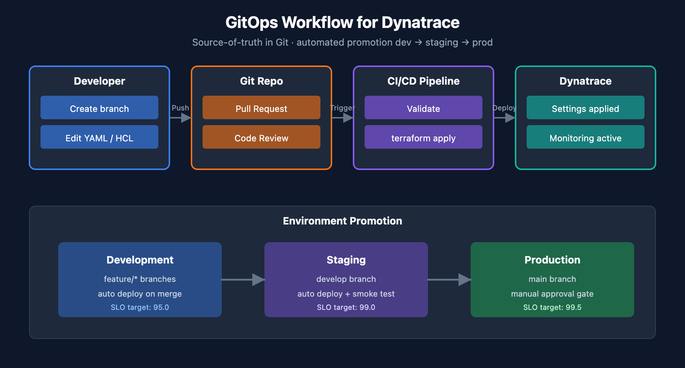
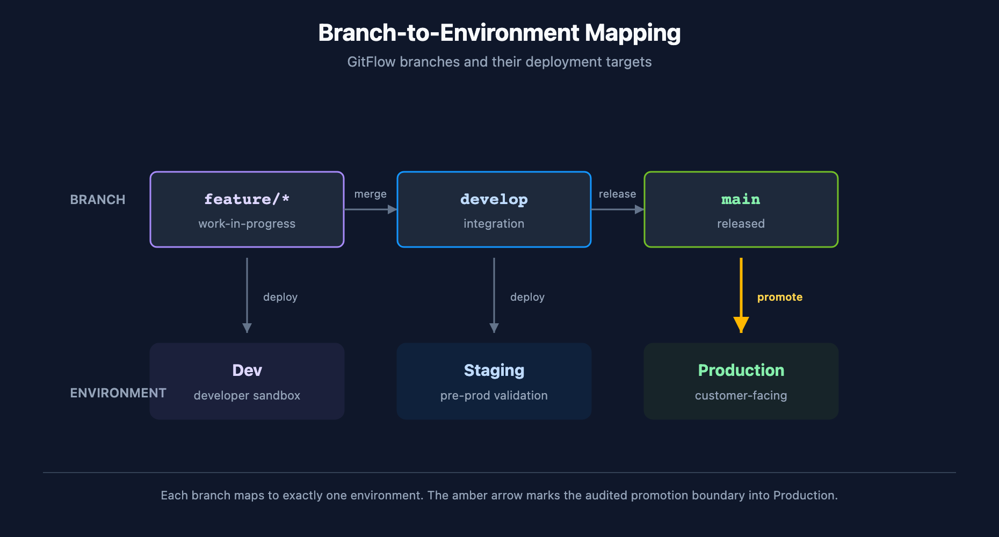
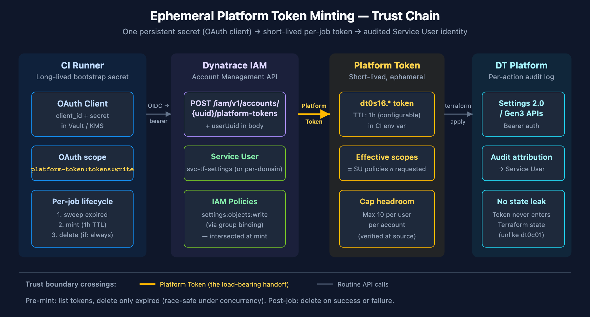
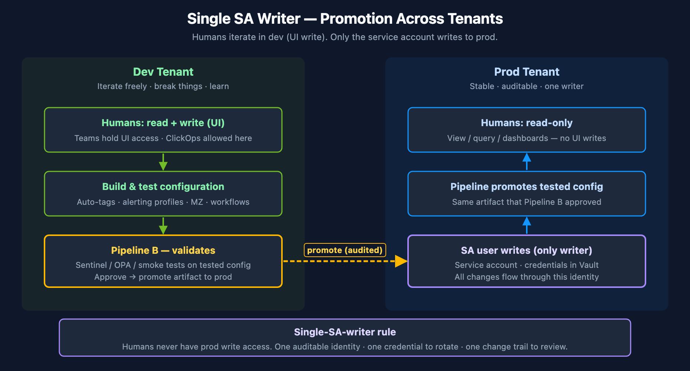

# AUTOM-07: CI/CD Integration

> **Series:** AUTOM — Dynatrace Automation | **Notebook:** 7 of 9 | **Created:** January 2026 | **Last Updated:** 07/15/2026

CI/CD integration brings software development practices to Dynatrace configuration management. By storing configs in Git and deploying via pipelines, teams gain version control, review processes, and automated deployments.

---

## Table of Contents

1. [Introduction](#introduction)
2. [GitOps Fundamentals](#gitops-fundamentals)
3. [GitHub Actions](#github-actions)
   - [Terraform with Combined Auth](#terraform-combined-auth)
   - [Vault Integration](#vault-integration)
   - [Policy-as-Code Gates](#policy-as-code)
   - [Drift Detection](#drift-detection)
   - [Reusable Workflows](#reusable-workflows)
4. [GitLab CI/CD](#gitlab-cicd)
5. [Bitbucket Pipelines](#bitbucket-pipelines)
   - [Pipeline — Monaco Deploy](#bitbucket-monaco)
   - [Pipeline — Terraform with Combined Auth](#bitbucket-terraform)
   - [Terraform Bitbucket Provider](#bitbucket-tf-provider)
   - [Combined Workspace — Bitbucket and Dynatrace in One Apply](#bitbucket-combined-workspace)
   - [Variables and Secrets](#bitbucket-variables)
   - [OIDC Note](#bitbucket-oidc)
6. [Atlassian Bamboo (with Bitbucket + S3)](#atlassian-bamboo)
   - [Stack Assumed](#bamboo-stack)
   - [Plan Specs YAML — Terraform with Combined Auth](#bamboo-plan-yaml)
   - [PR Workflow with Plan Branches](#bamboo-pr-workflow)
   - [Decoupled S3 State Files](#bamboo-s3-state)
   - [Bamboo Variables and Credentials](#bamboo-variables)
   - [Manual Stages for Production Gating](#bamboo-manual-stages)
7. [Azure DevOps Pipelines](#azure-devops-pipelines)
   - [Stack Assumed](#azuredevops-stack)
   - [Pipeline YAML — Terraform with Combined Auth](#azuredevops-pipeline-yaml)
   - [Environments and Approval Gates (configured in UI, not YAML)](#azuredevops-environments)
   - [Variable Groups for Dynatrace Credentials](#azuredevops-variable-groups)
   - [PR-Driven Plan-Only Workflow](#azuredevops-pr-workflow)
8. [ArgoCD Integration](#argocd-integration)
9. [FluxCD Integration](#fluxcd-integration)
10. [Dynatrace Operator GitOps Patterns](#dynatrace-operator-gitops-patterns)
11. [Ephemeral Platform Token Minting Pattern](#ephemeral-platform-token-minting)
    - [Conceptual Model — Four-Layer Trust Chain](#eptm-conceptual-model)
    - [Prerequisites — OAuth Client + Service Users + IAM Policies](#eptm-prerequisites)
    - [Worked Recipe — Pre-Mint Sweep, Mint, Use, Delete](#eptm-recipe)
    - [Capacity Planning Under the 10-Token Cap](#eptm-capacity)
    - [When This Pattern Is Justified](#eptm-justified)
12. [Best Practices](#best-practices)
13. [Governance Architecture](#governance-architecture)
14. [Next Steps](#next-steps)

---

## Prerequisites

Before starting this notebook, ensure you have:

| Requirement | Description |
|-------------|-------------|
| CI/CD Platform | GitHub Actions, GitLab CI, or Jenkins |
| Monaco or Terraform | One of the config-as-code tools |
| Git Repository | For storing configurations |
| Authentication | API Token + Platform Token for full coverage (see AUTOM-04) |
| HashiCorp Vault | *Optional* — for runtime credential retrieval instead of static CI/CD secrets |
| OPA / Conftest | *Optional* — for policy-as-code gates in pipelines |

### Token Types Reminder

As of Dynatrace Terraform provider **v1.88.0**, synthetic monitors and SLOs require a classic **API Token** (`dt0c01`). For full resource coverage in pipelines, use **Platform Token + API Token** together. See AUTOM-04: Terraform Provider for details.

---

## Learning Objectives

By the end of this notebook, you will:

- Understand GitOps principles for Dynatrace
- Know how to set up CI/CD pipelines for config deployment
- Be able to implement pull request workflows with plan-as-PR-comment
- Handle multi-environment deployments with combined auth
- Integrate HashiCorp Vault for runtime credential retrieval
- Implement policy-as-code gates with OPA/Conftest and Sentinel
- Set up automated drift detection workflows
- Create reusable GitHub Actions workflows for multi-team organizations

---

<a id="introduction"></a>
## 1. Introduction
### Why CI/CD for Dynatrace?

| Benefit | Description |
|---------|-------------|
| **Version Control** | All changes tracked in Git history |
| **Code Review** | Pull requests for config changes |
| **Automation** | No manual deployments |
| **Rollback** | Revert to any previous state |
| **Audit Trail** | Who changed what, when |

### GitOps Workflow

<!-- MARKDOWN_TABLE_ALTERNATIVE
| Step | Action |
|------|--------|
| 1 | Developer creates branch |
| 2 | Makes config changes |
| 3 | Opens pull request |
| 4 | Validation pipeline runs |
| 5 | Review and approve |
| 6 | Merge triggers deploy |
-->



---

<a id="gitops-fundamentals"></a>
## 2. GitOps Fundamentals
### Repository Structure

```
dynatrace-config/
├── .github/
│   └── workflows/
│       ├── validate.yml
│       └── deploy.yml
├── manifest.yaml          # Monaco manifest
├── environments/
│   ├── dev.yaml
│   ├── staging.yaml
│   └── production.yaml
├── projects/
│   ├── alerting/
│   ├── management-zones/
│   └── synthetic/
└── README.md
```

### Branch Strategy

| Branch | Purpose | Deploys To |
|--------|---------|------------|
| `main` | Production configs | Production |
| `develop` | Integration branch | Staging |
| `feature/*` | New features | Dev (optional) |

### Environment Promotion



<!-- MARKDOWN_TABLE_ALTERNATIVE
| Branch     | Merges into | Deploys to  | Notes                          |
|------------|-------------|-------------|--------------------------------|
| feature/*  | develop     | Dev         | Per-feature sandbox            |
| develop    | main        | Staging     | Integration / pre-prod         |
| main       | —           | Production  | Audited promotion boundary     |
For environments where SVG doesn't render
-->

---

<a id="github-actions"></a>
## 3. GitHub Actions
### Validation Workflow

**.github/workflows/validate.yml:**

```yaml
name: Validate Dynatrace Config

on:
  pull_request:
    branches: [main, develop]
    paths:
      - 'projects/**'
      - 'manifest.yaml'

jobs:
  validate:
    runs-on: ubuntu-latest
    steps:
      - uses: actions/checkout@v6
      
      - name: Install Monaco
        run: |
          curl -L https://github.com/Dynatrace/dynatrace-configuration-as-code/releases/latest/download/monaco-linux-amd64 -o monaco
          chmod +x monaco
          sudo mv monaco /usr/local/bin/
      
      - name: Validate Configuration
        run: monaco validate manifest.yaml
      
      - name: Dry Run Deploy
        env:
          DT_DEV_URL: ${{ secrets.DT_DEV_URL }}
          DT_DEV_TOKEN: ${{ secrets.DT_DEV_TOKEN }}
        run: |
          monaco deploy manifest.yaml --environment development --dry-run
```

### Deployment Workflow

**.github/workflows/deploy.yml:**

```yaml
name: Deploy Dynatrace Config

on:
  push:
    branches: [main]
    paths:
      - 'projects/**'
      - 'manifest.yaml'

jobs:
  deploy-staging:
    runs-on: ubuntu-latest
    environment: staging
    steps:
      - uses: actions/checkout@v6
      
      - name: Install Monaco
        run: |
          curl -L https://github.com/Dynatrace/dynatrace-configuration-as-code/releases/latest/download/monaco-linux-amd64 -o monaco
          chmod +x monaco
          sudo mv monaco /usr/local/bin/
      
      - name: Deploy to Staging
        env:
          DT_STAGING_URL: ${{ secrets.DT_STAGING_URL }}
          DT_STAGING_TOKEN: ${{ secrets.DT_STAGING_TOKEN }}
        run: |
          monaco deploy manifest.yaml --environment staging

  deploy-production:
    needs: deploy-staging
    runs-on: ubuntu-latest
    environment: production
    steps:
      - uses: actions/checkout@v6
      
      - name: Install Monaco
        run: |
          curl -L https://github.com/Dynatrace/dynatrace-configuration-as-code/releases/latest/download/monaco-linux-amd64 -o monaco
          chmod +x monaco
          sudo mv monaco /usr/local/bin/
      
      - name: Deploy to Production
        env:
          DT_PROD_URL: ${{ secrets.DT_PROD_URL }}
          DT_PROD_TOKEN: ${{ secrets.DT_PROD_TOKEN }}
        run: |
          monaco deploy manifest.yaml --environment production
```

---

<a id="terraform-combined-auth"></a>
### Terraform Workflow with Combined Auth

For Terraform-based deployments, use **Platform Token + API Token** together for full resource coverage. The provider automatically routes each resource to the correct token.

```yaml
name: Terraform Dynatrace

on:
  pull_request:
    branches: [main]
  push:
    branches: [main]

jobs:
  terraform:
    runs-on: ubuntu-latest
    permissions:
      contents: read
      pull-requests: write
    steps:
      - uses: actions/checkout@v6
      
      - name: Setup Terraform
        uses: hashicorp/setup-terraform@v4
        with:
          terraform_version: latest
      
      - name: Terraform Init
        run: terraform init
      
      - name: Terraform Plan
        id: plan
        if: github.event_name == 'pull_request'
        run: terraform plan -no-color -out=tfplan
        env:
          DYNATRACE_ENV_URL: ${{ secrets.DT_ENV_URL }}
          DYNATRACE_PLATFORM_TOKEN: ${{ secrets.DT_PLATFORM_TOKEN }}
          DYNATRACE_API_TOKEN: ${{ secrets.DT_API_TOKEN }}
          DYNATRACE_HTTP_OAUTH_PREFERENCE: "true"
      
      - name: Post Plan to PR
        if: github.event_name == 'pull_request'
        uses: borchero/terraform-plan-comment@v2
        with:
          token: ${{ github.token }}
          planfile: tfplan
      
      - name: Terraform Apply
        if: github.ref == 'refs/heads/main' && github.event_name == 'push'
        run: terraform apply -auto-approve
        env:
          DYNATRACE_ENV_URL: ${{ secrets.DT_ENV_URL }}
          DYNATRACE_PLATFORM_TOKEN: ${{ secrets.DT_PLATFORM_TOKEN }}
          DYNATRACE_API_TOKEN: ${{ secrets.DT_API_TOKEN }}
          DYNATRACE_HTTP_OAUTH_PREFERENCE: "true"
```

| Secret | Token Type | Covers |
|--------|-----------|--------|
| `DT_PLATFORM_TOKEN` | `dt0s16.xxxx` | Settings 2.0 + Gen3 Platform (workflows, documents, segments) |
| `DT_API_TOKEN` | `dt0c01.xxxx` | Synthetic monitors, SLOs (v1.88.0 requirement) |
| `DT_ENV_URL` | — | Tenant URL |

> **Why combined auth?** A single API Token cannot manage Gen3 resources. A single Platform Token cannot manage synthetics/SLOs (removed in v1.88.0). Using both together gives the pipeline full coverage.

---

<a id="vault-integration"></a>
### Vault Integration for Runtime Credentials

For enterprise environments with **short-lived tokens** (e.g., 24-hour expiration), retrieve credentials at runtime from **HashiCorp Vault** instead of storing them as static CI/CD secrets.

```yaml
name: Terraform with Vault Credentials

on:
  pull_request:
    branches: [main]
  push:
    branches: [main]

jobs:
  terraform:
    runs-on: ubuntu-latest
    permissions:
      id-token: write       # Required for OIDC → Vault JWT auth
      contents: read
      pull-requests: write
    steps:
      - uses: actions/checkout@v6

      - name: Retrieve Dynatrace credentials from Vault
        uses: hashicorp/vault-action@v3
        with:
          url: ${{ secrets.VAULT_ADDR }}
          method: jwt
          role: dynatrace-deployer
          secrets: |
            secret/data/dynatrace/prod platform_token | DYNATRACE_PLATFORM_TOKEN ;
            secret/data/dynatrace/prod api_token | DYNATRACE_API_TOKEN ;
            secret/data/dynatrace/prod env_url | DYNATRACE_ENV_URL

      - name: Setup Terraform
        uses: hashicorp/setup-terraform@v4

      - name: Terraform Init
        run: terraform init

      - name: Terraform Plan
        run: terraform plan -no-color -out=tfplan
        env:
          DYNATRACE_HTTP_OAUTH_PREFERENCE: "true"

      - name: Terraform Apply
        if: github.ref == 'refs/heads/main' && github.event_name == 'push'
        run: terraform apply -auto-approve
        env:
          DYNATRACE_HTTP_OAUTH_PREFERENCE: "true"
```

**Vault path structure per team per tenant:**

```
secret/
└── dynatrace/
    ├── dev/
    │   ├── platform_token    # dt0s16 for dev tenant
    │   ├── api_token         # dt0c01 for dev tenant
    │   └── env_url           # https://{dev-tenant}.live.dynatrace.com
    ├── prod/
    │   ├── platform_token
    │   ├── api_token
    │   └── env_url
    └── teams/
        ├── payments/         # Team-specific OAuth clients
        │   ├── client_id
        │   └── client_secret
        └── platform/
            ├── client_id
            └── client_secret
```

> **Why Vault?** Static GitHub Secrets don't expire. If your organization uses 24-hour token rotation or needs audit trails for credential access, Vault provides runtime retrieval with automatic expiration and access logging.

---

<a id="policy-as-code"></a>
### Policy-as-Code Gates (OPA / Sentinel)

Add governance checks to your pipeline using **OPA/Conftest** (open-source) or **Sentinel** (Terraform Enterprise/Cloud).

#### OPA/Conftest — Resource Type Allowlist

Restrict which Dynatrace resource types a team can create:

**policy/allowed_resources.rego:**

```rego
package main

# Only allow these Dynatrace resource types
allowed_resources := {
  "dynatrace_alerting",
  "dynatrace_autotag_v2",
  "dynatrace_management_zone_v2",
  "dynatrace_maintenance"
}

deny[msg] {
  resource := input.planned_values.root_module.resources[_]
  startswith(resource.type, "dynatrace_")
  not allowed_resources[resource.type]
  msg := sprintf("Resource type '%s' is not in the allowlist", [resource.type])
}
```

> **Provider version note (v1.98.0, June 2026):** `dynatrace_maintenance` in the allowlist above is **deprecated** in provider v1.98+ in favor of `dynatrace_maintenance_windows`. The allowlist stays valid for older provider pins; on v1.98+ add (or substitute) `"dynatrace_maintenance_windows"` so newly-authored maintenance windows pass the policy.

#### OPA/Conftest — Mandatory Team Tagging

Ensure all resources include team ownership metadata:

**policy/mandatory_tags.rego:**

```rego
package main

deny[msg] {
  resource := input.planned_values.root_module.resources[_]
  resource.type == "dynatrace_autotag_v2"
  not resource.values.name
  msg := "Auto-tag resources must have a name"
}

deny[msg] {
  resource := input.planned_values.root_module.resources[_]
  startswith(resource.type, "dynatrace_")
  not has_team_ownership(resource)
  msg := sprintf("Resource '%s' must include team ownership metadata", [resource.address])
}

has_team_ownership(resource) {
  contains(resource.values.name, resource.values.team_name)
}
```

#### Pipeline Integration

```yaml
# Add after terraform plan step
- name: Install Conftest
  run: |
    wget -q https://github.com/open-policy-agent/conftest/releases/latest/download/conftest_Linux_x86_64.tar.gz
    tar xzf conftest_Linux_x86_64.tar.gz
    sudo mv conftest /usr/local/bin/

- name: Run Policy Checks
  run: |
    terraform show -json tfplan > tfplan.json
    conftest test tfplan.json --policy policy/
```

#### Sentinel (Terraform Enterprise / Cloud)

For teams using **TFE** (now HCP Terraform), Sentinel policies enforce governance at the workspace level:

```python
# sentinel/restrict_resource_types.sentinel
import "tfplan/v2" as tfplan

allowed_types = [
  "dynatrace_alerting",
  "dynatrace_autotag_v2",
  "dynatrace_management_zone_v2",
]

main = rule {
  all tfplan.resource_changes as _, rc {
    rc.type in allowed_types or not (rc.type matches "dynatrace_.*")
  }
}
```

> **Important — Sentinel Limitations:** Sentinel evaluates Terraform **plans** — it does not grant or restrict Dynatrace API access at runtime. It cannot reduce the permissions of a token that has broad scope. If a pipeline token can write all Synthetic monitors, Sentinel cannot narrow that. Use **Dynatrace IAM policies** (see **AUTOM-04: IAM Policy Management**) for platform-level access control, and Sentinel for pipeline-level governance. Sentinel only runs in **HCP Terraform** — it is not available in open-source Terraform, GitHub Actions, or plain CI runners. For non-HCP environments, use **OPA/Conftest** as shown above.

---

<a id="drift-detection"></a>
### Drift Detection Workflow

Schedule automatic drift detection to catch manual UI changes ("ClickOps") that bypass your Terraform pipeline:

```yaml
name: Drift Detection

on:
  schedule:
    - cron: '0 6 * * 1-5'   # Every weekday at 6am UTC
  workflow_dispatch: {}       # Allow manual trigger

jobs:
  detect-drift:
    runs-on: ubuntu-latest
    steps:
      - uses: actions/checkout@v6

      - name: Setup Terraform
        uses: hashicorp/setup-terraform@v4

      - name: Terraform Init
        run: terraform init

      - name: Check for Drift
        id: drift
        run: |
          set +e
          terraform plan -detailed-exitcode -no-color 2>&1 | tee drift-output.txt
          echo "exitcode=$?" >> "$GITHUB_OUTPUT"
        env:
          DYNATRACE_ENV_URL: ${{ secrets.DT_ENV_URL }}
          DYNATRACE_PLATFORM_TOKEN: ${{ secrets.DT_PLATFORM_TOKEN }}
          DYNATRACE_API_TOKEN: ${{ secrets.DT_API_TOKEN }}
          DYNATRACE_HTTP_OAUTH_PREFERENCE: "true"

      - name: Create Issue on Drift
        if: steps.drift.outputs.exitcode == '2'
        uses: actions/github-script@v7
        with:
          script: |
            const fs = require('fs');
            const drift = fs.readFileSync('drift-output.txt', 'utf8').slice(-3000);
            await github.rest.issues.create({
              owner: context.repo.owner,
              repo: context.repo.repo,
              title: '⚠️ Dynatrace configuration drift detected',
              body: `Scheduled drift detection found changes not in Terraform state.\n\n\`\`\`\n${drift}\n\`\`\`\n\nSomeone may have made manual changes in the Dynatrace UI.`,
              labels: ['drift', 'dynatrace']
            });
```

> **Exit codes:** `terraform plan -detailed-exitcode` returns `0` = no changes, `1` = error, `2` = drift detected. This lets your pipeline take different actions based on the result.

---

<a id="reusable-workflows"></a>
### Reusable GitHub Actions Workflows

For organizations managing multiple Dynatrace tenants or LOB repositories, create **reusable workflows** that any repo can call:

**.github/workflows/terraform-dynatrace.yml** (in a shared workflow repo):

```yaml
name: Terraform Dynatrace (Reusable)

on:
  workflow_call:
    inputs:
      working_directory:
        required: false
        type: string
        default: '.'
      terraform_version:
        required: false
        type: string
        default: '1.6.0'
    secrets:
      DT_ENV_URL:
        required: true
      DT_PLATFORM_TOKEN:
        required: true
      DT_API_TOKEN:
        required: true

jobs:
  plan:
    runs-on: ubuntu-latest
    permissions:
      contents: read
      pull-requests: write
    defaults:
      run:
        working-directory: ${{ inputs.working_directory }}
    steps:
      - uses: actions/checkout@v6

      - name: Setup Terraform
        uses: hashicorp/setup-terraform@v4
        with:
          terraform_version: ${{ inputs.terraform_version }}

      - name: Terraform Init
        run: terraform init

      - name: Terraform Plan
        run: terraform plan -no-color -out=tfplan
        env:
          DYNATRACE_ENV_URL: ${{ secrets.DT_ENV_URL }}
          DYNATRACE_PLATFORM_TOKEN: ${{ secrets.DT_PLATFORM_TOKEN }}
          DYNATRACE_API_TOKEN: ${{ secrets.DT_API_TOKEN }}
          DYNATRACE_HTTP_OAUTH_PREFERENCE: "true"

      - name: Post Plan to PR
        if: github.event_name == 'pull_request'
        uses: borchero/terraform-plan-comment@v2
        with:
          token: ${{ github.token }}
          planfile: tfplan

  apply:
    needs: plan
    if: github.ref == 'refs/heads/main' && github.event_name == 'push'
    runs-on: ubuntu-latest
    defaults:
      run:
        working-directory: ${{ inputs.working_directory }}
    steps:
      - uses: actions/checkout@v6

      - name: Setup Terraform
        uses: hashicorp/setup-terraform@v4
        with:
          terraform_version: ${{ inputs.terraform_version }}

      - name: Terraform Init
        run: terraform init

      - name: Terraform Apply
        run: terraform apply -auto-approve
        env:
          DYNATRACE_ENV_URL: ${{ secrets.DT_ENV_URL }}
          DYNATRACE_PLATFORM_TOKEN: ${{ secrets.DT_PLATFORM_TOKEN }}
          DYNATRACE_API_TOKEN: ${{ secrets.DT_API_TOKEN }}
          DYNATRACE_HTTP_OAUTH_PREFERENCE: "true"
```

**Calling the reusable workflow** from a LOB repo:

```yaml
# .github/workflows/deploy.yml (in dt-lob-payments repo)
name: Deploy Dynatrace Config

on:
  pull_request:
    branches: [main]
  push:
    branches: [main]

jobs:
  terraform:
    uses: my-org/dt-templates/.github/workflows/terraform-dynatrace.yml@main
    with:
      working_directory: terraform/
    secrets:
      DT_ENV_URL: ${{ secrets.DT_ENV_URL }}
      DT_PLATFORM_TOKEN: ${{ secrets.DT_PLATFORM_TOKEN }}
      DT_API_TOKEN: ${{ secrets.DT_API_TOKEN }}
```

> **Multi-tenant pattern:** For organizations with 5+ tenants, the reusable workflow is called once per environment with different secrets, providing a consistent deployment experience across all tenants.

---

<a id="gitlab-cicd"></a>
## 4. GitLab CI/CD
### Pipeline Configuration

**.gitlab-ci.yml:**

```yaml
stages:
  - validate
  - deploy-staging
  - deploy-production

.monaco-setup: &monaco-setup
  before_script:
    - curl -L https://github.com/Dynatrace/dynatrace-configuration-as-code/releases/latest/download/monaco-linux-amd64 -o monaco
    - chmod +x monaco
    - mv monaco /usr/local/bin/

validate:
  stage: validate
  <<: *monaco-setup
  script:
    - monaco validate manifest.yaml
    - monaco deploy manifest.yaml --environment development --dry-run
  rules:
    - if: $CI_PIPELINE_SOURCE == "merge_request_event"

deploy-staging:
  stage: deploy-staging
  <<: *monaco-setup
  script:
    - monaco deploy manifest.yaml --environment staging
  environment:
    name: staging
  rules:
    - if: $CI_COMMIT_BRANCH == "main"

deploy-production:
  stage: deploy-production
  <<: *monaco-setup
  script:
    - monaco deploy manifest.yaml --environment production
  environment:
    name: production
  rules:
    - if: $CI_COMMIT_BRANCH == "main"
      when: manual
```

### Variables Configuration

In GitLab: **Settings → CI/CD → Variables**

| Variable | Protected | Masked |
|----------|-----------|--------|
| `DT_DEV_URL` | No | No |
| `DT_DEV_TOKEN` | No | Yes |
| `DT_STAGING_URL` | No | No |
| `DT_STAGING_TOKEN` | Yes | Yes |
| `DT_PROD_URL` | Yes | No |
| `DT_PROD_TOKEN` | Yes | Yes |

---

<a id="bitbucket-pipelines"></a>
## 5. Bitbucket Pipelines

Bitbucket Cloud (bitbucket.org) ships **Bitbucket Pipelines** as the integrated CI/CD service. The pipeline definition lives in a `bitbucket-pipelines.yml` file at the repository root. Variables (including secrets) live at three scopes: workspace, repository, and deployment-environment.

> **Bitbucket Data Center / Server** uses a different mechanism (Bitbucket Pipelines is a Cloud-only feature). For self-hosted Bitbucket, integrate via Jenkins, GitLab CI, or another CI/CD tool — the patterns below assume Bitbucket Cloud.

> ### Provider landscape note (mid-2026)
>
> The Terraform-provider landscape for Bitbucket Cloud is in active transition:
>
> - **`DrFaust92/bitbucket`** — the long-standing community provider — entered **maintenance mode** in March 2026. The maintainer is no longer using Bitbucket and has limited bandwidth for substantive changes.
> - **Bitbucket App Passwords are being retired by Atlassian** in favor of API tokens (see [App passwords (Atlassian)](https://support.atlassian.com/bitbucket-cloud/docs/app-passwords/) and [API tokens (Atlassian)](https://support.atlassian.com/bitbucket-cloud/docs/api-tokens/)). Check the current Atlassian deprecation notice for the exact cutover date — once it lands, `DrFaust92` users need to swap their `BITBUCKET_PASSWORD` from an App Password to an API token (workaround community-validated: use the Atlassian-account email as `BITBUCKET_USERNAME` + an API token as `BITBUCKET_PASSWORD`, with `-parallelism=2` to avoid throttling).
> - **`FabianSchurig/bitbucket`** — a newer, actively-maintained provider — is the going-forward recommendation. It uses a "generic resources" architecture (resources expose Bitbucket Cloud API endpoints directly via typed core fields plus `request_body` for full API flexibility) and a simplified API-token-only auth. As of May 2026 it is at v0.15.x — **pre-1.0, with schema flux possible** — so the examples below should be verified against the [provider docs](https://registry.terraform.io/providers/FabianSchurig/bitbucket/latest/docs) at use time.
>
> The examples in this section use **`FabianSchurig/bitbucket`**. For teams with existing `DrFaust92` code, the [migration guide](https://github.com/FabianSchurig/bitbucket-cli/blob/main/MIGRATION.md) covers resource-name mapping, auth changes, and path-parameter renames (`owner` → `workspace`, `repository` → `repo_slug`).

<a id="bitbucket-monaco"></a>
### Pipeline — Monaco Deploy

**bitbucket-pipelines.yml** at repo root:

```yaml
image: atlassian/default-image:4

definitions:
  steps:
    - step: &install-monaco
        name: Install Monaco
        script:
          - curl -L https://github.com/Dynatrace/dynatrace-configuration-as-code/releases/latest/download/monaco-linux-amd64 -o monaco
          - chmod +x monaco
          - mv monaco /usr/local/bin/

pipelines:
  pull-requests:
    '**':
      - step:
          <<: *install-monaco
          name: Validate Monaco config
          script:
            - monaco validate manifest.yaml
            - monaco deploy manifest.yaml --environment development --dry-run

  branches:
    main:
      - step:
          <<: *install-monaco
          name: Deploy to staging
          deployment: staging
          script:
            - monaco deploy manifest.yaml --environment staging

      - step:
          <<: *install-monaco
          name: Deploy to production
          deployment: production
          trigger: manual
          script:
            - monaco deploy manifest.yaml --environment production
```

Each step declared with `deployment: <env>` inherits that environment's deployment variables. The `trigger: manual` on the production step gates the deploy behind a manual confirmation in the Bitbucket UI.

<a id="bitbucket-terraform"></a>
### Pipeline — Terraform with Combined Auth

Mirrors the GitHub Actions Terraform pattern (§3.1) — Platform Token + API Token together for full Dynatrace resource coverage:

```yaml
image: hashicorp/terraform:1.6

pipelines:
  pull-requests:
    '**':
      - step:
          name: Terraform Plan
          deployment: staging
          script:
            - terraform init
            - terraform plan -no-color -out=tfplan
            - terraform show -no-color tfplan > plan.txt
          artifacts:
            - plan.txt
            - tfplan

  branches:
    main:
      - step:
          name: Terraform Apply (staging)
          deployment: staging
          script:
            - terraform init
            - terraform apply -auto-approve

      - step:
          name: Terraform Apply (production)
          deployment: production
          trigger: manual
          script:
            - terraform init
            - terraform apply -auto-approve
```

The pipeline reads `DYNATRACE_ENV_URL`, `DYNATRACE_PLATFORM_TOKEN`, `DYNATRACE_API_TOKEN`, and `DYNATRACE_HTTP_OAUTH_PREFERENCE` from the deployment environment's variables — see [Variables and Secrets](#bitbucket-variables) below.

<a id="bitbucket-tf-provider"></a>
### Terraform Bitbucket Provider — FabianSchurig (recommended for new code)

The **`FabianSchurig/bitbucket`** provider manages Bitbucket Cloud resources via the Cloud API. Architecture quirks worth knowing before reading the example:

- **Typed core fields + `request_body` escape hatch.** Each resource has a few typed arguments for the most-common fields (`workspace`, `repo_slug`, `key`, `secured`, etc.) plus a `request_body` JSON string for full API payload flexibility. When a field you need is not surfaced as a typed argument, you set it via `request_body = jsonencode({...})`.
- **Boolean fields are strings.** `secured = "true"`, `enabled = "true"` — typed as string, not bool. The generic-resource architecture preserves API string representations.
- **Auth is API-token only.** Set the `token` argument on the provider (or `BITBUCKET_TOKEN` env var). No App Password, no OAuth.

Key resources used in this section:

| Resource | What it manages |
|---|---|
| `bitbucket_repos` | The repo itself (CRUD); core fields + `request_body` for less-common settings |
| `bitbucket_pipeline_config` | Enables/disables Bitbucket Pipelines on the repo (`enabled = "true"`) |
| `bitbucket_repo_settings` | Repository settings split out of the legacy repo resource |
| `bitbucket_deployments` | A deployment environment (named — staging / production / etc.) |
| `bitbucket_deployment_variables` | Variable scoped to a deployment environment |
| `bitbucket_pipeline_variables` | Repository-scoped variable (formerly `bitbucket_repository_variable` in DrFaust92) |
| `bitbucket_workspace_pipeline_variables` | Workspace-scoped variable shared across repos |
| `bitbucket_commit_file` | Commits a file (including `bitbucket-pipelines.yml`) — sparse typed schema, use `request_body` for content / branch / message |
| `bitbucket_pipeline_schedules` | Scheduled pipeline runs |

<a id="bitbucket-combined-workspace"></a>
### Combined Workspace — Bitbucket and Dynatrace in One Apply

The load-bearing pattern: a single Terraform workspace provisions the Bitbucket repo, enables pipelines on it, creates deployment environments, sets the secured variables holding Dynatrace credentials, commits the `bitbucket-pipelines.yml` file, **and** stands up the Dynatrace configuration the pipeline will deploy. One `terraform apply` brings up the whole CI/CD-to-Dynatrace path.

**Why this is useful:** for net-new tenants or new app teams, you can codify the entire onboarding (repo, pipeline, Dynatrace tenant config) in a single artifact. The drift-detection story is also unified — one `terraform plan` shows drift in both Bitbucket and Dynatrace.

> **Verify against current provider docs at use time.** The FabianSchurig provider is pre-1.0; some `request_body` shapes below (especially for `bitbucket_commit_file`) are best-effort against the May 2026 documentation. Confirm against the [registry docs](https://registry.terraform.io/providers/FabianSchurig/bitbucket/latest/docs) before applying.

**main.tf:**

```hcl
terraform {
  required_providers {
    bitbucket = {
      source  = "FabianSchurig/bitbucket"
      version = "~> 0.15"  # Pre-1.0; pin tightly until stable 1.x lands
    }
    dynatrace = {
      source  = "dynatrace-oss/dynatrace"
      version = "~> 1.88"
    }
  }
}

# Bitbucket provider — API token auth (App Passwords are being retired by Atlassian)
provider "bitbucket" {
  # token read from BITBUCKET_TOKEN env var; alternatively set inline:
  # token = var.bitbucket_token
}

# Dynatrace provider — combined auth (Platform Token + API Token)
provider "dynatrace" {
  dt_env_url   = var.dt_env_url
  dt_api_token = var.dt_api_token
  # Platform Token is read from DT_PLATFORM_TOKEN env var by the provider
}

variable "workspace" { type = string }
variable "dt_env_url" { type = string }
variable "dt_api_token" { type = string, sensitive = true }
variable "dt_platform_token" { type = string, sensitive = true }

# --- 1. Bitbucket repo ---
resource "bitbucket_repos" "config_repo" {
  workspace = var.workspace
  repo_slug = "dynatrace-config"

  # Less-common settings go through request_body in the generic-resource architecture
  request_body = jsonencode({
    is_private  = true
    fork_policy = "no_forks"
    description = "Monaco / Terraform configs for Dynatrace tenant"
  })
}

# --- 2. Enable Bitbucket Pipelines on the repo ---
resource "bitbucket_pipeline_config" "config_repo_pipelines" {
  workspace = bitbucket_repos.config_repo.workspace
  repo_slug = bitbucket_repos.config_repo.repo_slug
  enabled   = "true"  # String, not bool — the generic schema preserves API representations
}

# --- 3. Deployment environments ---
resource "bitbucket_deployments" "staging" {
  workspace = var.workspace
  repo_slug = bitbucket_repos.config_repo.repo_slug
  name      = "staging"
}

resource "bitbucket_deployments" "production" {
  workspace = var.workspace
  repo_slug = bitbucket_repos.config_repo.repo_slug
  name      = "production"
}

# --- 4. Secured variables holding Dynatrace credentials ---
# Repository-scoped (visible to every step):
resource "bitbucket_pipeline_variables" "dt_env_url" {
  workspace = var.workspace
  repo_slug = bitbucket_repos.config_repo.repo_slug
  key       = "DYNATRACE_ENV_URL"
  value     = var.dt_env_url
  secured   = "false"  # String
}

# Per-environment (different token per env — locked to that deployment):
resource "bitbucket_deployment_variables" "staging_platform_token" {
  workspace        = var.workspace
  repo_slug        = bitbucket_repos.config_repo.repo_slug
  environment_uuid = bitbucket_deployments.staging.uuid
  key              = "DYNATRACE_PLATFORM_TOKEN"
  value            = var.dt_platform_token  # In real use, source per-env tokens separately
  secured          = "true"
}

resource "bitbucket_deployment_variables" "staging_api_token" {
  workspace        = var.workspace
  repo_slug        = bitbucket_repos.config_repo.repo_slug
  environment_uuid = bitbucket_deployments.staging.uuid
  key              = "DYNATRACE_API_TOKEN"
  value            = var.dt_api_token
  secured          = "true"
}

resource "bitbucket_deployment_variables" "prod_platform_token" {
  workspace        = var.workspace
  repo_slug        = bitbucket_repos.config_repo.repo_slug
  environment_uuid = bitbucket_deployments.production.uuid
  key              = "DYNATRACE_PLATFORM_TOKEN"
  value            = var.dt_platform_token
  secured          = "true"
}

resource "bitbucket_deployment_variables" "prod_api_token" {
  workspace        = var.workspace
  repo_slug        = bitbucket_repos.config_repo.repo_slug
  environment_uuid = bitbucket_deployments.production.uuid
  key              = "DYNATRACE_API_TOKEN"
  value            = var.dt_api_token
  secured          = "true"
}

# --- 5. Commit the bitbucket-pipelines.yml into the repo ---
# bitbucket_commit_file has a sparse typed schema; pass the commit details via
# request_body. Confirm the exact field names against the provider docs at use
# time — the pre-1.0 schema may evolve.
resource "bitbucket_commit_file" "pipelines_yml" {
  workspace = var.workspace
  repo_slug = bitbucket_repos.config_repo.repo_slug

  request_body = jsonencode({
    branch   = "main"
    message  = "ci: provision pipeline config via Terraform"
    author   = "Terraform <terraform@example.com>"
    files = {
      "bitbucket-pipelines.yml" = file("${path.module}/bitbucket-pipelines.yml")
    }
  })

  depends_on = [
    bitbucket_pipeline_config.config_repo_pipelines,
    bitbucket_deployment_variables.staging_platform_token,
    bitbucket_deployment_variables.staging_api_token,
    bitbucket_deployment_variables.prod_platform_token,
    bitbucket_deployment_variables.prod_api_token,
  ]
}

# --- 6. Dynatrace resources the pipeline will deploy on top of ---
# (Bootstrap resources — things you want present before the pipeline runs for
# the first time. Day-to-day app-team configs land in the repo and deploy via
# the pipeline itself.)
resource "dynatrace_management_zone_v2" "platform_baseline" {
  name = "platform-baseline"

  rules {
    type             = "ME"
    enabled          = true
    propagation_type = "HOST_TO_PROCESS_GROUP_INSTANCE"

    conditions {
      key {
        attribute = "HOST_GROUP_NAME"
      }
      string_conditions {
        operator         = "EQUALS"
        value            = "platform-baseline"
        case_sensitive   = false
      }
    }
  }
}
```

**Ordering is load-bearing:**

- `bitbucket_repos` must exist before `bitbucket_pipeline_config`, `bitbucket_pipeline_variables`, or `bitbucket_deployments` referencing it.
- `bitbucket_deployments` must exist before any `bitbucket_deployment_variables` referencing it (the `environment_uuid` is the API-returned identifier).
- `bitbucket_commit_file` for `bitbucket-pipelines.yml` should `depends_on` both the variables AND the `bitbucket_pipeline_config` — if the pipeline file lands in the repo before pipelines are enabled and variables are in place, the first push triggers a pipeline run that fails (either because pipelines aren't active, or because authentication has nothing to read).

The explicit `depends_on` in `bitbucket_commit_file` is the cleanest way to enforce this; Terraform's automatic dependency graph only catches references, not "must exist when this file is read."

**Caveat on per-env tokens:** the example above uses a single `var.dt_platform_token` for both staging and production deployment variables. In a real setup, you'd want **separate Dynatrace tokens per environment** — typically by running the staging and production applies in separate workspaces, or by sourcing per-environment tokens from a secrets manager (Vault, AWS Secrets Manager, Bitbucket OIDC-to-Vault flow).

<a id="bitbucket-variables"></a>
### Variables and Secrets

Bitbucket Pipelines has three variable scopes. Pick the right scope per credential:

| Scope | Terraform resource | When to use |
|---|---|---|
| **Workspace** | `bitbucket_workspace_pipeline_variables` | Credentials shared across many repos in the workspace (e.g., a workspace-wide Dynatrace token if you don't separate by app). |
| **Repository** | `bitbucket_pipeline_variables` | Per-repo credentials — typical for a `dynatrace-config` repo with its own Dynatrace tokens. |
| **Deployment environment** | `bitbucket_deployment_variables` | Per-environment credentials (staging vs. production tokens). The recommended scope when you want different Dynatrace tokens (or different tenants) per environment. |

| Variable | Scope | `secured` | Why |
|---|---|:-:|---|
| `DYNATRACE_ENV_URL` | Repository | No | Tenant URL is not secret; visible in every step |
| `DYNATRACE_PLATFORM_TOKEN` | Deployment | Yes | Per-env; write-only after creation |
| `DYNATRACE_API_TOKEN` | Deployment | Yes | Per-env; covers synthetics/SLOs not yet on Platform Token |
| `DYNATRACE_HTTP_OAUTH_PREFERENCE` | Repository | No | Static flag, not a credential |

`secured = "true"` makes the variable value write-only — once set, the Bitbucket API won't return it (and Terraform won't drift-detect on the value). If you need to rotate, change the Terraform value and re-apply.

> **Note on YAML templating and secured variables.** Bitbucket Pipelines added a `${{ }}` YAML-templating mechanism that injects workspace, repository, and custom pipeline variables into the pipeline YAML at execution time — but **secured variables are deliberately excluded** from this templating. This is a security guarantee: a Dynatrace token stored in a secured variable cannot be inadvertently rendered into a pipeline YAML field where it might leak into logs. Read your secured variables only via standard environment-variable substitution inside `script:` blocks. Two related additions worth knowing: **Shared Pipeline Variables** (steps export variables to subsequent steps in the same pipeline; 50-variable / 100KB caps) and **Input Variables for Child Pipelines** (parent → child, up to 20 variables) — both work with non-secured variables.

> <sub>**Sources:** [Variables and secrets (Atlassian)](https://support.atlassian.com/bitbucket-cloud/docs/variables-and-secrets/) — three variable scopes (workspace / repository / deployment) and precedence; recent additions (shared pipeline variables, input variables for child pipelines, YAML templating with secured-variable exclusion).</sub>

<a id="bitbucket-oidc"></a>
### OIDC Note

**Bitbucket Pipelines supports OIDC** for federating to AWS, GCP, and Vault — see the Atlassian docs on [Integrate Pipelines with resource servers using OIDC](https://support.atlassian.com/bitbucket-cloud/docs/integrate-pipelines-with-resource-servers-using-oidc/). The pattern is to add `oidc: true` at the pipeline step level and configure the resource server (AWS / GCP / Vault) to trust the Bitbucket OIDC issuer.

**Dynatrace does not currently document a direct OIDC trust path** for Bitbucket Pipelines — there's no published mechanism to issue a short-lived Dynatrace Platform Token from a Bitbucket OIDC assertion. The practical pattern remains *secured variable holding a long-lived token*, rotated on a cadence.

If you want short-lived credentials anyway, the indirection is: Bitbucket OIDC → Vault (or AWS Secrets Manager) → fetches a Dynatrace token at pipeline start. The pipeline still ends up with a token in memory, but the token in storage is in Vault, not in Bitbucket variables.

> <sub>**Sources:**</sub>
> - <sub>[Bitbucket provider (FabianSchurig)](https://github.com/FabianSchurig/bitbucket-cli) — actively-maintained successor to `DrFaust92/bitbucket`; v0.15.7 as of May 2026 (pre-1.0, schema flux possible).</sub>
> - <sub>[Migration guide DrFaust92 → FabianSchurig](https://github.com/FabianSchurig/bitbucket-cli/blob/main/MIGRATION.md) — resource-name mapping, auth changes, path-parameter renames.</sub>
> - <sub>[DrFaust92/terraform-provider-bitbucket](https://github.com/DrFaust92/terraform-provider-bitbucket) — long-standing provider, now in maintenance mode (issue #242, March 2026).</sub>
> - <sub>[Get started with Bitbucket Pipelines (Atlassian)](https://support.atlassian.com/bitbucket-cloud/docs/get-started-with-bitbucket-pipelines/) — Pipelines overview.</sub>
> - <sub>[API tokens (Atlassian)](https://support.atlassian.com/bitbucket-cloud/docs/api-tokens/) and [App passwords (Atlassian)](https://support.atlassian.com/bitbucket-cloud/docs/app-passwords/) — auth-token landscape; App Passwords are being retired in favor of API tokens.</sub>
> - <sub>[Integrate Pipelines with resource servers using OIDC (Atlassian)](https://support.atlassian.com/bitbucket-cloud/docs/integrate-pipelines-with-resource-servers-using-oidc/) — Bitbucket OIDC for AWS/GCP/Vault.</sub>

---

<a id="atlassian-bamboo"></a>
## 6. Atlassian Bamboo (with Bitbucket + S3)

This section recipes the **Atlassian-only stack** for Terraform GitOps against Dynatrace: a **Bitbucket** repository holding the Terraform code (using the layout from AUTOM-09 §2), **Atlassian Bamboo Data Center** orchestrating the plan/apply pipeline, and **AWS S3 + DynamoDB** as the decoupled state backend. The PR review gate lives in Bitbucket; Bamboo applies on merge to long-lived branches.

The pattern targets shops that already license Bamboo and want to keep CI/CD in the same vendor ecosystem as their source-control layer — without adopting Bitbucket Pipelines or a third-party CI service.

<a id="bamboo-stack"></a>
### Stack Assumed

| Component | Choice |
|---|---|
| **CI/CD** | Bamboo Data Center (self-hosted; Bamboo Cloud was retired by Atlassian) |
| **Source** | Bitbucket Cloud or Bitbucket Data Center, configured as a Linked Repository in Bamboo |
| **Plan definition** | Bamboo Specs YAML (the modern code-as-config approach over UI-only plans) |
| **State backend** | AWS S3 (single bucket, one key per environment) + DynamoDB lock table |
| **AWS auth on Bamboo agent** | IAM role attached to the Bamboo agent EC2 instance (preferred); static keys in Bamboo encrypted variables (`BAMSCRT@...`) as fallback |
| **Dynatrace auth** | Platform Token + API Token (combined auth — see §3.1) as Bamboo encrypted plan variables |
| **PR review** | Bitbucket PRs; required reviewers + branch restrictions configured in Bitbucket |

> If your shop runs Bamboo Cloud, this section won't apply — Atlassian retired Bamboo Cloud in 2017. Bamboo Data Center is the only flavor supported today.

<a id="bamboo-plan-yaml"></a>
### Plan Specs YAML — Terraform with Combined Auth

The full plan covering plan + apply against one environment. Mirrors the GitHub Actions Combined-Auth pattern (§3.1).

```yaml
---
version: 2
plan:
  project-key: DTRF
  key: TERRAFORM
  name: Dynatrace Terraform — Production
  description: Plan and apply Terraform against the production Dynatrace tenant

repositories:
  - dynatrace-terraform:
      type: bitbucket
      slug: my-workspace/dynatrace-terraform
      branch: main

branches:
  create: for-new-branch
  delete:
    after-deleted-days: 30

stages:
  - Plan:
      jobs:
        - Plan
  - Apply:
      manual: true
      jobs:
        - Apply

Plan:
  artifact-subscriptions: []
  tasks:
    - checkout:
        repository: dynatrace-terraform
    - script:
        - cd envs/production
        - terraform init -input=false
        - terraform plan -input=false -no-color -out=tfplan
        - terraform show -no-color tfplan > plan.txt
  artifacts:
    - name: tfplan
      pattern: envs/production/tfplan
      shared: true
    - name: plan.txt
      pattern: envs/production/plan.txt
      shared: true

Apply:
  artifact-subscriptions:
    - artifact: tfplan
  tasks:
    - checkout:
        repository: dynatrace-terraform
    - script:
        - cd envs/production
        - terraform init -input=false
        - terraform apply -input=false -auto-approve tfplan

variables:
  DYNATRACE_ENV_URL: https://my-tenant.live.dynatrace.com
  # Encrypted via the Bamboo UI (Settings → Plan variables → Add encrypted)
  # The BAMSCRT@... values below are placeholders; generate real ones in your tenant.
  DYNATRACE_PLATFORM_TOKEN: BAMSCRT@0@0@<encrypted-platform-token>
  DYNATRACE_API_TOKEN: BAMSCRT@0@0@<encrypted-api-token>
  DYNATRACE_HTTP_OAUTH_PREFERENCE: "true"
```

Key elements:

- `version: 2` — Bamboo Specs YAML format
- `repositories:` — references a **Linked Repository** already configured globally in Bamboo (admin sets it up once; plans reference by slug)
- `branches:` — Plan Branches: a child plan is auto-created for every new Bitbucket branch; cleaned up 30 days after branch deletion
- `stages:` — two stages; the `Apply` stage has `manual: true` so it pauses after Plan completes
- `artifact-subscriptions:` on Apply — pulls the `tfplan` artifact produced by Plan, ensuring Apply runs *the plan that was reviewed*, not a re-plan
- `variables:` — plan-scoped values; encrypted variables use the `BAMSCRT@0@0@...` format generated through the Bamboo UI

<a id="bamboo-pr-workflow"></a>
### PR Workflow with Plan Branches

Bamboo's **Plan Branches** feature creates a child plan per Bitbucket branch automatically. Combined with branch-aware staging, you get the standard plan-on-PR / apply-on-merge GitOps cycle without manual plan configuration per PR.

**How it composes:**

1. **Developer opens a PR** from `feat/new-mz` → `main` in Bitbucket.
2. **Bamboo detects the new branch** (via the Linked Repository's polling or webhook trigger) and creates a child plan `DTRF-TERRAFORM-FEAT-NEW-MZ` automatically.
3. **The child plan runs `Plan` stage only.** The `Apply` stage is marked `manual: true` and is gated behind a reviewer in Bamboo — but in the PR workflow you typically also wire stage permissions so the gate effectively means "merge the PR first."
4. **PR review happens in Bitbucket.** Required reviewers + branch restrictions are enforced there; Bamboo posts plan output as a build status / Bitbucket build update.
5. **Merge to `main` triggers the main plan.** Plan runs, then the manual Apply gate waits for an authorized user to release production.
6. **Branch deletion** — once the PR is merged and the source branch deleted, the child plan is removed after `delete.after-deleted-days: 30`.

**Gating the Apply stage to main only:**

The cleanest approach is **branch-aware stage conditions**. Bamboo Specs lets you mark a stage with a `final: true` flag or use plan-branch overrides. In practice for this pattern:

- Define the Apply stage with `manual: true` in the YAML (as above).
- In the Bamboo UI under the plan's *Branches* tab, set the **Branch overrides** to disable the Apply stage on plan branches — only the main-branch plan executes Apply.
- Alternatively, gate via Bamboo's *Plan permissions* — only users with "Release production" permission can trigger the Apply stage; ordinary developers cannot.

The combination means: plan branches show the diff but cannot apply; only the main-branch plan, post-merge, with a privileged reviewer's action, applies to production.

<a id="bamboo-s3-state"></a>
### Decoupled S3 State Files

Per the AUTOM-09 §6 directory-per-env layout, each environment has its own `backend.tf` pointing at a separate S3 key:

```hcl
# envs/dev/backend.tf
terraform {
  backend "s3" {
    bucket         = "my-org-terraform-state"
    key            = "dynatrace/dev.tfstate"
    region         = "us-east-1"
    encrypt        = true
    dynamodb_table = "terraform-state-lock"
    kms_key_id     = "arn:aws:kms:us-east-1:123456789012:key/abcd-..."
  }
}
```

```hcl
# envs/staging/backend.tf
terraform {
  backend "s3" {
    bucket         = "my-org-terraform-state"
    key            = "dynatrace/staging.tfstate"
    # ... same bucket / region / lock table, different key
  }
}
```

```hcl
# envs/production/backend.tf
terraform {
  backend "s3" {
    bucket         = "my-org-terraform-state"
    key            = "dynatrace/production.tfstate"
    # ... same bucket / region / lock table, different key
  }
}
```

**Decoupled** here means: each environment has its own state file (its own key in S3, its own DynamoDB lock entry). The Bamboo plan for dev cannot accidentally affect production state because the working directory + `backend.tf` it picks up at `cd envs/<env>` selects a different state file.

**One bucket vs many.** A single bucket with separate keys per env is the simpler operational model and is fine for most shops. Separate buckets per env are warranted when production has different security posture (different KMS keys, different bucket policies, different access patterns). Both work; pick based on your security boundary.

**IAM role on the Bamboo agent** needs (minimum):

```json
{
  "Version": "2012-10-17",
  "Statement": [
    {
      "Effect": "Allow",
      "Action": ["s3:GetObject", "s3:PutObject", "s3:DeleteObject"],
      "Resource": "arn:aws:s3:::my-org-terraform-state/dynatrace/*"
    },
    {
      "Effect": "Allow",
      "Action": ["s3:ListBucket"],
      "Resource": "arn:aws:s3:::my-org-terraform-state"
    },
    {
      "Effect": "Allow",
      "Action": ["dynamodb:GetItem", "dynamodb:PutItem", "dynamodb:DeleteItem"],
      "Resource": "arn:aws:dynamodb:us-east-1:123456789012:table/terraform-state-lock"
    },
    {
      "Effect": "Allow",
      "Action": ["kms:Encrypt", "kms:Decrypt", "kms:GenerateDataKey"],
      "Resource": "arn:aws:kms:us-east-1:123456789012:key/abcd-..."
    }
  ]
}
```

Scope the resource ARN to the `dynatrace/` prefix so the role can't touch state for other systems sharing the bucket. For production-only roles (separate Bamboo agents for prod), narrow further to `dynatrace/production.tfstate`.

<a id="bamboo-variables"></a>
### Bamboo Variables and Credentials

Bamboo has three variable scopes. Pick the right scope per credential type:

| Scope | Where set | When to use |
|---|---|---|
| **Global variables** | Bamboo Administration → Global Variables | Truly global values (e.g., a tenant URL shared across many plans). Visible to all plans. |
| **Plan variables** | Plan configuration → Variables; `variables:` block in YAML | Plan-specific values (the Dynatrace tokens for one tenant). Most credentials live here. |
| **Plan-branch variables** | Plan → Branch overrides | Per-branch overrides (e.g., a different tenant URL for a feature-branch plan testing against a sandbox tenant). Rarely needed. |

**Encrypted variables** use the `BAMSCRT@0@0@<base64-encrypted-blob>` format. Generate them via:

1. Bamboo UI: Plan configuration → Variables → click "Add encrypted variable"
2. Or programmatically via `bamboo-specs encrypt` CLI (if you're managing the YAML in source control)

**AWS authentication patterns** (in preference order):

| Approach | Trade-off |
|---|---|
| **IAM role attached to Bamboo agent EC2 instance** (recommended) | No credentials in Bamboo at all; AWS SDK auto-detects from instance metadata; rotation is AWS-side |
| **IAM Identity Center (formerly SSO) federated role** | Slightly more setup; works when Bamboo agents aren't on EC2 |
| **Static `AWS_ACCESS_KEY_ID` + `AWS_SECRET_ACCESS_KEY` as Bamboo encrypted plan variables** | Works anywhere; requires manual rotation; encrypted-blob format protects them in the YAML |

For the IAM-role pattern, the Terraform script doesn't need any AWS credentials in plan variables — the AWS provider auto-detects from EC2 instance metadata.

**Dynatrace tokens are always encrypted variables.** No exceptions — even in non-production environments, never store Dynatrace tokens as plaintext plan variables.

<a id="bamboo-manual-stages"></a>
### Manual Stages for Production Gating

The `manual: true` marker on a stage pauses the plan after the previous stage completes and waits for a user to explicitly start the manual stage. This is Bamboo's native gating mechanism — no plugin required.

```yaml
stages:
  - Plan:
      jobs:
        - Plan
  - Apply:
      manual: true       # ← gate
      jobs:
        - Apply
```

**Pair `manual: true` with stage permissions.** The gate is only meaningful if not everyone can release it:

1. In the Bamboo UI under the plan's *Permissions* tab, define a "Release production" permission set with restricted membership.
2. Configure the manual stage to require that permission to start.
3. Result: developers can trigger plans and review output, but only authorized users can release the apply.

**Auditing.** Bamboo records who started each stage, with timestamp, in the plan's audit log. For SOX / SOC2 / regulated environments, this is the auditable record of who authorized each production apply. Retain it according to your control framework — Bamboo's default retention is configurable.

**Operational note.** When the Apply stage fails mid-execution (e.g., terraform apply hits an API rate limit and times out), Bamboo leaves the plan in a *failed* state. Recovery is a manual re-trigger of the Apply stage — Bamboo will run it against the same `tfplan` artifact subscribed from the original Plan stage. If state is partially-applied and you need to recover, follow AUTOM-09 §13 (stuck state lock and partial-apply recovery).

> <sub>**Sources:**</sub>
> - <sub>[Bamboo YAML specs (Atlassian)](https://confluence.atlassian.com/bamboo/bamboo-yaml-specs-938844479.html) — top-level structure (`version`, `plan`, `stages`, jobs, `script` tasks).</sub>
> - <sub>[Bamboo Specs reference (Atlassian)](https://docs.atlassian.com/bamboo-specs-docs/9.6.0/specs.html) — `manual: true` stage syntax, `repositories` Bitbucket linked repo block, `variables` with `BAMSCRT@...` encrypted form, `branches` plan-branches configuration.</sub>
> - <sub>[Plan branches (Atlassian)](https://confluence.atlassian.com/bamboo/using-plan-branches-289276872.html) — per-Bitbucket-branch child plans and lifecycle.</sub>
> - <sub>[Terraform S3 backend (HashiCorp)](https://developer.hashicorp.com/terraform/language/backend/s3) — backend configuration referenced from `envs/<env>/backend.tf`.</sub>
> - <sub>**Derived:** the IAM policy snippet combines the documented Terraform S3-backend requirements with standard AWS least-privilege practice for the `dynatrace/` key prefix; the branch-overrides approach to gating Apply on plan branches is community guidance grounded in Bamboo's branch-overrides feature documented in the Specs reference.</sub>

---

<a id="azure-devops-pipelines"></a>
## 7. Azure DevOps Pipelines

Azure DevOps Pipelines is widely deployed in enterprise — particularly shops that already license the Microsoft ALM stack and want to keep CI/CD inside the same vendor ecosystem. This section recipes the YAML-pipeline pattern for Terraform-against-Dynatrace.

**Critical distinction from the other platforms in this notebook:** Azure DevOps separates *what runs* (defined in YAML, in the repo) from *when it can run* (approvals configured in the Azure DevOps web UI on Environments). The YAML author cannot bypass approvals — only the Environment owner can configure them. This is a deliberate separation-of-concerns property; it shows up as "approvals are not in YAML" in the docs.

<a id="azuredevops-stack"></a>
### Stack Assumed

| Component | Choice |
|---|---|
| **CI/CD** | Azure DevOps Services (cloud) or Azure DevOps Server 2022+ (self-hosted) |
| **Pipeline definition** | YAML pipelines (recommended; UI-defined Classic pipelines are legacy) |
| **Source** | Any Git host — Azure Repos, GitHub, Bitbucket, GitLab — referenced via `resources.repositories` |
| **Approval mechanism** | **Environments** with **Approvals and checks** configured via UI (not in YAML) — see §7.3 |
| **Credential storage** | Variable Groups in the Library (optionally linked to Azure Key Vault for rotation) |
| **Agent** | Microsoft-hosted (default) or self-hosted; self-hosted required when the Terraform plan needs network access to a private Dynatrace tenant or on-prem state backend |
| **AWS auth** (if S3 backend) | Service connection (AzureRM type for Azure; AWS Toolkit for Azure DevOps extension for AWS) — preferred over static keys in variable groups |

<a id="azuredevops-pipeline-yaml"></a>
### Pipeline YAML — Terraform with Combined Auth

The full plan covering plan + apply against one environment. Stages map to Plan (auto on every PR) and Apply (deployment job targeting an Environment that has manual-approval check configured).

```yaml
# azure-pipelines.yml — production
trigger:
  branches:
    include:
      - main
  paths:
    include:
      - envs/production/**
      - modules/**

pr:
  branches:
    include:
      - main
  paths:
    include:
      - envs/production/**
      - modules/**

variables:
  - group: dynatrace-production    # ← linked variable group; see §7.4
  - name: TERRAFORM_VERSION
    value: latest

pool:
  vmImage: ubuntu-latest

stages:
  - stage: Plan
    displayName: Terraform Plan
    jobs:
      - job: PlanJob
        steps:
          - checkout: self
          - task: TerraformInstaller@1
            inputs:
              terraformVersion: $(TERRAFORM_VERSION)
          - script: |
              cd envs/production
              terraform init -input=false
              terraform plan -input=false -no-color -out=tfplan
              terraform show -no-color tfplan > plan.txt
            displayName: terraform plan
            env:
              DYNATRACE_ENV_URL: $(DYNATRACE_ENV_URL)
              DYNATRACE_PLATFORM_TOKEN: $(DYNATRACE_PLATFORM_TOKEN)
              DYNATRACE_API_TOKEN: $(DYNATRACE_API_TOKEN)
              DYNATRACE_HTTP_OAUTH_PREFERENCE: "true"
          - publish: envs/production/tfplan
            artifact: tfplan
          - publish: envs/production/plan.txt
            artifact: plan-txt

  - stage: Apply
    displayName: Terraform Apply (production)
    dependsOn: Plan
    condition: and(succeeded(), eq(variables['Build.SourceBranch'], 'refs/heads/main'))
    jobs:
      - deployment: ApplyJob
        environment: dynatrace-production   # ← Environment with manual approval attached via UI
        strategy:
          runOnce:
            deploy:
              steps:
                - checkout: self
                - download: current
                  artifact: tfplan
                - task: TerraformInstaller@1
                  inputs:
                    terraformVersion: $(TERRAFORM_VERSION)
                - script: |
                    cd envs/production
                    cp $(Pipeline.Workspace)/tfplan/tfplan .
                    terraform init -input=false
                    terraform apply -input=false -auto-approve tfplan
                  displayName: terraform apply
                  env:
                    DYNATRACE_ENV_URL: $(DYNATRACE_ENV_URL)
                    DYNATRACE_PLATFORM_TOKEN: $(DYNATRACE_PLATFORM_TOKEN)
                    DYNATRACE_API_TOKEN: $(DYNATRACE_API_TOKEN)
                    DYNATRACE_HTTP_OAUTH_PREFERENCE: "true"
```

Key elements:

- **`trigger:` / `pr:`** — main-branch push triggers full plan+apply; PR triggers plan-only (the Apply stage's `condition` skips it on non-main branches).
- **`stages:` (Plan, Apply)** — Plan runs on every trigger; Apply runs only on main-branch trigger AND only after the Environment's approval check passes.
- **`jobs.deployment` + `environment: dynatrace-production`** — the deployment job targets an Environment by name. When the Environment has *Approvals and checks → Approvals* configured via UI, the pipeline pauses on this job until an approver releases it.
- **`publish:` / `download:`** — the Plan stage publishes `tfplan` as a pipeline artifact; Apply downloads it to ensure the apply runs against the reviewed plan, not a re-plan.
- **`variables: - group:`** — references a variable group (defined in Azure DevOps Library) by name. Combined-auth tokens (`DYNATRACE_PLATFORM_TOKEN`, `DYNATRACE_API_TOKEN`, `DYNATRACE_ENV_URL`, `DYNATRACE_HTTP_OAUTH_PREFERENCE`) come from there.

<a id="azuredevops-environments"></a>
### Environments and Approval Gates (configured in UI, not YAML)

Per the [Azure DevOps approvals docs](https://learn.microsoft.com/en-us/azure/devops/pipelines/process/approvals): *"Approvals and other checks aren't defined in the yaml file. Users modifying the pipeline yaml file can't modify the checks performed before start of a stage. Administrators of resources manage checks using the web interface of Azure Pipelines."*

The implication: production safety is enforced **outside** the repo. Even a developer with write access to the YAML cannot remove the gate — only the Environment's administrator can.

**To configure:**

1. **Pipelines → Environments** → create an Environment named `dynatrace-production` (matches the `environment:` value in the YAML deployment job).
2. **Approvals and checks** tab → click **+** → **Approvals** → add user(s) or group(s) as Approvers, set Timeout, decide whether self-approval is permitted.
3. (Optional) Add additional checks — **Branch control** to restrict which branches can deploy here, **Business hours** to limit deploy windows, **Required template** to enforce a specific YAML template, **Invoke REST API** to gate on an external system (e.g., ServiceNow change-record validation).

The five check categories (run in this order at stage entry): Static checks (Branch control, Required template, Evaluate artifact) → Pre-check approvals → Dynamic checks (Approval, Invoke Azure Function, Invoke REST API, Business Hours, Query Azure Monitor) → Post-check approvals → Exclusive lock.

> **Bypass option:** an Environment administrator can **bypass** an approval for a stage that's waiting — useful for hotfixes but auditable (Azure DevOps records who bypassed). This is the operationally cleaner equivalent of "edit the YAML to skip the gate" — same effect, but logged and permission-scoped.

<a id="azuredevops-variable-groups"></a>
### Variable Groups for Dynatrace Credentials

Variable Groups live in **Pipelines → Library**. Two flavors:

| Flavor | Where the values live | When to use |
|---|---|---|
| **Plain variable group** | Encrypted in Azure DevOps storage | Smaller shops; tokens managed via Azure DevOps UI |
| **Key Vault-linked variable group** | Azure Key Vault; values refreshed at pipeline run | Enterprise; centralized secret rotation in Key Vault; audit trail of secret access |

**Variable mapping for combined auth:**

| Variable | Type | Required when |
|---|---|---|
| `DYNATRACE_ENV_URL` | Plaintext (URL — not secret) | Always |
| `DYNATRACE_PLATFORM_TOKEN` | Secret | Primary token is a Platform Token (`dt0s16` / `dt0s01`) |
| `DYNATRACE_API_TOKEN` | Secret | Primary is Platform Token AND you manage v1.88.0-excluded resources, OR primary itself is a classic `dt0c01` Token |
| `DYNATRACE_HTTP_OAUTH_PREFERENCE` | Plaintext (`"true"`) | When Platform Token is in play |

Mark each secret variable's **🔒 (Lock)** in the variable-group UI — Azure DevOps then redacts the value in logs and won't expose it in plan output.

**Permission control:** *Pipelines → Library → \[your variable group\] → Security* → restrict which pipelines can consume the group, and which users can edit it. Combine with Environment approvals so the credentials don't accidentally end up in a pipeline targeting the wrong tenant.

<a id="azuredevops-pr-workflow"></a>
### PR-Driven Plan-Only Workflow

The `pr:` trigger at the top of the YAML causes Azure DevOps to run the pipeline on PR open / update. By gating the Apply stage on the source branch (the `condition: eq(variables['Build.SourceBranch'], 'refs/heads/main')` clause), PR builds run Plan only — Apply is skipped automatically.

**Best-practice composition:**

1. **Branch policy on `main`** (configured in *Repos → Branches → main → Branch policies*) — require minimum reviewer count + require PR validation pipeline to pass. Reviewers see the Plan output as a build artifact / posted as a PR comment by the a script step calling the Azure DevOps REST API to add a PR thread, or an actively-maintained marketplace task (check before adopting).
2. **PR triggers** the pipeline → Plan stage runs → publishes `plan.txt` as artifact + (optional) posts to PR.
3. **Reviewer approves** PR → merge to `main` → push triggers the pipeline → Plan re-runs → Apply stage queues at the Environment approval gate → approver releases → Apply runs against the new `tfplan` from the post-merge Plan.

The "Plan twice" property (once on PR, once on merge) is intentional — the merge commit can resolve conflicts and produce a different plan than the PR did. Treating the post-merge plan as the source of truth (and what the approver sees) closes the gap.

> <sub>**Sources:**</sub>
> - <sub>[YAML schema reference (Microsoft Learn)](https://learn.microsoft.com/en-us/azure/devops/pipelines/yaml-schema/) — top-level structure (`trigger`, `pr`, `stages`, `jobs`, `jobs.deployment`, `variables`, `pool`, `resources`).</sub>
> - <sub>[Pipeline deployment approvals (Microsoft Learn)](https://learn.microsoft.com/en-us/azure/devops/pipelines/process/approvals) — *"Approvals and other checks aren't defined in the yaml file."* Five check categories (Static → Pre-check approvals → Dynamic → Post-check approvals → Exclusive lock). Manual Approval, Branch control, Business hours, Required template, Invoke REST API/Azure Function, Query Azure Monitor, Evaluate artifact.</sub>
> - <sub>[Variable groups (Microsoft Learn)](https://learn.microsoft.com/en-us/azure/devops/pipelines/library/variable-groups) — Library variable groups, Key Vault linkage, per-group security/permissions.</sub>
> - <sub>**Community context:** [Looking for Best Practices on using Terraform for Dynatrace automated through Azure DevOps (Dynatrace Guild)](https://community.dynatrace.com/t5/Dynatrace-Guild/Looking-for-Best-Practices-on-using-Terraform-for-Dynatrace/td-p/299276) — May 2026 community thread where a guild member asks exactly this question; this section's structure mirrors the practitioner reply that emerged on the thread (two-layer repo model + state-key-derivation + plan-artifact reuse + manual-approval gates).</sub>

---

<a id="argocd-integration"></a>
## 8. ArgoCD Integration
For Kubernetes-native GitOps, use ArgoCD with Dynatrace configs.

### ArgoCD Application for Monaco Configs

```yaml
apiVersion: argoproj.io/v1alpha1
kind: Application
metadata:
  name: dynatrace-config
  namespace: argocd
spec:
  project: default
  source:
    repoURL: https://github.com/org/dynatrace-config.git
    targetRevision: HEAD
    path: projects
  destination:
    server: https://kubernetes.default.svc
    namespace: dynatrace
  syncPolicy:
    automated:
      prune: true
      selfHeal: true
```

### ArgoCD for Dynatrace Operator (DynaKube)

Deploy and manage the Dynatrace Operator via ArgoCD:

```yaml
apiVersion: argoproj.io/v1alpha1
kind: Application
metadata:
  name: dynatrace-operator
  namespace: argocd
spec:
  project: default
  source:
    repoURL: https://github.com/org/k8s-platform.git
    targetRevision: HEAD
    path: dynatrace
  destination:
    server: https://kubernetes.default.svc
    namespace: dynatrace
  syncPolicy:
    automated:
      prune: true
      selfHeal: true
    syncOptions:
      - CreateNamespace=true
```

**Repository structure for Dynatrace Operator:**
```
dynatrace/
├── kustomization.yaml
├── namespace.yaml
├── operator.yaml          # Dynatrace Operator deployment
├── dynakube.yaml          # DynaKube custom resource
└── secrets/
    └── dynakube-secret.yaml  # External Secrets reference
```

### External Secrets for Token Management

Use External Secrets Operator to sync tokens from secret stores:

```yaml
apiVersion: external-secrets.io/v1beta1
kind: ExternalSecret
metadata:
  name: dynakube-tokens
  namespace: dynatrace
spec:
  refreshInterval: 1h
  secretStoreRef:
    name: aws-secrets-manager
    kind: ClusterSecretStore
  target:
    name: dynakube
    creationPolicy: Owner
  data:
    - secretKey: apiToken
      remoteRef:
        key: dynatrace/api-token
    - secretKey: dataIngestToken
      remoteRef:
        key: dynatrace/data-ingest-token
```

### Using Config Management Plugins

**argocd-cm ConfigMap:**

```yaml
apiVersion: v1
kind: ConfigMap
metadata:
  name: argocd-cm
  namespace: argocd
data:
  configManagementPlugins: |
    - name: monaco
      generate:
        command: ["sh", "-c"]
        args: ["monaco deploy manifest.yaml --environment $ARGOCD_ENV_ENVIRONMENT"]
```

---

<a id="fluxcd-integration"></a>
## 9. FluxCD Integration
FluxCD provides an alternative GitOps approach with a pull-based reconciliation model.

### FluxCD vs ArgoCD

| Feature | FluxCD | ArgoCD |
|---------|--------|--------|
| **Architecture** | Controller-based | Server + UI |
| **UI** | Minimal (Weave GitOps) | Built-in web UI |
| **Multi-tenancy** | Namespace-based | Project-based |
| **Helm Support** | Native HelmRelease | Application CRD |
| **Image Automation** | Built-in | Requires Argo CD Image Updater |

### FluxCD for Dynatrace Operator

**GitRepository source:**

```yaml
apiVersion: source.toolkit.fluxcd.io/v1
kind: GitRepository
metadata:
  name: dynatrace-config
  namespace: flux-system
spec:
  interval: 1m
  url: https://github.com/org/k8s-platform
  ref:
    branch: main
  secretRef:
    name: github-token
```

**Kustomization for Dynatrace:**

```yaml
apiVersion: kustomize.toolkit.fluxcd.io/v1
kind: Kustomization
metadata:
  name: dynatrace
  namespace: flux-system
spec:
  interval: 10m
  targetNamespace: dynatrace
  sourceRef:
    kind: GitRepository
    name: dynatrace-config
  path: ./dynatrace
  prune: true
  healthChecks:
    - apiVersion: apps/v1
      kind: Deployment
      name: dynatrace-operator
      namespace: dynatrace
```

### FluxCD HelmRelease for Dynatrace Operator

Deploy via Helm with FluxCD:

```yaml
apiVersion: source.toolkit.fluxcd.io/v1beta2
kind: HelmRepository
metadata:
  name: dynatrace
  namespace: flux-system
spec:
  interval: 1h
  url: https://raw.githubusercontent.com/Dynatrace/dynatrace-operator/main/config/helm/repos/stable

---
apiVersion: helm.toolkit.fluxcd.io/v2beta1
kind: HelmRelease
metadata:
  name: dynatrace-operator
  namespace: dynatrace
spec:
  interval: 5m
  chart:
    spec:
      chart: dynatrace-operator
      version: ">=1.0.0"
      sourceRef:
        kind: HelmRepository
        name: dynatrace
        namespace: flux-system
  values:
    installCRD: true
```

### SOPS for Secret Management with FluxCD

Use SOPS to encrypt secrets in Git:

```yaml
apiVersion: kustomize.toolkit.fluxcd.io/v1
kind: Kustomization
metadata:
  name: dynatrace-secrets
  namespace: flux-system
spec:
  interval: 10m
  sourceRef:
    kind: GitRepository
    name: dynatrace-config
  path: ./dynatrace/secrets
  prune: true
  decryption:
    provider: sops
    secretRef:
      name: sops-age
```

---

<a id="dynatrace-operator-gitops-patterns"></a>
## 10. Dynatrace Operator GitOps Patterns
When deploying the Dynatrace Operator via GitOps, follow these patterns for production environments.

> **Important:** Use `apiVersion: dynatrace.com/v1beta6` for new DynaKubes (`v1beta5` remains accepted). Operator 1.9.0 removed `v1beta3` from the CRD, and Operator 1.10.0 (July 15, 2026) deprecates `v1beta4` — audit committed DynaKube manifests for stale API versions before an Operator upgrade rolls through the pipeline.

### Multi-Cluster Deployment Pattern

For organizations with multiple Kubernetes clusters:

```
platform-gitops/
├── clusters/
│   ├── production-east/
│   │   └── dynatrace/
│   │       ├── kustomization.yaml
│   │       └── dynakube-patch.yaml     # Cluster-specific overrides
│   ├── production-west/
│   │   └── dynatrace/
│   │       ├── kustomization.yaml
│   │       └── dynakube-patch.yaml
│   └── staging/
│       └── dynatrace/
│           ├── kustomization.yaml
│           └── dynakube-patch.yaml
└── base/
    └── dynatrace/
        ├── kustomization.yaml
        ├── namespace.yaml
        ├── operator.yaml
        └── dynakube.yaml               # Base DynaKube config
```

**Base kustomization.yaml:**
```yaml
apiVersion: kustomize.config.k8s.io/v1beta1
kind: Kustomization
resources:
  - namespace.yaml
  - https://github.com/Dynatrace/dynatrace-operator/releases/latest/download/kubernetes.yaml
  - dynakube.yaml
```

**Cluster overlay (production-east):**
```yaml
apiVersion: kustomize.config.k8s.io/v1beta1
kind: Kustomization
resources:
  - ../../base/dynatrace
patchesStrategicMerge:
  - dynakube-patch.yaml
```

**Cluster-specific patch:**
```yaml
apiVersion: dynatrace.com/v1beta5
kind: DynaKube
metadata:
  name: dynakube
  namespace: dynatrace
spec:
  oneAgent:
    cloudNativeFullStack:
      args:
        - --set-host-group=production-east
```

### Multi-Tenant Observability Pattern

For clusters serving multiple teams with different Dynatrace tenants:

```yaml
# Team A - uses tenant-a.live.dynatrace.com
apiVersion: dynatrace.com/v1beta5
kind: DynaKube
metadata:
  name: team-a-dynakube
  namespace: dynatrace
spec:
  apiUrl: https://tenant-a.live.dynatrace.com/api
  tokens: team-a-tokens
  oneAgent:
    cloudNativeFullStack:
      namespaceSelector:
        matchLabels:
          dynatrace-tenant: team-a

---
# Team B - uses tenant-b.live.dynatrace.com
apiVersion: dynatrace.com/v1beta5
kind: DynaKube
metadata:
  name: team-b-dynakube
  namespace: dynatrace
spec:
  apiUrl: https://tenant-b.live.dynatrace.com/api
  tokens: team-b-tokens
  oneAgent:
    cloudNativeFullStack:
      namespaceSelector:
        matchLabels:
          dynatrace-tenant: team-b
```

### GitOps Health Checks

Configure sync health checks to verify Dynatrace deployment:

**ArgoCD health check:**
```yaml
apiVersion: argoproj.io/v1alpha1
kind: Application
metadata:
  name: dynatrace
spec:
  # ... source config ...
  ignoreDifferences:
    - group: dynatrace.com
      kind: DynaKube
      jsonPointers:
        - /status  # Ignore status field changes
```

**FluxCD health check:**
```yaml
apiVersion: kustomize.toolkit.fluxcd.io/v1
kind: Kustomization
metadata:
  name: dynatrace
spec:
  healthChecks:
    - apiVersion: apps/v1
      kind: Deployment
      name: dynatrace-operator
      namespace: dynatrace
    - apiVersion: apps/v1
      kind: DaemonSet
      name: dynakube-oneagent
      namespace: dynatrace
```

### Sealed Secrets Alternative

For Kubernetes-native secret encryption:

```yaml
apiVersion: bitnami.com/v1alpha1
kind: SealedSecret
metadata:
  name: dynakube
  namespace: dynatrace
spec:
  encryptedData:
    apiToken: AgBy8BYo...encrypted...
    dataIngestToken: AgCtr4s2...encrypted...
```

Generate sealed secrets:
```bash
# Seal the secret (use your actual tokens from Dynatrace)
kubectl create secret generic dynakube \
  --from-literal=apiToken=<your-api-token> \
  --from-literal=dataIngestToken=<your-data-ingest-token> \
  --dry-run=client -o yaml | \
  kubeseal --format yaml > sealed-dynakube.yaml
```

---

<a id="ephemeral-platform-token-minting"></a>
## 11. Ephemeral Platform Token Minting Pattern

Applies across every CI platform in §§3–§7 — it's an architectural pattern, not a platform feature. The goal: **eliminate long-lived Dynatrace credentials from CI/CD runners**. The only credential that persists is the OAuth client that bootstraps the chain; the actual Dynatrace tokens used by `terraform apply` are minted per-job, used for the job's lifetime (typically ≤1 hour), and deleted on completion. This is the cloud-IAM-shop equivalent of AWS STS `AssumeRole` issuing short-lived session credentials, or GCP workload-identity federation issuing OIDC-bound access tokens.

**Why bother with the extra moving parts?** Three reasons:

1. **No long-lived token in CI runners.** A leaked runner image, a misconfigured log, a curious insider — none of them gets a usable Dynatrace credential. The OAuth client_id+secret is the single persistent secret; it lives in one place (a real secret manager) and is consumed only at job-start.
2. **Per-job audit attribution.** Every `terraform apply` call is attributable to the Service User on whose behalf the Platform Token was minted (`svc-tf-settings`, `svc-tf-iam`, etc.) — not to a generic shared admin identity or to an OAuth client identifier.
3. **No Terraform state leakage.** Platform Tokens never enter Terraform state. Contrast `dynatrace_api_token`, where the minted classic API Token persists plain-text in state (see AUTOM-04 §3 *Operational Safety — State File Leakage*).

**Prerequisite — Platform Tokens cannot be minted by Terraform.** The Dynatrace Terraform provider has no `dynatrace_platform_token` resource (verified against provider source 2026-05-22 — see AUTOM-04 §3). This section operates at the layer below Terraform: shell or pipeline orchestration that obtains a Platform Token before `terraform apply` runs, and disposes of it afterward.

<a id="eptm-conceptual-model"></a>
### 11.1 Conceptual Model — Four-Layer Trust Chain



<!-- MARKDOWN_TABLE_ALTERNATIVE
| Layer | Identity | Lifetime | Where it lives |
|-------|----------|----------|----------------|
| CI Runner | OAuth client (`client_id` + `secret`) | Long-lived (90d rotation) | Vault / KMS / equivalent secret manager |
| Dynatrace IAM | Service User (`svc-tf-settings` etc.) | Permanent identity | Account IAM (managed via AUTOM-95 §4) |
| Platform Token | Minted on behalf of Service User | Short-lived (≤1h) | Per-job env var; never persisted |
| DT Platform | Settings 2.0 / Gen3 APIs | — | Token consumed via `Authorization: Bearer` |
For environments where SVG doesn't render
-->

The four layers, reading left-to-right in the diagram:

**Layer 1 — CI Runner with OAuth Client.** A persistent OAuth client_id+secret pair lives in a secret manager (Vault, AWS Secrets Manager, Azure Key Vault, GCP Secret Manager). The OAuth client carries **exactly one OAuth scope: `platform-token:tokens:write`** — narrow enough that compromise yields only the ability to mint Platform Tokens, not to modify users/groups/policies or to perform Settings/Synthetics/SLO operations directly.

**Layer 2 — Dynatrace IAM, holding one or more Service Users.** Each Service User (provisioned per AUTOM-95 §4) carries the actual IAM policies for the work the pipeline performs — `settings:objects:write` for the settings pipeline, `synthetic:write` for the synthetics pipeline, etc. The Service User is what the per-job Platform Token will be *on behalf of*.

**Layer 3 — Per-Job Platform Token.** At job start, CI calls `POST /iam/v1/accounts/{accountUuid}/platform-tokens` with the OAuth bearer in the `Authorization` header and the Service User's UUID (`dynatrace_iam_service_user.id`) as the `userUuid` body field. Dynatrace returns a `dt0s16.*` Platform Token. **Effective permissions = Service User's IAM policies ∩ scopes requested in the mint body** (the intersection model documented at [Platform tokens (DT docs)](https://docs.dynatrace.com/docs/manage/identity-access-management/access-tokens-and-oauth-clients/platform-tokens)). Always request narrower scopes than the Service User holds — gives per-job blast-radius control on top of identity-level least-privilege.

**Layer 4 — Dynatrace platform APIs.** `terraform apply` (or any other API client in the job) uses the Platform Token via `Authorization: Bearer`. Audit log entries are attributed to the Service User, not the OAuth client.

**The load-bearing handoff is the amber arrow** — Platform Token returned from the IAM API to the CI runner. That's where the token crosses a trust boundary as a short-lived secret. Everything else in the diagram is routine API surface.

> <sub>**Sources:** [POST /iam/v1/accounts/{accountUuid}/platform-tokens (DT docs)](https://docs.dynatrace.com/docs/dynatrace-api/account-management-api/platform-tokens-api/post-platform-token), [Platform tokens (DT docs)](https://docs.dynatrace.com/docs/manage/identity-access-management/access-tokens-and-oauth-clients/platform-tokens) for the intersection model. **Derived:** the four-layer composition is a synthesis — Dynatrace docs describe each layer separately but do not endorse this composition as a named pattern. The required OAuth scope is `platform-token:tokens:write` per the Swagger at `api.dynatrace.com/spec`; the linked docs page lists the older `account-idm-write` value (stale per the verify-at-source discipline).</sub>

<a id="eptm-prerequisites"></a>
### 11.2 Prerequisites — OAuth Client + Service Users + IAM Policies

Before any CI job can mint a token, the IAM scaffolding must exist:

**1. A dedicated OAuth client for minting only.** Create an OAuth client in `myaccount.dynatrace.com` with **exactly one scope: `platform-token:tokens:write`**. Do not give this OAuth client other scopes — every additional scope expands its blast radius if compromised. Store the `client_id` + `secret` in your secret manager (Vault, AWS Secrets Manager, Azure Key Vault, GCP Secret Manager).

**Note on scope source-of-truth:** the [Platform Token mint endpoint docs page](https://docs.dynatrace.com/docs/dynatrace-api/account-management-api/platform-tokens-api/post-platform-token) lists `account-idm-write` as the required scope. The Swagger at `api.dynatrace.com/spec` (authoritative — per *verify at source* discipline) says `platform-token:tokens:write`. Use the narrower Swagger-documented scope; if your account doesn't accept it, fall back to `account-idm-write` and flag the docs/Swagger discrepancy to your DT account team.

**2. Domain-scoped Service Users via Terraform.** Create Service Users by domain, not one mega-user. The pattern in AUTOM-95 §4 (`svc-tf-settings`, `svc-tf-iam`, `svc-tf-synth`, `svc-tf-slo`, optionally `svc-tf-grail` and `svc-tf-workflows`). Each Service User holds **only the IAM policies appropriate to its domain** via group bindings (AUTOM-95 §10). Compromise of a per-job Platform Token gives the attacker exactly that domain's permissions, no more.

**3. IAM policies + group bindings already applied.** The Service User must be in groups bound to policies that grant the action your `terraform apply` will perform. If the mint succeeds but the apply gets HTTP 403, the most likely cause is that the requested scope was correct but the Service User's IAM policies don't allow the action — see the intersection-model note in §11.1.

**4. The Service User's UUID.** This is the value `dynatrace_iam_service_user.svc_tf_settings.id` (or equivalent) exports. Make it available to the pipeline as a non-secret env var (`SVC_USER_ID`); it's identifying but not secret.

<a id="eptm-recipe"></a>
### 11.3 Worked Recipe — Pre-Mint Sweep, Mint, Use, Delete

The lifecycle has four steps. The pre-mint sweep is the part most home-grown implementations skip — it's what keeps the pattern safe under concurrent CI jobs.

```bash
#!/usr/bin/env bash
# Run this script at the start of every terraform-apply CI job.
# Expected env vars (set by the CI platform, sourced from secret manager):
#   DT_ACCOUNT_UUID         — the account UUID
#   DT_OAUTH_CLIENT_ID      — OAuth client created in step 11.2 (1)
#   DT_OAUTH_CLIENT_SECRET  — its secret
#   SVC_USER_ID             — the Service User UUID for this domain
#   REQUESTED_SCOPES        — e.g. '["settings:objects:write"]'
#   JOB_ID                  — unique job identifier for token name
set -euo pipefail

# ----- Step 1: Exchange OAuth client_id+secret for a bearer token -----
OAUTH_BEARER=$(curl -sS -X POST "https://sso.dynatrace.com/sso/oauth2/token" \
  -H "Content-Type: application/x-www-form-urlencoded" \
  --data-urlencode "grant_type=client_credentials" \
  --data-urlencode "client_id=${DT_OAUTH_CLIENT_ID}" \
  --data-urlencode "client_secret=${DT_OAUTH_CLIENT_SECRET}" \
  --data-urlencode "scope=platform-token:tokens:write" |
  jq -r '.access_token')

API="https://api.dynatrace.com"

# ----- Step 2: Pre-mint sweep — delete ONLY expired tokens for this Service User -----
# Race-safe under concurrency: active tokens (expirationDate in the future) are NEVER
# touched, so a parallel job's in-flight token cannot be revoked.
NOW_EPOCH=$(date -u +%s)
curl -sS -H "Authorization: Bearer ${OAUTH_BEARER}" \
  "${API}/iam/v1/accounts/${DT_ACCOUNT_UUID}/platform-tokens?userUuid=${SVC_USER_ID}" |
  jq -r --arg now "${NOW_EPOCH}" \
    '.platformTokens[] | select((.expirationDate | fromdateiso8601) < ($now | tonumber)) | .id' |
  while read -r expired_id; do
    curl -sS -X DELETE -H "Authorization: Bearer ${OAUTH_BEARER}" \
      "${API}/iam/v1/accounts/${DT_ACCOUNT_UUID}/platform-tokens/${expired_id}"
  done

# ----- Step 3: Mint a per-job Platform Token with 1h TTL -----
EXPIRY=$(date -u -d '+1 hour' +%Y-%m-%dT%H:%M:%SZ 2>/dev/null \
  || date -u -v +1H +%Y-%m-%dT%H:%M:%SZ)   # GNU date vs BSD date fallback

MINT_RESPONSE=$(curl -sS -X POST \
  -H "Authorization: Bearer ${OAUTH_BEARER}" \
  -H "Content-Type: application/json" \
  -d "$(jq -n \
       --arg name "ci-job-${JOB_ID}" \
       --arg uuid "${SVC_USER_ID}" \
       --arg exp "${EXPIRY}" \
       --argjson scope "${REQUESTED_SCOPES}" \
       '{name: $name, userUuid: $uuid, expirationDate: $exp, scope: $scope}')" \
  "${API}/iam/v1/accounts/${DT_ACCOUNT_UUID}/platform-tokens")

export DT_API_TOKEN=$(echo "${MINT_RESPONSE}" | jq -r '.token')
export DT_TOKEN_ID=$(echo "${MINT_RESPONSE}"  | jq -r '.id')

# ----- Step 4: Run the work (terraform apply, etc.) -----
trap 'cleanup_token' EXIT     # cleanup on success OR failure
cleanup_token() {
  curl -sS -X DELETE -H "Authorization: Bearer ${OAUTH_BEARER}" \
    "${API}/iam/v1/accounts/${DT_ACCOUNT_UUID}/platform-tokens/${DT_TOKEN_ID}" || true
}

terraform apply -auto-approve   # the actual work
```

Key points the script encodes:

- **Pre-mint sweep deletes only expired tokens.** Active tokens (`expirationDate > now`) are never touched, so a parallel CI job's in-flight token cannot be revoked mid-apply. The naive *delete-oldest-N* approach has a race condition under concurrency.
- **Short TTL (1h).** Orphaned tokens from crashed CI runners expire into eligibility for the next job's sweep — self-healing capacity.
- **`trap ... EXIT` cleanup.** Deletes the per-job token on success OR failure OR signal interruption. The `|| true` ensures cleanup failures (e.g. token already deleted) don't cascade into job-failure noise.
- **`REQUESTED_SCOPES` narrower than Service User policies.** Take the intersection-model behaviour seriously — pass the narrowest scope set the job actually needs in the mint body, not the maximum the Service User could grant.
- **Error code for cap-exceeded is undocumented.** The mint endpoint docs document only the 200 response. If the cap is exceeded, the actual HTTP code (likely 400/403/429) is not stated at source. Treat any non-200 from mint as "sweep + retry once" — empirically verify the code against your tenant before adding finer error handling.

> <sub>**Sources:** [POST /iam/v1/accounts/{accountUuid}/platform-tokens (DT docs)](https://docs.dynatrace.com/docs/dynatrace-api/account-management-api/platform-tokens-api/post-platform-token), [Platform tokens (DT docs)](https://docs.dynatrace.com/docs/manage/identity-access-management/access-tokens-and-oauth-clients/platform-tokens). **Derived:** the pre-mint sweep + short-TTL + `trap EXIT` pattern is a synthesis — Dynatrace docs document the individual mint/list/delete endpoints but do not endorse this lifecycle as a named pattern. The race-condition analysis (why "delete oldest" fails under concurrency) is community-reasoned, not from a primary source.</sub>

<a id="eptm-capacity"></a>
### 11.4 Capacity Planning Under the 10-Token Cap

**Verified at source:** *"A maximum of 10 platform tokens can be generated by a user for a given account."* ([Platform tokens (DT docs)](https://docs.dynatrace.com/docs/manage/identity-access-management/access-tokens-and-oauth-clients/platform-tokens) — verified 2026-05-22). The cap is **per-user, per-account** — i.e., per `userUuid`, which means **per Service User** in the on-behalf-of model. Multiple OAuth clients minting for the same Service User all count against that user's 10-cap.

The arithmetic: with **N Service Users × 10 tokens** = N×10 capacity. A typical Terraform-driven CI shop with the AUTOM-95 §4 starter set (`svc-tf-settings`, `svc-tf-iam`, `svc-tf-synth`, `svc-tf-slo`) gets 40 token-slots of capacity. With short TTLs and the pre-mint sweep, steady-state utilization should rarely exceed concurrent-job count per domain.

**Mitigation patterns by concurrency tier:**

| Concurrent applies per domain | Recommendation | Why |
|---|---|---|
| 1–3 | Pattern works as-is with domain-scoped Service Users | 10-cap is far from binding; sweep handles orphans |
| 4–9 | Add pre-mint sweep + monitor cap headroom in a dashboard | Approaching cap; orphan accumulation becomes load-bearing |
| ≥10 | **Pattern requires Service User fleet** — not a drop-in | One Service User cannot serve sustained ≥10-concurrent without burst failures |

**Fleet extension when a single domain saturates a single Service User:**

```hcl
# Three replicas, same IAM policies, same group memberships — purely capacity
resource "dynatrace_iam_service_user" "svc_tf_settings" {
  for_each    = toset(["01", "02", "03"])
  name        = "svc-tf-settings-${each.key}"
  description = "Settings 2.0 Terraform CI worker ${each.key}"
  groups      = [dynatrace_iam_group.monitoring_settings_writers.id]
}
```

Then in the CI runner, hash `JOB_ID mod N` → pick the Service User UUID to use:

```bash
# Round-robin selection across the Service User fleet
SVC_USER_IDS=(
  "${SVC_TF_SETTINGS_01_ID}"
  "${SVC_TF_SETTINGS_02_ID}"
  "${SVC_TF_SETTINGS_03_ID}"
)
INDEX=$(( $(echo "${JOB_ID}" | cksum | awk '{print $1}') % ${#SVC_USER_IDS[@]} ))
SVC_USER_ID="${SVC_USER_IDS[${INDEX}]}"
```

**Add fleet replicas reactively, not preemptively.** Provision the second replica when dashboards show sustained pressure (cap-utilization >70% during business hours). Provisioning a 5-node fleet up front for a domain that turns out to handle 2 concurrent applies is overengineering and dilutes audit attribution.

**Critical reminder — the cap is on the Service User, not the OAuth client.** Shops with multiple CI systems (one OAuth client per platform — GitHub Actions + Azure DevOps + Bamboo, etc.) all minting for the same Service User share its 10-cap. Capacity planning must aggregate across all minting sources, not per OAuth client.

> <sub>**Sources:** [Platform tokens (DT docs)](https://docs.dynatrace.com/docs/manage/identity-access-management/access-tokens-and-oauth-clients/platform-tokens) for the cap verbatim. **Derived:** the concurrency-tier recommendations, fleet-extension `hash mod N` pattern, and reactive-not-preemptive guidance are syntheses combining the cap with operational experience from cloud-IAM concurrent-credential patterns. Empirically verify the exact HTTP error code for cap-exceeded against your tenant before tuning automated retry logic.</sub>

<a id="eptm-justified"></a>
### 11.5 When This Pattern Is Justified

**Use it for:**

- **High-blast-radius applies** — production IAM changes (AUTOM-95), security configurations, audit-relevant Settings 2.0 changes. The per-job attribution + no-state-leakage justifies the operational complexity.
- **High-frequency CI** — more than ~10 applies per day per pipeline. The compound benefit of "no long-lived token in any runner" compounds across runs.
- **Multi-team shared platform** — multiple teams contributing to Dynatrace config via the same pipeline. Per-domain Service Users give clean audit attribution that a shared admin token cannot.
- **Regulatory environments** — SOX, SOC2, FedRAMP audits care about "every administrative action attributable to a named identity". This pattern delivers that natively; long-lived shared admin tokens do not.

**Don't use it for:**

- **Single-team, low-frequency dev applies** — a few applies per week against a non-production tenant. The simpler pattern (long-lived Platform Token on a Service User, stored in your CI platform's secret store) is fine. The composed pattern's operational overhead is overkill for the blast radius.
- **Synthetic monitors / SLO v1 / `dynatrace_api_token`** — these resources cannot use Platform Tokens at all (AUTOM-04 §3 Decision matrix). They require classic API Tokens (`dt0c01.*`), which are minted by the `dynatrace_api_token` Terraform resource with the state-leakage trade-off documented in AUTOM-04 §3 *Operational Safety*.
- **Bootstrap / pre-IAM scenarios** — the very first time you stand up Dynatrace automation, you don't yet have the Service Users or IAM policies in place. Run that bootstrap pipeline with an admin's Platform Token, then transition subsequent runs to this pattern. Don't try to apply this pattern to the pipeline that creates the Service Users it depends on (chicken-and-egg).

**Decision shortcut — three signals that flip the recommendation to "adopt":**

| Signal | Why |
|---|---|
| Auditor asks "who applied this configuration?" | Long-lived shared admin tokens cannot answer cleanly; this pattern can |
| Token leak post-mortem | Once it has happened to your shop, the case for ephemeral tokens makes itself |
| Cross-team Dynatrace pipeline | Per-domain attribution becomes a governance requirement, not a nicety |

**Cross-references:**

- AUTOM-04 §3 — Service User Credentials, Platform Token vs Classic API Token decision matrix, state-leakage warning for `dynatrace_api_token`
- AUTOM-95 §4 — `dynatrace_iam_service_user` resource (the IAM-side prerequisite)
- AUTOM-95 §10 — Group bindings (where the Service User gets its IAM policies)
- AUTOM-96 LAB — GitHub Actions worked example using long-lived Platform Tokens (simpler pattern this section upgrades)
- AUTOM-09 §3 + §8 — secrets handling and state-at-rest encryption (orthogonal but related concerns)

> <sub>**Sources:** No primary-source endorsement of "this composition is best practice". **Derived:** the when-to-use / when-not-to-use guidance is community-reasoned, weighted toward the regulatory-environment and high-blast-radius cases where the audit-attribution win is concrete. The classic-API-Token exception (`dynatrace_api_token` resource cannot use Platform Tokens) is cited in AUTOM-04 §3 against the [Platform Tokens service catalog (DT docs)](https://docs.dynatrace.com/docs/manage/identity-access-management/access-tokens-and-oauth-clients/platform-tokens) which does not include `apiTokens`.</sub>

<a id="best-practices"></a>
## 12. Best Practices
### Security

| Practice | Description |
|----------|-------------|
| **Masked secrets** | Always mask API tokens in CI/CD |
| **Protected branches** | Require reviews for main branch |
| **Environment protection** | Manual approval for production |
| **Token rotation** | Rotate tokens regularly |
| **Least privilege** | Minimal token scopes |
| **External Secrets** | Use ESO, SOPS, or Sealed Secrets for K8s |
| **Vault for runtime creds** | Retrieve tokens at pipeline runtime instead of static CI/CD secrets |
| **Combined auth** | Use Platform Token + API Token for full resource coverage (v1.88.0) |
| **Policy-as-code** | OPA/Conftest or Sentinel to enforce resource allowlists and mandatory tagging |
| **State file access** | Lock down HCP Terraform workspace permissions — state files may contain OAuth credentials |
| **Two-pipeline model** | Separate IAM management (central team) from config management (LOB teams) |
| **Single SA writer** | Only the pipeline SA writes to production; all humans get read-only access |

### Workflow Design

| Practice | Description |
|----------|-------------|
| **Validate first** | Always validate before deploy |
| **Dry run PRs** | Show what would change |
| **Plan as PR comment** | Post `terraform plan` output directly on PRs for reviewer context |
| **Staged rollout** | Dev → Staging → Production |
| **Manual gates** | Require approval for production |
| **Rollback plan** | Know how to revert changes |
| **Health checks** | Verify deployment success |
| **Drift detection** | Schedule `terraform plan -detailed-exitcode` to catch ClickOps |
| **Reusable workflows** | `workflow_call` for consistent deployment across repos |

### GitOps Tool Selection

| Use Case | Recommended Tool |
|----------|------------------|
| **Simple CI/CD** | GitHub Actions / GitLab CI |
| **K8s-native, UI preferred** | ArgoCD |
| **K8s-native, Helm-first** | FluxCD |
| **Multi-cluster enterprise** | ArgoCD or FluxCD |

### Pull Request Template

**.github/PULL_REQUEST_TEMPLATE.md:**

```markdown
<a id="dynatrace-configuration-change"></a>
## Dynatrace Configuration Change
### Description
<!-- What configuration is being changed? -->

### Type of Change
- [ ] New configuration
- [ ] Modification to existing config
- [ ] Deletion of config

### Environments Affected
- [ ] Development
- [ ] Staging
- [ ] Production

### Validation
- [ ] Monaco validate passed
- [ ] Dry run successful
- [ ] Tested in dev environment

### Rollback Plan
<!-- How to revert if issues arise? -->
```

---

### Notification Integration

Add deployment notifications:

```yaml
# GitHub Actions notification step
- name: Notify Slack
  if: always()
  uses: slackapi/slack-github-action@v1
  with:
    payload: |
      {
        "text": "Dynatrace config deployment: ${{ job.status }}",
        "blocks": [
          {
            "type": "section",
            "text": {
              "type": "mrkdwn",
              "text": "*Deployment to ${{ github.ref_name }}*\nStatus: ${{ job.status }}\nCommit: ${{ github.sha }}"
            }
          }
        ]
      }
  env:
    SLACK_WEBHOOK_URL: ${{ secrets.SLACK_WEBHOOK }}
```

---

<a id="governance-architecture"></a>
## 13. Governance Architecture

The previous sections covered individual governance tools (Vault, OPA, Sentinel, drift detection). This section synthesizes them into a cohesive **enterprise governance architecture** for Dynatrace configuration management.

### The Two-Pipeline Model

Enterprise Dynatrace governance requires **two distinct pipelines** with separate identities, scopes, and cadences:

#### Pipeline A — IAM Pipeline ("Who can do what")

| Aspect | Detail |
|--------|--------|
| **Owner** | Central Platform / Observability team |
| **Identity** | Service User + OAuth client scoped to IAM resources |
| **Manages** | Groups, policies, policy bindings, environment-level permissions (`dynatrace_iam_*`) |
| **Governance** | Sentinel/OPA prevents privilege escalation (no `account:admin`, no cross-team bindings) |
| **Cadence** | Infrequent — runs when teams onboard, roles change, or environments are provisioned |
| **Repo** | `dt-global-config` or equivalent central IAM repo |

#### Pipeline B — Configuration Pipeline ("The actual work")

| Aspect | Detail |
|--------|--------|
| **Owner** | Per-team / per-LOB (via middleman repo or brokered self-service) |
| **Identity** | Service User + OAuth client scoped to the config domains Pipeline A granted |
| **Manages** | Workflows, dashboards, segments, alerting profiles, auto-tags, management zones |
| **Auth** | Dual-auth (OAuth + API token) when synthetics are in scope |
| **Governance** | Sentinel/OPA enforces naming, tagging, MZ boundaries, allowed resource types |
| **Cadence** | Frequent — runs on every config change promotion through environments |
| **Repo** | `dt-lob-<lobname>` or team-specific config repos |

Pipeline B **can only do what Pipeline A has granted**. Its OAuth client's effective permissions are bounded by the IAM policies, group memberships, and environment scoping that Pipeline A defined.

```
Pipeline A (IAM)                        Pipeline B (Config)
─────────────────                       ──────────────────
Platform team manages                   LOB teams submit PRs
  ↓                                       ↓
Creates service users,                  Middleman repo validates
groups, policies, OAuth clients           ↓
  ↓                                     Sentinel/OPA enforces boundaries
Dynatrace IAM                            ↓
  ↓                                     OAuth client (scoped by Pipeline A)
Grants scoped permissions    ──────→      ↓
                                        Dynatrace Config
                                        (+ brokered API token for synthetics)
```

> **Key principle:** Pipeline A creates the identities and permissions. Pipeline B operates under those grants. Separation of concerns between access governance and configuration management.

---

### Operational Model: Single SA Writer

In practice, the two-pipeline architecture produces a clear operational rule: **all human users have read-only access in production, and only one service account can write.**

Teams build and validate configuration in a **dev/test tenant** where they have UI write access. Once tested, the provisioning pipeline — running as the single SA (service account) — promotes that configuration to production. No human ClickOps in prod, and a single auditable write path.



<!-- MARKDOWN_TABLE_ALTERNATIVE
| Tenant | Human access | Flow |
|--------|--------------|------|
| Dev | read + write (UI) | Humans iterate freely → build and test config → Pipeline B validates and approves the artifact for promotion |
| Prod | read-only | Pipeline promotes the tested config → SA user is the only writer (credentials in Vault); humans observe but cannot write |
| Boundary | — | Promote arrow is audited (Sentinel / OPA / approval gate); same artifact moves from dev to prod |
Single-SA-writer rule: humans never have prod write access. One auditable identity, one credential to rotate, one change trail to review.
-->

This model works with or without Sentinel. It directly addresses the access scoping challenge: within a single tenant, you cannot easily separate write access between teams for v1 resources. By splitting dev (where humans create) from prod (where only the pipeline writes), you get isolation through environment boundaries rather than token scoping. The SA's credentials live in Vault or HCP Terraform — never in human hands.

### Defense-in-Depth Governance Layers

No single tool provides complete governance. Enterprise Dynatrace configuration management uses **layered controls** where each layer compensates for the limitations of the others:

| Layer | Role | Tool / Mechanism |
|-------|------|-----------------|
| **Dynatrace IAM** | Source of truth for access control | IAM policies, groups, bindings (see **AUTOM-04**) |
| **Service User + OAuth** | Scoped pipeline identity for Gen3 resources | OAuth client credentials |
| **Dual Auth (OAuth + API)** | Full coverage when pipeline manages both Gen3 and v1 resources | Combined provider config |
| **Sentinel / OPA** | Governance guardrails on what Terraform can do | Policy-as-code (see above) |
| **Vault** | Runtime credential management with expiration and audit | HashiCorp Vault (see above) |
| **PR Review + CODEOWNERS** | Human approval gate | GitHub/GitLab branch protection |
| **Module Allowlists** | Only approved Terraform modules in use | Sentinel module restrictions or repo-level controls |
| **State File Access Control** | Prevent credential extraction from Terraform state | HCP Terraform workspace permissions |

> **State file risk:** If a team can read the state of a middleman workspace in HCP Terraform, they could potentially extract the OAuth client credentials or see IAM bindings they should not access. Lock down workspace-level permissions in HCP Terraform appropriately.

### What Sentinel / OPA Can and Cannot Do

| Sentinel / OPA CAN | Sentinel / OPA CANNOT |
|----|-----|
| Restrict which Terraform modules and resource types may be used | Integrate with Dynatrace IAM at runtime |
| Enforce naming conventions, tagging, and MZ boundaries | Reduce the runtime permissions of a Dynatrace token |
| Prevent privilege escalation in IAM-as-code | Replace Dynatrace RBAC / IAM policies |
| Validate team-to-object ownership in brokered self-service | Run outside HCP Terraform (Sentinel only — use OPA/Conftest for CI) |

> Sentinel does not _grant_ access. Sentinel decides whether Terraform is _allowed to grant_ access. Dynatrace IAM remains the source of truth for what the pipeline identity can actually do.

### Framing for Security Reviewers

When presenting this architecture to security teams or auditors, document the v1 Synthetic limitation as an **accepted platform constraint with compensating controls**:

1. **Gen3/platform resources** — genuinely scoped via Service User + OAuth + IAM policies
2. **v1 Synthetic monitors** — brokered API token access through central pipeline (teams never hold the token directly)
3. **Pipeline guardrails** — Sentinel/OPA enforce naming, tagging, MZ boundaries, and resource type restrictions
4. **Credential management** — Vault provides runtime retrieval, automatic expiration, and access audit logging
5. **Audit trail** — Git history + PR reviews + Dynatrace audit logs provide full change traceability

This framing is much stronger than trying to pretend the v1 API scoping gap does not exist. It demonstrates a mature, defense-in-depth approach to a known platform limitation.

---

<a id="next-steps"></a>
## 14. Next Steps

### Deployment Event Tracking

Send deployment events to Dynatrace:

```yaml
- name: Send Deployment Event
  run: |
    curl -X POST "${{ secrets.DT_URL }}/api/v2/events/ingest" \
      -H "Authorization: Api-Token ${{ secrets.DT_TOKEN }}" \
      -H "Content-Type: application/json" \
      -d '{
        "eventType": "CUSTOM_DEPLOYMENT",
        "title": "Dynatrace Config Deployment",
        "properties": {
          "source": "github-actions",
          "commit": "${{ github.sha }}",
          "branch": "${{ github.ref_name }}"
        }
      }'
```

### Continue the Series

| Next Notebook | Focus |
|---------------|-------|
| **AUTOM-08: Migration Automation** | Bulk configuration transfer between tenants |

### Additional Resources

- [GitHub Actions Documentation](https://docs.github.com/en/actions)
- [GitLab CI/CD Documentation](https://docs.gitlab.com/ee/ci/)
- [ArgoCD Documentation](https://argo-cd.readthedocs.io/)
- [FluxCD Documentation](https://fluxcd.io/docs/)
- [Dynatrace Operator](https://docs.dynatrace.com/docs/ingest-from/setup-on-k8s)
- [Monaco GitHub Repository](https://github.com/dynatrace/dynatrace-configuration-as-code)
- [External Secrets Operator](https://external-secrets.io/)
- [OPA/Conftest](https://www.conftest.dev/)
- [Sentinel Documentation](https://developer.hashicorp.com/sentinel)
- [HashiCorp Vault Action](https://github.com/hashicorp/vault-action)
- [Dynatrace OAuth Client Guide](https://docs.dynatrace.com/docs/deliver/configuration-as-code/terraform/guides/create-oauth-client)

---

## Summary

In this notebook, you learned:

- GitOps fundamentals for Dynatrace configuration
- Setting up GitHub Actions and GitLab CI/CD pipelines
- **Combined auth** (Platform Token + API Token) for full resource coverage in Terraform pipelines
- **Vault integration** for runtime credential retrieval with short-lived tokens
- **Policy-as-code gates** using OPA/Conftest and Sentinel for governance enforcement
- **Sentinel limitations** — it governs Terraform plans, not Dynatrace API permissions at runtime
- **Drift detection** workflows to catch manual UI changes
- **Reusable workflows** (`workflow_call`) for multi-team organizations
- ArgoCD integration with External Secrets for token management
- FluxCD with HelmRelease and SOPS for secret encryption
- Dynatrace Operator GitOps patterns for multi-cluster and multi-tenant environments
- **Two-pipeline model**: Pipeline A (IAM) creates identities, Pipeline B (Config) applies configuration under those grants
- **Single SA writer**: only the pipeline SA writes to production; humans develop in dev/test
- **Defense-in-depth**: layered governance from Dynatrace IAM through Sentinel/OPA, Vault, PR gates, and state file controls

> **Key Takeaway:** CI/CD integration transforms Dynatrace config management into a software development workflow. Use a two-pipeline model to separate IAM governance from configuration management. Enforce single-SA-writer in production. Layer Vault, OPA/Sentinel, and Dynatrace IAM policies for defense-in-depth — no single tool provides complete governance.

---

*Continue to **AUTOM-08: Migration Automation** to learn bulk configuration transfer.*

## Community Resources & CI/CD Examples

The following GitHub repositories provide working CI/CD pipelines, validation scripts, and platform engineering references:

### Pipeline Observability Samples (in `dynatrace-configuration-as-code-samples`)

Both Monaco and Terraform variants are available for each CI/CD platform:

| CI/CD Platform | Monaco Sample | Terraform Sample |
|---------------|---------------|------------------|
| GitHub Actions | `github_pipeline_observability` | `github_pipeline_observability_terraform` |
| GitLab CI | `gitlab_pipeline_observability` | `gitlab_pipeline_observability_terraform` |
| Azure DevOps | `azure_devops_observability` | -- |
| ArgoCD | `argocd_observability` | `argocd_observability_terraform` |

All samples ingest SDLC events via OpenPipeline and include pre-built dashboards.

### CI Validation Scripts (in `dynatrace-configuration-as-code-samples/scripts/ci/`)

| Script | Purpose |
|--------|---------|
| `validate-monaco.sh` | Validate Monaco configuration in CI |
| `validate-terraform.sh` | Validate Terraform configuration in CI |
| `check-secrets.sh` | Detect hardcoded secrets before commit |

### CI/CD Automation Tools

| Repository | Description |
|------------|-------------|
| [dynatrace-automation-tools](https://github.com/Dynatrace/dynatrace-automation-tools) | CLI for Site Reliability Guardian automation and deployment event ingestion in CI/CD (v1.0.3) |
| [monaco-demo](https://github.com/dt-demos/monaco-demo) | Working GitHub Actions workflow for Monaco deploy with `.github/workflows/monaco.yml` |

### Platform Engineering References

| Repository | Description |
|------------|-------------|
| [platform-engineering-demo](https://github.com/dynatrace-perfclinics/platform-engineering-demo) | Full IDP reference: ArgoCD + Backstage + Keptn + OpenTelemetry + Dynatrace |
| [demo-crossplane](https://github.com/Dynatrace/demo-crossplane) | Crossplane + Terraform provider for continuous GitOps reconciliation (no manual pipeline triggers) |
| [obslab-composite-srg](https://github.com/dynatrace-perfclinics/obslab-composite-srg) | Composite Site Reliability Guardians with GitHub Actions |
| [obslab-release-validation](https://github.com/Dynatrace/obslab-release-validation) | Release validation using k6, business events, workflows, and SRG |

---

---

<sub>*This notebook was AI-generated from community-submitted and publicly available sources. This notebook series is not officially supported by Dynatrace. Always verify information against official Dynatrace documentation.*</sub>
