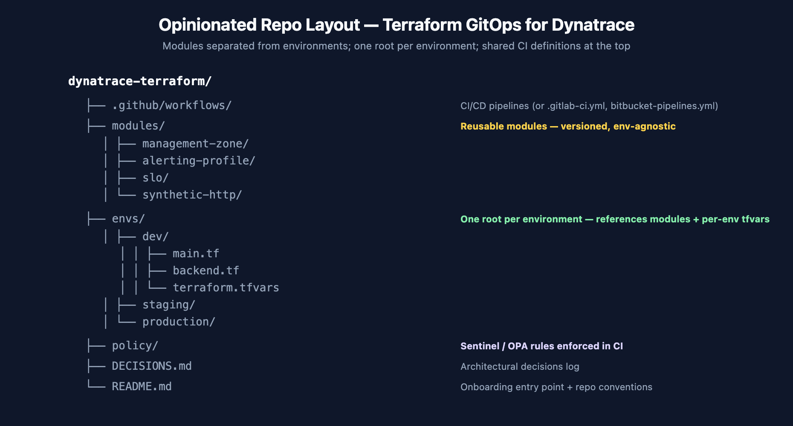
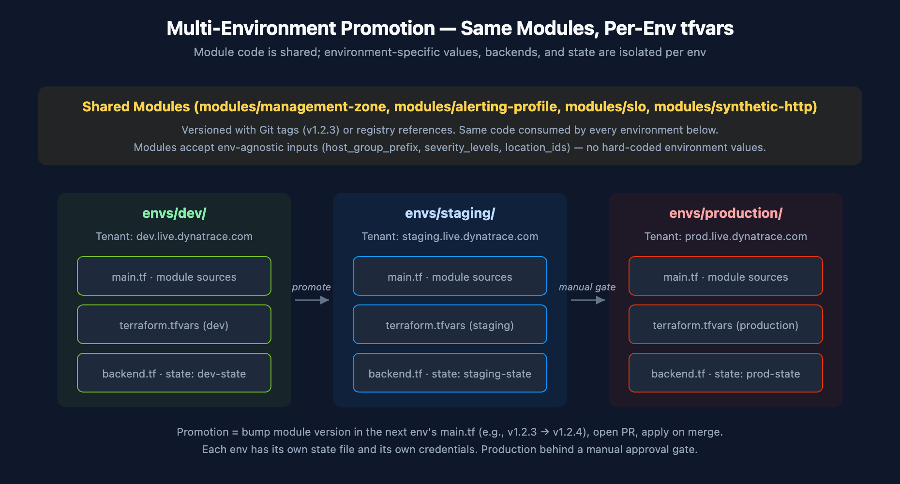
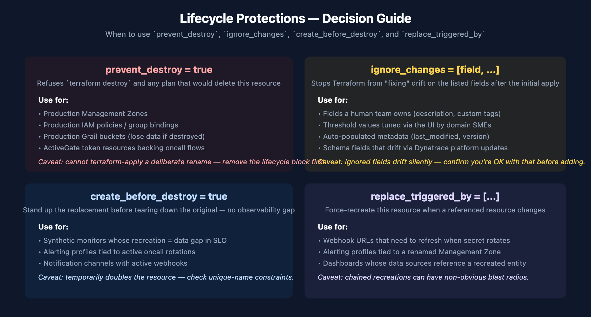

# AUTOM-09: Terraform GitOps Setup Recipe

> **Series:** AUTOM — Dynatrace Automation | **Notebook:** 9 of 9 | **Created:** May 2026 | **Last Updated:** 05/11/2026

A practical, opinionated recipe for standing up a Terraform GitOps shop for Dynatrace from scratch. This notebook covers what AUTOM-04 (Terraform resources) and AUTOM-07 (CI/CD integration) deliberately don't — repo layout, state backend choices, multi-environment promotion, lifecycle protections, secrets handling end-to-end, team onboarding, and operational realities. Use it as the bootstrap reference; consult AUTOM-04 for resource-level patterns and AUTOM-07 for CI/CD pipeline specifics.

> **Scope:** how to *set up* a Terraform GitOps shop. Not "Terraform basics" (use HashiCorp Learn) and not "what Dynatrace resources exist" (use AUTOM-04). This is the operational architecture between those two layers.

---

## Table of Contents

1. [Introduction — How This Recipe Fits](#introduction)
2. [Opinionated Repo Layout](#repo-layout)
3. [State Backend Setup](#state-backend)
4. [Provider Configuration and Version Discipline](#provider-config)
5. [Module Strategy](#module-strategy)
6. [Multi-Environment Promotion](#multi-env-promotion)
7. [CI/CD Pipeline (cross-reference)](#cicd-pipeline)
8. [Secrets Handling End-to-End](#secrets-handling)
9. [Lifecycle Protections](#lifecycle)
10. [Onboarding New App Teams](#onboarding)
11. [Cost and DPS Considerations](#cost)
12. [Operational Realities — State Lock, Break-Glass, DR](#operational)
13. [Next Steps](#next-steps)

---

<a id="prerequisites"></a>
## Prerequisites

| Requirement | Details |
|-------------|---------|
| **Audience** | Platform engineering team standing up a Terraform GitOps shop for Dynatrace |
| **Format** | Opinionated recipe — concrete examples + explicit defaults; not a buffet of options |
| **Assumes** | Working knowledge of Terraform (HCL, modules, state, providers); familiarity with one Git host (GitHub / GitLab / Bitbucket Cloud) |
| **Companion notebooks** | **AUTOM-04** for resource-level patterns; **AUTOM-07** for CI/CD pipeline details; **AUTOM-01 §5** for when-to-add-Monaco framing; **FAQ-02** for tagging strategy |
| **Out of scope** | Terraform fundamentals (HashiCorp Learn covers this); Monaco workflows (AUTOM-03); Workflows-based automation (AUTOM-05) |

<a id="introduction"></a>
## 1. Introduction — How This Recipe Fits

AUTOM-04 documents what Terraform resources exist for Dynatrace. AUTOM-07 documents how to wire those resources to a CI/CD pipeline. This notebook fills the operational gap between them: the repo layout, backend setup, lifecycle protections, secrets handling, and team-onboarding mechanics that determine whether your Terraform GitOps shop will be cleanly operable in 12 months — or a state-management swamp.

### What this notebook is not

- **Not a Terraform tutorial.** Use the [HashiCorp Learn](https://developer.hashicorp.com/terraform/tutorials) tracks if you need provider basics.
- **Not a substitute for AUTOM-04 + AUTOM-07.** Those notebooks remain the canonical references for resource catalog and pipeline patterns; this one orchestrates the surrounding operational architecture.
- **Not a Monaco-vs-Terraform debate.** That question is addressed in **AUTOM-01 §5: When a Terraform Shop Should Add Monaco**. This notebook assumes you've already committed to Terraform as the primary tool.

### The opinionated stance

There are many "valid" Terraform layouts. This recipe picks one — separate-modules-and-environments — because in practice that's the layout most production Terraform shops converge to after a year of operating. Picking it on day one saves you the inevitable refactor.

> <sub>**Sources:** [Terraform configuration language (HashiCorp)](https://developer.hashicorp.com/terraform/language) — module and root configuration concepts. **Derived:** the "separate-modules-and-environments" recommendation is community / engagement guidance grounded in the modules-as-reusable-units pattern documented by HashiCorp, applied to Dynatrace's per-environment tenant model.</sub>

<a id="repo-layout"></a>
## 2. Opinionated Repo Layout



<!-- MARKDOWN_TABLE_ALTERNATIVE
| Path | Purpose |
|------|---------|
| `.github/workflows/` | CI/CD pipelines (or `.gitlab-ci.yml`, `bitbucket-pipelines.yml`) |
| `modules/` | Reusable modules — versioned, environment-agnostic |
| `modules/management-zone/` | One module per Dynatrace resource family |
| `modules/alerting-profile/` | Same |
| `modules/slo/` | Same |
| `modules/synthetic-http/` | Same |
| `envs/dev/` | Dev environment root — references modules + per-env tfvars |
| `envs/dev/main.tf` | Module instantiations |
| `envs/dev/backend.tf` | State backend config |
| `envs/dev/terraform.tfvars` | Per-environment values |
| `envs/staging/` | Staging environment root (same structure as dev) |
| `envs/production/` | Production environment root (same structure as dev) |
| `policy/` | Sentinel / OPA / Conftest rules enforced in CI |
| `DECISIONS.md` | Architectural decisions log |
| `README.md` | Onboarding entry point + repo conventions |
For environments where SVG doesn't render
-->

### Why this layout

| Layer | Purpose | What changes when |
|-------|---------|-------------------|
| **`modules/<resource-family>/`** | Reusable building blocks; environment-agnostic; versioned independently | A pattern is added or refined (new field, new validation) |
| **`envs/<env>/`** | Per-environment composition; references modules with `source = "../../modules/<...>"` or by Git tag | An environment-specific value changes (new MZ name, threshold, location) |
| **`policy/`** | Pre-apply guardrails: Sentinel for HCP Terraform, OPA/Conftest for self-hosted CI | A new governance rule is added (mandatory tag, naming convention) |

The line between `modules/` and `envs/` is the **environment-agnostic vs environment-specific** line. If a value differs between staging and production, it lives in `envs/<env>/terraform.tfvars`, not in the module.

### What goes where — concrete examples

| Concern | Module input or root variable? |
|---------|-------------------------------|
| Management Zone naming pattern (`{env}-{app}-{role}`) | Module input — the pattern itself is shared |
| The specific env / app / role values | Root tfvars per env |
| Severity thresholds | Module input with sensible defaults; override in root tfvars per env |
| Synthetic location IDs | Root tfvars per env — the IDs differ by tenant |
| Sentinel policies | Top-level `policy/` directory — not per-env |
| Provider version constraint | Top-level `versions.tf` shared by every root via symlink, or duplicated identically |

### Two-repo variant — modules separate from consumer (community-validated pattern)

A common variant promoted in [a May 2026 Dynatrace Guild thread](https://community.dynatrace.com/t5/Dynatrace-Guild/Looking-for-Best-Practices-on-using-Terraform-for-Dynatrace/td-p/299276) splits modules and consumer into **two repositories** rather than the single-repo single-tree above:

| Repo | Role |
|---|---|
| `dynatrace-modules` (or per-resource-family: `dynatrace-dashboards`, `dynatrace-alerting`, `dynatrace-anomalies`, `dynatrace-global-settings`) | Reusable modules. Versioned with Git tags (`v1.4.0`); released as immutable artifacts. |
| `dynatrace-config-platform` (consumer) | Environment-specific configuration only. References modules via pinned Git tags. |

The consumer repo organizes by ownership rather than by environment alone:

```
dynatrace-config-platform/
├─ org/
│  ├─ _account_template/             # ← Shared root used by every environment below
│  │  ├─ backend.tf                  # Remote state backend config (S3 + DynamoDB locking)
│  │  ├─ modules.tf                  # Calls reusable modules with pinned Git-tag versions
│  │  ├─ variables.tf                # Input variable definitions
│  │  ├─ locals.tf                   # Derived values (env flags, naming conventions)
│  │  └─ provider.tf                 # Provider auth/region setup
│  └─ spoke/
│     └─ team-a/
│        ├─ dev/
│        │  ├─ terraform.tfvars      # Dev-only values
│        │  ├─ management_zones/     # JSON configs consumed by modules
│        │  └─ alerting_profiles/
│        └─ prod/
│           ├─ terraform.tfvars      # Prod-only values
│           └─ dashboards/
└─ .github/workflows/                # (or .azure-pipelines/, .buildkite/, etc.)
```

**The `_account_template/` shared root** is the key element. Rather than duplicating `backend.tf`, `provider.tf`, `versions.tf` into each env directory (the single-repo pattern above), each team / env directory **symlinks or templates from `_account_template/`** to inherit the shared Terraform boilerplate. Changes to the backend or provider config land in one place; every env picks them up.

**Module enablement via `locals` + conditional `for_each` / `count`** is the per-env-customization knob inside the shared root. Pattern:

```hcl
# _account_template/locals.tf
locals {
  env_flags = {
    dev  = { enable_synthetic = false, enable_slos = false }
    prod = { enable_synthetic = true,  enable_slos = true }
  }
  flags = local.env_flags[var.env]
}

# _account_template/modules.tf
module "synthetic_http" {
  source   = "git::https://example.com/dynatrace-modules.git//synthetic-http?ref=v1.4.0"
  for_each = local.flags.enable_synthetic ? var.synthetic_monitors : {}
  # ...
}
```

The flag pattern lets staging skip expensive resources (synthetic monitors consume DPS — see §11) while production runs the full set, all from the same root configuration.

### When to pick the two-repo variant vs the single-repo layout above

| Single-repo (modules/ + envs/) | Two-repo (modules separate) |
|---|---|
| Small platform team (1-3 people); modules co-developed with envs | Multiple platform teams; modules consumed by many product repos |
| Module changes and env changes go in the same PR routinely | Module releases are deliberate events (Git tag → consumer bumps version) |
| Lower ceremony; faster iteration on module shape | Stronger versioning discipline; module authors and consumers have separate review chains |

The single-repo layout is the right starting point. **Migrate to the two-repo variant when**: (a) more than ~3 product teams are consuming the modules, OR (b) module changes start blocking env changes (or vice versa) due to PR-queue contention, OR (c) audit / compliance requires that the modules code-base is reviewed separately from environment configs.

### When to deviate further

- **Monorepo with many products.** Sub-divide `envs/` further (e.g., `envs/<product>/<env>/`) and consider git submodules for modules consumed by multiple products.
- **Truly separate platform teams.** Put `modules/` in its own repo, version with Git tags or a private Terraform registry, consume from product-team repos by reference — the two-repo variant above is the canonical shape of this.

> <sub>**Sources:**</sub>
> - <sub>[Module composition (HashiCorp)](https://developer.hashicorp.com/terraform/language/modules/develop/composition) — the "root module + child modules" model.</sub>
> - <sub>[Standard module structure (HashiCorp)](https://developer.hashicorp.com/terraform/language/modules/develop/structure) — the `main.tf`/`variables.tf`/`outputs.tf` convention used in `modules/<resource-family>/`.</sub>

<a id="state-backend"></a>
## 3. State Backend Setup

State is the durable record of what Terraform manages. Remote backends matter for three reasons: concurrent-apply safety (state locking), audit (state history), and shared visibility (multiple people can see the same state). Local-file state is fine for solo experimentation; it is not fine for a team.

### Choosing a backend

| Backend | Choose when | Trade-off |
|---------|-------------|-----------|
| **HCP Terraform** (`cloud {}`) | You want managed state + run-on-HCP + Sentinel policy enforcement out-of-box | Paid SaaS; ties you to HashiCorp; runs originate on HCP unless you configure agents |
| **S3 + DynamoDB lock** | You're an AWS shop already; want self-hosted; have ops capacity to maintain it | Two AWS resources to keep healthy; bucket + DynamoDB table both need encryption + versioning |
| **GCS** (with built-in locking) | You're a GCP shop; want self-hosted | Built-in locking simpler than the S3+DynamoDB pair |
| **Azure Storage** (with built-in lease-based locking) | You're an Azure shop | Built-in locking via blob lease |

> The four examples below show one `backend.tf` per environment. Each environment has its own state file / workspace — the line between envs is the line between state files. Cross-env access happens via `terraform_remote_state` data sources (used sparingly).

### HCP Terraform backend

```hcl
# envs/production/backend.tf
terraform {
  cloud {
    organization = "my-org"
    workspaces {
      name = "dynatrace-production"
    }
  }
}
```

Workspace per environment; HCP manages state, locking, and run history. Sentinel policies attach to the workspace.

### S3 + DynamoDB lock backend

```hcl
# envs/production/backend.tf
terraform {
  backend "s3" {
    bucket         = "my-org-terraform-state-prod"
    key            = "dynatrace/terraform.tfstate"
    region         = "us-east-1"
    encrypt        = true
    dynamodb_table = "terraform-state-lock"
    kms_key_id     = "arn:aws:kms:us-east-1:123456789012:key/abcd-..."
  }
}
```

**Bucket setup checklist:**
- Versioning enabled (recovery from accidental state deletion)
- Server-side encryption with KMS CMK (not just SSE-S3)
- Public-access block on
- Lifecycle policy keeping at least 90 days of versions
- Bucket policy restricting access to the CI/CD service principal + the platform team

**State-key naming — derive from repo + env path:** for shops with multiple Dynatrace-Terraform repos sharing one state bucket, derive the S3 key from `<repo-name>/<env-path>/terraform.tfstate` rather than a flat `dynatrace/<env>.tfstate`. Examples: `dynatrace-config-platform/team-a/prod/terraform.tfstate`, `dynatrace-tenant-bootstrap/sandbox/terraform.tfstate`. This isolation lets multiple repos coexist in one bucket without key collisions; the bucket-policy + KMS-key boundary still applies at the prefix level. A simple `backend.tf` template that interpolates the key from repo + env:

```hcl
terraform {
  backend "s3" {
    bucket = "my-org-terraform-state-prod"
    # key set per-env in backend config file or via -backend-config flag:
    # key = "<repo-name>/<env-path>/terraform.tfstate"
    region         = "us-east-1"
    encrypt        = true
    dynamodb_table = "terraform-state-lock"
    kms_key_id     = "arn:aws:kms:us-east-1:123456789012:key/abcd-..."
  }
}
```

Initialize per-env: `terraform init -backend-config="key=dynatrace-config-platform/team-a/prod/terraform.tfstate"`.

**DynamoDB lock table:**
- Primary key: `LockID` (string)
- On-demand billing (locks are short-lived; provisioned is wasteful)
- Point-in-time recovery enabled

### GCS backend

```hcl
# envs/production/backend.tf
terraform {
  backend "gcs" {
    bucket  = "my-org-terraform-state-prod"
    prefix  = "dynatrace/"
  }
}
```

Built-in locking via GCS object generation. Less infrastructure to maintain than S3+DynamoDB. Enable bucket versioning + CMEK for parity.

### Azure Storage backend

```hcl
# envs/production/backend.tf
terraform {
  backend "azurerm" {
    resource_group_name  = "rg-terraform-state-prod"
    storage_account_name = "myorgtfstateprod"
    container_name       = "tfstate"
    key                  = "dynatrace.tfstate"
  }
}
```

Lease-based locking via Azure Blob. Enable soft-delete + versioning on the container; configure customer-managed keys if compliance requires.

### State backup and DR

Regardless of backend, treat the state file like a tier-0 asset:

1. **Versioning enabled** on the storage layer (S3 versions / GCS object versions / Azure soft-delete). Not optional.
2. **Periodic snapshots** to a separate cold storage location for true DR (cross-region copy, separate account). Quarterly minimum; monthly if you make frequent destructive changes.
3. **Documented restoration procedure.** Test it. A state file you can't restore from is a state file you don't have.
4. **Never edit state by hand in production.** Use `terraform state` subcommands; record every state-surgery operation in a runbook.

> <sub>**Sources:**</sub>
> - <sub>[Backend types (HashiCorp)](https://developer.hashicorp.com/terraform/language/backend) — backend configuration reference.</sub>
> - <sub>[S3 backend (HashiCorp)](https://developer.hashicorp.com/terraform/language/backend/s3), [GCS backend (HashiCorp)](https://developer.hashicorp.com/terraform/language/backend/gcs), [Azure backend (HashiCorp)](https://developer.hashicorp.com/terraform/language/backend/azurerm) — per-backend config details.</sub>
> - <sub>**Derived:** the bucket-setup checklist (versioning + CMK + public-access-block + lifecycle + bucket policy) is industry-standard cloud-storage hardening applied to state buckets specifically; not vendor-documented as a single checklist.</sub>

<a id="provider-config"></a>
## 4. Provider Configuration and Version Discipline

Provider version drift bites Terraform shops harder than almost anything else. A simple `~>` constraint discipline avoids most of the pain.

### Top-level `versions.tf` per environment

```hcl
# envs/production/versions.tf
terraform {
  required_version = "~> 1.15"

  required_providers {
    dynatrace = {
      source  = "dynatrace-oss/dynatrace"
      version = "~> 1.96"
    }
    aws = {
      source  = "hashicorp/aws"
      version = "~> 6.0"
    }
  }
}
```

### Constraint discipline

| Constraint | Meaning | Use when |
|------------|---------|----------|
| `version = "1.96.3"` | Exact pin | Never (loses bug fixes) |
| `version = "~> 1.96"` | Allows 1.96.x patch versions only (`>= 1.96, < 1.97`) | Production — get patches, not feature changes |
| `version = "~> 1.96, < 2.0"` | Allows 1.x ≥ 1.96 | Most environments — get minor and patch versions, gate at major |
| `version = ">= 1.96"` | Any ≥ 1.96 | Avoid — no upper bound, breaks unpredictably |

The middle two are the practical defaults. Use the **tighter** form (`~> 1.96`) in production once you've validated a specific minor; use the **looser** form (`~> 1.96, < 2.0`) in dev/staging to catch minor-version changes early.

### Combined auth in the provider config

```hcl
# envs/production/main.tf
provider "dynatrace" {
  dt_env_url   = var.dt_env_url
  dt_api_token = var.dt_api_token
  # Platform Token is read from DT_PLATFORM_TOKEN env var
  # HTTP_OAUTH_PREFERENCE=true should be set in the CI/CD env
}
```

See **AUTOM-07 §3.1 Terraform Workflow with Combined Auth** for the full pattern — Platform Token + API Token together give full Dynatrace resource coverage. Don't pick one; use both.

### Upgrade cadence

| Cadence | What to do |
|---------|-----------|
| **Every Dynatrace provider release** | Skim the release notes; flag breaking changes; defer minor bumps until staging-validated |
| **Quarterly** | Bump the production version constraint after staging has been on the newer version for 2–4 weeks without issue |
| **On a known breaking change** | Coordinate the bump across all envs in one PR; bring a rollback plan |

The Dynatrace provider has been on a steady cadence (8 minor versions in 6 months as of May 2026 — v1.88 through v1.96). Staying current is straightforward if you treat it as a recurring chore.

> <sub>**Sources:**</sub>
> - <sub>[Provider requirements (HashiCorp)](https://developer.hashicorp.com/terraform/language/providers/requirements) — `required_providers` syntax.</sub>
> - <sub>[Version constraints (HashiCorp)](https://developer.hashicorp.com/terraform/language/expressions/version-constraints) — `~>`, `>=`, exact-pin semantics.</sub>
> - <sub>[dynatrace-oss/terraform-provider-dynatrace releases (GitHub)](https://github.com/dynatrace-oss/terraform-provider-dynatrace/releases) — release cadence reference (current: v1.96.0, May 2026).</sub>

<a id="module-strategy"></a>
## 5. Module Strategy

Modules are how you keep the codebase from sprawling as you add resources. The decisions: what to modularize, how to version, and where to put modules consumed by multiple products.

### What to modularize

**Modularize when:**

- The same resource shape will be created multiple times with different inputs (e.g., 20 management zones, each following the same naming + tagging pattern → one MZ module instantiated 20 times)
- A resource has many supporting resources that always go together (e.g., a synthetic monitor + alerting profile + notification channel → one bundle module)
- A pattern encodes governance rules (e.g., a module that *always* sets `dt.security_context` and a mandatory tag set)

**Don't modularize when:**

- A resource exists exactly once (most platform-wide configs — wrapping a single management-zone definition in a module just adds indirection)
- The "module" would have one input and one output (premature abstraction)

### Versioning modules

| Approach | Use when |
|----------|----------|
| **Local-path references** (`source = "../../modules/management-zone"`) | Same repo as the consumer; fastest iteration |
| **Git tag references** (`source = "git::https://gitlab.example.com/platform/terraform-modules.git//management-zone?ref=v1.4.0"`) | Modules in a separate repo, consumed by multiple product repos; clear version semantics |
| **Terraform registry** (private or public) | You publish to a registry (HCP Terraform private registry, Artifactory) and want UI browsing + version metadata |

Pick one per repo; mixing leads to confusion about where modules live.

### Semantic versioning for modules

- **Patch (1.4.0 → 1.4.1)** — bug fix, no input or output change
- **Minor (1.4.0 → 1.5.0)** — new optional input with a sensible default; new output; no breaking change
- **Major (1.x → 2.0.0)** — required input added, input removed, output removed, resource address changed

Treat module versions as a contract with consumers. Renaming a resource inside a module without a major version bump breaks every consumer's plan on next apply.

### A representative module

```hcl
# modules/management-zone/main.tf
variable "env"      { type = string }
variable "app"      { type = string }
variable "role"     { type = string }
variable "owner_tag" { type = string }

resource "dynatrace_management_zone_v2" "this" {
  name = "${var.env}-${var.app}-${var.role}"

  rules {
    type             = "ME"
    enabled          = true
    propagation_type = "HOST_TO_PROCESS_GROUP_INSTANCE"

    conditions {
      key {
        attribute = "HOST_GROUP_NAME"
      }
      string_conditions {
        operator       = "EQUALS"
        value          = "${var.env}-${var.app}"
        case_sensitive = false
      }
    }
  }
}

output "id"   { value = dynatrace_management_zone_v2.this.id }
output "name" { value = dynatrace_management_zone_v2.this.name }
```

The module encodes the naming pattern (`{env}-{app}-{role}`) and the rule structure. Consumers can't accidentally name a management zone differently — the convention is enforced at the module boundary.

> <sub>**Sources:**</sub>
> - <sub>[Module development (HashiCorp)](https://developer.hashicorp.com/terraform/language/modules/develop) — module-authoring guidance.</sub>
> - <sub>[Module sources (HashiCorp)](https://developer.hashicorp.com/terraform/language/modules/sources) — local paths, Git, registry references.</sub>
> - <sub>[Semantic Versioning 2.0.0](https://semver.org/) — `MAJOR.MINOR.PATCH` semantics applied to modules.</sub>

<a id="multi-env-promotion"></a>
## 6. Multi-Environment Promotion

The whole point of the modules + envs split is enabling promotion: the same module code runs against three different tenants with three different `tfvars` and three different state files.



<!-- MARKDOWN_TABLE_ALTERNATIVE
| Layer | dev | staging | production |
|-------|-----|---------|------------|
| Module code | shared | shared | shared |
| tfvars | dev values | staging values | production values |
| Backend / state | dev-state | staging-state | prod-state |
| Tenant | dev.live.dynatrace.com | staging.live.dynatrace.com | prod.live.dynatrace.com |
| Gate | auto on merge | auto on merge | manual approval |
For environments where SVG doesn't render
-->

### The promotion workflow

1. **Change goes through `envs/dev/` first.** A PR adds or modifies a resource in `envs/dev/main.tf` (or bumps a module-source ref). CI runs `terraform plan` against the dev tenant; on PR approval and merge, `terraform apply` against dev.
2. **Validation in dev.** The team confirms the change behaves correctly in dev — alerts fire, dashboards render, synthetics pass.
3. **Promotion PR to `envs/staging/`.** Same module source ref + corresponding `tfvars` change. CI plans against staging. On merge → apply.
4. **Production promotion gated.** A PR to `envs/production/` requires a separate review (CODEOWNERS) and a manual approval step in the CI pipeline. The plan is reviewed by a human before apply.

### What gets copied vs what diverges

| Element | Same across envs? |
|---------|-------------------|
| Module source ref (`source = "../../modules/<name>"` or `?ref=v1.4.0`) | **Yes** — that's the whole point |
| Resource-shape inputs (which fields the module accepts) | **Yes** — schema is shared |
| Resource-value inputs (the values themselves) | **No** — these live in per-env `tfvars` |
| Backend block (where state lives) | **No** — each env has its own state |
| Provider config (tenant URL, credentials) | **No** — each env points at its own tenant |
| Sentinel / OPA policies | **Yes** — same governance rules everywhere |

### Catching env divergence early

It's common for `envs/production/main.tf` to drift from `envs/staging/main.tf` in subtle ways — someone added a resource to prod directly without backporting to staging. Two guardrails:

- **Periodic diff check.** A CI job that runs `diff envs/staging/main.tf envs/production/main.tf` (filtering out expected differences like backend) and flags divergence above a tolerance.
- **Required PR template** that asks "Did you make the same change in staging?" before allowing a prod PR.

### When to use Terraform workspaces instead

Terraform workspaces (`terraform workspace new staging`) are an alternative to the `envs/<env>/` directory pattern: same files, different state per workspace. **Don't.** Workspaces share `main.tf` between envs, which means production changes get applied to dev (and vice versa) the moment you forget to switch workspaces. Directory-per-env is mechanically harder to misuse — if you're editing `envs/production/main.tf`, you know what you're working on.

> <sub>**Sources:**</sub>
> - <sub>[Terraform workspaces (HashiCorp)](https://developer.hashicorp.com/terraform/language/state/workspaces) — workspace mechanics (which we recommend *against* in favor of directory-per-env).</sub>
> - <sub>**Derived:** the directory-per-env-vs-workspaces recommendation is community / engagement guidance grounded in the failure mode of workspace switching across envs; HashiCorp does not take a position either way in its docs.</sub>

<a id="cicd-pipeline"></a>
## 7. CI/CD Pipeline (cross-reference)

This recipe assumes a Terraform plan-and-apply pipeline. The full implementation details for GitHub Actions, GitLab CI, Bitbucket Pipelines, ArgoCD, and FluxCD are in **AUTOM-07**. Highlights relevant to the recipe:

| AUTOM-07 section | What it covers |
|------------------|----------------|
| §3 GitHub Actions | Combined-auth Terraform workflow, Vault integration, drift detection, reusable workflows |
| §3.1 Terraform Workflow with Combined Auth | Platform Token + API Token together — the canonical pattern |
| §3.2 Vault Integration | Pulling short-lived credentials at pipeline start |
| §3.3 Policy-as-Code Gates | Sentinel / OPA / Conftest integration |
| §3.4 Drift Detection | Scheduled `terraform plan` runs that report diffs to a channel |
| §4 GitLab CI/CD | GitLab equivalent of the above |
| §5 Bitbucket Pipelines | Bitbucket Cloud Pipelines + FabianSchurig/bitbucket Terraform provider for the combined-workspace pattern |
| §9 Best Practices | Branch protection, required reviewers, plan-output retention |
| §10 Governance Architecture — Single SA Writer | Operational model for who can apply |

### Recipe-specific CI/CD recommendations

| Recommendation | Why |
|----------------|-----|
| **Plan on every PR; apply only on merge to a long-lived env branch** | Plan is read-only; apply is the privileged operation |
| **Plan output retained as an artifact** | Required for audit; required for "what was about to happen?" forensics |
| **Plan summary posted to the PR** | Reviewers see the diff without leaving the PR |
| **Required reviewers per environment** (CODEOWNERS) | Production requires platform-team review; dev can be self-merge |
| **Apply uses `--auto-approve` only after gate passes** | Manual approval gate (GH environments / GitLab environments / Bitbucket deployments) before production apply |
| **Sentinel / OPA runs before apply** | Policy gate fails the apply, not the plan — keep plan output unblocked for review |

> <sub>**Sources:** **AUTOM-07: CI/CD Integration** (this repo) covers each pipeline platform in detail.</sub>

<a id="secrets-handling"></a>
## 8. Secrets Handling End-to-End

Three places secrets live in a Terraform GitOps shop: **in pipeline storage**, **in flight**, and **at rest in state**. Each needs explicit handling.

### Pipeline-stored secrets

Where the Dynatrace tokens, cloud provider credentials, and Vault tokens come from. Options:

| Mechanism | Trade-off |
|-----------|-----------|
| **GitHub Actions encrypted secrets** | Easy; tied to GitHub; secrets exposed only to workflow runs |
| **GitLab CI/CD variables** | Easy; tied to GitLab; per-env masking + protection flags |
| **Bitbucket repository / deployment variables** | Easy; tied to Bitbucket; secured variable becomes write-only |
| **Vault (or AWS Secrets Manager / Azure Key Vault)** | Best — short-lived credentials, audit trail, decoupled from CI tool |
| **OIDC federation to cloud → cloud secrets manager → Dynatrace token** | Most secure but most plumbing; appropriate for high-stakes envs |

The pragmatic baseline: pipeline-native secrets for the bootstrap; migrate to Vault once you have multiple envs and need rotation discipline.

### In-flight secrets — Terraform variables

Mark every sensitive input:

```hcl
variable "dt_api_token" {
  type      = string
  sensitive = true
}

variable "dt_platform_token" {
  type      = string
  sensitive = true
}
```

`sensitive = true` does three things:

1. **Plan output masks the value** — `terraform plan` shows `(sensitive value)` instead of the token
2. **Apply output masks the value** — same masking in the success log
3. **Outputs that pass sensitive values through inherit the marking** — propagation prevents accidental exposure downstream

It does **not** encrypt the value in state. State is in plaintext; the masking is for *log* output only.

### At-rest secrets — state encryption

Terraform state contains every value the provider returned, including some sensitive ones (refresh tokens, generated secrets). Protect state at rest:

| Backend | Mechanism |
|---------|-----------|
| **HCP Terraform** | Encrypted by default; access via workspace permissions |
| **S3** | KMS CMK (not just SSE-S3) — KMS gives you key rotation + audit |
| **GCS** | CMEK (customer-managed encryption key) |
| **Azure Storage** | Customer-managed key in Key Vault |

Additionally for self-hosted backends: bucket policy restricting access to the CI service principal + the platform team — and **nobody else**. State files exfiltrated from a misconfigured bucket give the attacker every secret Terraform managed.

### Plan output discipline

`terraform plan -out=tfplan` writes the plan to a binary file that contains the proposed state — including pending secret values. Two rules:

1. **Don't retain the binary tfplan artifact** beyond the apply step. Encrypt it in transit between plan and apply jobs.
2. **`terraform show -no-color tfplan > plan.txt` for human review** — `-no-color` keeps it diffable, and the `sensitive` markings hide values in the rendered text.

> <sub>**Sources:**</sub>
> - <sub>[Sensitive input variables (HashiCorp)](https://developer.hashicorp.com/terraform/language/values/variables#suppressing-values-in-cli-output) — `sensitive` semantics.</sub>
> - <sub>[Sensitive output values (HashiCorp)](https://developer.hashicorp.com/terraform/language/values/outputs#sensitive-suppressing-values-in-cli-output) — propagation through outputs.</sub>
> - <sub>[Backend encryption (HashiCorp)](https://developer.hashicorp.com/terraform/language/state/sensitive-data) — state-at-rest concerns.</sub>

<a id="lifecycle"></a>
## 9. Lifecycle Protections

Lifecycle blocks are Terraform's safety net for production. Four meta-arguments matter; each has a specific use case.



<!-- MARKDOWN_TABLE_ALTERNATIVE
| Meta-argument | Effect | Use for |
|---------------|--------|---------|
| `prevent_destroy = true` | Refuses any plan that would delete this resource | Production MZs, IAM policies, Grail buckets, ActiveGate tokens |
| `ignore_changes = [field, ...]` | Stops Terraform from "fixing" drift on listed fields | Human-owned fields (description, tags), UI-tuned thresholds, auto-populated metadata |
| `create_before_destroy = true` | New resource stood up before old one removed | Synthetics, alerting profiles, notification channels (no observability gap) |
| `replace_triggered_by = [ref, ...]` | Force-recreate when a referenced resource changes | Webhook URLs tied to rotated secrets, alerting profiles tied to renamed MZs |
For environments where SVG doesn't render
-->

### `prevent_destroy` — for resources whose loss is catastrophic

```hcl
resource "dynatrace_management_zone_v2" "platform_baseline" {
  name = "platform-baseline"
  # ...

  lifecycle {
    prevent_destroy = true
  }
}
```

Catches `terraform destroy` and any plan that would `-/+` the resource. The plan fails with an error and the apply doesn't proceed.

**Use for:** production Management Zones (lose IAM scope + alerting routing if destroyed), production IAM policies / group bindings (lose access), production Grail buckets (lose data), ActiveGate token resources backing on-call notifications.

**Caveat:** you can't terraform-apply a deliberate rename. To rename, remove the lifecycle block in PR 1, apply, then re-add it in PR 2.

### `ignore_changes` — for fields owned by humans

```hcl
resource "dynatrace_calculated_service_metric" "request_count" {
  name = "request-count"
  # ... most fields managed by Terraform ...

  lifecycle {
    ignore_changes = [
      description,   # SMEs edit this in the UI
      conditions[0].condition_key.attribute,  # Auto-populated by Dynatrace
    ]
  }
}
```

**Use for:** description fields, custom tags, threshold values tuned via the UI by domain experts, auto-populated metadata (last_modified, version), schema fields that drift via Dynatrace platform updates.

**Caveat:** ignored fields drift silently. Confirm you're OK with that before adding — the field becomes invisible to drift detection.

### `create_before_destroy` — for resources where recreation = outage

```hcl
resource "dynatrace_http_monitor" "checkout_api" {
  name = "checkout-api-availability"
  # ...

  lifecycle {
    create_before_destroy = true
  }
}
```

**Use for:** synthetic monitors (recreation = data gap in SLO), alerting profiles tied to active on-call rotations, notification channels with active webhooks.

**Caveat:** temporarily doubles the resource. Check that unique-name constraints in Dynatrace allow the new resource to exist alongside the old — most do; some don't (e.g., some named-singleton settings).

### `replace_triggered_by` — for chained recreations

```hcl
resource "dynatrace_alerting_profile" "payments_alerts" {
  # ...

  lifecycle {
    replace_triggered_by = [
      dynatrace_management_zone_v2.payments.id,
    ]
  }
}
```

**Use for:** webhook URLs that need to refresh when a secret rotates, alerting profiles tied to a renamed Management Zone, dashboards whose data sources reference a recreated entity.

**Caveat:** chained recreations have non-obvious blast radius — adding `replace_triggered_by` to a hub resource can cascade to many dependents. Add deliberately.

### Apply protections at the module boundary, not per-resource

If your module-management-zone always wants `prevent_destroy` for production, encode it in the module — don't depend on every consumer to remember.

```hcl
# modules/management-zone/main.tf
variable "protect_from_destroy" {
  type    = bool
  default = false
}

resource "dynatrace_management_zone_v2" "this" {
  # ...

  lifecycle {
    prevent_destroy = var.protect_from_destroy
  }
}
```

Then in `envs/production/main.tf`:

```hcl
module "platform_baseline" {
  source              = "../../modules/management-zone"
  env                 = "prod"
  app                 = "platform"
  role                = "baseline"
  protect_from_destroy = true  # ← only prod sets this
}
```

> <sub>**Sources:** [The lifecycle meta-argument (HashiCorp)](https://developer.hashicorp.com/terraform/language/meta-arguments/lifecycle) — all four meta-arguments documented.</sub>

<a id="onboarding"></a>
## 10. Onboarding New App Teams

Once the platform team's Terraform GitOps shop is running, the next question is how product teams join. The architecture decision is the **brokered self-service** pattern from AUTOM-04 §7 — but the **onboarding mechanics** are what determine whether new teams ramp up in days or in weeks.

### The onboarding workflow

1. **Team requests onboarding.** Lightweight intake form: team name, product, expected resource types (which modules will they use), expected scale (handful of MZs? hundreds of synthetics?), preferred Git host.
2. **Platform team provisions the team's namespace.**
   - A subdirectory under `envs/<env>/` per product (e.g., `envs/production/payments/`)
   - A Bitbucket / GitLab / GitHub team with write access to that subdirectory only (CODEOWNERS enforces)
   - An OPA / Sentinel policy that restricts that team's resources to a specific management zone scope (the "team-fencing" pattern)
3. **Team gets a template PR.**
   - `envs/<env>/<product>/main.tf` with a starter module instantiation (one MZ following the team's naming pattern)
   - `envs/<env>/<product>/terraform.tfvars` with placeholder values
   - A README pointing at the company's Terraform conventions
4. **Team's first PR validates the path.** Real change, real review, real apply against dev. Platform team co-reviews. After this PR merges, the team has a working pipeline + the muscle memory.
5. **Promotion drill.** Within the first 2 weeks, the team promotes the same change to staging and production with platform-team coaching. Now they own the operational rhythm.

### Repo template

Maintain a `templates/team-onboarding/` directory containing:

```
templates/team-onboarding/
├── main.tf              # Minimal example with one module
├── terraform.tfvars     # Placeholder values
├── README.md            # Team-specific conventions
└── CODEOWNERS.snippet   # CODEOWNERS lines to append
```

The first PR copies this directory into `envs/<env>/<product>/` and customizes. The template is itself versioned — when the platform team learns something new about onboarding, the template improves and the next team benefits.

### Boundary enforcement

A new team should never be able to:

- Modify modules they don't own (CODEOWNERS on `modules/` requires platform-team approval)
- Modify another team's directory (CODEOWNERS on `envs/<env>/<other-product>/`)
- Bypass the Sentinel / OPA policies (CI cannot be merged-around)
- Get direct API access to Dynatrace (per AUTOM-04 §7 — the pipeline is the only writer)

These are enforced at three layers: Git host permissions, CODEOWNERS, and CI gates. All three need to be set for new teams during onboarding; one missing layer is the gap a future incident exploits.

### Off-boarding teams

Less glamorous but equally important. When a team's product is decommissioned:

1. **Identify resources owned by the team** via the `owner` tag (see FAQ-02 for tagging strategy)
2. **PR removing the team's `envs/<env>/<product>/` subdirectory**
3. **Run `terraform plan` to surface what gets destroyed** — review carefully
4. **Apply destruction in dev first**, validate clean removal, then staging, then production
5. **Off-board the Git team and remove CODEOWNERS** entries in a follow-up PR

The `prevent_destroy` lifecycle on critical resources may need to be temporarily removed for deliberate off-boarding — do this in a dedicated PR, not bundled with destruction.

> <sub>**Sources:**</sub>
> - <sub>**AUTOM-04 §7 Brokered Self-Service** (this repo) — the architectural pattern this section operationalizes.</sub>
> - <sub>**FAQ-02: Tagging — Sources, Standards, and Strategy** (this repo) — `owner` tag convention referenced in off-boarding.</sub>
> - <sub>**Derived:** the onboarding-workflow steps (intake → namespace → template → first PR → promotion drill) and off-boarding sequence are community / engagement guidance — not a vendor-documented procedure but consistent practice across platform teams running Terraform GitOps shops.</sub>

<a id="cost"></a>
## 11. Cost and DPS Considerations at Apply Time

Two cost surfaces that surprise teams new to Terraform GitOps for Dynatrace.

### Dynatrace Platform Subscription (DPS) impact at apply time

Some Dynatrace resources consume DPS / DDU at creation or use:

| Resource | DPS / DDU impact |
|----------|------------------|
| `dynatrace_calculated_service_metric` | Generates a custom metric — counts against custom-metric DDU allocation |
| `dynatrace_http_monitor` (synthetic) | Each monitor execution consumes Synthetic actions |
| `dynatrace_browser_monitor` | Each monitor execution consumes Synthetic actions (higher rate than HTTP) |
| `dynatrace_application_anomalies` (custom thresholds) | No direct DPS cost; can cause more events → more retention DDU |
| Mass-creation via a module loop (`count = 100`) | Multiplies the above by 100 |

The pattern that bites: someone runs `terraform apply` against a module configured with `count = var.synthetic_count`, the variable defaults to a number that looked sensible in dev but is too large for production, and the apply provisions hundreds of synthetics — each consuming actions.

**Guardrails:**

- **Mandatory `count` / `for_each` review** for resources that create per-instance Dynatrace billable units. CODEOWNERS or a Sentinel policy flagging these.
- **Pre-apply cost check** for environments above a size threshold — script that counts billable resources in the plan and posts a comment on the PR.
- **Quota alerts in Dynatrace** at the tenant level so unexpected scale surfaces before the bill does.

### Terraform plan / apply runtime cost

The Dynatrace API has rate limits. Plans against a tenant with hundreds of resources can take 5-20 minutes — apply, longer. Costs:

- **CI minutes** — runner time × number of plans per day. Drift-detection runs every 15 minutes against a 500-resource state file are not free.
- **Throttling failures** — large applies that hit API rate limits return errors mid-apply, leaving state partially updated. Recovery requires manual `terraform refresh` or partial apply.

**Guardrails:**

- **`terraform apply -parallelism=10`** instead of the default 10 — actually 10 is the default; consider lowering to 5 for very large tenants to avoid throttling.
- **Split large states.** If a single state file is over ~500 resources, consider splitting by product or by resource family. The boundary is the line of "this group rarely changes when that group changes."
- **Drift detection cadence.** Hourly is plenty for most environments; every-15-minutes is rarely justified by the value it adds.

> <sub>**Sources:**</sub>
> - <sub>**Derived:** the DPS-impact list combines documented Dynatrace billing categories with how each maps to Terraform resource types; not a single vendor-published checklist. Verify specific resource cost behavior against current [Dynatrace pricing documentation](https://www.dynatrace.com/pricing/) at use time.</sub>
> - <sub>[Terraform CLI command — apply (HashiCorp)](https://developer.hashicorp.com/terraform/cli/commands/apply) — `-parallelism` flag.</sub>

<a id="operational"></a>
## 12. Operational Realities — State Lock, Break-Glass, DR

Three operational scenarios every Terraform GitOps shop hits eventually.

### Stuck state lock

Symptom: `terraform plan` or `apply` hangs with *"Error acquiring the state lock"*.

Causes:
- Previous CI run killed mid-apply; lock not released
- Network partition between the CI runner and the lock store
- Lock-table outage (DynamoDB)
- Someone ran `terraform apply` from their laptop and Ctrl-C'd

Recovery:

1. **Confirm the lock is genuinely abandoned.** Check the lock-store record — the lock includes `Who`, `Operation`, `Created` timestamps. If `Created` is recent (< 10 min) and someone owns it, wait or message them.
2. **`terraform force-unlock <LOCK_ID>`** if the lock is abandoned. This removes the lock without doing anything to state.
3. **For HCP Terraform**, use the workspace UI's "Force cancel" — same idea, different UX.

Document the procedure in your team's runbook. Force-unlock is safe **when the lock is genuinely abandoned**; it is dangerous if another apply is mid-flight, because two applies running simultaneously corrupt state. Verify, don't guess.

### Break-glass UI changes

Sometimes someone has to change Dynatrace config in production at 3am via the UI — production is broken and waiting for a PR + review + apply takes too long. This is fine **as long as the change gets back into Terraform afterward**.

Recovery workflow:

1. **Document the change** in the incident channel at the time it's made (resource type, name, what changed).
2. **Within 24 hours**, open a PR that brings the change into Terraform. Two approaches:
   - **Edit the existing resource** in `envs/production/main.tf` to match what the UI now has.
   - **Run `terraform import`** if it's a brand-new resource created via UI.
3. **Run `terraform plan`** — it should now show **no changes** (Terraform sees the same state the UI created). If the plan shows changes, the resource has drift; reconcile.
4. **Apply.** This is a no-op apply that ratifies the UI change as Terraform-managed.

The danger pattern: break-glass change happens, nobody backports it, two weeks later a routine apply *reverts the emergency fix*. Audit periodically that no production resources have drifted from the Terraform definition.

### Disaster recovery — corrupted or lost state

Scenarios:
- State bucket accidentally deleted
- `terraform state rm` removed a resource and the next apply destroyed it
- A `terraform refresh` corrupted state due to a provider bug

Recovery sequence:

1. **Stop all CI pipelines** targeting the affected env. Prevent concurrent applies during recovery.
2. **Restore from state versioning.** S3 / GCS / Azure all have versioning if enabled (per §3). Restore the most recent known-good version. For HCP Terraform, restore from the workspace's state versions.
3. **`terraform plan`** against the restored state. The plan tells you what Terraform thinks is missing or extra compared to actual cloud / Dynatrace state.
4. **Reconcile manually.** If state shows a resource missing that actually exists in Dynatrace, `terraform import` it. If state shows a resource present that's been removed in Dynatrace, `terraform state rm` it.
5. **Resume CI.** With reconciled state, the next normal apply should be a no-op or only the intended pending changes.

If state was **never versioned** (a setup mistake — fix immediately), recovery is much harder: you essentially have to import every resource by hand. This is why §3's bucket-setup checklist insists on versioning.

### Practice the DR procedure

Run a state-loss DR drill once a quarter against a non-production environment:

1. Snapshot the dev state file
2. Simulate loss (rename the state file in storage)
3. Walk through the recovery procedure end-to-end
4. Time the recovery; identify the slowest step; document a fix

The drill is not optional — discovering that your "documented" DR procedure has a missing step during an actual incident is the worst time to find out.

> <sub>**Sources:**</sub>
> - <sub>[Force-unlock state (HashiCorp)](https://developer.hashicorp.com/terraform/cli/commands/force-unlock) — `terraform force-unlock` semantics and safety caveats.</sub>
> - <sub>[Terraform import (HashiCorp)](https://developer.hashicorp.com/terraform/cli/commands/import) — bringing UI-created resources into Terraform state.</sub>
> - <sub>**Derived:** the break-glass and DR workflows are community / engagement guidance — HashiCorp documents the CLI commands but not the operational discipline around using them; the discipline is what separates a working Terraform GitOps shop from a broken one.</sub>

<a id="next-steps"></a>
## 13. Next Steps

You now have the recipe to stand up a Terraform GitOps shop for Dynatrace. Practical sequence to follow:

1. **Pick a state backend** (§3) — usually whichever cloud your team already runs in
2. **Set up the repo layout** (§2) with `modules/`, `envs/`, `policy/`
3. **Provision the dev environment first** — backend, providers, a single management-zone module, one root config
4. **Wire up CI/CD for dev** following AUTOM-07 §3 (or §4/§5 for GitLab/Bitbucket)
5. **Validate the round-trip** — PR, plan, merge, apply, observe in Dynatrace
6. **Add staging**, repeat steps 3-5
7. **Add production** with the manual approval gate
8. **Implement Sentinel / OPA policies** in `policy/` and wire them into CI
9. **Add lifecycle protections** (§9) on critical production resources
10. **Run a state-loss DR drill** (§12) before claiming the setup is production-ready
11. **Onboard the first product team** following §10 — use the experience to refine the template
12. **Document everything** in the repo README and your team's runbooks

### Cross-references

- **AUTOM-01 §5** — When a Terraform Shop Should Add Monaco (positioning question this recipe assumes you've already answered)
- **AUTOM-04** — Terraform Provider resource catalog and patterns (the *what*; this notebook is the *how*)
- **AUTOM-07** — CI/CD Integration deep-dive (pipelines for each Git host)
- **FAQ-02** — Tagging — Sources, Standards, and Strategy (the tag conventions referenced in §10 onboarding and §11 cost)

## Summary

Standing up a Terraform GitOps shop for Dynatrace is more than wiring a CI pipeline to a Dynatrace provider. The operational architecture between those two layers — repo layout, state backend, multi-env promotion, lifecycle protections, secrets handling, team onboarding, operational realities — determines whether the shop is operable in a year. This recipe codifies the opinionated defaults that production Terraform shops converge to in practice, applied to Dynatrace's per-tenant model and the Dynatrace Terraform provider's combined-auth requirements.

---

<sub>*This notebook was AI-generated from community-submitted and publicly available sources. This notebook series is not officially supported by Dynatrace. Always verify information against official [Dynatrace documentation](https://docs.dynatrace.com/docs).*</sub>
