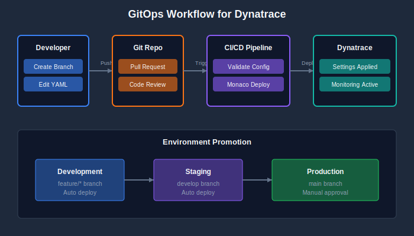

# CI/CD Integration

> **Series:** AUTOM | **Notebook:** 7 of 8 | **Created:** January 2026

---

## Table of Contents

1. [Introduction](#introduction)
2. [GitOps Fundamentals](#gitops)
3. [GitHub Actions](#github-actions)
4. [GitLab CI/CD](#gitlab)
5. [ArgoCD Integration](#argocd)
6. [FluxCD Integration](#fluxcd)
7. [Dynatrace Operator GitOps](#operator-gitops)
8. [Best Practices](#best-practices)
9. [Next Steps](#next-steps)

---

## Prerequisites

Before starting this notebook, ensure you have:

| Requirement | Description |
|-------------|-------------|
| CI/CD Platform | GitHub Actions, GitLab CI, or Jenkins |
| Monaco or Terraform | One of the config-as-code tools |
| Git Repository | For storing configurations |
| API Token | Stored as CI/CD secret |

---

## Learning Objectives

By the end of this notebook, you will:

- Understand GitOps principles for Dynatrace
- Know how to set up CI/CD pipelines for config deployment
- Be able to implement pull request workflows
- Handle multi-environment deployments

---

<a id="introduction"></a>
## 1. Introduction

CI/CD integration brings software development practices to Dynatrace configuration management. By storing configs in Git and deploying via pipelines, teams gain version control, review processes, and automated deployments.

### Why CI/CD for Dynatrace?

| Benefit | Description |
|---------|-------------|
| **Version Control** | All changes tracked in Git history |
| **Code Review** | Pull requests for config changes |
| **Automation** | No manual deployments |
| **Rollback** | Revert to any previous state |
| **Audit Trail** | Who changed what, when |

### GitOps Workflow

<!-- MARKDOWN_TABLE_ALTERNATIVE
| Step | Action |
|------|--------|
| 1 | Developer creates branch |
| 2 | Makes config changes |
| 3 | Opens pull request |
| 4 | Validation pipeline runs |
| 5 | Review and approve |
| 6 | Merge triggers deploy |
-->



---

<a id="gitops"></a>
## 2. GitOps Fundamentals

### Repository Structure

```
dynatrace-config/
├── .github/
│   └── workflows/
│       ├── validate.yml
│       └── deploy.yml
├── manifest.yaml          # Monaco manifest
├── environments/
│   ├── dev.yaml
│   ├── staging.yaml
│   └── production.yaml
├── projects/
│   ├── alerting/
│   ├── management-zones/
│   └── synthetic/
└── README.md
```

### Branch Strategy

| Branch | Purpose | Deploys To |
|--------|---------|------------|
| `main` | Production configs | Production |
| `develop` | Integration branch | Staging |
| `feature/*` | New features | Dev (optional) |

### Environment Promotion

```
feature/* → develop → main
    ↓          ↓        ↓
   Dev     Staging   Production
```

---

<a id="github-actions"></a>
## 3. GitHub Actions

### Validation Workflow

**.github/workflows/validate.yml:**

```yaml
name: Validate Dynatrace Config

on:
  pull_request:
    branches: [main, develop]
    paths:
      - 'projects/**'
      - 'manifest.yaml'

jobs:
  validate:
    runs-on: ubuntu-latest
    steps:
      - uses: actions/checkout@v4
      
      - name: Install Monaco
        run: |
          curl -L https://github.com/Dynatrace/dynatrace-configuration-as-code/releases/latest/download/monaco-linux-amd64 -o monaco
          chmod +x monaco
          sudo mv monaco /usr/local/bin/
      
      - name: Validate Configuration
        run: monaco validate manifest.yaml
      
      - name: Dry Run Deploy
        env:
          DT_DEV_URL: ${{ secrets.DT_DEV_URL }}
          DT_DEV_TOKEN: ${{ secrets.DT_DEV_TOKEN }}
        run: |
          monaco deploy manifest.yaml --environment development --dry-run
```

### Deployment Workflow

**.github/workflows/deploy.yml:**

```yaml
name: Deploy Dynatrace Config

on:
  push:
    branches: [main]
    paths:
      - 'projects/**'
      - 'manifest.yaml'

jobs:
  deploy-staging:
    runs-on: ubuntu-latest
    environment: staging
    steps:
      - uses: actions/checkout@v4
      
      - name: Install Monaco
        run: |
          curl -L https://github.com/Dynatrace/dynatrace-configuration-as-code/releases/latest/download/monaco-linux-amd64 -o monaco
          chmod +x monaco
          sudo mv monaco /usr/local/bin/
      
      - name: Deploy to Staging
        env:
          DT_STAGING_URL: ${{ secrets.DT_STAGING_URL }}
          DT_STAGING_TOKEN: ${{ secrets.DT_STAGING_TOKEN }}
        run: |
          monaco deploy manifest.yaml --environment staging

  deploy-production:
    needs: deploy-staging
    runs-on: ubuntu-latest
    environment: production
    steps:
      - uses: actions/checkout@v4
      
      - name: Install Monaco
        run: |
          curl -L https://github.com/Dynatrace/dynatrace-configuration-as-code/releases/latest/download/monaco-linux-amd64 -o monaco
          chmod +x monaco
          sudo mv monaco /usr/local/bin/
      
      - name: Deploy to Production
        env:
          DT_PROD_URL: ${{ secrets.DT_PROD_URL }}
          DT_PROD_TOKEN: ${{ secrets.DT_PROD_TOKEN }}
        run: |
          monaco deploy manifest.yaml --environment production
```

---

### Terraform Workflow

For Terraform-based deployments:

```yaml
name: Terraform Dynatrace

on:
  pull_request:
    branches: [main]
  push:
    branches: [main]

jobs:
  terraform:
    runs-on: ubuntu-latest
    steps:
      - uses: actions/checkout@v4
      
      - name: Setup Terraform
        uses: hashicorp/setup-terraform@v3
        with:
          terraform_version: 1.6.0
      
      - name: Terraform Init
        run: terraform init
        env:
          TF_VAR_dynatrace_url: ${{ secrets.DT_URL }}
          TF_VAR_dynatrace_token: ${{ secrets.DT_TOKEN }}
      
      - name: Terraform Plan
        if: github.event_name == 'pull_request'
        run: terraform plan -no-color
        env:
          TF_VAR_dynatrace_url: ${{ secrets.DT_URL }}
          TF_VAR_dynatrace_token: ${{ secrets.DT_TOKEN }}
      
      - name: Terraform Apply
        if: github.ref == 'refs/heads/main' && github.event_name == 'push'
        run: terraform apply -auto-approve
        env:
          TF_VAR_dynatrace_url: ${{ secrets.DT_URL }}
          TF_VAR_dynatrace_token: ${{ secrets.DT_TOKEN }}
```

---

<a id="gitlab"></a>
## 4. GitLab CI/CD

### Pipeline Configuration

**.gitlab-ci.yml:**

```yaml
stages:
  - validate
  - deploy-staging
  - deploy-production

variables:
  MONACO_VERSION: "2.0.0"

.monaco-setup: &monaco-setup
  before_script:
    - curl -L https://github.com/Dynatrace/dynatrace-configuration-as-code/releases/download/v${MONACO_VERSION}/monaco-linux-amd64 -o monaco
    - chmod +x monaco
    - mv monaco /usr/local/bin/

validate:
  stage: validate
  <<: *monaco-setup
  script:
    - monaco validate manifest.yaml
    - monaco deploy manifest.yaml --environment development --dry-run
  rules:
    - if: $CI_PIPELINE_SOURCE == "merge_request_event"

deploy-staging:
  stage: deploy-staging
  <<: *monaco-setup
  script:
    - monaco deploy manifest.yaml --environment staging
  environment:
    name: staging
  rules:
    - if: $CI_COMMIT_BRANCH == "main"

deploy-production:
  stage: deploy-production
  <<: *monaco-setup
  script:
    - monaco deploy manifest.yaml --environment production
  environment:
    name: production
  rules:
    - if: $CI_COMMIT_BRANCH == "main"
      when: manual
```

### Variables Configuration

In GitLab: **Settings → CI/CD → Variables**

| Variable | Protected | Masked |
|----------|-----------|--------|
| `DT_DEV_URL` | No | No |
| `DT_DEV_TOKEN` | No | Yes |
| `DT_STAGING_URL` | No | No |
| `DT_STAGING_TOKEN` | Yes | Yes |
| `DT_PROD_URL` | Yes | No |
| `DT_PROD_TOKEN` | Yes | Yes |

---

<a id="argocd"></a>
## 5. ArgoCD Integration

For Kubernetes-native GitOps, use ArgoCD with Dynatrace configs.

### ArgoCD Application for Monaco Configs

```yaml
apiVersion: argoproj.io/v1alpha1
kind: Application
metadata:
  name: dynatrace-config
  namespace: argocd
spec:
  project: default
  source:
    repoURL: https://github.com/org/dynatrace-config.git
    targetRevision: HEAD
    path: projects
  destination:
    server: https://kubernetes.default.svc
    namespace: dynatrace
  syncPolicy:
    automated:
      prune: true
      selfHeal: true
```

### ArgoCD for Dynatrace Operator (DynaKube)

Deploy and manage the Dynatrace Operator via ArgoCD:

```yaml
apiVersion: argoproj.io/v1alpha1
kind: Application
metadata:
  name: dynatrace-operator
  namespace: argocd
spec:
  project: default
  source:
    repoURL: https://github.com/org/k8s-platform.git
    targetRevision: HEAD
    path: dynatrace
  destination:
    server: https://kubernetes.default.svc
    namespace: dynatrace
  syncPolicy:
    automated:
      prune: true
      selfHeal: true
    syncOptions:
      - CreateNamespace=true
```

**Repository structure for Dynatrace Operator:**
```
dynatrace/
├── kustomization.yaml
├── namespace.yaml
├── operator.yaml          # Dynatrace Operator deployment
├── dynakube.yaml          # DynaKube custom resource
└── secrets/
    └── dynakube-secret.yaml  # External Secrets reference
```

### External Secrets for Token Management

Use External Secrets Operator to sync tokens from secret stores:

```yaml
apiVersion: external-secrets.io/v1beta1
kind: ExternalSecret
metadata:
  name: dynakube-tokens
  namespace: dynatrace
spec:
  refreshInterval: 1h
  secretStoreRef:
    name: aws-secrets-manager
    kind: ClusterSecretStore
  target:
    name: dynakube
    creationPolicy: Owner
  data:
    - secretKey: apiToken
      remoteRef:
        key: dynatrace/api-token
    - secretKey: dataIngestToken
      remoteRef:
        key: dynatrace/data-ingest-token
```

### Using Config Management Plugins

**argocd-cm ConfigMap:**

```yaml
apiVersion: v1
kind: ConfigMap
metadata:
  name: argocd-cm
  namespace: argocd
data:
  configManagementPlugins: |
    - name: monaco
      generate:
        command: ["sh", "-c"]
        args: ["monaco deploy manifest.yaml --environment $ARGOCD_ENV_ENVIRONMENT"]
```

---

<a id="fluxcd"></a>
## 6. FluxCD Integration

FluxCD provides an alternative GitOps approach with a pull-based reconciliation model.

### FluxCD vs ArgoCD

| Feature | FluxCD | ArgoCD |
|---------|--------|--------|
| **Architecture** | Controller-based | Server + UI |
| **UI** | Minimal (Weave GitOps) | Built-in web UI |
| **Multi-tenancy** | Namespace-based | Project-based |
| **Helm Support** | Native HelmRelease | Application CRD |
| **Image Automation** | Built-in | Requires Argo CD Image Updater |

### FluxCD for Dynatrace Operator

**GitRepository source:**

```yaml
apiVersion: source.toolkit.fluxcd.io/v1
kind: GitRepository
metadata:
  name: dynatrace-config
  namespace: flux-system
spec:
  interval: 1m
  url: https://github.com/org/k8s-platform
  ref:
    branch: main
  secretRef:
    name: github-token
```

**Kustomization for Dynatrace:**

```yaml
apiVersion: kustomize.toolkit.fluxcd.io/v1
kind: Kustomization
metadata:
  name: dynatrace
  namespace: flux-system
spec:
  interval: 10m
  targetNamespace: dynatrace
  sourceRef:
    kind: GitRepository
    name: dynatrace-config
  path: ./dynatrace
  prune: true
  healthChecks:
    - apiVersion: apps/v1
      kind: Deployment
      name: dynatrace-operator
      namespace: dynatrace
```

### FluxCD HelmRelease for Dynatrace Operator

Deploy via Helm with FluxCD:

```yaml
apiVersion: source.toolkit.fluxcd.io/v1beta2
kind: HelmRepository
metadata:
  name: dynatrace
  namespace: flux-system
spec:
  interval: 1h
  url: https://raw.githubusercontent.com/Dynatrace/dynatrace-operator/main/config/helm/repos/stable

---
apiVersion: helm.toolkit.fluxcd.io/v2beta1
kind: HelmRelease
metadata:
  name: dynatrace-operator
  namespace: dynatrace
spec:
  interval: 5m
  chart:
    spec:
      chart: dynatrace-operator
      version: ">=1.0.0"
      sourceRef:
        kind: HelmRepository
        name: dynatrace
        namespace: flux-system
  values:
    installCRD: true
```

### SOPS for Secret Management with FluxCD

Use SOPS to encrypt secrets in Git:

```yaml
apiVersion: kustomize.toolkit.fluxcd.io/v1
kind: Kustomization
metadata:
  name: dynatrace-secrets
  namespace: flux-system
spec:
  interval: 10m
  sourceRef:
    kind: GitRepository
    name: dynatrace-config
  path: ./dynatrace/secrets
  prune: true
  decryption:
    provider: sops
    secretRef:
      name: sops-age
```

---

<a id="operator-gitops"></a>
## 7. Dynatrace Operator GitOps Patterns

When deploying the Dynatrace Operator via GitOps, follow these patterns for production environments.

> **Important:** Use `apiVersion: dynatrace.com/v1beta5` for Dynatrace Operator 1.7.0+. Earlier versions (v1beta1, v1beta2) are deprecated and no longer supported.

### Multi-Cluster Deployment Pattern

For organizations with multiple Kubernetes clusters:

```
platform-gitops/
├── clusters/
│   ├── production-east/
│   │   └── dynatrace/
│   │       ├── kustomization.yaml
│   │       └── dynakube-patch.yaml     # Cluster-specific overrides
│   ├── production-west/
│   │   └── dynatrace/
│   │       ├── kustomization.yaml
│   │       └── dynakube-patch.yaml
│   └── staging/
│       └── dynatrace/
│           ├── kustomization.yaml
│           └── dynakube-patch.yaml
└── base/
    └── dynatrace/
        ├── kustomization.yaml
        ├── namespace.yaml
        ├── operator.yaml
        └── dynakube.yaml               # Base DynaKube config
```

**Base kustomization.yaml:**
```yaml
apiVersion: kustomize.config.k8s.io/v1beta1
kind: Kustomization
resources:
  - namespace.yaml
  - https://github.com/Dynatrace/dynatrace-operator/releases/download/v1.3.2/kubernetes.yaml
  - dynakube.yaml
```

**Cluster overlay (production-east):**
```yaml
apiVersion: kustomize.config.k8s.io/v1beta1
kind: Kustomization
resources:
  - ../../base/dynatrace
patchesStrategicMerge:
  - dynakube-patch.yaml
```

**Cluster-specific patch:**
```yaml
apiVersion: dynatrace.com/v1beta5
kind: DynaKube
metadata:
  name: dynakube
  namespace: dynatrace
spec:
  oneAgent:
    cloudNativeFullStack:
      args:
        - --set-host-group=production-east
```

### Multi-Tenant Observability Pattern

For clusters serving multiple teams with different Dynatrace tenants:

```yaml
# Team A - uses tenant-a.live.dynatrace.com
apiVersion: dynatrace.com/v1beta5
kind: DynaKube
metadata:
  name: team-a-dynakube
  namespace: dynatrace
spec:
  apiUrl: https://tenant-a.live.dynatrace.com/api
  tokens: team-a-tokens
  oneAgent:
    cloudNativeFullStack:
      namespaceSelector:
        matchLabels:
          dynatrace-tenant: team-a

---
# Team B - uses tenant-b.live.dynatrace.com
apiVersion: dynatrace.com/v1beta5
kind: DynaKube
metadata:
  name: team-b-dynakube
  namespace: dynatrace
spec:
  apiUrl: https://tenant-b.live.dynatrace.com/api
  tokens: team-b-tokens
  oneAgent:
    cloudNativeFullStack:
      namespaceSelector:
        matchLabels:
          dynatrace-tenant: team-b
```

### GitOps Health Checks

Configure sync health checks to verify Dynatrace deployment:

**ArgoCD health check:**
```yaml
apiVersion: argoproj.io/v1alpha1
kind: Application
metadata:
  name: dynatrace
spec:
  # ... source config ...
  ignoreDifferences:
    - group: dynatrace.com
      kind: DynaKube
      jsonPointers:
        - /status  # Ignore status field changes
```

**FluxCD health check:**
```yaml
apiVersion: kustomize.toolkit.fluxcd.io/v1
kind: Kustomization
metadata:
  name: dynatrace
spec:
  healthChecks:
    - apiVersion: apps/v1
      kind: Deployment
      name: dynatrace-operator
      namespace: dynatrace
    - apiVersion: apps/v1
      kind: DaemonSet
      name: dynakube-oneagent
      namespace: dynatrace
```

### Sealed Secrets Alternative

For Kubernetes-native secret encryption:

```yaml
apiVersion: bitnami.com/v1alpha1
kind: SealedSecret
metadata:
  name: dynakube
  namespace: dynatrace
spec:
  encryptedData:
    apiToken: AgBy8BYo...encrypted...
    dataIngestToken: AgCtr4s2...encrypted...
```

Generate sealed secrets:
```bash
# Seal the secret
kubectl create secret generic dynakube \
  --from-literal=apiToken=dt0c01.xxx \
  --from-literal=dataIngestToken=dt0c01.yyy \
  --dry-run=client -o yaml | \
  kubeseal --format yaml > sealed-dynakube.yaml
```

---

<a id="best-practices"></a>
## 8. Best Practices

### Security

| Practice | Description |
|----------|-------------|
| **Masked secrets** | Always mask API tokens in CI/CD |
| **Protected branches** | Require reviews for main branch |
| **Environment protection** | Manual approval for production |
| **Token rotation** | Rotate tokens regularly |
| **Least privilege** | Minimal token scopes |
| **External Secrets** | Use ESO, SOPS, or Sealed Secrets for K8s |

### Workflow Design

| Practice | Description |
|----------|-------------|
| **Validate first** | Always validate before deploy |
| **Dry run PRs** | Show what would change |
| **Staged rollout** | Dev → Staging → Production |
| **Manual gates** | Require approval for production |
| **Rollback plan** | Know how to revert changes |
| **Health checks** | Verify deployment success |

### GitOps Tool Selection

| Use Case | Recommended Tool |
|----------|------------------|
| **Simple CI/CD** | GitHub Actions / GitLab CI |
| **K8s-native, UI preferred** | ArgoCD |
| **K8s-native, Helm-first** | FluxCD |
| **Multi-cluster enterprise** | ArgoCD or FluxCD |

### Pull Request Template

**.github/PULL_REQUEST_TEMPLATE.md:**

```markdown
## Dynatrace Configuration Change

### Description
<!-- What configuration is being changed? -->

### Type of Change
- [ ] New configuration
- [ ] Modification to existing config
- [ ] Deletion of config

### Environments Affected
- [ ] Development
- [ ] Staging
- [ ] Production

### Validation
- [ ] Monaco validate passed
- [ ] Dry run successful
- [ ] Tested in dev environment

### Rollback Plan
<!-- How to revert if issues arise? -->
```

---

### Notification Integration

Add deployment notifications:

```yaml
# GitHub Actions notification step
- name: Notify Slack
  if: always()
  uses: slackapi/slack-github-action@v1
  with:
    payload: |
      {
        "text": "Dynatrace config deployment: ${{ job.status }}",
        "blocks": [
          {
            "type": "section",
            "text": {
              "type": "mrkdwn",
              "text": "*Deployment to ${{ github.ref_name }}*\nStatus: ${{ job.status }}\nCommit: ${{ github.sha }}"
            }
          }
        ]
      }
  env:
    SLACK_WEBHOOK_URL: ${{ secrets.SLACK_WEBHOOK }}
```

---

<a id="next-steps"></a>
## 9. Next Steps

### Deployment Event Tracking

Send deployment events to Dynatrace:

```yaml
- name: Send Deployment Event
  run: |
    curl -X POST "${{ secrets.DT_URL }}/api/v2/events/ingest" \
      -H "Authorization: Api-Token ${{ secrets.DT_TOKEN }}" \
      -H "Content-Type: application/json" \
      -d '{
        "eventType": "CUSTOM_DEPLOYMENT",
        "title": "Dynatrace Config Deployment",
        "properties": {
          "source": "github-actions",
          "commit": "${{ github.sha }}",
          "branch": "${{ github.ref_name }}"
        }
      }'
```

### Continue the Series

| Next Notebook | Focus |
|---------------|-------|
| **AUTOM-08: Migration Automation** | Bulk configuration transfer between tenants |

### Additional Resources

- [GitHub Actions Documentation](https://docs.github.com/en/actions)
- [GitLab CI/CD Documentation](https://docs.gitlab.com/ee/ci/)
- [ArgoCD Documentation](https://argo-cd.readthedocs.io/)
- [FluxCD Documentation](https://fluxcd.io/docs/)
- [Dynatrace Operator](https://docs.dynatrace.com/docs/ingest-from/setup-on-k8s)
- [Monaco GitHub Repository](https://github.com/dynatrace/dynatrace-configuration-as-code)
- [External Secrets Operator](https://external-secrets.io/)

---

## Summary

In this notebook, you learned:

- GitOps fundamentals for Dynatrace configuration
- Setting up GitHub Actions and GitLab CI/CD pipelines
- ArgoCD integration with External Secrets for token management
- FluxCD with HelmRelease and SOPS for secret encryption
- Dynatrace Operator GitOps patterns for multi-cluster and multi-tenant environments
- Best practices for security and workflow design

> **Key Takeaway:** CI/CD integration transforms Dynatrace config management into a software development workflow. For Kubernetes environments, GitOps tools like ArgoCD and FluxCD enable declarative management of both Dynatrace configuration and the Dynatrace Operator itself.

---

*Continue to **AUTOM-08: Migration Automation** to learn bulk configuration transfer.*

---

<sub>*This notebook was AI-generated from community-submitted and publicly available sources. This notebook series is not officially supported by Dynatrace. Always verify information against official Dynatrace documentation.*</sub>
