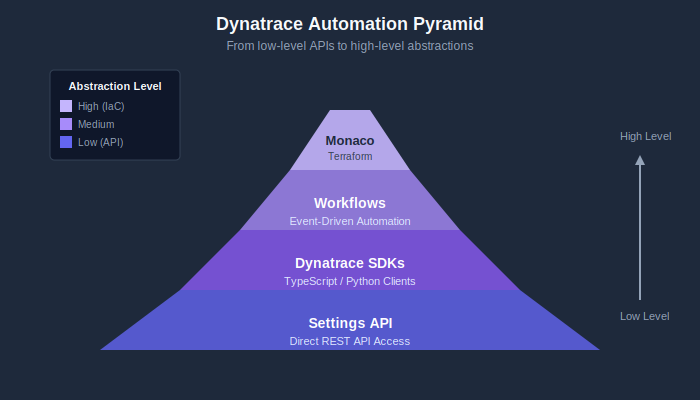
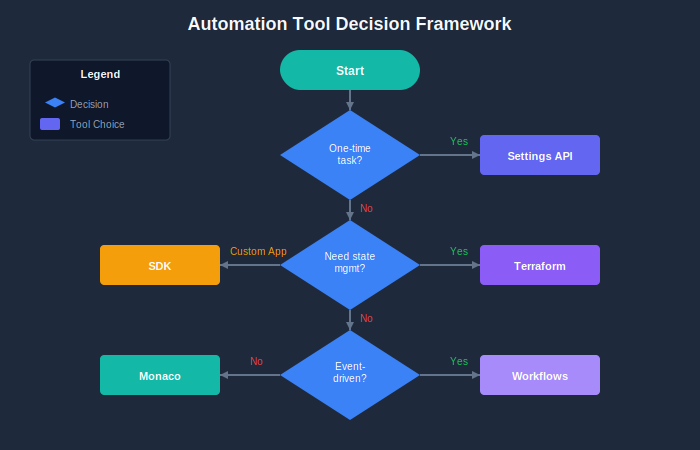

# Automation Landscape

> **Series:** AUTOM | **Notebook:** 1 of 8 | **Created:** January 2026 | **Last Updated:** 02/11/2026

Dynatrace provides multiple ways to automate configuration management and operational tasks. This series covers all major automation options, helping you choose the right approach for your needs.

---

## Table of Contents

1. [Introduction](#introduction)
2. [Choosing the Right Tool](#choosing-the-right-tool)
3. [Decision Framework](#decision-framework)
4. [Authentication & Token Reference](#api-token-scopes-reference)
5. [Emerging Capabilities](#emerging-capabilities)

---

## Prerequisites

Before starting this series, ensure you have:

| Requirement | Description |
|-------------|-------------|
| Dynatrace SaaS tenant | Active tenant with admin access |
| Authentication | Access token, platform token, or OAuth client (see [Authentication & Token Reference](#api-token-scopes-reference)) |
| Basic familiarity | Understanding of Dynatrace configuration concepts |

---

## Learning Objectives

By the end of this notebook, you will:

- Understand all available automation options for Dynatrace
- Know when to use each tool or approach
- Be able to choose the right automation strategy for your use case
- Have a framework for evaluating automation approaches

---

## 1. Introduction
### What This Series Covers

| Notebook | Focus |
|----------|-------|
| **AUTOM-01** (this notebook) | Automation landscape overview |
| **AUTOM-02** | Settings API - REST API for configuration |
| **AUTOM-03** | Monaco - Configuration-as-code CLI |
| **AUTOM-04** | Terraform Provider - Infrastructure-as-code |
| **AUTOM-05** | Dynatrace Workflows - Event-driven automation |
| **AUTOM-06** | Dynatrace SDKs - TypeScript and Python clients |
| **AUTOM-07** | CI/CD Integration - GitOps patterns |
| **AUTOM-08** | Migration Automation - Bulk configuration transfer |

### Why Automate?

| Benefit | Description |
|---------|-------------|
| **Consistency** | Same configuration across all environments |
| **Repeatability** | Deploy identical setups reliably |
| **Version Control** | Track changes in Git, enable rollbacks |
| **Scale** | Manage hundreds or thousands of configurations |
| **Speed** | Faster deployments, reduced manual effort |
| **Compliance** | Auditable changes, approval workflows |

---

## 2. Automation Options Overview

### The Automation Pyramid

Dynatrace automation tools form a hierarchy from low-level APIs to high-level abstractions:

<!-- MARKDOWN_TABLE_ALTERNATIVE
| Level | Tool | Abstraction |
|-------|------|-------------|
| High | Terraform | Infrastructure-as-Code |
| High | Monaco | Config-as-Code |
| Medium | Workflows | Event-driven automation |
| Medium | SDKs | Programmatic access |
| Low | Settings API | Direct REST calls |
-->

---

### Tool Comparison Matrix

| Tool | Best For | Learning Curve | CI/CD Ready | Multi-Tenant |
|------|----------|----------------|-------------|---------------|
| **Settings API** | Custom integrations, scripts | Medium | Manual | Yes |
| **Monaco** | Config-as-code, migrations | Low | Yes | Yes |
| **Terraform** | IaC environments, full stack | Medium | Yes | Yes |
| **Workflows** | Event-driven, auto-remediation | Low | N/A | No |
| **SDKs** | Custom apps, complex logic | Medium | Yes | Yes |

### Settings API

The foundation for all configuration automation. Direct REST API access to Dynatrace settings.

| Aspect | Details |
|--------|----------|
| **Type** | REST API |
| **Access** | HTTP calls with API token |
| **Schema** | JSON with schema validation |
| **Use Case** | Custom scripts, one-off operations |
| **Documentation** | [Settings API Reference](https://docs.dynatrace.com/docs/dynatrace-api/environment-api/settings) |

### Monaco

Dynatrace's official configuration-as-code CLI tool. YAML-based configuration management.

| Aspect | Details |
|--------|----------|
| **Type** | CLI tool |
| **Configuration** | YAML files |
| **Features** | Download, deploy, delete, validate |
| **Use Case** | Config management, migrations |
| **Documentation** | [Monaco on GitHub](https://github.com/dynatrace/dynatrace-configuration-as-code) |

### Terraform Provider

Official HashiCorp Terraform provider for Dynatrace. Infrastructure-as-code approach.

| Aspect | Details |
|--------|----------|
| **Type** | Terraform provider |
| **Configuration** | HCL (HashiCorp Configuration Language) |
| **Features** | Plan, apply, destroy, state management |
| **Use Case** | IaC pipelines, environment provisioning |
| **Documentation** | [Terraform Registry](https://registry.terraform.io/providers/dynatrace-oss/dynatrace/latest) |

### Dynatrace Workflows

Built-in automation engine for event-driven actions within Dynatrace.

| Aspect | Details |
|--------|----------|
| **Type** | Platform feature |
| **Configuration** | UI or YAML |
| **Features** | Triggers, actions, conditions, JavaScript |
| **Use Case** | Auto-remediation, notifications, integrations |
| **Documentation** | [Workflows Documentation](https://docs.dynatrace.com/docs/analyze-explore-automate/workflows) |

### Dynatrace SDKs

Official client libraries for programmatic access to Dynatrace APIs.

| Aspect | Details |
|--------|----------|
| **Type** | Client libraries |
| **Languages** | TypeScript/JavaScript, Python |
| **Features** | Type-safe, auto-generated from OpenAPI |
| **Use Case** | Custom applications, complex automation |
| **Documentation** | [Dynatrace SDK](https://developer.dynatrace.com/develop/sdks/) |

---

## 3. Choosing the Right Tool
### Use Case Mapping

| Use Case | Recommended Tool | Why |
|----------|------------------|-----|
| One-off configuration change | Settings API | Simple, direct |
| Repeatable deployments | Monaco | Version-controlled YAML |
| Full environment provisioning | Terraform | State management, drift detection |
| Auto-remediation | Workflows | Event-driven, built-in |
| Custom application | SDK | Type-safe, maintainable |
| Tenant migration | Monaco | Download/deploy pattern |
| GitOps pipeline | Monaco or Terraform | CI/CD integration |

### Team Skill Considerations

| Team Background | Best Fit |
|-----------------|----------|
| DevOps with Terraform experience | Terraform Provider |
| Developers comfortable with APIs | Settings API or SDK |
| SRE teams wanting GitOps | Monaco |
| Operations needing quick automation | Workflows |
| Mixed skill levels | Monaco (lowest barrier) |

---

### Feature Coverage Comparison

Not all tools support all Dynatrace features equally:

| Configuration Type | Settings API | Monaco | Terraform |
|--------------------|--------------|--------|-----------|
| Settings 2.0 objects | Full | Full | Full |
| Classic config (legacy) | N/A | Full | Full |
| Dashboards | Full | Full | Full |
| Synthetic monitors | Full | Full | Full |
| Alerting profiles | Full | Full | Full |
| Management zones | Full | Full | Full |
| Auto-tagging rules | Full | Full | Full |
| SLOs | Full | Full | Full |
| Workflows | Full | Partial | Partial |
| OpenPipeline | Full | Full | Full |

> **Note:** Monaco and Terraform use the Settings API under the hood. Feature parity depends on schema availability.

---

## 4. Decision Framework
Use this flowchart to choose the right automation approach:

<!-- MARKDOWN_TABLE_ALTERNATIVE
| Question | If Yes | If No |
|----------|--------|-------|
| Is this a one-time task? | Settings API | Continue... |
| Do you need state management? | Terraform | Monaco |
| Is it event-driven? | Workflows | Continue... |
| Building a custom app? | SDK | Monaco |
-->

---

### Combining Tools

These tools aren't mutually exclusive. Common combinations:

| Combination | Use Case |
|-------------|----------|
| Monaco + Workflows | Deploy configs with auto-remediation |
| Terraform + Monaco | Infra provisioning + config management |
| SDK + Settings API | Custom app with direct API fallback |
| Monaco + CI/CD | GitOps config deployments |

### Anti-Patterns to Avoid

| Anti-Pattern | Problem | Solution |
|--------------|---------|----------|
| Mixing Monaco and Terraform for same config | State conflicts | Choose one for each config type |
| Manual changes alongside automation | Configuration drift | Use automation exclusively |
| No version control | No rollback capability | Always use Git |
| Hardcoded secrets | Security risk | Use environment variables or vaults |

---

## Authentication & Token Reference

Dynatrace supports three types of credentials for automation tools. Which you need depends on the tool and the resources you manage.

### Token Types

| Token Type | Description | Use Case |
|------------|-------------|----------|
| **Access Token (Classic)** | Scope-based token with explicit permissions (e.g., `settings.read`) | Settings API, Monaco, Terraform (settings/classic) |
| **Platform Token** | Long-lived token bound to a user's permissions; simpler to create | Same as access token, but scopes are limited to user's existing permissions |
| **OAuth Client** | Client ID + secret exchanged for short-lived tokens | **Required** for Terraform automation, document, and IAM resources |

### Tool Authentication Matrix

| Tool | Access/Platform Token | OAuth Client | Notes |
|------|----------------------|--------------|-------|
| **Settings API** | `settings.read`, `settings.write` | N/A | Direct REST calls |
| **Monaco** | `settings.read`, `settings.write`, `ReadConfig`, `WriteConfig` | N/A | CLI tool |
| **Terraform** (settings/classic) | `settings.read`, `settings.write`, `ReadConfig`, `WriteConfig` | N/A | IaC for config objects |
| **Terraform** (automation/documents) | N/A | `automation:workflows:read/write`, `document:documents:read/write` | OAuth **required** |
| **Terraform** (account management) | N/A | IAM scopes + `DT_ACCOUNT_ID` | OAuth **required** |
| **Workflows** | Built-in (no external token needed) | N/A | Platform feature |
| **SDKs** | Depends on operations performed | N/A | Client libraries |

### Token Best Practices

| Practice | Description |
|----------|-------------|
| Least privilege | Only grant required scopes |
| Environment-specific | Separate tokens per environment |
| Rotation | Rotate tokens regularly |
| Secret storage | Use HashiCorp Vault, AWS Secrets Manager, etc. |
| Platform tokens | Prefer over classic access tokens for simpler management |
| OAuth for automation | Use OAuth clients when managing Workflows or Documents via Terraform |

> **Key Distinction:** Platform tokens work within the user's existing permissions (a scope only grants access if the user already has that permission). OAuth clients operate with their own independent scopes, making them more suitable for service accounts and CI/CD pipelines.

---

## 5. Emerging Capabilities

### Dynatrace Intelligence Agents

Announced at Perform 2026, **Dynatrace Intelligence** is an agentic operations system that fuses deterministic and agentic AI. Intelligence Agents transform insights into autonomous outcomes across IT and business operations.

| Aspect | Details |
|--------|----------|
| **Type** | Agentic AI layer built into the platform |
| **Capabilities** | Autonomous SRE, security, and development agents |
| **Integration** | Works through Dynatrace Workflows for agentic workflows |
| **Governance** | Built-in guardrails for supervised or autonomous operation |
| **Use Case** | Auto-prevention, auto-remediation, auto-optimization |

> **Note:** Dynatrace Intelligence Agents represent a shift from rule-based automation (Workflows, Monaco, Terraform) to AI-driven autonomous operations. They complement existing tools rather than replacing them.

### Dynatrace MCP Server

The [Dynatrace MCP Server](https://docs.dynatrace.com/docs/dynatrace-intelligence/dynatrace-intelligence-integrations/dynatrace-mcp) implements the Model Context Protocol (MCP), enabling AI assistants (Claude, GitHub Copilot, Amazon Q) to interact with Dynatrace using natural language.

| Aspect | Details |
|--------|----------|
| **Type** | Open-source MCP server |
| **Access** | AI assistants can query problems, metrics, traces, logs, topology |
| **Use Case** | AI-assisted development, triage, incident management |
| **Documentation** | [MCP Server Documentation](https://docs.dynatrace.com/docs/dynatrace-intelligence/dynatrace-intelligence-integrations/dynatrace-mcp) |

### How Emerging Capabilities Fit

| Automation Maturity | Approach |
|---------------------|----------|
| **Manual** | Settings API, one-off scripts |
| **Automated** | Monaco, Terraform, CI/CD pipelines |
| **Supervised** | Workflows with human approval gates |
| **Autonomous** | Intelligence Agents with guardrails |
| **AI-Assisted** | MCP Server for developer and SRE tooling |

---

## 5. Next Steps

### Learning Path by Goal

| Your Goal | Recommended Path |
|-----------|------------------|
| Quick script automation | AUTOM-02 (Settings API) |
| GitOps config management | AUTOM-03 (Monaco) → AUTOM-07 (CI/CD) |
| Full IaC environment | AUTOM-04 (Terraform) → AUTOM-07 (CI/CD) |
| Auto-remediation | AUTOM-05 (Workflows) |
| Custom application | AUTOM-06 (SDKs) |
| Tenant migration | AUTOM-08 (Migration) |

### Continue the Series

| Next Notebook | Focus |
|---------------|-------|
| **AUTOM-02: Settings API** | Deep dive into REST API configuration |

### Additional Resources

- [Dynatrace API Documentation](https://docs.dynatrace.com/docs/dynatrace-api)
- [Monaco GitHub Repository](https://github.com/dynatrace/dynatrace-configuration-as-code)
- [Terraform Provider Documentation](https://registry.terraform.io/providers/dynatrace-oss/dynatrace/latest/docs)
- [Dynatrace Developer Portal](https://developer.dynatrace.com/)

---

## Summary

In this notebook, you learned:

- The automation options available for Dynatrace configuration
- When to use Settings API, Monaco, Terraform, Workflows, or SDKs
- How to choose the right tool based on your use case and team skills
- Best practices for combining automation tools

> **Key Takeaway:** Choose the automation tool that matches your team's skills and your operational model. Monaco is the best starting point for most teams due to its low barrier to entry and GitOps compatibility.

---

*Continue to **AUTOM-02: Settings API** to learn direct REST API configuration.*

---

*This notebook was AI-generated from community-submitted and publicly available sources. This notebook series is not officially supported by Dynatrace. Always verify information against official Dynatrace documentation.*
