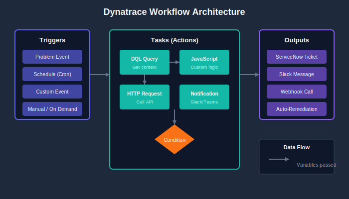

# Dynatrace Workflows

> **Series:** AUTOM | **Notebook:** 5 of 8 | **Created:** January 2026 | **Last Updated:** 01/30/2026

Dynatrace Workflows is a built-in automation engine that enables event-driven actions directly within the platform. Unlike external tools, workflows run inside Dynatrace with full access to observability data.

---

## Table of Contents

1. [Introduction](#introduction)
2. [Workflow Components](#workflow-components)
3. [Creating Workflows](#creating-workflows)
4. [Actions and Integrations](#actions-and-integrations)
5. [Auto-Remediation Patterns](#auto-remediation-patterns)
6. [Best Practices](#best-practices)

---

## Prerequisites

Before starting this notebook, ensure you have:

| Requirement | Description |
|-------------|-------------|
| Dynatrace SaaS | Tenant with Workflows enabled |
| Permissions | AutomationWorkflows permission |
| Basic DQL | Understanding of Dynatrace Query Language |

---

## Learning Objectives

By the end of this notebook, you will:

- Understand Dynatrace Workflows architecture
- Know how to create event-driven automations
- Be able to implement auto-remediation patterns
- Connect workflows to external systems

---

<a id="introduction"></a>
## 1. Introduction
### Why Workflows?

| Benefit | Description |
|---------|-------------|
| **Native Integration** | Direct access to all Dynatrace data |
| **No Infrastructure** | No external systems to manage |
| **Event-Driven** | React to problems, alerts, schedules |
| **Context-Aware** | Full Davis AI context available |
| **Secure** | Credentials stored in Dynatrace vault |

### Common Use Cases

| Use Case | Description |
|----------|-------------|
| **Notifications** | Send alerts to Slack, Teams, email |
| **Auto-Remediation** | Restart services, scale resources |
| **Ticketing** | Create ServiceNow, Jira tickets |
| **Enrichment** | Add context to problems |
| **Reporting** | Generate scheduled reports |

---

<a id="workflow-components"></a>
## 2. Workflow Components
### Workflow Architecture

<!-- MARKDOWN_TABLE_ALTERNATIVE
| Component | Purpose |
|-----------|----------|
| Trigger | What starts the workflow |
| Tasks | Actions to perform |
| Conditions | Logic to control flow |
| Variables | Data passed between tasks |
-->



### Triggers

| Trigger Type | Description | Example |
|--------------|-------------|----------|
| **Problem** | Davis problem event | Availability issue detected |
| **Event** | Custom or ingest event | Deployment completed |
| **Schedule** | Time-based (cron) | Daily at 9 AM |
| **Manual** | User-initiated | On-demand execution |
| **On Demand** | API or SDK call | External system trigger |

### Tasks

| Task Type | Description |
|-----------|-------------|
| **HTTP Request** | Call external APIs |
| **Run JavaScript** | Custom logic |
| **DQL Query** | Query Grail data |
| **Send Notification** | Slack, Teams, email |
| **Create Issue** | Jira, ServiceNow |
| **Run Workflow** | Call other workflows |

---

<a id="creating-workflows"></a>
## 3. Creating Workflows
### Access Workflows

Navigate to: **Apps → Workflows**

Or via URL: `https://{tenant}.apps.dynatrace.com/platform/app/dynatrace.automations/workflows`

### Simple Notification Workflow

**Workflow YAML (exportable):**

```yaml
title: Problem Notification
description: Send Slack notification for critical problems
trigger:
  type: davis-problem
  config:
    categories:
      - AVAILABILITY
      - ERROR
tasks:
  send_slack:
    name: Send Slack Alert
    action: dynatrace.slack:send-message
    input:
      connection: slack-webhook
      channel: "#alerts"
      message: |
        :warning: *Problem Detected*
        *Title:* {{ event().title }}
        *Severity:* {{ event().severity }}
        *Impact:* {{ event().impactLevel }}
```

### Problem Trigger Configuration

| Option | Description |
|--------|-------------|
| Categories | AVAILABILITY, ERROR, SLOWDOWN, RESOURCE, CUSTOM |
| Severities | Filter by severity level |
| Management Zones | Scope to specific zones |
| Entity Types | Filter by entity (HOST, SERVICE, etc.) |

---

### Using JavaScript Tasks

Custom logic with JavaScript:

```javascript
// Task: Enrich problem data
export default async function ({ execution_id }) {
  // Access previous task output
  const problem = execution.result.event;
  
  // Build enrichment data
  const enrichment = {
    problemId: problem.id,
    title: problem.title,
    affectedEntities: problem.affectedEntities.length,
    rootCauseEntity: problem.rootCauseEntity?.name || 'Unknown',
    timestamp: new Date().toISOString()
  };
  
  return enrichment;
}
```

### Using DQL Tasks

Query data within workflows:

```yaml
tasks:
  get_metrics:
    name: Get CPU Metrics
    action: dynatrace.automations:run-dql-query
    input:
      query: |
        timeseries avg(dt.host.cpu.usage), by:{dt.entity.host}
        | filter dt.entity.host == "{{ event().rootCauseEntity.id }}"
        | limit 10
```

---

<a id="actions-and-integrations"></a>
## 4. Actions and Integrations
### Built-in Connectors

| Connector | Actions |
|-----------|----------|
| **Slack** | Send message, post to channel |
| **Microsoft Teams** | Send adaptive card |
| **Jira** | Create/update issue |
| **ServiceNow** | Create incident, update CI |
| **PagerDuty** | Create incident |
| **OpsGenie** | Create alert |
| **Email** | Send email notification |

### HTTP Request Task

Call any REST API:

```yaml
tasks:
  call_api:
    name: Call External API
    action: dynatrace.automations:http-function
    input:
      url: "https://api.example.com/incidents"
      method: POST
      headers:
        Content-Type: application/json
        Authorization: "Bearer {{ env.API_TOKEN }}"
      body: |
        {
          "title": "{{ event().title }}",
          "severity": "{{ event().severity }}",
          "source": "dynatrace"
        }
```

### Credential Management

Store credentials securely:

1. Go to **Settings → Credential Vault**
2. Create a new credential
3. Reference in workflow: `{{ credential.MY_API_KEY }}`

---

<a id="auto-remediation-patterns"></a>
## 5. Auto-Remediation Patterns
### Pattern: Restart Service

```yaml
title: Auto-Restart on Crash
trigger:
  type: davis-problem
  config:
    categories:
      - AVAILABILITY
tasks:
  check_entity:
    name: Validate Entity Type
    action: dynatrace.automations:run-javascript
    input:
      script: |
        const entity = execution.result.event.rootCauseEntity;
        if (entity.type !== 'PROCESS_GROUP_INSTANCE') {
          return { skip: true };
        }
        return { entityId: entity.id, skip: false };
  
  restart_service:
    name: Execute Restart
    action: dynatrace.automations:http-function
    conditions:
      states:
        check_entity: OK
      custom: "{{ result('check_entity').skip == false }}"
    input:
      url: "https://runbook.example.com/restart"
      method: POST
      body: |
        {
          "entityId": "{{ result('check_entity').entityId }}"
        }
```

### Pattern: Scale on High CPU

```yaml
title: Auto-Scale on Resource Pressure
trigger:
  type: davis-problem
  config:
    categories:
      - RESOURCE
tasks:
  check_cpu:
    name: Query Current CPU
    action: dynatrace.automations:run-dql-query
    input:
      query: |
        timeseries avg(dt.host.cpu.usage)
        | filter dt.entity.host == "{{ event().rootCauseEntity.id }}"
  
  scale_up:
    name: Trigger Scale Event
    action: dynatrace.automations:http-function
    conditions:
      custom: "{{ result('check_cpu')[0].avg > 90 }}"
    input:
      url: "https://api.cloud.example.com/scale"
      method: POST
```

---

### Pattern: Create Incident Ticket

```yaml
title: ServiceNow Incident Creation
trigger:
  type: davis-problem
  config:
    categories:
      - AVAILABILITY
      - ERROR
tasks:
  create_incident:
    name: Create ServiceNow Incident
    action: dynatrace.servicenow:create-incident
    input:
      connection: servicenow-prod
      short_description: "Dynatrace: {{ event().title }}"
      description: |
        Problem detected by Dynatrace Davis AI
        
        Title: {{ event().title }}
        Severity: {{ event().severity }}
        Impact: {{ event().impactLevel }}
        Root Cause: {{ event().rootCauseEntity.name }}
        
        Link: {{ event().url }}
      urgency: 2
      impact: 2
  
  add_comment:
    name: Comment on Problem
    action: dynatrace.automations:run-javascript
    input:
      script: |
        const ticketId = execution.result.create_incident.sys_id;
        // Add comment to Dynatrace problem with ticket reference
        return { ticketId, status: 'created' };
```

---

<a id="best-practices"></a>
## 6. Best Practices
### Workflow Design

| Practice | Description |
|----------|-------------|
| **Single responsibility** | One workflow, one purpose |
| **Idempotency** | Safe to run multiple times |
| **Error handling** | Handle failures gracefully |
| **Logging** | Add descriptive task names |
| **Testing** | Use manual triggers for testing |

### Trigger Configuration

| Practice | Description |
|----------|-------------|
| **Scope narrowly** | Use management zones and filters |
| **Avoid duplicates** | Check if action already taken |
| **Debounce** | Add delays for flapping alerts |

### Security

| Practice | Description |
|----------|-------------|
| **Credential vault** | Never hardcode secrets |
| **Least privilege** | Minimal API permissions |
| **Audit trail** | Log all remediation actions |

### Error Handling

```yaml
tasks:
  api_call:
    name: Call API
    action: dynatrace.automations:http-function
    retry:
      count: 3
      delay: 30s
    on_error:
      next: error_handler
  
  error_handler:
    name: Handle Error
    action: dynatrace.slack:send-message
    input:
      channel: "#alerts"
      message: "Workflow failed: {{ error().message }}"
```

---

<a id="next-steps"></a>
## 7. Next Steps

### Workflows vs External Automation

| Scenario | Tool Choice |
|----------|-------------|
| Event-driven from Dynatrace | Workflows |
| Config deployment | Monaco/Terraform |
| Complex orchestration | External (Ansible, etc.) |
| Cross-platform actions | Workflows with HTTP tasks |

### Continue the Series

| Next Notebook | Focus |
|---------------|-------|
| **AUTOM-06: Dynatrace SDKs** | Programmatic access with TypeScript/Python |

### Additional Resources

- [Workflows Documentation](https://docs.dynatrace.com/docs/platform-modules/automations/workflows)
- [Workflow Actions Reference](https://docs.dynatrace.com/docs/platform-modules/automations/workflows/actions)
- [JavaScript Task Reference](https://docs.dynatrace.com/docs/platform-modules/automations/workflows/actions/javascript)

---

## Summary

In this notebook, you learned:

- Dynatrace Workflows architecture and components
- Creating event-driven automations with triggers and tasks
- Implementing auto-remediation patterns
- Best practices for workflow design and security

> **Key Takeaway:** Workflows provide native automation inside Dynatrace. Use them for event-driven actions like notifications, ticketing, and auto-remediation. For configuration management, continue using Monaco or Terraform.

---

*Continue to **AUTOM-06: Dynatrace SDKs** to learn programmatic access patterns.*

---

<sub>*This notebook was AI-generated from community-submitted and publicly available sources. This notebook series is not officially supported by Dynatrace. Always verify information against official Dynatrace documentation.*</sub>
