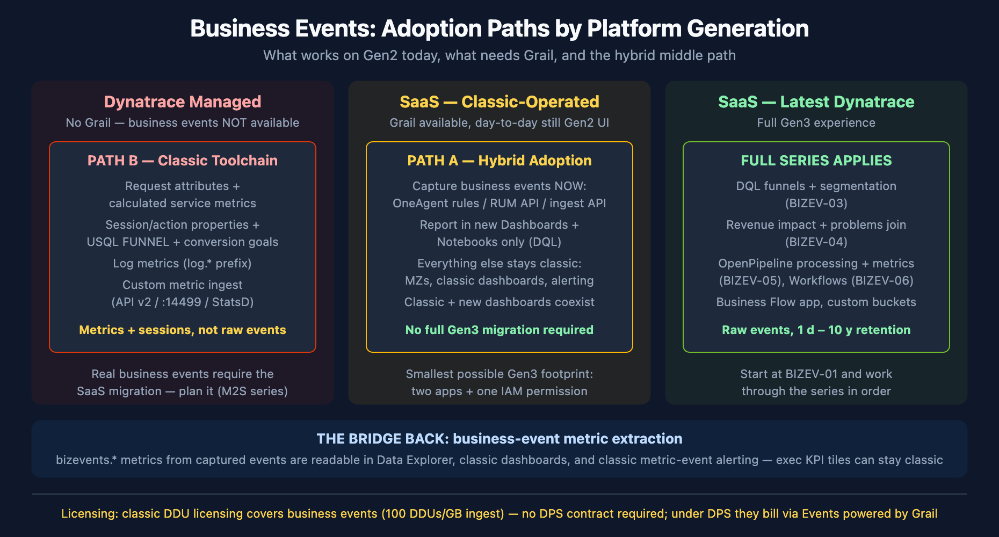

# BIZEV-07: Gen2 vs Gen3 — Business Events Without (or Before) the Full Move

> **Series:** BIZEV — Business Events & Funnel Analysis | **Notebook:** 7 of 7 | **Created:** July 2026 | **Last Updated:** 07/15/2026

## Overview

The rest of this series assumes a Dynatrace SaaS tenant with Grail — the Gen3 platform. Many organizations aren't there yet: they run Dynatrace Managed, or they run a SaaS tenant that *has* Grail but is still operated day-to-day through the classic (Gen2) experience — classic dashboards, Data Explorer, management zones. This notebook answers the question those teams ask first: **what business-event capability can we get today, without the full move — and what does a *minimal* move (new Dashboards only, for business-event reporting) unlock?**

Three situations, three answers:

1. **Dynatrace Managed** — business events are not available at all; a classic toolchain (request attributes, session properties + USQL, log metrics, custom metric ingest) approximates the outcomes.
2. **SaaS, classic-operated, Grail available** — business events work *today* with a deliberately small Gen3 footprint, and a documented metric-extraction bridge feeds business KPIs back into your existing classic dashboards.
3. **SaaS on the latest Dynatrace experience** — the rest of this series (BIZEV-01 through BIZEV-06) applies as written.

---

## Table of Contents

1. [Short Answer](#short-answer)
2. [Terminology: Gen2, Gen3, and the Hybrid State](#terminology-gen2-gen3-and-the-hybrid-state)
3. [The Hard Requirement: Business Events Need Grail](#the-hard-requirement-business-events-need-grail)
4. [Path A — Grail Available: Adopt Business Events with a Minimal Gen3 Footprint](#path-a-minimal-gen3-footprint)
5. [The Bridge Back: Business-Event Metrics in Classic Surfaces](#the-bridge-back-business-event-metrics-in-classic-surfaces)
6. [Path B — No Grail: The Classic Business-Analytics Toolchain](#path-b-the-classic-business-analytics-toolchain)
7. [Capability Matrix: Classic vs Hybrid vs Full Gen3](#capability-matrix)
8. [Licensing: Classic DDUs vs DPS](#licensing-classic-ddus-vs-dps)
9. [What Carries Forward at Migration Time](#what-carries-forward-at-migration-time)
10. [Recommended Approach](#recommended-approach)
11. [Common Gotchas](#common-gotchas)
12. [Summary and Next Steps](#summary-and-next-steps)

---

## Prerequisites

| Requirement | Details |
|-------------|---------|
| **Dynatrace Environment** | Any deployment — Dynatrace Managed, classic-operated SaaS, or SaaS on the latest experience. This notebook maps what works on each. |
| **Permissions** | For Path A validation queries: `storage:bizevents:read`. For classic mechanisms: settings-write access to server-side service monitoring, web application settings, and log monitoring settings. |
| **Knowledge** | BIZEV-01 fundamentals (for the Grail-side concepts); familiarity with your organization's Dynatrace deployment model and license type (DPS vs classic/DDU) |

<a id="short-answer"></a>
## 1. Short Answer

**Business events are a Grail feature and Grail is SaaS-only** — there is no way to ingest, store, or query the `bizevents` table on Dynatrace Managed or on any tenant without Grail. But that single hard requirement does not mean "all or nothing":

| Your situation | Can you use business events? | What to do |
|----------------|------------------------------|------------|
| **Dynatrace Managed** | No — not in any form | Use the classic business-analytics toolchain (Section 6) with migration-friendly naming, and put the SaaS migration on the roadmap (see the M2S — Managed to SaaS Migration series) |
| **SaaS tenant, Grail available, operated classic** | **Yes — today** | Adopt business events with a minimal Gen3 footprint: capture via settings, report in the new Dashboards/Notebooks apps only, keep everything else classic (Section 4). Bridge KPIs back into classic dashboards via metric extraction (Section 5) |
| **SaaS on latest Dynatrace** | Yes — fully | This notebook is background reading; BIZEV-01 through BIZEV-06 apply as written |

The most under-communicated fact for delaying customers: **a "move to new dashboards only for business-event reporting" is a real, supported adoption shape.** Classic and new dashboards run side by side on the same tenant, capture configuration lives in Settings (not in a Gen3 app), and extracted `bizevents.*` metrics are readable from Data Explorer and classic dashboards — so even the executive KPI tiles can stay where they are.



<!-- MARKDOWN_TABLE_ALTERNATIVE
| Path | Tenant situation | Business events? | Approach |
|------|------------------|------------------|----------|
| B | Dynatrace Managed (no Grail) | Not available | Classic toolchain: request attributes + calculated service metrics, session/action properties + USQL FUNNEL + conversion goals, log metrics, custom metric ingest. Metrics and sessions, not raw events. Plan SaaS migration (M2S series). |
| A | SaaS classic-operated, Grail available | Yes, today | Hybrid adoption: capture via OneAgent rules / RUM API / ingest API; report in new Dashboards + Notebooks only; everything else stays classic. Smallest Gen3 footprint: two apps + one IAM permission. |
| Full | SaaS on latest Dynatrace | Yes, fully | Full series applies: DQL funnels (BIZEV-03), revenue impact (BIZEV-04), OpenPipeline metrics (BIZEV-05), Workflows (BIZEV-06), Business Flow app. |
| Bridge | Paths A and Full | — | Business-event metric extraction produces bizevents.* metrics readable in Data Explorer, classic dashboards, and classic metric-event alerting. |
| Licensing | All | — | Classic DDU licensing covers business events (100 DDUs/GB ingest) — no DPS contract required; under DPS they bill via Events powered by Grail. |
-->

> <sub>**Sources:** [Business Observability (DT docs)](https://docs.dynatrace.com/docs/observe/business-observability) — "You need to migrate to Grail before using business events.", [Business events (Dynatrace Hub)](https://www.dynatrace.com/hub/detail/business-events/) — "Business events are supported on Dynatrace SaaS. … Grail is a prerequisite for business events.", [Upgrade Dashboards Classic (DT docs)](https://docs.dynatrace.com/docs/analyze-explore-automate/dashboards-classic/dashboards-upgrade-classic-to-latest) — "You can use Dashboards Classic and the Dashboards app side by side."</sub>

<a id="terminology-gen2-gen3-and-the-hybrid-state"></a>
## 2. Terminology: Gen2, Gen3, and the Hybrid State

These labels get used loosely in the field, so this notebook pins them down:

| Term | Meaning here |
|------|--------------|
| **Gen2 / classic experience** | The pre-Grail Dynatrace surface: classic dashboards, Data Explorer, USQL, management zones, metric selectors, Settings-driven analytics. Exists on Dynatrace Managed *and* on SaaS tenants. |
| **Gen3 / latest Dynatrace** | The Grail-backed platform: DQL over Grail tables (`logs`, `spans`, `bizevents`, …), the new Dashboards / Notebooks / Workflows apps, OpenPipeline, AppEngine. SaaS only. |
| **Hybrid state** | One SaaS tenant, both surfaces live at once. Grail is provisioned and ingesting, but teams still operate through classic dashboards and Data Explorer day to day. Most "Gen2 customers delaying the move" on SaaS are actually in this state — the Gen3 capability is already on the tenant, unused. |

Two implications of the hybrid state matter for business events:

1. **"Moving" is per-feature, not per-tenant.** Dynatrace documents feature-by-feature upgrade paths (dashboards, segments, metric alerting, alert notifications) that can be adopted independently. Adopting the new Dashboards app for one use case does not force management-zone retirement, classic-dashboard migration, or any other change.
2. **Managed is categorically different.** A Managed cluster has no Grail and no path to enabling it in place — the platform capabilities built on Grail (business events, OpenPipeline, Workflows, the new apps) are exclusive to SaaS. For Managed, the question is not "which features do we adopt first" but "what do we run until the SaaS migration."

> **Which state are you in?** On SaaS, open the user menu / app launcher: if the Notebooks and Dashboards *apps* are available, Grail is there and Path A applies. On Managed, Path B is the ceiling until migration.

> <sub>**Sources:** [Upgrade guides landing page (DT docs)](https://docs.dynatrace.com/docs/manage/upgrade-guide-landing-page), [Managed-to-SaaS migration (Dynatrace News)](https://www.dynatrace.com/news/blog/partners-drive-customer-success-with-dynatrace-managed-to-saas-migration/) — "the latest innovations on the Dynatrace platform, including Grail, Davis CoPilot, OpenPipeline, and Workflows, are exclusively available to SaaS customers." **Derived:** the per-feature adoption framing combines the documented independent upgrade guides with the side-by-side dashboards statement in Section 1.</sub>

<a id="the-hard-requirement-business-events-need-grail"></a>
## 3. The Hard Requirement: Business Events Need Grail

Every business-event capability in this series depends on the `bizevents` Grail table, and Dynatrace states the gate plainly: *"You need to migrate to Grail before using business events."* The Dynatrace Hub tile is equally direct: *"Business events are supported on Dynatrace SaaS"* and *"Grail is a prerequisite for business events."* The RUM JavaScript API reference repeats it at the API level: *"Business events are only supported on Dynatrace SaaS deployments currently."*

What this rules out on Managed (and on any non-Grail tenant):

| Not available without Grail | Why |
|-----------------------------|-----|
| `fetch bizevents` and everything built on it (BIZEV-03 funnels, BIZEV-04 revenue impact, BIZEV-05 KPIs) | The table lives in Grail |
| OneAgent business-event capture rules | Capture writes to Grail |
| `dynatrace.sendBizEvent()` from RUM, mobile SDK bizevents | Same |
| Business Events ingest API (`/api/v2/bizevents/ingest`) | Same |
| OpenPipeline (including log/span-to-bizevent extraction and metric extraction) | OpenPipeline is a Grail-platform component |
| Business Flow app, Workflows-based business alerting (BIZEV-06 §4) | AppEngine apps are SaaS/Gen3 |

There is no partial or preview form of any of these on Managed. Anything marketed as "business analytics on Managed" resolves to the classic toolchain in Section 6 — capable, but a different data model (metrics and user sessions, not retained raw business events).

> <sub>**Sources:** [Business Observability (DT docs)](https://docs.dynatrace.com/docs/observe/business-observability), [Business events (Dynatrace Hub)](https://www.dynatrace.com/hub/detail/business-events/), [RUM JavaScript API — sendBizEvent (DT docs)](https://docs.dynatrace.com/javascriptapi/doc/types/dynatrace.html) — "Business events are only supported on Dynatrace SaaS deployments currently."</sub>

<a id="path-a-minimal-gen3-footprint"></a>
## 4. Path A — Grail Available: Adopt Business Events with a Minimal Gen3 Footprint

If your SaaS tenant has Grail, you can run business events **without migrating anything else**. The footprint is deliberately small — here is the complete list of what has to touch Gen3, and what does not:

### What you must touch

| Step | Where | Gen3 surface? |
|------|-------|---------------|
| 1. Capture | **OneAgent capture rules** — Settings > Collect and Capture > Business events (Incoming / Outgoing). Requires Full-Stack Monitoring mode on the capturing hosts; incoming HTTP capture from OneAgent 1.253+ for web servers/.NET (Node.js 1.259+, Go 1.263+, Java servlet containers 1.323+); outgoing capture is Java-only (1.297+). No application redeploy. | No — classic Settings UI |
| 2. Capture (alternatives) | RUM JavaScript `dynatrace.sendBizEvent()` (monitored sessions only — see Section 11); mobile SDKs; the Business Events ingest API — classic endpoint `POST /api/v2/bizevents/ingest` with an access token holding the *Ingest bizevents* scope | No — code + API token |
| 3. Storage | Events land in the `default_bizevents` bucket, 35-day default retention; optional custom buckets (1 day to 10 years) via bucket-assignment rules | Settings (Business Observability > Ingest pipeline) |
| 4. Read access | Grant report consumers `storage:bizevents:read` (plus `storage:buckets:read` for custom buckets) via IAM policy | IAM (account console) |
| 5. Reporting | **Notebooks and the new Dashboards app** — the only place raw business events can be queried (DQL). This is the one genuinely Gen3 surface in the path. | **Yes** |

### What does NOT have to change

- **Classic dashboards keep working** — the two dashboard systems are documented to run side by side, and adopting the new app for business events does not migrate, alter, or retire any classic dashboard.
- **Management zones, classic alerting, Data Explorer, USQL, agent rollout practices** — all untouched. Business events do not interact with the management-zone model (Grail access is IAM-policy-scoped instead, which is why step 4 exists).
- **Your license model** — classic (DDU) licensing covers business events; you do not need a DPS conversion first (Section 8).

### Scoping read access to business events only

The IAM grant in step 4 is also the control point for *who sees what*. Because Grail access is policy-conditioned rather than management-zone-scoped, you can admit business users to the two Gen3 apps while limiting them to the business-events bucket — and nothing else in Grail:

```
ALLOW storage:bizevents:read WHERE storage:bucket-name = "default_bizevents";
ALLOW storage:buckets:read WHERE storage:bucket-name = "default_bizevents";
```

A user bound to this policy can query business events in Notebooks and the new Dashboards app but cannot read logs, spans, metrics, or any other Grail table — the right shape for the hybrid state, where you are often granting Gen3-app access to business analysts who have no other reason to be in Grail. Pair it with the bucket-assignment rules from step 3: route a sensitive stream (for example, finance events) to its own custom bucket, then bind a policy naming only that bucket to the team that owns it. `DENY` statements also exist and overrule `ALLOW` where an explicit carve-out is needed. See the IAM series for policy authoring and the ORGNZ series for bucket and security-context design.

Validate that capture is flowing with the two queries below — run them in a Notebook (this is the moment your Gen3 footprint begins):

```dql
// Smoke test: is business-event capture flowing, and from which providers?
fetch bizevents, from:-24h
| summarize event_count = count(), by:{event.provider, event.type}
| sort event_count desc
| limit 20
```

```dql
// Where are the events being stored? (default_bizevents = 35-day default retention)
fetch bizevents, from:-7d
| summarize event_count = count(), by:{dt.system.bucket}
| sort event_count desc
```

> **Tip — treat Path A as the default for SaaS.** If Grail is on the tenant, building *new* classic business analytics (request attributes + calculated service metrics for business KPIs) is building on a surface Dynatrace has already documented a successor for. New investment belongs on business events; the classic toolchain remains the right answer only where Grail genuinely isn't available.

> <sub>**Sources:** [Capture with OneAgent (DT docs)](https://docs.dynatrace.com/docs/observe/business-observability/bo-events-capturing/bo-events-capturing-oneagent) — version gates and mandatory Full-Stack mode, [Capture from external sources (DT docs)](https://docs.dynatrace.com/docs/observe/business-observability/bo-events-capturing/bo-events-capturing-external-sources), [Capture with web and mobile RUM (DT docs)](https://docs.dynatrace.com/docs/observe/business-observability/bo-events-capturing/web-and-mobile-rum), [Bucket assignment (DT docs)](https://docs.dynatrace.com/docs/observe/business-observability/bo-event-processing/bo-bucket-assignment) — "default retention period for a built-in business events bucket (default_bizevents) is 35 days", [Upgrade Dashboards Classic (DT docs)](https://docs.dynatrace.com/docs/analyze-explore-automate/dashboards-classic/dashboards-upgrade-classic-to-latest), [IAM policy statements (DT docs)](https://docs.dynatrace.com/docs/manage/identity-access-management/permission-management/manage-user-permissions-policies/advanced/iam-policystatements) — policy grammar and `storage:bucket-name` condition key. **Derived:** the five-step minimal-footprint framing assembles the documented per-step requirements; Dynatrace does not publish a named "minimal adoption" pattern.</sub>

<a id="the-bridge-back-business-event-metrics-in-classic-surfaces"></a>
## 5. The Bridge Back: Business-Event Metrics in Classic Surfaces

Raw business-event *records* can only be queried with DQL in Gen3 apps. But Dynatrace documents a **metric-extraction bridge** that makes business-event-derived numbers first-class citizens of the classic experience:

- **Business event metric extraction (classic pipeline)** — configured at Settings > Business Observability > Metric extraction. Each rule matches events and emits a metric keyed with the **`bizevents.` prefix** (for example `bizevents.easytrade.TradingVolume`), either counting matching events or aggregating a numeric attribute value, with up to 50 dimensions.
- The resulting metrics are usable **in Data Explorer, classic dashboards, Notebooks (`timeseries`), and metric events for anomaly detection/alerting** — i.e., your existing classic executive dashboard can chart business-event KPIs without itself being migrated.
- On tenants with OpenPipeline, Dynatrace recommends OpenPipeline-based processing as the scalable successor — verbatim: *"We recommend utilizing business event processing with OpenPipeline as a scalable, powerful solution to manage and process business events"* — with the classic pipeline positioned for those who *"don't have access to OpenPipeline."* BIZEV-05 §5 covers the OpenPipeline variant; either way the output is a plain metric.

This is what makes the "new dashboards only" move even softer than it sounds: deep analysis (funnels, segmentation, revenue joins) happens in Notebooks/Dashboards on raw events, while steady-state KPI tiles — the things executives actually look at — can keep living on classic dashboards fed by `bizevents.*` metrics.

```dql
// Extracted business-event metrics are ordinary metrics — chartable in Data Explorer,
// classic dashboards, and DQL alike (replace the key with your extraction rule's key)
timeseries order_count = sum(bizevents.myapp.OrderCount, default: 0), from:-7d
```

> **Caveat — extraction is forward-only.** A metric-extraction rule produces data from the moment it is created; it does not backfill from historical events. Create the extraction rules early, even if the classic tiles come later. Events carrying timestamps outside the accepted range are counted under a separate metric key suffixed `.failed`.

> <sub>**Sources:** [Business event metric extraction via classic pipeline (DT docs)](https://docs.dynatrace.com/docs/observe/business-analytics/ba-metric-extraction) — `bizevents.` key prefix, 50-dimension limit, Data Explorer/dashboards/metric-events usability, `.failed` suffix, [Business event processing — classic pipeline (DT docs)](https://docs.dynatrace.com/docs/observe/business-observability/bo-event-processing/bo-processing-classic-pipeline) — OpenPipeline-recommended quote.</sub>

<a id="path-b-the-classic-business-analytics-toolchain"></a>
## 6. Path B — No Grail: The Classic Business-Analytics Toolchain

On Dynatrace Managed (or a SaaS tenant that truly has no Grail), business outcomes are approximated with four classic mechanisms. All four are alive and documented — none has an announced end-of-life except Log Monitoring Classic on SaaS (see the table) — but they produce **metrics and session data, not retained raw business events**.

### 6.1 The four mechanisms

| Mechanism | Captures | Reported in | Alerting | Key limits | Billing (classic) |
|-----------|----------|-------------|----------|------------|-------------------|
| **Request attributes → calculated service metrics** | Business data from server-side requests: payload/header values, Java/.NET/PHP method arguments, OneAgent SDK. Calculated metrics turn them into revenue-per-request, counts split by attribute, etc. | Data Explorer, classic dashboards, Multidimensional analysis | Metric events | 100 request attributes/request; 500 enabled calculated metrics per environment, 100 per service; classic calculated metrics keep at most 100 dimension values (top-X + `remainder`); **no retroactive data** | DDUs (custom metrics, 0.001 DDU/data point; not covered by the included-host-unit allowance) |
| **RUM session/action properties → USQL + conversion goals** | Business values on user actions/sessions: CSS selector, JS API, meta tag, cookie, query string, or **promoted server-side request attributes**. USQL queries them, including `FUNNEL`; conversion goals track milestones. | Query User Sessions UI; classic-dashboard **User Sessions Query** and **Conversion goal** tiles; USQL custom metrics in Data Explorer | Metric events on USQL custom metrics | 200 properties/app (20 action properties); 20 conversion goals/app; USQL: closed sessions only, no joins, FUNNEL max 10 conditions; USQL custom metrics 500 session + 100 action per environment | First 20 properties/app included, more consume DEM units; USQL custom metrics billed as DDU metrics since Dynatrace 1.232 |
| **Log metrics (Log Monitoring Classic)** | Business counts/values parsed from log lines — occurrence counts or numeric attribute aggregations, `log.`-prefixed metric keys | Data Explorer, classic dashboards | Metric events | Forward-only; log-attribute dimensions | DDUs |
| **Custom metric ingest** | Anything your code can compute — Metrics API v2 line protocol, OneAgent local API (`:14499`), StatsD, Telegraf, `dynatrace_ingest` | Data Explorer, classic dashboards | Metric events | ≤50 dimensions/line; 1M dimension tuples per metric/month | 0.001 DDU/data point; OneAgent-reported custom metrics draw on the included metrics-per-host-unit allowance first (requires the `dt.entity.host` dimension) |

Two currency warnings baked into that table:

- **Calculated service metrics are soft-superseded.** The docs state *"OpenPipeline metric extraction now replaces calculated service metrics"* — existing customers continue, but **new customers cannot create them**, and *"currently, no deprecation date is set."* On Managed — where the OpenPipeline successor doesn't exist — they remain the working path; treat the supersession as a signal about where new SaaS-side investment should go, and verify what your environment allows before designing around them.
- **Log Monitoring Classic has a dated SaaS end-of-life:** *"Starting with January 2027, Log Monitoring Classic will reach end of life. All Dynatrace SaaS environments with Log Monitoring Classic will be automatically upgraded to Log Management and Analytics powered by Grail"* (idle environments auto-upgrade from April 2026). The announcement scopes itself to SaaS environments; on Managed, Log Monitoring Classic remains the log stack.

### 6.2 A classic funnel, for comparison

Where BIZEV-03 builds funnels in DQL over raw events, the classic equivalent is a USQL `FUNNEL` over completed user sessions:

```sql
SELECT FUNNEL(
  useraction.name = "loading of page /products",
  useraction.name = "click on \"Add to cart\"",
  useraction.name = "click on \"Checkout\"",
  useraction.name = "click on \"Place order\""
) FROM usersession
```

It answers the same headline question (step-to-step conversion) with real constraints: only *closed* sessions, only user-action grain (no server-side or API-only business steps), max 10 conditions, and no arbitrary event payloads to segment by beyond the properties you configured.

### 6.3 What Path B cannot give you

| Business-events capability | Classic approximation | Gap |
|----------------------------|----------------------|-----|
| Raw, retained business event records with arbitrary payloads | Metrics + session properties | No record-level drill-down beyond session grain; metric dimensions are bounded (100-value top-X on classic calculated metrics) |
| Ad-hoc questions over historical data | Pre-configured metrics only | Metrics answer only the questions you configured *before* the data arrived; no retroactive analysis |
| Cross-channel funnels (web + API + batch + mobile in one funnel) | USQL funnels (RUM sessions only) | Server-side/API-only steps invisible to USQL |
| Revenue joined to problems at event grain (BIZEV-04) | Metric charts side by side | No record-level join |
| Business Flow app, OpenPipeline processing/enrichment | — | No equivalent |
| 1-day-to-10-year selectable retention on raw events | Metric retention | Different data model entirely |

> <sub>**Sources:**</sub>
> - <sub>[Request attributes (DT docs)](https://docs.dynatrace.com/docs/observe/application-observability/services/request-attributes)</sub>
> - <sub>[Calculated service metrics (DT docs)](https://docs.dynatrace.com/docs/observe/application-observability/services/calculated-service-metric) — "OpenPipeline metric extraction now replaces calculated service metrics"; new customers cannot create them</sub>
> - <sub>[Calculated service metrics upgrade (DT docs)](https://docs.dynatrace.com/docs/analyze-explore-automate/metrics/upgrade/calculated-service-metrics-upgrade) — "Currently, no deprecation date is set."</sub>
> - <sub>[Session and action properties (DT docs)](https://docs.dynatrace.com/docs/observe/digital-experience/web-applications/additional-configuration/define-user-action-and-session-properties)</sub>
> - <sub>[USQL (DT docs)](https://docs.dynatrace.com/docs/observe/digital-experience/session-segmentation/custom-queries-segmentation-and-aggregation-of-session-data)</sub>
> - <sub>[Custom metrics from user sessions (DT docs)](https://docs.dynatrace.com/docs/observe/digital-experience/web-applications/additional-configuration/custom-metrics-from-user-sessions)</sub>
> - <sub>[Conversion goals (DT docs)](https://docs.dynatrace.com/docs/observe/digital-experience/web-applications/analyze-and-use/define-conversion-goals)</sub>
> - <sub>[Log metrics (DT docs)](https://docs.dynatrace.com/docs/analyze-explore-automate/log-monitoring/analyze-log-data/log-metrics)</sub>
> - <sub>[Log Monitoring landing page (DT docs)](https://docs.dynatrace.com/docs/analyze-explore-automate/log-monitoring) — January 2027 SaaS EOL quotes</sub>
> - <sub>[Metric ingestion (DT docs)](https://docs.dynatrace.com/docs/ingest-from/extend-dynatrace/extend-metrics)</sub>
> - <sub>[Metric cost calculation (DT docs)](https://docs.dynatrace.com/docs/license/monitoring-consumption-classic/davis-data-units/metric-cost-calculation)</sub>
> - <sub>**Derived:** the §6.3 gap table contrasts the cited classic limits with the bizevents capabilities documented across BIZEV-01…06; Dynatrace publishes no side-by-side comparison.</sub>

<a id="capability-matrix"></a>
## 7. Capability Matrix: Classic vs Hybrid vs Full Gen3

| Capability | Path B — Classic only (Managed / no Grail) | Path A — Hybrid (Grail + classic operation) | Full Gen3 (latest Dynatrace) |
|------------|--------------------------------------------|----------------------------------------------|------------------------------|
| Raw business event records | ✗ | ✓ (35 d default, custom buckets 1 d–10 y) | ✓ |
| Ad-hoc DQL analysis / retroactive questions | ✗ | ✓ (Notebooks / new Dashboards) | ✓ |
| Funnels | USQL `FUNNEL` (RUM sessions only, closed sessions, ≤10 steps) | DQL funnels over any event source (BIZEV-03) | DQL funnels + Business Flow app |
| Server-side / API-only business steps | Request attributes → metrics only | ✓ (OneAgent capture, ingest API) | ✓ |
| Business KPIs on classic dashboards | ✓ (calculated / USQL / log / custom metrics) | ✓ (`bizevents.*` extracted metrics — Section 5) | ✓ (both dashboard systems) |
| Business KPI alerting | Metric events | Metric events on extracted metrics; Davis anomaly detection on metrics | + Workflows, Business Flow KPI alerting (BIZEV-06) |
| Revenue ↔ problem correlation at record grain (BIZEV-04) | ✗ (charts side by side only) | ✓ | ✓ |
| OpenPipeline processing / enrichment / routing | ✗ | ✓ | ✓ |
| Configuration surface | Classic Settings only | Classic Settings + IAM policy + two Gen3 apps | Full Gen3 |
| License model | Classic DDU (or DPS) | Classic DDU **or** DPS — both cover business events | Either |

The middle column is the point of this notebook: **the hybrid column is almost the full-Gen3 column**, at the cost of using exactly two new apps for one workload.

> <sub>**Sources:** consolidated from the per-section sources in Sections 3–6. **Derived:** the three-column rollup itself is this notebook's synthesis.</sub>

<a id="licensing-classic-ddus-vs-dps"></a>
## 8. Licensing: Classic DDUs vs DPS

A common blocker-that-isn't: *"we can't use business events because we haven't moved to DPS."* Business events are billable under **both** license models on a Grail SaaS tenant:

### Classic (DDU) licensing

| Dimension | Weight |
|-----------|--------|
| Ingest & Process | **100.00 DDUs per GB** |
| Retain | **0.30 DDUs per GB retained per day** |
| Query | **1.70 DDUs per GB read** |

Notes from the DDU page: each environment includes a free tier of **200,000 DDUs per year** usable across these dimensions; there are **no host-included DDUs** for business events; retention under the DDU model is selectable at 35 days (default), 1 year, or 3 years.

### DPS licensing

Business events bill through the **Events powered by Grail** capability — Ingest & Process per GiB, Retain per GiB-day, Query per GiB scanned — the same three-dimension shape as logs. (Davis-generated events are included; *business* events are among the billable event types.)

### Path B costs (for comparison)

The classic toolchain is not free either: calculated service metrics, USQL custom metrics, and log metrics are all DDU-billed custom metrics at 0.001 DDU per data point (one metric reported per minute ≈ 525.6 DDUs/year), calculated/DEM/log metrics are **ineligible** for the included-host-unit metric allowance, and session/action properties beyond the first 20 per application consume DEM units. When sizing a business-events adoption, compare against what the classic approximation already costs — it is rarely zero.

> **Verify against your rate card.** Weights and inclusions above are the documented list-model values; enterprise contracts vary. Confirm with your account team before committing to a volume plan.

> <sub>**Sources:** [DDUs for business events (DT docs)](https://docs.dynatrace.com/docs/manage/subscriptions-and-licensing/monitoring-consumption-classic/davis-data-units/ddus-for-business-events) — weights, free tier, no-host-included note, retention options, [Events powered by Grail (DT docs)](https://docs.dynatrace.com/docs/manage/dynatrace-platform-subscription/capabilities/events-powered-by-grail), [Metric cost calculation (DT docs)](https://docs.dynatrace.com/docs/license/monitoring-consumption-classic/davis-data-units/metric-cost-calculation) — 0.001 DDU/data point and included-allowance ineligibility.</sub>

<a id="what-carries-forward-at-migration-time"></a>
## 9. What Carries Forward at Migration Time

If you are on Path B today, build it so the eventual move is a translation, not a rewrite:

| Classic investment (Path B) | Gen3 destination | Carry-forward mechanics |
|-----------------------------|------------------|-------------------------|
| **Request attributes** | Business events via OpenPipeline | Span-level request attributes are available in OpenPipeline's span processing and *"can be mapped as data fields"* on extracted business events — the capture points you defined remain the capture points |
| **`dtrum` custom business code** | `dynatrace.sendBizEvent()` | Usually a one-line change at each call site; the values you chose to capture are the event attributes |
| **Business data parsed from logs (log metrics)** | OpenPipeline logs → bizevents + metric extraction | The parse patterns translate to OpenPipeline processors; BIZEV-01 §4 Method 3 |
| **Calculated service metrics** | OpenPipeline metric extraction | Documented as the successor (Section 6); the dimension/split design carries over |
| **USQL funnels + conversion goals** | DQL funnels (BIZEV-03), Business Flow | Step definitions map to `event.type` sequences — which is why naming discipline matters *now* |
| **Metric-event alerting on business KPIs** | Same, on `bizevents.*` extracted metrics; later Workflows | Thresholds and ownership carry over unchanged |

**The one thing to standardize before you have Grail: naming.** Adopt the reverse-domain event-type convention from BIZEV-02 §5 (`com.<company>.<domain>.<action>`) in your request-attribute names, session-property keys, and log-metric keys today. Migration then becomes a mapping table instead of a redesign.

> <sub>**Sources:** [Capture from logs and spans (DT docs)](https://docs.dynatrace.com/docs/observe/business-observability/bo-events-capturing/bo-events-capturing-logs-and-spans) — "Span-level request attributes are available and can be mapped as data fields", [Calculated service metrics (DT docs)](https://docs.dynatrace.com/docs/observe/application-observability/services/calculated-service-metric). **Derived:** the carry-forward table maps each cited classic mechanism to its documented Gen3 counterpart; Dynatrace publishes no consolidated migration mapping for business analytics.</sub>

<a id="recommended-approach"></a>
## 10. Recommended Approach

1. **Classify the tenant, not the customer.** Managed → Path B. SaaS with Grail → Path A, regardless of how classic the day-to-day operation is. Check for the Notebooks/Dashboards apps if unsure.
2. **On SaaS with Grail, stop building new classic business analytics.** Every new request-attribute-based KPI or USQL funnel built today is migration debt; new customers can no longer even create calculated service metrics. Point new business-analytics asks at business events.
3. **Start capture with OneAgent rules on one or two KPIs** (an order-completion endpoint, a payment endpoint). It's a Settings change — no redeploy, no Gen3 UI involved — and gives you real data to evaluate with.
4. **Report where the audience already looks.** Deep analysis in Notebooks; recurring views in the new Dashboards app; executive KPI tiles that must stay on classic dashboards get `bizevents.*` extracted metrics (Section 5). Create extraction rules early — they are forward-only.
5. **Grant read access deliberately.** `storage:bizevents:read` is IAM-policy-scoped, not management-zone-scoped — for many teams this is their first contact with Grail IAM; keep the first policy simple (see the IAM series for the policy model).
6. **Watch consumption for the first month.** DDU shops: business events draw on the 200k free tier first, then billable; check ingest volume against expectation. DPS shops: Events powered by Grail line items.
7. **On Managed, run Path B with migration-friendly naming** (Section 9) and treat the business-analytics gap as one of the concrete drivers in the SaaS migration case (M2S — Managed to SaaS Migration series).

> <sub>**Sources:** synthesis of Sections 3–9; per-claim sources in those sections. **Derived:** the ordering and "stop building new classic analytics" stance are this notebook's recommendation, grounded in the cited supersession notices.</sub>

<a id="common-gotchas"></a>
## 11. Common Gotchas

| Gotcha | Detail | Mitigation |
|--------|--------|------------|
| **RUM cost controls silently drop bizevents** | *"Business events are only captured for monitored sessions"* — if the RUM JavaScript is disabled for a session (cost and traffic control, opt-out), `sendBizEvent` calls from that session are not reported | For must-not-miss events (orders, payments), capture server-side via OneAgent rules or the ingest API instead of (or in addition to) RUM |
| **Full-Stack mode is mandatory for OneAgent capture** | Hosts in Infrastructure-only mode cannot capture business events from HTTP traffic | Check monitoring mode on the hosts serving the business endpoints before designing capture rules |
| **Outgoing HTTP capture is Java-only** | Apache HTTP Client 4.x / OkHttp 3.4+, OneAgent 1.297+ — no .NET/Node.js/Go outgoing capture | Capture on the incoming side of the callee, or use the ingest API |
| **Capture-rule budget** | Roughly 100 OneAgent capture rules per environment | Design rules around endpoints, not per-team sprawl; centralize governance |
| **Metric extraction is forward-only** | No backfill; late-timestamped events land in a `.failed`-suffixed metric | Create extraction rules at capture time, not at reporting time |
| **Bizevents don't appear in Data Explorer** | Expected — raw events are DQL-only; teams conclude "it doesn't work" | The record data is in Notebooks/new Dashboards; Data Explorer sees only extracted `bizevents.*` metrics |
| **"We need DPS first"** | False blocker — classic DDU licensing covers business events (Section 8) | Size against the DDU weights and the 200k/year free tier |
| **Grail IAM ≠ management zones** | A user's MZ scoping does not carry over to `bizevents` reads; conversely, `storage:bizevents:read` grants tenant-wide event reads unless the policy is conditioned | Plan the IAM policy alongside the capture rollout — the bucket-scoped policy in Section 4 grants business-events access and nothing else |
| **Payload limits on the ingest API** | Documented request-size limits differ between sections of the API page | Batch conservatively and verify the current limit on the external-sources capture page for your tenant |

> <sub>**Sources:** [Capture with web and mobile RUM (DT docs)](https://docs.dynatrace.com/docs/observe/business-observability/bo-events-capturing/web-and-mobile-rum) — monitored-sessions quote, [Capture with OneAgent (DT docs)](https://docs.dynatrace.com/docs/observe/business-observability/bo-events-capturing/bo-events-capturing-oneagent) — Full-Stack requirement, Java-only outgoing capture, capture-rule limit, [Business event metric extraction via classic pipeline (DT docs)](https://docs.dynatrace.com/docs/observe/business-analytics/ba-metric-extraction), [Capture from external sources (DT docs)](https://docs.dynatrace.com/docs/observe/business-observability/bo-events-capturing/bo-events-capturing-external-sources).</sub>

<a id="summary-and-next-steps"></a>
## 12. Summary and Next Steps

**The one-sentence version:** business events are hard-gated on Grail (SaaS-only, never Managed) — but a SaaS tenant that has Grail can adopt them *today* with a footprint of exactly two new apps and one IAM permission, bridge the resulting KPIs back onto classic dashboards via `bizevents.*` metric extraction, and leave every other part of the classic operation untouched; only Managed customers must approximate with the classic toolchain until they migrate.

Key takeaways:

- **Gen2 vs Gen3 is per-feature on SaaS, per-platform on Managed.** The hybrid state is supported and documented (side-by-side dashboards), not a temporary accident.
- **Path A (hybrid)** delivers nearly the full business-events capability set; the "move" it requires is using Notebooks and the new Dashboards app for this one workload.
- **Path B (classic toolchain)** is metrics and sessions, not events — capable for KPIs and RUM funnels, structurally unable to answer ad-hoc or record-grain questions.
- **Licensing is not the blocker** — classic DDU licensing covers business events at documented weights.
- **Name things properly now** (reverse-domain event types) and the eventual migration is a mapping exercise.

### Where to go next

- **BIZEV-01: Business Events Fundamentals** — the data model and ingestion methods referenced throughout this notebook
- **BIZEV-02: Instrumentation** — capture-path details and the naming conventions to adopt early
- **BIZEV-05: KPIs and Metrics** — the OpenPipeline variant of metric extraction
- **BIZEV-06: Executive Reporting** — what the full Gen3 reporting layer looks like once you're there
- **M2S — Managed to SaaS Migration series** — for Managed customers, the migration this notebook keeps pointing at
- **IAM series** — the policy model behind `storage:bizevents:read`

---

<sub>*This notebook was AI-generated from community-submitted and publicly available sources. This notebook series is not officially supported by Dynatrace. Always verify information against official Dynatrace documentation.*</sub>
