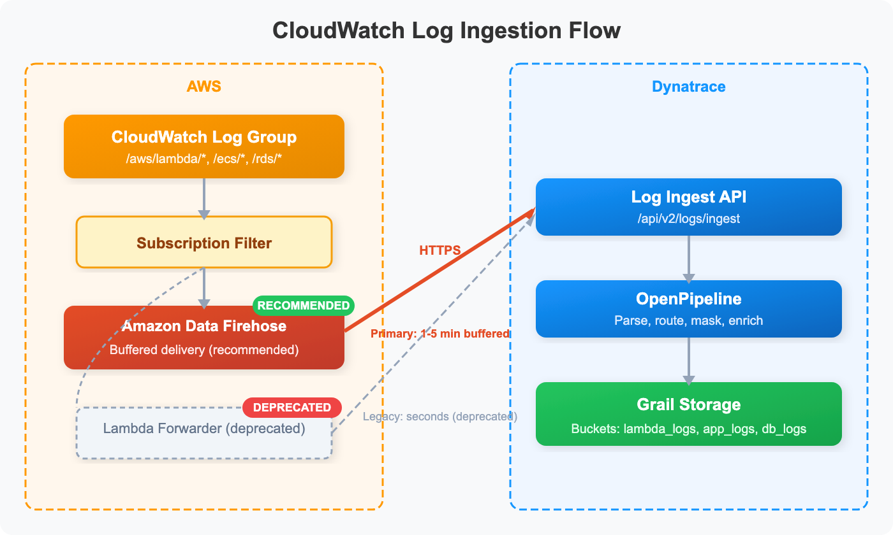

# CLOUD-07: CloudWatch Log Ingestion

> **Series:** CLOUD | **Notebook:** 7 of 8 | **Created:** March 2026 | **Last Updated:** 03/12/2026

## Overview

This notebook covers strategies for forwarding cloud provider logs into Dynatrace. While the focus is on AWS CloudWatch log forwarding (the most common pattern), the principles apply to Azure (Event Hub) and GCP (Pub/Sub) as well. You will learn about Amazon Data Firehose (the recommended approach), alternative methods, filtering strategies, OpenPipeline processing, and cost optimization.


---

## Table of Contents

1. [Log Ingestion Architecture](#log-architecture)
2. [Amazon Data Firehose (Recommended)](#firehose)
3. [Alternative Ingestion Methods](#alternative-methods)
4. [Filtering at Source vs Dynatrace](#filtering-strategies)
5. [OpenPipeline Processing](#openpipeline)
6. [Querying Cloud Logs](#querying-logs)
7. [Cost Optimization](#cost-optimization)
8. [Summary and Next Steps](#summary)

---

## Prerequisites

| Requirement | Details |
|---|---|
| **Dynatrace Environment** | SaaS with Grail enabled |
| **Permissions** | `logs.read`, `logs.ingest`, `openpipeline.read` |
| **AWS Integration** | CloudWatch log groups generating data |
| **Prior Knowledge** | CLOUD-01 and CLOUD-02 fundamentals |


<a id="log-architecture"></a>

## 1. Log Ingestion Architecture

### AWS CloudWatch Log Forwarding Options

| Method | Mechanism | Latency | Status |
|---|---|---|---|
| **Amazon Data Firehose** | CloudWatch → Firehose → Dynatrace API | 1-5 min (buffered) | **Recommended** |
| **S3 Ingestion** | CloudWatch → S3 → Dynatrace serverless architecture | Minutes | Supported |
| **Lambda Log Collection** | Direct Lambda function log forwarding | Seconds | Supported (Lambda-specific) |
| **Lambda Forwarder (Legacy)** | CloudWatch Subscription Filter → Lambda → Dynatrace API | Seconds | **Deprecated** — migrate to Firehose |
| **OpenTelemetry Collector** | FluentBit/FluentD → OTLP → Dynatrace | Seconds | Supported (agent-based) |

> **Important:** The Dynatrace AWS Log Forwarder (Lambda-based) is **deprecated** and will not receive further updates. For new deployments, use **Amazon Data Firehose**. Existing Lambda forwarder deployments should plan migration to Firehose.

### Cross-Cloud Log Forwarding

| Cloud Provider | Primary Method | Alternative |
|---|---|---|
| **AWS** | Amazon Data Firehose | S3 ingestion, Lambda log collection |
| **Azure** | Azure Event Hub / Diagnostic Settings | Azure Functions forwarder |
| **GCP** | Pub/Sub via GKE integration | Cloud Functions + Pub/Sub |

### Architecture Overview



<!-- MARKDOWN_TABLE_ALTERNATIVE
| Step | Component | Description |
|------|-----------|-------------|
| 1 | CloudWatch Log Group | Source: /aws/lambda/*, /ecs/*, /rds/* |
| 2 | Subscription Filter | Pattern-based log selection |
| 3 | Amazon Data Firehose | Primary path: buffered delivery to Dynatrace (recommended) |
| 4 | Dynatrace Log Ingest API | /api/v2/logs/ingest |
| 5 | OpenPipeline | Parse, route, mask, enrich |
| 6 | Grail Storage | Buckets: lambda_logs, app_logs, db_logs |
For environments where SVG doesn't render
-->

<a id="firehose"></a>

## 2. Amazon Data Firehose (Recommended)

Amazon Data Firehose is the recommended method for forwarding CloudWatch logs to Dynatrace. It provides a fully managed, serverless log pipeline with no infrastructure to maintain.

### How It Works

1. **CloudWatch Subscription Filters** are attached to target log groups
2. Logs matching the filter are delivered to an **Amazon Data Firehose** delivery stream
3. Firehose buffers, compresses, and delivers logs to the **Dynatrace Log Ingest API**
4. Logs are processed through **OpenPipeline** and stored in **Grail**

### Key Benefits

| Feature | Description |
|---|---|
| **Fully managed** | No Lambda functions or custom code to maintain |
| **Auto-scaling** | Handles any log volume automatically |
| **Smart retry** | Built-in retry with exponential backoff on delivery failures |
| **Buffering** | Configurable buffer size (1-128 MB) and interval (60-900 seconds) |
| **Compression** | Automatic GZIP compression reduces transfer costs |
| **S3 backup** | Optional backup of all or failed records to S3 |

### Setup via Clouds App

When you onboard an AWS account via the **Clouds app**, CloudWatch log forwarding via Firehose can be configured as part of the guided setup. The CloudFormation template creates:

- Firehose delivery stream configured with Dynatrace endpoint
- IAM roles for Firehose to deliver to Dynatrace
- Secrets Manager entry for the Dynatrace API token
- Optional: CloudWatch subscription filters for selected log groups

### Manual Setup Steps

1. Create a **Firehose delivery stream** with HTTP endpoint destination
2. Set the endpoint URL to your Dynatrace log ingest API: `https://{env-id}.live.dynatrace.com/api/v2/logs/ingest`
3. Configure an **access key** using a Dynatrace API token with `logs.ingest` scope
4. Set buffer conditions (recommended: 1 MB or 60 seconds)
5. Enable GZIP compression
6. Create **CloudWatch Subscription Filters** on target log groups pointing to the Firehose stream

### Subscription Filter Patterns

CloudWatch subscription filters support pattern matching to pre-filter logs before forwarding:

| Pattern | What It Matches |
|---|---|
| `""` (empty) | All log events |
| `"ERROR"` | Lines containing ERROR |
| `?"ERROR" ?"WARN"` | Lines containing ERROR or WARN |
| `{ $.level = "error" }` | JSON logs where level is error |
| `[ip, id, user, timestamp, request, status_code >= 400]` | Space-delimited logs with status >= 400 |

<a id="alternative-methods"></a>

## 3. Alternative Ingestion Methods

### S3 Log Ingestion

For logs already stored in S3 (e.g., ALB access logs, CloudTrail, VPC Flow Logs):

| Feature | Description |
|---|---|
| **Mechanism** | S3 event notification → serverless architecture → Dynatrace API |
| **Best for** | Historical log import, services that write directly to S3 |
| **Parsing** | Out-of-the-box parsing for common AWS log formats |
| **Multi-region** | Supports cross-region and multi-account setups |

### Lambda Log Collection

For AWS Lambda function logs specifically, Dynatrace offers direct log collection:

| Feature | Description |
|---|---|
| **Mechanism** | Dynatrace Lambda Layer captures logs directly |
| **Best for** | Lambda-specific monitoring (cost-optimized, lower latency) |
| **Prerequisite** | Dynatrace Lambda Layer already deployed for tracing |
| **Advantage** | No subscription filter or Firehose needed for Lambda logs |

### Legacy: Lambda Forwarder (Deprecated)

> **Deprecated:** The `dynatrace-aws-log-forwarder` Lambda function is deprecated and will not receive further updates. Migrate existing deployments to Amazon Data Firehose.

The legacy Lambda forwarder used CloudWatch Subscription Filters to invoke a custom Lambda function that forwarded logs to Dynatrace. While it provided low-latency delivery, it required maintaining custom Lambda infrastructure.

### Method Comparison

| Method | Latency | Maintenance | Cost | Best For |
|---|---|---|---|---|
| **Firehose** | 1-5 min | None (managed) | Firehose + data transfer | General CloudWatch logs (recommended) |
| **S3 ingestion** | Minutes | Low | S3 storage + transfer | Historical logs, S3-native services |
| **Lambda log collection** | Seconds | None | Included with Lambda Layer | Lambda function logs |
| **Lambda forwarder** | Seconds | High (deprecated) | Lambda invocations | **Do not use for new deployments** |

<a id="filtering-strategies"></a>

## 4. Filtering at Source vs Dynatrace

A critical design decision is **where** to filter logs: at the cloud provider level or within Dynatrace.

### Comparison

| Aspect | Filter at Source (CloudWatch) | Filter in Dynatrace (OpenPipeline) |
|---|---|---|
| **Cost** | Reduces ingestion volume and DDU cost | Full volume ingested, higher DDU cost |
| **Flexibility** | Limited pattern matching | Full DQL-based processing |
| **Data loss risk** | Filtered logs are not recoverable | All logs retained (can filter at query time) |
| **Latency** | Immediate (before forwarding) | At ingestion (OpenPipeline processing) |
| **Maintenance** | Subscription filters per log group | Centralized OpenPipeline rules |

### Recommended Hybrid Approach

1. **Source-level (CloudWatch):** Filter out known noise (health checks, debug logs in production)
2. **OpenPipeline:** Enrich, parse, route, and selectively discard or downsample
3. **Query-time:** Use DQL filters for ad-hoc analysis

### Common Source-Level Filters

| Log Group | Filter Pattern | Rationale |
|---|---|---|
| `/aws/lambda/*` | `?"ERROR" ?"WARN" ?"CRITICAL"` | Skip DEBUG/INFO for Lambda |
| `/ecs/service/*` | `""` (all) | Forward all application logs |
| `/aws/rds/*` | `?"error" ?"slow query"` | Focus on errors and slow queries |
| ALB access logs | `[w1, w2, w3, w4, w5, w6, w7, status_code >= 400, ...]` | Only 4xx/5xx responses |


<a id="openpipeline"></a>

## 5. OpenPipeline Processing

Once cloud logs reach Dynatrace, OpenPipeline processes them before storage in Grail.

### Common OpenPipeline Operations for Cloud Logs

| Operation | Purpose | Example |
|---|---|---|
| **Parse** | Extract structured fields from unstructured logs | Parse JSON, extract IP addresses |
| **Route** | Send logs to specific Grail buckets | Route Lambda logs to `lambda_logs` bucket |
| **Enrich** | Add metadata fields | Add `cloud.provider: aws`, `environment: prod` |
| **Filter/Drop** | Discard noisy log lines | Drop health check entries |
| **Transform** | Modify field values | Normalize severity levels |

### Example Pipeline Logic

```
Incoming cloud logs
  │
  ├─ Parse JSON content (if JSON)
  ├─ Extract log_group and log_stream from attributes
  ├─ Add cloud.provider = "aws"
  ├─ Route /aws/lambda/* → bucket: lambda_logs
  ├─ Route /ecs/* → bucket: application_logs
  ├─ Route /aws/rds/* → bucket: database_logs
  └─ Drop if content matches health check pattern
```


<a id="querying-logs"></a>

## 6. Querying Cloud Logs

### All CloudWatch-Sourced Logs


```dql
// Recent logs from AWS (last hour)
fetch logs, from:-1h
| filter isNotNull(log.source) and contains(log.source, "aws")
| fieldsKeep timestamp, content, log.source, loglevel
| sort timestamp desc
| limit 20
```

### Log Volume by Source


```dql
// Log volume by source over the last 24 hours
fetch logs, from:-24h
| summarize log_count = count(), by:{log.source}
| sort log_count desc
| limit 15
```

### Error Log Trend Over Time


```dql
// Error logs per hour over the last 24 hours
fetch logs, from:-24h
| filter loglevel == "ERROR"
| makeTimeseries error_count = count(), interval:1h
```

### Top Error Messages


```dql
// Most frequent error log messages in the last 6 hours
fetch logs, from:-6h
| filter loglevel == "ERROR"
| summarize error_count = count(), by:{content}
| sort error_count desc
| limit 10
```

### Log Volume by Kubernetes Namespace


```dql
// Log volume by Kubernetes namespace over the last 6 hours
fetch logs, from:-6h
| filter isNotNull(k8s.namespace.name)
| summarize log_count = count(), by:{k8s.namespace.name, loglevel}
| sort log_count desc
| limit 20
```

<a id="cost-optimization"></a>

## 7. Cost Optimization

Log ingestion is typically the largest cost driver in cloud monitoring. Optimization is critical.

### Cost Impact by Layer

| Layer | Cost Type | Optimization Lever |
|---|---|---|
| **CloudWatch** | $0.50/GB ingested + $0.03/GB stored | Reduce log retention, filter at source |
| **Firehose** | Firehose data processing ($0.029/GB) | Buffer settings, compression |
| **Dynatrace** | DDU per GB ingested | Source filtering, OpenPipeline drop rules |
| **Grail storage** | DDU per GB stored x retention | Bucket-level retention policies |

### Optimization Strategies (Ranked by Impact)

| Strategy | Estimated Savings | Complexity |
|---|---|---|
| **1. Drop debug/trace logs at source** | 40-60% | Low |
| **2. Filter health checks at source** | 10-30% | Low |
| **3. Route to low-retention buckets** | 20-40% storage | Medium |
| **4. Downsample repetitive logs in OpenPipeline** | 10-20% | Medium |
| **5. Use sampling for high-volume services** | Variable | Medium |
| **6. Compress log payloads** | 5-10% transfer | Low |

### Monitoring Your Log Costs


```dql
// Log volume trend by hour over the last 7 days
fetch logs, from:-7d
| makeTimeseries log_count = count(), interval:1h
```

```dql
// Top 10 log sources by volume over the last 24 hours
fetch logs, from:-24h
| summarize log_count = count(), by:{log.source}
| sort log_count desc
| limit 10
```

<a id="summary"></a>

## 8. Summary and Next Steps

### Key Takeaways

- **Amazon Data Firehose** is the recommended approach for AWS CloudWatch log ingestion — fully managed, auto-scaling, no custom code
- The legacy Lambda-based log forwarder is **deprecated** — migrate existing deployments to Firehose
- **Filter at the source** (CloudWatch subscription filters) to reduce costs before logs reach Dynatrace
- Use **OpenPipeline** for enrichment, routing, and fine-grained filtering within Dynatrace
- **Monitor log volume** regularly to prevent cost surprises
- Apply similar patterns for **Azure (Event Hub)** and **GCP (Pub/Sub)** log forwarding

### Next Steps

- **CLOUD-08: Multi-Cloud Patterns** — Unified log analysis across providers
- See the **OPLOGS notebook series** for deep dive into OpenPipeline log processing
- See the **OPMIG notebook series** for migrating from classic logs to OpenPipeline

---

<sub>*This notebook was AI-generated from community-submitted and publicly available sources. This notebook series is not officially supported by Dynatrace. Always verify information against official Dynatrace documentation.*</sub>

