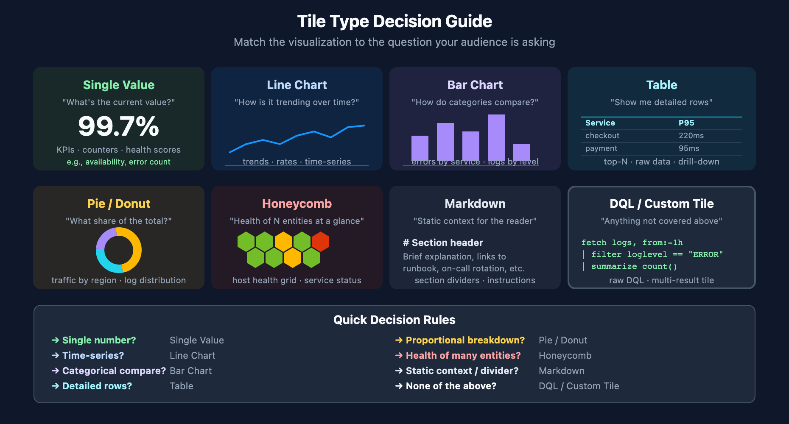

# DASH-01: Dashboard Fundamentals

> **Series:** DASH — Dashboard Design & Building | **Notebook:** 1 of 7 | **Created:** March 2026 | **Last Updated:** 05/07/2026

## Overview

Dashboards are the primary visualization layer in Dynatrace, turning raw observability data into actionable insights. This notebook covers the distinction between dashboards and notebooks, when to use each, the architecture of Dynatrace dashboards (tiles, sections, variables), and core design principles that make dashboards effective. Whether you are building your first dashboard or refining an existing library, these fundamentals provide the foundation for every notebook in this series.

### Sprint 1.337 (April 2026): New Dashboard Building Blocks

Sprint 1.337 introduced data shapes that make several dashboard patterns simpler:

1. **OneAgent primary fields/tags as top-level fields** on all signals (Latest Dynatrace). Filters and `by:` groupings can dispatch on `dt.security_context`, `dt.cost.costcenter`, `dt.cost.product`, and customer-defined `primary_tags.<key>` directly — no more `parse(content, ...)` in dashboard tile queries. Particularly impactful for executive dashboards (DASH-03) that need cost-by-business-unit views.
2. **Smartscape Ownership integration** — entities now carry ownership (`ownership.team`, `ownership.oncall`) as queryable attributes. Dashboards can split metrics or surface alerts by owning team without maintaining side-tables. See:

   ```dql
   smartscapeNodes "SERVICE"
   | fieldsAdd team = getNodeField(smartscape.id, "ownership.team")
   | summarize service_count = count(), by:{team}
   | sort service_count desc
   ```

3. **OTel `service.name` enrichment** + new **`dt.service.name`** field — splitting service-level dashboards by OTel-canonical name now works without joining through entity enrichment.

---

---

## Table of Contents

1. [Dashboards vs Notebooks](#dashboards-vs-notebooks)
2. [Dashboard Architecture](#dashboard-architecture)
3. [Design Principles](#design-principles)
4. [Dashboard Creation Workflow](#dashboard-creation-workflow)
5. [Your First Dashboard Query](#your-first-dashboard-query)
6. [Summary and Next Steps](#summary-and-next-steps)

---

## Prerequisites

| Requirement | Details |
|-------------|----------|
| **Dynatrace Environment** | SaaS or Managed with Grail enabled |
| **Permissions** | `storage:logs:read`, `storage:metrics:read`, `storage:events:read` |
| **Access** | Dashboard creation privileges (`document:documents:write`) |
| **Data** | At least 1 hour of ingested logs and metrics |

<a id="dashboards-vs-notebooks"></a>

## 1. Dashboards vs Notebooks

Dynatrace provides two primary visualization tools, each designed for different use cases.

| Feature | Dashboard | Notebook |
|---------|-----------|----------|
| **Purpose** | Ongoing monitoring and reporting | Ad-hoc exploration and analysis |
| **Layout** | Grid-based tile arrangement | Sequential, document-style cells |
| **Audience** | Teams, stakeholders, wall screens | Individual analysts and engineers |
| **Interactivity** | Variables, filters, drill-down links | Inline DQL editing, iterative queries |
| **Refresh** | Auto-refresh (configurable interval) | Manual execution per cell |
| **Sharing** | Link sharing, embed, scheduled reports | Share as document or export |
| **Persistence** | Saved as Dynatrace documents | Saved as Dynatrace documents or `.ipynb` |

### When to Use a Dashboard

- **Continuous monitoring** — service health, SLA tracking, infrastructure overview
- **Team visibility** — wall screens, shared views across roles
- **Stakeholder reporting** — executive summaries, weekly status
- **Alerting context** — a landing page linked from alert notifications

### When to Use a Notebook

- **Incident investigation** — iterating on queries to find root cause
- **Data exploration** — discovering patterns in new data sources
- **Knowledge sharing** — documented analysis with explanatory text
- **Training** — step-by-step DQL tutorials (like this series)

<a id="dashboard-architecture"></a>

## 2. Dashboard Architecture


<!-- MARKDOWN_TABLE_ALTERNATIVE
| Question | Tile Type |
|----------|-----------|
| What's the current value? | Single Value |
| How is it trending? | Line Chart |
| How do categories compare? | Bar Chart |
| Show me detailed rows | Table |
| What share of the total? | Pie / Donut |
| Health of many entities? | Honeycomb |
| Static context / divider? | Markdown |
| Anything else | DQL / Custom Tile |
For environments where SVG doesn't render
-->

A Dynatrace dashboard is composed of three core building blocks:

### Tiles

Tiles are the individual visualization units. Each tile contains a single DQL query (or metric expression) and renders as a specific chart type.

| Tile Type | Best For | Example |
|-----------|----------|----------|
| **Single value** | KPIs, counters, health scores | Error count, availability % |
| **Line chart** | Trends over time | CPU usage, request rate |
| **Bar chart** | Categorical comparisons | Errors by service, logs by level |
| **Table** | Detailed data, top-N lists | Top 10 slowest endpoints |
| **Pie / Donut** | Proportional breakdowns | Traffic by region |
| **Honeycomb** | Entity health at a glance | Host health grid |
| **Markdown** | Static text, instructions | Section headers, links |

### Sections

Sections group related tiles visually. Use sections to organize dashboards by theme — for example, a "Service Health" section alongside an "Infrastructure" section. Sections can be collapsed and rearranged.

### Variables

Variables make dashboards dynamic. A single dashboard template can serve multiple teams by letting users select entities, environments, or time ranges from dropdown controls. Variables are covered in depth in **DASH-06**.

<a id="design-principles"></a>

## 3. Design Principles

Effective dashboards follow consistent design principles regardless of the audience.

### Clarity

- **One purpose per dashboard** — avoid "everything" dashboards that try to serve every audience
- **Descriptive tile titles** — a tile titled "Error Rate (%) — Checkout Service" is immediately understandable; "Query 1" is not
- **Consistent time ranges** — all tiles should use the dashboard time selector unless there is a specific reason for a fixed range

### Audience Awareness

- **Executives** need 3-5 high-level KPIs, not 30 detailed charts
- **Operations** teams need real-time status and alert context
- **Engineers** need drill-down capability and raw data access

Design for your audience first, then consider the data.

### Actionability

Every tile should answer a question or trigger an action:

| Tile Shows | Action |
|------------|--------|
| Error rate above threshold | Investigate in notebook or traces |
| SLA breach trending | Escalate to engineering |
| Deployment marker + latency spike | Correlate with release |
| Host CPU saturated | Scale or investigate process |

If a tile does not lead to a decision, consider removing it.

### Layout Best Practices

- **Top-left anchor** — place the most critical KPI in the top-left (first thing the eye hits)
- **Z-pattern reading** — arrange tiles so the dashboard reads left-to-right, top-to-bottom
- **Group related tiles** — use sections to cluster related metrics
- **Limit tile count** — aim for 8-12 tiles per dashboard; more than 15 creates cognitive overload

<a id="dashboard-creation-workflow"></a>

## 4. Dashboard Creation Workflow

Follow this structured approach when building a new dashboard:

### Step 1: Define the Audience and Purpose

Answer these questions before opening the dashboard editor:

- **Who** will view this dashboard? (role, technical level)
- **What** decisions will it support?
- **When** will it be viewed? (real-time wall screen, weekly review, incident response)
- **How often** should data refresh?

### Step 2: Identify Key Metrics

Select 5-10 metrics that directly answer the audience's questions. Validate each query in a notebook first.

### Step 3: Prototype in a Notebook

Write and validate all DQL queries in a notebook before building the dashboard. This lets you iterate quickly without fighting the tile editor.

### Step 4: Build the Dashboard

Transfer validated queries to dashboard tiles. Arrange tiles in sections following the layout principles above.

### Step 5: Add Variables and Filters

Make the dashboard reusable by adding entity and time range variables.

### Step 6: Share and Iterate

Share with the target audience, collect feedback, and refine. A dashboard is never "done" — it evolves with the team's needs.

<a id="your-first-dashboard-query"></a>

## 5. Your First Dashboard Query

Before building a dashboard, you need validated DQL queries. Let's start with a few foundational queries that appear on almost every dashboard.

### Total Log Volume by Level

This query provides a quick overview of log health — useful as a bar chart tile.

```dql
// Log volume breakdown by severity level
fetch logs, from:-1h
| summarize log_count = count(), by:{loglevel}
| sort log_count desc
```

### Active Problem Count

A single-value tile showing how many detected problems are currently active — the most common executive KPI.

```dql
// Count of currently active detected problems
fetch dt.davis.problems, from:-24h
| filter event.status == "ACTIVE"
| summarize active_problems = countDistinct(event.id)
```

### Error Log Trend Over Time

A line chart showing error frequency — ideal for spotting spikes and correlating with deployments.

```dql
// Error log trend over the last 6 hours
fetch logs, from:-6h
| filter loglevel == "ERROR"
| makeTimeseries error_count = count(), interval:10m
```

### Host CPU Overview

A timeseries query for a line chart showing CPU usage across hosts.

```dql
// Average CPU usage by host over the last hour
timeseries avg_cpu = avg(dt.host.cpu.usage), from:-1h, by:{dt.entity.host}
```

<a id="summary-and-next-steps"></a>

## 6. Summary and Next Steps

In this notebook you learned:

- The difference between dashboards and notebooks, and when to use each
- Dashboard architecture: tiles, sections, and variables
- Core design principles: clarity, audience awareness, actionability
- A structured workflow for creating dashboards
- Foundational DQL queries that appear on most dashboards

**Next:** In **DASH-02: Dashboard Hierarchy**, we explore the three-tier model — Executive, Operations, and Engineering dashboards — and how to design information density for each audience.

---

<sub>*This notebook was AI-generated from community-submitted and publicly available sources. This notebook series is not officially supported by Dynatrace. Always verify information against official Dynatrace documentation.*</sub>
