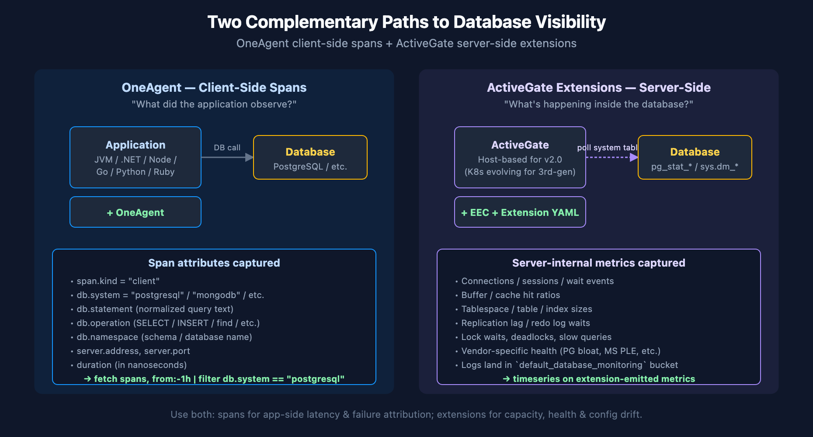

# DBMON-01: Database Monitoring Fundamentals

> **Series:** DBMON — Database Monitoring | **Notebook:** 1 of 7 | **Created:** March 2026 | **Last Updated:** 06/10/2026

## Overview

This notebook introduces how Dynatrace monitors databases across your environment. You will learn how OneAgent automatically detects database calls through distributed tracing, how database spans capture query-level detail, and how the Dynatrace entity model represents database services. We also cover ActiveGate extensions for remote database monitoring and the full range of supported database technologies.

---

## Table of Contents

1. [How Database Monitoring Works](#how-database-monitoring-works)
2. [Database Span Anatomy](#database-span-anatomy)
3. [Discovering Database Services](#discovering-database-services)
4. [Database Span Exploration](#database-span-exploration)
5. [Database Types and Technologies](#database-types-and-technologies)
6. [ActiveGate Extensions for Remote Monitoring](#activegate-extensions)
7. [Baseline Database Metrics](#baseline-database-metrics)
8. [Summary and Next Steps](#summary)

---

## Prerequisites

| Requirement | Details |
|-------------|---------|
| **Dynatrace Environment** | SaaS or Managed with Grail enabled |
| **OneAgent** | Deployed on application hosts making database calls |
| **Permissions** | `storage:spans:read`, `storage:entities:read`, `storage:metrics:read` |
| **Data** | At least 1 hour of application traffic generating database calls |

<a id="how-database-monitoring-works"></a>

## 1. How Database Monitoring Works

Dynatrace monitors databases through two complementary approaches:

| Approach | How It Works | What It Captures |
|----------|-------------|------------------|
| **OneAgent Code-Level Instrumentation** | Automatically instruments database client libraries (JDBC, ADO.NET, database drivers) | Query text, execution time, result counts, connection details |
| **ActiveGate Extensions** | Connects remotely to database management interfaces (SQL queries against system tables) | Internal DB metrics: tablespace usage, lock waits, buffer cache hit ratio |

OneAgent captures every database call as a **span** in the distributed trace. These spans contain:

- **`db.system`** — The database technology (e.g., `postgresql`, `mysql`, `mongodb`)
- **`db.statement`** — The query or command executed (normalized to remove literals)
- **`db.operation`** — The operation type (`SELECT`, `INSERT`, `UPDATE`, `DELETE`, `find`, `aggregate`)
- **`db.namespace`** — The database or schema name
- **`server.address`** — The database server hostname or IP
- **`server.port`** — The database server port

> **Note:** Dynatrace normalizes SQL statements by replacing literal values with `?` placeholders. This groups identical query patterns together regardless of parameter values.


<!-- MARKDOWN_TABLE_ALTERNATIVE
| Path | Captures | DQL pattern |
|------|----------|-------------|
| OneAgent client-side | Span attributes (db.system, db.statement, duration) for every DB call from app | fetch spans \| filter db.system == "..." |
| ActiveGate Extensions server-side | Server-internal metrics (connections, buffer hit ratio, table sizes, deadlocks) | timeseries on extension-emitted metric keys |
For environments where SVG doesn't render
-->

<a id="database-span-anatomy"></a>

## 2. Database Span Anatomy

Let's examine the structure of a database span by querying for recent database calls and inspecting the available fields.

```dql
// Inspect database span fields — sample 10 recent DB calls
fetch spans, from:-1h
| filter isNotNull(db.system)
| fields timestamp, db.system, db.operation, db.namespace,
        db.statement, server.address, server.port,
        duration, span.kind, dt.entity.service
| sort timestamp desc
| limit 10
```

The query above returns the key attributes of each database span:

| Field | Description | Example |
|-------|-------------|---------|
| `db.system` | Database technology identifier | `postgresql`, `mysql`, `mongodb` |
| `db.operation` | SQL command or DB operation | `SELECT`, `INSERT`, `find` |
| `db.namespace` | Database or schema name | `orders_db`, `inventory` |
| `db.statement` | Normalized query text | `SELECT * FROM orders WHERE id = ?` |
| `server.address` | Database host | `db-prod-01.internal` |
| `duration` | Execution time in nanoseconds | `1500000` (1.5ms) |
| `span.kind` | Always `CLIENT` for outgoing DB calls | `CLIENT` |

<a id="discovering-database-services"></a>

## 3. Discovering Database Services

Dynatrace automatically creates **database service entities** when it detects database calls. These entities represent the logical database endpoint, not the host. Let's discover what database services exist in your environment.

```dql
// Discover all database service entities (modern Smartscape topology query)
smartscapeNodes "SERVICE"
| filter serviceType == "DATABASE_SERVICE"
| fields name, databaseHostNames, databaseVendor, softwareTechnologies
| sort name asc
| limit 50

// Legacy alternative (deprecated dt.entity.* — still works on hybrid tenants):
// fetch dt.entity.service
// | filter serviceType == "DATABASE_SERVICE"
// | fields entity.name, databaseHostNames, databaseVendor, softwareTechnologies
// | sort entity.name asc
// | limit 50
```

You can also discover databases through the spans themselves, which is useful when entity detection hasn't yet completed or when you want to see databases called from specific services.

```dql
// Discover database technologies from span data
fetch spans, from:-1h
| filter isNotNull(db.system)
| summarize {
|     call_count = count(),
|     avg_duration_ms = avg(duration) / 1ms,
|     distinct_statements = countDistinct(db.statement)
| }, by:{db.system, db.namespace, server.address}
| sort call_count desc
| limit 20
```

<a id="database-span-exploration"></a>

## 4. Database Span Exploration

Understanding the distribution of database calls helps identify which databases are most heavily used and where optimization efforts should focus.

```dql
// Database call volume by technology over the last hour
fetch spans, from:-1h
| filter isNotNull(db.system)
| summarize {
|     total_calls = count(),
|     avg_duration_ms = avg(duration) / 1ms,
|     p95_duration_ms = percentile(duration, 95) / 1ms,
|     max_duration_ms = max(duration) / 1ms
| }, by:{db.system}
| sort total_calls desc
```

```dql
// Database call volume over time — identify traffic patterns
fetch spans, from:-6h
| filter isNotNull(db.system)
| makeTimeseries call_count = count(), by:{db.system}, interval:5m
```

```dql
// Distribution of database operations (SELECT vs INSERT vs UPDATE vs DELETE)
fetch spans, from:-1h
| filter isNotNull(db.system) and isNotNull(db.operation)
| summarize op_count = count(), by:{db.system, db.operation}
| sort db.system asc, op_count desc
```

<a id="database-types-and-technologies"></a>

## 5. Database Types and Technologies

Dynatrace supports a broad range of database technologies through OneAgent auto-instrumentation:

| Category | Technologies | `db.system` Values |
|----------|-------------|-------------------|
| **Relational (SQL)** | PostgreSQL, MySQL/MariaDB, Microsoft SQL Server, Oracle, IBM Db2 | `postgresql`, `mysql`, `mssql`, `oracle`, `db2` |
| **NoSQL Document** | MongoDB, Couchbase, Amazon DynamoDB, Azure Cosmos DB | `mongodb`, `couchbase`, `dynamodb`, `cosmosdb` |
| **NoSQL Key-Value** | Redis, Memcached, Amazon ElastiCache | `redis`, `memcached` |
| **NoSQL Column** | Apache Cassandra, Apache HBase, ScyllaDB | `cassandra`, `hbase` |
| **Search Engines** | Elasticsearch, OpenSearch, Apache Solr | `elasticsearch`, `opensearch`, `solr` |
| **Message Brokers** | Apache Kafka, RabbitMQ, Amazon SQS | `kafka`, `rabbitmq` |
| **Graph** | Neo4j, Amazon Neptune | `neo4j`, `neptune` |

> **Important:** The `db.system` field follows the OpenTelemetry semantic conventions. The exact values may vary depending on the database driver and instrumentation version.

> **Semantic Dictionary 1.340 (May 2026) — first-class Smartscape database models.** The Semantic Dictionary now defines dedicated Smartscape models for major database technologies: Oracle Database (ASM disk group, cluster, instance, database), SQL Server (availability database / group / replica, instance, database), SAP HANA (database, instance, service), IBM Db2 (database member, instance, tablespace), MySQL, MariaDB, and PostgreSQL (database + instance each) — 19 models in total, each with `belongs_to` / `runs_on` / `is_part_of` / `same_as` / `uses` relationship properties. As these roll out, expect database topology to surface as typed Smartscape nodes rather than only the generic `DATABASE_SERVICE` shape used in §3. The span-level `db.system` analysis in this series is unaffected.

> **OneAgent 1.339 (June 2026) — Db2 naming is now mixed case.** Db2 database naming switched to mixed case, so saved DQL or filters that match Db2 *entity or database names* case-sensitively may need updating. The `db.system == "db2"` span-attribute filters used throughout this series follow the OpenTelemetry semantic convention (lowercase value) and are unaffected.

```dql
// Discover which database technologies are active in your environment
fetch spans, from:-24h
| filter isNotNull(db.system)
| summarize {
|     call_count = count(),
|     unique_databases = countDistinct(db.namespace),
|     unique_servers = countDistinct(server.address)
| }, by:{db.system}
| sort call_count desc
```

<a id="activegate-extensions"></a>

## 6. ActiveGate Extensions for Remote Monitoring

While OneAgent captures database calls from the application side (client spans), ActiveGate extensions monitor the database server itself. This provides internal metrics that are invisible from the application perspective.

> **Recommendation for new customers:** start with **Extensions 3rd-gen** (the current generation, sprint-1.337+). Extensions 2.0 is still supported for existing installs; Extensions 3rd-gen is the default for net-new database monitoring.

### Extension Architecture

| Component | Role |
|-----------|------|
| **ActiveGate** | Hosts the extension runtime; must be **host-based** (not Kubernetes-based) for Extensions 2.0 — Extensions 3rd-gen support is evolving, check the Dynatrace docs for current K8s status |
| **Extension Package** | YAML-defined declarative package executed by the Extension Execution Controller (EEC). Most database extensions ship with built-in SQL/Prometheus/SNMP data sources; custom logic can be added via an optional Python data source |
| **Monitoring Configuration** | Defines connection string, credentials, polling interval, and the destination Grail bucket |
| **`default_database_monitoring` bucket** | Where extension logs land by default; reference this bucket in IAM policies for DB-team access scoping (see ORGNZ-02 + IAM-04/05) |

### Available Extensions

| Extension | Metrics Captured |
|-----------|------------------|
| **PostgreSQL** | Connections, transactions/sec, tuple operations, table/index sizes, lock waits, replication lag |
| **MySQL** | Connections, queries/sec, buffer pool hit ratio, InnoDB row operations, slow queries |
| **MS SQL Server** | Batch requests/sec, page life expectancy, buffer cache hit ratio, deadlocks, wait stats |
| **Oracle** | Sessions, tablespace usage, SGA/PGA memory, redo log waits, library cache hit ratio |
| **MongoDB** | Connections, operations/sec, document metrics, replica set health, storage engine stats |

> **Note:** Extensions 2.0 require a **host-based ActiveGate**, not a Kubernetes-based deployment. See the Dynatrace documentation for extension installation procedures.

### Where to Go Deeper

- **AUTOM series** (11 notebooks) — GitOps / Monaco / Terraform automation for extension deployment at scale
- **ORGNZ-02** — Bucket strategy (including `default_database_monitoring`)
- **IAM-04 / IAM-05** — Policy design that scopes extension log access by bucket

### Where Extension Logs Land in Grail

Logs emitted by official Dynatrace database extensions are routed to a dedicated Grail bucket: **`default_database_monitoring`** (introduced in Dynatrace SaaS 1.337). Querying this bucket directly improves filter performance vs. scanning `default_logs`, and lets you scope IAM policies tightly to database-monitoring data.

```dql
fetch logs, from:-1h
| filter dt.system.bucket == "default_database_monitoring"
| filter dt.extension.name == "com.dynatrace.extension.postgresql"
| limit 50
```

Grant `storage:bucket.default_database_monitoring:read` to roles that need to query this bucket.

<a id="baseline-database-metrics"></a>

## 7. Baseline Database Metrics

Establishing a performance baseline is essential for detecting anomalies. The following queries help you understand your typical database performance characteristics.

```dql
// Database response time baseline — hourly P50, P95, P99 over the last 24 hours
fetch spans, from:-24h
| filter isNotNull(db.system)
| makeTimeseries p50_ms = percentile(duration, 50) / 1ms,
                 p95_ms = percentile(duration, 95) / 1ms,
                 p99_ms = percentile(duration, 99) / 1ms,
                 interval:1h
```

```dql
// Error rate baseline — database call failures over time
fetch spans, from:-24h
| filter isNotNull(db.system)
| makeTimeseries total = count(),
                 errors = countIf(otel.status_code == "ERROR", default:0),
                 interval:1h
| fieldsAdd error_rate_pct = round(arraySum(errors) / arraySum(total) * 100, decimals:2)
```

<a id="summary"></a>

## 8. Summary and Next Steps

In this notebook you learned:

- How Dynatrace captures database activity through OneAgent span instrumentation
- The key span attributes (`db.system`, `db.statement`, `db.operation`, `db.namespace`) that describe each database call
- How to discover database service entities and active database technologies
- The role of ActiveGate extensions for server-side database metrics
- How to establish a performance baseline using span data

### Next Steps

- **DBMON-02: SQL Database Monitoring** — Deep dive into relational database analysis with PostgreSQL, MySQL, MS SQL, and Oracle
- **DBMON-03: NoSQL Database Monitoring** — MongoDB, Cassandra, DynamoDB, and Cosmos DB analysis

---

<sub>*This notebook was AI-generated from community-submitted and publicly available sources. This notebook series is not officially supported by Dynatrace. Always verify information against official Dynatrace documentation.*</sub>
