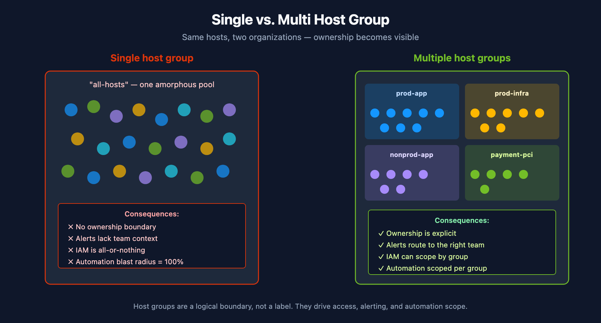
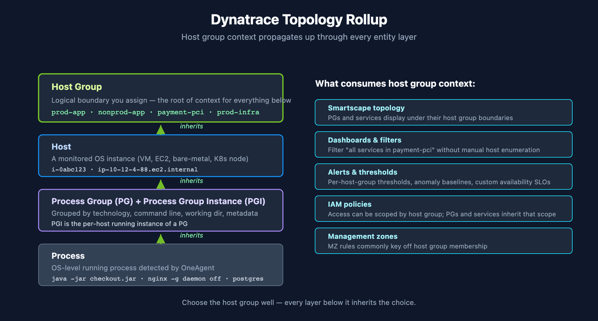
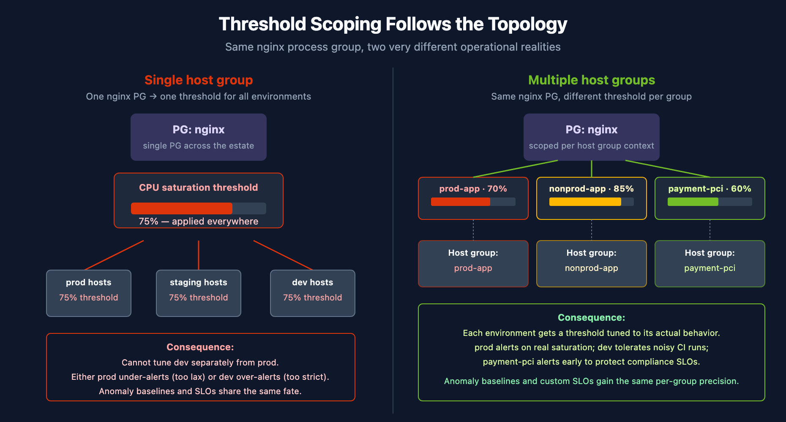
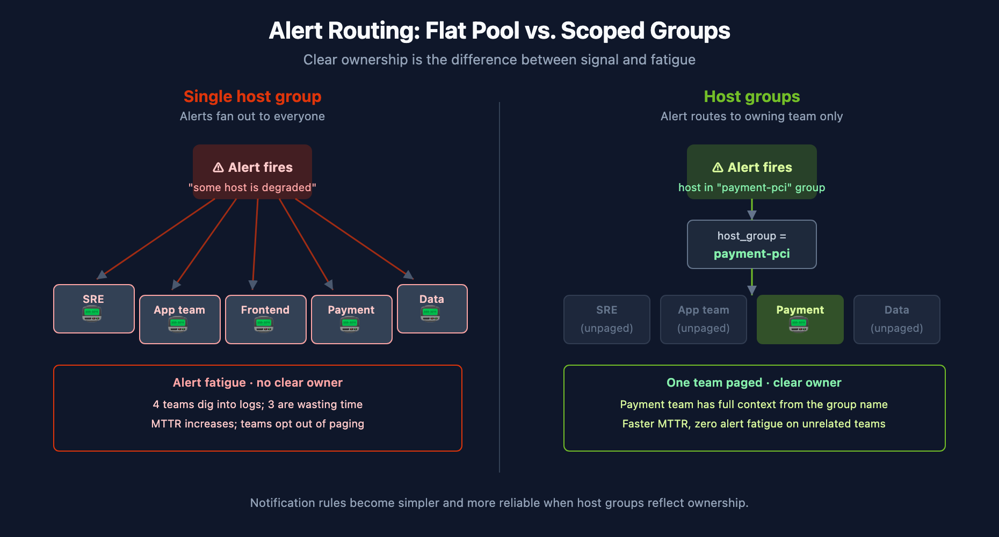
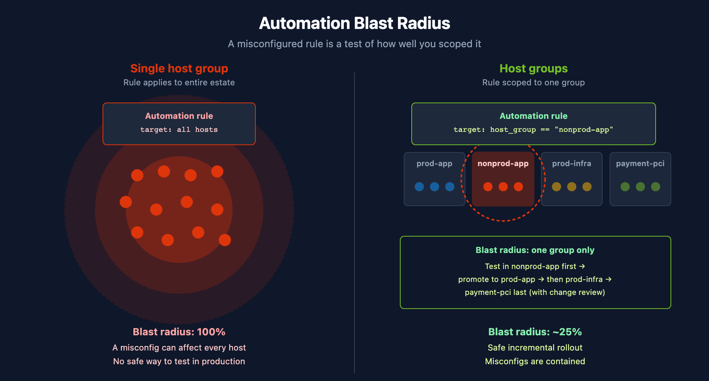

# FAQ-01: Why you need a good Host Group naming strategy

> **Series:** FAQ — Frequently Asked Questions | **Reference:** 01 — Host Group Naming Strategy | **Created:** May 2026 | **Last Updated:** 07/08/2026

## Overview

Host groups are a **foundational Dynatrace construct** used to establish meaningful boundaries within the monitored estate. They directly influence access control, alert ownership, operational clarity, automation scope, and long-term tenant maintainability.

A weak naming strategy — including the common pattern of placing every host into a single host group — appears simpler initially, but introduces **material operational, security, and governance risks** as the environment scales. A strong, deliberate naming strategy is one of the highest-leverage architectural decisions you make at tenant standup, because every layer of Dynatrace topology, alerting, IAM, and automation inherits from it.

This FAQ entry consolidates the case for taking host group naming seriously, the trade-offs of deferring it, and the design principles to anchor on.

---

## Table of Contents

1. [What Host Groups Represent](#what-host-groups-represent)
2. [Consideration #1: Clear Ownership and Operational Accountability](#ownership)
3. [Consideration #2: Access Control and Visibility Boundaries](#access-control)
4. [Consideration #3: Alerting Accuracy and Notification Routing](#alerting)
5. [Consideration #4: Operational Efficiency and Troubleshooting](#operations)
6. [Consideration #5: Automation Scope and Risk Containment](#automation)
7. [Consideration #6: Tenant Scalability and Long-Term Maintainability](#scalability)
8. [Trade-offs of a Weak or Single-Group Strategy](#tradeoffs-weak)
9. [Benefits of a Strong Naming Strategy](#benefits-strong)
10. [How a Strong Strategy Compounds as Your Environment Grows](#scaling)
11. [Recommended Design Principles](#design-principles)
12. [Final Recommendation](#final-recommendation)

---

## Prerequisites

| Requirement | Details |
|-------------|---------|
| **Audience** | Platform team, SRE leads, architecture review board, security stakeholders |
| **Format** | Decision-support document — presents justification and trade-offs, no hands-on lab |
| **Related topic series** | ORGNZ (Organize Data: Buckets, Segments, Security), IAM (IAM Administration), ONBRD (Dynatrace Onboarding) |

## 1. What Host Groups Represent

A host group is a **logical boundary** used to organize hosts based on stable, real-world ownership or purpose, such as:

- Environment (production vs. non-production)
- Application or service ownership
- Platform or workload type
- Business unit or team responsibility
- Compliance or regulatory boundaries

Host groups are **not merely labels**. They are used across Dynatrace configuration to define **scope, responsibility, and isolation**.

<!-- MARKDOWN_TABLE_ALTERNATIVE
| Aspect | Single Group | Multiple Groups |
|--------|-------------|----------------|
| Ownership | unclear | explicit |
| Alerts | lack context | route to owning team |
| IAM | all-or-nothing | scoped by group |
| Automation | blast radius 100% | scoped per group |
For environments where SVG doesn't render
-->

### How Host Groups Shape the Topology

Dynatrace's entity model links these layers — host groups contain hosts, hosts run Process Group Instances, PGIs aggregate into Process Groups, and services associate with Process Groups. Host-group context propagates upward through the topology:

**Host Group → Host → Process Group Instance → Process Group → Service**

When OneAgent detects running processes on a host, it assigns each one to a **Process Group** (PG) based on technology, command line, working directory, and metadata. The per-host running instances are called **Process Group Instances** (PGIs). PGs and PGIs inherit context from the host they run on, and hosts roll up into the host group you assign. Services then associate with the process groups that handle their requests.

The practical effect: **the host group you choose determines how processes, services, and dependencies are scoped throughout Dynatrace** — in Smartscape, dashboards, alerts, IAM policies, and management zones. A flat single-group tenant means every process group and service shares the same coarse boundary regardless of which app or environment it belongs to. Properly grouped hosts mean that filters like *"all error-prone services in `app-pci`"* work without manual selection.

| Layer | Gets host-group context from | Why it matters |
|-------|---------------|---------------|
| Host | Direct assignment (at OneAgent install or via `oneagentctl`) | The root of the chain — host group is a host-level attribute |
| Process Group Instance | The host it runs on | PGI metadata carries host group identity through to spans/services |
| Process Group | Its member PGIs (which run on hosts) | PG naming, grouping, and detection rules respect host group context |
| Service | The PGs that handle its requests | Service ownership reflects the host group of the underlying processes |
| SLO / Alert | The entities they target | Boundaries follow the topology rollup automatically |

<!-- MARKDOWN_TABLE_ALTERNATIVE
| Layer | Gets host-group context from | What Consumes It |
|-------|---------------|-------------------|
| Host | Direct assignment | Root of the rollup |
| PGI / Process Group | The host(s) they run on | Naming, grouping rules, thresholds |
| Service | The PGs handling its requests | Dashboards, IAM scope |
| Host Group context propagates to | Smartscape, dashboards, alerts/thresholds, IAM, management zones |
For environments where SVG doesn't render
-->

> **Concrete consequence — thresholds:** Process group thresholds, anomaly detection baselines, and custom availability SLOs are scoped through the topology. With all hosts in a single host group, Dynatrace sees the same process group everywhere and applies one set of thresholds across the entire estate. You cannot, for example, set a different CPU saturation threshold for `nginx` in production than for `nginx` in nonprod, because both PGs roll up to the same host group context. Splitting hosts into meaningful groups is what unlocks per-environment, per-tier, and per-team thresholds.

<!-- MARKDOWN_TABLE_ALTERNATIVE
| Setup | nginx PG threshold | Outcome |
|-------|-------------------|---------|
| Single host group | 75% applied to all envs | Prod under-alerts or dev over-alerts; cannot tune separately |
| Multiple host groups | prod-app 70% / nonprod-app 85% / app-pci 60% | Each environment tuned to its actual behavior |
For environments where SVG doesn't render
-->

This rollup is also why retroactive restructuring is disruptive: changing a host's group recomputes topology context for every process group, service, and SLO downstream of it. The concrete cost — per the `oneagentctl` reference, *"Using `--set-host-group` requires restart of OneAgent, as well as restart of all the monitored services"* — means moving a host between groups is not just a metadata change; the agent and every monitored service on that host restart. Defining good host groups up front means the entire entity tree is correctly scoped from day one.

> **Sources:**
> - [Host groups (DT docs)](https://docs.dynatrace.com/docs/shortlink/host-groups) — *"When the same process is running in two different host groups, Dynatrace will create one process group for each host group"*; basis for per-host-group thresholds, alerting overrides, OneAgent update settings, and management-zone integration
> - [Process groups and process group instances (DT docs)](https://docs.dynatrace.com/docs/shortlink/process-groups) — PG / PGI distinction; default detection rules
> - [oneagentctl (DT docs)](https://docs.dynatrace.com/docs/shortlink/oneagentctl) — *"Using `--set-host-group` requires restart of OneAgent, as well as restart of all the monitored services"*

## 2. Consideration #1: Clear Ownership and Operational Accountability

**Without a strong naming strategy:**

- All infrastructure appears as a single shared pool
- Ownership boundaries are unclear
- Platform teams must manually interpret responsibility during incidents

**With a strong naming strategy:**

- Ownership is explicitly defined
- Teams can quickly identify "their" hosts
- Operational accountability becomes clear and auditable

**Impact:** In community practice, the most consistent benefit teams report after moving off a single host group is faster incident triage and fewer ownership disputes — verify against your own MTTR data.

> **Sources:** [Host groups (DT docs)](https://docs.dynatrace.com/docs/shortlink/host-groups) — host-group as the documented boundary for ownership and operational scoping.

## 3. Consideration #2: Access Control and Visibility Boundaries

Dynatrace supports role-based visibility controls, but those controls require **clear infrastructure scoping**.

**With a single host group or weak naming:**

- Users inevitably gain broader visibility than intended
- Least-privilege access becomes difficult to enforce
- Security and audit concerns increase

**With multiple, deliberately named host groups:**

- Visibility can be aligned to teams, environments, or business units
- Platform admins are no longer forced into all-or-nothing access decisions
- Separation of duties is easier to demonstrate

**Impact:** Improved security posture and simplified audits.

> **Note on scoping mechanism choice:** For data-access ABAC, modern Gen3 Dynatrace tenants standardize on `dt.security_context` as the primary boundary field (see the IAM topic series). Host groups are still load-bearing for *operational* scoping — process detection, threshold tuning, alert routing, automation blast radius — even when `dt.security_context` is the boundary used for record-level data access. The two work together rather than competing.

> **Sources:**
> - [Identity & access management (DT docs)](https://docs.dynatrace.com/docs/manage/identity-access-management) — IAM umbrella; subpages for individual policy / permission topics
> - [Permission management — management zones (DT docs)](https://docs.dynatrace.com/docs/manage/identity-access-management/permission-management/management-zones) — host-group-driven management zones as IAM scope

## 4. Consideration #3: Alerting Accuracy and Notification Routing

Alerting effectiveness depends on correctly scoping **who owns what**.

**Without a strong naming strategy:**

- Alerts lack clear ownership context
- Notification rules become complex and error-prone
- Teams may receive alerts for systems they do not own

**With a strong naming strategy:**

- Alerts can be routed to responsible teams via management zones built on top of the host-group structure
- Notification logic is simpler and more reliable
- Alert fatigue is reduced

**Mechanic clarification:** Alerting profiles scope on management zone filters and severity-rule tag matching, *not* directly on host groups. Per-host-group routing is achieved by building management zones on top of the host-group structure — the host group provides the boundary; the management zone exposes it to alerting profiles, dashboards, and IAM policies.

**Impact:** Better signal-to-noise ratio and faster response times.

<!-- MARKDOWN_TABLE_ALTERNATIVE
| Approach | Who Gets Paged |
|----------|---------------|
| Single group | All teams (most waste time) |
| Host groups | Owning team only (e.g., `app-pci` → app team) |
For environments where SVG doesn't render
-->

> **Sources:**
> - [Alerting profiles (DT docs)](https://docs.dynatrace.com/docs/shortlink/alerting-profiles) — alerting profile scope is management-zone filter + severity-rule tag matching
> - [Host groups (DT docs)](https://docs.dynatrace.com/docs/shortlink/host-groups) — host-group structure underlying management-zone definitions

## 5. Consideration #4: Operational Efficiency and Troubleshooting

As environments grow, simplicity becomes critical.

**Without a strong naming strategy:**

- Investigations require manual filtering and tribal knowledge
- Dashboards and views become cluttered
- Onboarding new engineers takes longer

**With a strong naming strategy:**

- Engineers can quickly narrow scope to relevant hosts
- Views and dashboards remain readable and purposeful
- New team members orient faster

**Impact:** In community practice, lower operational overhead and reduced cognitive load — the magnitude depends heavily on host count, team count, and how tightly dashboards are scoped today.

## 6. Consideration #5: Automation Scope and Risk Containment

Dynatrace automation and integrations assume **controlled targeting**.

**With a single host group or weak naming:**

- Automation rules often apply globally by default
- A misconfiguration can affect the entire estate
- Testing automation safely is challenging

**With a strong naming strategy:**

- Automation can be safely scoped (by team, environment, or workload)
- New rules can be introduced incrementally
- Blast radius is intentionally controlled

**Impact:** Safer automation adoption and reduced operational risk.

<!-- MARKDOWN_TABLE_ALTERNATIVE
| Approach | Blast Radius | Rollout |
|----------|--------------|---------|
| Single group | 100% (all hosts) | No safe test in prod |
| Host groups | Bounded per group | Incremental: nonprod → prod → regulated last |
For environments where SVG doesn't render
-->

> **Sources:** [Host groups (DT docs)](https://docs.dynatrace.com/docs/shortlink/host-groups) — host-group as scoping boundary for automation rules, anomaly detection, and Dynatrace Configuration as Code targets.

## 7. Consideration #6: Tenant Scalability and Long-Term Maintainability

A flat structure does not scale.

**Without a strong naming strategy:**

- Configuration complexity grows disproportionately
- Naming conventions replace architecture
- Retrofitting structure later becomes disruptive

**With a strong naming strategy:**

- Structure scales naturally as hosts and teams increase
- New hosts inherit correct grouping automatically
- The tenant remains maintainable over time

**Impact:** Lower technical debt and reduced future rework.

## 8. Trade-offs of a Weak or Single-Group Strategy

If the tenant remains on a single host group or relies on ad-hoc naming:

- Access control will remain coarse and inflexible
- Alert ownership will stay ambiguous
- Automation risk will increase over time
- Operational complexity will grow with scale
- Structural remediation will eventually be required — and painful

In community practice, these issues compound roughly with host count and team count — verify the slope in your own environment, since it depends on how many automation rules, alerting profiles, and policies the tenant carries.

## 9. Benefits of a Strong Naming Strategy

Implementing a deliberate host group naming strategy early provides immediate and lasting benefits:

- Clear ownership and responsibility boundaries
- Improved security and access control alignment
- Cleaner alerting and faster incident response
- Safer automation enablement
- Easier onboarding of new teams and workloads
- Alignment with Dynatrace platform best practices

Most importantly, this avoids **retroactive restructuring**, which is significantly more disruptive than choosing well up front.

## 10. How a Strong Strategy Compounds as Your Environment Grows

Whether a tenant carries a single application or many, the host group naming strategy you adopt today becomes the template every future workload follows. Treating the strategy as a **tenant-wide convention** from day one — rather than an app-specific decision — is what makes future onboarding cheap. The naming pattern, the alert-routing logic, the automation-scoping pattern, and the IAM scoping approach all become repeatable rather than re-negotiated each time a new app arrives.

### What Compounds As the Footprint Grows

| Dimension | With a strong strategy in place | Without it |
|-----------|---------------------------------|------------|
| **Ownership** | New app lands in its own groups (e.g., `prod-<app>`, `nonprod-<app>`). Ownership is obvious from day 1. | Ownership is ambiguous; every incident requires tribal knowledge to answer "whose host is this?" |
| **Alert routing** | Each new app's alerts route to its owning team from the moment hosts register. | Alerts fan out to everyone; adding apps multiplies the noise, not the signal. |
| **IAM scope** | New team gets access scoped to its groups. Existing teams' access is untouched. | Access remains all-or-nothing; each new team either sees everything or sees nothing. |
| **Automation rollout** | Changes pilot in `nonprod-<app>` → `prod-<app>`. Blast radius is bounded per app. | Rules applied globally affect every app; a safe rollout pattern has to be reinvented each time. |
| **Onboarding time** | New app is paged-and-monitored in hours (naming convention already defined). | New app takes days to figure out what naming scheme fits without breaking earlier ones. |
| **Compliance boundary** | Regulated workloads get their own `*-pci` / `*-pii` / `*-regulated` groups with dedicated access controls. | Regulated workloads co-mingle with operational hosts; audit becomes expensive. |

### Why This Matters Even for a Single-Application Tenant

The effort to define a good naming strategy is the same whether the tenant carries one application or ten. Even if the footprint never grows beyond a single app, the tenant still gains clearer ownership, safer automation, and better alert routing. If additional applications do arrive, the groundwork is already in place and each new team inherits a proven pattern — none of the up-front effort is wasted.

## 11. Recommended Design Principles

Host groups should:

- Reflect **real organizational or operational boundaries**
- Be **stable over time** — name for things that don't change frequently
- Represent ownership, not temporary metadata
- Support access, alerting, and automation use cases simultaneously

### Common Grouping Dimensions

| Dimension | When to use it as the primary axis |
|-----------|-----------------------------------|
| **Environment** (prod / nonprod / dev) | Universal — almost every tenant should encode this |
| **Application or service ownership** | Strong fit when teams are organized around products |
| **Platform or workload type** (database, web, batch) | Strong fit when ops teams are technology-aligned |
| **Business unit or tenant** | Strong fit in shared-platform / multi-BU environments |
| **Compliance / regulatory** (`*-pci`, `*-pii`, `*-regulated`) | Strong fit anywhere a hard audit boundary exists |

### Naming Pattern Guidance

Exact naming conventions are less critical than **consistency and intent**. A few patterns that work:

- `<env>-<app>` (e.g., `prod-checkout`, `nonprod-checkout`)
- `<env>-<workload-type>` (e.g., `prod-database`, `prod-web`, `prod-batch`)
- `<env>-<bu>-<app>` for shared-platform tenants (e.g., `prod-finance-ledger`)
- Compliance suffix: `<env>-<app>-pci` to make the regulatory boundary explicit at a glance

### Anti-Patterns

- **`all-hosts` / `default`** — defeats the purpose; keeps you flat
- **Single-host groups per host** — over-fragments the boundary; makes filters unusable
- **Naming by hardware traits** (e.g., `4cpu-hosts`) — encodes a property that changes; rename burden as workloads scale
- **Naming by datacenter/region only** — usually too coarse for ownership; combine with env or app
- **Naming by individual or short-lived team name** — tied to org churn, not to the workload
- **Names starting with `dt.`** — reserved for Dynatrace-internal properties; explicitly forbidden by the host-groups documentation
- **Names exceeding 100 characters** — exceeds the documented host-name maximum

> **Sources:** [Host groups (DT docs)](https://docs.dynatrace.com/docs/shortlink/host-groups) — naming constraints (alphanumeric, hyphens, underscores, periods; cannot start with `dt.`; 100-character maximum); assignment via `oneagentctl --set-host-group=<name>`.

## 12. Final Recommendation

Host group naming should be treated as a **foundational architectural decision**, not an optional convenience.

Staying on a single host group or accepting an ad-hoc naming pattern:

- Limits platform value
- Increases operational and security risk
- Forces disruptive restructuring later

Implementing a deliberate naming strategy now is:

- Low effort
- High impact
- Essential for a scalable, governable Dynatrace tenant

**The longer this is deferred, the more costly it becomes to correct.**

## Summary

Host groups are the root of context for everything Dynatrace observes — process detection, services, alerts, IAM scope, automation blast radius. A strong naming strategy is the cheapest way to lock in that context correctly from day one. The six considerations covered here — ownership, access control, alerting, operations, automation, scalability — all compound; getting the boundary right early pays back continuously.

## Next Steps

- Review your current host group inventory and ownership map
- Define the naming convention before the next host onboarding wave
- Document the convention alongside your IAM policy patterns (see IAM topic series) and bucket strategy (see ORGNZ topic series)
- Pilot any structural changes in nonprod groups first

---

*This notebook was AI-generated from community-submitted and publicly available sources. This notebook series is not officially supported by Dynatrace. Always verify information against official [Dynatrace documentation](https://docs.dynatrace.com/docs).*
