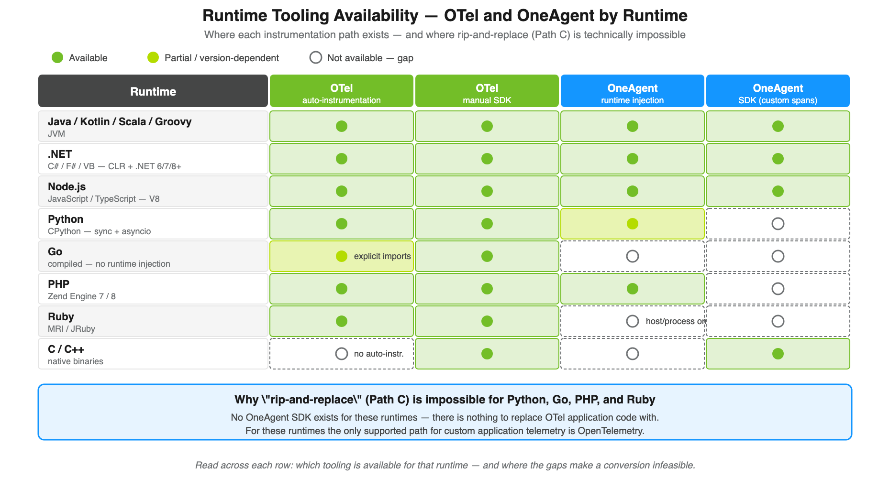
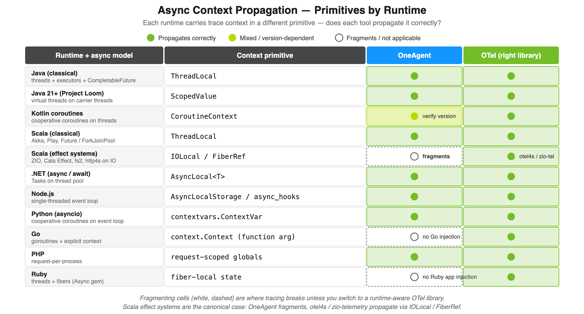
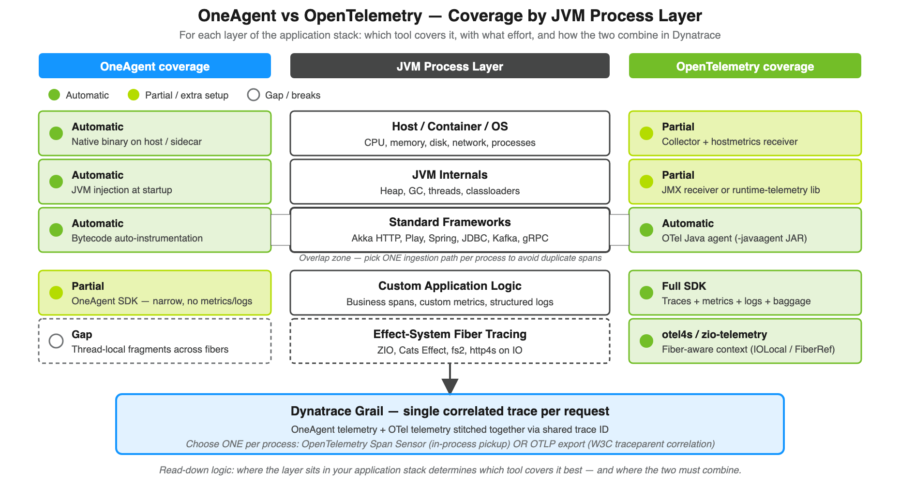
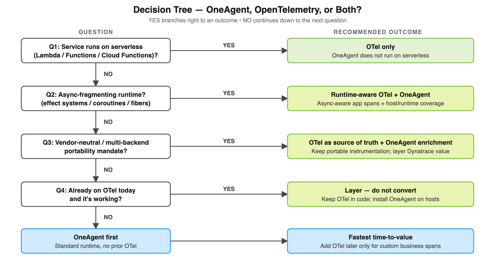
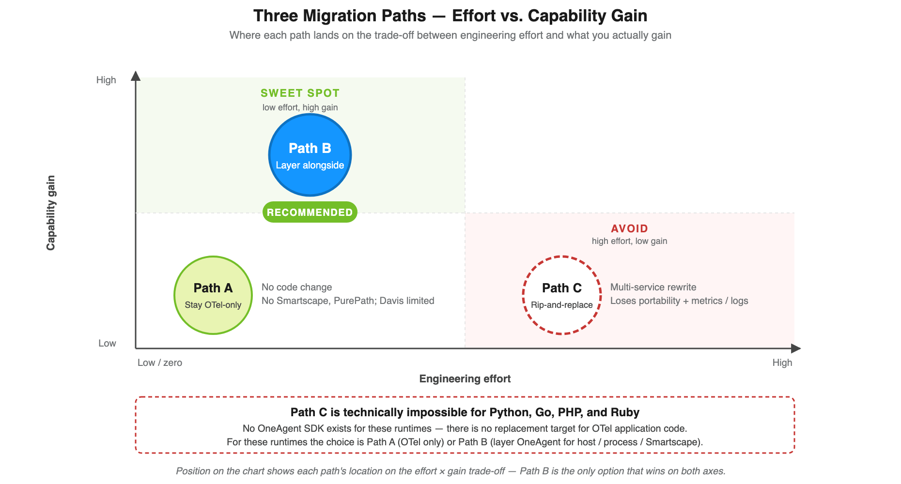
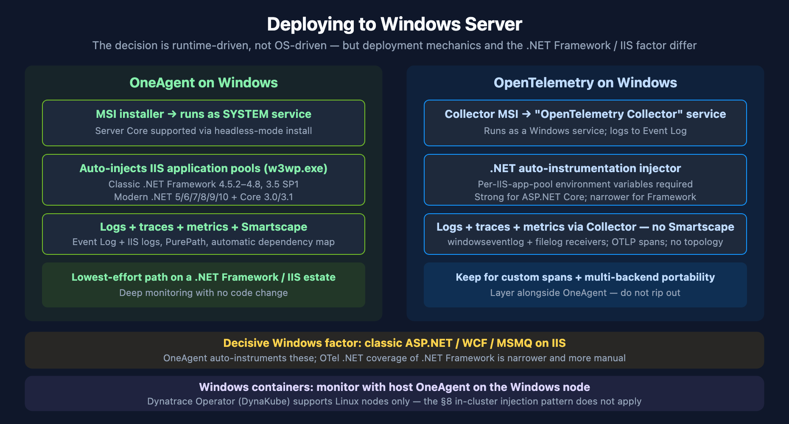

# FAQ-03: OneAgent vs OpenTelemetry — A Decision Framework

> **Series:** FAQ — Frequently Asked Questions | **Reference:** 03 — OneAgent vs OpenTelemetry — A Decision Framework | **Created:** May 2026 | **Last Updated:** 05/29/2026

## Overview

**The recurring question:**

Three related questions show up repeatedly. Teams already running OpenTelemetry ask: *Is it worth the effort to convert our existing OTel-instrumented services to Dynatrace OneAgent?* And the sharper version: *If our OTel implementation is working today, do we need OneAgent at all?* And from teams starting fresh with nothing instrumented yet: *We have a clean slate — which should we install first, OneAgent or OpenTelemetry?*

All three come down to a level-of-effort versus capability-gain trade-off, and all three deserve a frank answer. The answer is the same across every runtime Dynatrace supports — Java, Kotlin, Scala, Groovy, .NET, Node.js, Python, Go, PHP, Ruby — though a handful of runtimes have edge cases (covered in §7 and §14).

**Short answer (effort-vs-conversion):** If an application is already emitting OpenTelemetry data and is not running on serverless, **the most cost-effective path is almost always to keep OTel for application instrumentation and add OneAgent alongside it for host, runtime, and infrastructure coverage** — not to convert. The two are complementary, not competing. A wholesale conversion is usually a *deletion* exercise, not a re-instrumentation exercise — and even then, the gain is rarely worth the disruption unless a specific Dynatrace capability is needed that OTel cannot provide on its own.

**Short answer (is OneAgent required at all):** No, not strictly. OTel alone can fully instrument an application and ship to Dynatrace via OTLP — Davis AI works on that data, traces correlate via W3C `traceparent`, and metrics/logs land in Grail. **But OTel-only leaves real gaps** in host metrics, runtime internals (heap / GC / threads / event loop), Smartscape topology, code-level method tracing, and RUM-to-backend stitching. Whether those gaps matter depends on the workload — see §2 for the side-by-side capability table.

**Short answer (greenfield — which one first?):** For a new deployment on a standard OneAgent-supported runtime (Java / .NET / Node.js / Python / PHP) running on long-lived hosts or containers, **install OneAgent first** — time-to-first-trace is measured in minutes, with zero code change, and Smartscape + Davis + framework auto-instrumentation work at full fidelity from day one. Layer OTel in later (or in parallel) when you need custom business spans or vendor-neutral telemetry; the two are designed to coexist (see §8). The exceptions where OTel comes first: **serverless** workloads (OneAgent can't run there), **Go or Ruby** application code (no OneAgent SDK exists), **async-fragmenting runtimes** like Scala effect systems (otel4s / zio-telemetry are technically required — see §7), and any **vendor-portability or multi-backend mandate** (OTel as source of truth, OneAgent as enrichment).

This FAQ frames the trade-offs, the hidden costs, and the workload-specific edge cases — including **async-fragmenting runtimes** (effect systems, coroutines, async/await without explicit context propagation) where the choice has a clear technical answer rather than a preference.

---

## Table of Contents

1. [Framing the Question Correctly](#framing)
2. [Is OneAgent Required at All?](#required)
3. [What Each Tool Actually Is](#what-each-is)
4. [Capability Comparison](#capability-comparison)
5. [What "Convert to OneAgent" Really Means](#convert-meaning)
6. [Framework Auto-Instrumentation Coverage Across Runtimes](#framework-coverage)
7. [Async Context Propagation Across Runtimes](#async-context)
8. [The Coexistence Pattern (How They Work Together in Dynatrace)](#coexistence)
9. [Decision Tree by Workload Type](#decision-tree)
10. [Three Migration Paths and Their Effort](#three-paths)
11. [Pros and Cons Side-by-Side](#pros-cons)
12. [Is the Conversion Worth the Effort?](#worth-it)
13. [Recommended Approach](#recommendation)
14. [Deploying to Windows Servers](#windows-deployment)
15. [Runtime Applicability Map](#runtime-map)

---

## Prerequisites

| Requirement | Details |
|-------------|---------|
| **Audience** | Engineering leads, SRE/observability architects, platform owners evaluating instrumentation strategy |
| **Format** | Decision-support FAQ — no DQL or hands-on labs |
| **Assumed knowledge** | Familiarity with the basics of distributed tracing, the difference between an *agent* and an *SDK*, and what your services run on (long-lived host/container vs. serverless) |
| **Scope** | All major runtimes Dynatrace supports — Java, Kotlin, Scala, Groovy, .NET (C# / F# / VB), Node.js (JS / TS), Python, Go, PHP, Ruby. Runtime-specific edge cases (effect systems, coroutines, async/await context propagation) are called out in §7 |

## 1. Framing the Question Correctly

Customers usually ask this as **OneAgent OR OpenTelemetry** — a binary choice. That framing is the first mistake. The two tools answer different questions:

- **OneAgent** answers: *"What is happening on my hosts, in my application runtime (JVM / CLR / V8 / CPython / Go runtime / Zend / Ruby VM), and in the frameworks I'm running — without me writing any instrumentation code?"*
- **OpenTelemetry** answers: *"How do I emit portable, vendor-neutral, code-level telemetry from my application — including the parts no agent can see automatically?"*

Re-framed correctly, the question becomes: **"Given we already have OTel, do we still need OneAgent? And if we add OneAgent, do we need to remove OTel?"** The answer to the first is *usually yes* (for non-serverless workloads). The answer to the second is *almost never*.

> **Sources:** [Use OneAgent with OpenTelemetry (DT docs)](https://docs.dynatrace.com/docs/ingest-from/dynatrace-oneagent/oneagent-and-opentelemetry/oneagent-otel), [Extend Dynatrace with OpenTelemetry (DT docs)](https://docs.dynatrace.com/docs/extend-dynatrace/opentelemetry).

## 2. Is OneAgent Required at All?

**Short answer: No, not strictly — but most non-serverless teams are still better off with both.**

OpenTelemetry alone can fully instrument an application and ship to Dynatrace via OTLP. Traces correlate via W3C `traceparent`, metrics and logs land in Grail, and Davis AI operates on that data. For serverless workloads, async-fragmenting runtimes that lack agent-side context propagation, or a vendor-portability mandate, **OTel-only is the right answer** — OneAgent adds nothing critical, or in the case of serverless cannot run at all.

**Where OTel-only leaves real gaps** (and why most non-serverless teams add OneAgent anyway):

| Capability | OTel-only | Requires OneAgent |
|------------|-----------|-------------------|
| Application traces / metrics / logs | Yes | — |
| Runtime internals (heap, GC, threads, event loop, allocations) | Partial — needs runtime-telemetry receiver wired per service (JMX for JVM, EventCounters for .NET, perf_hooks/prom-client for Node, psutil for Python, runtime/metrics for Go) | Yes — automatic |
| Host metrics (CPU, memory, disk, network) | Partial — needs OTel Collector with hostmetrics receiver deployed on every node | Yes — automatic |
| Process / container correlation | Manual attribute hygiene | Yes — automatic |
| Smartscape topology and dependency map | Not available | Yes |
| PurePath code-level method tracing on demand | Not available | Yes |
| Real-User Monitoring ↔ backend trace stitching | Manual wiring | Yes — automatic |
| Auto-instrumentation of frameworks OTel doesn't cover (proprietary middleware, exotic app servers) | Gap | Yes — often covered |
| Davis AI fidelity | Good if attributes are clean and consistent | Best — Davis is purpose-built for OneAgent's data model |
| Update cadence | Per-application redeploy | Centrally managed; no app redeploy |

**Decision rule in three lines:**

- **Serverless, multi-backend mandate, or async-fragmenting runtime without OTel hooks** → OTel only. OneAgent doesn't help, or can't run.
- **Standard workloads on long-lived hosts/containers, and Smartscape + Davis at full fidelity matters** → add OneAgent alongside OTel. The install is a deployment task — no code change — and the two coexist by design (see §8 for the Span Sensor vs OTLP patterns).
- **Cost-constrained or instrumentation-fatigued, and OTel is working today** → stay OTel-only. No telemetry is missing — only some platform-level conveniences. Re-evaluate if and when those gaps cause real pain.

**Honest framing:** OneAgent is not *required*, it is an *accelerator*. It buys infrastructure coverage and topology that would otherwise have to be built manually with the OTel Collector, hostmetrics receivers, runtime-metrics receivers, and a clean attribute strategy. If those are already in place and working, the marginal value of adding OneAgent is much smaller — though never zero, because Smartscape, PurePath, and the Davis-AI-on-OneAgent-data path have no direct OTel equivalents.

> **Sources:**
> - [Use OneAgent with OpenTelemetry (DT docs)](https://docs.dynatrace.com/docs/ingest-from/dynatrace-oneagent/oneagent-and-opentelemetry/oneagent-otel)
> - [Ingest OpenTelemetry — getting started (DT docs)](https://docs.dynatrace.com/docs/ingest-from/opentelemetry/getting-started)
> - [Technology support (DT docs)](https://docs.dynatrace.com/docs/ingest-from/technology-support)
> - [OneAgent SDK for Java (Dynatrace GitHub)](https://github.com/Dynatrace/OneAgent-SDK-for-Java) — *"not supported on serverless code modules ... Consider using OpenTelemetry instead"*

## 3. What Each Tool Actually Is

<!-- MARKDOWN_TABLE_ALTERNATIVE
| Runtime | OTel auto-instr. | OTel manual SDK | OneAgent runtime injection | OneAgent SDK |
|---------|------------------|-----------------|----------------------------|--------------|
| Java / Kotlin / Scala / Groovy | Yes | Yes | Yes | Yes (1.9.0) |
| .NET (C# / F# / VB) | Yes | Yes | Yes | Yes |
| Node.js | Yes | Yes | Yes | Yes |
| Python | Yes | Yes | Partial (verify version) | None |
| Go | Partial — explicit imports | Yes | None | None |
| PHP | Yes | Yes | Yes | None |
| Ruby | Yes | Yes | Host/process only | None |
| C / C++ | None | Yes | None | Yes |

Why Path C (rip-and-replace) is impossible for Python, Go, PHP, Ruby: no OneAgent SDK exists for these runtimes.
-->

**OneAgent** is a Dynatrace-installed binary that runs on the host (or as a container sidecar/initcontainer in Kubernetes via the Dynatrace Operator). When the application runtime starts, OneAgent injects itself and auto-instruments a long list of frameworks and runtimes. It produces *PurePath* traces, host metrics, runtime metrics, log streams, process snapshots, and Smartscape topology — all without code changes. OneAgent's runtime injection covers Java/Kotlin/Scala/Groovy (JVM), .NET (CLR), Node.js (V8), PHP (Zend), and Python; for runtimes it does not inject (Go, Ruby), OneAgent still captures host/process telemetry around them.

**OpenTelemetry (OTel)** is a CNCF specification with a per-runtime delivery model. The two main consumption modes vary slightly per runtime:

| Runtime | OTel auto-instrumentation entry point | OTel manual SDK entry point |
|---------|----------------------------------------|------------------------------|
| Java / Kotlin / Scala / Groovy (JVM) | `-javaagent:opentelemetry-javaagent.jar` | `io.opentelemetry.api` (otel4s, zio-telemetry, kotlinx-coroutines wrappers) |
| .NET | `OpenTelemetry.Instrumentation.*` NuGet packages auto-wired in `Program.cs`, or the .NET auto-instrumentation injector | `System.Diagnostics.ActivitySource` / OTel SDK |
| Node.js (JS / TS) | `--require @opentelemetry/auto-instrumentations-node/register` | `@opentelemetry/api` |
| Python | `opentelemetry-instrument <command>` (CLI wrapper) or programmatic auto-instrumentation | `opentelemetry-api` / `opentelemetry-sdk` |
| Go | No bytecode injection — explicit `otelhttp`, `otelgin`, `otelgrpc`, etc. middleware imports | `go.opentelemetry.io/otel` |
| PHP | `opentelemetry` PECL extension + auto-instrumentation Composer packages | `open-telemetry/api` Composer package |
| Ruby | `opentelemetry-instrumentation-all` gem | `opentelemetry-api` / `opentelemetry-sdk` |

These OTel modes are independent — you can use any combination, or none. "Already instrumented with OTel" usually means a mix: the auto-instrumentation for HTTP/DB plus some manual SDK calls for business logic.

**JVM has a third delivery model — and it is the one most production teams should prefer.** The auto-instrumentation column above shows the static `-javaagent:` flag, but for JVM workloads there are actually three distinct OTel delivery options, with materially different operational risk profiles:

| Mode | How it loads | Operational characteristics |
|------|--------------|------------------------------|
| 1. **SDK in code** | OTel dependencies in `pom.xml` / `build.gradle`; explicit `Tracer` calls in source | Tied to the application build; redeploy needed for instrumentation changes; full control over what is captured |
| 2. **Static `-javaagent`** | JVM startup flag points at `opentelemetry-javaagent.jar` — auto-instrumentation kicks in before `main()` | Coupled to the JVM start command; if the agent JAR fails to load (bad version, classpath conflict, missing file), the JVM may fail to start, taking the line-of-business application down with it |
| 3. **Dynamic attach** | A separate process attaches the OTel agent to a running JVM via the JVM `com.sun.tools.attach.VirtualMachine` API after the application has started | Decoupled from application startup — if the instrumentation phase fails, the JVM keeps running and serving traffic. Updates and rollbacks are reversible without touching the application |

**Recommended for production: Option 3 (dynamic attach).** Option 2 places the OTel agent on the critical path of JVM startup — a failed agent load can prevent the JVM from starting and take the workload offline. Option 3 attaches *after* the JVM is live, so a failed instrumentation phase leaves the application running unaffected. The trade-off is operational complexity: you need a sidecar, init container, or platform mechanism that performs the attach.

This is the same model **Dynatrace OneAgent** uses by design — OneAgent's Java code module injects via JVMTI and platform-level hooks against an already-running JVM, never via boot-time `-javaagent`. It is also why OneAgent updates do not require application redeploys: a new agent version attaches at the next workload restart (or via runtime hot-attach in some configurations) without touching the application's start command.

**Dynatrace OneAgent SDKs** (separate, narrow libraries — *not* OneAgent itself) exist per language for adding custom traces inside an application that is *already running under OneAgent*. With no OneAgent attached, the SDK calls become no-ops.

| Runtime | OneAgent SDK | Status |
|---------|--------------|--------|
| Java | [OneAgent-SDK-for-Java](https://github.com/Dynatrace/OneAgent-SDK-for-Java) | Active — version 1.9.0; explicitly recommends OpenTelemetry for serverless |
| .NET | [OneAgent-SDK-for-DotNet](https://github.com/Dynatrace/OneAgent-SDK-for-DotNet) | GA — .NET Standard 1.0 (Full Framework 4.5+ / .NET Core 1.0+); v1.8.0 last release |
| Node.js | [OneAgent-SDK-for-NodeJs](https://github.com/Dynatrace/OneAgent-SDK-for-NodeJs) | Active |
| C / C++ | [OneAgent-SDK-for-C](https://github.com/Dynatrace/OneAgent-SDK-for-C) | Active |
| Python | None (OneAgent injects automatically; OTel SDK recommended for custom spans) | — |
| Go | None (OneAgent observes Go via host/process; OTel SDK recommended for custom spans) | — |
| PHP | None (OneAgent's PHP code module covers auto-instrumentation; OTel SDK recommended for custom spans) | — |
| Ruby | None (Dynatrace recommends the Ruby OpenTelemetry stack for code-level traces) | — |

**Implication:** for Python, Go, PHP, and Ruby, "convert custom OTel spans to OneAgent SDK" is not even an option — the SDK doesn't exist. The conversation in those runtimes is automatically "layer OneAgent (where it can run) alongside the existing OTel spans," not "rewrite the OTel spans."

> **Sources:**
> - [OneAgent SDK for Java (Dynatrace GitHub)](https://github.com/Dynatrace/OneAgent-SDK-for-Java) — v1.9.0; serverless-not-supported guidance
> - [OneAgent SDK for .NET (Dynatrace GitHub)](https://github.com/Dynatrace/OneAgent-SDK-for-DotNet) — .NET Standard 1.0; v1.8.0 last release; metrics APIs deprecated/removed
> - [OneAgent SDK for Node.js (Dynatrace GitHub)](https://github.com/Dynatrace/OneAgent-SDK-for-NodeJs)
> - [OneAgent SDK for C/C++ (Dynatrace GitHub)](https://github.com/Dynatrace/OneAgent-SDK-for-C)
> - [Java technology support (DT docs)](https://docs.dynatrace.com/docs/ingest-from/technology-support/application-software/java)
> - [VirtualMachine (Oracle JDK 21)](https://docs.oracle.com/en/java/javase/21/docs/api/jdk.attach/com/sun/tools/attach/VirtualMachine.html) — `loadAgent()` API for dynamic JVM attach
> - [opentelemetry-java-instrumentation (OTel GitHub)](https://github.com/open-telemetry/opentelemetry-java-instrumentation)
> - [@opentelemetry/auto-instrumentations-node (OTel JS contrib)](https://github.com/open-telemetry/opentelemetry-js-contrib/tree/main/metapackages/auto-instrumentations-node)
> - [opentelemetry-python-contrib (OTel GitHub)](https://github.com/open-telemetry/opentelemetry-python-contrib)
> - [opentelemetry-go-contrib (OTel GitHub)](https://github.com/open-telemetry/opentelemetry-go-contrib)
> - [opentelemetry-php (OTel GitHub)](https://github.com/open-telemetry/opentelemetry-php)
> - [opentelemetry-ruby (OTel GitHub)](https://github.com/open-telemetry/opentelemetry-ruby)

## 4. Capability Comparison

| Dimension | OneAgent | OpenTelemetry (auto-instrumentation + SDK) |
|-----------|----------|---------------------------------------------|
| **Owner** | Dynatrace (vendor) | CNCF / OpenTelemetry community (vendor-neutral) |
| **Backend** | Locked to Dynatrace | Any OTLP-compatible backend (Dynatrace, Jaeger, Tempo, Datadog, New Relic, Splunk, Honeycomb, Grafana Cloud, etc.) |
| **Runtime model** | Native binary on host or in container; injects into supported runtimes at startup | Per-runtime: javaagent, .NET injector, Node `--require`, Python `opentelemetry-instrument`, explicit Go imports, PECL extension, Ruby gem |
| **Signals captured** | Traces, runtime metrics, host metrics, process metrics, log streams, topology, real-user, deep code-level (PurePath) | Traces, metrics, logs, baggage, context (signals you choose to emit) |
| **Auto-instrumented frameworks** | Hundreds across JVM, .NET, Node.js, PHP, Python — Spring / ASP.NET / Express / Laravel / Django, plus all major SQL drivers, message brokers, web servers, app containers | Per-runtime list — Spring / ASP.NET / Express / Django / Gin / Rails / Laravel etc.; vary in completeness across runtimes (JVM and .NET have the broadest OTel coverage; Go requires explicit imports; Ruby and PHP are still maturing) |
| **Host / runtime / process metrics** | Yes — included automatically | Only if you add the host-metrics or runtime-metrics receiver via an OTel Collector / node-exporter; not part of basic SDK |
| **Smartscape / topology / dependency map** | Yes — automatic | Not provided by OTel; can be approximated from spans but no real-time topology graph |
| **Davis AI / problem detection / RCA** | Yes — built into Dynatrace platform on OneAgent telemetry | Available when OTel data is ingested into Dynatrace; quality depends on attribute completeness |
| **Serverless (AWS Lambda, Azure Functions, GCP Cloud Functions)** | Not supported (OneAgent SDK README + per-runtime guidance) | Fully supported across all runtimes |
| **Update model** | Centrally managed by Dynatrace; no app redeploy | Application redeploy required for SDK; auto-instrumentation update requires process restart |
| **Runtime version floor** | Per-runtime; e.g. JVM 8+, .NET Framework 4.5+ / .NET Core 2.1+ / .NET 5+, Node 20+, PHP 7.1+, Python 3.8+ — see Dynatrace supported-technologies matrix for current detail | Per-runtime; e.g. Java 8+, .NET 6+ (most current), Node 14+, Python 3.8+, Go 1.21+ (current OTel Go), PHP 8.0+, Ruby 3.0+ |
| **Code change required** | None for auto-coverage | None for auto-instrumentation; explicit imports for custom spans/metrics |
| **Async-context fragmentation risk** | Thread-local-style propagation — fragments under fibers (effect-system Scala), some coroutine setups, and async/await without explicit context plumbing | Runtime-aware libraries (otel4s, zio-telemetry, kotlinx-coroutines instrumentation, asyncio context, AsyncLocalStorage, AsyncLocal, context.Context) handle each runtime's async model correctly |
| **Release cadence** | Monthly (Dynatrace SaaS sprints) | Per-runtime: monthly minor releases for Java / .NET / Node / Python; Go versions independently |

> **Sources:**
> - [OpenTelemetry Java SDK (OpenTelemetry GitHub)](https://github.com/open-telemetry/opentelemetry-java) — monthly minor releases; Java 8+ floor; current stable 1.62.0
> - [OpenTelemetry main site (opentelemetry.io)](https://opentelemetry.io/) — vendor-neutral signals; OTLP backend-agnostic
> - [Use OneAgent with OpenTelemetry (DT docs)](https://docs.dynatrace.com/docs/ingest-from/dynatrace-oneagent/oneagent-and-opentelemetry/oneagent-otel)
> - [OneAgent SDK for Java (Dynatrace GitHub)](https://github.com/Dynatrace/OneAgent-SDK-for-Java) — serverless-not-supported

## 5. What "Convert to OneAgent" Really Means

When customers say *"convert from OTel to OneAgent"*, they often imagine a 1:1 re-instrumentation effort comparable to the original OTel rollout. **It is not.**

**For workloads where OneAgent's automatic coverage is sufficient** (the common case — REST/gRPC services on Spring, ASP.NET Core, Express, Django, Rails, plain thread pools or default async runtime), "converting" looks like this:

1. **Install OneAgent** on the host or via the Dynatrace Operator on Kubernetes. Restart the processes. Done — instrumentation is live.
2. **Optionally remove the OTel auto-instrumentation** (the `-javaagent:`, the .NET injector, the Node `--require`, the Python `opentelemetry-instrument`, the explicit Go middleware imports). This step is *deletion*, not authoring.
3. **Decide what to do with custom OTel spans/metrics/logs** in code:
   - **Easiest path:** leave them in place — Dynatrace ingests OTel data via OTLP, and OneAgent's *OpenTelemetry Span Sensor* (where supported) stitches them into the same trace as OneAgent's auto-instrumented spans. (Caveat: do not enable both Span Sensor and OTLP export simultaneously, or you will get duplicate spans.)
   - **Replacement path:** rewrite each `Tracer` / `Meter` / `Logger` call against the OneAgent SDK for your runtime — *if one exists* (Java, .NET, Node.js, C/C++ only). For Python, Go, PHP, and Ruby, no OneAgent SDK exists, so this path is not available; OTel is the supported way to emit custom application telemetry. And even where the OneAgent SDK exists, it is intentionally narrow (incoming/outgoing remote calls, custom services, web requests, messaging, SQL, custom request attributes) and **does not cover metrics or logs at all** — replacing OTel with the OneAgent SDK necessarily *loses* the metrics/logs surface unless you separately ingest them via Dynatrace metrics ingest APIs.

**For workloads where OneAgent's automatic coverage is insufficient** (async-fragmenting runtimes, exotic frameworks, message brokers OneAgent doesn't auto-instrument), removing OTel is actively harmful — you would be deleting working instrumentation and replacing it with nothing.

**The realization:** "Convert to OneAgent" is rarely a re-instrumentation project. It is an *agent installation* project, possibly followed by *deleting OTel auto-instrumentation* if you want to simplify the runtime stack. The custom OTel code in the application generally stays exactly where it is.

> **Sources:**
> - [Use OneAgent with OpenTelemetry (DT docs)](https://docs.dynatrace.com/docs/ingest-from/dynatrace-oneagent/oneagent-and-opentelemetry/oneagent-otel) — *"create duplicate spans"* warning; OpenTelemetry Span Sensor mechanism
> - [OneAgent SDK for Java (Dynatrace GitHub)](https://github.com/Dynatrace/OneAgent-SDK-for-Java) — covered surface defines Path C scope
> - [OneAgent SDK for .NET (Dynatrace GitHub)](https://github.com/Dynatrace/OneAgent-SDK-for-DotNet) — metrics APIs deprecated/removed (no metrics/logs surface)

## 6. Framework Auto-Instrumentation Coverage Across Runtimes

Coverage is the single biggest factor in whether *adding* OneAgent gets you what you want or leaves you patching gaps with the SDK or OTel. The table below summarizes the overlap by runtime — full per-language support matrices link from the `> **Sources:**` block at the end of this section.

| Runtime | Web framework / RPC coverage | Database / cache / queue coverage | Notes on gaps |
|---------|-------------------------------|------------------------------------|---------------|
| **Java / JVM** (Java, Kotlin, Scala, Groovy, Clojure) | OneAgent: Spring (MVC + Boot + WebFlux), Servlet / JAX-RS, Akka HTTP 10.1+, Play 2.6+, Tomcat / Jetty / WebLogic / WebSphere / JBoss, gRPC, OkHttp, Apache HttpClient, Java 11+ HttpClient. OTel: similar list plus Akka Actors 2.3+, Finatra 2.9+, Scala ForkJoinPool 2.8+ | Both: all major JDBC drivers, Kafka, RabbitMQ / AMQP, JMS, ActiveMQ, Redis, Cassandra, MongoDB, Elasticsearch | Neither auto-instruments **http4s**, **Tapir**, **fs2 streams**, **Monix**, or **Cats Effect IO** — these are async-fragmenting and need runtime-aware OTel libs (see §7) |
| **.NET** (C#, F#, VB.NET — CLR + .NET 6 / 7 / 8+) | OneAgent: ASP.NET Framework, ASP.NET Core (Kestrel + IIS), WCF, gRPC, HttpClient, named-pipe / TCP / MSMQ services. OTel: ASP.NET Core, HttpClient, gRPC, SignalR via `OpenTelemetry.Instrumentation.*` packages | Both: ADO.NET (SQL Server, Oracle, MySQL, Postgres, SQLite), Entity Framework Core, RabbitMQ, Azure Service Bus, Redis (StackExchange.Redis), MongoDB | OneAgent auto-instruments classical ASP.NET Framework; OTel coverage of ASP.NET Framework is narrower (mostly ASP.NET Core onwards) |
| **Node.js** (JavaScript / TypeScript — V8) | OneAgent: Express, Koa, Hapi, Fastify (newer), NestJS, native HTTP/HTTPS, gRPC. OTel: same list via `@opentelemetry/auto-instrumentations-node` (Express, Koa, Hapi, Fastify, Restify, Connect, GraphQL, gRPC, Apollo) | Both: pg, mysql / mysql2, mongodb, redis, ioredis, kafkajs, amqplib, aws-sdk, elasticsearch | OneAgent and OTel both rely on patching `require()` — module versions outside the supported range are skipped silently |
| **Python** (CPython — async-aware) | OneAgent: Django, Flask, FastAPI (recent versions), Tornado, Starlette, ASGI, gunicorn, uWSGI. OTel: similar list via `opentelemetry-instrumentation-django` / `flask` / `fastapi` / `aiohttp` / `tornado` / `pyramid` etc. | Both: psycopg / psycopg2 / asyncpg, PyMySQL / mysqlclient / mysql-connector, MongoDB (pymongo), Redis (redis-py), Kafka (kafka-python / confluent-kafka), Celery, SQLAlchemy | OneAgent's Python module is more conservative on async frameworks; OTel covers asyncio-native coverage more aggressively |
| **Go** (compiled — no runtime injection) | OneAgent: observes Go binaries via host/process telemetry; **does not auto-instrument Go application code**. OTel: explicit imports — `otelhttp` (net/http), `otelgin`, `otelmux`, `otelchi`, `otelfiber`, `otelgrpc`, `otelecho` | OneAgent: none for Go libraries. OTel: `otelsql` (database/sql wrapper), `otelpgx`, `otelgorm`, `otelmongo`, `otelredis`, `otelkafka`, `otelsarama` | **Go is OTel-first by design** — no `-javaagent`-equivalent and no Go OneAgent SDK. OneAgent still adds value via host/process/Smartscape, but application spans must come from OTel |
| **PHP** (Zend Engine 7 / 8) | OneAgent: Apache mod_php / php-fpm, Laravel, Symfony, CodeIgniter, WordPress (with the PHP code module). OTel: `open-telemetry/opentelemetry-auto-instrumentation` Composer packages — Laravel, Symfony, Slim, WordPress, CakePHP | Both: PDO, mysqli, mongodb, Redis, Memcached. OTel additionally: Guzzle HTTP client | OneAgent's PHP coverage is mature; OTel PHP auto-instrumentation is newer and library-by-library |
| **Ruby** (MRI, JRuby) | OneAgent: limited Ruby support — primarily host/process telemetry. OTel: `opentelemetry-instrumentation-rails`, `sinatra`, `rack`, `grape` | Both: ActiveRecord, mysql2, pg, redis, mongo. OTel: also `opentelemetry-instrumentation-net_http`, `faraday` | **Ruby is OTel-first** — Dynatrace's recommended path for code-level Ruby tracing is OpenTelemetry, with OneAgent supplying host/process/Smartscape |

**Patterns to notice:**

- **Overlap zone** (most teams gain immediate value from OneAgent) — Java, .NET, Node.js, Python, PHP web stacks: standard frameworks + standard SQL drivers + standard message brokers. OneAgent + OTel duplicates effort here, which is why the §8 Span Sensor / OTLP coexistence pattern exists.
- **OneAgent-only coverage** — Smartscape topology, RUM-to-backend stitching, on-demand PurePath capture, host/runtime metrics without a Collector. These are platform constructs, not signals OTel emits.
- **OTel-only coverage** — Go application code, Ruby application code, async-fragmenting runtimes (effect systems, certain coroutine layouts — see §7), most serverless platforms.
- **Coverage gaps in both** — exotic frameworks (http4s, Tapir, niche message brokers, custom RPC layers). These need either a community OTel instrumentation library, manual instrumentation, or both.

> **Sources:**
> - [Java technology support (DT docs)](https://docs.dynatrace.com/docs/ingest-from/technology-support/application-software/java) — OneAgent JVM framework coverage (Spring, Servlet/JAX-RS, Akka HTTP 10.1+, Play 2.6+, Tomcat/Jetty/WebLogic/WebSphere/JBoss, gRPC)
> - [Technology support matrix (DT docs)](https://docs.dynatrace.com/docs/ingest-from/technology-support)
> - [supported-libraries (opentelemetry-java-instrumentation)](https://github.com/open-telemetry/opentelemetry-java-instrumentation/blob/main/docs/supported-libraries.md) — kotlinx.coroutines 1.0+, Akka HTTP 10.0+, Akka Actors 2.3+, Finatra 2.9+, Scala ForkJoinPool 2.8+
> - [@opentelemetry/auto-instrumentations-node (OTel JS contrib)](https://github.com/open-telemetry/opentelemetry-js-contrib/tree/main/metapackages/auto-instrumentations-node)
> - [opentelemetry-python-contrib (OTel GitHub)](https://github.com/open-telemetry/opentelemetry-python-contrib)
> - [opentelemetry-go-contrib (OTel GitHub)](https://github.com/open-telemetry/opentelemetry-go-contrib) — `otelhttp`/`otelgin`/`otelmux`/`otelchi`/`otelfiber`/`otelgrpc`/`otelecho`/`otelsql`/`otelpgx`/`otelgorm`/`otelmongo`/`otelredis`/`otelsarama`

## 7. Async Context Propagation Across Runtimes

<!-- MARKDOWN_TABLE_ALTERNATIVE
| Runtime + async model | Context primitive | OneAgent | OTel (right library) |
|-----------------------|-------------------|----------|----------------------|
| Java (classical) | ThreadLocal | Yes | Yes |
| Java 21+ (Loom virtual threads) | ScopedValue | Yes | Yes |
| Kotlin coroutines | CoroutineContext | Verify version | Yes |
| Scala (classical Akka/Play) | ThreadLocal | Yes | Yes |
| Scala (effect systems) | IOLocal / FiberRef | Fragments | Yes — otel4s / zio-telemetry |
| .NET (async/await) | AsyncLocal<T> | Yes | Yes |
| Node.js | AsyncLocalStorage / async_hooks | Yes | Yes |
| Python (asyncio) | contextvars.ContextVar | Yes | Yes |
| Go | context.Context (function arg) | N/A — no Go injection | Yes |
| PHP | request-scoped globals | Yes | Yes |
| Ruby | fiber-local state | N/A — no Ruby app injection | Yes |

Fragmenting cells are where tracing breaks unless you switch to a runtime-aware OTel library.
-->

**This is where the "OneAgent or OTel" choice has a clear-cut technical answer in some runtimes — not a preference.**

**The mechanic:** classical agent-based tracing (both OneAgent's auto-instrumentation and OTel's auto-instrumentation in most runtimes) propagates trace context using a runtime thread-local construct. As long as a request stays on a single thread (or the agent has hooked the thread-pool / scheduling primitives the application uses), context flows correctly. Some runtimes break this assumption.

**Per-runtime async-context primitives — and how each tool handles them:**

| Runtime | Async / concurrency model | Context primitive | OneAgent | OTel (with right library) |
|---------|---------------------------|-------------------|----------|---------------------------|
| Java (classical) | OS threads + thread pools + `CompletableFuture` | `ThreadLocal` | Yes — auto-instruments common executors | Yes — Java agent hooks executors |
| Java 21+ (Project Loom virtual threads) | Many lightweight virtual threads on few carrier threads | `ScopedValue` / virtual-thread-local | Yes — current OneAgent supports virtual threads | Yes — current OTel Java agent supports virtual threads |
| Kotlin coroutines | Cooperative coroutines on threads | `CoroutineContext` | Mixed — historically a gap; newer code modules cover the standard `Dispatchers` | Yes — `kotlinx.coroutines` OTel instrumentation |
| Scala — classical (Akka, Play, plain `Future` / `ForkJoinPool`) | OS threads / executor service | `ThreadLocal` | Yes — strong auto-instrumentation | Yes — OTel Java agent |
| Scala — effect systems (ZIO, Cats Effect, fs2, http4s on IO) | Lightweight fibers multiplexed onto a small thread pool; runtime explicitly does *not* preserve `ThreadLocal` across fiber suspension | `IOLocal` (Cats Effect) / `FiberRef` (ZIO) | **No** — fragments across fiber boundaries | **Yes** — *otel4s* uses `IOLocal`; *zio-telemetry* uses `FiberRef`; both propagate correctly |
| .NET (`async` / `await`) | Tasks scheduled on a thread pool with logical-call-context flow | `AsyncLocal<T>` | Yes — OneAgent flows context through `AsyncLocal` | Yes — `System.Diagnostics.Activity` uses `AsyncLocal` natively |
| Node.js | Single-threaded event loop with callback / Promise chains | `AsyncLocalStorage` (built on `async_hooks`) | Yes — OneAgent's Node module hooks `async_hooks` | Yes — `@opentelemetry/context-async-hooks` |
| Python (asyncio) | Cooperative coroutines on an event loop | `contextvars.ContextVar` | Yes (recent Python code module) | Yes — `opentelemetry-api` uses `contextvars` |
| Python (greenlet / gevent / eventlet) | Cooperative greenlets monkey-patching the stdlib | Library-specific | Mixed | Mixed — OTel has per-library shims |
| Go | Goroutines with explicit `context.Context` plumbing | `context.Context` (passed as a function argument by convention) | N/A (OneAgent does not inject Go) | Yes — every OTel Go library takes a `context.Context` |
| PHP | Synchronous request-per-process model (mostly) | Request-scoped globals | Yes — OneAgent's PHP module covers it | Yes — OTel PHP covers it |
| Ruby | OS threads + (in newer Rubies) fibers; `Async` gem and ractors are evolving | Fiber-local state | N/A in code (Dynatrace recommends OTel for Ruby app code) | Yes — `OpenTelemetry::Context` |

**Symptoms when context propagation breaks (in any runtime):**

- A trace begins on a request, then "loses" context after the first asynchronous boundary
- Spans appear as orphans (no parent) downstream of the boundary
- Database calls, HTTP calls, and message publishes inside an async block do not link back to the parent request span
- The trace waterfall looks plausibly populated but is structurally wrong

**Practical guidance by runtime:**

| Runtime + scenario | App-level tracing | Infra-level coverage |
|--------------------|-------------------|----------------------|
| Java / .NET / Node / Python — standard frameworks on default scheduler | OneAgent auto-instrumentation (no code change) | OneAgent (same) |
| Java with virtual threads | OneAgent or OTel Java agent (current versions) | OneAgent |
| Kotlin coroutines | OTel `kotlinx.coroutines` instrumentation if OneAgent's coroutine support is incomplete in your environment | OneAgent |
| Scala — Akka, Play, plain `Future` / `ForkJoinPool` | OneAgent auto-instrumentation | OneAgent |
| Scala — ZIO + zio-http / sttp on ZIO | **zio-telemetry (OTel)** — OneAgent fragments; SDK has no `FiberRef` model | OneAgent for host/runtime |
| Scala — Cats Effect + http4s + fs2 | **otel4s (OTel)** — OneAgent fragments; SDK has no `IOLocal` model | OneAgent for host/runtime |
| Mixed Scala estate (some Akka, some ZIO) | Per-service: OneAgent for Akka/Play, OTel for effect systems | OneAgent everywhere |
| Go | **OTel only** at app level — no Go OneAgent SDK exists | OneAgent for host/process/Smartscape |
| Ruby | **OTel only** at app level — Dynatrace's documented recommendation | OneAgent for host/process |
| Serverless any runtime | **OTel only** — OneAgent does not run on Lambda / Functions / Cloud Functions | — |

**The principle:** if the runtime has an async model that fragments thread-local storage (effect systems, certain coroutine layouts, or any runtime where context is fiber-scoped or scope-of-task), use the OTel library that targets that runtime's context primitive. The OneAgent SDK has a thread-local-style context model in every language where it exists, and will fragment in the same way unless the agent itself has been updated to hook the runtime's async primitives.

> **Sources:**
> - [AsyncLocal&lt;T&gt; (Microsoft Learn)](https://learn.microsoft.com/en-us/dotnet/api/system.threading.asynclocal-1) — *"ambient data local to a given asynchronous control flow"*
> - [AsyncLocalStorage (Node.js docs)](https://nodejs.org/api/async_context.html) — built on `node:async_hooks`
> - [contextvars (Python docs)](https://docs.python.org/3/library/contextvars.html) — natively supported in `asyncio` (Python 3.7+)
> - [otel4s (Typelevel GitHub)](https://github.com/typelevel/otel4s) — *"design goal is to fully and faithfully implement the OpenTelemetry Specification atop Cats Effect"*
> - [zio-telemetry (ZIO GitHub)](https://github.com/zio/zio-telemetry)
> - [kotlinx-coroutines instrumentation (OTel Java)](https://github.com/open-telemetry/opentelemetry-java-instrumentation/tree/main/instrumentation/kotlinx-coroutines)
> - [supported-libraries (opentelemetry-java-instrumentation)](https://github.com/open-telemetry/opentelemetry-java-instrumentation/blob/main/docs/supported-libraries.md)
> - [Go OpenTelemetry walkthrough (DT docs)](https://docs.dynatrace.com/docs/ingest-from/opentelemetry/walkthroughs/go)

## 8. The Coexistence Pattern (How They Work Together in Dynatrace)

<!-- MARKDOWN_TABLE_ALTERNATIVE
| Layer | Coverage source | Mechanism |
|-------|-----------------|-----------|
| Host / Container / OS | OneAgent (automatic) | Native agent on host or sidecar |
| Runtime internals (heap / GC / threads / event loop) | OneAgent (automatic) | Runtime injection at startup |
| Standard frameworks (Spring, ASP.NET, Express, Django, Rails, etc.) | OneAgent (automatic) — OTel auto-instrumentation if no OneAgent | Bytecode / module patching |
| Custom application logic / business spans | OTel SDK in code (otel4s / zio-telemetry / kotlinx-coroutines / contextvars / context.Context / AsyncLocalStorage) | Explicit API calls |
| Async-fragmenting runtimes (effect systems, fibers) | Runtime-aware OTel libraries | Native context primitive (IOLocal / FiberRef / contextvars / AsyncLocal / ScopedValue) |
| Trace stitching | Dynatrace platform | OpenTelemetry Span Sensor or OTLP ingest |
-->

Dynatrace is explicit that the two are designed to coexist. From the Dynatrace OneAgent + OpenTelemetry documentation: *"You can implement this service by service, adopting the open standards of OpenTelemetry where openness matters most, while leveraging enhanced OneAgent features available where you need them."*

**The mechanism — OpenTelemetry Span Sensor:** when this code-module setting is enabled (where supported per runtime), OneAgent detects in-process OpenTelemetry API calls and weaves them into the same trace as OneAgent's auto-instrumented spans. Per the Dynatrace docs: *"These auto-instrumented spans are woven together with your manual OpenTelemetry spans into a single trace."* The result is a unified PurePath-style trace that contains both OneAgent and OTel-emitted spans, correlated through a shared trace ID.

**Critical caveat:** if you enable the OpenTelemetry Span Sensor *and* simultaneously export OTLP from the same process, **you will get duplicate spans** — once from the Span Sensor's in-process pickup, once from the OTLP exporter. Pick one ingestion path per process. The two supported patterns are:

1. **Span Sensor only** — OTel API calls in code, no OTLP exporter configured. OneAgent picks them up locally, ships them inside its native channel.
2. **OTLP only** — Span Sensor disabled, OTel exporter configured to send to a Dynatrace OTLP endpoint (or to an OTel Collector forwarding to Dynatrace). OneAgent traces and OTel traces correlate via standard W3C `traceparent` propagation.

**Either pattern produces a single, correlated trace in Dynatrace.** Customers regularly run both OneAgent and OTel in the same process precisely because the platform was built to merge them. For runtimes where OneAgent does not inject (Go, Ruby) or for serverless workloads, Pattern 2 (OTLP) is the only option.

**Span Sensor runtime support:** the Dynatrace coexistence docs document Span Sensor support for **Java, Go, Node.js, PHP, and .NET** code modules.

> **Sources:**
> - [Use OneAgent with OpenTelemetry (DT docs)](https://docs.dynatrace.com/docs/ingest-from/dynatrace-oneagent/oneagent-and-opentelemetry/oneagent-otel) — Span Sensor mechanism, *"woven together ... single trace"*, duplicate-spans warning, supported on Java/Go/Node.js/PHP/.NET
> - [Extend Dynatrace with OpenTelemetry (DT docs)](https://docs.dynatrace.com/docs/extend-dynatrace/opentelemetry) — *"adopting the open standards of OpenTelemetry where openness matters most"*
> - [Ingest OpenTelemetry — getting started (DT docs)](https://docs.dynatrace.com/docs/ingest-from/opentelemetry/getting-started) — OTLP endpoints, Collector, Istio/Envoy paths
> - [W3C Trace Context (opentelemetry-specification)](https://github.com/open-telemetry/opentelemetry-specification) — `traceparent` propagation

## 9. Decision Tree by Workload Type

<!-- MARKDOWN_TABLE_ALTERNATIVE
| Question | Yes path | No path |
|----------|----------|---------|
| Is the service running on serverless (Lambda, Functions, Cloud Functions)? | OTel only — OneAgent does not run on serverless | Continue |
| Is the runtime async-fragmenting (effect systems / coroutines without OTel hooks / runtime where thread-local doesn't propagate)? | OTel via runtime-aware library + OneAgent for host/runtime | Continue |
| Do you need vendor-neutral instrumentation (multi-backend, exit ramp)? | OTel as the source of truth + OneAgent as enrichment | Continue |
| Is the runtime Go or Ruby (no OneAgent SDK; OneAgent doesn't inject application code)? | OTel for app spans + OneAgent for host/process/Smartscape | Continue |
| Are you on Spring / ASP.NET Core / Express / Django / Rails / Laravel / standard web stacks? | OneAgent covers it automatically — keep OTel only for custom business spans | Continue |
| Do you have working OTel instrumentation today? | Keep it. Add OneAgent alongside. Do not convert. | Install whichever is easier; OneAgent has lower code-change cost |
-->

**Plain-language flow:**

1. **Serverless?** → OTel only. OneAgent does not run on AWS Lambda, Azure Functions, GCP Cloud Functions, or similar. Per-runtime OneAgent SDK READMEs explicitly direct serverless users to OpenTelemetry.
2. **Async-fragmenting runtime?** (effect systems, coroutines without agent hooks, async without explicit context propagation) → OTel via the runtime-aware library — *otel4s* / *zio-telemetry* (Scala effect systems), `kotlinx.coroutines` OTel instrumentation (Kotlin), `contextvars` (Python asyncio), `AsyncLocal` (.NET — handled natively), `AsyncLocalStorage` (Node.js — handled natively), `context.Context` (Go — handled natively). Add OneAgent for host/runtime signals if the workload runs on long-lived hosts or containers.
3. **Multi-backend mandate, regulatory portability, or active exit-ramp planning?** → OTel as your primary instrumentation. OneAgent becomes value-add, not the source of truth.
4. **Runtime is Go or Ruby?** → OTel for application spans (no OneAgent SDK exists for these runtimes). OneAgent still adds value through host/process telemetry and Smartscape.
5. **Standard web stack?** (Spring, ASP.NET Core, Express, Fastify, Django, FastAPI, Rails, Laravel, etc.) → OneAgent's auto-instrumentation gives you the fastest time-to-value. If you already have OTel, keep it for custom spans; if not, you may not need it at all.
6. **Already instrumented with OTel and it's working?** → Add OneAgent alongside. Do *not* rip out OTel. The combined cost is lower than the conversion cost, and you keep your portability.

> **Sources:**
> - [OneAgent SDK for Java (Dynatrace GitHub)](https://github.com/Dynatrace/OneAgent-SDK-for-Java) — *"not supported on serverless code modules ... Consider using OpenTelemetry instead"*
> - [OneAgent SDK for Node.js (Dynatrace GitHub)](https://github.com/Dynatrace/OneAgent-SDK-for-NodeJs)
> - [OpenTelemetry on AWS Lambda (DT docs)](https://docs.dynatrace.com/docs/shortlink/opentel-lambda) — Lambda extension + OTel; Python, Node, Java
> - [Use OneAgent with OpenTelemetry (DT docs)](https://docs.dynatrace.com/docs/ingest-from/dynatrace-oneagent/oneagent-and-opentelemetry/oneagent-otel)
> - [otel4s (Typelevel GitHub)](https://github.com/typelevel/otel4s), [zio-telemetry (ZIO GitHub)](https://github.com/zio/zio-telemetry) — runtime-aware OTel libraries

## 10. Three Migration Paths and Their Effort

<!-- MARKDOWN_TABLE_ALTERNATIVE
| Path | Effort | Capability gain | Recommendation |
|------|--------|-----------------|----------------|
| A — Stay OTel-only | Zero | Low / partial — keep what you have, miss Smartscape and Davis full fidelity | Acceptable; revisit later |
| B — Layer (OneAgent + OTel) | Low | High — host/runtime, Smartscape, Davis, RUM stitching, plus existing OTel | **Recommended** for almost every team |
| C — Rip-and-replace OTel with OneAgent SDK | High | Low — loses portability, metrics, logs; rewrites required per service | Avoid; impossible for Python / Go / PHP / Ruby (no OneAgent SDK) |
-->

**Path A: Stay OTel-only (no OneAgent at all)**

| Aspect | Reality |
|--------|---------|
| Effort | Zero — keep current state |
| Code changes | None |
| What you keep | Vendor neutrality, runtime-aware tracing on async-fragmenting stacks, serverless coverage, single instrumentation model across polyglot stacks |
| What you give up | Smartscape topology, automatic runtime/host/process metrics without a Collector, on-demand code-level method tracing, deepest Davis AI fidelity, RUM-to-backend stitching unless you wire it manually |
| Best for | Greenfield CNCF-aligned organizations; serverless-heavy estates; multi-cloud/multi-vendor strategies; Go/Ruby-dominant or effect-system-dominant teams |

**Path B: Add OneAgent alongside OTel (the layered pattern — recommended for most)**

| Aspect | Reality |
|--------|---------|
| Effort | Low — install OneAgent on hosts or via Dynatrace Operator, restart the application processes |
| Code changes | None — keep all existing OTel code |
| What you gain | Host/runtime metrics, Smartscape, Davis AI, automatic framework coverage where it overlaps with OTel, RUM stitching |
| What you must decide | Span Sensor vs OTLP export (pick one per process — see §8 caveat) |
| Risk | Duplicate spans if both ingestion paths active simultaneously; resolved by configuration |
| Best for | Teams already on OTel who want Dynatrace's infra and AI features without losing their portable instrumentation |

**Path C: Rip-and-replace OTel with OneAgent (and OneAgent SDK for custom spans)**

| Aspect | Reality |
|--------|---------|
| Effort | Highest — install OneAgent, remove OTel auto-instrumentation + dependencies, rewrite every custom span / metric / log against the OneAgent SDK |
| Code changes | Per-service rewrite of every `Tracer.spanBuilder(...)` / `ActivitySource.StartActivity(...)` / equivalent, plus every metric and log emission to OneAgent SDK equivalents — and the SDK does not cover metrics or logs at all, so those signals are lost or must be re-emitted via Dynatrace metrics ingest APIs |
| Availability | OneAgent SDK exists only for Java, .NET, Node.js, and C/C++. **Path C is not even an option for Python, Go, PHP, or Ruby** |
| What you gain | One instrumentation model in code; tighter native PurePath semantics in places |
| What you lose | Vendor neutrality, broad community ecosystem, runtime-aware libraries on async-fragmenting stacks, serverless coverage, parts of your metrics/logs surface |
| Risk | High — coordinated multi-service rewrite, regression-prone, must be repeated for every new service |
| Best for | Almost no one. Defensible only if (a) the engineering org has a strict single-vendor mandate, (b) all workloads are non-serverless and on a runtime where the OneAgent SDK exists, (c) no async-fragmenting runtimes are involved, and (d) the cost of dual maintenance demonstrably exceeds the rewrite cost |

> **Sources:**
> - [OneAgent SDK for Java (Dynatrace GitHub)](https://github.com/Dynatrace/OneAgent-SDK-for-Java) — Path C scope
> - [OneAgent SDK for .NET (Dynatrace GitHub)](https://github.com/Dynatrace/OneAgent-SDK-for-DotNet) — *"Removes deprecated APIs"* (v1.8.0); no metrics/logs surface
> - [Use OneAgent with OpenTelemetry (DT docs)](https://docs.dynatrace.com/docs/ingest-from/dynatrace-oneagent/oneagent-and-opentelemetry/oneagent-otel) — Path B coexistence patterns

## 11. Pros and Cons Side-by-Side

**OneAgent — pros**

- Zero-code instrumentation for hundreds of frameworks across Java, .NET, Node.js, Python, PHP
- Host, runtime, process, network, and topology coverage out of the box
- Smartscape dependency map and Davis AI tuned to its data model
- RUM-to-backend trace correlation
- Centrally managed updates — no application redeploy
- Operations-team-friendly (instrument an environment without engineering involvement)

**OneAgent — cons**

- Locked to Dynatrace as a backend
- Does not run on serverless functions
- Does not inject Go or Ruby application code (still adds host/process value)
- Default thread-local-style context model fragments under some async runtimes (effect systems, certain coroutine layouts)
- Custom-span surface (OneAgent SDK) is intentionally narrow — no metrics or log signals; not available for Python, Go, PHP, Ruby
- Framework support is broad but not exhaustive (e.g., http4s, Tapir, niche message brokers, exotic RPC layers)

**OpenTelemetry — pros**

- Vendor-neutral; works against Dynatrace, Jaeger, Tempo, New Relic, Datadog, Splunk, Honeycomb, Grafana Cloud, etc.
- Full signal coverage — traces, metrics, logs, baggage
- Per-runtime context-aware libraries (otel4s, zio-telemetry, kotlinx-coroutines, contextvars, context.Context, AsyncLocal, AsyncLocalStorage) handle each runtime's async model correctly
- First-class on serverless across every major runtime
- First-class on Go and Ruby where OneAgent doesn't inject application code
- Strong community ecosystem, monthly releases, broad plugin coverage
- Code-level control of sampling, attributes, and span structure

**OpenTelemetry — cons**

- No automatic host / runtime / topology coverage without a Collector or supplementary agent
- No equivalent to Smartscape or PurePath without backend enrichment
- Requires application redeploy for SDK changes
- Quality of Davis AI and other Dynatrace platform features depends on attribute completeness
- More moving parts (auto-instrumentation, SDK code, Collector) than a single OneAgent install
- Coverage breadth varies per runtime — JVM and .NET have the deepest OTel coverage; Ruby and PHP are still maturing

> **Sources:**
> - [Technology support matrix (DT docs)](https://docs.dynatrace.com/docs/ingest-from/technology-support) — OneAgent framework, host, runtime coverage
> - [Use OneAgent with OpenTelemetry (DT docs)](https://docs.dynatrace.com/docs/ingest-from/dynatrace-oneagent/oneagent-and-opentelemetry/oneagent-otel) — Smartscape/PurePath/Davis as OneAgent-only platform features
> - [OpenTelemetry main site (opentelemetry.io)](https://opentelemetry.io/) — vendor neutrality, signal coverage, ecosystem
> - [OpenTelemetry Java SDK (OpenTelemetry GitHub)](https://github.com/open-telemetry/opentelemetry-java) — monthly minor releases

## 12. Is the Conversion Worth the Effort?

**Question every customer should ask before starting:** *"What capability am I gaining that I do not already have, and is it worth the engineering disruption to get it?"*

**Run through this checklist honestly:**

1. **Does my OTel data already land in Dynatrace via OTLP?** If yes, you already have most of what "converting" would give you for traces.
2. **Am I missing host, runtime, or topology signals?** If yes, *adding* OneAgent solves that — *removing* OTel does not.
3. **Am I on an async-fragmenting runtime?** (Scala effect systems, certain coroutine layouts.) If yes, removing the runtime-aware OTel layer will *break* tracing — there is no OneAgent equivalent.
4. **Am I on Go or Ruby?** If yes, there is no OneAgent SDK to replace OTel with. Conversion is not technically possible at the application-span level.
5. **Do I have any serverless workloads?** If yes, OneAgent cannot run there; you will need OTel anyway, and a hybrid is unavoidable.
6. **Is there an organizational mandate for vendor portability or multi-backend support?** If yes, OTel is a requirement, not a choice.
7. **What is the cost of a coordinated multi-service rewrite of custom spans, metrics, and logs?** Compare honestly against the cost of running both for the foreseeable future.
8. **Is anyone on the team going to maintain a parallel internal instrumentation library against the OneAgent SDK?** If not, even partial Path C is a slow walk into instrumentation rot.

**Common false economies:**

- *"Removing OTel will reduce overhead."* In community practice, OTel auto-instrumentation overhead is small enough that removing it after installing OneAgent does not measurably move the needle. OneAgent has its own overhead in the same general range. Exact percentages depend heavily on workload, sampling rate, and exporter configuration — measure in your environment rather than relying on a published number.
- *"One instrumentation model is simpler."* True at the code level, false at the platform level — Dynatrace was designed to merge both, and customers running both report fewer surprises than customers running one tool stretched beyond its design center.
- *"OneAgent traces are better than OTel traces."* For overlapping framework coverage on standard stacks, the data is comparable. OneAgent's advantage is in the *surrounding* signals (host, runtime, topology, Davis), not in the raw spans.

**The honest answer for almost every team already on OTel:** the level of effort to *add* OneAgent is small (a deployment-engineering task, not a re-instrumentation task). The level of effort to *replace* OTel with OneAgent is large — and impossible in some runtimes — and almost never repaid by the marginal capability gained. **Layer, don't convert.**

> **Sources:**
> - [OneAgent SDK for Java (Dynatrace GitHub)](https://github.com/Dynatrace/OneAgent-SDK-for-Java) — what the SDK does and does not cover
> - [OneAgent SDK for .NET (Dynatrace GitHub)](https://github.com/Dynatrace/OneAgent-SDK-for-DotNet) — metrics/logs out of scope
> - [Use OneAgent with OpenTelemetry (DT docs)](https://docs.dynatrace.com/docs/ingest-from/dynatrace-oneagent/oneagent-and-opentelemetry/oneagent-otel)
>
> The §12 overhead range and dual-tooling observation are framed as **community guidance** — vendor-published numbers were not located. Measure overhead in your own environment.

## 13. Recommended Approach

**Default recommendation for any backend already instrumented with OpenTelemetry:**

1. **Keep your OpenTelemetry instrumentation in place.** Do not start a conversion project.
2. **Install OneAgent** on the hosts (or via the Dynatrace Operator on Kubernetes) where the services run. Restart the processes. (For Go or Ruby workloads, OneAgent still adds host/process/Smartscape value even though it doesn't inject application code.)
3. **Pick one of the two supported coexistence patterns** to avoid duplicate spans:
   - *Pattern 1 — Span Sensor:* enable the OpenTelemetry Span Sensor in the OneAgent code module for your runtime; **disable** any OTLP exporter in the application. OneAgent picks up the OTel API calls in-process. (Available where the OneAgent code module supports it — check per-runtime docs.)
   - *Pattern 2 — OTLP:* keep the OTel exporter pointed at Dynatrace's OTLP endpoint (or an OTel Collector forwarding to Dynatrace); **disable** the Span Sensor. Spans correlate via W3C `traceparent`. This is the only option for Go, Ruby, and serverless.
4. **For async-fragmenting runtimes** (Scala effect systems, certain coroutine layouts), ensure the OTel layer is the runtime-aware library (otel4s, zio-telemetry, kotlinx-coroutines instrumentation) rather than the raw default SDK. Do not attempt to replace this layer with the OneAgent SDK — even where the SDK exists, it has no equivalent of the runtime's async-context primitive.
5. **For serverless workloads**, OTel only. OneAgent does not run there.
6. **Do not rewrite custom OTel spans, metrics, or logs against the OneAgent SDK** unless you have a specific Dynatrace capability that the SDK uniquely enables (in practice, this is rarely the case — and the SDK doesn't exist for Python, Go, PHP, or Ruby).
7. **Re-evaluate annually** — if Dynatrace adds new async-aware tracing or richer SDK coverage in your runtime, the calculus may shift. Today, layering is the right answer.

> **Sources:**
> - [Use OneAgent with OpenTelemetry (DT docs)](https://docs.dynatrace.com/docs/ingest-from/dynatrace-oneagent/oneagent-and-opentelemetry/oneagent-otel) — Span Sensor and OTLP coexistence patterns; duplicate-spans warning
> - [OpenTelemetry on AWS Lambda (DT docs)](https://docs.dynatrace.com/docs/shortlink/opentel-lambda) — recommended serverless instrumentation path
> - [OneAgent SDK for Java (Dynatrace GitHub)](https://github.com/Dynatrace/OneAgent-SDK-for-Java) — serverless-not-supported guidance
> - [otel4s (Typelevel GitHub)](https://github.com/typelevel/otel4s), [zio-telemetry (ZIO GitHub)](https://github.com/zio/zio-telemetry) — runtime-aware OTel libraries for async-fragmenting runtimes

## 14. Deploying to Windows Servers

**Short answer: the framework applies to Windows Server unchanged.** The OneAgent-vs-OTel decision is driven by *runtime* (Java / .NET / Node / Python / Go / PHP / Ruby) and *deployment model* (long-lived host vs serverless vs async-fragmenting), **not by the operating system**. A Java service gets the same answer on Windows as on Linux. What changes on Windows is the *weighting* of a few factors and the *deployment mechanics* — covered below.

<!-- MARKDOWN_TABLE_ALTERNATIVE
| | OneAgent on Windows | OpenTelemetry on Windows |
|---|---------------------|--------------------------|
| Install | MSI installer; runs as SYSTEM service; Server Core via headless-mode | Collector MSI registers a "OpenTelemetry Collector" Windows service; logs to Event Log |
| App instrumentation | Auto-injects IIS application pools (w3wp.exe); classic .NET Framework 4.5.2–4.8 + 3.5 SP1; modern .NET 5–10 + Core 3.0/3.1 | .NET auto-instrumentation injector; per-IIS-app-pool env vars; strong for ASP.NET Core, narrower for .NET Framework |
| Signals | Logs (Event Log + IIS/text), traces (PurePath), metrics, **Smartscape dependency map** — automatic | Logs (`windowseventlog` + `filelog` receivers), OTLP traces, metrics (`hostmetrics` receiver) — **no Smartscape topology** |
| Best fit | Lowest-effort deep monitoring on a .NET Framework / IIS estate | Custom spans + multi-backend portability; layer alongside OneAgent |
| Decisive factor | Classic ASP.NET / WCF / MSMQ on IIS → OneAgent auto-instruments | OTel .NET coverage of .NET Framework is narrower and more manual |
| Windows containers | Monitor with host OneAgent on the Windows node | Operator/DynaKube is Linux-node-only; §8 in-cluster injection does not apply |
For environments where SVG doesn't render
-->

### OneAgent is a first-class citizen on Windows Server

OneAgent installs from an **MSI package and runs as a Windows `SYSTEM` service** — the install creates the registry entries that start it at boot. Server Core installations are supported in headless mode. It delivers the same full-stack deep monitoring it does on Linux: host metrics, process detection, runtime metrics, log streams, Smartscape topology, and PurePath — none of which require a code change. For the current supported Windows Server version list (and Server Core / LTSC notes), check the OneAgent OS support matrix linked in the Sources block rather than hard-coding a version here — the matrix moves with each release train.

### The decisive Windows factor — .NET Framework and IIS

This is the one place where "which OS" materially changes the recommendation, because the classic, Windows-only **.NET Framework** stack lives here.

- **OneAgent auto-instruments classic .NET Framework** (4.5.2–4.8 and 3.5 SP1 supported; 4.5–4.5.1 limited) **and modern .NET** (5/6/7/8/9/10 and Core 3.0/3.1), including **ASP.NET Framework, ASP.NET Core, WCF, gRPC, and named-pipe / TCP / MSMQ services**. IIS application pools have built-in instrumentation rules — OneAgent injects into the `w3wp.exe` worker processes automatically.
- **OTel's .NET auto-instrumentation is strongest for ASP.NET Core** and is narrower, more manual, and version-sensitive for classic ASP.NET Framework. On IIS it requires per-application-pool environment-variable wiring.

The practical consequence: **on an estate that is predominantly legacy .NET Framework + IIS, OneAgent is the decisive low-effort path to deep coverage** — it instruments the classic stack that OTel covers least well, with no code change and no per-app-pool wiring. OpenTelemetry remains the right layer for *custom business spans* and for *multi-backend portability*; layer it alongside OneAgent (per §8), do not rip it out. For modern ASP.NET Core workloads the coverage gap closes and the choice reverts to the general framework in §9.

### Logs and traces on Windows

Both tools deliver **logs and traces** on Windows — the difference is configuration effort and correlation fidelity.

**Logs**

- **OneAgent** auto-detects and ingests the **Windows Event Log** channels (System / Application / Security) and **text log files** (IIS logs, custom application logs). It is enabled by the *[Built-in] Windows system, application, and security logs* log-ingest rule, or included automatically under *[Built-in] Ingest all logs*. Each log line is auto-correlated to the host / process / service entity that produced it.
- **OpenTelemetry-only** reads the Event Log via the Collector's `windowseventlogreceiver` (the `channel:` field is required — e.g. `Application`, `System`, `Security`) and text logs via the `filelog` receiver, then exports OTLP. You configure each channel and path and own the attribute hygiene that ties logs back to entities.

**Traces**

- **OneAgent** PurePath auto-captures traces for .NET (including IIS `w3wp.exe`), Java, and Node on Windows with no code change. Critically, it traces the classic Windows service stack — **ASP.NET Framework, WCF, gRPC, and named-pipe / TCP / MSMQ services** — which OTel's .NET auto-instrumentation covers least well.
- **OpenTelemetry-only** spans come from the .NET auto-instrumentation injector / SDK and export via OTLP; they correlate with OneAgent spans through W3C `traceparent` (per §8). Coverage of classic .NET Framework / WCF / MSMQ is narrower, so some Windows service hops can be missing unless manually instrumented.

### Smartscape dependency mapping on Windows

This is the **sharpest OneAgent-vs-OTel difference on Windows**, and the reason to run OneAgent for topology even when OpenTelemetry owns the spans.

| Dependency-mapping aspect | OneAgent on Windows | OpenTelemetry-only on Windows |
|---------------------------|---------------------|-------------------------------|
| Topology graph | Automatic Smartscape — host → process group → service, real-time | None — no Smartscape topology graph |
| Service-to-service dependencies | Detected automatically for every instrumented service | Inferable only from span parent/child of *instrumented* calls |
| Process / host entity model | Automatic — every Windows process and host is an entity | Not produced; must be approximated from span attributes |
| Windows service-stack hops (ASP.NET Framework, WCF, MSMQ, named-pipe / TCP services) | Captured because OneAgent auto-instruments these (§6) → they appear in the map | Appear only if explicitly instrumented; classic Framework / WCF / MSMQ coverage is weak |
| Uninstrumented / third-party processes | Still placed on the map via host / process observation | Invisible — no span, no node |
| Configuration effort | Zero | Per-service instrumentation + attribute hygiene |

**Practical impact for a Windows estate:** IIS + WCF + MSMQ + named-pipe IPC is exactly the interaction style OpenTelemetry instruments least completely. An OTel-only deployment shows the hops you instrumented and a blank where you didn't — there is no automatic host / process topology to fall back on. OneAgent fills that gap with a complete, zero-config dependency map. If Smartscape dependency mapping matters to you (impact analysis, Davis RCA, blast-radius), **run OneAgent for topology and let OpenTelemetry own custom spans** — the §13 "layer, don't convert" recommendation applied to the dependency-map question.

### Deployment mechanics on Windows

| Concern | OneAgent | OpenTelemetry |
|---------|----------|---------------|
| **Install unit** | MSI; runs as a `SYSTEM` Windows service (`--unpack-msi` extracts the package + batch installer for scripted rollout) | Collector MSI registers a Windows service named "OpenTelemetry Collector" and an Event Log source; per-app .NET injector for in-process instrumentation |
| **IIS-hosted apps** | Auto-detected; instruments the application pools' `w3wp.exe` processes — no per-pool config | .NET auto-instrumentation requires environment variables set on each IIS application pool |
| **App redeploy** | Not required — agent attaches at the next process restart | SDK changes need a redeploy; auto-instrumentation changes need a process restart |
| **Host / runtime metrics** | Automatic | Add a `hostmetrics` receiver to a Collector running on the node |
| **Coexistence** | Use the §8 Span Sensor or OTLP pattern to avoid duplicate spans | Same — pick one ingestion path per process |

### Windows containers

Container monitoring on Windows is **host-based, not in-cluster-injected**. The Dynatrace Operator (DynaKube) supports **Linux worker nodes only** — there is no Windows-node DynaKube path. Monitor Windows-container workloads by installing **OneAgent on the Windows host node**, which observes the containers running on it; the in-container init-container injection model described in §8 does not apply to Windows containers. If your platform is mixed (Linux + Windows nodes), use the Operator for the Linux nodes and host OneAgent for the Windows nodes.

> **Sources:**
> - [Install OneAgent on Windows (DT docs)](https://docs.dynatrace.com/docs/ingest-from/dynatrace-oneagent/installation-and-operation/windows/installation/install-oneagent-on-windows) — *"Creates entries in the Windows Registry that start OneAgent as a `SYSTEM` service"*; `--unpack-msi` extraction for scripted install
> - [.NET technology support (DT docs)](https://docs.dynatrace.com/docs/ingest-from/technology-support/application-software/dotnet) — Framework 4.5.2–4.8 + 3.5 SP1 and modern .NET 5–10 + Core 3.0/3.1 supported; IIS application-pools have built-in instrumentation rules
> - [OneAgent platform and capability support matrix (DT docs)](https://docs.dynatrace.com/docs/ingest-from/technology-support/oneagent-platform-and-capability-support-matrix) — current supported Windows Server versions + Server Core / headless-mode notes
> - [Install the Collector on Windows (opentelemetry.io)](https://opentelemetry.io/docs/collector/install/binary/windows/) — MSI installs the Collector as a Windows service ("OpenTelemetry Collector") with an Event Log source
> - [Get started with Kubernetes monitoring — Full-Stack (DT docs)](https://docs.dynatrace.com/docs/ingest-from/setup-on-k8s/deployment/full-stack-observability) — Dynatrace Operator targets Linux worker nodes
> - [Windows event logs (DT docs)](https://docs.dynatrace.com/docs/analyze-explore-automate/logs/lma-log-ingestion/lma-log-ingestion-via-oa/lma-windows-event-logs) — OneAgent auto-detects System / Application / Security channels; enabled via the *[Built-in] Windows system, application, and security logs* rule or *[Built-in] Ingest all logs*
> - [Windows Event Log Receiver (OpenTelemetry collector-contrib GitHub)](https://github.com/open-telemetry/opentelemetry-collector-contrib/blob/main/receiver/windowseventlogreceiver/README.md) — *"tails and parses logs from windows event log API"*; required `channel` field
> - [Distributed traces — concepts (DT docs)](https://docs.dynatrace.com/docs/observe/application-observability/distributed-traces/concepts) — OneAgent auto-collects topology data and entity relationships for Smartscape; PurePath
> - **Derived:** the *".NET Framework / IIS estate → OneAgent is the decisive low-effort path"* conclusion combines the documented OneAgent-vs-OTel .NET Framework coverage asymmetry with this notebook's general low-code-change thesis (§5, §9). The *"Windows containers → host OneAgent, §8 injection does not apply"* conclusion combines the Operator-Linux-only fact with the host-based Windows-container monitoring model. The Smartscape table's *"Windows service-stack hops appear in the map / OTel-only leaves a blank"* rows combine OneAgent's documented .NET WCF/MSMQ/named-pipe service instrumentation (§6) with the §4 position that Smartscape topology is a OneAgent-only construct — OTel emits spans, not topology.

## 15. Runtime Applicability Map

**Runtime-by-runtime — applicability of this guidance:**

| Runtime | Applies as written? | Notes |
|---------|---------------------|-------|
| Java (classical threads, `CompletableFuture`, executors) | Yes | Reference case — OneAgent auto-instrumentation is strong |
| Java 21+ (Project Loom virtual threads) | Yes | Both OneAgent and OTel Java agent support virtual threads in current versions |
| Kotlin | Mostly | Coroutines have a fiber-like context flow; OTel's `kotlinx.coroutines` instrumentation handles it. OneAgent's coroutine support has improved but verify in your version |
| Scala (classical — Akka, Play, plain `Future` / `ForkJoinPool`) | Yes | OneAgent auto-instrumentation is strong here |
| Scala (effect systems — ZIO, Cats Effect, fs2, http4s on IO) | Modified | See §7 — OTel via *otel4s* / *zio-telemetry* is technically required, not preferred |
| Groovy | Yes | Tracks Java; auto-instrumented by both |
| Clojure | Mostly | Same JVM auto-instrumentation; `core.async` channels have context issues comparable to coroutines |
| .NET Framework (4.5+ / classical ASP.NET) | Yes | OneAgent auto-instruments; OTel coverage is narrower for ASP.NET Framework. On IIS / Windows Server this is the decisive factor — see §14 |
| .NET 6 / 7 / 8+ (modern .NET) | Yes | Both have strong coverage; `AsyncLocal<T>` flows trace context natively across `async` / `await` |
| Node.js (JavaScript) | Yes | Both use `async_hooks` / `AsyncLocalStorage` |
| Node.js (TypeScript) | Yes | Same as JavaScript at runtime |
| Python (sync — Django, Flask) | Yes | Both have mature coverage |
| Python (asyncio — FastAPI, Starlette, Tornado) | Yes | Both use `contextvars` |
| Python (greenlet / gevent / eventlet monkey-patched) | Modified | Mixed coverage in both; verify per-library; OTel often the more reliable path |
| Go | OTel-only at app level | No Go OneAgent SDK; OTel uses explicit `context.Context`. OneAgent provides host/process/Smartscape only |
| PHP | Yes | OneAgent's PHP module is mature; OTel is newer but sufficient |
| Ruby | OTel-only at app level | Dynatrace's documented recommendation; OneAgent supplies host/process |
| Mobile native (iOS / Android) | Out of scope | Use Dynatrace Mobile Agent or OTel mobile SDKs — covered in the MOBL series |
| Frontend Web (browser JS) | Out of scope | Use Dynatrace RUM JavaScript or OTel browser SDK — covered in the WEBRUM series |

**Adjacent OTel ecosystem libraries to know about:**

- **Java / Scala** — `opentelemetry-java-instrumentation` (Java agent), `otel4s` (Cats Effect-native), `zio-telemetry` (`zio-opentelemetry` module)
- **.NET** — `OpenTelemetry.Instrumentation.AspNetCore`, `OpenTelemetry.Instrumentation.Http`, `OpenTelemetry.Instrumentation.SqlClient`, `OpenTelemetry.Instrumentation.GrpcNetClient`
- **Node.js** — `@opentelemetry/auto-instrumentations-node`, `@opentelemetry/sdk-trace-node`, `@opentelemetry/context-async-hooks`
- **Python** — `opentelemetry-distro`, `opentelemetry-instrumentation-django`, `opentelemetry-instrumentation-fastapi`, `opentelemetry-instrumentation-aiohttp-client`
- **Go** — `go.opentelemetry.io/otel`, `otelhttp`, `otelgin`, `otelgrpc`, `otelpgx`, `otelmongo`
- **PHP** — `open-telemetry/opentelemetry-auto-laravel`, `open-telemetry/opentelemetry-auto-symfony`
- **Ruby** — `opentelemetry-instrumentation-all`, `opentelemetry-instrumentation-rails`, `opentelemetry-instrumentation-sinatra`
- **Cross-runtime** — `opentelemetry-collector` (vendor-neutral telemetry pipeline; common deployment pattern is app → Collector → Dynatrace OTLP)

**Adjacent Dynatrace capabilities that depend on OneAgent:**

- **Smartscape** — automatic topology and dependency mapping
- **PurePath** — code-level distributed trace with method-level granularity on demand
- **Davis AI** — anomaly detection, problem correlation, RCA
- **Real-User Monitoring ↔ backend** — RUM session-to-trace stitching
- **Process / host / log correlation** — automatic by virtue of agent placement

**Adjacent topic series in this notebook collection:**

- **OTEL series** (`topics/otel/`) — OpenTelemetry integration deep dives
- **AIOPS series** (`topics/aiops/`) — Davis AI, predictive / causal / generative intelligence
- **K8S series** (`topics/k8s/`) — Dynatrace Operator, DynaKube, Kubernetes observability
- **MOBL series** (`topics/mobl/`) — native mobile monitoring (iOS / Android)
- **WEBRUM series** (`topics/webrum/`) — browser RUM and Core Web Vitals
- **DASH series** (`topics/dash/`) — dashboards over mixed OneAgent + OTel data
- **ADOPT series** (`topics/adopt/`) — instrumentation maturity and adoption roadmap

> **Sources:**
> - [Technology support (DT docs)](https://docs.dynatrace.com/docs/ingest-from/technology-support) — current OneAgent runtime + framework support index
> - [Java technology support (DT docs)](https://docs.dynatrace.com/docs/ingest-from/technology-support/application-software/java) — JVM detail (Akka/Pekko, Play, Loom)
> - [Go OpenTelemetry walkthrough (DT docs)](https://docs.dynatrace.com/docs/ingest-from/opentelemetry/walkthroughs/go) — *"OneAgent performs no application-code instrumentation for Go"*
> - [OneAgent SDK for Java (Dynatrace GitHub)](https://github.com/Dynatrace/OneAgent-SDK-for-Java) — serverless-not-supported
> - [OpenTelemetry on AWS Lambda (DT docs)](https://docs.dynatrace.com/docs/shortlink/opentel-lambda) — Lambda extension covers Python/Node/Java
> - [otel4s (Typelevel GitHub)](https://github.com/typelevel/otel4s), [zio-telemetry (ZIO GitHub)](https://github.com/zio/zio-telemetry) — basis for *"Modified"* applicability rating on Scala effect systems
>
> The Clojure `core.async` note is **community guidance**, not vendor-documented.

---

*This notebook was AI-generated from community-submitted and publicly available sources. This notebook series is not officially supported by Dynatrace. Always verify information against the current [Dynatrace documentation](https://docs.dynatrace.com/docs).*
