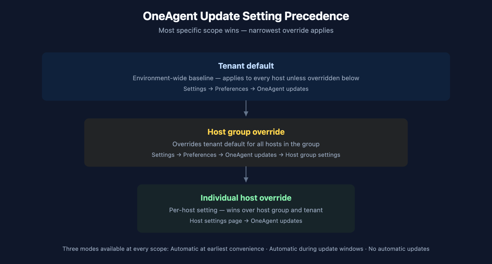
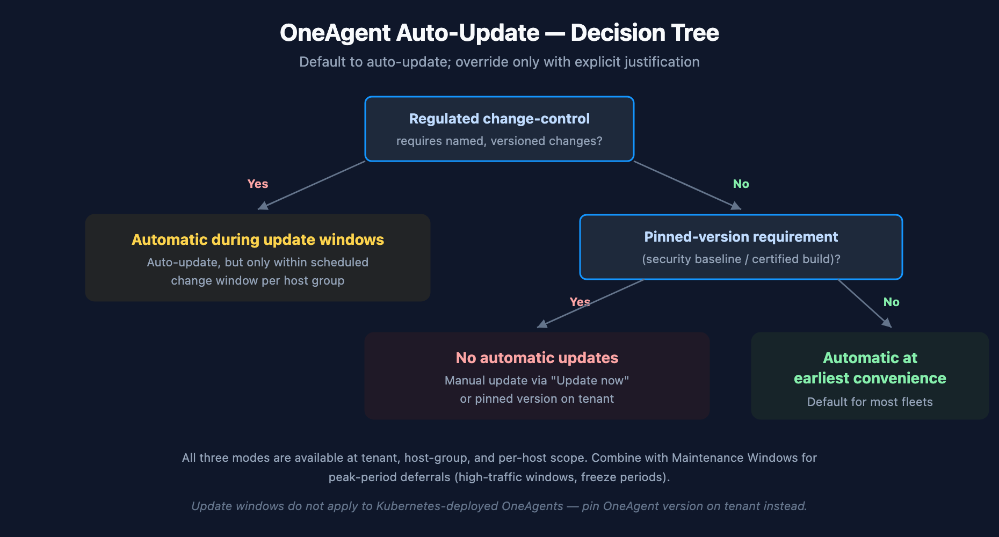

# FAQ-04: How to manage OneAgent updates on Dynatrace SaaS

> **Series:** FAQ — Frequently Asked Questions | **Reference:** 04 — Managing OneAgent Updates (SaaS) | **Created:** May 2026 | **Last Updated:** 05/11/2026

## Overview

OneAgent updates are one of the few estate-wide changes Dynatrace performs continuously — most tenants run them silently, on a default that was set at standup and rarely revisited. That default works for the majority of fleets. It does not work for every fleet.

This FAQ is a decision-support entry for the question: *"How should our organization manage OneAgent updates on SaaS?"* It covers the update mechanism, the three available modes, where settings live (tenant / host group / per host), how update windows and maintenance windows interact, the special case for Kubernetes-deployed OneAgents (where DynaKube's `autoUpdate` field is now deprecated in favor of pinning the OneAgent version on the tenant), validation, rollback, and the most common pitfalls.

The intent is not to talk anyone out of auto-update. For most fleets, **automatic at earliest convenience** remains the right answer. The intent is to make the decision deliberate — and to surface the few cases where a different mode is correct.

> **Scope:** SaaS-only. If you run Dynatrace Managed, the Cluster ActiveGate has its own update path and the OneAgent update model is similar but version-pinned at the cluster level; consult Managed-specific docs.

---

## Table of Contents

1. [Why OneAgent Update Cadence Matters](#cadence)
2. [How OneAgent Updates Work on SaaS](#mechanism)
3. [Update Setting Precedence — Tenant → Host Group → Host](#precedence)
4. [The Three Update Modes — Decision Framework](#modes)
5. [Update Windows vs Maintenance Windows](#windows)
6. [Containerized OneAgent — The DynaKube Special Case](#k8s)
7. [Sequencing Relative to ActiveGate](#sequencing)
8. [Validation After Update](#validation)
9. [Rollback Considerations](#rollback)
10. [Common Pitfalls](#pitfalls)
11. [Recommended Approach](#recommendation)

---

## Prerequisites

| Requirement | Details |
|-------------|---------|
| **Audience** | Platform team, SRE leads, change-management owners, security stakeholders |
| **Format** | Decision-support document — presents trade-offs and recommendations, no hands-on lab |
| **Deployment** | Dynatrace SaaS (Managed is briefly noted; not the focus) |
| **Related topic series** | ONBRD (Dynatrace Onboarding), K8S (Kubernetes Monitoring), AUTOM (Configuration Automation) |
| **Related FAQ** | **FAQ-05: How to manage ActiveGate updates on Dynatrace SaaS** — sequencing depends on AG version |

## 1. Why OneAgent Update Cadence Matters

OneAgent is the data-collection layer of the platform. Update cadence directly affects:

- **Coverage parity with newly-supported technologies.** New runtime versions, frameworks, and infrastructure types arrive in OneAgent releases. A fleet running an older OneAgent loses coverage on whatever was added since.
- **Bug and CVE remediation.** Fixes for parsing, instrumentation, and security issues ship through normal OneAgent releases. Deferring updates indefinitely defers those fixes.
- **Telemetry feature parity.** New span attributes, K8s metadata, log enrichment fields, and Davis inputs depend on the OneAgent producing them. A lagging fleet produces a thinner data stream.
- **Operator workload.** Every manual coordination cycle — pick a version, schedule a window, validate, repeat — consumes engineering time that auto-update absorbs.

| Without active management | With active management | Impact |
|---|---|---|
| Fleet drifts across versions silently | Version distribution stays bounded | Coverage and telemetry stay consistent across hosts |
| New tech support arrives months late | Coverage matches what teams actually run | No "we don't see service X yet" surprises |
| CVEs sit unpatched on host agents | Fixes propagate with the next release wave | Reduces vulnerability window |
| Change-management view of "what's deployed" is unclear | Update mode is an intentional, auditable choice | Aligns Dynatrace with the rest of your change governance |

In community practice, the most consistent benefit teams report from leaving auto-update on is "we stopped having a OneAgent-version inventory problem." Verify against your own change-control framework.

> **Sources:** [OneAgent update (DT docs)](https://docs.dynatrace.com/docs/shortlink/oneagent-update) — *"With auto-update enabled, you don't have to worry about manually updating the OneAgents running in your environment."*

## 2. How OneAgent Updates Work on SaaS

On SaaS, the update flow is straightforward:

1. A new OneAgent version is published to the Dynatrace download infrastructure.
2. Each OneAgent periodically checks whether it should update, based on the effective setting at its scope (per-host → host-group → tenant default).
3. If the effective setting permits, the OneAgent downloads the new installer in the background.
4. On the next eligible moment (immediately, or within the next update window), the OneAgent restarts on the new version.
5. Deep monitoring is re-injected into monitored processes as they restart on their own schedule (or sooner, depending on process type).

A few mechanics that surprise teams new to the platform:

- **The OneAgent process itself updates without restarting monitored applications.** The OS-level OneAgent service restarts; the monitored processes only need to restart for new deep-injection scenarios (e.g., when injection libraries change in a way that requires fresh process startup). Many updates require no application restart at all.
- **Updates are pull-style, not push.** Dynatrace does not actively reach into the host to apply an update; the OneAgent contacts Dynatrace to check eligibility on a recurring interval. This means an offline or network-isolated host catches up when it returns to network reachability.
- **A failed update does not leave the host unmonitored.** The previous version continues running while the new installer is staged; the switchover happens at an eligible moment.
- **Update Now buttons exist at multiple levels.** Individual host and environment-wide "Update now to target version" controls are available in addition to the auto-update flow.

> **Sources:** [OneAgent update (DT docs)](https://docs.dynatrace.com/docs/shortlink/oneagent-update) — describes the three update strategies, the per-scope precedence, and the "Update now" controls.

## 3. Update Setting Precedence — Tenant → Host Group → Host

Three scopes, in increasing specificity:

<!-- MARKDOWN_TABLE_ALTERNATIVE
| Scope | Where set | Wins over |
|-------|-----------|-----------|
| Tenant default | Settings → Preferences → OneAgent updates | (baseline) |
| Host group override | Settings → Preferences → OneAgent updates → Host group settings | Tenant default |
| Per-host override | Host settings page → OneAgent updates | Host group + tenant default |
For environments where SVG doesn't render
-->

| Scope | When to use |
|-------|-------------|
| **Tenant default** | The fleet-wide policy. For most tenants this is `Automatic at earliest convenience` or `Automatic during update windows`, depending on change-control culture. |
| **Host group override** | Different cadences for different host groups — e.g., `production` updates during a Saturday window, `nonprod` updates at earliest convenience, `pci-prod` stays on `No automatic updates` pending change-board approval. This is the most common reason to deviate from the tenant default. |
| **Per-host override** | Exceptional cases — a specific host running a workload with strict version-pinning needs, or a host on extended quarantine after an incident. Per-host overrides are powerful but invisible at the fleet-management level; document them. |

**Where this lives operationally:** the host-group setting is the right granularity for almost every real-world policy. Per-host overrides are escape hatches. If you find yourself setting per-host overrides repeatedly across the same group of hosts, that group is telling you it wants to be its own host group.

> **Sources:**
> - [OneAgent update (DT docs)](https://docs.dynatrace.com/docs/shortlink/oneagent-update) — three-level precedence: environment / host group / individual host.
> - [Host groups (DT docs)](https://docs.dynatrace.com/docs/shortlink/host-groups) — host-group as the canonical scoping boundary for update settings, alerting overrides, and thresholds.
> - [oneagentctl (DT docs)](https://docs.dynatrace.com/docs/shortlink/oneagentctl) — `--set-host-group` and related auto-update CLI controls, persistent across reinstalls.

## 4. The Three Update Modes — Decision Framework

Three modes, available at every scope:

| Mode | What it does | When to pick it |
|------|--------------|-----------------|
| **Automatic at earliest convenience** | OneAgent updates as soon as the new version is available and the host is in a position to restart the agent. | Default for nonprod, dev, lab fleets; default for most production fleets without explicit change-control requirements. |
| **Automatic during update windows** | OneAgent updates only within a configured update window (one-time, daily, weekly, or monthly recurrence). | Fleets with peak-period sensitivity (retail freeze, end-of-month batch jobs) where the update mechanic is fine but the *timing* needs to be predictable. |
| **No automatic updates** | OneAgent never auto-updates; manual "Update now" or pinned-version flows only. | Strict change control (PCI, regulated industries, change-board ratification required) — every version transition is a named, ticketed change. |

<!-- MARKDOWN_TABLE_ALTERNATIVE
| Question | Yes → | No → |
|----------|------|------|
| Regulated change-control requires named, versioned changes? | Automatic during update windows | (continue) |
| Pinned-version requirement (security baseline / certified build)? | No automatic updates | Automatic at earliest convenience |
For environments where SVG doesn't render
-->

### Trade-offs

| Mode | Operator cost | Lag from latest | Notes |
|------|--------------|-----------------|-------|
| Automatic at earliest convenience | Lowest | Hours-to-days | Background — most fleets pick this and never revisit |
| Automatic during update windows | Low | Days-to-weeks (window-dependent) | Predictable; aligns with established maintenance cadences |
| No automatic updates | Highest | Until manually applied — potentially long | Every transition is a ticket; risks fleet drifting silently if not managed |

The "No automatic updates" mode is often picked defensively at tenant standup ("we'll turn it on later") and then forgotten. If you adopt this mode, pair it with a recurring calendar reminder to evaluate available versions, or you will discover that the fleet is six months behind a year later.

> **Sources:** [OneAgent update (DT docs)](https://docs.dynatrace.com/docs/shortlink/oneagent-update) — *"Automatic at earliest convenience"*, *"Automatic during update windows"*, and *"No automatic updates"* are the three documented modes; "Update now" and environment-wide "Update now to target version" are the manual triggers when auto-update is disabled.

## 5. Update Windows vs Maintenance Windows

Two related-but-distinct mechanisms are easy to confuse:

| Concept | What it does | Where to set |
|---------|--------------|--------------|
| **Update window** | Defines *when* automatic OneAgent updates may execute. Only applies when the update mode is `Automatic during update windows`. | Settings → Preferences → OneAgent updates → Update windows |
| **Maintenance window** | Suppresses *alerting* on monitored entities during the window. Does **not** govern OneAgent updates. | Settings → Maintenance windows |

In community practice, the confusion goes both directions: teams set a Maintenance Window expecting it to delay OneAgent updates (it does not), or they set an Update Window expecting alerts to be suppressed during it (they are not). Maintenance windows govern alerting; update windows govern the update mechanic itself. They are independent tools and often used together.

A useful pairing: schedule update windows during your normal maintenance cadence, *and* create a maintenance window over the same period — so OneAgent updates happen quietly without generating "OneAgent restart detected" event noise downstream.

**Recurrence patterns** for update windows: one-time, daily (every N days), weekly (specific weekdays), monthly (specific day-of-month). Pick the pattern that matches your existing change calendar — there is no built-in advantage to weekly over monthly, just operational fit.

> **Sources:**
> - [OneAgent update (DT docs)](https://docs.dynatrace.com/docs/shortlink/oneagent-update) — *"OneAgent update windows are used to schedule automatic OneAgent updates when the Automatic updates during update windows option is selected."*
> - [Maintenance windows (DT docs)](https://docs.dynatrace.com/docs/analyze-explore-automate/notifications-and-alerting/maintenance-windows) — maintenance windows suppress alerting; they do not delay or govern OneAgent updates.

## 6. Containerized OneAgent — The DynaKube Special Case

OneAgent in Kubernetes is managed by the Dynatrace Operator through a DynaKube custom resource. The update model here differs from host-based OneAgent in important ways:

- **Update windows do not apply to Kubernetes-deployed OneAgents.** The OneAgent update windows mechanic is host-based.
- **The DynaKube `autoUpdate` parameter is deprecated.** The DynaKube parameters reference now documents `autoUpdate` as *"Deprecated field to be removed in a future release. Pin the OneAgent version on your tenant to configure auto-update. Auto-update is disabled when the `version` or `image` fields are set."*
- **The supported pattern is to pin the OneAgent version on the tenant.** Setting `version` or `image` on the DynaKube CR explicitly opts out of auto-update for that workload.

In practice this means: for Kubernetes workloads, the policy choice is not "auto-update yes/no" at the DynaKube level — it is *"pin a specific OneAgent version on the tenant, or leave it floating."* Pinning the version on the tenant gives you a single, auditable artifact for what is deployed across all clusters using that DynaKube.

| Decision | Mechanism on K8s |
|----------|------------------|
| Auto-update OneAgent in cluster | Leave version / image unset on DynaKube; let the tenant default flow |
| Pin a specific OneAgent version | Pin on tenant, *or* set `version` / `image` on DynaKube (the older pattern) |
| Different version per cluster | Multiple DynaKube CRs, each with its own version pin |

For deeper coverage of DynaKube modes (`classicFullStack`, `cloudNativeFullStack`, `applicationMonitoring`, `hostMonitoring`), see the **K8S** topic series. This FAQ stays at the update-policy level.

> **Sources:**
> - [DynaKube parameters for Dynatrace Operator (DT docs)](https://docs.dynatrace.com/docs/ingest-from/setup-on-k8s/reference/dynakube-parameters) — *"Deprecated field to be removed in a future release. Pin the OneAgent version on your tenant to configure auto-update."*
> - [OneAgent update (DT docs)](https://docs.dynatrace.com/docs/shortlink/oneagent-update) — *"Update windows currently do not apply in Kubernetes environments."*

## 7. Sequencing Relative to ActiveGate

When ActiveGates sit in the OneAgent → Dynatrace path (private ActiveGates for routing, or AGs in network-restricted environments), the operating practice is:

> **ActiveGates update first, then OneAgents.**

The rationale is asymmetric compatibility: a newer ActiveGate accepting traffic from older OneAgents is the supported direction; a newer OneAgent talking to an older AG can encounter feature or protocol mismatches that the platform doesn't aggressively defend against.

If your tenant uses no private ActiveGates (OneAgents connect directly to Dynatrace SaaS), this sequencing concern doesn't apply — but most enterprise deployments include at least one AG tier for network reasons, so the rule effectively applies.

**See FAQ-05: How to manage ActiveGate updates on Dynatrace SaaS for the full AG-side discussion, including HA pair rolling updates, role-specific considerations (synthetic, EF 2.0, cloud monitoring), and validation steps.**

In community practice, mixed-version environments (AGs lagging behind OneAgents) tend to surface first as *"some hosts intermittently aren't reporting"* or *"this new feature didn't light up on these hosts"* — by then the diagnostic path is long. Updating AGs first avoids the failure mode.

> **Sources:** [OneAgent update (DT docs)](https://docs.dynatrace.com/docs/shortlink/oneagent-update), [Update ActiveGate (DT docs)](https://docs.dynatrace.com/docs/shortlink/update-activegate). **Derived:** the AG-before-OneAgent rule is community / engagement guidance grounded in the asymmetric compatibility direction documented across both update pages; neither page states it as a single explicit rule.

## 8. Validation After Update

For most fleets on `Automatic at earliest convenience`, post-update validation is implicit — the platform itself reports OneAgent health, version, and process injection status. The check usually doesn't need a separate workflow.

For change-controlled fleets, the explicit validation set is:

1. **Version reported.** Confirm the OneAgent is reporting the target version (Deployment status page; or DQL: `fetch dt.entity.host | fields entity.name, dt.host.os_version, oneagent.version`).
2. **Deep monitoring re-injected.** Process Groups and PGIs for the host show the new agent version. New process starts after the update inherit the new agent.
3. **Smartscape topology intact.** No unexpected gaps — services, processes, and hosts still link as before.
4. **No new ingestion errors.** Spans, logs, and metrics from the host continue to land; no spike in dropped events.
5. **Application functioning normally.** If a deep-injection-relevant change shipped (Java agent library swap, .NET profiler change), validate the apps themselves restart cleanly.

For fleets running `Automatic during update windows`, build this checklist into the post-window review so any anomalies get caught before the next window's batch.

> **Sources:** [OneAgent update (DT docs)](https://docs.dynatrace.com/docs/shortlink/oneagent-update). **Derived:** the validation list combines the documented update mechanism with general observability hygiene — no single page enumerates this checklist, which is community / engagement practice.

## 9. Rollback Considerations

Rollback of a OneAgent version is uncommon on SaaS, but it does happen — most often when a new version introduces an unexpected interaction with a specific runtime or framework on a specific host.

The operating reality:

- **Rollback = install older version.** There is no in-place downgrade. The flow is `Uninstall current OneAgent → install older installer → confirm host re-registers on the older version`. The host re-keys to its existing entity ID.
- **Pinning the tenant to an older version stops the auto-update flow from reverting your rollback.** Without pinning, the host will auto-update back to current on its next cycle.
- **For Kubernetes**, pin the OneAgent version on the tenant (or set `version` / `image` on the DynaKube CR). The Operator will rotate the OneAgent pods to the pinned version.
- **Capture configuration before rollback.** Host group assignment, host tags, host properties — `oneagentctl --get-host-group`, `oneagentctl --get-host-tag`, etc. — survive reinstall if you reapply on the new install. Document them first.

In community practice, the right time to plan rollback is *before* enabling a broad rollout — pick a canary host group, validate there, then expand. Rollback as a routine response to a fleet-wide issue is expensive and rarely the best answer; rollback as a contained response within a canary is cheap.

> **Sources:** [OneAgent update (DT docs)](https://docs.dynatrace.com/docs/shortlink/oneagent-update), [oneagentctl (DT docs)](https://docs.dynatrace.com/docs/shortlink/oneagentctl). **Derived:** the rollback playbook combines the documented uninstall/reinstall mechanic with general observability change-management practice — community guidance, not a single documented procedure.

## 10. Common Pitfalls

| Pitfall | Why it happens | What to do instead |
|---------|----------------|--------------------|
| **"We'll disable auto-update for safety, then forget about it."** | `No automatic updates` is set at standup as a precaution and never revisited. Fleet drifts months behind. | Pair `No automatic updates` with a recurring calendar reminder to evaluate available versions, or pick `Automatic during update windows` instead. |
| **Maintenance window expected to delay an update.** | Maintenance windows suppress *alerts*, not updates. Setting a maintenance window and expecting OneAgent to wait is a common confusion. | Use **update windows** for update timing; use maintenance windows for alert suppression. The two are independent. |
| **Per-host overrides accumulating invisibly.** | One-off per-host changes pile up; the host-group setting is no longer the effective policy across the group. | If multiple hosts in a group need different behavior, that's a signal the group should be split — not a signal to multiply per-host overrides. |
| **DynaKube `autoUpdate: false` as the K8s pinning mechanism.** | The DynaKube field is deprecated; many older blog posts still recommend it. | Pin the OneAgent version on the tenant instead, *or* set `version`/`image` on the DynaKube CR. |
| **Updating OneAgents before ActiveGates.** | The natural intuition is "agents first." | ActiveGates first — see FAQ-05 for the full discussion. |
| **No post-update validation discipline.** | "It auto-updated, so it must be fine." | Spot-check version, deep monitoring re-injection, and topology integrity after any non-routine update. Most fleets need this only for major versions. |
| **Treating OneAgent update like an OS patch.** | OS patch programs assume "all hosts patched on Tuesday." OneAgent updates run on Dynatrace's release cadence, not your OS calendar. | Decouple OneAgent update policy from OS patch policy. Update windows can align the two if needed, but they are not the same process. |

> **Sources:**
> - [OneAgent update (DT docs)](https://docs.dynatrace.com/docs/shortlink/oneagent-update) — mechanics of the three update modes and the "Update now" controls.
> - [DynaKube parameters (DT docs)](https://docs.dynatrace.com/docs/ingest-from/setup-on-k8s/reference/dynakube-parameters) — `autoUpdate` is deprecated; pin version on tenant is the supported path.
> - The remaining items are community / engagement-derived patterns — observed enough times across fleets to be worth flagging, not formally documented as anti-patterns by Dynatrace.

## 11. Recommended Approach

For most SaaS tenants, the right configuration is:

1. **Tenant default: `Automatic at earliest convenience`.** Lowest operator cost; fleet stays current automatically.
2. **Host-group overrides for production: `Automatic during update windows`** if your change-control culture wants predictable timing. Pair with a recurring update window (e.g., Sunday 02:00–04:00 local).
3. **Host-group override for regulated tiers (PCI, FedRAMP equivalent, etc.): `No automatic updates`** with a documented quarterly version-evaluation cadence. Pin the version on the tenant or via DynaKube `version`/`image` for K8s workloads.
4. **Per-host overrides only in exceptional cases** — and only when you've documented why elsewhere (DECISIONS.md, change ticket, host-group naming convention).
5. **Update ActiveGates before OneAgents.** See FAQ-05.
6. **Validate version, deep injection, and topology after major-version updates.** Routine minor updates rarely need this.
7. **Plan rollback within canary scope, not fleet-wide.** Pick a canary host group, validate, expand.

For Kubernetes-only tenants, the recommended pattern is:

1. **Leave DynaKube `version`/`image` unset** unless you have a reason to pin.
2. **Pin OneAgent version on the tenant** when you need a controlled rollout cadence.
3. **Treat `autoUpdate` on DynaKube as deprecated** — don't author new DynaKube CRs that rely on it.

## Summary

OneAgent update management on SaaS is a four-axis decision: mode (auto / windowed / off), scope (tenant / host group / host), Kubernetes special case (version pin on tenant), and sequencing (after ActiveGates). The default `Automatic at earliest convenience` is the right answer for most fleets; the few cases where it isn't are change-controlled production, regulated tiers, and explicit canary patterns. The most common failure is choosing `No automatic updates` defensively at standup and letting the fleet drift — pair it with a calendar mechanism, or pick `Automatic during update windows` instead.

## Next Steps

- Review your current tenant-level OneAgent update setting and confirm it is intentional (not a leftover from standup).
- Audit per-host-group overrides; collapse any that have drifted into "per-host overrides everywhere" patterns.
- For Kubernetes workloads, migrate away from DynaKube `autoUpdate` toward tenant-level version pinning.
- Read **FAQ-05** for the ActiveGate side of the same problem, and update AGs first.
- Document your update policy alongside your host-group naming convention (see **FAQ-01**) and tagging strategy (see **FAQ-02**).

---

*This notebook was AI-generated from community-submitted and publicly available sources. This notebook series is not officially supported by Dynatrace. Always verify information against official [Dynatrace documentation](https://docs.dynatrace.com/docs).*
