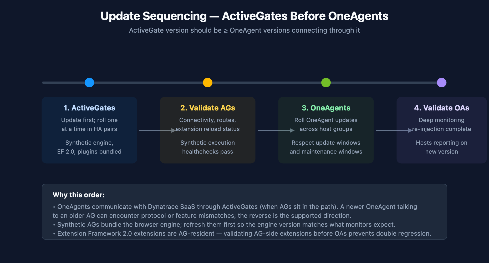
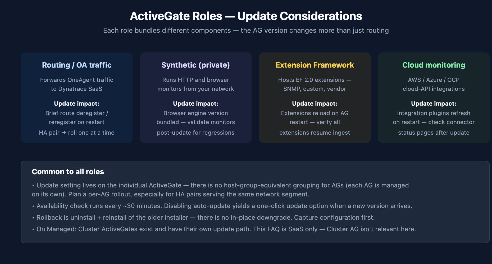

# FAQ-05: How to manage ActiveGate updates on Dynatrace SaaS

> **Series:** FAQ — Frequently Asked Questions | **Reference:** 05 — Managing ActiveGate Updates (SaaS) | **Created:** May 2026 | **Last Updated:** 05/11/2026

## Overview

ActiveGate updates differ from OneAgent updates in a way that matters operationally: ActiveGates are infrastructure, not endpoints. A single ActiveGate sits in the path of many OneAgents, hosts a set of extensions, and may run a synthetic browser engine. When an ActiveGate restarts to update, the impact is concentrated — not distributed across thousands of hosts the way a OneAgent restart is.

That concentration is the reason ActiveGate update management deserves a separate decision than OneAgent update management. The mechanics look similar (auto-update toggle, version checking, restart), but the operating practices around sequencing, HA pairs, role-specific validation, and rollback are distinct.

This FAQ covers: the update mechanism, the auto-update vs manual decision, the sequencing rule (ActiveGates before OneAgents), HA-pair rolling updates, role-specific considerations (routing, synthetic, Extension Framework 2.0, cloud monitoring), validation, rollback, and the most common pitfalls.

> **Scope:** SaaS only. Managed Cluster ActiveGates and the Cluster ActiveGate update model are out of scope here.

---

## Table of Contents

1. [Why ActiveGate Updates Need Attention](#why)
2. [How ActiveGate Updates Work on SaaS](#mechanism)
3. [The Auto-Update vs Manual Decision](#modes)
4. [Sequencing — ActiveGates Before OneAgents](#sequencing)
5. [HA Pairs and Rolling Updates](#ha)
6. [Roles and Update Implications](#roles)
7. [Validation After Update](#validation)
8. [Rollback Considerations](#rollback)
9. [Common Pitfalls](#pitfalls)
10. [Recommended Approach](#recommendation)

---

## Prerequisites

| Requirement | Details |
|-------------|---------|
| **Audience** | Platform team, SRE leads, network/proxy owners, change-management stakeholders |
| **Format** | Decision-support document — presents trade-offs and recommendations, no hands-on lab |
| **Deployment** | Dynatrace SaaS Environment ActiveGates. Managed Cluster ActiveGate is out of scope. |
| **Related topic series** | ONBRD (Dynatrace Onboarding), SYNTH (Synthetic Monitoring), CLOUD (Cloud Provider Integrations) |
| **Related FAQ** | **FAQ-04: How to manage OneAgent updates on Dynatrace SaaS** — sequencing depends on AG version |

## 1. Why ActiveGate Updates Need Attention

OneAgent updates are distributed — thousands of hosts, each with its own restart, no single one affecting much. ActiveGate updates are concentrated — one component in the path of many flows, and the restart touches every flow it serves.

The practical consequences:

- **Connectivity gap during restart.** OneAgents and other clients route through the ActiveGate. A restart introduces a brief gap (typically tens of seconds). HA pairs absorb this — single AGs do not.
- **Bundled components update with the AG.** Synthetic browser engine, Extension Framework 2.0 extensions, cloud-monitoring connectors — these don't have independent versions; they ship with the AG version.
- **Version compatibility downstream.** OneAgents connecting through an older AG can encounter feature or protocol mismatches once OneAgents themselves update. Keeping the AG ahead avoids the failure mode.
- **Role-specific behavior changes.** A synthetic-enabled AG restart re-initializes browser monitors; an EF 2.0-enabled AG restart reloads extensions. The "blast radius" of the restart depends on what the AG is configured to do.

| Without active management | With active management | Impact |
|---|---|---|
| AGs drift behind OneAgent versions | AGs lead, OneAgents follow | Avoids mixed-version protocol issues |
| Synthetic monitors regress unexpectedly after bundled engine change | Browser-engine change is validated post-update | Monitor false-failures are caught quickly |
| EF 2.0 extensions fail to reload after a restart, ingest stops silently | Extension reload is part of post-update validation | Stays current on extension behavior |
| Single-AG architectures take observability gaps during every update | HA pair, rolled one at a time | No observability gap during update |

In community practice, the most consistent benefit teams report from disciplined AG update management is "we stopped having synthetic monitors flake mysteriously after sprint updates" — the symptom that surfaces when bundled engine changes happen invisibly. Verify against your own monitor history.

> **Sources:** [Update ActiveGate (DT docs)](https://docs.dynatrace.com/docs/shortlink/update-activegate) — *"when a new version of ActiveGate becomes available, a new installation package will be downloaded to the particular host, and the new version of ActiveGate will be installed"*; availability check runs at ~30-minute intervals.

## 2. How ActiveGate Updates Work on SaaS

ActiveGate update flow on SaaS:

1. The ActiveGate checks Dynatrace SaaS for a newer version on an interval (~30 minutes).
2. If a newer version is available and auto-update is enabled for this AG, the new installer is downloaded.
3. The new version is installed and the AG service restarts on it.
4. Routes, extensions, and synthetic engine re-initialize on the new version.
5. The AG re-registers and resumes serving traffic.

A few mechanics worth knowing:

- **Settings are per-ActiveGate.** Unlike OneAgent — where host-group is the natural grouping — ActiveGates are managed individually. Each AG has its own update setting. There is no host-group equivalent for AGs.
- **Auto-update can be disabled.** When disabled, a *one-click "Update now"* control appears in the AG's settings when a new version is available.
- **The check interval is fixed.** Roughly every 30 minutes; this is a platform behavior, not a configurable knob.
- **The restart window is short.** Tens of seconds typically. HA pair architectures absorb this; single-AG architectures briefly drop traffic.

> **Sources:** [Update ActiveGate (DT docs)](https://docs.dynatrace.com/docs/shortlink/update-activegate) — describes per-AG settings, one-click update, the 30-minute availability check; *"Go to Settings to open the ActiveGate updates settings for the particular ActiveGate."*

## 3. The Auto-Update vs Manual Decision

Two effective modes per ActiveGate:

| Mode | What it does | When to pick it |
|------|--------------|-----------------|
| **Auto-update enabled** (default) | AG downloads and installs new versions as they become available. | Most ActiveGates — especially routing AGs in HA pairs, where the rolling-update pattern absorbs the restart. |
| **Auto-update disabled** | AG checks for new versions but does not install. A *one-click "Update now"* control appears when a new version is available. | AGs where the restart window or bundled-component change needs to be deliberately scheduled — single-AG sites without HA, AGs with high-stakes EF 2.0 extensions, AGs running synthetic monitors against revenue-critical workflows. |

### Decision factors

- **HA pair vs single AG.** HA pairs make auto-update low-risk: roll one at a time, the partner absorbs the load. Single AGs cause a connectivity gap during restart — disabling auto-update lets you schedule that gap. In community practice, single-AG architectures are usually a temporary state on the path to HA — the right long-term answer is *deploy a second AG*, not *disable auto-update*.
- **Synthetic load.** A synthetic-heavy AG carries a browser engine version that changes with AG version. If your synthetic monitors are revenue- or SLO-load-bearing, disabling auto-update on the synthetic AG lets you validate the new browser engine before it goes live against production monitors.
- **EF 2.0 extension load.** AGs hosting EF 2.0 extensions reload all extensions on restart. If you have many or complex extensions, disabling auto-update lets you stage the restart at a known time.
- **Cloud connectors.** AGs running AWS/Azure/GCP cloud-monitoring connectors are usually safe to auto-update — connector behavior is stable across versions — but a connector-heavy AG benefits from a known restart time for the same reason.
- **Network change-control.** Some networks treat any in-path infrastructure restart as a change requiring a ticket. Auto-update conflicts with that model; pick manual.

> **Sources:** [Update ActiveGate (DT docs)](https://docs.dynatrace.com/docs/shortlink/update-activegate) — auto-update toggle is per-AG; one-click *"Update now"* available when auto-update is disabled and a new version is ready.

## 4. Sequencing — ActiveGates Before OneAgents

The operating rule:

> **Update ActiveGates first. Then update OneAgents.**

The asymmetry: a newer ActiveGate accepting traffic from older OneAgents is the supported direction. A newer OneAgent talking to an older AG can encounter feature or protocol mismatches that the platform doesn't aggressively defend against.

<!-- MARKDOWN_TABLE_ALTERNATIVE
| Stage | Action |
|-------|--------|
| 1 | Update ActiveGates first; roll one at a time in HA pairs |
| 2 | Validate AGs: connectivity, routes, extension reload, synthetic engine healthchecks |
| 3 | Update OneAgents across host groups; respect update windows |
| 4 | Validate OneAgents: deep monitoring re-injection, hosts reporting on new version |
For environments where SVG doesn't render
-->

### What "first" means in practice

- **Sprint cadence:** On most SaaS sprint cycles, ActiveGates auto-update first because they check more frequently and react sooner — the natural order is usually correct without explicit coordination. The deliberate sequencing matters when *manual* updates are involved (disabled auto-update on either side).
- **Major version bumps:** When a major OneAgent version ships with corresponding AG features, the order is explicit: schedule the AG update window first, complete it, validate, then schedule the OneAgent window.
- **Mixed environments:** If you have both auto-updating and manually-updated AGs, the manual ones are the constraint — they bound how fast the AG tier as a whole advances.

If your tenant uses no private ActiveGates (OneAgents connect directly to Dynatrace SaaS), this sequencing concern doesn't apply for the routing path. It still applies for any **specialized** AGs (synthetic, EF 2.0, cloud-monitoring) that produce data the rest of the platform consumes.

**Cross-reference: FAQ-04: How to manage OneAgent updates on Dynatrace SaaS** for the OneAgent-side of the same problem.

> **Sources:** [Update ActiveGate (DT docs)](https://docs.dynatrace.com/docs/shortlink/update-activegate), [OneAgent update (DT docs)](https://docs.dynatrace.com/docs/shortlink/oneagent-update). **Derived:** the AG-before-OneAgent rule is community / engagement guidance grounded in the asymmetric compatibility direction across both update pages; neither page states it as a single explicit rule.

## 5. HA Pairs and Rolling Updates

HA pair architecture is the operating norm for any ActiveGate role serving OneAgent traffic, synthetic, or cloud monitoring in a non-toy environment. The update pattern is:

1. **Roll one AG at a time.** Update the first AG; wait for it to fully re-register and resume serving traffic.
2. **Validate** before touching the second AG. Routes registered, extensions reloaded, no error spikes on the AG itself or on dependents.
3. **Update the second AG.**

This pattern is mostly automatic when auto-update is on across both AGs — the 30-minute check interval and the natural restart-staggering between them tends to produce the rolling pattern without explicit coordination. The pattern needs to be deliberate when:

- You've disabled auto-update on both AGs and are running manual updates → roll them yourself, one at a time.
- The AGs are on different sprint update windows by design → the staggering is built in, just confirm it.
- You're rolling out a known-risky update (major version, big extension framework change) → validate the first AG fully before the second.

**Why not both at once:** during the brief restart window, an AG isn't serving traffic. If both restart simultaneously, you have a connectivity gap. HA pairs only deliver no-gap operation when at least one of them is up.

> **Sources:** [Update ActiveGate (DT docs)](https://docs.dynatrace.com/docs/shortlink/update-activegate). **Derived:** rolling-update sequencing for HA pairs is community / engagement practice — the docs describe per-AG updates but not the operating discipline of staggering them; the discipline follows from the per-AG restart behavior plus general HA-pair principles.

## 6. Roles and Update Implications

ActiveGate roles bundle different components — and the update affects each role's components differently.

<!-- MARKDOWN_TABLE_ALTERNATIVE
| Role | Update impact |
|------|---------------|
| Routing / OA traffic | Brief route deregister / reregister on restart; roll HA pair one at a time |
| Synthetic (private) | Browser engine version bundled — validate monitors post-update for regressions |
| Extension Framework 2.0 | Extensions reload on AG restart — verify all extensions resume ingest |
| Cloud monitoring | AWS/Azure/GCP integration plugins refresh; check connector status pages |
For environments where SVG doesn't render
-->

### Routing / OneAgent traffic

The "default" role. Restart causes a brief route deregister/reregister. In an HA pair the partner absorbs the traffic. For single AGs, this is the role most affected by the restart window.

### Synthetic (private locations)

Private synthetic locations are hosted by ActiveGates with the synthetic role enabled. The browser engine ships with the AG version. After an update, browser monitors may behave differently — usually fine, occasionally a monitor that depended on a specific browser behavior surfaces a failure.

Post-update validation: re-run a representative sample of browser monitors before the next scheduled execution, and check that HTTP monitors continue to pass. Synthetic-flake immediately after an AG update is *not* uncommon and is almost always the engine change, not the monitored site.

### Extension Framework 2.0

EF 2.0 extensions are AG-resident. On AG restart, all extensions on that AG reload. Extension behavior is generally stable across AG versions, but the reload itself can surface configuration issues — an extension that was running with a stale config gets the new config on reload and starts misbehaving.

Post-update validation: check that all expected extensions list as `RUNNING` (or equivalent) post-restart and that their ingest streams (custom metrics, logs, events) resume within the expected interval.

### Cloud monitoring

AWS, Azure, and GCP integration connectors are bundled with the AG. Connector behavior is stable across versions in practice, but new versions occasionally bring new resource-type coverage or change pagination defaults. Post-update validation: connector status pages in the Cloud app (or equivalent) show healthy connectors, and the data lag for cloud-imported metrics matches the pre-update baseline.

### Common across all roles

- Settings are per-AG. There's no role-grouping for update settings.
- Auto-update availability check runs every ~30 minutes.
- Rollback is uninstall + reinstall of the older installer — no in-place downgrade.

> **Sources:**
> - [Update ActiveGate (DT docs)](https://docs.dynatrace.com/docs/shortlink/update-activegate) — per-AG update mechanic, one-click update, availability check interval.
> - The per-role validation guidance is community / engagement-derived — Dynatrace docs describe each role's setup but do not document a per-role post-update validation checklist.

## 7. Validation After Update

Post-update validation for ActiveGates is more concentrated than for OneAgents — fewer entities, but more roles bundled into each.

### Core validation set

1. **AG version reported.** The AG status page reflects the new version. (DQL: `fetch dt.entity.environment_activegate | fields entity.name, activegate.version` — adjust to current entity-type / field names.)
2. **Routes registered.** Traffic resumes flowing through the AG. No host-side "lost connection to ActiveGate" event spike.
3. **Extensions reloaded.** All EF 2.0 extensions show `RUNNING`. Ingest streams from each extension resume within their expected interval.
4. **Synthetic monitors functioning.** If the AG hosts a private synthetic location, run a representative monitor manually and confirm pass. Watch the next scheduled execution.
5. **Cloud connectors connected.** If the AG runs cloud monitoring, the connector status pages show healthy and the data lag for cloud metrics has returned to baseline.

### Validation timing

- **Routing-only AGs:** validation can be near-instant — traffic either flows or it doesn't.
- **Synthetic AGs:** allow at least one full monitor execution cycle before declaring success. Some browser regressions only appear under load.
- **EF 2.0 AGs:** allow at least one full extension scrape cycle (typically 1 minute for fast extensions, 5–15 minutes for slow ones) before declaring success.
- **Cloud monitoring AGs:** allow at least one cloud-API poll cycle (typically 1–5 minutes) plus normal ingestion lag.

For change-controlled environments, document the validation set and timing as part of the change ticket so the post-update verification is auditable.

> **Sources:** [Update ActiveGate (DT docs)](https://docs.dynatrace.com/docs/shortlink/update-activegate). **Derived:** the validation checklist combines the documented update mechanic with role-specific operating practice — community / engagement guidance, not a single documented checklist.

## 8. Rollback Considerations

ActiveGate rollback is less common than OneAgent rollback (fewer AGs, more deliberate updates), but the mechanic is similar:

- **Rollback = uninstall + reinstall older installer.** No in-place downgrade.
- **Capture configuration first.** AG configuration files (`*.properties` under the AG install directory), enabled features, extension installations, connection endpoints, and any custom certificates need to be restored on the older install. Take a backup before uninstalling.
- **Auto-update will revert your rollback.** If you reinstall an older version with auto-update enabled, the AG will update back to current on its next check. Disable auto-update on the rolled-back AG until the issue is resolved.
- **HA partner consideration.** If you're rolling back one AG in an HA pair because of a version-specific issue, the partner is still on the new version. Mixed-version HA pairs are tolerated for short periods but are not a long-term state.
- **Extensions and synthetic monitors may need re-validation.** Rolling back the AG version rolls back the bundled browser engine and EF 2.0 runtime — same considerations as forward updates apply in reverse.

In community practice, rollback is usually a containment move while the underlying issue is investigated. The expected resolution path is *fix forward* — patch from Dynatrace, configuration adjustment, or extension fix — rather than long-term rollback. Plan rollback as a 24–72 hour state, not a steady state.

> **Sources:** [Update ActiveGate (DT docs)](https://docs.dynatrace.com/docs/shortlink/update-activegate). **Derived:** the rollback playbook combines the documented uninstall/reinstall mechanic with general infrastructure-change-management practice — community / engagement guidance.

## 9. Common Pitfalls

| Pitfall | Why it happens | What to do instead |
|---------|----------------|--------------------|
| **Updating OneAgents before ActiveGates.** | Natural intuition: agents first, infrastructure last. | Reverse it — AGs first, OneAgents second. The compatibility direction is asymmetric. |
| **Updating both AGs in an HA pair simultaneously.** | Auto-update on both, no staggering enforced; or a manual change-window applied to both at once. | Roll one at a time. Validate before touching the second. HA-pair updates need to be staggered. |
| **Treating synthetic monitor flake post-update as a real failure.** | A monitor that was relying on a specific browser behavior surfaces a failure after the bundled engine version changes. | Validate monitor behavior after the AG update before declaring an outage. Browser-engine changes are usually the cause of immediate-post-update synthetic flake. |
| **Forgetting that EF 2.0 extensions reload on AG restart.** | Extension was running with a stale config that worked-with-the-old-version; the new version reloads and surfaces the config issue. | Treat extension reloads as part of the AG-update change window. Validate extension status post-restart. |
| **Disabling auto-update on a single AG and forgetting.** | "We'll update manually." Nobody does. Six months later the AG is far behind. | Either run HA so you can leave auto-update on, or pair manual mode with a calendar mechanism. |
| **Trusting the 30-minute check to be exact.** | Update windows planned around an assumed exact check time. | The check is *approximate* — design your window with margin (30 minutes is the lower bound, not a deterministic schedule). |
| **Not validating cloud connectors after an update.** | Connector behavior is usually stable; teams skip the check. | Glance at connector status pages and ingest-lag for cloud metrics post-update — it's a 60-second check that catches the rare regression. |

> **Sources:**
> - [Update ActiveGate (DT docs)](https://docs.dynatrace.com/docs/shortlink/update-activegate) — update mechanic and check interval.
> - The remaining items are community / engagement-derived patterns — observed across fleets to be worth flagging, not formally documented as anti-patterns.

## 10. Recommended Approach

For most SaaS tenants with private ActiveGates, the right configuration is:

1. **Deploy ActiveGates in HA pairs** for any role that is in the path of OneAgent traffic, synthetic monitors, or cloud monitoring. Single-AG architectures are a transitional state, not a target.
2. **Leave auto-update enabled** on routing-only AGs in HA pairs. The natural staggering plus partner-absorbs-load makes auto-update low-risk.
3. **Disable auto-update on synthetic-heavy AGs** where monitor reliability is load-bearing for SLO or revenue. Schedule synthetic-AG updates during low-traffic windows and validate browser-monitor behavior before the next monitor execution cycle.
4. **Disable auto-update on EF 2.0-heavy AGs** if you have many or complex extensions. Schedule the restart at a known time so extension reloads are not a surprise.
5. **Update ActiveGates before OneAgents** as standard practice. See FAQ-04 for the OneAgent-side discussion.
6. **Roll HA pairs one at a time.** Validate the first AG before touching the second.
7. **Validate per-role after every update** — routes, extensions, synthetic monitors, cloud connectors — at the right cadence for each role.
8. **Plan rollback as a 24–72 hour containment**, not a steady state. Disable auto-update on rolled-back AGs to prevent revert.

For tenants with no private ActiveGates:

- The sequencing concern doesn't apply for routing.
- The role-specific concerns still apply for any specialized AGs (synthetic, EF 2.0, cloud monitoring) you do run.
- The HA-pair pattern still applies to specialized AGs in the same way.

## Summary

ActiveGate update management is operationally distinct from OneAgent update management — fewer AGs, more roles bundled into each, more concentrated restart impact. The right defaults differ by role: routing AGs in HA pairs auto-update fine; synthetic and EF 2.0 AGs benefit from manual scheduling; sequencing AGs before OneAgents is the supported direction across all roles. The most common failure modes are simultaneous updates of HA pair members, OneAgent-before-AG sequencing, and disabled auto-update without a calendar mechanism.

## Next Steps

- Inventory your ActiveGates by role and HA topology.
- Convert any single-AG architectures serving production roles to HA pairs.
- Set auto-update intentionally on each AG based on role (not "on everywhere" or "off everywhere").
- Confirm AG sprint cadence is at-or-ahead-of OneAgent cadence; adjust if OneAgents are leading.
- Read **FAQ-04** for the OneAgent-side of the same problem.
- Document AG roles, HA topology, and update policy alongside your host-group naming (see **FAQ-01**) and tagging strategy (see **FAQ-02**).

---

*This notebook was AI-generated from community-submitted and publicly available sources. This notebook series is not officially supported by Dynatrace. Always verify information against official [Dynatrace documentation](https://docs.dynatrace.com/docs).*
