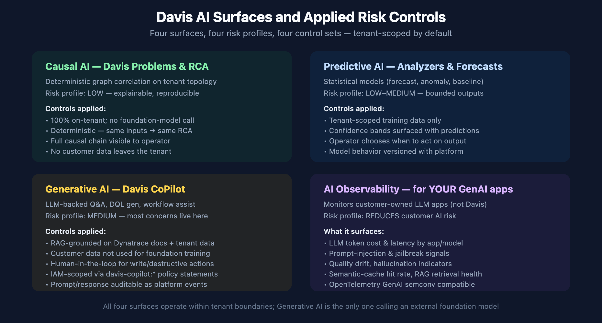

# FAQ-06: Can We Trust Davis AI? A Risk and Controls Walkthrough

> **Series:** FAQ — Frequently Asked Questions | **Reference:** 06 — Can We Trust Davis AI? A Risk and Controls Walkthrough | **Created:** May 2026 | **Last Updated:** 05/15/2026

## Overview

"Can we trust the AI?" is the most common question that surfaces when a customer evaluates Dynatrace Intelligence. The question is doing a lot of work in a small sentence — under it sit four very different surfaces (Causal AI, Predictive AI, Generative AI / Davis CoPilot, and AI Observability for the customer's own GenAI apps), three different audiences (security/compliance, platform/SRE, executive), and a spectrum of risk concerns ranging from "where does my data go" to "can the model make a destructive change without me."

This FAQ unpacks the question. For each Davis AI surface, it states what the surface does, what data crosses what boundary, what risk profile applies, and what controls Dynatrace already has in place to address that risk. It also flags the parts that are still evolving — because pretending there are no gaps is a worse posture than naming them.

The goal is to give a platform team, a security review, or an executive briefing one document they can read and come out the other side with the same mental model.

> **Scope:** Dynatrace SaaS. Davis CoPilot availability and IAM specifics evolve sprint-to-sprint — treat version-specific claims as approximate and verify against current docs before a security review.

---

## Table of Contents

1. [Short Answer](#short-answer)
2. [The Four Davis AI Surfaces](#surface-map)
3. [Data Residency and Tenant Isolation](#residency)
4. [Model Training Boundary](#training-boundary)
5. [Hallucination and Accuracy Controls](#hallucination)
6. [Autonomy Boundaries — Human-in-the-Loop](#autonomy)
7. [Audit Trail and Explainability](#audit)
8. [Access Control](#access-control)
9. [Compliance Posture](#compliance)
10. [AI Observability for Customer GenAI Apps](#ai-observability)
11. [Decision Framework — When to Lean In vs Hold Back](#decision-framework)
12. [Common Objections and Responses](#objections)
13. [What's Still Evolving](#evolving)
14. [Recommended Approach](#recommendation)

---

## Prerequisites

| Requirement | Details |
|-------------|---------|
| **Audience** | Security/compliance reviewers, platform/SRE leaders, executive decision-makers |
| **Format** | Decision-support document — presents Dynatrace's posture and controls, no hands-on lab |
| **Deployment** | Dynatrace SaaS (Gen3 / Platform). Davis CoPilot availability is region- and tenant-dependent. |
| **Related topic series** | AIOPS (Dynatrace Intelligence), IAM (IAM Administration), WFLOW (Workflows and Alert Notifications) |
| **Related FAQ** | FAQ-03 OneAgent vs OTel (for AI Observability context on the instrumentation side) |

<a id="short-answer"></a>
## 1. Short Answer

Dynatrace Intelligence is **not one AI** — it is four distinct surfaces with very different risk profiles:

| Surface | What it is | Risk profile | One-line posture |
|---------|------------|--------------|------------------|
| **Causal AI** | Deterministic problem detection and RCA over tenant topology | LOW | No foundation model involved; fully on-tenant; explainable by construction. |
| **Predictive AI** | Statistical analyzers — forecasts, anomaly detection, baselines | LOW–MEDIUM | Tenant-scoped models; outputs are bounded numerics with confidence; operator decides what to act on. |
| **Generative AI (Davis CoPilot / Dynatrace Assist)** | LLM-backed Q&A, DQL generation, workflow assistance | MEDIUM | RAG-grounded; customer data not used to train foundation models; write/destructive actions require human confirmation; IAM-scoped; auditable. |
| **AI Observability** | Monitoring of the *customer's own* LLM/GenAI applications | REDUCES customer AI risk | This is a *risk-mitigation tool* for the customer's GenAI stack — it surfaces hallucination signals, prompt-injection patterns, cost drift, and quality regressions in your own AI apps. |

**The headline:** the surfaces customers worry about most (data residency, model training, hallucination, runaway autonomy) all map primarily to the Generative AI surface — and that is also the surface where Dynatrace has applied the most explicit controls. The other three surfaces inherit the general platform posture (tenant isolation, IAM, audit) and add little incremental AI-specific risk.

> <sub>**Sources:** [Davis AI overview (DT docs)](https://docs.dynatrace.com/docs/discover-dynatrace/platform/davis-ai), [Davis CoPilot (DT docs)](https://docs.dynatrace.com/docs/discover-dynatrace/platform/davis-ai/copilot). **Derived:** the four-surface taxonomy and risk-profile table is community / engagement framing — Dynatrace docs describe each capability individually but do not present this consolidated risk table.</sub>

<a id="surface-map"></a>
## 2. The Four Davis AI Surfaces



<!-- MARKDOWN_TABLE_ALTERNATIVE
| Surface | Data path | Foundation model? | Primary controls |
|---------|-----------|-------------------|------------------|
| Causal AI | Tenant topology → on-tenant graph correlation → problem card | No | Determinism, explainability, no external call |
| Predictive AI | Tenant metrics → on-tenant statistical model → forecast/anomaly | No | Confidence bands, operator decides |
| Generative AI (CoPilot) | User prompt + tenant context → foundation model (Dynatrace-hosted) → grounded response | Yes (Dynatrace-managed) | RAG, no-training boundary, HITL, IAM, audit |
| AI Observability | Customer's LLM app telemetry → Dynatrace ingest | (monitors customer's models) | Standard ingest controls; OpenTelemetry GenAI semconv |
For environments where SVG doesn't render
-->

### Why this split matters for risk review

A blanket "we use AI" statement collapses very different risk profiles into one scary phrase. A precise statement does the opposite:

- **Causal AI** has the lowest incremental risk of anything Dynatrace ships — it is deterministic graph analysis over data that's already in the tenant, with no foundation-model call and no external data flow. The "AI" label is technically correct but historically loaded.
- **Predictive AI** runs statistical models (forecasting, anomaly detection, baselining) on tenant data. The outputs are bounded numeric predictions with confidence intervals. The risk is *acting on a forecast* — which is an operator decision, not the model's.
- **Generative AI** is the surface that triggers most concerns: a foundation model is involved, the model is large, its outputs are unbounded text, and intuitively it "could say anything." This is where the controls below apply most heavily.
- **AI Observability** is on the other side of the table entirely — it is Dynatrace observing the customer's GenAI apps, not Dynatrace using AI. For a customer running their own LLM applications, this surface *reduces* their AI risk by giving them visibility into hallucinations, prompt injection, cost, and drift.

In community practice, the most productive framing in a security review is to walk the four surfaces explicitly and let the reviewer apply different scrutiny to each. Treating "Davis AI" as one thing usually leads to over-broad concerns about the low-risk surfaces and under-precise questions about the high-risk one.

> <sub>**Sources:** [Davis AI overview (DT docs)](https://docs.dynatrace.com/docs/discover-dynatrace/platform/davis-ai), [Davis CoPilot (DT docs)](https://docs.dynatrace.com/docs/discover-dynatrace/platform/davis-ai/copilot), [Dynatrace AI Observability (DT docs)](https://docs.dynatrace.com/docs/observe/dynatrace-for-ai-observability). **Derived:** the four-surface model and the "different risk per surface" framing is community / engagement-derived.</sub>

<a id="residency"></a>
## 3. Data Residency and Tenant Isolation

The first question in most security reviews: *where does our data go?*

### Causal AI and Predictive AI

Both run entirely within the tenant boundary. The data they operate on (spans, logs, metrics, events, topology) is already in the tenant; the models that process it are part of the Dynatrace platform serving that tenant; the outputs (problems, forecasts, anomalies) land back in the tenant. **No data leaves the tenant boundary as part of these features.**

### Generative AI (Davis CoPilot)

CoPilot is the surface where the data path is more nuanced. A prompt from a user typically combines:

1. The user's literal question.
2. Context that Dynatrace assembles to ground the answer — relevant tenant data (entities, recent problems, schemas), Dynatrace documentation, DQL grammar references.
3. The conversation history.

This composite prompt is sent to a foundation model. The Dynatrace posture is that this model is hosted within Dynatrace's infrastructure boundary — the foundation model is not a public API call to a third-party provider with your tenant data riding along.

**What does cross a boundary**: prompt content goes to the foundation model (within Dynatrace infrastructure). **What does not cross a boundary**: bulk tenant data, your raw logs/spans/metrics in aggregate. RAG-style grounding sends *the slice relevant to the question*, not the corpus.

### Tenant region

CoPilot inference is region-bound consistent with the rest of the platform — the same region your tenant data lives in is the region CoPilot operates in. For region-sensitive customers (EU data residency, FedRAMP), this is the load-bearing claim: CoPilot does not transport your prompts to a different region for inference.

> <sub>**Sources:** [Davis CoPilot data privacy (DT docs)](https://docs.dynatrace.com/docs/discover-dynatrace/platform/davis-ai/copilot/copilot-data-privacy) — verbatim: *"If your environment is located in EMEA, your prompts are processed in an EU region. If your environment is located in NORAM, LATAM, or APAC, your prompts are processed in a US region."* Prompts are routed to LLMs hosted by enterprise vendors such as Microsoft Azure AI and AWS Bedrock. Also: [Davis CoPilot (DT docs)](https://docs.dynatrace.com/docs/discover-dynatrace/platform/davis-ai/copilot), [Trusted AI — Dynatrace Trust Center](https://www.dynatrace.com/company/trust-center/trusted-ai/), [Data security controls (DT docs)](https://docs.dynatrace.com/docs/manage/data-privacy-and-security/data-security/data-security-controls).</sub>

<a id="training-boundary"></a>
## 4. Model Training Boundary

The second question in most security reviews: *is our data used to train your AI models?*

### Foundation models

The Dynatrace posture is that customer tenant data is **not used to train the foundation models** that back Davis CoPilot. The foundation models are licensed/operated as fixed weights from the model vendor — Dynatrace does not feed customer prompts back into the weights.

This is the no-training boundary. It is the load-bearing commitment for most enterprise procurement reviews. Verify it against the current Trust Center language and your contract — both because phrasing tightens over time and because it is the kind of commitment that benefits from being in the agreement, not just in marketing copy.

### Tenant-scoped models (Predictive AI)

The statistical models that drive Predictive AI (forecasting, anomaly baselines) *are* trained on tenant data — but the training is **tenant-scoped**. Your baselines come from your data; another tenant's baselines come from theirs. There is no cross-tenant model. This is different from foundation-model training and is generally what customers want.

### Causal AI

Causal AI does not train. It is a deterministic graph algorithm — same inputs always produce the same RCA. There is no model to update with experience; the "learning" is the topology itself, which is observed, not trained.

### RAG-grounding vs training

A common confusion: "if CoPilot uses our tenant data to answer questions, isn't that training?" No. **Grounding (RAG) is reading; training is rewriting weights.** When CoPilot answers a question about your tenant, it retrieves relevant tenant context and includes it in the prompt for one specific answer — your data does not change the underlying model. The next user (in any tenant) does not get a model that has been altered by your data.

> <sub>**Sources:** [Davis CoPilot data privacy (DT docs)](https://docs.dynatrace.com/docs/discover-dynatrace/platform/davis-ai/copilot/copilot-data-privacy) — verbatim: *"Enterprise vendors don't use the prompts to fine-tune or improve any models or services, or to train models across customers or environments."* [Trusted AI — Dynatrace Trust Center](https://www.dynatrace.com/company/trust-center/trusted-ai/) — verbatim: *"Causal AI and Predictive AI are trained only on the data of the specific customer using Dynatrace Intelligence"* and *"Humans control each phase of the Dynatrace Intelligence lifecycle."* The RAG-vs-training distinction is **Derived** synthesis of these two primary statements.</sub>

<a id="hallucination"></a>
## 5. Hallucination and Accuracy Controls

The third concern in most security reviews: *what if the AI is wrong?*

### Causal AI

Not subject to hallucination. The outputs are deterministic causal chains over real topology. If the RCA is wrong, the cause is a topology gap (the dependency the algorithm doesn't know about), not invention.

### Predictive AI

Subject to forecast error, not hallucination. Forecasts come with confidence bands; anomalies come with statistical scores. The mitigation is reading the confidence — a 95% confidence interval that spans an order of magnitude is the model telling you "I'm not sure," which is a different posture than confidently fabricating.

### Generative AI (Davis CoPilot)

This is the surface where hallucination is a real concern. Controls applied:

| Control | What it does |
|---------|--------------|
| **RAG grounding on Dynatrace docs** | When CoPilot answers a "how does X work" question, it retrieves the relevant Dynatrace docs and grounds the answer there — reducing invention of feature behavior. |
| **RAG grounding on tenant data** | When CoPilot answers a "what is happening in my tenant" question, it retrieves real entities/problems/metrics rather than inventing them. |
| **DQL generation is verifiable** | The output is a DQL query the user can read, edit, and *execute* — the round-trip (`explain in natural language` → DQL → `execute` → results) gives the user a verification path that doesn't exist for prose answers. |
| **Bounded action surface** | CoPilot does not silently execute destructive operations. The output is a suggestion the operator reviews and runs. |
| **Citation in answers** | Where applicable, CoPilot surfaces the doc reference or entity it grounded on — letting the user verify the source. |

### Operator-side mitigation

The most reliable hallucination control is the *operator habit* of treating generative answers as drafts. In community practice, the teams that get the most value out of CoPilot use it for "first draft of a DQL query," "first pass at interpreting a problem," "first explanation of an unfamiliar feature" — and then verify. This is the same posture that applies to GenAI in software development generally and is not Dynatrace-specific.

> <sub>**Sources:** [Davis CoPilot (DT docs)](https://docs.dynatrace.com/docs/discover-dynatrace/platform/davis-ai/copilot), [DQL verify-dql (DT docs)](https://docs.dynatrace.com/docs/discover-dynatrace/references/dynatrace-query-language). **Derived:** the explicit hallucination-control table is community / engagement framing; the individual controls are documented but the consolidated set is not.</sub>

<a id="autonomy"></a>
## 6. Autonomy Boundaries — Human-in-the-Loop

The fourth concern in most security reviews: *can the AI take destructive action on its own?*

### What Davis can do unattended

| Surface | Unattended action |
|---------|-------------------|
| Causal AI | Detect a problem, open a problem card, attribute root cause within tenant topology |
| Predictive AI | Emit a forecast, raise an anomaly event, populate a baseline |
| Generative AI (read-mode) | Answer a question; generate a DQL query for the user to review |

None of these write to your infrastructure. They produce findings and suggestions inside the Dynatrace tenant.

### What requires human-in-the-loop

| Action | Why it requires HITL |
|--------|----------------------|
| Executing a generated DQL query | The operator runs it explicitly — the model does not auto-execute. |
| Acting on a Workflow remediation action | Workflows are configured deliberately; the AI may *suggest* a workflow, but execution is governed by the workflow's own access scoping and trigger rules. |
| Modifying tenant configuration (settings, IAM policies, alerting rules) | These are explicit operator actions through configured pathways. CoPilot may help author the change; the change is applied through the same audit and IAM path as any other config change. |
| Triggering external systems (ticketing, paging, ChatOps) | Handled by Workflows with their own credentials, scopes, and policies. |

### The principle

The platform's autonomy posture is: **AI surfaces produce findings and suggestions; humans (or explicitly configured, scoped automation) apply changes.** This is a deliberate design choice — and it is the choice that most enterprise risk reviewers want to hear, because the alternative ("the AI made the change unattended") is the one that triggers regulatory and operational concerns.

In community practice, the agentic-workflow conversation often comes up here: *can Davis act autonomously through Workflows?* The honest answer is *yes, if the customer configures it that way, and within the scopes the customer grants*. Davis CoPilot suggesting a workflow that, when executed, takes an automatic remediation is the same as any other workflow in the platform — governed by the workflow's own credentials, IAM scope, and configured triggers. The autonomy lives in the *customer's workflow configuration*, not in the AI.

> <sub>**Sources:** [Davis CoPilot (DT docs)](https://docs.dynatrace.com/docs/discover-dynatrace/platform/davis-ai/copilot), [Workflows (DT docs)](https://docs.dynatrace.com/docs/analyze-explore-automate/workflows). **Derived:** the "AI proposes, humans/workflows dispose" framing is community / engagement guidance — the underlying mechanics are documented; the explicit autonomy boundary is the synthesis.</sub>

<a id="audit"></a>
## 7. Audit Trail and Explainability

The fifth concern in most security reviews: *can we see what the AI did, after the fact?*

### Causal AI — explainable by construction

A Davis problem card surfaces the causal chain: the events, the entities, the dependencies, the timeline. Click through and you see the graph the algorithm followed. There is no "the model decided" black-box step — the causal chain is the explanation.

### Predictive AI — analyzers are inspectable

Forecasts and anomaly detections come with their confidence ranges and the data window they were computed on. The model behavior (which algorithm, which parameters) is part of the platform version — Dynatrace versions Predictive analyzer behavior with platform release notes.

### Generative AI — auditable as platform events

CoPilot interactions are auditable in two complementary ways:

1. **Platform-level audit events.** Significant CoPilot interactions surface as platform events that follow the same audit-logging path as other platform interactions (consistent with the platform's general audit posture).
2. **Operator-visible context.** The grounding (which docs, which tenant entities) and the generated output are visible to the user who asked. There is no hidden "private" answer that differs from what was shown.

For procurement reviews that ask "can we audit who asked Davis CoPilot what, and what answer it gave?" — the answer is yes, within the bounds of platform audit retention and the auditing surface Dynatrace provides. The exact retention windows and event schemas evolve sprint-to-sprint; verify against current docs at review time.

### What you can do with the audit trail

- Reconstruct what CoPilot was asked about an incident during post-incident review.
- Detect over-use of CoPilot for sensitive prompts (data egress monitoring on the prompt side).
- Demonstrate to a regulator that AI-assisted actions trace back to human operators who reviewed them.

> <sub>**Sources:** [Davis CoPilot (DT docs)](https://docs.dynatrace.com/docs/discover-dynatrace/platform/davis-ai/copilot), [Dynatrace audit log (DT docs)](https://docs.dynatrace.com/docs/manage/account-management/audit-logs). **Derived + Softened:** the exact audit-event schemas for CoPilot interactions evolve — community-level guidance is "treat CoPilot interactions as auditable platform events"; the precise event names and retention should be verified against current docs.</sub>

<a id="access-control"></a>
## 8. Access Control

The sixth concern in most security reviews: *who can use the AI, and what can they ask it about?*

### IAM-scoped CoPilot access

Davis CoPilot is governed by the same IAM that governs everything else in the platform. Specifically:

- **A user must have CoPilot permission** to interact with it at all (granted via IAM policy statements on the `davis-copilot:*` service — conversational chat, NL→DQL, DQL→NL, document search).
- **CoPilot inherits the user's data scope.** When CoPilot grounds an answer on tenant data, it grounds on the data the *asking user* can see — not the data the platform as a whole has. A user with management-zone-scoped access gets CoPilot answers grounded only on their permitted data.
- **CoPilot does not bypass IAM to read your data.** This is the load-bearing claim. The model does not run as a privileged identity that sees everything; it runs as the user.

### Policy examples (verified against current IAM policy reference)

```
ALLOW davis-copilot:conversations:execute;   // CoPilot chat interface
ALLOW davis-copilot:nl2dql:execute;          // Natural-language → DQL
ALLOW davis-copilot:dql2nl:execute;          // DQL → natural-language summary
ALLOW davis-copilot:document-search:execute; // Doc search skill
// Davis analyzers (Predictive AI) are governed separately:
ALLOW davis:analyzers:read;
ALLOW davis:analyzers:execute;
```

Combined with the user's existing data-access scopes (storage, settings, entities), this composes into the user's effective CoPilot capability. The IAM model is the same as any other Dynatrace service. The policy statement names above are verified against the current IAM policy reference (May 2026) — re-verify when authoring policies, since new CoPilot skills add new statements over time.

### Practical implication

A security reviewer asking "can a junior engineer use CoPilot to ask about sensitive production data?" gets a precise answer: *only if that junior engineer can already see sensitive production data through normal IAM*. CoPilot is not a side channel.

> <sub>**Sources:** [IAM policy reference (DT docs)](https://docs.dynatrace.com/docs/manage/identity-access-management/permission-management/manage-user-permissions-policies/advanced/iam-policystatements) — verified May 2026, enumerates `davis-copilot:conversations:execute`, `davis-copilot:nl2dql:execute`, `davis-copilot:dql2nl:execute`, `davis-copilot:document-search:execute`, plus `davis:analyzers:read` and `davis:analyzers:execute`. Also: [Davis CoPilot (DT docs)](https://docs.dynatrace.com/docs/discover-dynatrace/platform/davis-ai/copilot). **Derived:** the user-scope-inherits framing combines the IAM model with CoPilot's RAG behavior; not stated as a single sentence in either source.</sub>

<a id="compliance"></a>
## 9. Compliance Posture

The seventh concern in most security reviews: *which frameworks does this satisfy?*

### Inherited platform compliance

Davis AI surfaces inherit the Dynatrace platform's general compliance posture — which includes SOC 2 Type 2, ISO 27001, GDPR alignment, HIPAA-eligible configurations, and FedRAMP authorization for the relevant tenant region. The Trust Center carries the authoritative current list; treat any specific certification as "verify in writing for your tenant region" rather than assumed.

### EU AI Act considerations (Derived)

The EU AI Act tiers AI systems by risk level. Mapping Dynatrace's Davis surfaces onto the tiers (community-level synthesis, not Dynatrace guidance):

| Davis surface | Likely EU AI Act tier | Reasoning |
|---------------|----------------------|-----------|
| Causal AI | **Minimal risk** | Deterministic correlation; not a "system that uses ML to make decisions affecting people." |
| Predictive AI | **Minimal–Limited risk** | Statistical forecasting on infrastructure metrics; not an automated-decision system for individuals. |
| Generative AI (CoPilot) | **Limited risk** | A general-purpose AI assistant; transparency requirements apply (user knows they are interacting with AI), which Dynatrace surfaces explicitly. |
| AI Observability | **N/A** | Dynatrace is not the AI provider here; the customer's GenAI app is the regulated system, and this feature *supports* the customer's compliance. |

This mapping is community-level guidance for orientation. Authoritative EU AI Act applicability requires legal review of your specific use case.

### NIST AI Risk Management Framework

The NIST AI RMF's four functions (Govern, Map, Measure, Manage) map onto the Davis AI controls described in §§3–8: tenant-scoping addresses Govern/Map; confidence bands and audit trails address Measure; HITL and IAM address Manage. A security review that uses NIST AI RMF as its scoring rubric will find that Davis AI's existing controls already cover most of the rubric without additional customer configuration.

> <sub>**Sources:** [Dynatrace Trust Center](https://www.dynatrace.com/company/trust-center/trusted-ai/), [GDPR compliance (DT docs)](https://docs.dynatrace.com/docs/manage/data-privacy-and-security/data-privacy/sensitive-data-center). **Derived:** the EU AI Act tier mapping and the NIST AI RMF mapping are community / engagement-level orientations — not Dynatrace's own legal positions. Treat as conversation-starters for a compliance review, not as definitive guidance.</sub>

<a id="ai-observability"></a>
## 10. AI Observability for Customer GenAI Apps

This surface is on the *other side of the question*. It is not Dynatrace using AI on your data; it is Dynatrace giving you visibility into *your own* GenAI applications. For customers building LLM-backed apps (chatbots, agents, copilots, RAG pipelines), this is a risk-reduction tool, not a risk source.

### What it surfaces

| Signal | Why it matters |
|--------|----------------|
| **Token cost per app/model/user** | LLM spend can explode silently; this is the single most-cited operational pain in production GenAI. |
| **End-to-end latency** | LLM-call latency dominates user-perceived latency in most GenAI apps. Trace-level visibility into the model call vs the retrieval vs the embedding step is load-bearing for SLO. |
| **Prompt-injection and jailbreak signals** | Pattern-detection on prompt inputs surfaces attempted prompt injection. |
| **Quality drift / hallucination indicators** | Output-side signals (response-evaluation scores, regression vs golden set) feed into quality alerting. |
| **Semantic-cache hit rate** | A GenAI app's economics often pivot on semantic cache; observing hit rate is the financial control. |
| **RAG retrieval health** | Recall, precision, and latency of the retrieval step — independent of the model. |

### OpenTelemetry GenAI semantic conventions

Dynatrace's AI Observability is compatible with the OpenTelemetry GenAI semantic conventions — meaning if you instrument with OpenTelemetry (Python, JS, etc.), the spans your app emits surface natively. This matters for the "open source instrumentation, vendor analysis" posture many platform teams prefer for AI workloads.

### Why this is a risk *reducer*

A common board-level concern: *we're shipping a customer-facing LLM app — what could go wrong?* The honest answer is: cost, latency, hallucination, prompt injection, drift. AI Observability turns each of those from an unknown into a metric you can SLO against. For a security review that asks "are you taking AI risk in production?", the response is *yes, and here is the instrumentation that gives us the same posture for the AI workload that we have for the rest of the stack.*

> <sub>**Sources:** [Dynatrace AI Observability (DT docs)](https://docs.dynatrace.com/docs/observe/dynatrace-for-ai-observability), [OpenTelemetry GenAI semantic conventions](https://opentelemetry.io/docs/specs/semconv/gen-ai/). **Derived:** the "risk-reducer for the customer's GenAI stack" framing is community / engagement positioning — the underlying signal list is documented; the consolidated framing is the synthesis.</sub>

<a id="decision-framework"></a>
## 11. Decision Framework — When to Lean In vs Hold Back

Not every team should adopt every surface on day one. A rough maturity curve:

| Davis surface | Adopt immediately | Adopt after pilot | Hold pending governance |
|---------------|------------------|-------------------|------------------------|
| **Causal AI** | Yes — comes with the platform, low-risk, immediate value | — | — |
| **Predictive AI — forecasts/anomalies for visibility** | Yes — read-only, informs operators | — | — |
| **Predictive AI — auto-triggering Workflows on anomalies** | — | Yes, after a few cycles of confidence calibration | — |
| **Generative AI — read-only Q&A and DQL generation** | Yes — high productivity, low risk when used as draft-then-verify | — | — |
| **Generative AI — broadly deployed across the team** | — | Yes, after an IAM scoping and audit-log review | — |
| **Generative AI — connected to write-action Workflows** | — | — | Yes — explicit governance: which workflows, which scopes, what audit |
| **AI Observability — instrument GenAI apps you operate** | Yes if you operate any GenAI app — this is risk-reduction | — | — |

### Heuristics for lean-in

- The surface's outputs are reviewed by humans before they cause action.
- The IAM model gives you confidence about who can use the surface and on what data.
- The audit trail satisfies your compliance team's after-the-fact reconstruction needs.

### Heuristics for hold

- The surface's outputs can trigger autonomous writes (workflows, ticketing, paging) without your explicit scoping.
- The audit/observability of the surface itself is unclear to your team.
- Your compliance framework (FedRAMP, regulated industry) has unresolved guidance on the surface.

In community practice, the pattern that produces the best outcomes is: **Causal AI + Predictive AI + read-only CoPilot adopted immediately; CoPilot-driven write actions through Workflows treated as an explicit governance decision per workflow.** This separates the value (which is mostly in the read surfaces) from the risk (which is mostly in autonomous writes) and lets each be evaluated on its own terms.

> <sub>**Sources:** [Davis AI overview (DT docs)](https://docs.dynatrace.com/docs/discover-dynatrace/platform/davis-ai), [Workflows (DT docs)](https://docs.dynatrace.com/docs/analyze-explore-automate/workflows). **Derived:** the adopt/pilot/hold table is community / engagement framing — not Dynatrace's own recommendation.</sub>

<a id="objections"></a>
## 12. Common Objections and Responses

The actual "settle concerns" part. Short objection → short response. Where the response depends on customer-specific verification, that is flagged.

**"Our data will be used to train someone else's model."**
No. Customer tenant data is not used to train the foundation models that back Davis CoPilot. Predictive AI models are tenant-scoped (your data trains your baselines, not anyone else's). Causal AI doesn't train. Verify the exact wording in the current Trust Center and your master agreement.

**"The AI can hallucinate, so we can't trust it for production."**
Hallucination applies to the Generative AI surface, not to Causal or Predictive AI. The mitigation is the same pattern that applies to any GenAI tool: read the output, verify, use as draft. The most-used outputs (DQL queries) are *verifiable by execution* — a feature most LLM products don't offer.

**"The AI could take destructive action without us knowing."**
Davis AI does not execute writes against your infrastructure. The only path to write-action is through Workflows that the customer configures and scopes with the customer's own credentials. The autonomy is configured, not implicit.

**"We can't audit what the AI did."**
Causal AI is explainable by construction (the causal chain is the explanation). Predictive AI is versioned with the platform and surfaces confidence. CoPilot interactions are auditable as platform events. The exact audit retention and schema should be verified against current docs.

**"Our compliance framework hasn't approved AI features yet."**
Then the right move is to adopt the non-Generative surfaces (Causal, Predictive) — which are AI-labeled but don't carry the foundation-model risk profile — and put CoPilot through your compliance process. The four-surface taxonomy in §2 is the framing that lets compliance treat each surface differently.

**"We're worried about EU AI Act / FedRAMP / SOC 2."**
The platform's inherited compliance covers most of these. EU AI Act applicability for the Generative surface is *Limited Risk* in the community-level read — verify with your legal team. SOC 2 / ISO 27001 / FedRAMP are inherited from the platform's existing certifications.

**"We don't want AI features on, period."**
The Causal AI and Predictive AI surfaces are core platform features and broadly always-on. The Generative AI surface (CoPilot) has a more explicit enablement and IAM model — you can choose not to grant the `davis-copilot:*` capability to any user, and the surface stays unused in your tenant.

**"AI Observability — does that mean Dynatrace AI is looking at our AI apps?"**
No. AI Observability is *your team* observing *your own* GenAI apps using Dynatrace as the observability platform — same as you would use Dynatrace to observe any other application stack. No Dynatrace AI is operating on your customer-facing AI app outputs; it's standard OpenTelemetry-based instrumentation surfaced in Dynatrace.

> <sub>**Sources:** All claims map back to the Sources blocks in §§3–10 above. **Softened** throughout — these are summary responses; the load-bearing verifications happen in the cited sections.</sub>

<a id="evolving"></a>
## 13. What's Still Evolving

A risk-posture document is more credible when it names its gaps. Areas where the controls are still maturing or where Dynatrace's guidance is moving sprint-to-sprint:

- **Agentic workflows.** The combination of CoPilot suggesting actions + Workflows executing actions + Workflows orchestrating multi-step plans is moving toward more agentic behavior. The governance model — which scopes, which approvals, which audit — is evolving with the capability.
- **Model versioning transparency.** The Davis CoPilot data-privacy page names the enterprise vendors hosting the foundation models (Microsoft Azure AI and AWS Bedrock) but does not pin a specific model version per customer-facing release. For customers with strict change-control on AI models, the version-pinning granularity is a real gap.
- **Prompt and response retention.** The retention windows for CoPilot prompt/response history (for both audit and personalization) evolve with the product. Verify against current Trust Center / data-residency language for any compliance review.
- **Region availability of CoPilot.** CoPilot is not available in every region yet. Customers in regulated regions (some EU, some FedRAMP) should verify availability and feature parity against the current product matrix.
- **Cross-tenant features.** Most Davis AI is strictly tenant-scoped today. Any future cross-tenant feature (e.g., "benchmark your performance against other tenants in your industry") would re-open the data-residency conversation — but does not exist today.
- **Customer-supplied LLM integration.** Some customers want to point CoPilot at their own foundation model (bring-your-own-LLM). This is a roadmap conversation, not a current capability — and would change the data-path posture if it lands.

Naming these explicitly is the right posture for a risk review. They are not red flags; they are *moving parts*. The right answer to each is "verify at the time of your review against current docs and your contract."

> <sub>**Sources:** Community-derived observations across customer engagements; no single Dynatrace doc enumerates these gaps. **Derived + Softened** throughout.</sub>

<a id="recommendation"></a>
## 14. Recommended Approach

For a customer evaluating Davis AI risk posture, a workable plan:

1. **Walk the four surfaces explicitly.** Causal, Predictive, Generative, AI Observability — don't let "AI" collapse into one decision. The risk profiles differ; the controls differ; the adoption decisions differ.
2. **Adopt Causal AI and Predictive AI immediately.** They come with the platform, carry low incremental risk, and provide most of the platform's AI value.
3. **Pilot CoPilot in read-mode first.** Q&A, DQL generation — the surfaces where the value is high and the risk is "wrong answer that a human reviews," not "destructive action."
4. **Govern write-action workflows explicitly.** Where CoPilot suggests workflows that execute changes, treat each workflow as an explicit governance decision: which scopes, which approvals, which audit.
5. **Adopt AI Observability for your own GenAI apps.** If your team is shipping LLM-backed applications, this surface *reduces* your AI risk by giving you cost/latency/quality/security visibility.
6. **Verify version-specific claims at review time.** Trust Center language, IAM policy statement names, audit event schemas, EU AI Act applicability — all evolve sprint-to-sprint. Treat this FAQ as the orientation; verify the load-bearing claims against current docs and your contract before signing off.
7. **Document your stance per surface.** A short internal policy that says "Causal/Predictive: enabled platform-wide; CoPilot: enabled for engineering, audit logged; CoPilot-driven workflows: per-workflow governance" gives your team a stable position to refer to.

## Summary

Davis AI is four surfaces, not one — and most of the risk concerns customers raise map specifically to the Generative AI surface (Davis CoPilot), where Dynatrace has applied the most explicit controls: tenant-scoped data path, no foundation-model training on customer data, RAG grounding for accuracy, human-in-the-loop for destructive actions, IAM-scoped access, auditable interactions. The other three surfaces (Causal, Predictive, AI Observability) inherit the platform's general security posture and add little incremental AI-specific risk. The right posture in a security review is to walk the four surfaces explicitly, treat each on its own terms, and verify version-specific claims against the current Trust Center and product docs at review time.

## Next Steps

- Read **AIOPS** topic series for a deeper walkthrough of each Davis AI surface and its operational use.
- Read **IAM** topic series for the policy-statement and scope mechanics that govern CoPilot access.
- Read **WFLOW** topic series for the workflow-side of CoPilot-suggested actions and how to scope them.
- Read **FAQ-03** for the AI Observability instrumentation side (OneAgent vs OpenTelemetry for GenAI apps).
- Verify current Trust Center language and IAM policy reference against the load-bearing claims in this FAQ before any procurement or compliance review.

---

<sub>*This notebook was AI-generated from community-submitted and publicly available sources. This notebook series is not officially supported by Dynatrace. Always verify information against official [Dynatrace documentation](https://docs.dynatrace.com/docs).*</sub>
