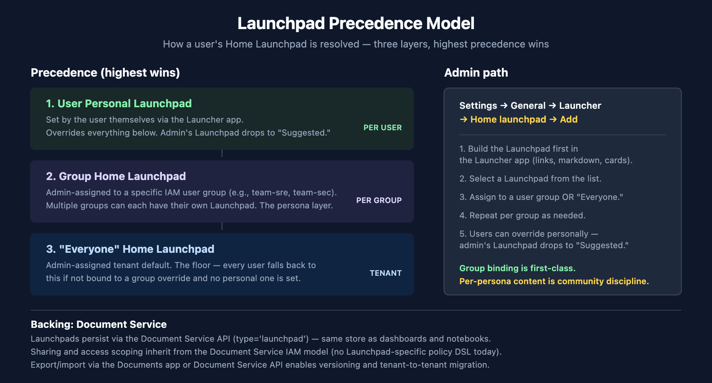

# FAQ-07: How Do I Set Up a Launcher Page? (Default + Persona-Based)

> **Series:** FAQ — Frequently Asked Questions | **Reference:** 07 — Launcher Page Setup (Default + Persona-Based) | **Created:** May 2026 | **Last Updated:** 05/20/2026

## Overview

"How do I set up a launcher page?" is one of the most common questions after a tenant is stood up and users start logging in. Under the question sit three different concerns: what users see when they first land in the platform (the *default*), what different teams or roles see (the *persona-based* experience), and how that experience is governed (the *IAM binding*).

The product name for the landing experience is **Launchpads** — built and managed inside the Launcher app. A Launchpad is a customizable home page that combines links to apps, markdown content, and cards (with optional images and destination buttons) into a single first-screen experience. Admins can assign Launchpads as the *Home Launchpad* for "Everyone" (the tenant default) or for specific IAM groups (the persona overrides), and individual users can set their own personal Launchpad as a per-user override.

This FAQ unpacks the model: the three layers (tenant default → group override → user personal), the admin mechanism, persona-content recommendations for seven common roles, and the parts of the model that are first-class features versus parts that are community discipline.

> **Scope:** Dynatrace SaaS. Launchpads shipped in SaaS 1.314 (May 2025) and have been broadly available since. The admin mechanism and IAM-group binding are first-class features; persona-specific content recommendations are community guidance.

---

## Table of Contents

1. [Short Answer](#short-answer)
2. [What a Launchpad Actually Is](#what-launchpad-is)
3. [The Three-Layer Model — Default, Group, Personal](#three-layer-model)
4. [Setting the Home Launchpad — Admin Mechanism](#admin-mechanism)
5. [Persona Worked Examples](#persona-examples)
6. [The IAM Binding and Document Service Backing](#iam-binding)
7. [Recommended Approach](#recommended-approach)
8. [What's Still Evolving](#evolving)
9. [Common Objections and Responses](#objections)

---

## Prerequisites

| Requirement | Details |
|-------------|---------|
| **Audience** | Tenant admins, platform leads, IAM owners; secondary: persona/role leads (SRE, Security, AppDev, etc.) |
| **Format** | Decision-support document — describes the model, admin path, and persona patterns; no hands-on lab |
| **Deployment** | Dynatrace SaaS. Launchpads shipped in SaaS 1.314 (May 2025); broadly available since. |
| **Related topic series** | IAM (group management and policy DSL), DASH (dashboard design that feeds Launchpad link cards), ORGNZ (persona/security-context naming that often parallels IAM group naming), ONBRD (where Launchpad setup fits in the rollout sequence) |
| **Related FAQ** | FAQ-01 (host-group naming), FAQ-02 (tagging strategy) — both touch on persona axes that often align with Launchpad personas |

## 1. Short Answer

"Setting up a launcher page" in Dynatrace means setting up a **Launchpad** — a customizable home page in the Launcher app. The four questions customers ask most, in compressed form:

| Question | Short answer | Where to look |
|----------|-------------|---------------|
| What is a "launcher page"? | A **Launchpad** — a customizable home page made of links, markdown, and cards, built in the Launcher app. | §2 |
| How do I set what *everyone* sees? | Assign a Home Launchpad to "Everyone" via **Settings → General → Launcher → Home launchpad**. | §3, §4 |
| How do I set different home pages per team? | Assign Home Launchpads to specific IAM user groups via the same Settings path. Group binding is a first-class feature. | §4, §6 |
| How do users get their own? | A user's personal Home Launchpad overrides the admin's; the admin one drops to "Suggested." | §3 |

**Headline:** the mechanism is first-class — admins bind Launchpads to IAM groups (or "Everyone") and users can override personally. The harder problem is **content discipline** — deciding what to put on each persona's Launchpad. That part is community practice, not a feature.

> **Sources:** [Launchpads (DT docs)](https://docs.dynatrace.com/docs/discover-dynatrace/get-started/dynatrace-ui/launchpads), [Dynatrace launchpads — customizable home pages (Dynatrace News)](https://www.dynatrace.com/news/blog/dynatrace-launchpads-focus-on-what-matters-with-customizable-home-pages/). **Derived:** the four-question short-answer framing is community / engagement structuring — the underlying mechanism is documented, the consolidated FAQ shape is the synthesis.

## 2. What a Launchpad Actually Is

A Launchpad is a **customizable start page** built inside the Launcher app. It is a navigation surface, not a visualization surface — it is where users land to *get somewhere*, not where users go to *see a chart*.

### Building blocks

A Launchpad is composed of three content types:

| Building block | What it is | Typical use |
|----------------|------------|-------------|
| **Links** | A pointer to a Dynatrace app, a document (dashboard, notebook), an internal URL, or an external URL | "Open the Problems app", "Jump to the team SLO dashboard", "Go to the on-call runbook in Confluence" |
| **Markdown** | Formatted text with inline links and images | "This week's priorities", "Where to file tickets", "Contact list for the platform team" |
| **Cards** | A brief explanation + optional image + destination button | High-value visual entry points — "Start a CoPilot conversation", "Open the executive KPI dashboard" |

### What a Launchpad is *not*

A common source of confusion in the first few days of adoption:

- **Not a dashboard.** A Launchpad has no chart-rendering capability. Dashboards live in the Dashboards app; a Launchpad references a dashboard by **deep-linking** to it.
- **Not a notebook.** Same pattern — a notebook is a Documents-app object; a Launchpad deep-links to it.
- **Not the Apps-menu favorites.** The left-nav favorites are a per-user navigation preference. A Launchpad is the *page* a user lands on. The two coexist — a user might favorite the same apps they have linked from their Launchpad.
- **Not a portal in the heavyweight sense.** No custom JavaScript widgets, no embedded charts, no React components — the building blocks are the three above.

### Persistence and ownership

Launchpads persist via the Dynatrace **Document Service** with `type='launchpad'` — the same storage layer that holds dashboards and notebooks. This is load-bearing for two downstream concerns: (1) sharing and access scoping work the same way as for dashboards and notebooks, and (2) export/import is available through the Documents app and Document Service API.

> **Sources:** [Launchpads (DT docs)](https://docs.dynatrace.com/docs/discover-dynatrace/get-started/dynatrace-ui/launchpads) — defines the three building blocks (Links, Markdown, Cards) and documents persistence via the Document Service API (`type='launchpad'`). [Dynatrace launchpads — customizable home pages (Dynatrace News)](https://www.dynatrace.com/news/blog/dynatrace-launchpads-focus-on-what-matters-with-customizable-home-pages/) — verbatim on capabilities: *"consolidating relevant resources to a single page"*, *"providing shortcuts to Dynatrace® Apps—including deep links to dashboards, notebooks"*. **Derived:** the explicit "not a dashboard / not a notebook / not the Apps menu" framing is community guidance — the underlying capabilities are documented; the negative-space framing is the synthesis.

## 3. The Three-Layer Model — Default, Group, Personal

<!-- MARKDOWN_TABLE_ALTERNATIVE
| Layer | Scope | Set by | Precedence |
|-------|-------|--------|------------|
| User personal | One user | The user themselves | Highest — overrides everything below |
| Group Home Launchpad | All users in an IAM group | Admin via Settings | Middle — overrides Everyone |
| Everyone Home Launchpad | All users in the tenant | Admin via Settings | Lowest — tenant floor |
For environments where SVG doesn't render
-->

### Layer 1 — "Everyone" Home Launchpad (tenant default)

This is the floor. Every user who is not in a group with its own Home Launchpad and who has not set a personal Home Launchpad lands here. There is one "Everyone" Home Launchpad per tenant — it is the broadest landing experience.

Practical implication: ship this *first*. A solid "Everyone" Launchpad sets a baseline experience for new users, contractors, occasional users, and anyone outside the persona groups you've built specific Launchpads for. Don't skip it; don't ship persona Launchpads without it.

### Layer 2 — Group Home Launchpad (persona override)

Admins can assign a Home Launchpad to a specific IAM user group. Users in that group land on the group's Launchpad instead of the "Everyone" one. Multiple groups can each have their own Home Launchpad — this is the mechanism for "different teams see different home pages."

What is documented: the assignment binds a Launchpad to a group. What is **not** explicitly documented: the resolution behavior when a user belongs to multiple groups each with a Home Launchpad. Before relying on multi-group resolution for governance (e.g., "this user should see the Security Launchpad because they are in both SRE and Security groups"), verify the behavior in your tenant.

### Layer 3 — Personal Home Launchpad (user override)

Any user can set their own personal Home Launchpad. When they do, the admin's group-bound Launchpad (or "Everyone" Launchpad) drops to the "Suggested" list rather than being displayed as the home page. This is by design — users with strong preferences customize, but the admin defaults remain discoverable.

### Resolution order

When a user logs in, the platform resolves their Home Launchpad in this order: **Personal → Group → Everyone**. The highest-precedence layer present wins. The admin-set layers fall to the "Suggested" list when overridden.

> **Sources:** [Launchpads (DT docs)](https://docs.dynatrace.com/docs/discover-dynatrace/get-started/dynatrace-ui/launchpads) — verbatim on per-user override: users can set personal home launchpads that *"override any home launchpad set by your admin"* and admin-set launchpads then appear under *"Suggested"*. Group binding documented as *"select a user group, or select 'Everyone' to change the start page for all users."* **Derived:** the explicit three-layer precedence model with resolution order is community framing — the three primitives are documented, the layered model is the synthesis. **Softened:** multi-group resolution behavior is not explicitly stated in the docs; verify in your tenant.

## 4. Setting the Home Launchpad — Admin Mechanism

The admin path is short and the same for tenant-default and group-bound assignments.

### Path

**Settings → General → Launcher → Home launchpad → Add home launchpad**

### Steps

1. **Build the Launchpad first** in the Launcher app. The assignment step references an existing Launchpad — you cannot create a Launchpad as a side effect of assignment.
2. Navigate to **Settings → General → Launcher → Home launchpad**.
3. Select **Add home launchpad**.
4. Pick a Launchpad from the list of existing Launchpads.
5. Select either **Everyone** (tenant default) or a specific IAM **user group**.
6. Save.

### For per-group bindings

Repeat steps 3–6 for each group that should have its own Home Launchpad. There is no "clone this Launchpad to a new group" shortcut — each binding is an explicit admin action.

### Sequencing implication

This is the trap most new tenants hit: the admin tries to bind a Launchpad before there is content to bind. **Build the content scaffold first** — at minimum the "Everyone" Launchpad, ideally a thin draft for each high-value persona — then do the bindings as a batch.

### What changes when you save

The binding takes effect immediately for new sessions. Users with an active session may need to refresh or re-navigate to the home page to see the change. Users who already have a personal Home Launchpad set will continue to see their personal one — the admin's binding lands in their "Suggested" list.

> **Sources:** [Launchpads (DT docs)](https://docs.dynatrace.com/docs/discover-dynatrace/get-started/dynatrace-ui/launchpads) — documents the admin path *"Settings → General → Launcher → Home launchpad"*, the **Add home launchpad** action, and the *Everyone / user group* selection. **Derived:** the "build the content scaffold first" sequencing guidance is community practice — the docs describe each step but do not call out the dependency between content existence and binding.

## 5. Persona Worked Examples

The mechanism (Layer 2 — group-bound Home Launchpads) is the easy part. The harder part is **content discipline**: what should actually appear on each persona's Launchpad? This section gives recommended content for seven common roles.

Treat this as a starting point, not a final spec. The persona content discipline is community practice — every tenant's actual personas, naming, and content priorities will differ. The shape below is a reasonable opening draft.

### Persona content matrix

| Persona | Apps to link | Documents to deep-link | Markdown sections | First-screen signal (card) |
|---------|--------------|------------------------|---------------------|----------------------------|
| **SRE / Site Reliability** | Problems, Distributed Traces, Logs | "Open P1s" notebook, on-call runbook | "This week's incidents", incident-channel link | Open Davis problems count |
| **Platform / Infra** | Hosts, Kubernetes, ActiveGates | Cluster health dashboard, capacity-planning notebook | Maintenance windows schedule | Infrastructure problem rate |
| **AppDev / Service Owner** | Services, Logs, SLOs | Service SLO dashboard, deploy-status notebook | Service onboarding checklist, team docs | Latest deploy status / SLO compliance |
| **Security / IAM** | Vulnerabilities, Audit Log, IAM | Security findings dashboard, audit-trail notebook | Compliance contact list, escalation flow | Critical vulnerabilities count |
| **Executive / Business** | Dashboards | Executive KPI dashboard, business funnel notebook | Strategic priorities, monthly business focus | Top-3 business KPIs (card-deep-link to dashboard) |
| **Migration / Onboarding** | Documents, Launcher itself | Migration tracker dashboard, ONBRD runbook | "Where to find help", DT docs deep-links | Migration progress percentage |
| **AIOps / Davis-CoPilot heavy** | Davis CoPilot, Problems | AI Observability dashboards, model-monitoring notebook | Davis CoPilot prompt tips, "ask Davis first" guide | Davis CoPilot launch card |

### Why each shape works

- **SRE** — open Davis problems is the active-incident workflow; everything else cascades from "is there a fire right now?". The link to the incident channel and the on-call runbook keeps the operational context one click away.
- **Platform/Infra** — cluster health and capacity dominate the day-to-day. Maintenance windows on the markdown panel prevent the most common "why is X broken?" question.
- **AppDev** — "did my last deploy break something?" is the canonical first-screen question. SLO compliance and the most recent deploy status answer it directly.
- **Security** — vulnerability count and audit log surface the two highest-priority signals. The escalation flow on markdown reduces the "who do I tell?" friction during a security event.
- **Executive / Business** — strategic dashboards as cards (with screenshots that update) give the executive a single glance. Avoid raw Problems lists — executives don't act on individual problems.
- **Migration / Onboarding** — for users in their first 30 days, surface the runbook and the migration tracker. Don't assume they know where anything else is. This persona's Launchpad will be retired or auto-rotated as they graduate.
- **AIOps / Davis-CoPilot heavy** — for teams using Davis CoPilot as a primary workflow, surface it first. The Davis CoPilot launch card is a single click into the conversation interface.

### Anti-patterns

- **One Launchpad to rule them all.** Building a single 40-link Launchpad and binding it to "Everyone" is worse than no customization — users get a wall of links with no signal. If you can't pick the top 8–12 items, the persona is not differentiated enough yet.
- **Persona Launchpads with no content owner.** A Launchpad with no team owner goes stale within a quarter. Assign each persona's Launchpad to a named maintainer.
- **Confusing the Launchpad with a dashboard.** Don't try to show data on the Launchpad. Cards can *deep-link* to a dashboard, and that's the right pattern — but the Launchpad itself doesn't render charts.

> **Sources:** [Launchpads (DT docs)](https://docs.dynatrace.com/docs/discover-dynatrace/get-started/dynatrace-ui/launchpads), [Dynatrace launchpads — customizable home pages (Dynatrace News)](https://www.dynatrace.com/news/blog/dynatrace-launchpads-focus-on-what-matters-with-customizable-home-pages/) — confirms team-level customization scenarios (onboarding, developer-team daily routine). **Derived:** the seven-persona matrix, the "why each shape works" rationale, and the anti-patterns list are community / engagement framing — Dynatrace docs describe the mechanism but do not prescribe persona-specific content.

## 6. The IAM Binding and Document Service Backing

### How the group binding works

The Home Launchpad assignment in **Settings → General → Launcher → Home launchpad** is a direct binding between a Launchpad object and either:

- The literal value **"Everyone"** (every user in the tenant), or
- A specific **IAM user group** (every user in that group).

The IAM user group is the same primitive used elsewhere in the platform for permission management. If you have a `team-sre` group that already governs the team's IAM policies, you bind the SRE Launchpad to that same group — there is no separate "Launchpad audience" abstraction.

### Persistence — Document Service

Launchpads are stored in the Dynatrace **Document Service** with `type='launchpad'`. The Document Service is the same storage layer that holds dashboards (`type='dashboard'`) and notebooks (`type='notebook'`). Three downstream implications:

| Implication | Detail |
|-------------|--------|
| **Sharing model** | Launchpad sharing inherits from the Document Service sharing model. Owners can share with users directly or with groups — the same primitives as dashboard/notebook sharing. |
| **Export/import** | The Documents app (and the Document Service API) supports export/import of Launchpads. This is the primary mechanism for version control and tenant-to-tenant migration. |
| **API surface** | The Document Service API supports CRUD on Launchpads at `https://<environment>/platform/document/v1/documents?filter=type='launchpad'`. |

### IAM policy scope — what is and isn't documented

What is documented:

- The Home Launchpad assignment mechanism in Settings (group / Everyone binding).
- Per-user override behavior (personal Home Launchpad overrides admin's).
- Document Service persistence with `type='launchpad'`.

What is **not** explicitly documented (as of May 2026):

- A Launchpad-specific IAM service / verb catalog. There is no published `launchpad:*` policy statement family analogous to `davis-copilot:*` or `document:documents:*`.
- The exact IAM scopes required to (a) create a Launchpad, (b) share a Launchpad, (c) set a Home Launchpad in Settings.

Practical guidance: treat Launchpad access scoping as a **Document Service concern** — the same `document:documents:*` policy statements that govern dashboard and notebook access are the most likely controls in effect. For tightly-governed tenants, test the actual behavior in a non-production tenant before relying on a specific scoping model.

### Why this matters

For most customers, the implicit Document Service IAM model is sufficient — Launchpads don't carry sensitive data themselves, only links to other places that have their own access controls. For customers with strict IAM governance, the lack of a Launchpad-specific policy DSL is a real gap and should be flagged in the platform's IAM model documentation.

> **Sources:** [Launchpads (DT docs)](https://docs.dynatrace.com/docs/discover-dynatrace/get-started/dynatrace-ui/launchpads) — documents Document Service persistence with `type='launchpad'` and the API surface. [IAM policy reference (DT docs)](https://docs.dynatrace.com/docs/manage/identity-access-management/permission-management/manage-user-permissions-policies/advanced/iam-policystatements) — does not enumerate a Launchpad-specific service as of May 2026; verify when authoring policies. **Derived:** the "treat as a Document Service concern" guidance is community / engagement synthesis — the underlying primitives are documented; the explicit access-scope guidance is the connecting framing. **Softened:** the absence of a published `launchpad:*` policy statement family is a current-state observation; the IAM catalog evolves and a future SaaS release may add explicit Launchpad scopes.

## 7. Recommended Approach

An adoption order that produces good results in community practice:

1. **Stand up the tenant default first ("Everyone" Home Launchpad).** Build one Launchpad that works for the broadest audience — a platform-overview shape with general app links, doc directory entries, and "where to file tickets" markdown. This is the floor every user falls back to.
2. **Pick 2–3 high-value personas before going wider.** Don't try to ship 7 persona Launchpads on day one. SRE + AppDev is a typical starting pair; add Security or Executive if either has a clear sponsor and stated need.
3. **Build the Launchpad content scaffold before creating the binding.** The Settings binding step references an existing Launchpad — you need the content first. Build all the persona Launchpads, get them reviewed by the persona's team lead, *then* batch the bindings.
4. **Bind to existing IAM groups; don't create new groups just for Launchpads.** The IAM groups you already have for permission management are usually the right axes for Launchpad binding too. Creating Launchpad-specific groups (e.g., `launchpad-sre-audience`) duplicates the persona-naming problem and confuses the IAM model.
5. **Iterate quarterly with the persona's team.** Launchpad content goes stale — links to deprecated dashboards, markdown referencing org structures that have changed, runbooks that have moved. Build a quarterly review into the persona team's cadence with a named owner for each Launchpad.
6. **Measure adoption — prune what isn't earning its space.** A Launchpad with no clicks isn't doing its job. If a persona Launchpad isn't being used, find out why (wrong content? wrong audience? users overriding personally?) and either fix it or retire it.
7. **Treat per-user override as a feature, not a problem.** Power users *should* customize. The admin defaults exist to make the experience good for everyone else. Don't try to prevent personal overrides.

### Anti-patterns to avoid

- **Building Launchpads before IAM groups exist.** Without groups, you can only target "Everyone." That is fine for a starting tenant but doesn't unlock the persona-based value.
- **Treating the Launchpad as a dashboard substitute.** Cards can deep-link to dashboards; cards cannot render data themselves. If you want a chart on the home screen, the right answer is a dashboard, not a Launchpad.
- **Skipping the "Everyone" Launchpad.** Building only persona Launchpads means new users, contractors, and anyone outside your persona groups land on whatever the platform default is — usually a generic Dynatrace screen with no team context.
- **Owner-less Launchpads.** Every persona Launchpad needs a named maintainer. Otherwise it goes stale and you end up with the worst of both worlds: the binding exists, but the content is wrong.

> **Sources:** [Launchpads (DT docs)](https://docs.dynatrace.com/docs/discover-dynatrace/get-started/dynatrace-ui/launchpads), [Dynatrace launchpads — customizable home pages (Dynatrace News)](https://www.dynatrace.com/news/blog/dynatrace-launchpads-focus-on-what-matters-with-customizable-home-pages/). **Derived:** the seven-step adoption order and the anti-pattern list are community / engagement guidance — Dynatrace docs describe the mechanism but do not prescribe an adoption sequence.

## 8. What's Still Evolving

Naming the moving parts explicitly is more credible than pretending everything is settled. The Launchpad **mechanism** is solid; the **content and governance discipline** are where the work happens, and several pieces are still maturing:

- **Launchpad IAM scope catalog is implicit.** Launchpads inherit Document Service scoping (`document:documents:*` is the likely control), but there is no published Launchpad-specific policy DSL (e.g., `launchpad:*`). For most customers this is fine; for tightly-governed tenants, it means the access-control story is implicit rather than explicit.
- **Multi-group resolution behavior is not explicitly documented.** When a user belongs to multiple groups each with their own Home Launchpad, the resolution order is not stated in the docs. Verify in your tenant before relying on it for governance.
- **Persona content discipline is community practice.** Dynatrace ships the mechanism; what goes on the SRE Launchpad versus the Exec Launchpad versus the Migration Launchpad is engagement / community framing, not a built-in feature. Treat the persona matrix in §5 as a starting point, not a spec.
- **Launchpad templates / starter kits.** There is no first-class "persona Launchpad template" feature. Each customer builds Launchpad content from scratch (or by copying exported JSON from another customer or another tenant). A future template marketplace would change this.
- **Content type is link-first.** Dashboards and notebooks appear on Launchpads as *links*, not as embedded widgets. If you want a "page with a chart on it," that is a dashboard. Many new customers conflate the two and are briefly surprised; the link-first model is by design.
- **Versioning and source control.** Launchpads support export/import via the Document Service API — that is the primary version-control mechanism. Native Git-backed versioning is not first-class today; the community pattern is to export Launchpad JSON periodically and check it into source control.
- **Cross-tenant content sharing.** Launchpads are tenant-scoped. There is no built-in "share this Launchpad with my partner's tenant" feature; the workaround is export from one tenant and import to the other.

These are *moving parts*, not red flags. The mechanism has been stable since SaaS 1.314 (May 2025) and is broadly available. The right posture is to ship the parts that are solid (mechanism, group binding, per-user override) and treat the parts that are evolving (IAM scope catalog, multi-group resolution, content templates) as items to verify at the time you depend on them.

> **Sources:** Community-derived observations across customer engagements; no single Dynatrace doc enumerates these gaps. [Launchpads (DT docs)](https://docs.dynatrace.com/docs/discover-dynatrace/get-started/dynatrace-ui/launchpads) for the mechanism baseline. **Derived + Softened** throughout — these are current-state observations as of May 2026; expect some items to be addressed in future SaaS releases.

## 9. Common Objections and Responses

Short objections, short responses. Where the response depends on customer-specific verification, that is flagged.

**"Why not just use a dashboard as the home page?"**

You can — a Launchpad card can deep-link to a dashboard, and many "executive" Launchpads are essentially a markdown intro plus a dashboard deep-link card. The trade-off: dashboards are powerful but rigid (specific chart types, time-range controls); Launchpads are flexible (links + markdown + cards) but don't visualize data. Use Launchpads as the *navigation hub* and dashboards as the *visualization surface*. The two complement each other.

**"Users will customize their own anyway, so why bother with admin defaults?"**

Two reasons. First, most users don't customize — the default is what they see for years. Second, a good admin default sets a frame; users who customize are often refining that frame, not rejecting it. The admin default is the floor; user customization is the ceiling.

**"We don't have IAM groups by persona yet — can we still do this?"**

Yes. Start with the "Everyone" Home Launchpad and ship one solid generic Launchpad first. The group-binding step waits until you have IAM groups (and building IAM groups is its own decision — see the IAM topic series). Doing the tenant-default tier first is valuable on its own.

**"How is a Launchpad different from the Apps-menu favorites?"**

The Apps-menu favorites are *per-user* preferences for the left-nav. A Launchpad is the *page* the user lands on. Favorites are about navigation shortcuts; Launchpads are about a first-screen experience. They coexist — a user might favorite the same apps they have linked from their Launchpad. The two are not in tension.

**"What if Dynatrace changes Launchpads in the future?"**

Launchpads have been broadly available since SaaS 1.314 (May 2025) and the mechanism is stable. Major changes typically arrive via release notes; minor UI evolution is normal. The bigger risk is *content drift in the Launchpads themselves* — links to dashboards that no longer exist, markdown that references deprecated docs — and that is operational practice, not platform risk.

**"Can I version-control Launchpads?"**

Launchpads persist via the Document Service API, which supports export/import. The community pattern is to export Launchpad JSON to source control periodically. Native Git-backed versioning is not first-class today, but the export/import primitive gives you a workable approximation.

**"Can I prevent users from customizing their personal Home Launchpad?"**

No — and you probably shouldn't want to. The per-user override is a deliberate design choice and broadly results in better user experience. Power users should customize; the admin defaults exist to make the experience good for everyone else.

**"How do dashboards and notebooks show up on a Launchpad?"**

As links — specifically, deep-links into the Dashboards app or the Documents app pointing at a specific dashboard or notebook. The Launchpad doesn't embed the content; clicking the link opens the dashboard or notebook in its own app. Use this for high-value documents that the persona returns to repeatedly.

> **Sources:** All claims map back to the Sources blocks in §§2–8 above. **Softened** throughout — these are summary responses; the load-bearing verifications happen in the cited sections.

## Summary

Setting up "launcher pages" in Dynatrace means setting up **Launchpads** — customizable home pages composed of links, markdown, and cards. The admin mechanism (`Settings → General → Launcher → Home launchpad`) is first-class and supports both tenant default ("Everyone") and IAM-group binding ("persona-based"). The three-layer precedence model is **tenant default → group override → user personal**, with the personal override winning when set. Persona-specific content discipline (what links and cards belong on each persona's Launchpad) is community practice — Dynatrace ships the mechanism, the customer team supplies the content.

**Recommended approach:** stand up the "Everyone" Launchpad first, identify 2–3 high-value personas (typically SRE + AppDev to start), build the Launchpad content scaffold *before* creating the bindings, bind to existing IAM groups, iterate quarterly with the persona's team, and measure adoption to prune what isn't earning its space.

## Next Steps

- Read the **IAM** topic series for IAM group management and the Document Service policy DSL that implicitly governs Launchpad access.
- Read the **DASH** topic series for the dashboard design patterns that feed Launchpad link cards (dashboards are the visualization surface; Launchpads are the navigation hub).
- Read the **ORGNZ** topic series for persona / security-context naming — often the same axes that work for Launchpad bindings.
- Read the **ONBRD** topic series for where Launchpad setup fits in the rollout sequence (typically once tenants are stood up and IAM groups exist).
- Verify multi-group Home Launchpad resolution behavior in your tenant before relying on it for governance.
- Build the tenant "Everyone" Home Launchpad before going wider — resist the temptation to ship seven persona Launchpads on day one.

---

*This notebook was AI-generated from community-submitted and publicly available sources. This notebook series is not officially supported by Dynatrace. Always verify information against official [Dynatrace documentation](https://docs.dynatrace.com/docs).*
