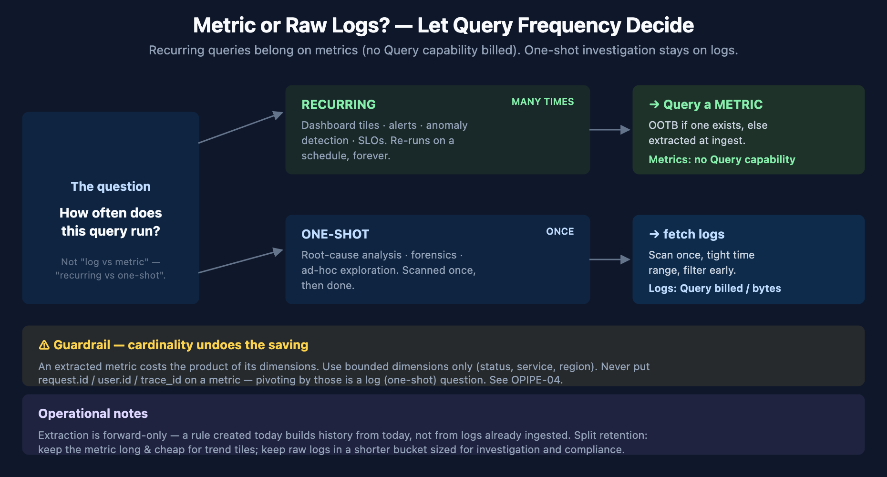

# FAQ-09: When Should I Query a Metric Instead of Raw Logs?

> **Series:** FAQ — Frequently Asked Questions | **Reference:** 09 — When to Query a Metric Instead of Raw Logs | **Created:** June 2026 | **Last Updated:** 07/07/2026

## Overview

Logs are where the detail lives — the exact line, the stack trace, the request that failed. But most of what teams build *on top of* logs isn't detail; it's a number over time: *how many errors per minute, what's the p95 of this endpoint, is the 5xx rate climbing.* Those questions get answered by running a `fetch logs` aggregation, and when that aggregation sits behind a dashboard tile or an alert, it runs again and again — every refresh, every evaluation interval, forever.

That is the optimization opportunity. In Dynatrace on Grail, **scanning logs is a billed activity** and **querying a metric effectively is not**. The same "errors per minute" answer costs real money when it re-scans logs on every dashboard render, and almost nothing when it reads a pre-aggregated metric. Out-of-the-box (OOTB) metrics already answer many of these questions; for the rest, you can extract a metric from the log stream once, at ingest, and point every recurring query at it instead.

This entry explains the economics behind that trade, gives you a one-question rule for deciding which to use, shows what's already available OOTB before you extract anything, and covers the two things that quietly undo the savings — cardinality and the fact that extraction doesn't backfill.

---

## Table of Contents

1. [Short Answer](#short-answer)
2. [Why This Matters — The DPS Query Economics](#economics)
3. [The Decision — Recurring vs. One-Shot](#decision)
4. [Use OOTB Metrics Before You Extract Anything](#ootb-first)
5. [Extracting a Metric From Logs](#extraction)
6. [Cardinality — The One Thing That Undoes the Savings](#cardinality)
7. [Extraction Is Forward-Only — and the Retention Split](#forward-only)
8. [Recommended Approach](#recommended-approach)
9. [Common Gotchas](#gotchas)

---

## Prerequisites

| Requirement | Details |
|-------------|---------|
| **Audience** | Platform engineers, SREs, and observability owners building dashboards, alerts, and SLOs on log data — and anyone watching DPS query consumption climb |
| **Format** | Decision-support document — explains the metric-vs-log-query trade and how to act on it; not a hands-on lab |
| **Deployment** | Dynatrace SaaS with Grail; Log Monitoring via OneAgent or OpenPipeline; DPS (Dynatrace Platform Subscription) licensing |
| **Related topic series** | OPLOGS-03 (OpenPipeline metric extraction from logs), OPLOGS-07 (analytics & dashboard queries), OPMIG-07 (metric & event extraction), OPIPE-03 (sampling-aware metrics from spans), OPIPE-04 (cardinality management), FINOPS-01 (querying DPS consumption), FINOPS-03 (Cut/Tune/Filter optimization), ORGNZ (bucket & retention strategy) |
| **Related FAQ** | FAQ-08 (how OneAgent decides which logs to collect — what's in the stream in the first place) |

<a id="short-answer"></a>
## 1. Short Answer

Ask one question of every log-based query: **how often does it run?**

| If the query runs… | Use | Because |
|--------------------|-----|---------|
| **Repeatedly** — dashboard tiles, alerts, anomaly detection, SLOs | A **metric** (OOTB if one exists, otherwise extracted from the log at ingest) | The aggregate is computed once at ingest and read cheaply thereafter |
| **Once** — root-cause analysis, forensic lookup, ad-hoc exploration | **Raw logs** (`fetch logs` with a tight time range and early filters) | You need the actual lines, and you only pay for the single scan |

The decision is *not* "logs are bad, metrics are good." Logs carry the detail you cannot get any other way. The decision is about **where a query lives**: a `fetch logs` aggregation behind a dashboard re-scans the same data on every render, while a metric behind that same tile reads a tiny pre-aggregated series. Move the *recurring aggregate* to a metric; keep the *raw stream* for investigation.

Two moves implement this:

1. **Reach for an OOTB metric first** (§4) — Dynatrace already produces service, host, process, and consumption metrics that teams frequently re-derive from logs by hand.
2. **Extract a metric from the log at ingest** (§5) — when no OOTB metric fits, an OpenPipeline metric-extraction rule turns "count of matching log records, by a few dimensions" into a first-class metric, computed once as the data arrives.

> <sub>**Sources:** [Parse log lines and extract a metric (DT docs)](https://docs.dynatrace.com/docs/platform/openpipeline/use-cases/tutorial-log-processing-pipeline), [DPS Log Management & Analytics (DT docs)](https://docs.dynatrace.com/docs/shortlink/dps-log-management). **Derived:** the "how often does it run" rule is an authoring synthesis of the DPS billing model (§2) — the docs describe the capabilities billed, not this decision heuristic.</sub>

<a id="economics"></a>
## 2. Why This Matters — The DPS Query Economics

Under DPS, each Grail data type is billed across distinct **capabilities**. The asymmetry that drives this whole entry is in the last column:

| Signal (powered by Grail) | Ingest & Process | Retain | **Query** |
|---|:---:|:---:|:---:|
| **Logs** | billed (bytes) | billed (bytes) | **billed (bytes scanned)** |
| **Events** | billed | billed | **billed** |
| **Traces** | billed | billed | **billed** |
| **Metrics** | billed (data points) | billed | **— no Query capability —** |

Logs, events, and traces each carry a **Query** capability: when you scan them with DQL, you consume billable bytes (over and above the query volume bundled into *Retain with Included Queries*). **Metrics have no Query capability at all** — they bill on ingest and retention, and reading them back with `timeseries` does not draw a separate query charge.

Now put that against how dashboards and alerts behave. A dashboard tile re-runs its query on every load and every auto-refresh. An alert or anomaly detector re-evaluates on a fixed interval, continuously, for as long as it exists. A `fetch logs` aggregation in either of those places pays the log **Query** cost *every single time*. The identical answer sourced from a metric pays it *never*.

This is why the move is almost pure upside for recurring workloads: you are not losing the log data (it still flows, still retained per your bucket policy) — you are removing the repeated scan. In the FINOPS-03 **Cut / Tune / Filter** framework this is a *Tune* lever: you keep the signal and change only the surface you query against.

The flip side keeps you honest: for a **one-shot investigation**, a single `fetch logs` scan is cheap and a metric can't show you the offending line. Don't pre-build metrics for questions you ask once.

> <sub>**Sources:** [DPS Log Management & Analytics (DT docs)](https://docs.dynatrace.com/docs/shortlink/dps-log-management), [DPS Metrics (DT docs)](https://docs.dynatrace.com/docs/shortlink/dps-metrics), [DPS Traces (DT docs)](https://docs.dynatrace.com/docs/shortlink/dps-traces). **Derived:** the "Metrics have no Query capability" contrast is read from comparing the billed-capability lists on the DPS Logs vs. DPS Metrics pages — neither page states the comparison; FINOPS-01 documents the same capability split from a live tenant.</sub>

<a id="decision"></a>
## 3. The Decision — Recurring vs. One-Shot



<!-- MARKDOWN_TABLE_ALTERNATIVE
| Question | Branch | Use | Cost behavior |
|----------|--------|-----|---------------|
| How often does this query run? | Recurring — dashboards / alerts / SLOs | Query a METRIC (OOTB or extracted) | Metrics: Ingest + Retain only, NO Query capability |
| How often does this query run? | One-shot — RCA / forensics / ad-hoc | fetch logs (scan once, tight time range) | Logs: Query capability billed per bytes scanned |
| Guardrail | Extract at ingest via OpenPipeline | Bounded dimensions only | Cardinality = product of dimensions; never request/user/trace IDs |
| Note | Extraction is forward-only | Split retention | Metrics long & cheap; raw logs short |
-->

The same answer takes two very different cost paths depending on where the query lives:

```dql
// RECURRING — dashboard tile or alert. Reads a pre-aggregated metric.
// No log Query capability consumed.
timeseries sum(log.http.requests), from:-24h, by:{status}
```

```dql
// ONE-SHOT — root-cause investigation. Scans the raw log stream once.
// Billed on bytes scanned, so keep the window tight and filter early.
fetch logs, from:-1h
| filter k8s.namespace.name == "prod" and loglevel == "ERROR"
| summarize errors = count(), by:{dt.entity.host}
```

The first query is what belongs behind a tile that thousands of people load and a detector that fires every minute. The second is what you run when something broke and you need to see it. Both are correct — for their job. The anti-pattern is putting the *second* shape behind a dashboard, where it quietly re-scans logs forever.

A quick test for any existing tile or alert: **if its query has a `fetch logs … | summarize` shape and it lives somewhere that re-runs on a schedule, it's a candidate to move to a metric.**

> <sub>**Sources:** [makeTimeseries (DT docs)](https://docs.dynatrace.com/docs/platform/grail/dynatrace-query-language/commands/aggregation-commands), [Aggregation functions (DT docs)](https://docs.dynatrace.com/docs/platform/grail/dynatrace-query-language/functions/aggregation-functions), [Parse log lines and extract a metric (DT docs)](https://docs.dynatrace.com/docs/platform/openpipeline/use-cases/tutorial-log-processing-pipeline). OPLOGS-07 covers the dashboard-query patterns in depth.</sub>

<a id="ootb-first"></a>
## 4. Use OOTB Metrics Before You Extract Anything

Before building an extraction rule, check whether Dynatrace already produces the metric. Teams routinely re-derive from logs numbers the platform emits for free:

| You want… | Often re-derived from logs as… | OOTB metric already exists |
|-----------|-------------------------------|----------------------------|
| Request throughput / error rate / latency | Counting request/error log lines | **Service RED metrics** — the `builtin:service.*` family (request count, failure rate, response time) from OneAgent-instrumented services |
| Host CPU / memory / disk | Parsing agent or OS logs | `dt.host.cpu.usage`, `dt.host.memory.usage`, and the `dt.host.*` family |
| Process resource use | Parsing process logs | The `dt.process.*` family |
| Log volume / ingest cost | `fetch logs \| summarize count()` over a long window | DPS consumption metrics (the `dt.billing.*` / `dt.system.events` surfaces — see FINOPS-01) |
| Did this log source stop sending? | Counting recent records | `log.source.file_status` / `log.source.ingest_status` (see FAQ-08) |

**How to check:** open the metric browser / **Data explorer** and search the entity or domain before writing a pipeline rule. If an OOTB metric answers the question, you're done — zero extraction config, zero added cardinality, and it already has historical depth.

Exact metric keys vary by Dynatrace version and by what's deployed in your tenant — confirm the key in your own metric browser rather than assuming it. The point stands regardless of the precise key: **the cheapest extraction is the one you don't have to do because the metric already exists.**

> <sub>**Sources:** [Built-in metrics / metric browser (DT docs)](https://docs.dynatrace.com/docs/analyze-explore-automate/metrics), [DPS Metrics (DT docs)](https://docs.dynatrace.com/docs/shortlink/dps-metrics). FINOPS-01 documents the DPS consumption metric surfaces; FAQ-08 documents the `log.source.*` fields. **Derived:** the "re-derived from logs" column is a synthesis of common practice — the docs list the metrics, not the log-based work they replace.</sub>

<a id="extraction"></a>
## 5. Extracting a Metric From Logs

When no OOTB metric fits — a business count, an application-specific status, a value embedded in a log line — extract one at ingest with an **OpenPipeline metric-extraction processor**. The aggregate is computed once, as records arrive, and stored as a metric you then query cheaply forever.

```yaml
# OpenPipeline log pipeline — metric-extraction processor
- name: extract-request-metric
  type: metric
  enabled: true
  condition: contains(content, "duration=")
  metricKey: log.request.duration      # becomes a first-class metric
  dimensions:
    - service: k8s.namespace.name      # bounded, low-cardinality
    - method: extracted_method
    - status: extracted_status
  value: extracted_duration_ms         # omit to count matching records
```

Common shapes:

| Question | Metric | Dimensions |
|----------|--------|------------|
| How many requests, by outcome? | `log.request.count` (count of matches) | service, method, status |
| What's the latency distribution? | `log.request.duration` (extract numeric field) | service, endpoint |
| How many of business event X? | `log.business.<event>.count` | a few business dimensions |

A few framing points:

- **OpenPipeline is the modern path.** Classic Log Monitoring also supports log-metric definitions; new work should use OpenPipeline metric extraction. See **OPLOGS-03 §3** for the full processor walkthrough and **OPMIG-07** for the metric-&-event-extraction deep dive.
- **Log-derived metrics are exact, not sampled.** Span-derived metrics must be made *sampling-aware* because only a fraction of spans are kept (**OPIPE-03**); logs aren't head/tail-sampled, so a count extracted from logs reflects every matching record.
- **Count vs. value.** Omit `value` to count matching records; set it to a parsed numeric field to track a measurement. Parse the field first (DPL) so the value and dimensions exist on the record when the metric processor runs.

> <sub>**Sources:** [Parse log lines and extract a metric (DT docs)](https://docs.dynatrace.com/docs/platform/openpipeline/use-cases/tutorial-log-processing-pipeline), [Processing in OpenPipeline (DT docs)](https://docs.dynatrace.com/docs/platform/openpipeline/concepts/processing), [Dynatrace Pattern Language (DT docs)](https://docs.dynatrace.com/docs/platform/grail/dynatrace-pattern-language). OPLOGS-03, OPMIG-07, and OPIPE-03 carry the implementation depth.</sub>

<a id="cardinality"></a>
## 6. Cardinality — The One Thing That Undoes the Savings

A metric's cost scales with its **cardinality**: the number of unique dimension-value combinations it produces. Cardinality is the **product** of its dimensions' distinct values:

```
data points ≈ (distinct services) × (distinct methods) × (distinct statuses) × …
```

Three bounded dimensions (say 40 services × 5 methods × 6 statuses = 1,200 series) is cheap and useful. Add one **unbounded** dimension — `request.id`, `user.id`, `trace_id`, a raw URL with query strings — and the product explodes into the millions. At that point you've traded an expensive log query for an expensive metric, which is worse: you pay continuously and the metric is unusable.

Guardrails:

- **Only bounded dimensions on extracted metrics:** status code, service, method, region, environment, log level. These have a small, stable set of values.
- **Never** put per-request or per-user identifiers on a metric. If you need to pivot by them, that's a *log* question (one-shot, §3) — or a trace.
- **Reduce before you extract:** normalize URLs to route templates, bucket numeric values, drop the noisy dimension at the parse step so it never reaches the metric processor.

This is the single most common way a log-to-metric optimization backfires, and it has the same root cause every time: a high-cardinality label that someone added "just in case." **OPIPE-04 (Cardinality Management)** covers the controls in depth; **FINOPS-03 §9** walks a worked high-cardinality-metric remediation.

> <sub>**Sources:** [DPS Metrics (DT docs)](https://docs.dynatrace.com/docs/shortlink/dps-metrics), [Parse log lines and extract a metric (DT docs)](https://docs.dynatrace.com/docs/platform/openpipeline/use-cases/tutorial-log-processing-pipeline). OPIPE-04 and FINOPS-03 carry the cardinality-control patterns. **Derived:** the cross-product cost model is standard dimensional-metric behavior applied to log-extracted metrics.</sub>

<a id="forward-only"></a>
## 7. Extraction Is Forward-Only — and the Retention Split

Two operational facts shape how you roll this out.

**Extraction is forward-only.** An OpenPipeline metric-extraction rule acts on records *as they arrive*. A rule you create today begins producing its metric from today — it does **not** retroactively manufacture metric history from logs already ingested. Practical consequences:

- Stand up the extraction rule **before** you need the trend, not the day you build the dashboard.
- For the gap, query the raw logs directly (a one-shot scan over the historical window) until the metric accumulates enough depth.
- When migrating an existing dashboard from logs to a metric, run both in parallel for a bit and cut over once the metric's history covers your default dashboard window.

**Split the retention.** Once the recurring questions are answered by a metric, the raw logs no longer need to live long *for those questions*:

- Keep the **metric** retained long — it's small and cheap, so multi-month trend tiles stay inexpensive.
- Keep the **raw logs** in a shorter-retention bucket sized for investigation and compliance, not for powering dashboards.

That split is where the saving compounds: long-horizon dashboards read the cheap long-lived metric, while the expensive raw logs age out on a short clock. Bucket and retention design lives in the **ORGNZ** series; retention as a cost lever is **FINOPS-03 §4 (Tune)**.

> <sub>**Sources:** [Parse log lines and extract a metric (DT docs)](https://docs.dynatrace.com/docs/platform/openpipeline/use-cases/tutorial-log-processing-pipeline), [DPS Log Management & Analytics (DT docs)](https://docs.dynatrace.com/docs/shortlink/dps-log-management). ORGNZ covers bucket/retention design; FINOPS-03 covers retention tuning. **Derived:** the "forward-only" property follows from OpenPipeline processing at ingest time; the retention-split recommendation synthesizes the bucket model with the per-capability billing in §2.</sub>

<a id="recommended-approach"></a>
## 8. Recommended Approach

1. **Inventory the recurring log queries.** List the dashboard tiles, alerts, anomaly detectors, and SLOs whose queries have a `fetch logs … | summarize` shape. These are your candidates — they pay the log Query cost on every run.
2. **Check for an OOTB metric first (§4).** Search the metric browser for the service, host, process, or consumption metric that already answers the question. If it exists, repoint the tile/alert and you're done.
3. **Extract a metric for the rest (§5).** Build an OpenPipeline metric-extraction rule with a clear `metricKey` and a small set of **bounded** dimensions. Parse any needed value/dimension fields earlier in the pipeline.
4. **Hold the line on cardinality (§6).** No per-request, per-user, or per-trace dimensions. Sanity-check the dimension cross-product before enabling.
5. **Cut over forward, not backward (§7).** Enable the rule, let the metric accumulate, then migrate the tile/alert. Keep raw-log access for the historical gap and for investigation.
6. **Split retention (§7).** Retain the metric long; shorten the raw-log bucket to what investigation and compliance actually need.
7. **Keep raw logs for what they're for.** Root-cause analysis, forensics, and ad-hoc exploration stay on `fetch logs` with tight time ranges and early filters — that's the one-shot path, and it's cheap.
8. **Measure the result.** Use FINOPS-01's query-side consumption queries to confirm log Query consumption dropped after the cutover.

<a id="gotchas"></a>
## 9. Common Gotchas

| Symptom | Likely cause | Where |
|---------|--------------|-------|
| Log Query consumption keeps climbing | A dashboard/alert still runs `fetch logs \| summarize` on a schedule | §2, §3 |
| New extracted metric has no history | Extraction is forward-only — it doesn't backfill old logs | §7 |
| Extracted metric is expensive / unusable | An unbounded dimension (request/user/trace ID) blew up cardinality | §6 |
| "I lost the detail when I switched to a metric" | Metrics answer *how many/how fast*, not *which line* — keep raw logs for the detail | §1, §3 |
| Built a metric that already existed OOTB | Skipped the metric-browser check before extracting | §4 |
| Span-extracted metric undercounts vs. logs | Spans are sampled; make span metrics sampling-aware (log metrics aren't sampled) | §5, OPIPE-03 |
| Trend tile still slow/costly over long windows | Raw logs retained long for dashboards instead of the cheap metric | §7 |
| Dashboard cutover broke during the gap | Migrated before the metric had enough history | §7 |

> <sub>**Sources:** [Parse log lines and extract a metric (DT docs)](https://docs.dynatrace.com/docs/platform/openpipeline/use-cases/tutorial-log-processing-pipeline), [DPS Log Management & Analytics (DT docs)](https://docs.dynatrace.com/docs/shortlink/dps-log-management), [DPS Metrics (DT docs)](https://docs.dynatrace.com/docs/shortlink/dps-metrics) — each row maps to the capability, rule, or constraint cited in the referenced section.</sub>

---

> <sub>**⚠️ Disclaimer:** This content is AI-generated, community-driven, and **not supported by Dynatrace**. DPS capabilities, billed units, and OpenPipeline behavior evolve across releases — always verify the current billing model and metric-extraction mechanics against the [Dynatrace documentation](https://docs.dynatrace.com/docs) and your own tenant before relying on a specific cost claim.</sub>
