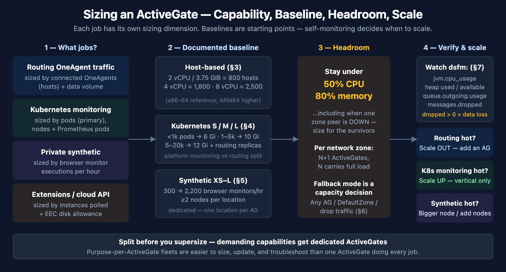

# FAQ-10: How Do I Size and Scale ActiveGates?

> **Series:** FAQ — Frequently Asked Questions | **Reference:** 10 — ActiveGate Sizing and Scaling | **Created:** July 2026 | **Last Updated:** 07/07/2026

## Overview

"How big should my ActiveGate be?" is really three questions wearing one coat: **what jobs** will this ActiveGate do, **how much volume** does each job carry, and **how much headroom** do you need for failover and growth. Dynatrace publishes baseline sizing for each job — but the numbers live on different documentation pages (host-based routing, containerized Kubernetes monitoring, private synthetic locations), and none of them tells you when an ActiveGate you already run has outgrown its size.

This entry consolidates the decision: which dimension drives sizing for each ActiveGate capability, the current documented baselines for host-based, containerized, and synthetic-enabled ActiveGates, how high availability and network zones change the math, and — the part teams most often skip — the `dt.sfm.active_gate.*` self-monitoring metrics that tell you an ActiveGate is saturating *before* data starts dropping.

Deployment mechanics stay with their owning series: ONBRD-03 (installing and deploying ActiveGates), the K8S series (DynaKube and containerized ActiveGates), SYNTH (private synthetic locations), and FAQ-05 (managing ActiveGate updates). This entry owns the sizing decision itself.

---

## Table of Contents

1. [Short Answer](#short-answer)
2. [What Drives ActiveGate Load](#load-drivers)
3. [Baseline Sizing — Host-Based ActiveGates](#host-sizing)
4. [Sizing Containerized ActiveGates on Kubernetes](#k8s-sizing)
5. [Synthetic-Enabled ActiveGates](#synthetic-sizing)
6. [High Availability, Network Zones, and Placement](#ha-placement)
7. [Detecting Saturation — Self-Monitoring Signals](#saturation)
8. [Scale Up or Scale Out?](#scale-up-or-out)
9. [Recommended Approach](#recommended-approach)
10. [Common Gotchas](#gotchas)

---

## Prerequisites

| Requirement | Details |
|-------------|---------|
| **Audience** | Platform engineers, Dynatrace administrators, and architects planning or operating ActiveGate fleets |
| **Format** | Decision-support document — consolidates sizing baselines and scaling signals; not a hands-on installation lab |
| **Deployment** | Dynatrace SaaS; Environment ActiveGates (host-based and/or containerized) |
| **Related topic series** | ONBRD-03 (deploying ActiveGate — installation, groups, example deployment), K8S (DynaKube and containerized ActiveGate mechanics), SYNTH-04 (private synthetic locations), M2S-03 / S2S-04 (ActiveGate design during migration) |
| **Related FAQ** | FAQ-05 (managing ActiveGate updates on SaaS — roles, sequencing, update rings) |

<a id="short-answer"></a>
## 1. Short Answer

Size an ActiveGate in three steps:

1. **Decide what the ActiveGate will do.** Each capability has its own sizing dimension — you cannot size an ActiveGate without knowing its job list, and demanding capabilities (synthetic, Kubernetes platform monitoring) deserve dedicated ActiveGates rather than sharing one box.
2. **Start from the documented baseline for that dimension.** Hosts routed → the host-based tables (§3). Pods monitored → the Kubernetes S/M/L scenarios (§4). Browser monitors per hour → the synthetic node sizes (§5).
3. **Provision headroom and verify with self-monitoring.** Dynatrace's guidance is that the ActiveGate machine *"should not exceed 50% CPU and 80% memory"* — treat those as your alert thresholds, watch the self-monitoring metrics (§7), and scale out for routing or up for Kubernetes monitoring when you approach them (§8).

The capability-to-dimension map:

| ActiveGate job | What drives its sizing | Baseline |
|----------------|------------------------|----------|
| **Routing OneAgent traffic** | Number of connected OneAgents (hosts) and their data volume | §3 |
| **Kubernetes monitoring** | Pod count (primary), node count (secondary), Prometheus-annotated pods | §4 |
| **Cloud & remote API monitoring** (AWS, Azure, VMware, SNMP, Prometheus…) | Number of monitored endpoints/entities polled per cycle | §3 + extension notes |
| **Extensions (EEC)** | Extension instances and monitored devices; adds disk requirements | §3 |
| **Private synthetic** | Browser monitors per hour (HTTP monitors are far cheaper) | §5 |
| **z/OS routing** | Mainframe traffic via the zRemote module | Size with Dynatrace guidance for your mainframe volume |

One rule sits above all the tables: **sizing numbers are starting points, not guarantees.** Actual capacity depends on your data volume per host, extension mix, and network — which is why §7 (measuring the real utilization) is part of sizing, not an afterthought.

> **Scope — Dynatrace SaaS.** This entry covers **Environment ActiveGates on SaaS**. On Dynatrace Managed the Environment-ActiveGate baselines broadly transfer (same machines, same jobs), but Managed adds two sizing domains this entry deliberately doesn't cover — **Cluster ActiveGates** (the on-premise clustering component) and the sizing of the Managed cluster nodes themselves — and §7's Grail-native `dt.sfm.*` metrics aren't available there, leaving the classic `dsfm:` family as the self-monitoring surface. If you're consolidating from Managed to SaaS, the M2S series owns that journey.

> <sub>**Sources:** [Linux ActiveGate hardware and system requirements (DT docs)](https://docs.dynatrace.com/docs/ingest-from/dynatrace-activegate/installation/linux/linux-activegate-hardware-and-system-requirements), [Dynatrace ActiveGate (DT docs)](https://docs.dynatrace.com/docs/ingest-from/dynatrace-activegate) — incl. the Environment vs Cluster ActiveGate split. **Derived:** the three-step framing and the capability-to-dimension map synthesize the per-capability sizing pages cited throughout this entry; the Managed scope note combines the hub's ActiveGate-type split with §7's Grail-bucket residency (Managed environments don't include Grail).</sub>

<a id="load-drivers"></a>
## 2. What Drives ActiveGate Load



<!-- MARKDOWN_TABLE_ALTERNATIVE
| Step | Question | Output |
|------|----------|--------|
| 1 — Capability | What jobs does this ActiveGate do? | Routing → OneAgent count; K8s monitoring → pods; Synthetic → monitors/hr; Extensions → instances |
| 2 — Baseline | Which documented table applies? | Host-based (§3), Kubernetes S/M/L (§4), Synthetic XS–L (§5) |
| 3 — Headroom | Does the size hold at ≤50% CPU / ≤80% memory — including when a peer AG is down? | HA-adjusted size per zone |
| 4 — Verify & scale | What do the self-monitoring metrics say? | Scale OUT (routing) or UP (K8s platform monitoring) on saturation signals |
-->

The ActiveGate hub enumerates its jobs: routing OneAgent traffic as a secure proxy, monitoring cloud environments and remote technologies via API (AWS, VMware, Azure, Kubernetes, OpenShift, Google Cloud, SNMP, Prometheus, and more), running synthetic monitors from private locations, routing z/OS traffic, and providing Dynatrace API access. Each job consumes a different resource profile:

- **Routing** is network- and CPU-bound: load scales with the number of OneAgents connected and the volume of data they send. Memory matters for the outgoing message queue when the uplink is slow.
- **Kubernetes monitoring** is memory- and CPU-bound on the *monitored workload count*: Dynatrace's Kubernetes sizing guide is explicit that consumption *"scales with the number of pods primarily due to increased data processing and storage needs,"* with node count a secondary driver and Prometheus metric collection adding CPU as annotated-pod counts rise.
- **Extensions (EEC)** add per-instance polling work plus disk: the Extension Execution Controller wants ~2.1 GB of free disk for its persistence mechanism, and the extensions module claims its own installation and log/cache space.
- **Synthetic** is the most demanding per unit of work — real browsers rendering real pages. Dynatrace states plainly that *"a Synthetic-enabled ActiveGate has more demanding hardware and system requirements than a regular Environment or Cluster ActiveGate."*

Two placement consequences follow. First, Dynatrace recommends a **dedicated system**: running ActiveGate alone on its machine is both a performance and a security recommendation. Second, **don't stack demanding capabilities on one ActiveGate** — the Kubernetes guide's recommended production pattern is itself a split (one ActiveGate for platform monitoring, separate replicas for OneAgent routing, §4), and synthetic locations can't share an ActiveGate with other locations at all (§5). A routing-only ActiveGate plus purpose-built ActiveGates for heavy jobs is easier to size, easier to diagnose, and safer to update (FAQ-05's update-ring guidance assumes the same separation).

> <sub>**Sources:** [Dynatrace ActiveGate (DT docs)](https://docs.dynatrace.com/docs/ingest-from/dynatrace-activegate), [Sizing guide for ActiveGates in the Kubernetes monitoring use-case (DT docs)](https://docs.dynatrace.com/docs/ingest-from/setup-on-k8s/guides/deployment-and-configuration/resource-management/ag-resource-limits), [Requirements for private Synthetic locations (DT docs)](https://docs.dynatrace.com/docs/observe/digital-experience/synthetic-monitoring/private-synthetic-locations/system-and-hardware-requirements-for-private-synthetic), [Linux ActiveGate hardware and system requirements (DT docs)](https://docs.dynatrace.com/docs/ingest-from/dynatrace-activegate/installation/linux/linux-activegate-hardware-and-system-requirements). **Derived:** the per-capability resource-profile characterizations combine the cited sizing drivers with the deployment-separation recommendations.</sub>

<a id="host-sizing"></a>
## 3. Baseline Sizing — Host-Based ActiveGates

**Minimums** (routing/monitoring ActiveGate): 2 GB RAM (4 GB recommended), one dual-core processor, 4 GB free disk for installation/configuration/logs plus 4 GB for cached OneAgent installers and container images if the ActiveGate serves them.

**Capacity by machine size.** Dynatrace publishes estimated host counts per reference instance size, and the machine *"should not exceed 50% CPU and 80% memory"* in steady state:

| Architecture | Reference instance | vCPU | RAM (GiB) | Estimated hosts routed |
|--------------|-------------------|------|-----------|------------------------|
| x86-64 | c6i.large | 2 | 3.75 | ~800 |
| x86-64 | c6i.xlarge | 4 | 7.5 | ~1,800 |
| x86-64 | c6i.2xlarge | 8 | 15 | ~2,500 |
| ARM64 | c7g.large | 2 | 3.75 | ~1,300 |
| ARM64 | c7g.xlarge | 4 | 7.5 | ~2,700 |
| ARM64 | c7g.2xlarge | 8 | 15 | ~5,500 |
| s390 | S | 2 | 4 | ~800 |
| s390 | M | 4 | 8 | ~1,500 |

Reading the table honestly: the reference points are AWS instance shapes, so for on-premises VMs map by vCPU/RAM, and treat "estimated hosts" as exactly that — an estimate at typical per-host data volume. Hosts running chatty workloads (heavy log routing through the ActiveGate, dense process instrumentation) consume capacity faster.

**Disk beyond the minimums.** The requirements page itemizes where space goes — installation (~600 MB executables), logs (1.2 GB), auto-update downloads (600 MB), temporary files (4 GB) — and Environment ActiveGates running extensions add ~1.2 GB for the extensions module plus 2 GB for its logs/cache. If extension-data persistence is enabled, the EEC wants a further *"2136 MB of free disk space: 600 MB for reliability mechanism, 1.5 GB as buffer"* — without it, persistence disables itself. A practical floor for an extensions-running ActiveGate is ~15 GB of free disk; disk is cheap, resizing later is not.

Windows ActiveGates follow the same sizing model with their own OS-support matrix — see the Windows requirements page alongside the Linux one.


> **Update (SaaS 1.343, July 2026):** Dynatrace published official **sizing guides for Environment ActiveGates** with capacity recommendations specifically for **log ingestion** infrastructure, plus an upgraded **log ingest monitoring dashboard** covering OneAgent modules and Environment ActiveGate. If your AG fleet fronts log ingestion, size against those guides first — they postdate (and refine) the general host-based baselines in this section for that workload.

> <sub>**Sources:** [Linux ActiveGate hardware and system requirements (DT docs)](https://docs.dynatrace.com/docs/ingest-from/dynatrace-activegate/installation/linux/linux-activegate-hardware-and-system-requirements) — sizing tables, 50%/80% guideline, disk itemization, and EEC persistence figures quoted from this page. **Derived:** the ~15 GB practical disk floor sums the itemized directories with growth margin; the "chatty workloads consume capacity faster" caveat generalizes the per-host-volume dependency the docs imply but don't quantify.</sub>

<a id="k8s-sizing"></a>
## 4. Sizing Containerized ActiveGates on Kubernetes

Containerized ActiveGates (deployed via DynaKube — mechanics in the K8S series) size against the **monitored cluster's workload count**, not host counts. Dynatrace's Kubernetes sizing guide sets three scenarios:

| Scenario | Pods monitored | CPU request | CPU limit | Memory request = limit |
|----------|---------------|-------------|-----------|------------------------|
| **S** | < 1,000 | 200m | 1000m | 6 Gi |
| **M** | 1,000–5,000 | 1000m | 2000m | 10 Gi |
| **L** | 5,000–20,000 | 2000m | 4000m | 12 Gi |

Operational notes straight from the guide:

- **Prefer no CPU limits** where cluster policy allows — throttling an ActiveGate delays its processing pipeline.
- **One ActiveGate per cluster.** A single ActiveGate *can* monitor multiple clusters, but the guide marks that pattern **not recommended**.
- **Split platform monitoring from routing** for production application-observability clusters: a Kubernetes-monitoring ActiveGate (scales **vertically only** — the table above) plus a separate routing ActiveGate deployment for OneAgent traffic that scales **horizontally**:

| Pods | Routing CPU request/limit | Memory request = limit | Replicas |
|------|---------------------------|------------------------|----------|
| < 1,000 | 250m / 1000m | 2 Gi | 3 |
| 1,000–5,000 | 500m / 2000m | 4 Gi | 3 |
| 5,000–20,000 | 1000m / 4000m | 6 Gi | 6 |

The guide also publishes its own health thresholds — effectively the containerized version of §7: raise the CPU request when usage exceeds **85%** of it or CPU throttling exceeds **10%**; raise the memory request when the working set passes **80%**; and treat a Kubernetes-monitoring pipeline execution time beyond **50–60 seconds** as a CPU-shortage signal.

> <sub>**Sources:** [Sizing guide for ActiveGates in the Kubernetes monitoring use-case (DT docs)](https://docs.dynatrace.com/docs/ingest-from/setup-on-k8s/guides/deployment-and-configuration/resource-management/ag-resource-limits) — scenario tables, replica counts, no-CPU-limit preference, single-cluster recommendation, and health thresholds are all from this page.</sub>

<a id="synthetic-sizing"></a>
## 5. Synthetic-Enabled ActiveGates

Synthetic is the one capability where the sizing unit is **work per hour**, and where Dynatrace publishes discrete node sizes. All sizes below sustain up to ~300k HTTP monitor executions per hour — the browser-monitor column is what separates them, because each browser monitor drives a real browser:

| Node size | vCPU | RAM | Free disk | Max browser monitors/hr |
|-----------|------|-----|-----------|-------------------------|
| **XS** | 2 | 4 GB | 20 GB | 300 |
| **S** | 4 | 8 GB | 25 GB | 650 |
| **M** | 8 | 16 GB | 30 GB | 1,200 |
| **L** | 16 | 32 GB | 40 GB | 2,200 |

Planning rules that change the architecture, not just the size:

- **Dedicate the ActiveGate.** Synthetic-enabled ActiveGates are *"more demanding"* than routing ActiveGates, support a narrower OS matrix, and *"you can't use one ActiveGate for multiple locations"* — so a synthetic node does synthetic, for exactly one location.
- **At least two nodes per location.** Dynatrace: *"We recommend using at least two ActiveGates for a location. Additional ActiveGates are used for failover and load balancing."* Size the location so the monitor schedule still fits if one node is down.
- **Budget by the browser column.** Convert your monitor plan to executions/hour (monitors × frequency × steps where relevant) and pick the node size with comfortable margin — then scale the *location* by adding nodes rather than pushing one node to its ceiling.

Deployment and location design live in SYNTH-04; containerized synthetic locations on Kubernetes have their own requirements page.

> <sub>**Sources:** [Requirements for private Synthetic locations (DT docs)](https://docs.dynatrace.com/docs/observe/digital-experience/synthetic-monitoring/private-synthetic-locations/system-and-hardware-requirements-for-private-synthetic) — node-size table quoted; [Private Synthetic locations (DT docs)](https://docs.dynatrace.com/docs/observe/digital-experience/synthetic-on-grail/synthetic-app/private-locations) — two-node recommendation and one-location-per-ActiveGate constraint quoted. **Derived:** the executions-per-hour budgeting recipe operationalizes the published per-node ceilings.</sub>

<a id="ha-placement"></a>
## 6. High Availability, Network Zones, and Placement

Sizing an individual ActiveGate is half the job; the other half is sizing the **group of ActiveGates a zone can fail over across**.

**How failover works.** Network zones *"prevent inefficient connections by defining the ActiveGate that each OneAgent should use."* When no ActiveGate in the primary zone is reachable, OneAgents try the zone's configured **alternative zones**, then behave per the zone's **fallback mode**: *Any ActiveGate* (default — traffic routes to any available ActiveGate), *Only DefaultZone*, or *None (drop traffic)*. Two sizing consequences:

- **Survivor capacity is the real requirement.** If a zone runs two ActiveGates at 45% CPU each and one dies, the survivor takes (roughly) the full load — past the 50% guideline and climbing. In community practice the working rule is **N+1 per zone, where N alone can carry the zone's whole load at ≤50% CPU** — the docs define the failover mechanics but don't publish a per-zone count; verify the headroom against your own self-monitoring numbers (§7).
- **Fallback mode is a capacity decision, not just a security one.** *Any ActiveGate* means a zone failure silently lands its load on ActiveGates you sized for other zones. *None (drop traffic)* protects the fleet but drops data. Pick deliberately, and if you rely on alternative zones, make sure those ActiveGates are both **reachable** from the primary zone's OneAgents (a documented requirement) and **sized** to absorb the addition.

**Placement basics** (depth in ONBRD-03 and M2S-03): one or more ActiveGates per network zone/datacenter close to the OneAgents they serve; ActiveGate **groups** to control which ActiveGates handle which purpose; and remember that a proxy or firewall between OneAgents and the ActiveGate shapes effective throughput as much as the machine size does.

> <sub>**Sources:** [Get started with network zones (DT docs)](https://docs.dynatrace.com/docs/manage/network-zones/network-zones-basic-info) — failover behavior, alternative zones, fallback modes, and the reachability requirement; [Linux ActiveGate hardware and system requirements (DT docs)](https://docs.dynatrace.com/docs/ingest-from/dynatrace-activegate/installation/linux/linux-activegate-hardware-and-system-requirements) — the 50% CPU guideline the survivor math builds on. **Derived:** the survivor-capacity rule and N+1 guidance are community practice composed from the documented failover model plus the headroom guideline.</sub>

<a id="saturation"></a>
## 7. Detecting Saturation — Self-Monitoring Signals

Every SaaS and Managed environment ships ActiveGate **self-monitoring metrics** — no setup required. They exist on two surfaces: a Grail-native **Gen3** family, `dt.sfm.active_gate.*`, and a classic **Gen2** family, `dsfm:active_gate.*` (covered at the end of this section). This entry works in the Gen3 namespace throughout — it is what Dynatrace's own diagnostic dashboard queries, it lives in Grail metric buckets (`dt_system_metrics` / `default_metrics`) where DQL `timeseries` reaches it directly, and every key carries fleet-slicing dimensions (`dt.active_gate.id`, `host.name`, `dt.active_gate.group.name`, `dt.network_zone.id`). Four signals, watched per ActiveGate, answer "is this ActiveGate the right size" continuously:

| Metric | What it tells you | Act when |
|--------|-------------------|----------|
| `dt.sfm.active_gate.jvm.cpu_usage` | ActiveGate Java process CPU | Sustained peaks above the **50%** guideline |
| `dt.sfm.active_gate.jvm.heap_memory_used` / `…_available` | Heap pressure | Used/available ratio trending past **80%** |
| `dt.sfm.active_gate.communication.queue.outgoing.usage` | Messages queued faster than they're being sent out | Queue grows and doesn't drain |
| `dt.sfm.active_gate.communication.messages.dropped` | Messages dropped — data loss | **Any** non-zero value |

`dt.sfm.active_gate.communication.agent_modules.connected` rounds out the picture by showing how OneAgent load is actually distributed across the fleet.

```dql
// ActiveGates whose JVM CPU peaked above the 50% headroom guideline (24h)
timeseries cpu = avg(dt.sfm.active_gate.jvm.cpu_usage), from:-24h, by:{dt.active_gate.id, host.name}
| fieldsAdd peak = arrayMax(cpu)
| filter peak > 50
| sort peak desc
```

```dql
// Heap utilization per ActiveGate — compare against the 80% memory guideline
timeseries { used = avg(dt.sfm.active_gate.jvm.heap_memory_used), available = avg(dt.sfm.active_gate.jvm.heap_memory_available) }, from:-24h, by:{dt.active_gate.id, host.name}
| fieldsAdd heap_used_pct = round(arrayAvg(used) / arrayAvg(available) * 100, decimals: 1)
| fieldsRemove used, available
| sort heap_used_pct desc
```

```dql
// Backpressure check — growing outgoing queue or any dropped messages (7d)
// default: 0 because drop metrics are sparse — they only report when drops occur
timeseries { queued = avg(dt.sfm.active_gate.communication.queue.outgoing.usage), dropped = sum(dt.sfm.active_gate.communication.messages.dropped, default: 0) }, from:-7d, by:{dt.active_gate.id, host.name}, union:true
| fieldsAdd total_dropped = arraySum(dropped), avg_queue = round(arrayAvg(queued), decimals: 0)
| filter total_dropped > 0 OR avg_queue > 0
| sort total_dropped desc
```

```dql
// How OneAgent load is distributed across the fleet, per zone (24h)
timeseries agents = avg(dt.sfm.active_gate.communication.agent_modules.connected), from:-24h, by:{dt.active_gate.id, host.name, dt.network_zone.id}
| fieldsAdd avg_connected = round(arrayAvg(agents), decimals: 0), network_zone = if(isNull(dt.network_zone.id), "default", else: dt.network_zone.id)
| fieldsRemove dt.network_zone.id
| sort avg_connected desc
```

Wire the first three into anomaly-detection or a scheduled workflow (the ALERT and WFLOW series own the routing patterns) so a saturating ActiveGate pages someone before `messages.dropped` goes non-zero. For containerized ActiveGates, layer on the Kubernetes-native thresholds from §4 (CPU >85% of request, throttling >10%, working set >80%, pipeline >50–60 s).

### The full catalog — and the ready-made diagnostic dashboard

The namespace goes far beyond the four core signals, and it is exactly what Dynatrace's own **"ActiveGate diagnostic overview" dashboard** is built on (the dashboard ships with the Discovery & Coverage app, per its own footer) — so before hand-building saturation tiles, open or import that dashboard: it already covers host vitals, the Java process, networking, and REST API health, with per-zone/group/instance filtering.

A live-tenant enumeration (July 2026) shows ~53 keys in the namespace. By area:

| Area | Metrics | Notable dimensions / use |
|------|---------|--------------------------|
| **Host vitals** | `system.cpu_usage`, `system.total_memory` / `system.free_memory`, `storage.volume.free` / `.total` | `volume` |
| **Java process** | `jvm.cpu_usage`, `jvm.heap_memory_used` / `_available`, `jvm.gc.major_collection_time`, `thread_pool.busy_threads` / `thread_pool.queue_size` | `thread_pool_name` |
| **Networking** | `communication.messages.dropped` / `.rejected` / `.resent`, `communication.agent_modules.connected`, `traffic.server.sent` / `.received` (clients ↔ AG), `traffic.client.sent` / `.received` (AG ↔ Dynatrace) | zone / group / instance |
| **Event ingest** | `event_ingest.event_incoming_count`, `.drop_count`, `.event_otlp_size` / `.event_json_size`, attribute counters | `operation`, `drop_reason` — incoming_count is the denominator that turns drops into a **drop rate** |
| **Metrics ingest** | `metrics.ingest.otlp.datapoints.received.total` vs `.accepted`, `metrics.ingest.grail.datapoints.accepted` | received minus accepted = OTLP metric datapoints rejected on the way in |
| **REST API** | `rest.request_count`, `rest.request_size` / `response_size`, `rest.response_time` | `operation`, `response_code` |
| **Kubernetes module** | `kubernetes.pipeline_duration`, `kubernetes.api.query_count` / `.query_duration` / `.connections.pool.available`, `kubernetes.events.observed` / `.processed`, cache size/evictions | `kubernetes.pipeline_duration` is the observable behind §4's "pipeline execution time > 50–60 s" scale-up threshold |
| **AWS module** | `aws.data_delay`, `aws.data_lost_monitoring_status`, `aws.elements.bad` / `.reported` / `.total`, `aws.empty_responses`, `aws.query_time`, `aws.requests` | health of the cloud-API-polling capability (§2) — delays/bad elements mean the polling AG is behind, not that AWS is down |
| **Other modules** | `rum.beacon_forwarded_count`, `storage.directory.size` / `.limit` (quotas by `module_name`), `filecache.size_limit` | |

A null zone/group dimension means the default zone/group — coalesce with `if(isNull(…), "default", else: …)` before filtering or charting. Enumerate what your own tenant exposes — the catalog grows with the capabilities you run:

```dql
// Discover the ActiveGate self-monitoring catalog on your tenant
metrics
| filter startsWith(metric.key, "dt.sfm.active_gate")
| summarize series = count(), by:{metric.key}
| sort metric.key asc
```

One behavior to know: **drop/error metrics are sparse** — a key like `event_ingest.drop_count` only reports (and only enumerates) when drops actually occur. Chart them with `default: 0` (as the diagnostic dashboard does) so "no data" renders as the zero it means, and don't read a key's absence from the discovery query as it not existing.

The dashboard's own coloring thresholds are a useful reference point — slightly more conservative than, and consistent with, the 50%/80% machine guideline:

| Signal | Amber at | Red at |
|--------|---------|--------|
| System / JVM CPU, memory, heap | ≥ 40% | ≥ 70% |
| Storage volumes, directory quotas | ≥ 50% | ≥ 80% |
| JVM major-GC time (share of a 10-min interval) | ≥ 5% | ≥ 10% |

Two signals from that catalog are worth watching beyond the four core signals, because they catch saturation the CPU/heap averages hide:

```dql
// GC pressure — major-collection time as a share of each 10-min interval
// The diagnostic dashboard colors this amber at 5%, red at 10%
timeseries gc_time = avg(dt.sfm.active_gate.jvm.gc.major_collection_time, rollup:sum), from:-24h, interval:10m, by:{dt.active_gate.id, host.name}
| fieldsAdd gc_pct = 100 * duration(toLong(gc_time[]), "ms") / interval
| fieldsAdd peak_gc_pct = arrayMax(gc_pct)
| filter peak_gc_pct > 5
| sort peak_gc_pct desc
```

```dql
// Thread-pool backpressure — a growing queue means a pool can't keep up
timeseries queue_size = max(dt.sfm.active_gate.thread_pool.queue_size), from:-24h, by:{dt.active_gate.id, host.name, thread_pool_name}
| fieldsAdd peak_queue = arrayMax(queue_size)
| filter peak_queue > 0
| sort peak_queue desc
```

And for the §6 HA math, a one-query fleet inventory — how many ActiveGates each zone actually has:

```dql
// ActiveGates per network zone — the denominator for the survivor-capacity check
timeseries cpu_samples = count(dt.sfm.active_gate.system.cpu_usage), from:-24h, by:{dt.network_zone.id, dt.active_gate.id}
| fieldsAdd network_zone = if(isNull(dt.network_zone.id), "default", else: dt.network_zone.id)
| summarize total_active_gates = countDistinctExact(dt.active_gate.id), by:{network_zone}
```

### Pinpointing ingest loss by endpoint and reason

The namespace's sharpest diagnostic — and one the ready-made dashboard does *not* chart — turns "the ActiveGate dropped something" into "*this* endpoint dropped *this many* events for *this* reason." The load-bearing metric is `dt.sfm.active_gate.event_ingest.drop_count`, dimensioned by:

| Dimension | What it splits by | Why it matters |
|-----------|-------------------|----------------|
| `operation` | The ingest endpoint, e.g. `POST /otlp/v1/logs` | Isolates OTel log loss from other ingest paths |
| `drop_reason` | `head_on_queue_limit` (in-memory ingest queue full — events dropped at the head) vs `disk_queue_limit` (disk buffer exhausted) | Tells you *which* buffer saturated, which changes the fix |
| `dt.active_gate.id`, `host.name`, `dt.active_gate.group.name`, `dt.network_zone.id`, `dt.active_gate.working_mode` | Fleet slicing | Pinpoints the ActiveGate and zone |

```dql
// OTel log loss at the ActiveGate, by machine and drop reason (24h)
timeseries drop_count = sum(dt.sfm.active_gate.event_ingest.drop_count), from:-24h, by:{dt.active_gate.id, host.name, operation, drop_reason}, filter:{dt.system.bucket == "dt_system_metrics"}
| filter operation == "POST /otlp/v1/logs"
| fieldsAdd total_dropped = arraySum(drop_count)
| filter total_dropped > 0
| sort total_dropped desc
```

```dql
// Average OTLP event payload size per ActiveGate and signal type (24h)
// Rising payload size consumes routing capacity faster than the host-count tables assume (§3)
timeseries otlp_bytes = avg(dt.sfm.active_gate.event_ingest.event_otlp_size), from:-24h, by:{dt.active_gate.id, host.name, event.type}, filter:{dt.system.bucket == "dt_system_metrics"}
| fieldsAdd avg_event_bytes = round(arrayAvg(otlp_bytes), decimals: 0)
| sort avg_event_bytes desc
```

Reading the `drop_reason` split: `head_on_queue_limit` is a throughput problem — the ActiveGate is receiving faster than it can process, so scale up/out or split capabilities (§8). `disk_queue_limit` means the disk buffer that absorbs uplink outages filled up — check connectivity to Dynatrace first, then the buffer allowance (the OPLOGS series documents the ActiveGate disk-queue behavior and its default size cap for log delivery). A companion metric, `dt.sfm.active_gate.communication.queue.outgoing.usage`, gives the outgoing-queue signal already used in the core queries above.

To judge severity rather than raw counts, pair `drop_count` against `event_ingest.event_incoming_count` on the same dimensions — a thousand drops out of a thousand incoming events is an outage, out of a billion it's noise.

### The classic (Gen2) counterpart — `dsfm:`

The `dsfm:active_gate.*` family is the **Metrics Classic** form of the same self-monitoring signals — its reference page sits in the Metrics Classic docs section, and it's built for the Gen2 surfaces: metric selectors, Data Explorer, and the classic Metrics API. Two reasons it still matters even though this section queries Gen3 throughout:

- **It's the documented one.** The ActiveGate self-monitoring docs pages list `dsfm:` keys only — the `dt.sfm.*` keys used above appear on no docs page yet; their provenance is the shipped diagnostic dashboard plus live-tenant verification (including a full key enumeration), so confirm keys and dimension values in your own tenant before wiring alerts to them. The docs' authoritative signal interpretations — for the queue, *"growing value indicates messages received faster than sent out"*; for drops, *"non-zero value may indicate data loss"* — apply to both forms.
- **Classic surfaces still consume it.** Anything driven by a metric selector rather than DQL reads the `dsfm:` form — and on **Dynatrace Managed**, where Grail isn't available, `dsfm:` is the self-monitoring surface, full stop.

If you do query `dsfm:` keys in DQL, mind the colon: `timeseries` parses an unquoted `dsfm:` prefix as a parameter name, so backtick-quote the key — `` avg(`dsfm:active_gate.jvm.cpu_usage`) ``.

> <sub>**Sources:** [ActiveGate self-monitoring metrics (DT docs)](https://docs.dynatrace.com/docs/ingest-from/dynatrace-activegate/activegate-sfm-metrics) — `dsfm:` metric keys, descriptions, and the queued/dropped interpretations quoted; [Self-monitoring metrics (DT docs)](https://docs.dynatrace.com/docs/analyze-explore-automate/metrics-classic/self-monitoring-metrics) — the `dsfm:` family's placement under Metrics Classic and its selector/Data-Explorer query surface; [Discovery & Coverage (DT docs)](https://docs.dynatrace.com/docs/shortlink/discovery-coverage-app) — the app that provides the ActiveGate diagnostic overview dashboard; [Linux ActiveGate hardware and system requirements (DT docs)](https://docs.dynatrace.com/docs/ingest-from/dynatrace-activegate/installation/linux/linux-activegate-hardware-and-system-requirements) — 50%/80% thresholds. **Derived:** the Gen2/Gen3 labeling reads the docs' Metrics-Classic placement of `dsfm:` against `dt.sfm.*`'s Grail-bucket residency — Dynatrace doesn't state the generation split explicitly; mapping the 50%/80% machine guideline onto the JVM-level metrics as alert thresholds; the `dt.sfm.active_gate.*` catalog is grounded in a live-tenant key enumeration (July 2026, ~53 keys) plus the shipped diagnostic dashboard's definition (threshold colorings, `drop_reason`/`operation` dimension values) — not yet documented at the sfm page; all queries syntax-validated against a live tenant's DQL verifier.</sub>

<a id="scale-up-or-out"></a>
## 8. Scale Up or Scale Out?

When §7 says an ActiveGate is running hot, the right move depends on which capability is saturating:

| Signal | Capability | Move |
|--------|-----------|------|
| CPU peaks past 50% on a routing ActiveGate | Routing | **Scale out** — add an ActiveGate to the zone; OneAgents distribute across the zone's ActiveGates, and the addition also buys failover headroom (§6) |
| Kubernetes-monitoring pod hits the §4 thresholds (working set >80%, pipeline >50–60 s) | K8s platform monitoring | **Scale up** — move to the next scenario's requests/limits; this workload *"scales vertically only"* |
| In-cluster routing replicas saturating | K8s OneAgent routing | **Scale out** — raise replicas per the §4 routing table |
| Browser-monitor queue delays / executions near the node ceiling | Synthetic | **Scale up the node** (XS→S→M→L) or **add nodes to the location** — the location load-balances across nodes |
| Outgoing queue grows while the network is healthy | Any | **Scale up** CPU and memory first; if one ActiveGate carries several jobs, **split the capabilities** onto dedicated ActiveGates (§2) |
| One ActiveGate accumulating jobs over time | Mixed | **Split before you supersize** — a purpose-per-ActiveGate fleet is easier to size, update (FAQ-05), and troubleshoot |

The general shape: **routing scales out, monitoring workloads scale up, synthetic scales by nodes** — and capability separation is the escape hatch when one box is doing too many different things for either axis to fix.

> <sub>**Sources:** [Sizing guide for ActiveGates in the Kubernetes monitoring use-case (DT docs)](https://docs.dynatrace.com/docs/ingest-from/setup-on-k8s/guides/deployment-and-configuration/resource-management/ag-resource-limits) — vertical-only vs replicas split; [Private Synthetic locations (DT docs)](https://docs.dynatrace.com/docs/observe/digital-experience/synthetic-on-grail/synthetic-app/private-locations) — node failover/load-balancing; [Get started with network zones (DT docs)](https://docs.dynatrace.com/docs/manage/network-zones/network-zones-basic-info) — zone distribution. **Derived:** the routing-scales-out generalization composes the zone failover model with the per-capability guidance; the split-before-supersize recommendation is community practice.</sub>

<a id="recommended-approach"></a>
## 9. Recommended Approach

1. **Inventory the jobs first (§2).** List every capability each planned or existing ActiveGate carries: routing, Kubernetes monitoring, extensions, cloud API polling, synthetic, z/OS. If one ActiveGate carries more than routing plus light extensions, plan a split.
2. **Quantify each job's driver.** Hosts per zone for routing; pods per cluster for Kubernetes; browser executions/hour for synthetic; extension instances for EEC.
3. **Pick baselines from the current tables (§3–§5)** — and re-check the docs pages when you do, because the reference instances and estimates move between versions.
4. **Apply the HA multiplier (§6).** Per zone: enough ActiveGates that the fleet holds ≤50% CPU with one member down. Per synthetic location: at least two nodes.
5. **Deploy per the owning series** — ONBRD-03 for host-based install/groups/zones, K8S for DynaKube, SYNTH-04 for locations.
6. **Baseline the self-monitoring metrics on day one (§7)** and alert on CPU >50%, heap >80%, queue growth, and any dropped messages.
7. **Scale on signal, not on schedule (§8):** out for routing, up for Kubernetes monitoring, nodes for synthetic — and split capabilities when one ActiveGate does too much.
8. **Re-review at growth events:** onboarding waves, new clusters, monitor-schedule expansions, and before each migration phase (M2S-03/S2S-04 both put ActiveGate re-sizing in the design step for a reason).

<a id="gotchas"></a>
## 10. Common Gotchas

| Symptom | Likely cause | Where |
|---------|--------------|-------|
| Data gaps during an ActiveGate outage | Zone sized for average load, not survivor load — the remaining ActiveGates saturated | §6 |
| `messages.dropped` non-zero but CPU looks fine | Outgoing queue backed up — uplink/proxy bottleneck, not machine size | §7 |
| OTel logs going missing but the fleet-level dropped-message metrics look clean | Endpoint-level ingest drops — check `dt.sfm.active_gate.event_ingest.drop_count` by `operation` and `drop_reason` (`head_on_queue_limit` = throughput, `disk_queue_limit` = uplink/buffer) | §7 |
| Processing lags but JVM CPU looks moderate | GC pressure — major-collection time above ~10% of the interval means the heap is too small for the workload | §7 |
| Browser monitors intermittently delayed | Synthetic node at its executions/hour ceiling, or location has a single node | §5 |
| Kubernetes-monitoring data lags on a big cluster | ActiveGate CPU-throttled by its limit, or pipeline time past 50–60 s | §4 |
| One ActiveGate monitoring several clusters misbehaves | Multi-cluster-per-ActiveGate is documented as not recommended | §4 |
| Extensions stop persisting data | EEC lacks its required ~2.1 GB free-disk allowance | §3 |
| "The table said 800 hosts but we saturated at 500" | Estimates assume typical per-host volume — heavy log routing or dense instrumentation consumes it faster | §3, §7 |
| Everything degraded after adding one more job to a shared ActiveGate | Capability stacking — demanding jobs deserve dedicated ActiveGates | §2, §8 |
| Zone failure overloaded a *different* zone's ActiveGates | Fallback mode *Any ActiveGate* rerouted the load somewhere unsized for it | §6 |

> <sub>**Sources:** each row maps to the documented constraint or threshold cited in the referenced section — see the Sources blocks of §3–§8.</sub>

---

> <sub>**⚠️ Disclaimer:** This content is AI-generated, community-driven, and **not supported by Dynatrace**. ActiveGate sizing tables, supported platforms, and self-monitoring metrics evolve across releases — always verify current numbers against the [Dynatrace documentation](https://docs.dynatrace.com/docs) and your own tenant's self-monitoring metrics before committing hardware.</sub>
