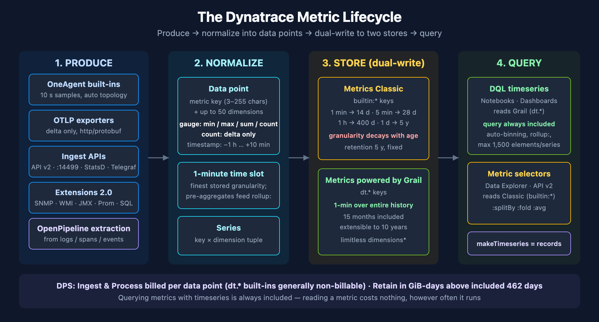
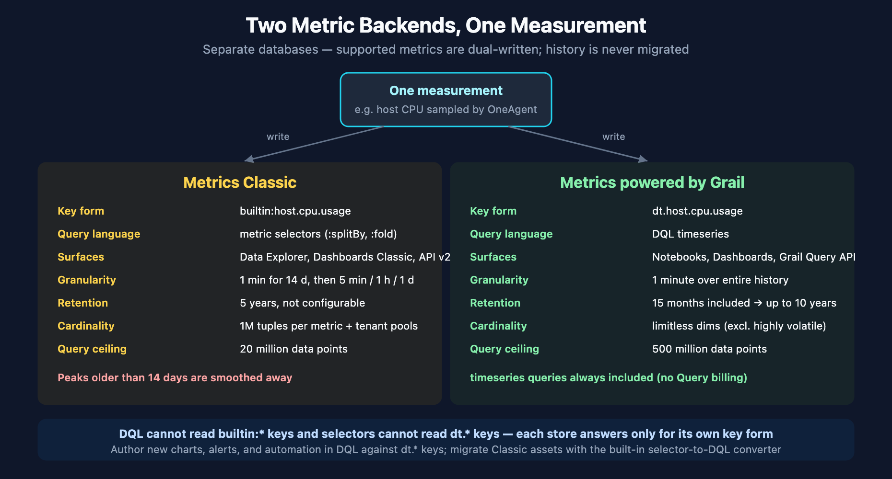

# FAQ-11: How Do Metrics Work in Dynatrace?

> **Series:** FAQ — Frequently Asked Questions | **Reference:** 11 — How Metrics Work in Dynatrace | **Created:** July 2026 | **Last Updated:** 07/08/2026

## Overview

Every observability conversation eventually lands on a metric — a CPU line on a dashboard, an error-rate alert, an SLO burn rate. But *what a metric actually is* in Dynatrace, and what happens to it between the moment a measurement is taken and the moment a chart renders, is rarely spelled out in one place. The answer determines things teams usually discover the hard way: why a query over a year of data comes back in seconds, why a `builtin:` metric key returns nothing in a Notebook, why an OpenTelemetry counter silently never arrives, why one careless dimension can consume a cardinality budget, and why metric queries do not show up on the DPS bill.

This FAQ is decision support for the question: **what happens to a metric in Dynatrace end to end — how a data point is produced, the shape it is normalized into, where it is stored (and for how long, at what resolution), how it is queried, and what it costs — and where that model constrains your design choices?**

It goes deep on the mechanics: the data-point model (gauge summaries and count deltas), the two coexisting metric backends (Metrics Classic and Metrics powered by Grail) and the dual-write bridge between them, every documented ingest path (OneAgent, the ingest APIs, OTLP, Extensions 2.0, and metric extraction from records), the storage and rollup model, dimension-cardinality enforcement, the DQL `timeseries` query path, and the DPS billing rules. It complements **FAQ-09** (*When Should I Query a Metric Instead of Raw Logs?*), which covers *when* to reach for a metric; this entry covers *how metrics themselves work*.



<!-- MARKDOWN_TABLE_ALTERNATIVE
| Stage | What happens |
|-------|--------------|
| 1. Produce | OneAgent built-ins (10-second samples), OTLP exporters/Collector, Metrics API v2 + local host ingest (StatsD, Telegraf, scripts), Extensions 2.0, OpenPipeline extraction from logs/spans/events |
| 2. Normalize | Every measurement becomes a data point: gauge (min/max/sum/count summary) or count (delta), attached to a metric key + up to 50 dimensions |
| 3. Store (dual-write) | Metrics Classic: 1-min granularity decaying with age, 5-year fixed retention. Metrics powered by Grail: 1-min granularity over entire history, 15 months included, extensible to 10 years |
| 4. Query | DQL `timeseries` in Notebooks/Dashboards (always included — no Query billing); metric selectors in Data Explorer / Metrics API v2 (Classic) |
For environments where SVG doesn't render
-->

---

## Table of Contents

1. [Short Answer](#short-answer)
2. [The Metric Data Model](#data-model)
3. [Two Backends: Metrics Classic vs Metrics Powered by Grail](#two-backends)
4. [How a Data Point Is Born: The Ingest Paths](#ingest-paths)
5. [Deriving Metrics from Records: OpenPipeline and Classic Extraction](#record-extraction)
6. [Storage: Resolution, Rollups, and Retention](#storage)
7. [Dimensions and Cardinality](#cardinality)
8. [Querying Metrics](#querying)
9. [What Metrics Cost Under DPS](#cost)
10. [Recommended Approach](#recommended-approach)
11. [Common Gotchas](#gotchas)

---

## Prerequisites

| Requirement | Details |
|-------------|---------|
| **Audience** | Platform engineers, SREs, observability architects, and anyone designing custom metrics, OTLP pipelines, or dashboards — and FinOps owners who want to understand what drives metric cost |
| **Format** | Decision-support deep dive — explains the metric model end to end; not a hands-on lab |
| **Deployment** | Dynatrace SaaS. The Grail-specific sections assume Grail/DPS; the Metrics Classic sections apply to classic-surface assets (Data Explorer, Dashboards Classic, Metrics API v2) |
| **Related topic series** | OTEL (OpenTelemetry ingest), OPIPE-03/04 (metric extraction from spans, cardinality management), OPLOGS-03 (metric extraction from logs), FINOPS-01/02/03 (DPS consumption querying, forecasting, optimization), DASH (dashboarding), SLO (metrics behind SLOs) |
| **Related FAQs** | FAQ-09 (when to query a metric instead of raw logs — the economics companion to this entry) |

<a id="short-answer"></a>
## 1. Short Answer

A Dynatrace metric is a **pre-aggregated numeric time series**: a metric key, a set of dimensions (up to 50), and a stream of timestamped data points that Dynatrace aggregates into **one-minute time slots** at ingest. A gauge data point is not a single number — it carries a `min`/`max`/`sum`/`count` summary of everything measured in its slot, which is why a query can later ask for the average, the peak, or the total of the *same* stored point without re-reading raw data. Counters are stored as **deltas**, never as cumulative totals.

That one design decision — *aggregate once at write time, read the aggregate forever* — explains most metric behavior you will encounter:

| Layer | What happens | Why it matters |
|-------|--------------|----------------|
| **Produce** | OneAgent samples infrastructure every 10 seconds; apps push via OTLP or the ingest APIs; extensions poll SNMP/JMX/Prometheus/SQL/WMI; OpenPipeline extracts metrics from logs, spans, and events | Many producers, one model — everything converges on the same line-protocol data-point shape |
| **Normalize** | Every measurement becomes a gauge summary (`min`,`max`,`sum`,`count`) or a count delta on a metric key + dimensions | The stored pre-aggregates are what DQL's `rollup:` parameter later selects among |
| **Store** | Dual-write into two separate databases: Metrics Classic (granularity decays with age) and Metrics powered by Grail (1-minute granularity over the entire retention window) | Which backend a tool reads determines what resolution and history it sees |
| **Query** | DQL `timeseries` (Notebooks, Dashboards) reads Grail; metric selectors (Data Explorer, Metrics API v2) read Classic | Classic `builtin:` keys are invisible to DQL — you query the Grail-native `dt.*` twin instead |
| **Bill** | DPS bills metric **Ingest & Process** per data point and **Retain** (in GiB-days) only above the included 15 months; querying metrics with `timeseries` is *always included* | Reading a metric ten thousand times costs the same as reading it once: nothing |

If you remember one thing: **metrics are shaped at ingest, not at query time.** Dimensions, units, temporality, and cardinality are all decisions the *producer* makes; the query side can only slice what was stored. The rest of this FAQ walks each layer in depth.

> <sub>**Sources:**</sub>
> - <sub>[Metric ingestion protocol (DT docs)](https://docs.dynatrace.com/docs/ingest-from/extend-dynatrace/extend-metrics/reference/metric-ingestion-protocol)</sub>
> - <sub>[Metric API FAQ (DT docs)](https://docs.dynatrace.com/docs/dynatrace-api/environment-api/metric-v2/metric-faq) — "The finest granularity of a time slot is one minute."</sub>
> - <sub>[Metrics FAQ (DT docs)](https://docs.dynatrace.com/docs/analyze-explore-automate/metrics/faq)</sub>
> - <sub>[Metrics powered by Grail capability (DT docs)](https://docs.dynatrace.com/docs/manage/dynatrace-platform-subscription/capabilities/metrics-powered-by-grail) — "Querying metrics using the `timeseries` command is always included."</sub>
> - <sub>**Derived:** the five-layer framing is an authoring synthesis of the cited pages; the docs describe each layer separately.</sub>

<a id="data-model"></a>
## 2. The Metric Data Model

### 2.1 The metric key

A metric key is a dot-separated path (`myapp.orders.processed`). The ingestion protocol defines the rules verbatim: allowed characters are *"lowercase and uppercase letters, numbers, hyphens (`-`), and underscores (`_`)"*; *"metric keys cannot start with a number or a hyphen"*; sections cannot start with a hyphen; non-Latin letters are not allowed; and *"the length of the key must be in range from 3 to 255 characters."*

The **prefix carries meaning** — it tells you who produced the metric and which backend generation it belongs to:

| Prefix | Who writes it | Notes |
|--------|---------------|-------|
| `dt.*` | Dynatrace (Grail-native built-ins) | **Reserved** — custom keys starting with `dt.` are rejected at ingest |
| `builtin:*` | Dynatrace (Classic built-ins) | The Classic twin of `dt.*` keys; queryable via metric selectors, not DQL |
| `ext:*` | Extensions (Classic naming) | Extension-framework metrics |
| `calc:*` | Calculated metrics (Classic) | e.g., calculated service metrics; `calc:apps.*` RUM metrics are not supported on Grail |
| `log.*` | Log metric extraction | Classic log-metric rules prefix keys with `log.` |
| *(your namespace)* | You | Free-form — in community practice, prefix with an org or app namespace so ownership stays obvious |

For Grail-native keys, Dynatrace's own naming convention is instructive: the docs describe *"replacing the `builtin:` prefix with `dt.` to clearly denote Dynatrace-provided metrics"* and *"preferring snake case (`capacity_units`) to camel case (`capacityUnits`)"*.

### 2.2 Dimensions

Dimensions are key-value pairs attached to a data point — *"you can specify up to 50 dimensions"* per metric line. Dimension keys allow lowercase letters, numbers, hyphens, periods, colons, and underscores; values are quoted strings (quotes and backslashes escaped). If the same dimension key appears twice on one line, only one value is accepted.

The critical concept dimensions create is the **series**: one metric key × one unique dimension-value tuple = one series, and each series produces its own stream of data points. Cardinality (§7) and billing (§9) are both counted in series, not in keys.

You can see the series structure of your own tenant with the DQL `metrics` discovery command — this query (validated live) counts series per host-metric key; the per-disk metrics unsurprisingly carry the most:

```dql
metrics from: now()-24h
| filter startsWith(metric.key, "dt.host.")
| summarize series = count(), by: {metric.key}
| sort series desc
| limit 10
```

### 2.3 Data points: gauges and counts

Every data point is one of two payload types:

- **Gauge** — a sampled state ("CPU is at 80.6%"). A single value `gauge,80.6` is expanded at ingest to the summary `min=80.6, max=80.6, sum=80.6, count=1`; producers that pre-aggregate can send the summary form directly (`gauge,min=17.1,max=17.3,sum=34.4,count=2`). Those four stored statistics are exactly what DQL's `rollup:` parameter selects among at query time (§8).
- **Count** — an occurrence tally ("500 requests since the last report"). The protocol is explicit: *"data points of the `count` type are deltas between the previous and current data points"* — you send `count,delta=500`, never a cumulative running total. Count metrics automatically receive a `.count` suffix on the key.

Timestamps are UTC milliseconds, and the acceptance window is tight: *"between 1 hour into the past and 10 minutes into the future from now"* — anything outside is rejected. Omit the timestamp and the server clock is used.

### 2.4 Metadata: units, display names, descriptions

Metadata makes a metric render meaningfully (a chart labeled "MilliSecond" instead of a bare number). Two mechanisms:

1. **At ingest**, the line protocol supports a metadata line: `#my.metric gauge dt.meta.displayName="...", dt.meta.description="...", dt.meta.unit="..."`.
2. **After ingest**, the Settings schema `builtin:metric.metadata` (scope `metric-{your-metric-key}`) manages display name, description, unit, tags, dimension display names, and Davis-relevant properties (`rootCauseRelevant`, `impactRelevant`, `minValue`/`maxValue`).

One documented limitation to plan around: *"You cannot provide metadata for built-in or calculated metrics; metadata is supported only for custom ingested metrics"* — built-in metadata is registered by Dynatrace itself.

> <sub>**Sources:**</sub>
> - <sub>[Metric ingestion protocol (DT docs)](https://docs.dynatrace.com/docs/ingest-from/extend-dynatrace/extend-metrics/reference/metric-ingestion-protocol) — key/dimension rules, gauge summary expansion, count deltas, timestamp window</sub>
> - <sub>[Metric limits (DT docs)](https://docs.dynatrace.com/docs/analyze-explore-automate/metrics/limits) — `dt.` prefix reserved for Dynatrace</sub>
> - <sub>[Built-in metrics on Grail (DT docs)](https://docs.dynatrace.com/docs/analyze-explore-automate/metrics/built-in-metrics-on-grail) — Grail naming conventions</sub>
> - <sub>[Built-in classic metrics (DT docs)](https://docs.dynatrace.com/docs/analyze-explore-automate/metrics-classic/built-in-metrics) — `builtin:` / `ext:` / `calc:` prefix semantics</sub>
> - <sub>[Custom metric metadata (DT docs)](https://docs.dynatrace.com/docs/ingest-from/extend-dynatrace/extend-metrics/reference/custom-metric-metadata) — metadata mechanisms and the built-in/calculated limitation</sub>

<a id="two-backends"></a>
## 3. Two Backends: Metrics Classic vs Metrics Powered by Grail

Dynatrace currently operates **two metric databases side by side**, and understanding the split resolves most "why can't I see my metric here?" confusion. The docs are unambiguous: *"Classic metrics and Grail are separate databases with separate storage."* Nothing is migrated between them — instead, *"supported metrics are already being written to both Metrics Classic and Grail"* (dual-write), so each backend accumulates its own history from the point support began.



<!-- MARKDOWN_TABLE_ALTERNATIVE
| | Metrics Classic | Metrics powered by Grail |
|---|---|---|
| Built-in key form | `builtin:host.cpu.usage` | `dt.host.cpu.usage` |
| Query language | Metric selectors (`:splitBy`, `:fold`, `:avg`) | DQL `timeseries` |
| Query surfaces | Data Explorer, Dashboards Classic, Metrics API v2 | Notebooks, Dashboards, Grail Query API |
| Granularity | 1 minute for first 14 days, then coarser | 1 minute over entire history |
| Retention | 5 years, not configurable | 15 months included, extensible to 10 years |
| Cardinality | 1 million dimension tuples per metric | Limitless dimensions (excluding highly volatile) |
| Max data points per query | 20 million | 500 million |
Center: the same measurement is dual-written to both stores; history is not migrated.
For environments where SVG doesn't render
-->

### 3.1 The key mapping

Built-in metrics exist under **two names**: the Classic key (`builtin:host.cpu.usage`) and the Grail-native key (`dt.host.cpu.usage`). These are the same measurement dual-written to two stores — but each store only answers for its own key form. This is the single most common trip-wire when teams move to Notebooks:

- **DQL cannot query `builtin:` keys.** A `timeseries` on a `builtin:` key either fails to parse (the colon reads as parameter syntax) or, backtick-quoted, returns nothing — the Grail store has no such key. Query the `dt.*` twin instead. We confirmed this live: on a current tenant, the DQL `metrics` command lists hundreds of `dt.*` keys and zero `builtin:` keys.
- **Metric selectors cannot query `dt.*` keys** — they read Classic.

The Grail catalog is also consolidated, not 1:1: per the upgrade guide, *"over 100 service metrics have been consolidated to just a handful"* (the `dt.service.*` family, split by dimensions instead of key proliferation). Some Classic families have no Grail twin — *"calculated RUM metrics (metrics with the prefix `calc:apps`) are not supported on Grail"* and security metrics were replaced by security events.

### 3.2 Which tool reads which backend

| Surface | Backend | Query language |
|---------|---------|----------------|
| Notebooks, Dashboards (Latest Dynatrace) | Grail | DQL `timeseries` |
| Grail Query API (`/platform/storage/query/...`) | Grail | DQL |
| Data Explorer, Dashboards Classic | Classic | Metric selector |
| Metrics API v2 (`/api/v2/metrics/query`) | Classic | Metric selector |

The migration state, per the docs: *"most but not all metrics are already supported on Grail"* — service, infrastructure, cloud, container/Kubernetes, and runtime families are available, with others *"planned but not yet available."* Data Explorer and Dashboards Classic ship a built-in **metric-selector-to-DQL converter** to help move assets, with the honest caveat that *"there isn't an exact, one-to-one mapping between Classic metric selectors and DQL"* — Classic's "Auto" pseudo-aggregation, notably, has no DQL equivalent.

**Practical rule:** author every *new* chart, alert, and automation in DQL against `dt.*` keys; treat metric selectors as the maintenance language for existing Classic assets until you migrate them (§8.4).

> <sub>**Sources:**</sub>
> - <sub>[Metrics FAQ (DT docs)](https://docs.dynatrace.com/docs/analyze-explore-automate/metrics/faq) — separate databases, dual-write, tool-to-backend mapping</sub>
> - <sub>[Metrics on Grail upgrade guide (DT docs)](https://docs.dynatrace.com/docs/analyze-explore-automate/metrics/upgrade) — migration state, service-metric consolidation</sub>
> - <sub>[Built-in metrics on Grail (DT docs)](https://docs.dynatrace.com/docs/analyze-explore-automate/metrics/built-in-metrics-on-grail) — `builtin:` ↔ `dt.` key mapping tables</sub>
> - <sub>[Metric limits (DT docs)](https://docs.dynatrace.com/docs/analyze-explore-automate/metrics/limits) — side-by-side capability comparison</sub>
> - <sub>[Metric selector conversion (DT docs)](https://docs.dynatrace.com/docs/analyze-explore-automate/metrics/upgrade/metric-selector-conversion) — converter and its caveats</sub>
> - <sub>[Data Explorer (DT docs)](https://docs.dynatrace.com/docs/analyze-explore-automate/explorer) — Classic surface and upgrade guidance</sub>

<a id="ingest-paths"></a>
## 4. How a Data Point Is Born: The Ingest Paths

Every path below converges on the same data-point model from §2 — the differences are *where* the measurement is taken, *who* authenticates, and *what* gets added automatically.

| Path | Runs where | Auth | Distinctive behavior |
|------|-----------|------|----------------------|
| OneAgent built-ins | On the host | none (agent) | 10-second sampling → 1-minute aggregates; automatic topology dimensions |
| Metrics API v2 ingest | Anywhere → cluster/ActiveGate | token, `metrics.ingest` scope | Line protocol, 1 MB payload |
| OneAgent local API / `dynatrace_ingest` / Telegraf / StatsD | On the host, `localhost` only | none (local trust) | Automatic host dimensions; 1,000-line payload |
| OTLP (`/api/v2/otlp/v1/metrics`) | Anywhere → cluster/ActiveGate | token, `metrics.ingest` scope | **Delta temporality required**; HTTP + binary protobuf only |
| Extensions 2.0 | OneAgent or ActiveGate (EEC) | framework | Declarative YAML; polls SNMP/WMI/JMX/Prometheus/SQL/Python |
| OpenPipeline extraction | At record ingest | pipeline config | Metrics derived from logs/spans/events — §5 |

### 4.1 OneAgent built-in metrics

The workhorse. Per the docs: *"infrastructure metrics and other periodic metrics are captured every 10 seconds and stored as 1-minute aggregates"* — the aggregate typically carrying min/max/count/sum/average. Service and web-request metrics are different in kind: *"service and web request metrics do not have a frequency"* — they are derived from the observed transactions themselves (medians and 90th percentiles). Not everything is 10-second: some built-ins report at 1-minute intervals, and a few trail by up to 15 minutes. OneAgent also attaches the topology context (host, process group, entity IDs) as dimensions automatically — which is what makes `by:{dt.smartscape.host}` splits work with zero configuration.

### 4.2 Metrics API v2 ingest — the line protocol

`POST /api/v2/metrics/ingest` accepts a plain-text body of protocol lines, one data point each, with a token holding the `metrics.ingest` scope. *"The payload is limited to 1 MB"* and *"there's no limit on the number of metrics"* within it. A `202` means accepted for background processing; a `400` can be a *partial* failure — valid lines are still ingested.

```text
# metadata line (optional, once per key)
#myapp.orders.processed count dt.meta.displayName="Orders processed", dt.meta.unit="Count"

myapp.orders.processed,region="us-east-1",tier="checkout" count,delta=42
myapp.queue.depth,region="us-east-1" gauge,17
myapp.request.duration,region="us-east-1" gauge,min=12.1,max=340.7,sum=1893.4,count=25 1751896800000
```

### 4.3 The local-host ingest family

When code already runs on a OneAgent-monitored host, you can skip tokens entirely. The **local metric API** — `http://localhost:14499/metrics/ingest` (served by OneAgent's Extensions Execution Controller) — *"is available only to local clients and cannot be reached from remote hosts."* Payload cap: 1,000 lines. Its convenience feature is enrichment: *"the host ID and host name context are automatically added to each metric as dimensions."* The same channel backs three integrations:

- **`dynatrace_ingest`** — a CLI shipped in `<install>/agent/tools`; pipe protocol lines via stdin or pass one per invocation. Ideal for cron jobs and shell scripts.
- **Telegraf** — the upstream Telegraf distribution includes a Dynatrace output plugin; point it at the local endpoint (or a cluster URL + token for remote).
- **StatsD** — OneAgent ships a StatsD daemon listening on UDP `18125`; an ActiveGate can act as a remote listener on `18126` (disabled by default there).

### 4.4 OTLP — OpenTelemetry metrics

`POST /api/v2/otlp/v1/metrics` (or via ActiveGate) with an `Authorization: Api-Token …` header carrying `metrics.ingest`. Three protocol constraints surprise OTel veterans:

1. **HTTP only** — *"gRPC is not supported"* — and **binary protobuf only** (*"JSON is not supported"*): set `OTEL_EXPORTER_OTLP_PROTOCOL=http/protobuf`.
2. **Delta temporality is mandatory**: *"the Dynatrace backend exclusively works with delta values and requires the respective aggregation temporality."* Cumulative sums are not ingested. Fix it at the SDK (`OTEL_EXPORTER_OTLP_METRICS_TEMPORALITY_PREFERENCE=DELTA`) or in a Collector with the `cumulativetodelta` processor (set `max_staleness` above the receive interval so counter state is not evicted between reports).
3. **Histogram support is partial**: explicit-bucket histograms are supported (Dynatrace 1.300+); for exponential histograms *"Dynatrace ingests the histogram's min/max/sum/count but doesn't ingest the buckets"*; histogram points without a sum (negative recordings) are dropped; OTLP *summary* metrics are not supported at all.

Attribute mapping: data-point attributes become dimensions by default; resource and scope attributes pass through an allow-list — unless the tenant enables **Advanced OTLP metric dimensions**, in which case *all* resource/scope/data-point attributes become dimensions except a deny list, and `otel.scope.name`/`otel.scope.version` are always added. On conflicts, data-point attributes win over scope, which wins over resource. Limits shift with that mode too: 50 → 100 dimensions, 100 → 350-character dimension keys, 255 → 2,048-character values; requests cap at 4 MB uncompressed and 15,000 data points; instrument units longer than 63 characters are silently dropped.

### 4.5 Extensions 2.0

For technology you cannot instrument directly, an extension is a **declarative YAML** (`extension.yaml` in a signed ZIP) that tells the Extensions Execution Controller what to poll: SNMP, WMI, JMX, Prometheus endpoints, SQL queries, or custom Python. It runs *"either your local data sources when run on OneAgent, or remote data sources when run from an ActiveGate"* and emits through the same ingestion protocol as everything else. See the ONBRD and K8S series for deployment patterns.

> <sub>**Sources:**</sub>
> - <sub>[Metrics Classic (DT docs)](https://docs.dynatrace.com/docs/analyze-explore-automate/metrics-classic) — 10-second capture, 1-minute aggregates, service-metric derivation</sub>
> - <sub>[POST ingest data points (DT docs)](https://docs.dynatrace.com/docs/dynatrace-api/environment-api/metric-v2/post-ingest-metrics) — endpoint, scope, 1 MB payload, partial-failure semantics</sub>
> - <sub>[Metric ingestion protocol (DT docs)](https://docs.dynatrace.com/docs/ingest-from/extend-dynatrace/extend-metrics/reference/metric-ingestion-protocol)</sub>
> - <sub>[OneAgent metric API (DT docs)](https://docs.dynatrace.com/docs/ingest-from/extend-dynatrace/extend-metrics/ingestion-methods/oneagent-metric-api) — port 14499, local-only, 1,000 lines, host enrichment</sub>
> - <sub>[Scripting integration `dynatrace_ingest` (DT docs)](https://docs.dynatrace.com/docs/ingest-from/extend-dynatrace/extend-metrics/ingestion-methods/oneagent-pipe)</sub>
> - <sub>[Telegraf (DT docs)](https://docs.dynatrace.com/docs/ingest-from/extend-dynatrace/extend-metrics/ingestion-methods/telegraf)</sub>
> - <sub>[StatsD (DT docs)](https://docs.dynatrace.com/docs/ingest-from/extend-dynatrace/extend-metrics/ingestion-methods/statsd) — ports 18125/18126</sub>
> - <sub>[OTLP API (DT docs)](https://docs.dynatrace.com/docs/ingest-from/opentelemetry/otlp-api) — endpoints, HTTP/protobuf-only</sub>
> - <sub>[OTLP metrics ingest concepts (DT docs)](https://docs.dynatrace.com/docs/ingest-from/opentelemetry/otlp-api/ingest-otlp-metrics/about-metrics-ingest) — delta temporality, histogram type mapping</sub>
> - <sub>[OTLP metrics configuration (DT docs)](https://docs.dynatrace.com/docs/ingest-from/opentelemetry/otlp-api/ingest-otlp-metrics/configure-otlp-metrics) — attribute-to-dimension rules</sub>
> - <sub>[OTLP metrics limitations (DT docs)](https://docs.dynatrace.com/docs/ingest-from/opentelemetry/getting-started/metrics/limitations) — size/length limits, 63-character unit cap</sub>
> - <sub>[Collector configuration (DT docs)](https://docs.dynatrace.com/docs/ingest-from/opentelemetry/collector/configuration) — `cumulativetodelta` + `max_staleness` guidance</sub>
> - <sub>[Extensions 2.0 concepts (DT docs)](https://docs.dynatrace.com/docs/ingest-from/extensions20/extensions-concepts)</sub>
> - <sub>[Extension data sources (DT docs)](https://docs.dynatrace.com/docs/ingest-from/extensions/supported-extensions/data-sources)</sub>

<a id="record-extraction"></a>
## 5. Deriving Metrics from Records: OpenPipeline and Classic Extraction

Not every metric starts life as a measurement — many of the most valuable ones are *derived* from records (logs, spans, events) at ingest. This is the "compute once" move from FAQ-09 applied at the pipeline: instead of re-scanning records on every dashboard render, an extraction rule turns matching records into data points as they arrive.

### 5.1 OpenPipeline metric extraction (current mechanism)

OpenPipeline's processing stage offers two extraction processors — a **counter metric** (*"returns the number of occurrences of a metric, from the records that match the query"*) and a **value metric** (*"returns the aggregated values of a metric from the records that match the query"*, reading a numeric field). Extraction is configurable on logs, generic events, SDLC events, security events (new), business events, system events, user events, and user sessions — and *"extracted metrics are sent to Grail only"* (with narrow exceptions for the security-event and span scopes).

**Spans get special treatment.** Because spans can be sampled, the span scope offers *sampling-aware* counter, value, and histogram metric processors that extrapolate through the sampling ratio — leave the sampling options enabled so a 1-in-100 sampled trace stream still yields approximately correct request counts. Log- and event-derived metrics have no such caveat: those records are not sampled, so extracted metrics are exact. OPIPE-03 covers the span case in depth; OPLOGS-03 covers logs.

Two design rules carry over from FAQ-09 verbatim: **bound your dimensions** (each unique tuple becomes a stored, billed series — §7) and remember that **extraction is forward-only** — a rule created today produces data points from today onward; it does not backfill history from stored records.

### 5.2 Classic log metrics

The classic mechanism (Settings → Log Monitoring → Metrics extraction) still exists: it prefixes keys with `log.`, and measures either *"occurrence of log records"* (a count) or an *"attribute value"* (min/max/sum/average/median/percentiles of a numeric log attribute), split by configured dimensions. New work should use OpenPipeline extraction instead; existing `log.*` metrics keep working.

### 5.3 Calculated service metrics (Classic) — direction of travel

Calculated service metrics are the classic way to derive request-scoped metrics (by URL pattern, request attribute, etc.). Their status is documented precisely: *"currently, no deprecation date is set"*, but *"when creating new calculated service metrics, you should use OpenPipeline, which uses metric extraction from span data"* — and *"OpenPipeline will eventually become the default method … at that point, the current calculated service metrics functionality will be deprecated."* The Grail path also lifts a real limitation: classic calculated metrics keep at most the top 100 dimension values, while Grail stores the full dimension cardinality (metrics already above 2,000 cardinality cannot be auto-upgraded).


> **Forthcoming/rolling out (SaaS 1.343, July 2026):** OpenPipeline metric extraction adds support for **histogram metrics** — you can extract a histogram (not just a counter or gauge value) from logs or spans, giving percentile-capable series from record data without shipping raw histograms through OTLP. SaaS 1.343 released July 7, 2026 with a **staged tenant rollout** (from mid-July 2026) — verify the feature has reached your tenant before relying on it. Until it arrives, the OTLP histogram path and counter/value extraction described in this section remain the available surfaces. This narrows the gap noted elsewhere in this entry between OTLP histogram ingestion and record-derived metrics.

> <sub>**Sources:**</sub>
> - <sub>[OpenPipeline processing (DT docs)](https://docs.dynatrace.com/docs/platform/openpipeline/concepts/processing) — counter/value processors, supported scopes, Grail-only routing</sub>
> - <sub>[Extract metrics from spans (DT docs)](https://docs.dynatrace.com/docs/platform/openpipeline/use-cases/tutorial-extract-metrics-from-spans) — sampling-aware processors</sub>
> - <sub>[Log metrics (DT docs)](https://docs.dynatrace.com/docs/analyze-explore-automate/logs/lma-log-processing/lma-log-metrics) — classic `log.*` extraction modes</sub>
> - <sub>[Calculated service metrics upgrade (DT docs)](https://docs.dynatrace.com/docs/analyze-explore-automate/metrics/upgrade/calculated-service-metrics-upgrade) — deprecation posture, top-100 vs full cardinality</sub>

<a id="storage"></a>
## 6. Storage: Resolution, Rollups, and Retention

### 6.1 What is physically stored

The finest stored granularity is the **one-minute time slot** (*"the finest granularity of a time slot is one minute"*). For gauges, each slot holds the pre-aggregated summary — min, max, sum, count — not the raw 10-second samples. This is the load-bearing fact behind DQL's `rollup:` parameter: when you write `avg(dt.host.cpu.usage, rollup: max)`, you are choosing *which stored statistic* per slot feeds the aggregation. Nothing is recomputed from raw samples, because raw samples were never stored.

### 6.2 Metrics Classic: granularity decays with age

Classic storage downsamples as data ages, on a fixed schedule:

| Data age | Stored resolution |
|----------|-------------------|
| 0–14 days | 1 minute |
| 14–28 days | 5 minutes |
| 28–400 days | 1 hour |
| 400 days–5 years | 1 day |

Retention is *"5 years, not configurable."* The practical consequence: a Classic query comparing this month against thirteen months ago is comparing 1-minute data against 1-hour data — fine for trends, misleading for peaks (a 2-minute CPU spike simply no longer exists at 1-hour resolution).

### 6.3 Metrics powered by Grail: full resolution, configurable retention

Grail metrics keep **"1 minute over entire history."** Included retention is *"15 months (462 days) of 1-minute granularity"*, and *"for the default metrics bucket, the available retention period ranges from 15 months (462 days) to 10 years (3,657 days)"* — raising it bills the Retain capability (§9). Retained data stays queryable until the end of the retention period. Note the current scoping: retention is set on the **default metrics bucket**; custom metric buckets are documented as *"planned for a future release"*, so per-metric retention splits are not yet available the way they are for logs.

The Grail design also removed a classic artifact: Classic kept separate pre-aggregated and full-cardinality "detail" variants of some built-ins for performance; Grail *"is already optimized for such high cardinality queries"*, so only the detailed form exists.

> <sub>**Sources:**</sub>
> - <sub>[Metric API FAQ (DT docs)](https://docs.dynatrace.com/docs/dynatrace-api/environment-api/metric-v2/metric-faq) — one-minute finest slot</sub>
> - <sub>[Data retention periods (DT docs)](https://docs.dynatrace.com/docs/manage/data-privacy-and-security/data-privacy/data-retention-periods) — classic downsampling tiers, Grail 15-month default</sub>
> - <sub>[Metric limits (DT docs)](https://docs.dynatrace.com/docs/analyze-explore-automate/metrics/limits) — granularity/retention comparison</sub>
> - <sub>[Metrics Retain capability (DT docs)](https://docs.dynatrace.com/docs/license/capabilities/metrics/dps-metrics-retain) — 462 days included, 10-year ceiling</sub>
> - <sub>[Metrics FAQ (DT docs)](https://docs.dynatrace.com/docs/analyze-explore-automate/metrics/faq) — custom metric buckets planned</sub>
> - <sub>[Built-in metrics on Grail (DT docs)](https://docs.dynatrace.com/docs/analyze-explore-automate/metrics/built-in-metrics-on-grail) — pre-aggregated/detail split removed</sub>

<a id="cardinality"></a>
## 7. Dimensions and Cardinality

Cardinality is the count of **unique dimension-value tuples** per metric key — and it is the one resource a metric design can exhaust silently. The math is multiplicative: `endpoint (50) × status (10) × region (6)` is 3,000 potential series; add `customer_id (100,000)` and you have 300 million.

### 7.1 Enforcement on Metrics Classic

Classic enforces hard limits, measured over *"the dimension tuples of the last 30 days (a 30-day sliding window)"*:

- **Per metric:** 1 million dimension tuples.
- **Per tenant:** pool limits across all custom metrics (50 million tuples) and across all built-in metrics — check the [metric limits page](https://docs.dynatrace.com/docs/analyze-explore-automate/metrics/limits) for the current pool values on your tenant generation.

Exceeding a limit does not stop the metric — it stops *growth*: *"data points having new and as yet unseen dimension tuples are rejected"* while existing series keep flowing. This makes the failure mode subtle: dashboards keep rendering, but new hosts/pods/endpoints never appear.

The docs call out the classic trap directly — **volatile dimensions**: *"short-lived IDs and timestamps are volatile dimensions"*, and a dimension that changes per data point *"will reach the cardinality limits after 1 million seconds online — just 11 days."* Never use request IDs, session IDs, trace IDs, timestamps, or unbounded user IDs as metric dimensions; that detail belongs in logs and spans, which are built for it.

**Watch it before it bites:** Dynatrace ships self-monitoring metrics for dimension-tuple usage, charted on the **"Metric & Dimension Usage + Rejections"** preset dashboard (dimensions below 10% of a limit are omitted from the detail view).

### 7.2 Grail posture

Metrics powered by Grail advertises *"limitless dimensions (excluding highly volatile dimensions)"* — the storage engine no longer needs a per-metric tuple cap, but the exclusion in parentheses is doing real work: highly volatile dimensions remain outside the design intent, and *"Dynatrace therefore may restrict or reject metric configurations that don't follow best practices."* The custom-metric-key ceiling (100,000 distinct keys) applies to both backends.

### 7.3 The cardinality–cost interplay

Dimensions do not bill directly — per the DPS docs, *"metric data points are not billed based on an increase in dimensions, but rather by the increased number of metric data points."* The catch is the second clause: every new tuple is a new series, and every series emits data points per interval. Splitting one metric into 1,000 series multiplies ingested data points by up to 1,000. Cardinality discipline is therefore simultaneously a reliability practice (Classic limits) and a cost practice (DPS ingest) — OPIPE-04 and FINOPS-03 §9 cover remediation patterns.

> <sub>**Sources:**</sub>
> - <sub>[Metrics API best practices (DT docs)](https://docs.dynatrace.com/docs/dynatrace-api/environment-api/metric-v2/best-practices) — limits, sliding window, rejection behavior, volatile-dimension math, self-monitoring dashboard</sub>
> - <sub>[Metric limits (DT docs)](https://docs.dynatrace.com/docs/analyze-explore-automate/metrics/limits) — Grail limitless-dimensions posture, 100,000 custom keys</sub>
> - <sub>[Metrics Ingest & Process capability (DT docs)](https://docs.dynatrace.com/docs/license/capabilities/metrics/dps-metrics-ingest) — dimensions-vs-data-points billing rule</sub>

<a id="querying"></a>
## 8. Querying Metrics

### 8.1 DQL `timeseries` — the Grail query path

`timeseries` is a *starting* command: it loads, filters, and aggregates metric storage into series in one step. The essentials (all validated live on a tenant):

```dql
timeseries avg(dt.host.cpu.usage), from:-2h, by:{dt.smartscape.host}
| limit 3
```

Mechanics worth internalizing:

- **Auto-binning.** *"The timeseries command automatically calculates an appropriate time interval derived from the query timeframe"* — snapped to well-known slots (1, 2, 3, 5, 10, 15, 30 minutes; 1–24 hours; multiples of 24 hours up to 30 days), overridable with `interval:` or `bins:`. A series never exceeds **1,500 elements**, which is why a year-long query returns daily points, not half a million minutes.
- **`rollup:` selects the stored statistic** (§6.1) — `avg`, `min`, `max`, `sum`, `total` — independently of the across-series aggregation. It is **required** for `percentile`/`median`/`percentRank` on gauge and count metrics; omit it and the query silently returns nothing.
- **`scalar: true`** collapses a series to one number over the whole timeframe — cheaper than materializing an array and post-processing it.

```dql
timeseries {
    p90 = percentile(dt.host.cpu.usage, 90, rollup: avg),
    avg_cpu = avg(dt.host.cpu.usage, scalar: true)
  }, from:-2h, by:{dt.smartscape.host}
| limit 3
```

Also available: `filter:` (pre-aggregation dimension filtering), `shift:` (timeframe comparison — day-over-day in one query), `default:` (fill empty slots), and `union:`. Output is normalized: *"all series have identical start and end timestamps, time interval and number of elements."*

### 8.2 `metrics` — discovery, not charting

The `metrics` command lists **series** (keys + dimension tuples), returning no values or timestamps. Its documented constraints: the timeframe *"is limited to the last ten days"*, at most 100,000 series per query, and it needs `storage:metrics:read` + `storage:buckets:read`. Use it to answer "what exists, with which dimensions?" — as in the §2.2 discovery query.

### 8.3 `makeTimeseries` — the record-side contrast

`makeTimeseries` builds series **from records at query time** (`fetch logs/events/spans | makeTimeseries …`). Functionally similar output; economically opposite input. In our live validation, metric `timeseries` queries scanned **0 billable bytes**, while this equivalent-shaped event aggregation scanned 110,350 records (0.23 GB) — the record scan bills the Query capability of its data type; the metric read bills nothing:

```dql
fetch events, from:-2h
| makeTimeseries events = count(), interval: 15m
```

That asymmetry is the entire argument of FAQ-09: recurring aggregations belong in metrics; `makeTimeseries` is for ad-hoc analysis of records you are already scanning.

### 8.4 Metric selectors — the Classic query path

The Metrics API v2 (`/api/v2/metrics/query`) and Data Explorer consume **metric selectors** — a transformation-chain syntax (`builtin:host.cpu.usage:splitBy("dt.entity.host"):avg:fold(avg)`) with up to 10 metrics per query. It remains a current, non-deprecated API surface, but it reads Metrics Classic only. When migrating assets, the built-in converter maps the common shapes (`:splitBy(...)` → `by:{...}`, `:fold(avg)` → array/scalar aggregation, `median` → `percentile(...,50)`, count-metric `value` → `sum`); Classic's "Auto" aggregation has no DQL equivalent and needs a human decision.

Query-size ceilings differ by an order of magnitude and change what is *feasible*: Classic caps a query at 20 million data points; Grail at **500 million** — high-cardinality, long-window analyses that Classic rejects are routine in Notebooks.


> **Forthcoming/rolling out (SaaS 1.343, July 2026):** metric **metadata becomes queryable via DQL** — available metrics with their dimensions and descriptions can be listed directly from a query, extending the `metrics` discovery command described above. SaaS 1.343 released July 7, 2026 with a **staged tenant rollout** (from mid-July 2026) — verify the feature has reached your tenant before relying on it; the `metrics` discovery command described above remains the working surface until then. Useful for building self-documenting dashboards and for auditing which dimensions a metric actually carries before writing `by:{...}` clauses.

> <sub>**Sources:**</sub>
> - <sub>[Metric commands — timeseries, metrics (DT docs)](https://docs.dynatrace.com/docs/platform/grail/dynatrace-query-language/commands/metric-commands)</sub>
> - <sub>[Aggregation commands — makeTimeseries (DT docs)](https://docs.dynatrace.com/docs/platform/grail/dynatrace-query-language/commands/aggregation-commands)</sub>
> - <sub>[Metric selector (DT docs)](https://docs.dynatrace.com/docs/dynatrace-api/environment-api/metric-v2/metric-selector) — transformations, 10-metric cap</sub>
> - <sub>[Metrics API v2 (DT docs)](https://docs.dynatrace.com/docs/dynatrace-api/environment-api/metric-v2)</sub>
> - <sub>[Metric selector conversion (DT docs)](https://docs.dynatrace.com/docs/analyze-explore-automate/metrics/upgrade/metric-selector-conversion) — selector-to-DQL mappings</sub>
> - <sub>[Metric limits (DT docs)](https://docs.dynatrace.com/docs/analyze-explore-automate/metrics/limits) — 20M vs 500M query ceilings</sub>
> - <sub>[Metrics powered by Grail capability (DT docs)](https://docs.dynatrace.com/docs/manage/dynatrace-platform-subscription/capabilities/metrics-powered-by-grail) — timeseries queries always included</sub>

<a id="cost"></a>
## 9. What Metrics Cost Under DPS

The Metrics powered by Grail capability has three dimensions — **Ingest & Process**, **Retain**, and **Query** — but the third is a formality: *"querying metrics using the `timeseries` command is always included."* Metric reads never appear on the bill. (FAQ-09 reaches the same conclusion from the cost-decision angle: the Query dimension exists but is always included, so metric reads never bill.)

### 9.1 Ingest & Process — billed per data point

*"Ingested data is the number of metric data points sent to Dynatrace"*, where *"a metric data point is a single measurement of a metric."* The counting rules:

| Measurement | Billed data points |
|-------------|-------------------|
| Gauge or counter measurement | 1 |
| Histogram measurement | 10 — *"except `dt.service.*` metric keys which are counted as one data point"* |

Scale intuition from the docs' own example: one series reporting every minute is *"1 metric data point × 60 min × 24 h × 365 days = 525,600 metric data points/year."* Multiply by your series count (§7.3) — that, not dimension width, is the bill driver.

### 9.2 What's included / non-billable

- *"The following metric keys are non-billable: `dt.*`"* — with documented exceptions (certain `dt.cloud.aws.*` / `dt.cloud.azure.*` and `dt.osservice.*` metrics, and `dt.service.*` when originating from non-Full-Stack sources). In short: the OneAgent/Dynatrace-produced catalog you get with host monitoring is generally free; *"some built-in metrics are not billed — this includes, for example, host monitoring metrics included in Full-Stack Monitoring and Infrastructure Monitoring."*
- `legacy.*` metrics and everything in the `dt_system_metrics` bucket are non-billable.
- Custom metrics draw first on an included allotment: *"the number of included Custom Metric data points is dependent on the total monitored GiB-hours of your deployment and the OneAgent mode."*
- During a licensing transition there is no double-billing: *"only the consumption related to your active license applies, whether it's DDUs, DPS Custom Metrics Classic, or DPS Metrics powered by Grail."*

### 9.3 Retain — billed in GiB-days above the included window

Retain's unit is *"the gibibyte-day (GiB-day)"* — storage volume, not data points — and it only accrues **beyond the included 462 days**. The docs' worked example: at 9 GiB/day of metric data retained for 5 years (1,832 days), billable retention is 9 GiB × (1,832 − 462) = 12,330 GiB carried per day. Extending metric retention is cheap relative to record retention, but it is not free — decide it deliberately (§10).

For querying your *own* tenant's metric consumption, FINOPS-01 documents the `dt.system.events` billing-event schema; FINOPS-02/03 cover forecasting and optimization levers.

> <sub>**Sources:**</sub>
> - <sub>[Metrics Ingest & Process capability (DT docs)](https://docs.dynatrace.com/docs/license/capabilities/metrics/dps-metrics-ingest) — data-point definition, counting rules, non-billable keys, included allotment</sub>
> - <sub>[Metrics Retain capability (DT docs)](https://docs.dynatrace.com/docs/license/capabilities/metrics/dps-metrics-retain) — GiB-day unit, 462 days included, worked example</sub>
> - <sub>[Metrics powered by Grail capability (DT docs)](https://docs.dynatrace.com/docs/manage/dynatrace-platform-subscription/capabilities/metrics-powered-by-grail) — capability structure, query always included</sub>

<a id="recommended-approach"></a>
## 10. Recommended Approach

1. **Inventory before you invent.** Run the `metrics` discovery command (§2.2) and check the `dt.*` catalog before creating any custom metric — host, process, service, container, and consumption metrics almost certainly already exist for your question.
2. **Author everything new in DQL against `dt.*` keys.** Keep metric selectors only as the maintenance language for existing Data Explorer / Dashboards Classic assets, and migrate those with the built-in converter when you touch them.
3. **Design dimensions before first ingest.** Bounded values only — never request/user/session/trace IDs or timestamps. Do the tuple cross-product math (§7) while it is still a design review, not an incident. Put per-request detail in logs and spans, where it belongs.
4. **Namespace custom keys** with an org or app prefix (`acme.payments.*`). `dt.` is reserved and rejected; count metrics will gain a `.count` suffix — expect it in queries.
5. **For OTLP, settle temporality at the source**: `OTEL_EXPORTER_OTLP_METRICS_TEMPORALITY_PREFERENCE=DELTA` in SDKs, or `cumulativetodelta` (with `max_staleness`) in the Collector — and confirm your histogram shape survives the type mapping (§4.4) before promising percentiles.
6. **Attach metadata at ingest** (unit, display name, description — §2.4) so every downstream chart and Davis analysis renders meaningfully without tribal knowledge.
7. **Derive recurring aggregates from records early** via OpenPipeline extraction (§5) — it is forward-only, so every week of delay is a week of history the metric will never have. Keep the raw records for forensics per the FAQ-09 rule.
8. **Decide retention deliberately.** The included 15 months at full 1-minute resolution covers most operational analysis; extend the default metrics bucket (up to 10 years) only for genuine long-horizon needs, and remember Classic comparisons older than 14 days are already downsampled.
9. **Put the "Metric & Dimension Usage + Rejections" dashboard on your platform team's rotation** — cardinality rejections are silent by design, so make them visible by habit.

> <sub>**Sources:** the individual practices are grounded in the sections cited above (§2, §4, §5, §7, §8, §9). **Derived:** the ordering and emphasis are an authoring synthesis — the docs do not publish a consolidated metrics-design checklist.</sub>

<a id="gotchas"></a>
## 11. Common Gotchas

| Symptom | Cause | Fix |
|---------|-------|-----|
| `timeseries avg(builtin:…)` fails to parse or returns nothing | Classic `builtin:` keys are not in Grail; the colon also reads as DQL parameter syntax | Query the Grail twin (`dt.host.cpu.usage`); backtick-quote any key containing special characters |
| `percentile` / `median` in `timeseries` silently returns no results | Missing `rollup:` — required for these functions on gauge/count metrics | Add `rollup: avg` (or `min`/`max`/`sum`) |
| OTel counter never arrives | Cumulative temporality — Dynatrace ingests delta only | Set `…TEMPORALITY_PREFERENCE=DELTA` or add the Collector's `cumulativetodelta` processor |
| OTLP export fails outright | gRPC endpoint or JSON encoding — neither is supported | HTTP + binary protobuf (`http/protobuf`) |
| Histogram percentiles poorer than expected | Exponential OTLP histograms store only min/max/sum/count — buckets are dropped; OTLP summaries are unsupported | Use explicit-bucket histograms (Dynatrace 1.300+) |
| `metrics` command shows nothing older than ~10 days | Discovery command timeframe is limited to the last ten days | Use `timeseries` for historical values; `metrics` is for discovery only |
| Ingested data points vanish without error | Timestamp outside the acceptance window (−1 h to +10 min), or a new dimension tuple rejected after a cardinality limit | Fix producer clocks/batching; check the "Metric & Dimension Usage + Rejections" dashboard |
| Custom count metric key "changed" | Count-type metrics automatically get a `.count` suffix | Query the suffixed key |
| New hosts/pods missing from an old custom metric, existing ones fine | Cardinality limit reached — new tuples rejected, existing series continue | Reduce dimensions; the limit evaluates a 30-day sliding window, so trimmed cardinality recovers on its own |
| OTLP metric arrives without a unit | Instrument unit exceeded 63 characters and was dropped | Shorten the unit string |
| Year-over-year Classic comparison looks "smoothed" | Classic downsampling: data older than 400 days is stored at 1-day resolution | Use Grail (`dt.*` via DQL) — 1-minute granularity over the entire retention window |
| Extracted metric has no history before its creation date | Metric extraction is forward-only; records are not backfilled | Create extraction rules early; scan records for the historical portion |
| Duplicate dimension key on one ingest line | Protocol accepts only one value per key | Deduplicate keys in the producer |

> <sub>**Sources:** each row is grounded in the sections above (§3, §4, §5, §6, §7, §8) and their cited pages; rows marked from live validation were confirmed on a tenant on 07/07/2026.</sub>

---

> <sub>**⚠️ Disclaimer:** This content is AI-generated, community-driven, and **not supported by Dynatrace**. Metric backends, OTLP ingest behavior, limits, and DPS billing rules evolve across releases — always verify current mechanics against the [Dynatrace documentation](https://docs.dynatrace.com/docs) and your own tenant before relying on a specific limit or cost claim.</sub>
